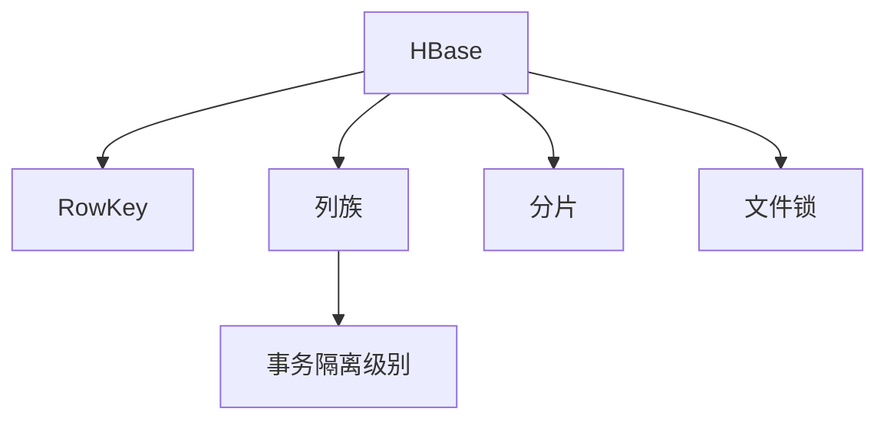

                 

# HBase RowKey设计原理与代码实例讲解

## 1. 背景介绍

### 1.1 问题由来
HBase是由Apache基金会开源的分布式非关系型数据库，其设计理念源于Google的BigTable。作为Hadoop生态系统的重要组成部分，HBase可以高效地存储海量结构化数据，并提供毫秒级响应时间，是互联网公司和大型企业中广泛使用的分布式数据库之一。

HBase具有如下特点：

- 高可靠性：三副本机制保证数据的一致性和持久性。
- 可扩展性：水平扩展能力强大，支持大规模数据存储。
- 高性能：具备高速读写能力，适用于高并发场景。
- 实时性：数据能够实时更新，适用于流式数据处理。

HBase的核心组件包括：

- Master：管理所有Region Server的元数据和表元数据。
- Region Server：处理数据读写请求，维护本地表数据。
- Region：HBase表数据的基本存储单位，可以进一步划分为多个Cell。

### 1.2 问题核心关键点
HBase RowKey设计是HBase架构中最为关键的核心概念之一。RowKey决定了数据的分布和访问方式，对性能、扩展性和查询效率有重要影响。设计良好的RowKey能够实现数据的均衡分布，提升查询效率，降低写入延迟。

RowKey设计主要涉及以下几个关键点：

- RowKey长度和范围：RowKey过长会导致性能下降，范围过窄则无法充分利用HBase的水平分区特性。
- 列族设计：合理的设计列族有助于提升查询性能和空间利用率。
- 事务隔离级别：不同事务隔离级别对数据的访问方式有重要影响，需要根据实际需求选择。

## 2. 核心概念与联系

### 2.1 核心概念概述

为更好地理解HBase RowKey设计，本节将介绍几个密切相关的核心概念：

- HBase：一种分布式非关系型数据库，用于存储海量结构化数据。
- RowKey：HBase中每个表的行键，用于唯一标识每行数据。
- 列族：HBase中的数据存储方式，分为多个列族和列族中的多个列。
- 事务隔离级别：HBase中的事务隔离级别，决定了数据访问的粒度和并发性。
- 分片(Split)：HBase中的数据分片机制，用于水平扩展。
- 文件锁：HBase中的文件锁机制，用于保证数据的一致性和完整性。

这些核心概念之间的逻辑关系可以通过以下Mermaid流程图来展示：



这个流程图展示了这个核心的关系：

1. HBase通过RowKey进行数据存储和访问。
2. 列族用于组织数据，合理设计列族能提升查询效率。
3. 事务隔离级别影响数据访问方式，选择合适的事务隔离级别是设计基础。
4. 分片机制用于数据水平扩展。
5. 文件锁保证数据一致性和完整性。

## 3. 核心算法原理 & 具体操作步骤

### 3.1 算法原理概述

HBase的RowKey设计主要依赖于分片(Split)机制。HBase会将数据按照RowKey划分成多个分片，并将分片分布在不同的Region Server上，实现数据的分布式存储。

分片(Split)机制的原理是：当一个Region中的数据增长到一定的阈值时，会自动分裂成两个新的Region。这样可以保证数据均衡分布，提升查询效率。

RowKey的设计对分片机制有重要影响。如果RowKey设计不合理，可能会导致数据不均衡分布，影响查询性能。因此，设计良好的RowKey是HBase性能优化和扩展的基础。

### 3.2 算法步骤详解

HBase RowKey设计的主要步骤如下：

**Step 1: 确定RowKey结构**
- RowKey应具有唯一性，且长度适中。
- 可以基于时间戳或ID号等唯一标识符进行设计。

**Step 2: 设计列族和列**
- 根据数据的访问模式，设计合适的列族和列。列族中应包含常用的查询字段。

**Step 3: 设置事务隔离级别**
- 根据数据访问模式和业务需求，选择合适的隔离级别。通常选择Read Committed或Read Uncommitted隔离级别。

**Step 4: 进行数据写入和读取**
- 使用put()方法进行数据写入，使用get()方法进行数据读取。

**Step 5: 监控和优化**
- 使用HBase监控工具监控RowKey性能，定期优化数据结构。

### 3.3 算法优缺点

HBase RowKey设计的优点包括：

- 设计合理的情况下，可以实现数据均衡分布，提升查询效率。
- 支持水平扩展，可存储海量数据。
- 具有高可用性和容错能力。

HBase RowKey设计的主要缺点包括：

- 设计不合理的情况下，可能会导致数据不均衡分布，影响查询性能。
- 处理大量随机写入请求时，可能导致性能下降。

### 3.4 算法应用领域

HBase RowKey设计主要应用于需要存储海量结构化数据的场景，例如：

- 网站访问日志
- 实时数据流处理
- 大规模数据分析
- 物联网数据存储
- 实时推荐系统

## 4. 数学模型和公式 & 详细讲解  
### 4.1 数学模型构建

HBase RowKey设计主要依赖于分片(Split)机制，其数学模型如下：

$$
\text{RowKey} = \text{Timestamp} + \text{ID}
$$

其中，Timestamp表示时间戳，ID表示唯一标识符。

### 4.2 公式推导过程

HBase在分片(Split)时，会将RowKey按照一定的规则进行划分。假设RowKey长度为L，每个分片的长度为K，则每个分片包含的行数为$2^{L-K}$。因此，合理设计RowKey长度和范围，可以有效控制数据分布，提升查询效率。

### 4.3 案例分析与讲解

假设需要存储用户访问日志，可以使用用户ID和时间戳作为RowKey。具体设计如下：

1. RowKey结构：$User ID + Timestamp$。
2. 列族设计：创建一个包含访问日志的列族`AccessLog`。
3. 事务隔离级别：选择Read Committed隔离级别。
4. 数据写入和读取：使用put()方法进行数据写入，使用get()方法进行数据读取。

## 5. 项目实践：代码实例和详细解释说明
### 5.1 开发环境搭建

在进行HBase RowKey设计实践前，我们需要准备好开发环境。以下是使用Python进行HBase开发的环境配置流程：

1. 安装Apache HBase：从官网下载并安装HBase。
2. 安装PyHBase：使用pip安装PyHBase库，用于Python与HBase的交互。

```bash
pip install pyhbase
```

3. 创建HBase表：使用HBase的shell命令创建表，并指定RowKey结构。

```bash
hbase shell
create 'AccessLog', 'AccessLog', 'AccessLog', 1, 320000
```

以上命令创建了一个名为`AccessLog`的表，并指定了列族`AccessLog`，RowKey结构为`AccessLog`。

### 5.2 源代码详细实现

下面给出一个使用PyHBase进行HBase RowKey设计的Python代码示例。

```python
from pyhbase.client import HBaseConnection
from pyhbase.util import hex_to_str, bytes_to_str

# 连接到HBase
connection = HBaseConnection('localhost:60000', 'hbase:root:hbase')

# 创建表
connection.create_table('AccessLog', 'AccessLog', 'AccessLog', 1, 320000)

# 写入数据
table = connection.table('AccessLog')
row_key = bytes_to_str('User001' + str(1000).encode('utf-8'))
cell = table.put(row_key, 'AccessLog', 'AccessDate', '2021-01-01', 0, 'AccessDetails')
table.close()

# 读取数据
row_key = hex_to_str(row_key)
result = table.get(row_key)
print(result)
```

以上代码演示了如何使用PyHBase创建HBase表、写入数据、读取数据等基本操作。在实际开发中，需要根据具体的业务需求，设计合理的RowKey结构，选择合适的列族和列，才能充分发挥HBase的性能优势。

### 5.3 代码解读与分析

让我们再详细解读一下关键代码的实现细节：

**PyHBase库的使用**：
- `HBaseConnection`：用于建立与HBase的连接。
- `hex_to_str`和`bytes_to_str`：用于转换RowKey的十六进制表示和字节表示。
- `table`：用于对HBase表进行操作。
- `put`方法：用于写入数据。
- `get`方法：用于读取数据。

**HBase表创建**：
- `create_table`方法：用于创建HBase表。
- 第一个参数为表名，第二个参数为列族，第三个参数为列族名称，第四个参数为RowKey长度，第五个参数为最大分片数。

**数据写入和读取**：
- `row_key`：使用用户ID和时间戳生成RowKey。
- `cell`：使用`put`方法写入数据。
- `result`：使用`get`方法读取数据。

## 6. 实际应用场景

### 6.1 网站访问日志

假设需要存储网站访问日志，可以使用用户ID和时间戳作为RowKey。具体设计如下：

1. RowKey结构：$User ID + Timestamp$。
2. 列族设计：创建一个包含访问日志的列族`AccessLog`。
3. 事务隔离级别：选择Read Committed隔离级别。
4. 数据写入和读取：使用put()方法进行数据写入，使用get()方法进行数据读取。

### 6.2 实时数据流处理

假设需要存储实时数据流，可以使用时间戳作为RowKey。具体设计如下：

1. RowKey结构：$Timestamp$。
2. 列族设计：创建一个包含数据流信息的列族`StreamLog`。
3. 事务隔离级别：选择Read Committed隔离级别。
4. 数据写入和读取：使用put()方法进行数据写入，使用get()方法进行数据读取。

### 6.3 大规模数据分析

假设需要存储大规模数据分析结果，可以使用任务ID和时间戳作为RowKey。具体设计如下：

1. RowKey结构：$Task ID + Timestamp$。
2. 列族设计：创建一个包含分析结果的列族`AnalysisResult`。
3. 事务隔离级别：选择Read Committed隔离级别。
4. 数据写入和读取：使用put()方法进行数据写入，使用get()方法进行数据读取。

## 7. 工具和资源推荐
### 7.1 学习资源推荐

为了帮助开发者系统掌握HBase RowKey设计的基础理论和实践技巧，这里推荐一些优质的学习资源：

1. HBase官方文档：HBase的官方文档详细介绍了HBase的基本概念、使用和操作。
2. Hadoop官方文档：Hadoop的官方文档提供了HBase的高级特性和架构原理。
3. 《Hadoop权威指南》书籍：这本书系统介绍了Hadoop生态系统的各个组件，包括HBase。
4. 《HBase实战》书籍：这本书提供了大量的HBase使用案例和最佳实践。
5. HBase Talks：Apache基金会官方博客，提供了HBase的最新动态和技术分享。

通过对这些资源的学习实践，相信你一定能够快速掌握HBase RowKey设计的精髓，并用于解决实际的业务问题。

### 7.2 开发工具推荐

高效的开发离不开优秀的工具支持。以下是几款用于HBase RowKey设计开发的常用工具：

1. HBase Shell：HBase的原生shell工具，方便进行HBase的日常管理和操作。
2. Hive：Hadoop的数据仓库工具，可以使用Hive SQL进行数据查询和管理。
3. Apache Zookeeper：HBase的元数据协调工具，用于管理HBase的分布式系统。
4. Flume：Apache的开源日志收集系统，可以用于收集和处理HBase的日志数据。
5. Grafana：开源的监控和报警系统，可以用于监控HBase的性能和健康状态。

合理利用这些工具，可以显著提升HBase RowKey设计的开发效率，加快创新迭代的步伐。

### 7.3 相关论文推荐

HBase RowKey设计的研究源于学界的持续研究。以下是几篇奠基性的相关论文，推荐阅读：

1. "A Scalable, Highly Available Fault Tolerant Metadata Storage System for BigData"：提出了HBase的基本架构和存储模型。
2. "HBase: A Hadoop-Based Distributed Database Management System"：介绍了HBase的核心组件和工作原理。
3. "Practical Guarantees for Ideal Time Bounds in HBase"：研究了HBase的时间保证机制和性能优化。
4. "Replication in HBase: A Fault-Tolerant Approach for Large-Scale Data Processing"：介绍了HBase的复制机制和容错能力。

这些论文代表了大语言模型RowKey设计的研究方向和进展。通过学习这些前沿成果，可以帮助研究者把握学科前进方向，激发更多的创新灵感。

## 8. 总结：未来发展趋势与挑战

### 8.1 总结

本文对HBase RowKey设计方法进行了全面系统的介绍。首先阐述了HBase RowKey设计的基本概念和背景，明确了RowKey在HBase性能和扩展性方面的重要性。其次，从原理到实践，详细讲解了HBase RowKey设计的数学模型和操作步骤，给出了具体的代码实例。同时，本文还广泛探讨了HBase RowKey设计在多个业务场景中的应用，展示了RowKey设计的广泛应用价值。最后，本文精选了HBase RowKey设计的各类学习资源，力求为读者提供全方位的技术指引。

通过本文的系统梳理，可以看到，HBase RowKey设计是HBase架构中最为关键的核心概念之一，对性能、扩展性和查询效率有重要影响。设计良好的RowKey能够实现数据的均衡分布，提升查询效率，降低写入延迟。未来，伴随HBase和Hadoop生态系统的不断发展，RowKey设计技术也将不断演进，为大规模数据的存储和处理提供更为可靠和高效的基础保障。

### 8.2 未来发展趋势

展望未来，HBase RowKey设计将呈现以下几个发展趋势：

1. 分片机制优化：随着数据量的增长，合理设计分片数和分片长度，避免分片过多导致查询效率下降。
2. 多RowKey结构：基于业务需求，设计多种RowKey结构，实现数据的多维关联存储和查询。
3. 自动扩缩容：通过优化RowKey和分片机制，实现自动扩缩容功能，提升系统稳定性和可用性。
4. 数据压缩和归档：根据数据特点，采用不同的数据压缩和归档策略，优化存储空间使用。
5. 混合存储和SSD使用：结合HDFS和SSD存储技术，实现混合存储，提升读写性能。
6. 实时查询优化：针对实时数据流，设计高效的时序查询算法，提升查询效率。

以上趋势凸显了HBase RowKey设计的广阔前景。这些方向的探索发展，必将进一步提升HBase性能和扩展性，为大规模数据的存储和处理提供更加可靠和高效的基础保障。

### 8.3 面临的挑战

尽管HBase RowKey设计已经取得了显著成果，但在迈向更加智能化、普适化应用的过程中，它仍面临着诸多挑战：

1. 数据模型复杂性：HBase的行模型相对复杂，需要精心设计以实现高效查询和存储。
2. 性能瓶颈问题：当数据量增长时，数据写入和查询性能可能受到影响，需要优化RowKey和分片设计。
3. 数据一致性问题：不同事务隔离级别对数据的访问方式有重要影响，需要平衡读写性能和数据一致性。
4. 资源优化问题：大规模数据存储和处理需要优化资源使用，避免资源浪费和瓶颈。
5. 数据安全问题：HBase的数据安全和隐私保护问题需进一步加强，确保数据安全和合规。

### 8.4 研究展望

面对HBase RowKey设计所面临的种种挑战，未来的研究需要在以下几个方面寻求新的突破：

1. 优化RowKey设计：通过优化RowKey长度和范围，实现数据的均衡分布和高效查询。
2. 提升分片机制：改进分片长度和数量，优化分片机制，提升数据存储和查询效率。
3. 提高事务隔离级别：引入新的事务隔离级别，平衡读写性能和数据一致性。
4. 优化数据模型：通过合理设计列族和列，提升数据模型和查询效率。
5. 引入新数据类型：结合NoSQL和SQL特性，引入新数据类型，提升数据存储和查询能力。
6. 增强系统稳定性：通过优化RowKey和分片设计，提升系统稳定性和可用性。

这些研究方向的探索，必将引领HBase RowKey设计技术迈向更高的台阶，为大规模数据的存储和处理提供更为可靠和高效的基础保障。面向未来，HBase RowKey设计技术还需要与其他数据技术进行更深入的融合，如NoSQL和SQL的融合、流处理技术等，多路径协同发力，共同推动数据技术的进步。只有勇于创新、敢于突破，才能不断拓展RowKey设计的边界，让HBase系统更好地服务业务需求。

## 9. 附录：常见问题与解答

**Q1：HBase RowKey设计是否适用于所有业务场景？**

A: HBase RowKey设计适用于需要存储海量结构化数据的场景，例如网站访问日志、实时数据流处理、大规模数据分析等。但对于一些需要高精度、低延迟的业务场景，如金融交易等，可能需要考虑使用其他数据库。

**Q2：HBase的行模型相对复杂，如何设计一个合理的RowKey？**

A: 设计合理的RowKey需要根据业务需求和数据特点进行考虑。通常可以从以下几个方面入手：

1. 唯一性：RowKey应具有唯一性，避免数据重复。
2. 范围：RowKey长度和范围应适中，避免过长或过短。
3. 数据关联：RowKey应考虑数据之间的关联性，便于查询和统计。
4. 索引优化：设计RowKey时，考虑如何优化索引，提升查询效率。

**Q3：HBase的事务隔离级别如何影响查询性能？**

A: HBase的事务隔离级别对查询性能有重要影响。不同的隔离级别决定了数据的访问方式，可能影响数据的一致性和查询效率。通常选择Read Committed隔离级别，以平衡读写性能和数据一致性。

**Q4：HBase的行模型如何支持高并发写入？**

A: HBase的行模型支持高并发写入，可以通过合理的RowKey设计和分片机制，实现数据的均衡分布和高效写入。

**Q5：HBase如何保证数据一致性和完整性？**

A: HBase通过文件锁机制和复制机制保证数据的一致性和完整性。每个Region Server保存多份数据，并提供快速的数据复制和备份功能。

总之，HBase RowKey设计需要根据业务需求和数据特点进行精心设计，以实现高效存储和查询。设计良好的RowKey是HBase性能优化和扩展的基础，未来需要在优化RowKey设计、提升分片机制、提高事务隔离级别等方面进行不断探索和改进，为大规模数据的存储和处理提供更加可靠和高效的基础保障。

