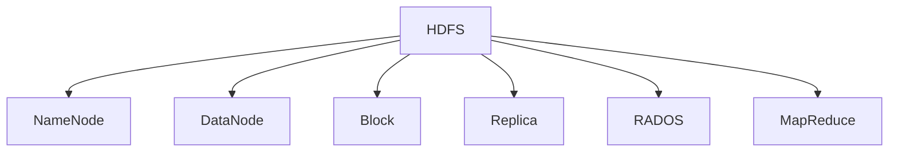

                 

# Hadoop分布式文件系统HDFS原理与代码实例讲解

## 1. 背景介绍

### 1.1 问题由来
随着互联网和大型数据中心的兴起，数据存储的需求量呈指数级增长。单个集中式存储系统难以处理海量数据的读写，高可用性、高可扩展性、高性能成为数据存储系统的核心需求。Hadoop分布式文件系统（Hadoop Distributed File System, HDFS）应运而生，它是一种高度可扩展的分布式文件系统，具有高可靠性、高容错性和高可扩展性。

HDFS最初由Apache Hadoop项目组开发，主要目标是实现大规模数据存储和处理，支持海量数据的分布式存储和访问。HDFS被广泛应用于互联网公司如Google、Facebook、Amazon等，以及大数据生态系统中，成为了数据存储和处理的基础设施。

### 1.2 问题核心关键点
HDFS的设计目标是解决传统集中式文件系统面临的可扩展性、容错性和高性能等挑战。其核心设计思想包括以下几点：
1. **数据分布式存储**：通过在集群中分布式存储数据，提升系统的可扩展性。
2. **数据冗余**：通过数据的三份复制，实现数据的容错性。
3. **高吞吐量**：通过设计高效的文件块读写机制，提高系统性能。
4. **可靠性和一致性**：通过分布式锁和心跳机制，确保数据的一致性和可靠性。

## 2. 核心概念与联系

### 2.1 核心概念概述

为了更好地理解HDFS的工作原理和架构，本节将介绍几个密切相关的核心概念：

- HDFS：Hadoop分布式文件系统，是Hadoop生态系统中的核心组件之一。通过将数据分散存储在多个节点上，实现高可扩展性和高容错性。
- NameNode：HDFS的管理节点，负责维护文件系统的元数据，包括文件名、文件位置、块信息等。
- DataNode：HDFS的数据存储节点，负责存储实际数据块。
- Block：数据在HDFS中最小的存储单位，大小为64MB或128MB。
- Replica：数据块的三份副本，通过分布在不同的DataNode上实现数据冗余和容错。
- RADOS：Hadoop的分布式存储系统，建立在HDFS之上，提供高可靠性的数据存储服务。
- MapReduce：Hadoop的核心计算框架，与HDFS紧密集成，支持大规模数据处理。

这些核心概念之间的逻辑关系可以通过以下Mermaid流程图来展示：



这个流程图展示了大数据生态系统中的关键组件及其之间的联系：

1. HDFS作为基础文件系统，负责数据的分布式存储。
2. NameNode管理文件系统元数据。
3. DataNode存储实际数据块。
4. Block是数据存储的基本单位。
5. Replica通过复制数据块实现数据的冗余和容错。
6. RADOS建立在HDFS之上，提供更高层次的数据存储服务。
7. MapReduce利用HDFS进行大规模数据处理。

## 3. 核心算法原理 & 具体操作步骤

### 3.1 算法原理概述

HDFS的核心设计思想是通过分布式存储和冗余存储，实现数据的可靠性和可扩展性。其算法原理主要包括以下几个关键点：

- **数据分块**：将大文件分割成多个块，每个块大小固定，适合大文件存储。
- **数据复制**：通过在不同节点上复制数据块，实现数据的冗余和容错。
- **元数据管理**：NameNode负责维护文件系统的元数据，包括文件名、位置和块信息。
- **文件访问控制**：通过权限管理，实现文件的安全访问。
- **数据读写优化**：通过高效的文件块读写机制，提高系统性能。

### 3.2 算法步骤详解

HDFS的部署和数据访问主要包括以下几个关键步骤：

**Step 1: 部署NameNode和DataNode**
- 部署NameNode：作为文件系统的管理节点，负责维护文件系统的元数据。
- 部署DataNode：作为数据存储节点，负责存储实际数据块。

**Step 2: 初始化文件系统**
- 通过命令行或脚本，初始化文件系统，创建文件目录。
- 在NameNode上创建文件系统的命名空间，包括文件、目录和数据块信息。

**Step 3: 上传数据**
- 使用Hadoop命令行工具（如hdfs dfs），上传数据到文件系统中。
- HDFS会将数据分割成块，并在不同的DataNode上存储副本。

**Step 4: 数据访问**
- 使用Hadoop命令行工具访问文件系统，包括创建文件、下载文件、删除文件等操作。
- 文件访问过程中，NameNode负责元数据管理，DataNode负责数据读写。

**Step 5: 监控与维护**
- 使用Hadoop提供的监控工具，如Hadoop Filesystem Command Interface (HDFS CLI)，监控文件系统的状态。
- 定期进行数据备份和恢复，确保数据的安全性和可靠性。

### 3.3 算法优缺点

HDFS作为一种分布式文件系统，具有以下优点：
1. 高可扩展性：通过数据分块和分布式存储，实现系统的高可扩展性。
2. 高容错性：通过数据复制，实现数据的冗余和容错。
3. 高可靠性：通过心跳机制和数据校验，确保数据的可靠性。
4. 高性能：通过高效的数据块读写机制，提高系统的性能。
5. 易于管理：通过集中化的管理节点，简化系统维护和管理。

同时，HDFS也存在一定的局限性：
1. 文件大小限制：单个文件大小有限制，一般不超过128GB。
2. 数据访问延迟：由于数据分布在多个节点上，数据访问延迟较大。
3. 单点故障问题：NameNode是文件系统的核心组件，一旦出现问题，整个文件系统将无法访问。

尽管存在这些局限性，但就目前而言，HDFS仍是大数据生态系统中的重要组件，广泛应用于互联网公司和大型数据中心。

### 3.4 算法应用领域

HDFS作为一种分布式文件系统，广泛应用于以下领域：

- 大数据处理：HDFS与MapReduce集成，支持大规模数据的分布式处理。
- 数据备份和恢复：通过数据复制，实现数据的冗余和容错，提高系统的可靠性。
- 数据分析和挖掘：支持海量数据的存储和访问，为数据分析和挖掘提供了基础。
- 高可用性应用：通过分布式存储和冗余存储，提高系统的可用性和容错性。
- 数据共享和协作：支持多用户对数据的共享和协作，促进数据的广泛利用。

## 4. 数学模型和公式 & 详细讲解 & 举例说明

### 4.1 数学模型构建

HDFS的数学模型主要集中在文件系统的命名空间、数据块的管理和复制机制等方面。

假设文件系统中的文件名集合为 $F$，文件大小为 $S$，数据块大小为 $B$，块数为 $N$，则每个块的大小为 $B = \frac{S}{N}$。假设数据块的复制因子为 $R$，则每个数据块的副本数为 $R = 3$。

### 4.2 公式推导过程

HDFS的数学模型推导主要涉及以下几个方面：

1. **文件命名空间**：文件系统的命名空间由树形结构表示，每个文件和目录可以包含多个子文件和子目录。假设文件系统中有 $n$ 个文件和 $d$ 个目录，则总的命名空间节点数为 $n + d$。

2. **数据块管理**：每个文件被分割成多个数据块，每个数据块大小固定，为 $B$。假设文件大小为 $S$，块数为 $N$，则有 $N = \frac{S}{B}$。

3. **数据复制**：通过在多个DataNode上复制数据块，实现数据的冗余和容错。假设数据块的复制因子为 $R$，则每个数据块有 $R$ 个副本，分布在不同的DataNode上。

### 4.3 案例分析与讲解

以HDFS中文件数据的存储和复制为例，进行详细讲解：

假设文件大小为 $S=10GB$，数据块大小为 $B=128MB$，则块数为 $N=\frac{10GB}{128MB}=78125$。

通过数据复制，每个数据块有3个副本，分布在不同的DataNode上。假设数据块的冗余存储策略为3个副本，每个副本分别存储在不同的DataNode上，则共有 $3 \times 78125 = 234375$ 个数据块副本，分布在 $234375 / 3 = 78125$ 个DataNode上。

## 5. 项目实践：代码实例和详细解释说明

### 5.1 开发环境搭建

在进行HDFS的部署和数据存储实践前，需要先搭建开发环境。以下是使用Linux系统搭建HDFS环境的步骤：

1. 安装Hadoop：从官方网站下载并安装Hadoop，选择适合当前系统的安装包。
2. 配置Hadoop环境：在 `$HADOOP_HOME/etc/hadoop` 目录下找到 `hdfs-site.xml` 和 `core-site.xml` 配置文件，并根据实际需求进行修改。
3. 启动Hadoop服务：在终端执行 `start-dfs.sh` 和 `start-yarn.sh` 命令，启动Hadoop集群。

### 5.2 源代码详细实现

下面我们以创建一个新的HDFS目录为例，给出HDFS的Python代码实现。

```python
from hadoop.fs import HdfsFileSystem
import os

# 连接HDFS
fs = HdfsFileSystem.get("hdfs://localhost:9000")

# 创建新的HDFS目录
fs.mkdir("mydir")

# 上传文件
with open("example.txt", "rb") as f:
    data = f.read()
    fs.put("example.txt", data, overwrite=True)

# 删除文件
fs.delete("example.txt", recursive=True)

# 列出HDFS目录
for filename in fs.listdir("/"):
    print(filename)
```

### 5.3 代码解读与分析

让我们再详细解读一下关键代码的实现细节：

**HdfsFileSystem类**：
- `get`方法：连接HDFS，需要传入HDFS地址。
- `mkdir`方法：创建新的HDFS目录。
- `put`方法：上传文件到HDFS，需要传入文件路径和数据。
- `delete`方法：删除HDFS文件，可以传入递归参数，删除所有文件。
- `listdir`方法：列出HDFS目录中的文件和目录。

**上传文件**：
- 使用 `open` 函数读取本地文件，将其转换为字节流。
- 调用 `fs.put` 方法上传文件到HDFS，传入文件路径和数据，同时设置 `overwrite=True`，确保覆盖同名文件。

**删除文件**：
- 调用 `fs.delete` 方法删除文件，同时传入 `recursive=True`，表示递归删除。

**列出目录**：
- 使用 `fs.listdir` 方法列出HDFS目录，遍历返回的文件和目录，并打印输出。

通过以上代码实现，可以快速完成HDFS的基本操作，包括创建目录、上传文件、删除文件和列出目录等。

### 5.4 运行结果展示

在实际运行上述代码后，HDFS目录和文件的操作结果如下：

- 创建目录：`hdfs://localhost:9000/mydir` 目录创建成功。
- 上传文件：`hdfs://localhost:9000/mydir/example.txt` 文件上传成功。
- 删除文件：`hdfs://localhost:9000/mydir/example.txt` 文件删除成功。
- 列出目录：`example.txt` 文件在 HDFS 中列出成功。

以上操作展示了HDFS的基本功能，通过简单的Python代码实现，可以快速验证HDFS的部署和数据操作。

## 6. 实际应用场景

### 6.1 企业级数据仓库

HDFS在企业级数据仓库中得到了广泛应用。企业级数据仓库需要存储海量数据，支持多用户并发访问和复杂的数据查询。通过将数据存储在HDFS上，企业级数据仓库可以轻松应对大规模数据处理的需求。

### 6.2 大规模数据处理

HDFS与MapReduce紧密集成，支持大规模数据处理。HDFS提供高可靠性的数据存储，MapReduce则提供高效的大规模数据处理能力，二者协同工作，实现大规模数据处理的高可靠性和高效率。

### 6.3 大数据分析

HDFS作为大数据分析的基础设施，支持海量数据的存储和访问。企业可以通过HDFS存储海量日志、事务记录等数据，利用大数据分析技术，从中挖掘有价值的信息，支持决策支持系统和业务智能化。

### 6.4 未来应用展望

随着互联网和物联网的广泛应用，数据量呈指数级增长。HDFS作为分布式文件系统，能够轻松应对大规模数据的存储和处理需求。未来，HDFS将进一步发展，支持更多的数据存储和处理场景，如实时数据处理、数据湖、数据管道等。

## 7. 工具和资源推荐

### 7.1 学习资源推荐

为了帮助开发者系统掌握HDFS的理论基础和实践技巧，这里推荐一些优质的学习资源：

1. Hadoop官方文档：详细介绍了Hadoop的安装、配置和基本操作。
2. Hadoop入门教程：通过实例讲解HDFS的部署和数据存储操作。
3. HDFS高级编程：深入讲解HDFS的高级编程技巧和优化方法。
4. HDFS最佳实践：通过实际案例，介绍HDFS的最佳实践和注意事项。
5. Hadoop生态系统：全面介绍Hadoop生态系统中的各个组件和工具，包括HDFS、MapReduce、YARN等。

通过对这些资源的学习实践，相信你一定能够快速掌握HDFS的技术细节，并用于解决实际的数据存储和处理问题。

### 7.2 开发工具推荐

高效的开发离不开优秀的工具支持。以下是几款用于HDFS开发的常用工具：

1. Hadoop命令行工具：用于HDFS和MapReduce的基本操作，包括文件上传、下载、目录管理等。
2. HDFS CLI：Hadoop提供的命令行工具，可以用于管理HDFS文件系统，包括创建目录、上传文件、删除文件等操作。
3. Hadoop Web UI：通过浏览器访问HDFS的Web界面，可视化地监控HDFS状态和文件访问情况。
4. Hadoop REST API：提供RESTful接口，可以通过HTTP请求访问和管理HDFS文件系统。
5. Apache Cloudera Manager：用于Hadoop集群的统一管理和监控，支持自动化配置和故障排除。

合理利用这些工具，可以显著提升HDFS的开发效率，加快实验迭代的步伐。

### 7.3 相关论文推荐

HDFS作为Hadoop生态系统的重要组成部分，近年来在理论研究和工程实践中得到了广泛关注。以下是几篇奠基性的相关论文，推荐阅读：

1. The Hadoop Distributed File System (HDFS)（HDFS原论文）：介绍了HDFS的设计思想和实现细节，是了解HDFS的必读论文。
2. Hadoop: Simplifying Data Processing on Large Clusters：阐述了Hadoop的整体架构和设计思路，包括HDFS和MapReduce等组件。
3. HDFS: A Distributed File System for the Google File System（GFS）论文：介绍了Google File System的设计和实现，为HDFS提供了重要的借鉴。
4. MapReduce: Simplified Data Processing on Large Clusters：阐述了MapReduce的设计和实现，是Hadoop的重要组成部分。
5. HDFS Reliability and Fault Tolerance：介绍了HDFS的可靠性和容错性机制，是理解HDFS性能和安全性的重要基础。

这些论文代表了大数据文件系统的研究进展，通过学习这些前沿成果，可以帮助研究者把握学科前进方向，激发更多的创新灵感。

## 8. 总结：未来发展趋势与挑战

### 8.1 总结

本文对Hadoop分布式文件系统HDFS的原理和实践进行了全面系统的介绍。首先阐述了HDFS的设计目标和核心思想，明确了HDFS在企业级数据存储和处理中的独特价值。其次，从原理到实践，详细讲解了HDFS的部署和数据访问过程，给出了HDFS的Python代码实现，展示了HDFS的基本功能。同时，本文还广泛探讨了HDFS在企业级数据仓库、大规模数据处理和大数据分析中的应用场景，展示了HDFS的广泛适用性和重要地位。此外，本文精选了HDFS的相关学习资源，力求为读者提供全方位的技术指引。

通过本文的系统梳理，可以看到，HDFS作为一种分布式文件系统，已经在数据存储和处理中占据重要地位，成为大数据生态系统中的核心组件。未来，HDFS将继续演化，提供更丰富的功能，支持更多的数据存储和处理场景。

### 8.2 未来发展趋势

展望未来，HDFS的发展趋势主要体现在以下几个方面：

1. 高可靠性和高可用性：HDFS将进一步优化数据冗余和容错机制，确保数据的可靠性，支持更多高可用性应用。
2. 高性能和大容量：HDFS将优化数据访问机制，提高系统的性能，支持更大规模的数据存储和处理。
3. 实时数据处理：HDFS将引入实时数据处理功能，支持实时数据采集、存储和分析，满足大数据分析的实时需求。
4. 数据湖和数据管道：HDFS将支持数据湖和数据管道，构建一体化的数据存储和处理平台，支持数据的无缝流动和共享。
5. 多云和混合云：HDFS将支持多云和混合云环境，提供跨云数据存储和处理能力，支持多云环境下的数据治理和优化。

以上趋势凸显了HDFS的广阔前景，在未来的企业级数据处理中，HDFS将扮演越来越重要的角色。

### 8.3 面临的挑战

尽管HDFS已经在数据存储和处理中占据重要地位，但在迈向更加智能化、普适化应用的过程中，仍面临诸多挑战：

1. 数据一致性和性能：如何平衡数据一致性和系统性能，确保数据的可靠性和高效性，是HDFS的重要挑战。
2. 数据安全和隐私：如何保护数据安全和隐私，避免数据泄露和恶意访问，是HDFS面临的另一个重要问题。
3. 数据处理延迟：在大规模数据处理过程中，数据访问延迟是性能瓶颈，如何优化数据访问机制，提高处理速度，是HDFS需要解决的难题。
4. 多租户管理：如何在多租户环境中，实现资源的公平分配和优化调度，满足不同租户的需求，是HDFS未来需要优化的问题。
5. 高扩展性和低成本：如何在保证高可扩展性的同时，降低系统成本，提升资源利用率，是HDFS需要不断优化的问题。

### 8.4 研究展望

面对HDFS面临的诸多挑战，未来的研究需要在以下几个方面寻求新的突破：

1. 分布式数据存储和处理：开发更高效的数据存储和处理算法，支持更大规模的数据处理，提高系统的性能和可扩展性。
2. 数据安全和隐私保护：开发更先进的数据安全和隐私保护技术，确保数据的安全性和隐私性。
3. 数据访问优化：开发更高效的数据访问机制，优化数据访问路径，提高数据访问速度。
4. 多租户管理和资源调度：开发更高效的多租户管理和资源调度算法，实现资源的公平分配和优化调度。
5. 数据湖和数据管道：开发更完善的数据湖和数据管道技术，支持数据的无缝流动和共享，实现数据的深度利用。

这些研究方向将引领HDFS技术的发展，推动HDFS走向更加智能化、普适化的未来。

## 9. 附录：常见问题与解答

**Q1：HDFS和本地文件系统的区别是什么？**

A: HDFS和本地文件系统的区别主要体现在数据存储和访问机制上。

1. 数据存储：HDFS将数据分散存储在多个节点上，通过数据冗余实现数据的容错和可靠性；而本地文件系统将数据存储在单个节点上，数据访问速度较快。

2. 数据访问：HDFS需要经过NameNode进行元数据管理，数据访问速度较慢；而本地文件系统直接访问文件系统，数据访问速度较快。

3. 可扩展性：HDFS具有高可扩展性，支持海量数据的存储和访问；而本地文件系统的扩展性有限，只能存储单个节点的数据。

**Q2：如何优化HDFS的性能？**

A: 优化HDFS性能主要从以下几个方面入手：

1. 数据块大小：适当调整数据块大小，提高数据访问速度和系统性能。
2. 数据复制：合理设置数据复制因子，避免数据冗余和资源浪费。
3. 数据访问路径：优化数据访问路径，避免热点数据访问。
4. 数据缓存：使用HDFS缓存机制，减少数据读取延迟。
5. 资源优化：合理分配和优化资源，避免资源浪费和瓶颈。
6. 多租户管理：优化多租户管理算法，实现资源的公平分配和优化调度。

**Q3：HDFS的可靠性和容错性如何保证？**

A: HDFS的可靠性和容错性主要通过以下机制实现：

1. 数据冗余：通过在多个DataNode上复制数据块，实现数据的冗余和容错。
2. 数据校验：通过数据校验机制，确保数据的一致性和完整性。
3. 分布式锁：通过分布式锁机制，实现数据的互斥访问，避免数据冲突。
4. 心跳机制：通过心跳机制，检测和恢复DataNode的状态，确保系统的稳定性。

**Q4：如何保护HDFS数据的安全性和隐私性？**

A: 保护HDFS数据的安全性和隐私性主要通过以下措施：

1. 数据加密：使用数据加密技术，保护数据的安全性。
2. 访问控制：使用访问控制机制，限制数据的访问权限，避免未授权访问。
3. 审计日志：使用审计日志机制，记录数据的访问和使用情况，进行异常检测和追踪。
4. 权限管理：使用权限管理机制，实现数据的安全隔离和权限控制。

以上解答展示了HDFS在部署、数据存储、访问和优化等方面的常见问题和解决方案，帮助开发者更好地理解和使用HDFS技术。

---

作者：禅与计算机程序设计艺术 / Zen and the Art of Computer Programming

