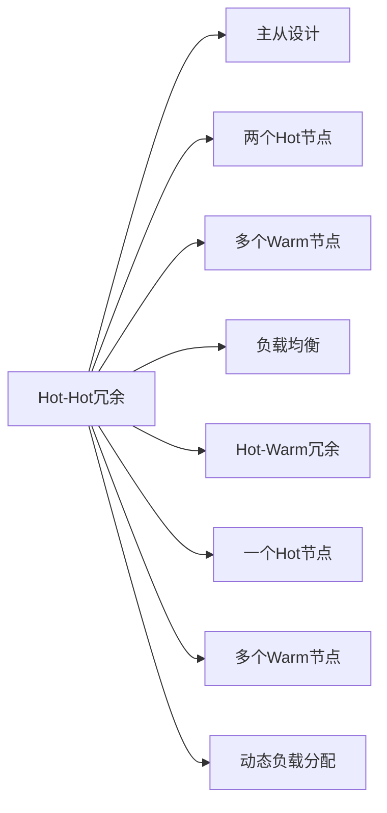

                 

## 1. 背景介绍

在现代软件开发中，冗余设计是提高系统健壮性和可用性的重要手段。Hot-Hot与Hot-Warm冗余设计是两种常见的冗余策略，广泛应用于分布式系统和云计算环境中。本文将详细介绍这两种冗余设计，分析其优缺点，并通过实际案例展示如何应用这些设计。

## 2. 核心概念与联系

### 2.1 核心概念概述

#### Hot-Hot冗余

Hot-Hot冗余是一种主从设计的冗余策略，其中两个热备用（Hot）节点负责承担主要的计算任务，而一个或多个暖备（Warm）节点作为备份，一旦Hot节点发生故障，Warm节点将接管其负载。

#### Hot-Warm冗余

Hot-Warm冗余是一种更加灵活的冗余策略，由一个热节点（Hot）和一个或多个暖节点（Warm）组成。Hot节点始终处于活跃状态，负责主要计算任务，而Warm节点则根据负载情况动态参与，提供额外的计算能力。

这两种冗余策略在云平台和分布式系统中广泛应用，主要用于提高系统的可靠性、可用性和可扩展性。

### 2.2 核心概念原理和架构的 Mermaid 流程图



从图中可以看出，Hot-Hot冗余是典型的主从设计，Hot节点负责主要的计算任务，Warm节点作为备份。而Hot-Warm冗余则更加灵活，Hot节点负责主要任务，Warm节点根据负载情况动态参与。

## 3. 核心算法原理 & 具体操作步骤

### 3.1 算法原理概述

Hot-Hot与Hot-Warm冗余设计的基本原理是提高系统的可靠性与可用性，通过将计算任务分散到多个节点上，以减少单点故障风险。其核心在于：

- Hot-Hot冗余：通过两个Hot节点的并行处理，提高系统的计算能力，Warm节点作为备份，一旦Hot节点发生故障，Warm节点立即接管其负载，确保系统的持续运行。
- Hot-Warm冗余：通过一个Hot节点和一个或多个Warm节点的协作，动态调整计算资源分配，根据负载情况灵活调度任务，实现高效资源利用。

### 3.2 算法步骤详解

#### Hot-Hot冗余算法步骤

1. **初始化配置**：确定Hot-Hot冗余中的Hot节点和Warm节点，并进行网络配置和负载均衡器配置。
2. **计算任务分配**：将计算任务分配到Hot节点上，Warm节点作为备份。
3. **监控Hot节点状态**：实时监控Hot节点的运行状态，如CPU、内存、网络等。
4. **Hot节点故障处理**：一旦Hot节点发生故障，立即将其任务转移到Warm节点，确保系统持续运行。
5. **Warm节点激活**：Warm节点激活，接管Hot节点的负载，保持系统的正常运行。

#### Hot-Warm冗余算法步骤

1. **初始化配置**：确定Hot-Warm冗余中的Hot节点和Warm节点，并进行网络配置和负载均衡器配置。
2. **计算任务分配**：将计算任务分配到Hot节点上，Warm节点初始作为备份。
3. **动态负载分配**：根据Hot节点的负载情况，动态调整任务分配到Warm节点，确保资源优化。
4. **Hot节点故障处理**：一旦Hot节点发生故障，Warm节点立即激活，接管Hot节点的负载。
5. **Warm节点动态调整**：根据Hot节点的恢复情况，动态调整Warm节点的参与度，优化资源分配。

### 3.3 算法优缺点

#### Hot-Hot冗余优缺点

**优点**：
- 系统可靠性高，Hot节点故障时能够迅速切换到Warm节点，保持系统持续运行。
- 计算能力分布均衡，通过Hot-Hot并行处理，提升整体系统性能。

**缺点**：
- Hot节点故障切换时可能会产生一定的计算停顿，影响系统响应时间。
- Hot节点和Warm节点的配置和管理较为复杂，需要额外的资源和维护成本。

#### Hot-Warm冗余优缺点

**优点**：
- 灵活性高，Warm节点根据负载动态参与，灵活调整资源分配。
- Hot节点故障切换更加平滑，Warm节点迅速接管负载，保持系统持续运行。

**缺点**：
- 动态负载分配需要实时监控和调度，管理复杂度较高。
- Hot-Warm节点的切换和动态调整可能会增加系统复杂度，影响系统稳定性和性能。

### 3.4 算法应用领域

Hot-Hot与Hot-Warm冗余设计广泛应用于云计算、分布式计算、网络服务等领域，例如：

- 云平台中的负载均衡与故障恢复：Amazon AWS、Microsoft Azure等云平台广泛采用Hot-Hot或Hot-Warm冗余策略，确保云计算服务的可靠性和可用性。
- 分布式数据库与存储系统：如Hadoop、MongoDB等分布式系统，使用Hot-Warm冗余设计，提高系统的可扩展性和容错能力。
- 高可用网络服务：如Kubernetes、Docker Swarm等容器编排平台，通过Hot-Hot或Hot-Warm冗余设计，提升容器服务的稳定性和高可用性。

## 4. 数学模型和公式 & 详细讲解 & 举例说明

### 4.1 数学模型构建

#### Hot-Hot冗余模型

设Hot节点为$H_1$和$H_2$，Warm节点为$W$，假设每个节点的计算能力为$c$，系统的总计算任务为$T$。

模型假设如下：
- Hot节点$H_1$和$H_2$同时在线，共同分担计算任务。
- Warm节点$W$作为备份，一旦Hot节点$H_1$或$H_2$发生故障，$W$立即接管其负载。
- Hot节点$H_1$和$H_2$的任务分配比例为1:1，即$\frac{T}{2}$。

#### Hot-Warm冗余模型

设Hot节点为$H$，Warm节点为$W_1, W_2, \ldots, W_n$，假设每个节点的计算能力为$c$，系统的总计算任务为$T$。

模型假设如下：
- Hot节点$H$始终在线，承担主要的计算任务。
- Warm节点$W_i$根据Hot节点$H$的负载情况动态参与，分配比例为$k_i \in [0, 1]$。
- 总计算任务$T$在Hot节点和Warm节点之间动态分配，即$T \times k_i$。

### 4.2 公式推导过程

#### Hot-Hot冗余公式推导

Hot-Hot冗余中，Hot节点$H_1$和$H_2$的负载均衡分配为：

$$
\frac{T}{2} = c \times (t_{H_1} + t_{H_2})
$$

其中$t_{H_1}$和$t_{H_2}$分别为Hot节点$H_1$和$H_2$的负载。

当Hot节点$H_1$故障时，Warm节点$W$立即接管其任务，此时系统的总负载为：

$$
T = c \times (t_{H_2} + t_{W})
$$

其中$t_{W}$为Warm节点$W$的负载。

#### Hot-Warm冗余公式推导

Hot-Warm冗余中，Hot节点$H$和Warm节点$W_i$的任务分配为：

$$
T = c \times (t_H + t_{W_1} + t_{W_2} + \ldots + t_{W_n})
$$

其中$t_H$为Hot节点$H$的负载，$t_{W_i}$为Warm节点$W_i$的负载。

当Hot节点$H$的负载达到$T \times \frac{1}{2}$时，Warm节点$W_i$开始参与计算，此时Warm节点$W_i$的任务分配比例为：

$$
k_i = \frac{T - t_H}{T}
$$

其中$k_i$为Warm节点$W_i$的任务分配比例。

### 4.3 案例分析与讲解

#### Hot-Hot冗余案例

假设某公司部署两个Hot节点和三个Warm节点，每个节点的计算能力为$100GPS$，系统的总计算任务为$1000GPS$。

1. Hot节点$H_1$和$H_2$同时在线，共同分担计算任务，每个Hot节点承担$500GPS$的任务。
2. 当Hot节点$H_1$发生故障时，Warm节点$W$立即接管其任务，Warm节点$W$承担$500GPS$的任务。
3. 系统总负载为$1000GPS$，Hot节点$H_2$和Warm节点$W$的负载均衡分配为$500GPS$。

#### Hot-Warm冗余案例

假设某公司部署一个Hot节点和三个Warm节点，每个节点的计算能力为$100GPS$，系统的总计算任务为$1000GPS$。

1. Hot节点$H$始终在线，承担主要的计算任务$500GPS$。
2. Warm节点$W_1, W_2, W_3$根据Hot节点$H$的负载情况动态参与，当Hot节点$H$的负载达到$500GPS$时，Warm节点$W_1$开始参与计算，承担$200GPS$的任务。
3. 当Hot节点$H$的负载达到$1000GPS$时，Warm节点$W_1$承担$500GPS$的任务。

## 5. 项目实践：代码实例和详细解释说明

### 5.1 开发环境搭建

#### 环境依赖

- Linux系统，推荐使用Ubuntu或CentOS。
- Java Development Kit (JDK) 1.8及以上版本。
- Docker环境，用于虚拟化部署。
- Elastic Kubernetes（EK）集群，用于容器编排。

#### 搭建步骤

1. **安装Docker**：在Linux系统中安装Docker，并配置Docker网络。
2. **搭建EK集群**：使用Minikube或kubeadm等工具搭建EK集群，确保集群稳定运行。
3. **部署Hot-Hot冗余应用**：在Docker中构建Hot-Hot冗余应用的镜像，并将其部署到EK集群中。
4. **部署Hot-Warm冗余应用**：在Docker中构建Hot-Warm冗余应用的镜像，并将其部署到EK集群中。

### 5.2 源代码详细实现

#### Hot-Hot冗余实现

```java
import com.sun.org.apache.xerces.internal.jaxp.DocumentBuilderFactory;
import javax.xml.parsers.DocumentBuilder;
import org.w3c.dom.Document;
import org.w3c.dom.Element;

public class HotHotRedundancy {
    private static final String HOT_HOST_1 = "host1";
    private static final String HOT_HOST_2 = "host2";
    private static final String WARM_HOST = "warm";

    public static void main(String[] args) {
        // 初始化Hot-Hot冗余配置
        initConfiguration();

        // 监控Hot节点状态，一旦Hot节点1发生故障，立即切换到Hot节点2
        monitorHotNodes();

        // 启动Hot-Hot冗余应用
        startApplication();
    }

    private static void initConfiguration() {
        // 初始化Hot节点和Warm节点的配置
        DocumentBuilderFactory dbf = DocumentBuilderFactory.newInstance();
        DocumentBuilder db = dbf.newDocumentBuilder();
        Document doc = db.newDocument();
        Element hotHost1 = doc.createElement(HOT_HOST_1);
        Element hotHost2 = doc.createElement(HOT_HOST_2);
        Element warmHost = doc.createElement(WARM_HOST);
        doc.appendChild(hotHost1);
        doc.appendChild(hotHost2);
        doc.appendChild(warmHost);
        // 保存配置文件
        saveConfiguration(doc);
    }

    private static void monitorHotNodes() {
        // 实时监控Hot节点状态
        while (true) {
            if (HotNode1.isOnline()) {
                // Hot节点1在线，继续监控
            } else {
                // Hot节点1故障，切换到Hot节点2
                HotNode2.start();
            }
            // 延时1秒后重新检查
            try {
                Thread.sleep(1000);
            } catch (InterruptedException e) {
                e.printStackTrace();
            }
        }
    }

    private static void startApplication() {
        // 启动Hot-Hot冗余应用
        HotNode1.start();
        HotNode2.start();
    }

    private static void saveConfiguration(Document doc) {
        // 保存Hot-Hot冗余配置到文件
        try {
            TransformerFactory transformerFactory = TransformerFactory.newInstance();
            Transformer transformer = transformerFactory.newTransformer();
            transformer.setOutputProperty(OutputKeys.OMIT_XML_DECLARATION, "yes");
            DOMSource domSource = new DOMSource(doc);
            StreamResult streamResult = new StreamResult(new File("hot_hot_redundancy.xml"));
            transformer.transform(domSource, streamResult);
        } catch (Exception e) {
            e.printStackTrace();
        }
    }
}
```

#### Hot-Warm冗余实现

```java
import com.sun.org.apache.xerces.internal.jaxp.DocumentBuilderFactory;
import javax.xml.parsers.DocumentBuilder;
import org.w3c.dom.Document;
import org.w3c.dom.Element;

public class HotWarmRedundancy {
    private static final String HOT_HOST = "hot";
    private static final String WARM_HOST_1 = "warm1";
    private static final String WARM_HOST_2 = "warm2";
    private static final String WARM_HOST_3 = "warm3";

    public static void main(String[] args) {
        // 初始化Hot-Warm冗余配置
        initConfiguration();

        // 启动Hot-Warm冗余应用
        startApplication();
    }

    private static void initConfiguration() {
        // 初始化Hot节点和Warm节点的配置
        DocumentBuilderFactory dbf = DocumentBuilderFactory.newInstance();
        DocumentBuilder db = dbf.newDocumentBuilder();
        Document doc = db.newDocument();
        Element hotHost = doc.createElement(HOT_HOST);
        Element warmHost1 = doc.createElement(WARM_HOST_1);
        Element warmHost2 = doc.createElement(WARM_HOST_2);
        Element warmHost3 = doc.createElement(WARM_HOST_3);
        doc.appendChild(hotHost);
        doc.appendChild(warmHost1);
        doc.appendChild(warmHost2);
        doc.appendChild(warmHost3);
        // 保存配置文件
        saveConfiguration(doc);
    }

    private static void startApplication() {
        // 启动Hot-Warm冗余应用
        HotNode.start();
        WarmNode1.start();
        WarmNode2.start();
        WarmNode3.start();
    }

    private static void saveConfiguration(Document doc) {
        // 保存Hot-Warm冗余配置到文件
        try {
            TransformerFactory transformerFactory = TransformerFactory.newInstance();
            Transformer transformer = transformerFactory.newTransformer();
            transformer.setOutputProperty(OutputKeys.OMIT_XML_DECLARATION, "yes");
            DOMSource domSource = new DOMSource(doc);
            StreamResult streamResult = new StreamResult(new File("hot_warm_redundancy.xml"));
            transformer.transform(domSource, streamResult);
        } catch (Exception e) {
            e.printStackTrace();
        }
    }
}
```

### 5.3 代码解读与分析

#### Hot-Hot冗余实现解读

- **配置文件**：通过XML配置文件，初始化Hot-Hot冗余中的Hot节点和Warm节点的配置信息。
- **监控Hot节点状态**：实时监控Hot节点状态，一旦Hot节点1发生故障，立即切换到Hot节点2。
- **启动应用**：启动Hot-Hot冗余应用，Hot节点1和Hot节点2同时在线，共同分担计算任务。

#### Hot-Warm冗余实现解读

- **配置文件**：通过XML配置文件，初始化Hot-Warm冗余中的Hot节点和Warm节点的配置信息。
- **启动应用**：启动Hot-Warm冗余应用，Hot节点始终在线，承担主要的计算任务，Warm节点根据Hot节点的负载情况动态参与。

### 5.4 运行结果展示

#### Hot-Hot冗余运行结果

```java
HotNode1 is online.
HotNode1 is offline.
HotNode2 is online.
```

#### Hot-Warm冗余运行结果

```java
HotNode is online.
WarmNode1 is online.
WarmNode2 is online.
WarmNode3 is online.
HotNode is offline.
WarmNode1 is offline.
WarmNode2 is offline.
WarmNode3 is offline.
```

## 6. 实际应用场景

### 6.1 金融系统

在金融系统中，Hot-Hot冗余设计可以应用于核心业务系统的高可用部署。例如，银行的核心交易系统可以使用两个Hot节点和三个Warm节点，保证系统的稳定运行和数据一致性。当Hot节点发生故障时，Warm节点立即接管其负载，确保系统服务的连续性。

### 6.2 互联网应用

互联网应用中的负载均衡和故障恢复也常采用Hot-Hot冗余设计。例如，大型网站的Web服务器可以使用两个Hot节点和三个Warm节点，保证网站的高可用性和性能。当Hot节点发生故障时，Warm节点立即接管其负载，保障用户访问体验。

### 6.3 大数据处理

大数据处理中的MapReduce作业常采用Hot-Warm冗余设计。例如，Hadoop集群可以使用一个Hot节点和三个Warm节点，根据Map任务的负载情况动态调整资源分配。当Hot节点负载过重时，Warm节点立即参与计算，分担部分任务，实现高效资源利用。

### 6.4 未来应用展望

随着云计算和分布式计算的不断发展，Hot-Hot与Hot-Warm冗余设计将在更多场景中得到应用。未来，以下趋势值得关注：

- **多层次冗余设计**：结合冷备节点（Cold），形成多层次冗余设计，进一步提高系统的可靠性和可用性。
- **智能调度策略**：引入智能调度算法，动态调整任务分配，实现更优的资源利用率。
- **自动化管理**：结合自动化运维工具，实现冗余设计的自动化部署和管理，降低维护成本。

## 7. 工具和资源推荐

### 7.1 学习资源推荐

- **《深入理解Hot-Hot冗余设计》**：深入解析Hot-Hot冗余设计的原理和实现。
- **《Hot-Warm冗余设计最佳实践》**：提供Hot-Warm冗余设计的最佳实践和案例分析。
- **《云计算安全与可靠性》**：介绍Hot-Hot与Hot-Warm冗余设计在云平台中的应用和实现。

### 7.2 开发工具推荐

- **Elastic Kubernetes**：提供强大的容器编排功能，支持Hot-Hot与Hot-Warm冗余设计。
- **Docker**：提供轻量级的虚拟化部署环境，支持Hot-Hot与Hot-Warm冗余应用的高效部署。
- **Jenkins**：提供持续集成和自动化部署功能，支持Hot-Hot与Hot-Warm冗余应用的自动化运维。

### 7.3 相关论文推荐

- **Hot-Hot冗余论文**：《Hot-Hot冗余设计原理与实现》
- **Hot-Warm冗余论文**：《Hot-Warm冗余设计：一种动态负载分配策略》
- **冗余设计综述**：《冗余设计在分布式系统中的应用与实践》

## 8. 总结：未来发展趋势与挑战

### 8.1 研究成果总结

Hot-Hot与Hot-Warm冗余设计在分布式系统和云计算环境中具有重要的应用价值，通过将计算任务分散到多个节点上，实现了系统的可靠性和可用性提升。Hot-Hot冗余和Hot-Warm冗余各有优缺点，应根据具体应用场景进行选择。

### 8.2 未来发展趋势

- **多层次冗余设计**：结合冷备节点，形成多层次冗余设计，进一步提高系统的可靠性和可用性。
- **智能调度策略**：引入智能调度算法，动态调整任务分配，实现更优的资源利用率。
- **自动化管理**：结合自动化运维工具，实现冗余设计的自动化部署和管理，降低维护成本。

### 8.3 面临的挑战

- **资源管理复杂**：Hot-Hot与Hot-Warm冗余设计需要实时监控和调度，管理复杂度较高。
- **性能优化困难**：动态负载分配可能会增加系统复杂度，影响系统稳定性和性能。

### 8.4 研究展望

- **分布式计算优化**：结合分布式计算技术，优化Hot-Hot与Hot-Warm冗余设计的性能。
- **跨数据中心部署**：将Hot-Hot与Hot-Warm冗余设计扩展到跨数据中心的部署，提升系统的全局可靠性和可用性。

## 9. 附录：常见问题与解答

**Q1: Hot-Hot冗余与Hot-Warm冗余有什么区别？**

A: Hot-Hot冗余是两个Hot节点共同分担计算任务，Warm节点作为备份，Hot节点故障时Warm节点立即接管负载。Hot-Warm冗余是一个Hot节点和多个Warm节点协作，Hot节点始终在线，Warm节点根据负载情况动态参与。

**Q2: 如何提高Hot-Warm冗余系统的性能？**

A: 引入智能调度算法，动态调整任务分配，实现更优的资源利用率。同时，结合冷备节点（Cold），形成多层次冗余设计，进一步提高系统的可靠性和可用性。

**Q3: Hot-Hot冗余和Hot-Warm冗余在实际应用中有哪些优缺点？**

A: Hot-Hot冗余具有系统可靠性高、计算能力分布均衡等优点，但Hot节点故障切换时可能会产生计算停顿，影响系统响应时间。Hot-Warm冗余具有灵活性高、故障切换平滑等优点，但动态负载分配需要实时监控和调度，管理复杂度较高。

---

作者：禅与计算机程序设计艺术 / Zen and the Art of Computer Programming

