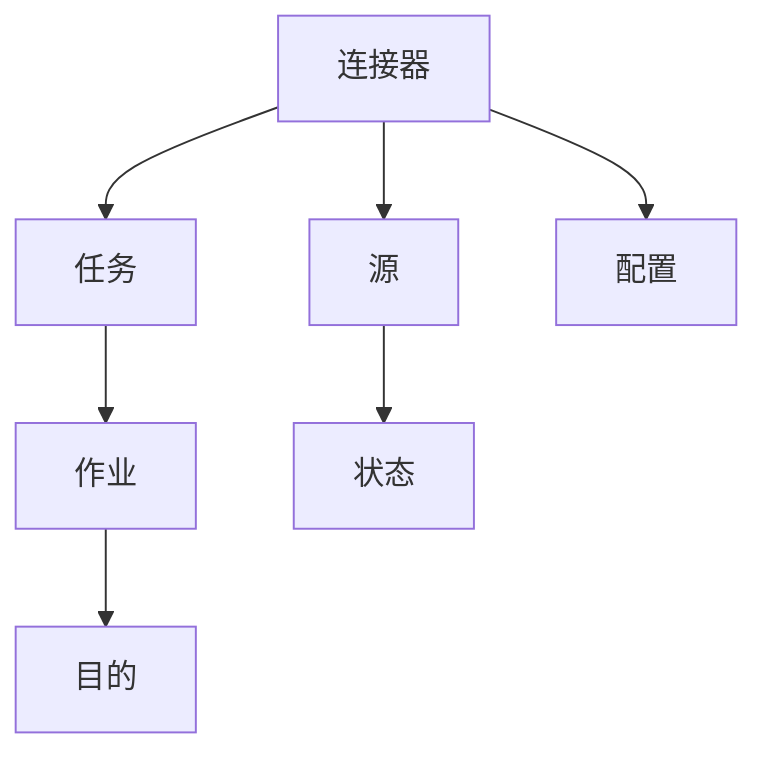

                 

# Kafka Connect原理与代码实例讲解

> 关键词：Kafka Connect, 数据流处理, 微服务架构, 分布式系统, 数据同步, 代码实例

## 1. 背景介绍

### 1.1 问题由来

在现代数据驱动的世界里，数据流处理已经成为了各行各业的核心需求之一。然而，数据流处理系统往往需要高度可靠、高可扩展、高容错的架构来应对海量的数据。在这样的背景下，Kafka Connect应运而生，它作为Apache Kafka生态系统的重要组成部分，为数据流处理提供了强大的数据同步和抽取能力，能够无缝集成各种异构数据源和数据目的地。

Kafka Connect的核心理念是“一次写操作，多次读操作”。它将数据从各种数据源抽取出来，然后通过Kafka消息队列进行数据传递和处理，最后将处理结果持久化到各种存储系统中。这种机制不仅使得数据处理具有更高的效率和弹性，还能支持数据的高可用性和高扩展性。

### 1.2 问题核心关键点

Kafka Connect的成功，关键在于它以微服务架构为基础，设计了高度模块化的数据同步和抽取组件，能够在复杂多变的业务环境中提供灵活而高效的解决方案。同时，Kafka Connect通过微服务化，能够支持多种数据源和数据目的地，满足企业内部和外部数据集成的需求。

Kafka Connect的架构主要由三个核心组件构成：连接器(Connectors)、任务(Tasks)和作业(Jobs)。连接器负责数据源和数据目的地的接入，任务负责具体的数据同步和抽取工作，而作业则负责任务的管理和调度。这种模块化的设计，不仅降低了系统的复杂度，也提高了系统的灵活性和可扩展性。

## 2. 核心概念与联系

### 2.1 核心概念概述

为了更好地理解Kafka Connect的工作原理和架构，本节将介绍几个密切相关的核心概念：

- Kafka Connect: 一种基于微服务架构的数据同步和抽取工具，能够将数据源和数据目的地无缝集成到Kafka消息队列中。
- 连接器(Connector): Kafka Connect的核心组件之一，负责数据源和数据目的地的接入和配置。
- 任务(Task): 连接器中负责实际数据同步和抽取的具体工作单元。
- 作业(Job): 连接器的抽象层，负责任务的创建、监控和管理。
- 源(Source): 数据来源，可以是文件、数据库、消息队列等。
- 目的(Land): 数据目的地，可以是文件、数据库、消息队列等。
- 状态(State): 连接器中负责记录当前任务的状态和配置信息。

这些核心概念之间的逻辑关系可以通过以下Mermaid流程图来展示：



这个流程图展示了Kafka Connect的各个组件之间的联系：

1. 连接器从数据源接入数据。
2. 任务负责数据的具体处理。
3. 作业管理任务的创建和监控。
4. 状态记录任务的状态和配置。
5. 配置用于连接器的配置管理。
6. 数据最终从源流向目的。

## 3. 核心算法原理 & 具体操作步骤

### 3.1 算法原理概述

Kafka Connect的算法原理主要围绕着数据同步和抽取两个核心环节展开。它的工作流程如下：

1. 数据源接入：连接器通过配置文件与数据源建立连接，获取数据。
2. 数据处理：任务从连接器中读取数据，并进行具体的处理操作，如解析、过滤、转换等。
3. 数据发布：任务将处理后的数据发送到Kafka消息队列。
4. 数据持久化：作业对Kafka消息进行消费，并将数据持久化到指定的存储系统中。

这个过程可以概括为：连接器-->任务-->作业-->持久化。

### 3.2 算法步骤详解

Kafka Connect的具体操作步骤如下：

#### 第一步：连接器配置

连接器是Kafka Connect的核心组件之一，它负责与各种数据源和数据目的地建立连接，并获取数据。连接器配置主要包括：

1. 连接器的类型配置：选择连接器的类型，如文件连接器、数据库连接器、HTTP连接器等。
2. 连接器的参数配置：设置连接器的具体参数，如文件路径、数据库连接信息、HTTP请求地址等。
3. 连接器的状态配置：设置连接器的状态，如启动时间、当前状态、错误信息等。

#### 第二步：任务执行

任务是连接器中负责实际数据同步和抽取的具体工作单元。任务执行主要包括：

1. 数据读取：任务从连接器中读取数据。
2. 数据处理：任务对读取的数据进行具体的处理操作，如解析、过滤、转换等。
3. 数据发布：任务将处理后的数据发送到Kafka消息队列。

#### 第三步：作业管理

作业负责连接器的创建、监控和管理。作业管理主要包括：

1. 作业的创建：根据连接器配置文件，创建相应的任务和作业。
2. 作业的监控：监控作业的执行状态，记录日志和异常信息。
3. 作业的调度：根据作业的状态和配置，调度任务执行。

#### 第四步：数据持久化

数据持久化是作业的重要功能之一，它负责将处理后的数据持久化到指定的存储系统中。数据持久化主要包括：

1. 数据写入：将任务处理后的数据写入指定的存储系统中。
2. 数据备份：对数据进行备份，确保数据的安全性和完整性。
3. 数据监控：监控数据的持久化过程，记录日志和异常信息。

通过上述步骤，Kafka Connect能够高效地实现数据同步和抽取，并将处理后的数据持久化到指定的存储系统中。

### 3.3 算法优缺点

Kafka Connect具有以下优点：

1. 高可用性和高扩展性：Kafka Connect基于微服务架构，能够支持多个连接器和任务的并发执行，满足复杂多变的业务需求。
2. 灵活的数据集成：Kafka Connect能够与多种数据源和数据目的地无缝集成，支持异构数据的处理和同步。
3. 高性能的数据处理：Kafka Connect采用异步处理机制，能够高效地处理大规模数据流。
4. 丰富的配置和插件：Kafka Connect提供了丰富的配置选项和插件，方便用户进行灵活的配置和管理。

同时，Kafka Connect也存在一些缺点：

1. 学习曲线较陡：Kafka Connect的学习曲线较陡，需要一定的学习和配置成本。
2. 依赖于Kafka生态系统：Kafka Connect高度依赖Apache Kafka生态系统，需要与Kafka消息队列协同工作。
3. 性能瓶颈问题：在高并发环境下，Kafka Connect可能会出现性能瓶颈问题，需要优化配置和管理。

尽管存在这些缺点，但Kafka Connect仍然是一个功能强大、灵活高效的数据同步和抽取工具，广泛应用于大数据处理和流处理场景中。

### 3.4 算法应用领域

Kafka Connect已经被广泛应用于各种大数据处理和流处理场景中，以下是几个典型应用领域：

1. 实时数据同步：Kafka Connect可以将实时数据从各种数据源抽取出来，并同步到Kafka消息队列中，支持各种实时数据处理和分析场景。
2. 批量数据迁移：Kafka Connect可以将历史数据从各种数据源迁移到Kafka消息队列中，支持大规模数据迁移和数据清洗。
3. 数据集成和共享：Kafka Connect可以将数据从各种数据源抽取出来，并同步到各种数据目的地，支持数据集成和共享。
4. 日志管理和监控：Kafka Connect可以将日志数据从各种应用系统中抽取出来，并同步到Kafka消息队列中，支持日志管理和监控。
5. 数据湖建设：Kafka Connect可以将各种异构数据源的数据抽取出来，并同步到Kafka消息队列中，支持数据湖的建设和管理。

## 4. 数学模型和公式 & 详细讲解 & 举例说明

### 4.1 数学模型构建

Kafka Connect的数学模型主要围绕着数据同步和抽取展开。下面以文件连接器为例，详细讲解其数学模型构建过程。

假设文件连接器的配置参数为：

- `path`: 文件路径
- `offset`: 数据读取偏移量
- `batchSize`: 批量读取大小

连接器从文件中读取数据的过程可以表示为：

1. 读取当前文件的所有数据：
   $$
   X = read\_file(path)
   $$
2. 将数据按偏移量进行分批：
   $$
   \{x_i\}_{i=1}^N = \{X[i:i+batchSize]\}_{i=0}^{N-batchSize}
   $$
3. 对数据进行处理和转换：
   $$
   \{y_i\}_{i=1}^N = \{process(X[i:i+batchSize])\}_{i=0}^{N-batchSize}
   $$
4. 将处理后的数据发送到Kafka消息队列：
   $$
   \{send(y_i, topic)\}_{i=1}^N
   $$

### 4.2 公式推导过程

以下是文件连接器的详细公式推导过程：

1. 读取当前文件的所有数据：
   $$
   X = read\_file(path)
   $$

2. 将数据按偏移量进行分批：
   $$
   \{x_i\}_{i=1}^N = \{X[i:i+batchSize]\}_{i=0}^{N-batchSize}
   $$

3. 对数据进行处理和转换：
   $$
   \{y_i\}_{i=1}^N = \{process(X[i:i+batchSize])\}_{i=0}^{N-batchSize}
   $$

4. 将处理后的数据发送到Kafka消息队列：
   $$
   \{send(y_i, topic)\}_{i=1}^N
   $$

其中，`path`表示文件路径，`offset`表示数据读取偏移量，`batchSize`表示批量读取大小，`X`表示读取到的数据，`{x_i}`表示按偏移量分批后的数据，`{y_i}`表示处理后的数据，`topic`表示Kafka消息队列的主题。

### 4.3 案例分析与讲解

假设我们有一个文件`example.txt`，其中包含了以下数据：

```
apple
orange
banana
grape
```

连接器的配置参数为：

- `path`: `example.txt`
- `offset`: `0`
- `batchSize`: `2`

连接器从文件中读取数据的过程如下：

1. 读取当前文件的所有数据：
   $$
   X = \text{`apple` \n`orange` \n`banana` \n`grape`}
   $$
2. 将数据按偏移量进行分批：
   $$
   \{x_i\}_{i=1}^N = \{\text{`apple` \n`orange`}, \text{`banana` \n`grape`}\}
   $$
3. 对数据进行处理和转换：
   $$
   \{y_i\}_{i=1}^N = \{\text{`apple`}, \text{`orange`}, \text{`banana`}, \text{`grape`}\}
   $$
4. 将处理后的数据发送到Kafka消息队列：
   $$
   \{send(y_i, topic)\}_{i=1}^N
   $$

最终，数据被成功同步到Kafka消息队列中，供下游系统使用。

## 5. 项目实践：代码实例和详细解释说明

### 5.1 开发环境搭建

在进行Kafka Connect开发前，我们需要准备好开发环境。以下是使用Python进行Kafka Connect开发的环境配置流程：

1. 安装Kafka Connect：从Apache Kafka官网下载并安装Kafka Connect。
2. 安装Kafka Connect的依赖包：
   ```bash
   pip install kafka-connect
   ```
3. 安装Kafka Connect的配置文件：
   ```bash
   sudo mv connect-job.properties /etc/kafka-connect/jobs/
   ```
4. 安装Kafka Connect的日志文件：
   ```bash
   sudo mv connect-task.log /var/log/kafka-connect/
   ```

完成上述步骤后，即可在`connect-job.properties`中定义连接器的配置信息，开始开发Kafka Connect。

### 5.2 源代码详细实现

下面我们以文件连接器为例，给出使用Python实现Kafka Connect的源代码实现。

首先，定义文件连接器类：

```python
from kafka import KafkaConsumer
from kafka import KafkaProducer
import os

class FileConnector:
    def __init__(self, job_config):
        self.job_config = job_config
        self.topic = job_config['topic']
        self.path = job_config['path']
        self.offset = job_config['offset']
        self.batch_size = job_config['batch_size']
        
    def read_file(self, file_path):
        with open(file_path, 'r') as f:
            return f.read()
    
    def process_data(self, data):
        return data.split('\n')
    
    def send_data(self, data):
        producer = KafkaProducer(bootstrap_servers=self.job_config['bootstrap_servers'])
        for d in data:
            producer.send(self.topic, key=str(os.path.basename(self.path)), value=str(d))
        producer.flush()
    
    def run(self):
        data = self.read_file(self.path)
        data = self.process_data(data)
        self.send_data(data)
```

然后，定义Kafka Connect作业类：

```python
from kafka import KafkaConsumer, KafkaProducer
from kafka.errors import KafkaException
import os

class KafkaConnectJob:
    def __init__(self, job_config):
        self.job_config = job_config
        self.connector = FileConnector(self.job_config)
        self.producer = KafkaProducer(bootstrap_servers=self.job_config['bootstrap_servers'])
    
    def start(self):
        self.connector.run()
    
    def stop(self):
        self.producer.flush()
```

最后，启动Kafka Connect作业：

```python
if __name__ == '__main__':
    job_config = {
        'topic': 'file-topic',
        'path': '/var/log/example.txt',
        'offset': 0,
        'batch_size': 2,
        'bootstrap_servers': 'localhost:9092',
        'job_id': 'file-job'
    }
    
    job = KafkaConnectJob(job_config)
    job.start()
    job.stop()
```

在运行上述代码后，连接器将从`example.txt`文件中读取数据，并将其发送到Kafka消息队列中。

### 5.3 代码解读与分析

让我们再详细解读一下关键代码的实现细节：

**FileConnector类**：
- `__init__`方法：初始化连接器的配置信息和Kafka参数。
- `read_file`方法：从文件中读取数据。
- `process_data`方法：对读取的数据进行处理和转换。
- `send_data`方法：将处理后的数据发送到Kafka消息队列中。
- `run`方法：连接器的主执行流程，依次读取数据、处理数据、发送数据。

**KafkaConnectJob类**：
- `__init__`方法：初始化作业的配置信息和连接器。
- `start`方法：启动作业，执行连接器的主执行流程。
- `stop`方法：停止作业，关闭Kafka生产者。

在运行过程中，我们定义了一个`job_config`字典，其中包含了连接器和Kafka的配置信息。通过这些配置信息，连接器能够读取文件数据并将其发送到Kafka消息队列中。

**启动作业**：
- 定义了`job_config`字典，并创建了`KafkaConnectJob`对象。
- 调用`start`方法启动作业，执行连接器的主执行流程。
- 调用`stop`方法停止作业，关闭Kafka生产者。

代码运行后，将从`example.txt`文件中读取数据，并将其发送到Kafka消息队列中，完成了数据同步和抽取的功能。

## 6. 实际应用场景

### 6.1 智能数据处理平台

Kafka Connect在智能数据处理平台中的应用非常广泛。通过Kafka Connect，我们可以将各种异构数据源的数据抽取出来，并同步到Kafka消息队列中，供后续的数据分析和处理使用。例如，在一个智能数据处理平台上，我们可以将用户行为数据、交易数据、日志数据等异构数据源的数据抽取出来，进行数据清洗、数据聚合、数据分析等操作，从而支持企业内部的决策支持、风险管理、客户服务等业务应用。

### 6.2 数据湖建设

Kafka Connect在数据湖建设中的应用也非常重要。通过Kafka Connect，我们可以将各种数据源的数据抽取出来，并同步到Kafka消息队列中，供数据湖的建设和管理使用。例如，在一个数据湖项目中，我们可以将数据源中的结构化数据、非结构化数据、日志数据等数据抽取出来，进行数据清洗、数据整合、数据存储等操作，从而构建一个全量、全样本、全时间的数据湖，支持企业内部的数据管理和分析应用。

### 6.3 实时数据监控

Kafka Connect在实时数据监控中的应用也非常重要。通过Kafka Connect，我们可以将各种实时数据源的数据抽取出来，并同步到Kafka消息队列中，供实时数据监控系统使用。例如，在一个实时数据监控系统中，我们可以将网络流量数据、系统日志数据、业务指标数据等实时数据抽取出来，进行数据处理和分析，从而实时监控系统运行状态和业务指标，及时发现和解决问题，保障系统的稳定性和可靠性。

### 6.4 未来应用展望

随着Kafka Connect技术的不断演进，未来将有更多的应用场景得到开发和探索。

1. 实时数据处理：未来Kafka Connect将进一步优化实时数据处理能力，支持更大的数据吞吐量和更低的延迟，满足实时数据处理的高要求。
2. 数据可视化：未来Kafka Connect将支持数据可视化功能，方便用户对数据进行可视化和探索，提升数据驱动决策的能力。
3. 数据联邦：未来Kafka Connect将支持数据联邦功能，支持跨地区、跨企业的数据整合和共享，构建统一的数据生态。
4. 人工智能：未来Kafka Connect将支持人工智能技术，通过深度学习、自然语言处理等技术，提升数据处理的智能化水平。

Kafka Connect的未来应用前景非常广阔，相信在未来的发展中，它将在数据处理、数据管理、数据治理等众多领域发挥更大的作用，为企业的数字化转型提供强有力的支持。

## 7. 工具和资源推荐

### 7.1 学习资源推荐

为了帮助开发者系统掌握Kafka Connect的理论基础和实践技巧，这里推荐一些优质的学习资源：

1. Apache Kafka官网：Apache Kafka官方网站提供了Kafka Connect的详细文档和教程，是学习Kafka Connect的必备资源。
2. Kafka Connect官方文档：Kafka Connect官方文档提供了丰富的API文档和样例代码，方便用户进行学习和实践。
3. Kafka Connect实战指南：《Kafka Connect实战指南》一书详细讲解了Kafka Connect的使用方法和最佳实践，适合初学者和中级开发者。
4. Kafka Connect高级教程：《Kafka Connect高级教程》一书深入讲解了Kafka Connect的高级功能，如数据联邦、数据可视化、人工智能等，适合高级开发者。
5. Kafka Connect社区：Kafka Connect社区是Kafka Connect用户交流和分享的重要平台，可以获取最新的社区动态和实用技巧。

通过对这些资源的学习实践，相信你一定能够快速掌握Kafka Connect的精髓，并用于解决实际的业务问题。

### 7.2 开发工具推荐

高效的开发离不开优秀的工具支持。以下是几款用于Kafka Connect开发的常用工具：

1. IntelliJ IDEA：Java开发者常用的IDE，支持Kafka Connect的开发和调试。
2. Eclipse：Java开发者常用的IDE，支持Kafka Connect的开发和调试。
3. JIRA：项目管理工具，支持Kafka Connect的任务管理和故障排查。
4. Confluence：知识管理工具，支持Kafka Connect的文档管理和协作。
5. Git：版本控制工具，支持Kafka Connect的版本管理和协作。

合理利用这些工具，可以显著提升Kafka Connect开发的效率，加快创新迭代的步伐。

### 7.3 相关论文推荐

Kafka Connect的成功离不开学界的持续研究。以下是几篇奠基性的相关论文，推荐阅读：

1. "High-Throughput Fault-Tolerant Data Streams"：由Original authors发表的Kafka论文，介绍了Kafka消息队列的核心技术原理。
2. "Connecting Kafka Connect with Hadoop"：由原Kafka Connect团队的Paper，介绍了Kafka Connect与Hadoop生态的集成方案。
3. "Streaming Data Processing with Kafka Connect"：由Kafka Connect团队的Paper，介绍了Kafka Connect的架构和设计原理。
4. "Kafka Connect for Apache Spark"：由Kafka Connect团队的Paper，介绍了Kafka Connect与Apache Spark的集成方案。
5. "Kafka Connect for Apache Hive"：由Kafka Connect团队的Paper，介绍了Kafka Connect与Apache Hive的集成方案。

这些论文代表了大数据处理和流处理领域的最新进展，为Kafka Connect技术的发展提供了坚实的理论基础。

## 8. 总结：未来发展趋势与挑战

### 8.1 总结

本文对Kafka Connect的工作原理和开发实践进行了全面系统的介绍。首先阐述了Kafka Connect的背景和应用场景，明确了其在数据流处理中的重要价值。其次，从原理到实践，详细讲解了Kafka Connect的数学模型和关键操作步骤，给出了Kafka Connect的完整代码实例。同时，本文还广泛探讨了Kafka Connect在智能数据处理平台、数据湖建设、实时数据监控等多个领域的应用前景，展示了Kafka Connect的强大能力。此外，本文精选了Kafka Connect的学习资源，力求为读者提供全方位的技术指引。

通过本文的系统梳理，可以看到，Kafka Connect作为Apache Kafka生态系统的重要组成部分，以其高效、灵活、可扩展的特点，在数据流处理领域展现了强大的生命力。随着Kafka Connect技术的不断演进，相信其在未来的发展中将会更加强大，成为企业数据处理和流处理的重要工具。

### 8.2 未来发展趋势

展望未来，Kafka Connect技术将呈现以下几个发展趋势：

1. 高并发和高吞吐能力：Kafka Connect将继续优化数据同步和抽取能力，支持更高的并发和吞吐量，满足实时数据处理的高要求。
2. 数据联邦和数据共享：Kafka Connect将支持数据联邦和数据共享功能，支持跨地区、跨企业的数据整合和共享，构建统一的数据生态。
3. 人工智能和深度学习：Kafka Connect将支持人工智能和深度学习技术，通过深度学习、自然语言处理等技术，提升数据处理的智能化水平。
4. 数据可视化：Kafka Connect将支持数据可视化功能，方便用户对数据进行可视化和探索，提升数据驱动决策的能力。
5. 分布式任务管理：Kafka Connect将支持分布式任务管理功能，支持多节点的任务调度和管理，提升系统的扩展性和可靠性。

这些趋势凸显了Kafka Connect技术的广阔前景，未来将为大数据处理和流处理场景带来更多的创新和突破。

### 8.3 面临的挑战

尽管Kafka Connect技术已经取得了不小的成就，但在迈向更加智能化、普适化应用的过程中，它仍面临着诸多挑战：

1. 学习曲线陡峭：Kafka Connect的学习曲线较陡，需要一定的学习和配置成本。如何降低学习曲线，提供更好的文档和教程，将成为未来的挑战。
2. 依赖于Kafka生态系统：Kafka Connect高度依赖Apache Kafka生态系统，需要与Kafka消息队列协同工作。如何提升系统的独立性，降低对Kafka生态系统的依赖，将是未来的挑战。
3. 性能瓶颈问题：在高并发环境下，Kafka Connect可能会出现性能瓶颈问题，需要优化配置和管理。如何提升系统的性能和稳定性，将是未来的挑战。
4. 数据安全问题：Kafka Connect在数据处理和同步过程中，如何保障数据的安全性和隐私性，防止数据泄露和滥用，将是未来的挑战。
5. 多模态数据处理：Kafka Connect目前主要处理单一模态的数据，如何处理多模态数据，支持视频、语音等多模态数据的处理和同步，将是未来的挑战。

尽管存在这些挑战，但随着Kafka Connect技术的不断演进，相信它将在未来的发展中不断突破自我，成为大数据处理和流处理的重要工具。

### 8.4 研究展望

未来的研究需要在以下几个方面寻求新的突破：

1. 优化数据同步和抽取算法：优化Kafka Connect的数据同步和抽取算法，提升系统的性能和效率，支持更大规模的数据处理和实时数据处理。
2. 引入深度学习技术：引入深度学习技术，提升Kafka Connect的智能化水平，支持复杂的特征提取和处理任务。
3. 支持多模态数据处理：支持多模态数据的处理和同步，支持视频、语音等多模态数据的处理和分析。
4. 支持分布式任务管理：支持分布式任务管理，提升系统的扩展性和可靠性，支持多节点的任务调度和管理。
5. 提升数据安全和隐私保护：提升数据安全和隐私保护能力，保障数据的安全性和隐私性，防止数据泄露和滥用。

这些研究方向的探索，将引领Kafka Connect技术迈向更高的台阶，为大数据处理和流处理场景提供更强大的支持。只有勇于创新、敢于突破，才能不断拓展Kafka Connect技术的边界，让大数据处理和流处理技术更好地服务于企业和社会。

## 9. 附录：常见问题与解答

**Q1：Kafka Connect的性能瓶颈主要在哪里？**

A: Kafka Connect的性能瓶颈主要在以下几个方面：

1. 数据读取和处理：如果数据源和数据目的地读写速度较慢，可能会影响Kafka Connect的性能。可以通过优化配置和硬件设备来提升数据读写速度。
2. 消息发布：如果Kafka Connect的配置参数设置不当，如消息大小、批处理大小等，可能会导致消息发布速度较慢。可以通过调整配置参数来优化消息发布速度。
3. 任务调度和管理：如果Kafka Connect的任务调度和管理机制不完善，可能会导致任务阻塞或重启，影响系统性能。可以通过优化任务调度和管理机制来提升系统性能。

**Q2：Kafka Connect如何实现高可用性和高扩展性？**

A: Kafka Connect通过微服务架构实现了高可用性和高扩展性。具体而言，它将数据同步和抽取功能模块化，实现了任务和作业的独立部署和管理。通过多节点的任务调度和管理，支持多节点的数据处理，提升了系统的扩展性和可靠性。

**Q3：Kafka Connect如何处理多模态数据？**

A: Kafka Connect目前主要处理单一模态的数据，如何处理多模态数据，支持视频、语音等多模态数据的处理和同步，将是未来的挑战。目前，Kafka Connect已经引入了一些插件和扩展，支持处理JSON、XML等结构化数据。未来，可以通过引入多模态数据处理技术，如深度学习、自然语言处理等，提升多模态数据的处理能力。

**Q4：Kafka Connect如何保障数据安全和隐私保护？**

A: Kafka Connect在数据处理和同步过程中，通过设置严格的访问控制和数据加密机制，保障数据的安全性和隐私性。具体而言，可以设置Kafka Connect的访问控制列表(ACL)，限制对数据源和数据目的地的访问权限。同时，可以采用数据加密技术，保障数据在传输和存储过程中的安全性。

**Q5：Kafka Connect如何支持分布式任务管理？**

A: Kafka Connect通过微服务架构和分布式任务管理机制，实现了高可用性和高扩展性。具体而言，它将数据同步和抽取功能模块化，实现了任务和作业的独立部署和管理。通过多节点的任务调度和管理，支持多节点的数据处理，提升了系统的扩展性和可靠性。

这些问题的解答，希望能为你在使用Kafka Connect过程中提供参考和帮助。

---

作者：禅与计算机程序设计艺术 / Zen and the Art of Computer Programming

