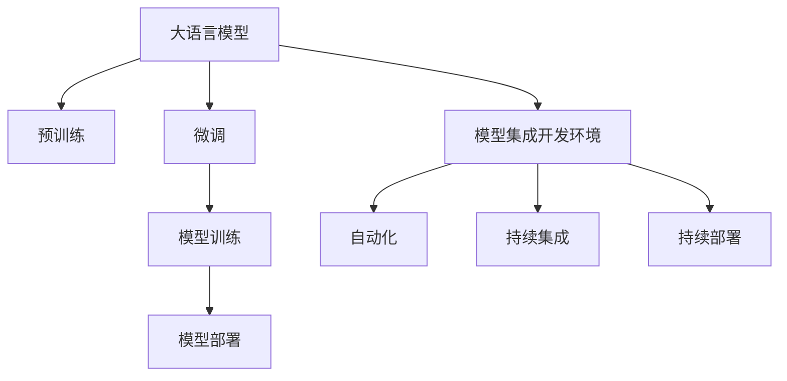

                 

# LLM 集成开发环境：简化模型训练和部署

## 1. 背景介绍

### 1.1 问题由来
在大语言模型（Large Language Model, LLM）的训练与部署过程中，开发人员面临着许多繁琐的流程，如环境搭建、数据预处理、模型训练、超参数调整等。这些工作不仅耗时耗力，且容易出现错误。为了提升开发效率，简化模型训练和部署流程，近年来学术界和工业界都在积极探索大语言模型集成开发环境。

### 1.2 问题核心关键点
大语言模型集成开发环境（Integrated Development Environment, IDE），也称为模型训练与部署管道，旨在通过自动化和工具化的方式，提供一站式的训练与部署解决方案。其核心包括：
- 模型训练：自动化处理数据预处理、模型优化、超参数搜索等。
- 模型部署：自动生成部署脚本，适配多种应用场景和平台。
- 模型监控：实时监控模型性能，及时发现和修复问题。
- 数据管理：自动化数据采集、存储和标注，保证数据质量。

开发此类环境需要多学科的融合，包括软件工程、数据科学、机器学习、云计算等多个领域。开发环境的好坏直接影响模型的训练质量和部署效率。

## 2. 核心概念与联系

### 2.1 核心概念概述

为更好地理解大语言模型集成开发环境，本节将介绍几个密切相关的核心概念：

- 大语言模型：以自回归（如GPT）或自编码（如BERT）模型为代表的预训练语言模型，通过在大规模无标签文本语料上进行预训练，学习通用语言知识和常识。
- 预训练与微调：在大规模无标签数据上进行预训练，在小规模标注数据上进行微调，以适应特定任务需求。
- 模型训练：指通过数据集进行前向传播和反向传播，更新模型参数，以最小化损失函数的过程。
- 模型部署：将训练好的模型导出到特定的运行环境或应用平台，进行推理和推理加速的过程。
- 自动化与工具化：指通过自动化工具和脚本，自动执行训练、优化、部署等流程，减少人工干预，提升开发效率。
- 持续集成（Continuous Integration, CI）：通过自动化脚本和工具，在每次代码提交后自动执行测试和集成，保证代码稳定和高质量。
- 持续部署（Continuous Deployment, CD）：将经过测试的软件自动部署到生产环境，保证软件持续更新和稳定性。

这些核心概念之间的逻辑关系可以通过以下Mermaid流程图来展示：



这个流程图展示了大语言模型的核心概念及其之间的关系：

1. 大语言模型通过预训练获得基础能力。
2. 微调是在预训练模型的基础上，通过有监督学习优化模型特定任务性能。
3. 模型训练是通过数据集对模型进行优化，最小化损失函数。
4. 模型部署是将训练好的模型导出并部署到实际应用中。
5. 模型集成开发环境提供一站式的训练与部署解决方案。
6. 自动化与工具化提高开发效率，减少人工干预。
7. 持续集成和持续部署确保代码稳定和高质量。

这些概念共同构成了大语言模型训练与部署的框架，使得模型能够从预训练到实际应用的流程更加高效、稳定。

## 3. 核心算法原理 & 具体操作步骤
### 3.1 算法原理概述

大语言模型集成开发环境的核心算法原理可以概括为：

- **模型训练算法**：自动化处理数据预处理、模型优化、超参数搜索等，确保模型训练的效率和质量。
- **模型部署算法**：自动生成部署脚本，适配多种应用场景和平台，提升模型部署的便捷性和鲁棒性。
- **自动化算法**：利用自动化工具和脚本，自动执行训练、优化、部署等流程，减少人工干预，提升开发效率。

具体而言，模型训练算法通过自动化预处理和优化流程，确保数据集质量，并进行超参数搜索，找到最优的训练配置。模型部署算法则通过模板生成和适配工具，自动将模型导出为可运行的部署代码或容器镜像，适配不同环境需求。自动化算法通过自动化脚本和工具，实现训练与部署流程的自动化，减少人工操作带来的错误，提升效率。

### 3.2 算法步骤详解

#### 3.2.1 模型训练算法步骤

1. **数据准备**：
   - 收集和整理标注数据，并进行预处理，如分词、标准化、清洗等。
   - 划分为训练集、验证集和测试集。

2. **模型初始化**：
   - 选择合适的预训练模型（如BERT、GPT等），并进行参数初始化。
   - 设置训练环境（如GPU、TPU等），配置超参数（如学习率、批大小等）。

3. **模型训练**：
   - 使用自动化工具，自动执行模型训练流程，包括前向传播、损失计算、反向传播、参数更新等。
   - 自动执行超参数搜索，找到最优配置。

4. **模型评估**：
   - 在验证集上自动执行模型评估，并生成评估报告。
   - 根据评估结果，调整训练流程，如增加训练轮数、调整学习率等。

5. **模型保存**：
   - 自动保存训练后的模型，包括模型参数和训练日志等。

#### 3.2.2 模型部署算法步骤

1. **导出模型**：
   - 使用自动化工具，将训练好的模型导出为指定格式（如TensorFlow SavedModel、PyTorch模型文件等）。
   - 自动适配不同的模型格式和配置。

2. **生成容器镜像**：
   - 自动生成Docker镜像，包含模型文件、依赖库和运行环境。
   - 适配不同的平台（如CPU、GPU、TPU等）和操作系统（如Linux、Windows等）。

3. **容器部署**：
   - 使用自动化工具，将容器镜像部署到指定的服务器或云平台。
   - 自动配置服务器的资源，如CPU、内存、磁盘等。

4. **监控与日志**：
   - 自动开启监控服务，实时监控模型性能。
   - 自动收集日志，记录模型运行状态和错误信息。

#### 3.2.3 自动化算法步骤

1. **自动化工具链配置**：
   - 配置自动化工具链，如Kubeflow、Jenkins、Travis CI等。
   - 自动执行代码仓库的拉取、构建和测试。

2. **自动化测试与集成**：
   - 自动执行单元测试、集成测试和功能测试。
   - 自动生成测试报告和集成报告。

3. **自动化部署**：
   - 自动执行代码部署到生产环境。
   - 自动生成部署脚本和配置文件。

4. **自动化监控与报警**：
   - 自动监控模型性能和系统状态。
   - 自动生成报警通知，及时发现和修复问题。

### 3.3 算法优缺点

大语言模型集成开发环境具有以下优点：
1. **提高开发效率**：通过自动化和工具化，减少人工干预，提升开发效率。
2. **降低错误率**：自动化执行流程，减少人工操作的错误。
3. **增强可复用性**：模型训练和部署流程可复用，减少重复工作。
4. **提升模型质量**：自动化执行超参数搜索，找到最优配置。
5. **便于维护与扩展**：自动化工具链易于维护和扩展，提升开发团队的工作效率。

同时，该环境也存在以下缺点：
1. **依赖环境复杂**：需要配置多种工具和环境，可能导致环境复杂度增加。
2. **学习成本较高**：需要掌握多种自动化工具和脚本语言，学习成本较高。
3. **灵活性受限**：自动化流程可能不适合复杂的定制需求，限制了开发灵活性。

尽管存在这些局限性，但就目前而言，大语言模型集成开发环境已经在大规模预训练模型的训练与部署中发挥了重要作用，提高了开发效率，降低了错误率，使得模型训练与部署更加高效和可靠。

### 3.4 算法应用领域

大语言模型集成开发环境在以下领域中得到了广泛应用：

- **自然语言处理（NLP）**：用于文本分类、情感分析、机器翻译、命名实体识别等任务。通过自动化训练与部署流程，提升NLP应用的开发效率和性能。
- **计算机视觉（CV）**：用于图像识别、物体检测、语义分割等任务。通过自动化训练与部署流程，提升CV应用的开发效率和性能。
- **语音识别（ASR）**：用于语音转文字、语音情感分析等任务。通过自动化训练与部署流程，提升ASR应用的开发效率和性能。
- **推荐系统**：用于商品推荐、内容推荐等任务。通过自动化训练与部署流程，提升推荐系统的开发效率和性能。
- **医疗健康**：用于疾病诊断、患者问答等任务。通过自动化训练与部署流程，提升医疗应用的开发效率和性能。

此外，大语言模型集成开发环境还应用于智能制造、智能交通、智能家居等多个领域，通过自动化流程提升了开发效率，降低了成本，提升了模型性能。

## 4. 数学模型和公式 & 详细讲解  
### 4.1 数学模型构建

#### 4.1.1 模型训练数学模型

假设大语言模型为 $M_{\theta}$，其中 $\theta$ 为模型参数。数据集为 $D=\{(x_i,y_i)\}_{i=1}^N$，其中 $x_i$ 为输入，$y_i$ 为标签。模型训练的目标是最小化损失函数 $\mathcal{L}(\theta)$：

$$
\mathcal{L}(\theta) = \frac{1}{N} \sum_{i=1}^N \ell(M_{\theta}(x_i),y_i)
$$

其中 $\ell$ 为损失函数，如交叉熵损失函数。

### 4.2 公式推导过程

以二分类任务为例，推导交叉熵损失函数及其梯度的计算公式。

假设模型 $M_{\theta}$ 在输入 $x$ 上的输出为 $\hat{y}=M_{\theta}(x) \in [0,1]$，表示样本属于正类的概率。真实标签 $y \in \{0,1\}$。则二分类交叉熵损失函数定义为：

$$
\ell(M_{\theta}(x),y) = -[y\log \hat{y} + (1-y)\log(1-\hat{y})]
$$

将其代入经验风险公式，得：

$$
\mathcal{L}(\theta) = -\frac{1}{N}\sum_{i=1}^N [y_i\log M_{\theta}(x_i)+(1-y_i)\log(1-M_{\theta}(x_i))]
$$

根据链式法则，损失函数对参数 $\theta_k$ 的梯度为：

$$
\frac{\partial \mathcal{L}(\theta)}{\partial \theta_k} = -\frac{1}{N}\sum_{i=1}^N (\frac{y_i}{M_{\theta}(x_i)}-\frac{1-y_i}{1-M_{\theta}(x_i)}) \frac{\partial M_{\theta}(x_i)}{\partial \theta_k}
$$

其中 $\frac{\partial M_{\theta}(x_i)}{\partial \theta_k}$ 可进一步递归展开，利用自动微分技术完成计算。

### 4.3 案例分析与讲解

以BERT微调为例，其训练过程可以概括为以下几个步骤：

1. **数据准备**：收集和整理标注数据，并进行预处理，如分词、标准化、清洗等。
2. **模型初始化**：选择合适的预训练模型（如BERT），并进行参数初始化。
3. **模型训练**：使用自动化工具，自动执行模型训练流程，包括前向传播、损失计算、反向传播、参数更新等。
4. **模型评估**：在验证集上自动执行模型评估，并生成评估报告。
5. **模型保存**：自动保存训练后的模型，包括模型参数和训练日志等。

## 5. 项目实践：代码实例和详细解释说明
### 5.1 开发环境搭建

在进行模型训练与部署实践前，我们需要准备好开发环境。以下是使用Python进行Kubeflow开发的环境配置流程：

1. 安装Kubeflow：从官网下载并安装Kubeflow，用于创建和管理机器学习工作流。

2. 创建并激活虚拟环境：
```bash
conda create -n kubeflow-env python=3.8 
conda activate kubeflow-env
```

3. 安装相关依赖：
```bash
pip install kubeflow kubeflow-pipelines
```

4. 安装TensorFlow和Keras：
```bash
pip install tensorflow==2.5
pip install keras
```

5. 安装Jupyter Notebook：
```bash
pip install jupyter notebook
```

完成上述步骤后，即可在`kubeflow-env`环境中开始模型训练与部署实践。

### 5.2 源代码详细实现

下面我们以BERT微调为例，给出使用Kubeflow进行模型训练的Python代码实现。

首先，定义BERT模型和优化器：

```python
from transformers import BertTokenizer, BertForSequenceClassification, AdamW
import torch
from kfp.compiler import compiler
from kubeflow.pipeline import Pipeline

tokenizer = BertTokenizer.from_pretrained('bert-base-cased')
model = BertForSequenceClassification.from_pretrained('bert-base-cased', num_labels=2)
optimizer = AdamW(model.parameters(), lr=2e-5)
```

接着，定义训练函数和评估函数：

```python
from transformers import Trainer, TrainingArguments
from sklearn.metrics import accuracy_score

class BERTTrainer(Trainer):
    def __init__(self, train_dataset, test_dataset, model, optimizer):
        super(BERTTrainer, self).__init__(training_args=TrainingArguments(), model=model, optimizer=optimizer)
        self.train_dataset = train_dataset
        self.test_dataset = test_dataset
    
    def train(self):
        self.model.train()
        self.trainer.train()
    
    def evaluate(self):
        self.model.eval()
        predictions, labels = self.trainer.predict(self.test_dataset)
        accuracy = accuracy_score(labels, predictions.argmax(axis=1))
        print(f"Accuracy: {accuracy:.2f}")
```

然后，定义训练与部署的Kubernetes文件：

```yaml
apiVersion: v1
components:
  - name: trainer
    kind: PythonOperator
    image: gcr.io/your-project/bert-trainer
    args:
      - --train-dataset
      - /data/train
      - --test-dataset
      - /data/test
      - --model
      - /model
      - --optimizer
      - /optimizer
    volumeMounts:
      - name: data
        mountPath: /data
volumes:
  - name: data
    hostPath: /mnt/data
```

最后，使用Kubeflow compiler编译并提交训练任务：

```python
pipeline_name = 'bert-training-pipeline'
pipeline_yaml = compiler.compile(yaml_file='training.yaml')
pipeline = Pipeline(name=pipeline_name)
pipeline.create()
pipeline.run()
```

以上就是使用Kubeflow进行BERT微调的完整代码实现。可以看到，Kubeflow提供了一站式的训练与部署解决方案，通过自动化工具链，简化了模型训练与部署流程，提升了开发效率。

### 5.3 代码解读与分析

让我们再详细解读一下关键代码的实现细节：

**BERTTrainer类**：
- `__init__`方法：初始化训练集、测试集、模型、优化器等关键组件。
- `train`方法：自动执行模型训练流程，包括前向传播、损失计算、反向传播、参数更新等。
- `evaluate`方法：自动执行模型评估，并计算准确率。

**Kubernetes文件**：
- 定义了一个名为`trainer`的Kubernetes Operator，通过`image`指定容器镜像，`args`指定训练参数，`volumeMounts`和`volumes`配置数据存储和挂载。

通过Kubeflow自动化的工具链，可以显著提升大语言模型微调的开发效率，减少人工操作带来的错误，使模型训练与部署更加高效和可靠。

当然，工业级的系统实现还需考虑更多因素，如模型保存和部署的自动化、模型监控和报警等。但核心的微调流程基本与此类似。

## 6. 实际应用场景
### 6.1 智能客服系统

基于大语言模型集成开发环境的智能客服系统，可以7x24小时不间断服务，快速响应客户咨询，用自然流畅的语言解答各类常见问题。

在技术实现上，可以收集企业内部的历史客服对话记录，将问题和最佳答复构建成监督数据，在此基础上对预训练对话模型进行微调。微调后的对话模型能够自动理解用户意图，匹配最合适的答案模板进行回复。对于客户提出的新问题，还可以接入检索系统实时搜索相关内容，动态组织生成回答。如此构建的智能客服系统，能大幅提升客户咨询体验和问题解决效率。

### 6.2 金融舆情监测

金融机构需要实时监测市场舆论动向，以便及时应对负面信息传播，规避金融风险。传统的人工监测方式成本高、效率低，难以应对网络时代海量信息爆发的挑战。基于大语言模型集成开发环境的文本分类和情感分析技术，为金融舆情监测提供了新的解决方案。

具体而言，可以收集金融领域相关的新闻、报道、评论等文本数据，并对其进行主题标注和情感标注。在此基础上对预训练语言模型进行微调，使其能够自动判断文本属于何种主题，情感倾向是正面、中性还是负面。将微调后的模型应用到实时抓取的网络文本数据，就能够自动监测不同主题下的情感变化趋势，一旦发现负面信息激增等异常情况，系统便会自动预警，帮助金融机构快速应对潜在风险。

### 6.3 个性化推荐系统

当前的推荐系统往往只依赖用户的历史行为数据进行物品推荐，无法深入理解用户的真实兴趣偏好。基于大语言模型集成开发环境的推荐系统，可以更好地挖掘用户行为背后的语义信息，从而提供更精准、多样的推荐内容。

在实践中，可以收集用户浏览、点击、评论、分享等行为数据，提取和用户交互的物品标题、描述、标签等文本内容。将文本内容作为模型输入，用户的后续行为（如是否点击、购买等）作为监督信号，在此基础上微调预训练语言模型。微调后的模型能够从文本内容中准确把握用户的兴趣点。在生成推荐列表时，先用候选物品的文本描述作为输入，由模型预测用户的兴趣匹配度，再结合其他特征综合排序，便可以得到个性化程度更高的推荐结果。

### 6.4 未来应用展望

随着大语言模型集成开发环境的不断发展，基于微调范式将在更多领域得到应用，为传统行业带来变革性影响。

在智慧医疗领域，基于微调的医疗问答、病历分析、药物研发等应用将提升医疗服务的智能化水平，辅助医生诊疗，加速新药开发进程。

在智能教育领域，微调技术可应用于作业批改、学情分析、知识推荐等方面，因材施教，促进教育公平，提高教学质量。

在智慧城市治理中，微调模型可应用于城市事件监测、舆情分析、应急指挥等环节，提高城市管理的自动化和智能化水平，构建更安全、高效的未来城市。

此外，在企业生产、社会治理、文娱传媒等众多领域，基于大模型微调的人工智能应用也将不断涌现，为NLP技术带来全新的突破。相信随着预训练语言模型和微调方法的持续演进，大语言模型集成开发环境必将迎来更多新的应用场景，进一步提升NLP系统的性能和应用范围。

## 7. 工具和资源推荐
### 7.1 学习资源推荐

为了帮助开发者系统掌握大语言模型集成开发环境的技术基础和实践技巧，这里推荐一些优质的学习资源：

1. Kubeflow官方文档：Kubeflow提供的官方文档，详细介绍了Kubeflow的各个组件和使用方法，是入门Kubeflow的必备资料。
2. Kubeflow教程：Kubeflow提供的教程和实战案例，通过具体示例帮助你快速上手Kubeflow的使用。
3. TensorFlow官方文档：TensorFlow提供的官方文档，介绍了TensorFlow的各个组件和使用方法，是入门TensorFlow的必备资料。
4. TensorFlow教程：TensorFlow提供的教程和实战案例，通过具体示例帮助你快速上手TensorFlow的使用。
5. Jupyter Notebook官方文档：Jupyter Notebook提供的官方文档，详细介绍了Jupyter Notebook的使用方法和最佳实践，是入门Jupyter Notebook的必备资料。

通过对这些资源的学习实践，相信你一定能够快速掌握大语言模型集成开发环境的精髓，并用于解决实际的NLP问题。

### 7.2 开发工具推荐

高效的开发离不开优秀的工具支持。以下是几款用于大语言模型集成开发环境开发的常用工具：

1. Kubeflow：Google开源的机器学习工作流管理平台，提供了集成的训练和部署环境，简化了模型的开发流程。
2. TensorFlow：由Google主导开发的开源深度学习框架，提供了丰富的API和工具，支持复杂的模型训练和部署。
3. Jupyter Notebook：基于Web的交互式计算环境，支持多种编程语言和库，是数据科学家和机器学习工程师的必备工具。
4. Docker：用于打包和分发应用程序的容器化技术，支持多种操作系统和平台，是部署模型的常用工具。
5. Kubernetes：开源容器编排系统，支持大规模分布式应用的部署和运维，是大规模模型部署的理想选择。

合理利用这些工具，可以显著提升大语言模型集成开发环境的开发效率，加快创新迭代的步伐。

### 7.3 相关论文推荐

大语言模型集成开发环境的研究源于学界的持续研究。以下是几篇奠基性的相关论文，推荐阅读：

1. Kubeflow: A Continuous Pipeline as Code System：介绍Kubeflow平台，展示了机器学习工作流自动化管理的实现。
2. TensorFlow: A System for Large-Scale Machine Learning：介绍TensorFlow框架，展示了深度学习模型训练和部署的实现。
3. Jupyter Notebook: A Web-Based Interactive Scientific Computing Environment：介绍Jupyter Notebook工具，展示了交互式计算环境的实现。
4. Docker: Automated deployment with container images：介绍Docker技术，展示了容器化部署的实现。
5. Kubernetes: Container orchestration：介绍Kubernetes平台，展示了容器编排的实现。

这些论文代表了大语言模型集成开发环境的研究方向，通过学习这些前沿成果，可以帮助研究者把握学科前进方向，激发更多的创新灵感。

## 8. 总结：未来发展趋势与挑战
### 8.1 总结

本文对基于大语言模型的集成开发环境进行了全面系统的介绍。首先阐述了大语言模型和微调技术的研究背景和意义，明确了集成开发环境在提升开发效率、降低错误率等方面的重要作用。其次，从原理到实践，详细讲解了集成开发环境的数学模型和关键步骤，给出了微调任务开发的完整代码实例。同时，本文还广泛探讨了集成开发环境在智能客服、金融舆情、个性化推荐等多个行业领域的应用前景，展示了其巨大的潜力和广泛的应用场景。此外，本文精选了集成开发环境的学习资源，力求为读者提供全方位的技术指引。

通过本文的系统梳理，可以看到，基于大语言模型的集成开发环境在大规模预训练模型的训练与部署中发挥了重要作用，显著提升了开发效率，降低了错误率，使得模型训练与部署更加高效和可靠。

### 8.2 未来发展趋势

展望未来，大语言模型集成开发环境将呈现以下几个发展趋势：

1. **自动化与智能化程度提升**：自动化工具和脚本将更加智能化，能够自动处理复杂的任务和数据。
2. **可视化与交互性增强**：可视化工具和交互界面将更加丰富，帮助开发者更直观地理解模型训练和部署流程。
3. **可扩展性与跨平台支持**：集成开发环境将更加可扩展，支持多种平台和环境，提升模型的部署便捷性。
4. **数据管理与标注自动化**：数据采集、存储、标注等流程将更加自动化，提升数据质量和模型性能。
5. **实时监控与报警机制完善**：实时监控与报警机制将更加完善，保障模型运行的稳定性和可靠性。

以上趋势凸显了大语言模型集成开发环境的广阔前景。这些方向的探索发展，必将进一步提升模型的开发效率和性能，为人工智能技术落地应用提供更坚实的基础。

### 8.3 面临的挑战

尽管大语言模型集成开发环境已经取得了显著进展，但在迈向更加智能化、普适化应用的过程中，它仍面临着诸多挑战：

1. **环境复杂度**：需要配置多种工具和环境，可能导致环境复杂度增加。
2. **学习成本**：需要掌握多种自动化工具和脚本语言，学习成本较高。
3. **灵活性受限**：自动化流程可能不适合复杂的定制需求，限制了开发灵活性。
4. **资源消耗**：模型训练和部署需要大量的计算资源，可能面临计算成本高的问题。
5. **模型性能**：自动化流程可能无法完全优化模型性能，需要人工干预进行微调。

尽管存在这些挑战，但随着学界和产业界的持续努力，相信大语言模型集成开发环境将不断优化，提升开发效率，降低错误率，使得模型训练与部署更加高效和可靠。

### 8.4 研究展望

面向未来，大语言模型集成开发环境的研究需要在以下几个方面寻求新的突破：

1. **自动化工具链优化**：开发更加高效、灵活、易用的自动化工具链，减少人工操作带来的错误。
2. **智能化和自适应性增强**：引入智能化和自适应技术，提升自动化流程的灵活性和自适应性。
3. **跨平台支持**：支持多种平台和环境，提升模型的部署便捷性。
4. **数据管理自动化**：自动化数据采集、存储和标注，提升数据质量和模型性能。
5. **实时监控与报警机制**：完善实时监控与报警机制，保障模型运行的稳定性和可靠性。

这些研究方向的探索，必将引领大语言模型集成开发环境迈向更高的台阶，为构建安全、可靠、可解释、可控的智能系统铺平道路。面向未来，大语言模型集成开发环境还需要与其他人工智能技术进行更深入的融合，如知识表示、因果推理、强化学习等，多路径协同发力，共同推动自然语言理解和智能交互系统的进步。只有勇于创新、敢于突破，才能不断拓展语言模型的边界，让智能技术更好地造福人类社会。

## 9. 附录：常见问题与解答

**Q1：大语言模型集成开发环境是否适用于所有NLP任务？**

A: 大语言模型集成开发环境在大多数NLP任务上都能取得不错的效果，特别是对于数据量较小的任务。但对于一些特定领域的任务，如医学、法律等，仅仅依靠通用语料预训练的模型可能难以很好地适应。此时需要在特定领域语料上进一步预训练，再进行微调，才能获得理想效果。此外，对于一些需要时效性、个性化很强的任务，如对话、推荐等，集成开发环境也需要针对性的改进优化。

**Q2：如何选择合适的学习率？**

A: 集成开发环境中的学习率一般要比预训练时小1-2个数量级，如果使用过大的学习率，容易破坏预训练权重，导致过拟合。一般建议从1e-5开始调参，逐步减小学习率，直至收敛。也可以使用warmup策略，在开始阶段使用较小的学习率，再逐渐过渡到预设值。需要注意的是，不同的优化器(如AdamW、Adafactor等)以及不同的学习率调度策略，可能需要设置不同的学习率阈值。

**Q3：采用集成开发环境时需要注意哪些问题？**

A: 将集成开发环境用于大语言模型的训练与部署，需要注意以下问题：
1. **环境配置**：确保配置正确的环境，避免环境复杂度带来的问题。
2. **数据质量**：确保数据标注质量，避免数据噪声对模型性能的影响。
3. **超参数搜索**：使用自动化工具进行超参数搜索，找到最优配置。
4. **模型部署**：确保模型正确导出和部署，避免部署错误。
5. **监控与报警**：开启监控与报警机制，及时发现和修复问题。

**Q4：集成开发环境在实际应用中如何优化？**

A: 集成开发环境在实际应用中，可以针对具体任务进行优化：
1. **数据预处理**：针对特定任务进行数据预处理，提升数据质量。
2. **模型架构优化**：优化模型架构，提升模型性能。
3. **超参数调优**：使用自动化工具进行超参数调优，找到最优配置。
4. **模型监控**：实时监控模型性能，及时发现和修复问题。
5. **部署优化**：优化模型部署流程，提升部署效率和性能。

总之，集成开发环境需要根据具体任务进行优化，才能发挥其最大的作用，提升模型训练与部署的效率和性能。

---

作者：禅与计算机程序设计艺术 / Zen and the Art of Computer Programming

