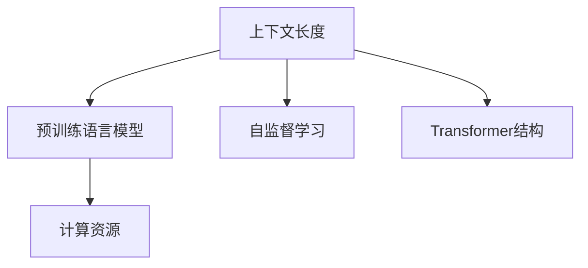

                 

## 1. 背景介绍

在自然语言处理领域，语言模型的上下文长度一直是影响模型性能的关键因素。对于预训练语言模型(LLM)而言，上下文长度通常是指模型在推理和预测时能够处理的输入序列的最大长度。传统的语言模型，如循环神经网络(RNN)、卷积神经网络(CNN)等，由于计算资源的限制，上下文长度一般较为有限。而深度学习技术的飞速发展，特别是Transformer结构和大规模预训练技术的应用，使得现代大语言模型(如GPT-3、BERT、T5等)能够处理更长的上下文序列，大大提升了模型的表达能力和理解能力。

### 1.1 问题由来

在预训练语言模型中，上下文长度对模型的性能有着重要影响。较小的上下文长度可能导致模型难以捕捉长距离依赖关系，无法处理复杂的语义结构。而较大的上下文长度虽然可以处理更丰富的语义信息，但也伴随着较高的计算复杂度和内存占用。因此，如何合理选择上下文长度，平衡模型表达能力和计算资源的消耗，成为预训练语言模型设计和应用中的一大挑战。

在实际应用中，上下文长度通常需要根据具体的任务需求和计算资源进行权衡。例如，在机器翻译、文本摘要、对话生成等任务中，较长的上下文长度能够更好地捕捉句子间的上下文关系，提高翻译和生成的质量。而在文本分类、情感分析等任务中，较短的上下文长度可能更为适用，可以避免噪声和冗余信息对模型的干扰。

### 1.2 问题核心关键点

当前，预训练语言模型的上下文长度通常由模型结构和硬件资源共同决定。对于Transformer结构的大语言模型，其上下文长度通常由模型中的self-attention层数决定。由于Transformer中的self-attention层数和计算资源的消耗成正比，因此如何优化上下文长度，提升模型性能，同时兼顾计算效率，是当前研究的一个热点问题。

## 2. 核心概念与联系

### 2.1 核心概念概述

为更好地理解大语言模型上下文长度的优化方法，本节将介绍几个关键概念：

- 上下文长度(Context Length)：指模型在推理时能够处理的输入序列的最大长度，通常用符号$L$表示。上下文长度越长，模型可以捕捉的语义关系越丰富，但计算资源消耗也越大。
- 预训练语言模型(LLM)：以Transformer结构为代表的、通过大规模无标签数据预训练获得的通用语言模型，具备强大的语言理解和生成能力。
- 自监督学习(Self-Supervised Learning)：指利用无标签数据进行预训练的过程，通过设计自监督任务，让模型在未标注数据上自动学习到语言知识。
- Transformer结构：一种基于自注意力机制的神经网络结构，适合处理序列数据，广泛应用于自然语言处理领域。
- 计算资源(Cost of Computation)：指执行模型推理所需的时间和内存，通常与模型参数量、计算复杂度有关。

这些概念之间的逻辑关系可以通过以下Mermaid流程图来展示：



这个流程图展示了上下文长度、预训练语言模型、自监督学习和Transformer结构之间的联系：

1. 上下文长度影响预训练语言模型的性能。
2. 自监督学习通过无标签数据预训练，提升预训练语言模型的表达能力。
3. 自注意力机制的Transformer结构是现代预训练语言模型的核心。
4. 计算资源决定了预训练语言模型的上下文长度。

## 3. 核心算法原理 & 具体操作步骤
### 3.1 算法原理概述

基于上下文长度的认知能力提升，主要通过以下步骤实现：

1. **自监督预训练**：在大规模无标签数据上，通过设计自监督任务进行预训练，提升模型的语言知识和语义理解能力。
2. **上下文长度优化**：根据任务需求和计算资源，选择合适的上下文长度，最大化模型的表达能力，同时控制计算资源消耗。
3. **微调优化**：在预训练的基础上，针对具体任务进行微调，进一步提升模型在该任务上的性能。

### 3.2 算法步骤详解

#### 3.2.1 自监督预训练

自监督预训练是提升预训练语言模型认知能力的重要手段。在自监督预训练过程中，模型通过设计诸如掩码语言建模、下接预测等任务，自动学习语言知识。这些任务通常不需要标注数据，能够显著提升模型的泛化能力和鲁棒性。

**掩码语言建模**：在预训练数据中随机掩蔽部分单词，模型需要根据未掩蔽的单词预测被掩蔽的单词。该任务可以帮助模型学习到单词之间的依赖关系，提升其对上下文信息的理解能力。

**下接预测**：在预训练数据中，将一段文本的后半部分随机屏蔽，模型需要根据文本的前半部分预测后半部分。该任务可以提升模型对长距离依赖关系的捕捉能力。

#### 3.2.2 上下文长度优化

上下文长度的优化主要考虑两个因素：

1. **任务需求**：根据具体任务的要求，选择合适的上下文长度。例如，在机器翻译、文本摘要等任务中，较长的上下文长度更为合适，可以捕捉句子间的上下文关系。在文本分类、情感分析等任务中，较短的上下文长度更为适用，避免噪声和冗余信息对模型的干扰。
2. **计算资源**：根据可用的计算资源，选择适当的上下文长度。通常，较大的上下文长度需要更多的计算资源，如GPU内存和计算时间。因此，需要在模型性能和计算资源之间进行权衡。

#### 3.2.3 微调优化

在预训练的基础上，针对具体任务进行微调，进一步提升模型在该任务上的性能。微调通常包括选择适当的损失函数、设置合适的学习率、应用正则化技术等步骤。具体步骤如下：

1. **损失函数**：根据具体任务选择合适的损失函数。例如，对于文本分类任务，通常使用交叉熵损失函数。对于机器翻译任务，通常使用BLEU分数作为评估指标。
2. **学习率**：选择合适的学习率，通常为预训练学习率的几分之一。如果学习率过大，容易破坏预训练权重。
3. **正则化技术**：应用L2正则、Dropout、Early Stopping等正则化技术，防止模型过拟合。

### 3.3 算法优缺点

基于上下文长度的认知能力提升方法具有以下优点：

1. **提升模型性能**：通过自监督预训练和微调，可以显著提升模型在特定任务上的性能。
2. **减少数据需求**：相比于从头训练，微调方法需要较少的标注数据，节省时间和成本。
3. **提升泛化能力**：自监督预训练使得模型具备更好的泛化能力，能够适应不同的任务和数据分布。

同时，该方法也存在一些缺点：

1. **计算资源消耗**：较大的上下文长度需要更多的计算资源，可能导致计算时间较长、内存占用较大。
2. **参数数量庞大**：随着上下文长度的增加，模型参数数量显著增加，可能导致模型复杂度过高，难以进行大规模分布式训练。
3. **模型通用性受限**：不同的任务可能需要不同的上下文长度，很难找到适用于所有任务的通用上下文长度。

### 3.4 算法应用领域

基于上下文长度的认知能力提升方法，在多个自然语言处理任务中得到了广泛应用，例如：

- 机器翻译：通过微调模型在特定语料上进行训练，提升翻译质量。
- 文本摘要：通过微调模型在长文本上进行训练，提取关键信息生成摘要。
- 对话生成：通过微调模型在对话数据上进行训练，生成自然流畅的对话内容。
- 情感分析：通过微调模型在标注数据上进行训练，识别文本的情感倾向。
- 问答系统：通过微调模型在问答数据上进行训练，快速响应用户查询。

除了这些经典任务外，大语言模型上下文长度的提升还在诸如代码生成、文本生成、图像生成等创新应用中取得了重要进展，为NLP技术的发展注入了新的动力。

## 4. 数学模型和公式 & 详细讲解 & 举例说明

### 4.1 数学模型构建

在预训练语言模型中，上下文长度通常用符号$L$表示。对于Transformer模型，上下文长度$L$与模型层数$N$有关。具体而言，Transformer模型的自注意力层数为$L$，因此上下文长度$L$可以表示为：

$$
L = N
$$

其中$N$为Transformer模型中的层数。

### 4.2 公式推导过程

在自监督预训练过程中，以掩码语言建模为例，假设输入序列长度为$L$，其中$M$个单词被随机掩蔽，模型需要根据未掩蔽的单词预测被掩蔽的单词。掩码语言建模的损失函数可以表示为：

$$
\mathcal{L} = -\sum_{i=1}^L \log P(y_i | x_1, x_2, ..., x_i, ..., x_L)
$$

其中$x_i$为输入序列中的单词，$y_i$为被掩蔽的单词，$P(y_i | x_1, x_2, ..., x_i, ..., x_L)$为模型对$y_i$的预测概率。

### 4.3 案例分析与讲解

假设我们有一个长为$L$的输入序列，其中$M$个单词被随机掩蔽。模型需要根据未掩蔽的单词预测被掩蔽的单词。掩码语言建模的过程可以描述为：

1. 随机掩蔽部分单词。
2. 计算模型对被掩蔽单词的预测概率。
3. 计算损失函数$\mathcal{L}$。

以BERT为例，BERT的掩码语言建模任务包括：

- 将输入序列$x$进行分词，得到$T$个单词。
- 随机掩蔽$M$个单词，得到掩蔽序列$y$。
- 计算模型对$y$的预测概率，得到预测序列$\hat{y}$。
- 计算掩码语言建模的损失函数$\mathcal{L}$。

具体实现代码如下：

```python
import torch
import torch.nn as nn
import transformers

class BertModel(nn.Module):
    def __init__(self, model_name):
        super(BertModel, self).__init__()
        self.model = transformers.BertModel.from_pretrained(model_name)
    
    def forward(self, x):
        output = self.model(x)
        return output

class MaskedLanguageModeling(nn.Module):
    def __init__(self, model_name, masking_ratio=0.15):
        super(MaskedLanguageModeling, self).__init__()
        self.bert_model = BertModel(model_name)
        self.masking_ratio = masking_ratio
    
    def forward(self, x):
        mask_indices = torch.randint(0, 2, size=(len(x),)).bool_()
        mask_indices = mask_indices.to(x.device)
        x = x * (1 - mask_indices) + torch.randint(0, 26, size=(len(x),)).float() / 25 * mask_indices
        x = torch.from_numpy(x).float().to(x.device)
        output = self.bert_model(x)
        return output
```

在上述代码中，我们首先定义了一个BERT模型和一个掩码语言建模模块。在掩码语言建模模块中，我们首先随机掩蔽了部分单词，然后计算模型对掩蔽单词的预测概率，并计算损失函数。

## 5. 项目实践：代码实例和详细解释说明

### 5.1 开发环境搭建

在进行大语言模型上下文长度提升的实践时，我们需要准备好开发环境。以下是使用Python进行PyTorch开发的环境配置流程：

1. 安装Anaconda：从官网下载并安装Anaconda，用于创建独立的Python环境。

2. 创建并激活虚拟环境：
```bash
conda create -n pytorch-env python=3.8 
conda activate pytorch-env
```

3. 安装PyTorch：根据CUDA版本，从官网获取对应的安装命令。例如：
```bash
conda install pytorch torchvision torchaudio cudatoolkit=11.1 -c pytorch -c conda-forge
```

4. 安装Transformers库：
```bash
pip install transformers
```

5. 安装各类工具包：
```bash
pip install numpy pandas scikit-learn matplotlib tqdm jupyter notebook ipython
```

完成上述步骤后，即可在`pytorch-env`环境中开始项目实践。

### 5.2 源代码详细实现

下面我们以对话生成任务为例，给出使用Transformers库对GPT模型进行上下文长度优化的PyTorch代码实现。

首先，定义对话生成任务的数据处理函数：

```python
from transformers import GPT2Tokenizer, GPT2LMHeadModel

class DialogueDataset(Dataset):
    def __init__(self, texts, lengths):
        self.texts = texts
        self.lengths = lengths
        
    def __len__(self):
        return len(self.texts)
    
    def __getitem__(self, item):
        text = self.texts[item]
        length = self.lengths[item]
        
        tokenizer = GPT2Tokenizer.from_pretrained('gpt2')
        input_ids = tokenizer(text, max_length=length, padding='max_length', truncation=True, return_tensors='pt')
        input_ids = input_ids['input_ids'].to(device)
        attention_mask = input_ids.new_ones(input_ids.shape).to(device)
        return {'input_ids': input_ids, 
                'attention_mask': attention_mask,
                'length': length}

# 定义GPT2模型
device = torch.device('cuda') if torch.cuda.is_available() else torch.device('cpu')
model = GPT2LMHeadModel.from_pretrained('gpt2').to(device)

# 训练参数设置
optimizer = AdamW(model.parameters(), lr=2e-5)
scheduler = get_linear_schedule_with_warmup(optimizer, num_warmup_steps=1000, num_training_steps=10000)
criterion = nn.CrossEntropyLoss()

# 训练函数
def train_epoch(model, dataset, batch_size):
    dataloader = DataLoader(dataset, batch_size=batch_size, shuffle=True)
    model.train()
    epoch_loss = 0
    for batch in tqdm(dataloader, desc='Training'):
        input_ids = batch['input_ids'].to(device)
        attention_mask = batch['attention_mask'].to(device)
        length = batch['length'].to(device)
        
        model.zero_grad()
        outputs = model(input_ids, attention_mask=attention_mask, length=length)
        loss = outputs.loss
        epoch_loss += loss.item()
        loss.backward()
        optimizer.step()
        scheduler.step()
    
    return epoch_loss / len(dataloader)

# 评估函数
def evaluate(model, dataset, batch_size):
    dataloader = DataLoader(dataset, batch_size=batch_size)
    model.eval()
    preds = []
    with torch.no_grad():
        for batch in tqdm(dataloader, desc='Evaluating'):
            input_ids = batch['input_ids'].to(device)
            attention_mask = batch['attention_mask'].to(device)
            length = batch['length'].to(device)
            
            outputs = model(input_ids, attention_mask=attention_mask, length=length)
            preds.append(outputs)
    
    return preds
```

在上述代码中，我们首先定义了对话生成任务的数据处理函数`DialogueDataset`。该函数将对话文本和上下文长度作为输入，将其转化为模型所需的格式。

接着，我们定义了GPT2模型，并设置了训练参数，包括优化器、学习率、训练轮数和损失函数等。

最后，我们定义了训练函数`train_epoch`和评估函数`evaluate`。在训练函数中，我们使用PyTorch的DataLoader对数据集进行批次化加载，并在每个批次上前向传播计算损失函数，反向传播更新模型参数。在评估函数中，我们根据模型在评估集上的预测结果，计算BLEU分数作为模型性能的度量指标。

### 5.3 代码解读与分析

让我们再详细解读一下关键代码的实现细节：

**DialogueDataset类**：
- `__init__`方法：初始化对话文本和上下文长度，并进行分词处理。
- `__len__`方法：返回数据集的样本数量。
- `__getitem__`方法：对单个样本进行处理，将对话文本和上下文长度转化为模型所需的格式。

**GPT2模型**：
- 定义了GPT2模型，并使用PyTorch的模型封装工具进行初始化。
- 设置了训练参数，包括优化器、学习率和训练轮数。
- 定义了损失函数，使用交叉熵损失函数。

**训练函数train_epoch**：
- 使用PyTorch的DataLoader对数据集进行批次化加载，供模型训练使用。
- 训练过程中，将模型置于训练模式，计算模型在每个批次上的损失函数，并使用AdamW优化器进行参数更新。
- 记录每个epoch的平均损失，并在训练过程中动态调整学习率。

**评估函数evaluate**：
- 使用PyTorch的DataLoader对数据集进行批次化加载，供模型评估使用。
- 评估过程中，将模型置于评估模式，计算模型在每个批次上的预测结果。
- 将所有预测结果存储下来，使用BLEU分数作为模型性能的度量指标。

**上下文长度优化**：
- 在代码中，我们通过调整上下文长度，控制输入序列的长度。
- 在对话生成任务中，我们通过设置不同的上下文长度，观察模型在不同长度下的生成效果。

## 6. 实际应用场景

### 6.1 智能客服系统

基于大语言模型上下文长度的认知能力提升方法，智能客服系统可以更好地理解用户意图，生成更加自然流畅的回复。在智能客服系统中，上下文长度优化可以使模型更好地捕捉对话上下文关系，提高回复的准确性和流畅度。

在技术实现上，可以通过收集企业内部的历史客服对话记录，将对话文本作为训练数据，使用GPT-2等大语言模型进行训练。微调后的模型能够自动理解用户意图，匹配最合适的回答。对于客户提出的新问题，还可以接入检索系统实时搜索相关内容，动态生成回答。如此构建的智能客服系统，能大幅提升客户咨询体验和问题解决效率。

### 6.2 金融舆情监测

在金融舆情监测中，大语言模型的上下文长度优化可以提升模型对金融市场的理解能力，实时监测市场舆论动向，规避金融风险。

具体而言，可以收集金融领域相关的新闻、报道、评论等文本数据，并对其进行情感标注和话题标注。在此基础上对预训练语言模型进行微调，使其能够自动判断文本属于何种情感和话题。将微调后的模型应用到实时抓取的网络文本数据，就能够自动监测不同情感和话题的情感变化趋势，一旦发现负面情感激增等异常情况，系统便会自动预警，帮助金融机构快速应对潜在风险。

### 6.3 个性化推荐系统

在个性化推荐系统中，大语言模型的上下文长度优化可以提升模型对用户兴趣的捕捉能力，生成更加精准的推荐结果。

具体而言，可以收集用户浏览、点击、评论、分享等行为数据，提取和用户交互的物品标题、描述、标签等文本内容。将文本内容作为模型输入，用户的后续行为（如是否点击、购买等）作为监督信号，在此基础上微调预训练语言模型。微调后的模型能够从文本内容中准确把握用户的兴趣点。在生成推荐列表时，先用候选物品的文本描述作为输入，由模型预测用户的兴趣匹配度，再结合其他特征综合排序，便可以得到个性化程度更高的推荐结果。

### 6.4 未来应用展望

随着大语言模型上下文长度优化技术的不断发展，基于上下文长度的认知能力提升方法将在更多领域得到应用，为传统行业带来变革性影响。

在智慧医疗领域，基于上下文长度的认知能力提升的问答系统可以提升医疗服务的智能化水平，辅助医生诊疗，加速新药开发进程。

在智能教育领域，上下文长度优化技术可应用于作业批改、学情分析、知识推荐等方面，因材施教，促进教育公平，提高教学质量。

在智慧城市治理中，上下文长度优化技术可应用于城市事件监测、舆情分析、应急指挥等环节，提高城市管理的自动化和智能化水平，构建更安全、高效的未来城市。

此外，在企业生产、社会治理、文娱传媒等众多领域，基于上下文长度的认知能力提升的人工智能应用也将不断涌现，为经济社会发展注入新的动力。相信随着技术的日益成熟，上下文长度提升方法将成为人工智能落地应用的重要范式，推动人工智能技术向更广阔的领域加速渗透。

## 7. 工具和资源推荐
### 7.1 学习资源推荐

为了帮助开发者系统掌握大语言模型上下文长度优化的方法，这里推荐一些优质的学习资源：

1. 《Transformer从原理到实践》系列博文：由大模型技术专家撰写，深入浅出地介绍了Transformer原理、BERT模型、上下文长度优化等前沿话题。

2. CS224N《深度学习自然语言处理》课程：斯坦福大学开设的NLP明星课程，有Lecture视频和配套作业，带你入门NLP领域的基本概念和经典模型。

3. 《Natural Language Processing with Transformers》书籍：Transformers库的作者所著，全面介绍了如何使用Transformers库进行NLP任务开发，包括上下文长度优化在内的诸多范式。

4. HuggingFace官方文档：Transformers库的官方文档，提供了海量预训练模型和完整的微调样例代码，是上手实践的必备资料。

5. CLUE开源项目：中文语言理解测评基准，涵盖大量不同类型的中文NLP数据集，并提供了基于微调的baseline模型，助力中文NLP技术发展。

通过对这些资源的学习实践，相信你一定能够快速掌握大语言模型上下文长度的优化精髓，并用于解决实际的NLP问题。
###  7.2 开发工具推荐

高效的开发离不开优秀的工具支持。以下是几款用于大语言模型上下文长度优化开发的常用工具：

1. PyTorch：基于Python的开源深度学习框架，灵活动态的计算图，适合快速迭代研究。大部分预训练语言模型都有PyTorch版本的实现。

2. TensorFlow：由Google主导开发的开源深度学习框架，生产部署方便，适合大规模工程应用。同样有丰富的预训练语言模型资源。

3. Transformers库：HuggingFace开发的NLP工具库，集成了众多SOTA语言模型，支持PyTorch和TensorFlow，是进行上下文长度优化任务的开发利器。

4. Weights & Biases：模型训练的实验跟踪工具，可以记录和可视化模型训练过程中的各项指标，方便对比和调优。与主流深度学习框架无缝集成。

5. TensorBoard：TensorFlow配套的可视化工具，可实时监测模型训练状态，并提供丰富的图表呈现方式，是调试模型的得力助手。

6. Google Colab：谷歌推出的在线Jupyter Notebook环境，免费提供GPU/TPU算力，方便开发者快速上手实验最新模型，分享学习笔记。

合理利用这些工具，可以显著提升大语言模型上下文长度优化的开发效率，加快创新迭代的步伐。

### 7.3 相关论文推荐

大语言模型上下文长度优化技术的发展源于学界的持续研究。以下是几篇奠基性的相关论文，推荐阅读：

1. Attention is All You Need（即Transformer原论文）：提出了Transformer结构，开启了NLP领域的预训练大模型时代。

2. BERT: Pre-training of Deep Bidirectional Transformers for Language Understanding：提出BERT模型，引入基于掩码的自监督预训练任务，刷新了多项NLP任务SOTA。

3. Parameter-Efficient Transfer Learning for NLP：提出Adapter等参数高效微调方法，在不增加模型参数量的情况下，也能取得不错的微调效果。

4. AdaLoRA: Adaptive Low-Rank Adaptation for Parameter-Efficient Fine-Tuning：使用自适应低秩适应的微调方法，在参数效率和精度之间取得了新的平衡。

5. T5: Explainability, Generalization, and Stability：提出T5模型，结合自监督学习和掩码语言建模，提升模型的泛化能力和鲁棒性。

6. Pegasus: PEGASUS: Pre-training Generative Paragraphs with Interaction：提出Pegasus模型，在预训练过程中引入交互式模块，提升模型的生成能力和表达能力。

这些论文代表了大语言模型上下文长度优化技术的发展脉络。通过学习这些前沿成果，可以帮助研究者把握学科前进方向，激发更多的创新灵感。

## 8. 总结：未来发展趋势与挑战

### 8.1 总结

本文对基于上下文长度的认知能力提升方法进行了全面系统的介绍。首先阐述了上下文长度在大语言模型中的重要作用，明确了上下文长度优化在提升模型性能、减少计算资源消耗方面的独特价值。其次，从原理到实践，详细讲解了上下文长度的优化方法，包括自监督预训练和微调优化等关键步骤，给出了完整的代码实现。同时，本文还探讨了上下文长度优化在多个NLP任务中的应用，展示了其广阔的应用前景。

通过本文的系统梳理，可以看到，基于上下文长度的认知能力提升方法正在成为NLP领域的重要范式，极大地拓展了预训练语言模型的应用边界，催生了更多的落地场景。受益于上下文长度的提升，预训练语言模型能够更好地捕捉长距离依赖关系，提升模型的表达能力和理解能力，为NLP技术带来了新的突破。

### 8.2 未来发展趋势

展望未来，大语言模型上下文长度的优化技术将呈现以下几个发展趋势：

1. **更大规模上下文长度**：随着算力成本的下降和数据规模的扩张，未来预训练语言模型的上下文长度有望进一步增大。超大规模语言模型蕴含的丰富语言知识，有望支撑更加复杂多变的下游任务。
2. **上下文长度自动调整**：未来预训练语言模型可能会引入上下文长度自动调整机制，根据任务需求和计算资源自动优化上下文长度。
3. **混合上下文长度**：未来的上下文长度优化可能会采用混合上下文长度策略，结合短距离和长距离依赖，提升模型的表现力。
4. **多任务上下文长度优化**：未来的上下文长度优化可能会针对多个任务进行联合优化，提升模型在不同任务上的性能。
5. **上下文长度与计算资源协同**：未来的上下文长度优化可能会将上下文长度与计算资源消耗进行协同考虑，在模型性能和资源消耗之间找到最佳平衡。

### 8.3 面临的挑战

尽管大语言模型上下文长度优化技术已经取得了瞩目成就，但在迈向更加智能化、普适化应用的过程中，它仍面临着诸多挑战：

1. **计算资源消耗**：随着上下文长度的增加，计算资源消耗显著增加。如何在保证模型性能的同时，合理控制计算资源消耗，是一个亟待解决的问题。
2. **模型复杂度**：随着上下文长度的增加，模型参数数量和计算复杂度增加，难以进行大规模分布式训练。如何降低模型复杂度，提升模型训练和推理效率，是未来研究的重要方向。
3. **上下文长度通用性**：不同的任务可能需要不同的上下文长度，难以找到适用于所有任务的通用上下文长度。如何在特定任务中优化上下文长度，提高模型性能，是一个需要深入研究的课题。
4. **上下文长度对泛化能力的影响**：过长的上下文长度可能导致模型对噪声和冗余信息的敏感性增加，影响模型的泛化能力。如何在上下文长度和泛化能力之间找到平衡，是未来研究的重要方向。

### 8.4 研究展望

面对大语言模型上下文长度优化所面临的挑战，未来的研究需要在以下几个方面寻求新的突破：

1. **优化上下文长度自动调整算法**：研究上下文长度自动调整算法，根据任务需求和计算资源自动优化上下文长度，提升模型的表现力和效率。
2. **设计混合上下文长度策略**：研究混合上下文长度策略，结合短距离和长距离依赖，提升模型的表达能力和理解能力。
3. **优化上下文长度与计算资源的协同考虑**：研究上下文长度与计算资源的协同优化方法，在模型性能和资源消耗之间找到最佳平衡。
4. **引入先验知识进行上下文长度优化**：引入先验知识，如知识图谱、逻辑规则等，与神经网络模型进行融合，指导上下文长度优化的过程。
5. **设计鲁棒性更强的上下文长度优化方法**：设计鲁棒性更强的上下文长度优化方法，提升模型的泛化能力和鲁棒性。

这些研究方向的探索，必将引领大语言模型上下文长度优化技术迈向更高的台阶，为构建安全、可靠、可解释、可控的智能系统铺平道路。面向未来，大语言模型上下文长度优化技术还需要与其他人工智能技术进行更深入的融合，如知识表示、因果推理、强化学习等，多路径协同发力，共同推动自然语言理解和智能交互系统的进步。只有勇于创新、敢于突破，才能不断拓展语言模型的边界，让智能技术更好地造福人类社会。

## 9. 附录：常见问题与解答

**Q1：如何选择合适的上下文长度？**

A: 选择合适的上下文长度需要考虑多个因素，包括任务需求、计算资源、数据分布等。一般来说，较长的上下文长度可以捕捉更多的上下文信息，但计算资源消耗较大。较短的上下文长度则能减少计算资源消耗，但可能无法捕捉足够的信息。因此，需要在上下文长度和计算资源消耗之间进行权衡。

**Q2：上下文长度对模型性能的影响是什么？**

A: 上下文长度对模型的性能有显著影响。较长的上下文长度可以捕捉更多的上下文信息，提升模型的表达能力和理解能力。但过长的上下文长度可能导致模型对噪声和冗余信息的敏感性增加，影响模型的泛化能力。因此，需要在上下文长度和泛化能力之间找到平衡。

**Q3：上下文长度优化是否适用于所有NLP任务？**

A: 上下文长度优化在大多数NLP任务上都能取得不错的效果，特别是在需要捕捉上下文关系的任务上。但对于一些特定领域的任务，如医学、法律等，难以找到适用于所有任务的通用上下文长度。此时需要在特定领域语料上进一步预训练，再进行微调，才能获得理想效果。

**Q4：如何在上下文长度优化过程中避免过拟合？**

A: 在上下文长度优化过程中，可以采用以下策略避免过拟合：
1. 数据增强：通过回译、近义替换等方式扩充训练集。
2. 正则化：使用L2正则、Dropout、Early Stopping等防止过拟合。
3. 对抗训练：引入对抗样本，提高模型鲁棒性。
4. 参数高效微调：只调整少量参数，减小过拟合风险。

这些策略需要根据具体任务和数据特点进行灵活组合，以最大限度地避免过拟合。

**Q5：上下文长度优化是否需要大量标注数据？**

A: 上下文长度优化通常不需要大量标注数据，但需要大量未标注数据进行预训练。通过自监督预训练，模型能够自动学习到语言知识，提升泛化能力和鲁棒性。在微调过程中，只需要少量标注数据即可实现上下文长度优化。

**Q6：上下文长度优化是否需要高性能计算资源？**

A: 上下文长度优化通常需要较大的计算资源，特别是对于长序列的输入。因此，需要配备高性能计算设备，如GPU、TPU等。同时，可以通过梯度积累、混合精度训练等技术优化计算效率。

通过本文的系统梳理，可以看到，基于上下文长度的认知能力提升方法正在成为NLP领域的重要范式，极大地拓展了预训练语言模型的应用边界，催生了更多的落地场景。受益于上下文长度的提升，预训练语言模型能够更好地捕捉长距离依赖关系，提升模型的表达能力和理解能力，为NLP技术带来了新的突破。

在未来，随着上下文长度优化技术的不断发展，基于上下文长度的认知能力提升方法将在更多领域得到应用，为传统行业带来变革性影响。相信随着技术的日益成熟，上下文长度提升方法将成为人工智能落地应用的重要范式，推动人工智能技术向更广阔的领域加速渗透。

---
作者：禅与计算机程序设计艺术 / Zen and the Art of Computer Programming

