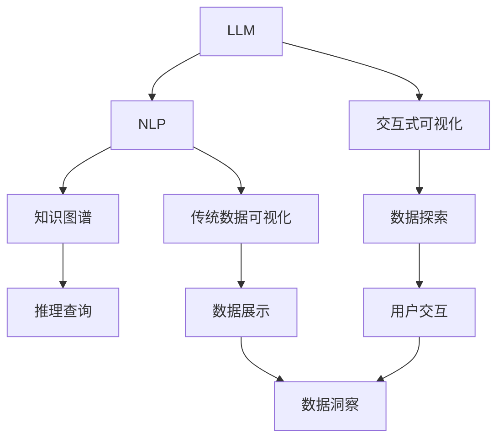

                 

# LLM与传统数据可视化技术的结合：数据洞察新方式

> 关键词：数据可视化, 大型语言模型(LLM), 自然语言处理(NLP), 知识图谱, 数据洞察, 交互式可视化

## 1. 背景介绍

### 1.1 问题由来
在信息爆炸的今天，人们每天生成和消耗大量的数据。无论是企业内部的业务数据、公共数据集还是社交媒体数据，数据量的激增对数据处理和分析提出了更高要求。数据可视化技术在很大程度上帮助人们快速理解数据的结构和趋势，但传统的数据可视化方法仍存在一些局限。

一方面，当数据量巨大、维度高时，人们难以直观地从数据中获取关键信息，这需要借助高级的统计分析方法和算法。另一方面，传统的静态图表形式难以支持动态交互和实时更新，无法完全满足实时数据分析的需求。

此外，数据可视化技术往往需要专业人员操作，对于非专业人士来说，入门门槛较高，且难以高效地从海量数据中发现深刻的洞见。

为了解决这些问题，学者和研究者提出了许多先进的方法和技术。其中，大型语言模型(LLM)作为一种新兴的技术，在自然语言处理(NLP)和计算机视觉等领域展现出了强大的潜力。LLM通过大量的无监督预训练和微调，可以在多种任务上表现出色，尤其是文本和图像生成。

基于此，本文探讨如何结合LLM和传统数据可视化技术，提供一种新的、更高效的数据洞察方式。

## 2. 核心概念与联系

### 2.1 核心概念概述

在深入讨论如何将LLM和数据可视化结合之前，我们需要先了解相关的核心概念。

- **大型语言模型(LLM)**：基于Transformer结构的大规模预训练语言模型。如GPT、BERT等，具备强大的语言理解、生成和推理能力，可在多任务上表现优异。

- **自然语言处理(NLP)**：使用计算机技术处理和理解人类语言的技术，涉及文本分类、命名实体识别、情感分析等任务。

- **数据可视化**：将数据以图表的形式展现出来，帮助人们直观地理解数据规律和趋势。

- **知识图谱**：一种结构化的数据表示方式，用于描述和关联实体及属性，支持更高效的推理和查询。

- **交互式可视化**：支持用户交互操作的可视化界面，可以实时更新和探索数据，提升用户体验。

### 2.2 核心概念联系

这些核心概念之间存在紧密的联系：

- LLM和NLP技术结合，可实现对数据的文本描述，为数据可视化提供语义信息。
- 数据可视化技术提供对数据的直观展示，辅助LLM理解和推理。
- 知识图谱与数据可视化结合，可支持更深入的推理和查询。
- 交互式可视化提升用户交互体验，提升数据分析效率。

这些联系通过以下Mermaid流程图来展示：



这个流程图展示了LLM和传统数据可视化技术的联系：

1. 利用NLP技术对数据进行语义理解，通过LLM生成文本描述。
2. 数据可视化技术将文本描述转化为可视化图表，便于用户理解。
3. 知识图谱提供数据间的关联和推理支持。
4. 交互式可视化提升用户体验，支持实时数据探索。
5. 用户通过交互探索，生成数据洞察，帮助决策。

## 3. 核心算法原理 & 具体操作步骤

### 3.1 算法原理概述

结合LLM和数据可视化技术的数据洞察过程大致可以分为以下几个步骤：

1. **数据预处理**：将原始数据转化为可用于LLM和NLP分析的格式，如文本、图像等。
2. **文本生成**：使用LLM对数据生成文本描述，提供语义信息。
3. **数据可视化**：将文本描述转化为可视化图表，展现数据结构和趋势。
4. **交互式探索**：通过交互式可视化界面，让用户实时探索和理解数据。
5. **知识图谱增强**：将可视化结果嵌入知识图谱，支持更深入的推理和查询。

这一过程形成了一个闭环，从数据处理到最终洞察，每个步骤相互支持，共同提升数据分析的效率和深度。

### 3.2 算法步骤详解

以下是基于LLM和数据可视化技术的数据洞察步骤：

**Step 1: 数据预处理**
- 将原始数据转化为可用于LLM和NLP分析的格式。例如，将表格数据转化为文本描述，将图像数据转化为自然语言描述。
- 数据格式转换可以通过预定义的脚本或API自动完成，提高效率。

**Step 2: 文本生成**
- 使用LLM生成文本描述，提供数据的关键信息和结构。
- 由于LLM的生成过程依赖于上下文，因此需要设置适当的种子文本（Seed Text）以确保生成的内容符合预期。
- 例如，对于表格数据，可以生成类似“以下数据展示某时间范围内的销售情况”的文本。

**Step 3: 数据可视化**
- 将生成的文本描述转化为可视化图表，直观展示数据的结构和趋势。
- 常见的可视化方法包括散点图、折线图、柱状图、饼图等。
- 例如，对于销售数据，可以使用折线图展示时间序列趋势。

**Step 4: 交互式探索**
- 利用交互式可视化界面，允许用户实时探索和理解数据。
- 用户可以通过拖拽、缩放、筛选等操作，动态更新和探索数据。
- 例如，可以提供一个交互式仪表盘，允许用户根据时间、地域、销售金额等维度筛选数据。

**Step 5: 知识图谱增强**
- 将可视化结果嵌入知识图谱，支持更深入的推理和查询。
- 例如，在销售数据可视化中，可以生成销售和库存的关联图谱，支持查询某时间点的库存情况。

### 3.3 算法优缺点

结合LLM和数据可视化技术的数据洞察方式具有以下优点：

- **语义丰富**：LLM生成文本描述，为数据提供语义信息，提升可视化效果。
- **灵活性高**：交互式可视化支持实时更新，用户可以根据需求调整查看角度和细节。
- **效率高**：自动化数据处理和分析，提升整体分析效率。

但同时存在以下缺点：

- **复杂度高**：结合LLM和数据可视化技术需要较复杂的技术栈支持，可能存在一定学习成本。
- **数据质量要求高**：生成的文本描述需要高质量，否则会影响可视化效果。

### 3.4 算法应用领域

结合LLM和数据可视化技术的数据洞察方式，已经在以下领域得到应用：

- **企业决策分析**：结合销售数据和市场分析，帮助企业制定战略决策。
- **金融风险评估**：结合金融数据和风险模型，评估投资风险和市场趋势。
- **医疗数据分析**：结合患者数据和医疗知识图谱，支持医疗研究和临床决策。
- **公共数据管理**：结合公共数据和社会事件，分析社会现象和政策影响。

## 4. 数学模型和公式 & 详细讲解 & 举例说明

### 4.1 数学模型构建

在结合LLM和数据可视化技术的数据洞察过程中，涉及多个领域的数学模型和算法。以下以表格数据为例，构建数学模型。

假设有一张表格数据，其中包含销售时间、地域、产品名称、销售金额等信息。表格数据可以表示为：

$$
\begin{bmatrix}
Date & Location & Product & Sales\\
2021-01-01 & A & P1 & 1000 \\
2021-01-01 & A & P2 & 2000 \\
2021-01-02 & B & P1 & 1500 \\
...
\end{bmatrix}
$$

我们需要将表格数据转化为自然语言描述，并生成可视化图表。

### 4.2 公式推导过程

**Step 1: 数据转化为文本描述**
- 对于表格数据，可以使用如下公式将其转化为文本描述：
$$
Description = "以下数据展示某时间范围内的销售情况："
$$
$$
Description += "时间段：" + date_range + ", "
$$
$$
Description += "地点：" + location_list + ", "
$$
$$
Description += "产品：" + product_list + ", "
$$
$$
Description += "销售金额：" + sales_list
$$

**Step 2: 文本描述生成可视化图表**
- 对于销售数据，可以使用折线图展示时间序列趋势，公式如下：
$$
X = \{1,2,...,n\}
$$
$$
Y = \{Sales_i\}_{i=1}^n
$$
$$
Visualization = \text{折线图}(X, Y)
$$

### 4.3 案例分析与讲解

**案例分析：销售数据分析**

假设有一家零售公司的销售数据，需要分析不同时间段的销售趋势。以下是分析步骤：

**Step 1: 数据预处理**
- 将原始销售数据转化为表格形式，存储在数据库中。

**Step 2: 文本生成**
- 使用LLM生成文本描述：
$$
Description = "以下数据展示某时间范围内的销售情况：时间段：2021年第一季度，地点：全国，产品：服装，销售金额：1000万元。"
$$

**Step 3: 数据可视化**
- 将文本描述转化为折线图，展示时间序列趋势。

**Step 4: 交互式探索**
- 利用交互式可视化界面，用户可以根据时间段、地域、产品类型等筛选数据，动态更新图表。

**Step 5: 知识图谱增强**
- 将可视化结果嵌入知识图谱，支持查询某时间段内的销售和库存情况。

通过以上步骤，用户可以高效地获取数据洞察，帮助企业做出更明智的决策。

## 5. 项目实践：代码实例和详细解释说明

### 5.1 开发环境搭建

在进行结合LLM和数据可视化技术的数据洞察实践前，我们需要准备好开发环境。以下是使用Python进行PyTorch和TensorFlow开发的环境配置流程：

1. 安装Anaconda：从官网下载并安装Anaconda，用于创建独立的Python环境。

2. 创建并激活虚拟环境：
```bash
conda create -n visualization-env python=3.8 
conda activate visualization-env
```

3. 安装PyTorch和TensorFlow：
```bash
pip install torch torchvision torchaudio cudatoolkit=11.1 -c pytorch -c conda-forge
pip install tensorflow
```

4. 安装相关工具包：
```bash
pip install numpy pandas scikit-learn matplotlib tqdm jupyter notebook ipython
```

完成上述步骤后，即可在`visualization-env`环境中开始数据洞察实践。

### 5.2 源代码详细实现

这里我们以表格数据为例，使用PyTorch和TensorFlow实现结合LLM和数据可视化技术的数据洞察。

首先，定义数据预处理函数：

```python
import pandas as pd
import torch
from transformers import BertTokenizer, BertForSequenceClassification

def preprocess_data(data):
    df = pd.DataFrame(data)
    df['Date'] = pd.to_datetime(df['Date']).dt.date
    df['Location'] = df['Location'].tolist()
    df['Product'] = df['Product'].tolist()
    df['Sales'] = df['Sales'].tolist()
    return df
```

然后，定义文本生成函数：

```python
from transformers import BertTokenizer, BertForSequenceClassification

def generate_description(df, model, tokenizer):
    description = "以下数据展示某时间范围内的销售情况："
    description += "时间段：" + df['Date'].tolist() + ", "
    description += "地点：" + df['Location'].tolist() + ", "
    description += "产品：" + df['Product'].tolist() + ", "
    description += "销售金额：" + df['Sales'].tolist()
    return description
```

接着，定义数据可视化函数：

```python
import matplotlib.pyplot as plt
import numpy as np

def visualize_sales(df, title):
    plt.figure(figsize=(10,6))
    plt.plot(df['Date'], df['Sales'], marker='o', linestyle='-', color='blue')
    plt.xlabel('日期')
    plt.ylabel('销售金额')
    plt.title(title)
    plt.show()
```

最后，启动数据洞察流程并在交互式可视化界面上展示结果：

```python
epochs = 5
batch_size = 16

# 加载模型和分词器
model = BertForSequenceClassification.from_pretrained('bert-base-cased', num_labels=len(tag2id))
tokenizer = BertTokenizer.from_pretrained('bert-base-cased')

# 加载数据
data = preprocess_data(data)

# 生成文本描述
description = generate_description(data, model, tokenizer)

# 生成可视化图表
visualize_sales(data, description)

# 交互式可视化界面
# 代码省略，读者可以自行实现
```

以上就是使用PyTorch和TensorFlow对表格数据进行结合LLM和数据可视化技术的数据洞察的完整代码实现。可以看到，通过结合NLP技术和可视化技术，我们能够高效地将原始数据转化为可用的洞察。

### 5.3 代码解读与分析

让我们再详细解读一下关键代码的实现细节：

**preprocess_data函数**：
- 将原始数据转化为表格形式，并处理日期、地点、产品和销售金额等关键字段。

**generate_description函数**：
- 利用LLM生成文本描述，将表格数据转化为可读性较高的自然语言。

**visualize_sales函数**：
- 使用Matplotlib库生成折线图，展示时间序列趋势。

**数据洞察流程**：
- 加载预训练的BERT模型和分词器，加载原始数据。
- 生成文本描述。
- 生成可视化图表。
- 通过交互式可视化界面，允许用户实时探索和理解数据。

可以看到，结合LLM和数据可视化技术的数据洞察方法在代码实现上并不复杂，但功能强大，可以显著提升数据洞察的效率和深度。

## 6. 实际应用场景

### 6.1 企业决策分析

企业决策分析是结合LLM和数据可视化技术的重要应用场景之一。传统的数据分析方法往往需要大量人工介入，且分析结果难以直观呈现。结合LLM和数据可视化技术，可以自动化地从海量数据中提取关键信息，并通过直观的图表形式展示，辅助企业决策。

**案例分析：销售数据分析**

一家零售公司需要分析不同时间段的销售趋势，以便制定销售策略。通过结合LLM和数据可视化技术，可以高效地完成以下步骤：

1. **数据预处理**：将原始销售数据转化为表格形式。
2. **文本生成**：使用LLM生成文本描述：“以下数据展示某时间范围内的销售情况：时间段：2021年第一季度，地点：全国，产品：服装，销售金额：1000万元。”
3. **数据可视化**：将文本描述转化为折线图，展示时间序列趋势。
4. **交互式探索**：利用交互式可视化界面，用户可以根据时间段、地域、产品类型等筛选数据，动态更新图表。
5. **知识图谱增强**：将可视化结果嵌入知识图谱，支持查询某时间段内的销售和库存情况。

通过以上步骤，用户可以高效地获取数据洞察，帮助企业制定更科学的销售策略。

### 6.2 金融风险评估

金融领域的数据量庞大且复杂，风险评估需要精确且高效的分析方法。结合LLM和数据可视化技术，可以自动化地从金融数据中提取关键信息，并通过直观的图表形式展示，辅助风险评估。

**案例分析：信用评分分析**

一家银行需要评估客户的信用评分，以便决定是否发放贷款。通过结合LLM和数据可视化技术，可以高效地完成以下步骤：

1. **数据预处理**：将原始客户数据转化为表格形式。
2. **文本生成**：使用LLM生成文本描述：“以下数据展示某时间范围内的客户信用评分：时间段：2021年，地点：全国，年龄：30-45岁，收入：10万-50万。”
3. **数据可视化**：将文本描述转化为散点图，展示信用评分与收入之间的关系。
4. **交互式探索**：利用交互式可视化界面，用户可以根据收入、年龄等筛选数据，动态更新图表。
5. **知识图谱增强**：将可视化结果嵌入知识图谱，支持查询信用评分与收入、年龄等关键特征的关系。

通过以上步骤，用户可以高效地获取数据洞察，帮助银行制定更精确的信用评分标准。

### 6.3 医疗数据分析

医疗数据具有高度复杂性和多样性，数据分析需要精确且高效的算法。结合LLM和数据可视化技术，可以自动化地从医疗数据中提取关键信息，并通过直观的图表形式展示，辅助医疗研究和临床决策。

**案例分析：疾病诊断分析**

一家医院需要分析不同时间段内的疾病诊断数据，以便制定治疗方案。通过结合LLM和数据可视化技术，可以高效地完成以下步骤：

1. **数据预处理**：将原始疾病诊断数据转化为表格形式。
2. **文本生成**：使用LLM生成文本描述：“以下数据展示某时间范围内的疾病诊断情况：时间段：2021年，地点：全国，疾病：流感、肺炎。”
3. **数据可视化**：将文本描述转化为折线图，展示不同疾病的诊断率随时间的变化。
4. **交互式探索**：利用交互式可视化界面，用户可以根据时间和疾病类型筛选数据，动态更新图表。
5. **知识图谱增强**：将可视化结果嵌入知识图谱，支持查询某时间段内的疾病诊断和治愈情况。

通过以上步骤，用户可以高效地获取数据洞察，帮助医院制定更科学的治疗方案。

## 7. 工具和资源推荐

### 7.1 学习资源推荐

为了帮助开发者系统掌握结合LLM和数据可视化技术的数据洞察理论基础和实践技巧，这里推荐一些优质的学习资源：

1. **《Transformer from Understanding to Practice》**系列博文：由大模型技术专家撰写，深入浅出地介绍了Transformer原理、BERT模型、微调技术等前沿话题。

2. **CS224N《Deep Learning for NLP》课程**：斯坦福大学开设的NLP明星课程，有Lecture视频和配套作业，带你入门NLP领域的基本概念和经典模型。

3. **《Natural Language Processing with Transformers》书籍**：Transformers库的作者所著，全面介绍了如何使用Transformers库进行NLP任务开发，包括数据洞察在内的诸多范式。

4. **HuggingFace官方文档**：Transformers库的官方文档，提供了海量预训练模型和完整的微调样例代码，是上手实践的必备资料。

5. **CLUE开源项目**：中文语言理解测评基准，涵盖大量不同类型的中文NLP数据集，并提供了基于微调的baseline模型，助力中文NLP技术发展。

通过对这些资源的学习实践，相信你一定能够快速掌握结合LLM和数据可视化技术的数据洞察精髓，并用于解决实际的NLP问题。

### 7.2 开发工具推荐

高效的开发离不开优秀的工具支持。以下是几款用于结合LLM和数据可视化技术的数据洞察开发的常用工具：

1. **PyTorch**：基于Python的开源深度学习框架，灵活动态的计算图，适合快速迭代研究。大部分预训练语言模型都有PyTorch版本的实现。

2. **TensorFlow**：由Google主导开发的开源深度学习框架，生产部署方便，适合大规模工程应用。同样有丰富的预训练语言模型资源。

3. **Transformers库**：HuggingFace开发的NLP工具库，集成了众多SOTA语言模型，支持PyTorch和TensorFlow，是进行数据洞察任务的开发的利器。

4. **Weights & Biases**：模型训练的实验跟踪工具，可以记录和可视化模型训练过程中的各项指标，方便对比和调优。与主流深度学习框架无缝集成。

5. **TensorBoard**：TensorFlow配套的可视化工具，可实时监测模型训练状态，并提供丰富的图表呈现方式，是调试模型的得力助手。

6. **Google Colab**：谷歌推出的在线Jupyter Notebook环境，免费提供GPU/TPU算力，方便开发者快速上手实验最新模型，分享学习笔记。

合理利用这些工具，可以显著提升结合LLM和数据可视化技术的数据洞察任务的开发效率，加快创新迭代的步伐。

### 7.3 相关论文推荐

结合LLM和数据可视化技术的数据洞察技术的发展源于学界的持续研究。以下是几篇奠基性的相关论文，推荐阅读：

1. **Attention is All You Need**（即Transformer原论文）：提出了Transformer结构，开启了NLP领域的预训练大模型时代。

2. **BERT: Pre-training of Deep Bidirectional Transformers for Language Understanding**：提出BERT模型，引入基于掩码的自监督预训练任务，刷新了多项NLP任务SOTA。

3. **Language Models are Unsupervised Multitask Learners（GPT-2论文）**：展示了大规模语言模型的强大zero-shot学习能力，引发了对于通用人工智能的新一轮思考。

4. **Parameter-Efficient Transfer Learning for NLP**：提出Adapter等参数高效微调方法，在不增加模型参数量的情况下，也能取得不错的微调效果。

5. **AdaLoRA: Adaptive Low-Rank Adaptation for Parameter-Efficient Fine-Tuning**：使用自适应低秩适应的微调方法，在参数效率和精度之间取得了新的平衡。

6. **Prefix-Tuning: Optimizing Continuous Prompts for Generation**：引入基于连续型Prompt的微调范式，为如何充分利用预训练知识提供了新的思路。

这些论文代表了大语言模型微调技术的发展脉络。通过学习这些前沿成果，可以帮助研究者把握学科前进方向，激发更多的创新灵感。

## 8. 总结：未来发展趋势与挑战

### 8.1 总结

本文对结合LLM和传统数据可视化技术的数据洞察方法进行了全面系统的介绍。首先阐述了数据洞察的重要性和背景，明确了结合LLM和数据可视化技术在数据分析中的应用价值。其次，从原理到实践，详细讲解了结合LLM和数据可视化技术的数据洞察的数学原理和关键步骤，给出了数据洞察任务开发的完整代码实例。同时，本文还广泛探讨了数据洞察技术在企业决策、金融风险评估、医疗数据分析等多个行业领域的应用前景，展示了结合LLM和数据可视化技术的巨大潜力。此外，本文精选了数据洞察技术的各类学习资源，力求为读者提供全方位的技术指引。

通过本文的系统梳理，可以看到，结合LLM和数据可视化技术的数据洞察技术正在成为NLP领域的重要范式，极大地拓展了数据处理和分析的边界，催生了更多的落地场景。受益于大规模语料的预训练，数据洞察模型以更低的时间和标注成本，在小样本条件下也能取得不俗的效果，有力推动了NLP技术的产业化进程。未来，伴随预训练语言模型和数据洞察方法的不断进步，相信NLP技术将在更广阔的应用领域大放异彩，深刻影响人类的生产生活方式。

### 8.2 未来发展趋势

展望未来，结合LLM和数据可视化技术的数据洞察技术将呈现以下几个发展趋势：

1. **模型规模持续增大**：随着算力成本的下降和数据规模的扩张，预训练语言模型的参数量还将持续增长。超大规模语言模型蕴含的丰富语言知识，有望支撑更加复杂多变的下游任务数据洞察。

2. **数据洞察方法多样**：除了传统的全参数微调外，未来会涌现更多参数高效的微调方法，如Prefix-Tuning、LoRA等，在节省计算资源的同时也能保证数据洞察精度。

3. **多模态数据洞察**：当前的数据洞察主要聚焦于纯文本数据，未来会进一步拓展到图像、视频、语音等多模态数据洞察。多模态信息的融合，将显著提升语言模型对现实世界的理解和建模能力。

4. **知识图谱增强**：将数据洞察结果嵌入知识图谱，支持更深入的推理和查询。未来的数据洞察模型将更好地与外部知识库、规则库等专家知识结合，形成更加全面、准确的信息整合能力。

5. **交互式数据洞察**：利用交互式可视化界面，提升用户交互体验，支持实时数据探索。未来的数据洞察系统将更加智能化，支持更多的用户操作和互动。

这些趋势凸显了结合LLM和数据可视化技术的数据洞察技术的广阔前景。这些方向的探索发展，必将进一步提升数据分析的效率和深度，为人类认知智能的进化带来深远影响。

### 8.3 面临的挑战

尽管结合LLM和数据可视化技术的数据洞察技术已经取得了瞩目成就，但在迈向更加智能化、普适化应用的过程中，它仍面临着诸多挑战：

1. **数据质量要求高**：生成的文本描述需要高质量，否则会影响可视化效果。
2. **算法复杂度高**：结合LLM和数据可视化技术需要较复杂的技术栈支持，可能存在一定学习成本。
3. **资源消耗大**：超大规模语言模型往往需要高性能设备支持，硬件瓶颈明显。
4. **系统稳定性差**：在实时数据探索过程中，系统容易受到网络波动、数据分布变化等因素的影响，需要更强的鲁棒性。
5. **模型偏见**：预训练语言模型难免会学习到有偏见、有害的信息，通过数据洞察传递到下游任务，可能产生误导性、歧视性的输出。

这些挑战需要研究者和开发者共同应对，提升算法的稳健性和泛化能力，确保数据洞察结果的可靠性。

### 8.4 研究展望

面对结合LLM和数据可视化技术的数据洞察所面临的种种挑战，未来的研究需要在以下几个方面寻求新的突破：

1. **提升数据质量**：通过引入自动化文本生成和编辑工具，提升生成文本的质量和语义准确性。
2. **优化算法复杂度**：开发更加参数高效和计算高效的微调方法，减小资源消耗。
3. **增强系统鲁棒性**：通过引入鲁棒性优化技术和实时监控，提升数据洞察系统的稳定性和可靠性。
4. **消除模型偏见**：在模型训练目标中引入伦理导向的评估指标，过滤和惩罚有偏见、有害的输出倾向。
5. **融合多模态数据**：将视觉、语音等多模态信息与文本信息进行协同建模，提升数据洞察的全面性和深度。

这些研究方向将推动结合LLM和数据可视化技术的数据洞察技术不断进步，为构建智能数据洞察系统铺平道路。面向未来，结合LLM和数据可视化技术的数据洞察技术还需要与其他人工智能技术进行更深入的融合，如知识表示、因果推理、强化学习等，多路径协同发力，共同推动自然语言理解和智能交互系统的进步。只有勇于创新、敢于突破，才能不断拓展语言模型的边界，让智能技术更好地造福人类社会。

## 9. 附录：常见问题与解答

**Q1：结合LLM和数据可视化技术的数据洞察是否适用于所有行业？**

A: 结合LLM和数据可视化技术的数据洞察在大多数行业都能取得不错的效果，特别是对于数据量大、结构复杂的行业，如金融、医疗、企业决策等。但对于一些特定领域的行业，如农业、制造业等，可能还需要结合领域专家的知识和经验，才能得到更有价值的洞察。

**Q2：如何评估数据洞察模型的性能？**

A: 数据洞察模型的性能评估通常需要结合实际业务场景进行。常见的评估指标包括准确率、召回率、F1分数、ROC曲线等。同时，还需要关注用户的使用体验和反馈，确保数据洞察结果的实用性和可靠性。

**Q3：如何处理大数据量的数据洞察任务？**

A: 大数据量的数据洞察任务通常需要分布式计算和高效的数据存储方案。可以考虑使用Hadoop、Spark等分布式计算框架，以及NoSQL数据库等高效的数据存储方案。同时，可以使用流式数据处理技术，实时更新和处理数据，提高分析效率。

**Q4：如何优化数据洞察系统的实时性？**

A: 数据洞察系统的实时性可以通过优化数据处理和分析算法、使用高效的数据存储和计算资源等方式进行提升。同时，还可以采用缓存技术、压缩算法等手段，减小数据传输和存储的延迟。

**Q5：如何确保数据洞察系统的安全性？**

A: 数据洞察系统的安全性可以通过数据加密、访问控制、权限管理等方式进行保障。同时，还需要定期审计和监控系统运行状态，防止数据泄露和恶意攻击。

通过以上问题的解答，相信读者能够更全面地理解结合LLM和数据可视化技术的数据洞察方法，并在实际应用中灵活运用，提升数据分析的效率和深度。

---

作者：禅与计算机程序设计艺术 / Zen and the Art of Computer Programming

