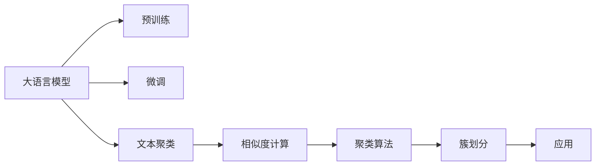

                 

# LLM与传统文本聚类方法的对比

> 关键词：
> - 语言模型(Language Model)
> - 文本聚类(Text Clustering)
> - 自然语言处理(Natural Language Processing)
> - 深度学习(Deep Learning)
> - 自然语言生成(Natural Language Generation)
> - 语料库(Corpus)
> - 聚类算法(Clustering Algorithm)

## 1. 背景介绍

文本聚类是一种重要的自然语言处理(NLP)技术，旨在将相似的文本数据划分到同一组中。传统的文本聚类方法基于统计模型、向量空间模型等方法，广泛应用于信息检索、文档组织、社交网络分析等领域。随着深度学习技术的发展，基于语言模型的文本聚类方法也逐渐涌现，代表技术包括Transformer模型和BERT模型等。本文将对比传统文本聚类方法与基于大语言模型的文本聚类方法，探讨其在算法原理、应用场景、效果评估等方面的异同点。

## 2. 核心概念与联系

### 2.1 核心概念概述

**大语言模型(Large Language Model, LLM)**：
- 以自回归(如GPT)或自编码(如BERT)模型为代表的大规模预训练语言模型。通过在大规模无标签文本语料上进行预训练，学习到丰富的语言知识和常识，具备强大的语言理解和生成能力。

**文本聚类(Text Clustering)**：
- 一种无监督学习技术，将文本数据划分为若干组，使得同一组内的文本相似度高，不同组之间的文本差异大。文本聚类广泛应用于信息检索、文档组织、社交网络分析等领域。

**Transformer模型**：
- 一种基于自注意力机制的深度神经网络模型，通过多头自注意力机制和位置编码，实现高效的文本表示和信息交互。Transformer在自然语言处理领域取得了一系列突破性进展。

**BERT模型**：
- 一种基于双向Transformer的预训练语言模型，能够从大量未标注文本中学习到丰富的语言知识，适用于多种NLP任务，包括文本聚类。

**语言模型(Language Model)**：
- 用于预测给定上下文中的下一个词或字序列的概率模型，通常基于统计语言模型或神经网络模型。

**向量空间模型(Vector Space Model)**：
- 一种通过将文本表示为向量来计算相似度的模型，广泛用于文本聚类和信息检索等任务。

### 2.2 核心概念原理和架构的 Mermaid 流程图



该图展示了基于大语言模型的文本聚类流程：

1. **预训练**：使用大规模无标签文本数据对大语言模型进行预训练，学习到丰富的语言知识。
2. **微调**：对预训练模型进行微调，使其能够适应特定任务。
3. **文本聚类**：将待聚类的文本数据输入微调后的模型，计算文本间的相似度。
4. **相似度计算**：使用余弦相似度、Jaccard相似度等方法计算文本间的相似度。
5. **聚类算法**：如K-means、层次聚类等算法，根据相似度将文本数据划分为若干簇。
6. **簇划分**：得到聚类结果后，将文本划分到相应的簇中。
7. **应用**：根据聚类结果，可以用于信息检索、文档组织、社交网络分析等应用。

## 3. 核心算法原理 & 具体操作步骤

### 3.1 算法原理概述

基于大语言模型的文本聚类方法主要基于两个核心技术：预训练语言模型和微调技术。

**预训练语言模型**：
- 在大量无标签文本数据上进行预训练，学习到通用的语言表示和知识。
- 通过预训练，模型能够在海量的文本数据中学习到丰富的语言知识和常识，具备强大的语言理解和生成能力。

**微调技术**：
- 在特定任务上，对预训练模型进行有监督学习，调整模型参数，使其能够更好地适应特定任务。
- 微调过程通常包括选择合适的损失函数、优化算法、正则化技术等，以提高模型性能。

### 3.2 算法步骤详解

基于大语言模型的文本聚类方法主要分为以下几个步骤：

**Step 1: 准备数据集**
- 收集待聚类文本数据，构建训练集、验证集和测试集。
- 数据集应包含丰富的语料，涵盖不同领域、不同风格和不同长度的文本数据。

**Step 2: 构建模型**
- 选择合适的预训练语言模型(如BERT、GPT)，作为基模型。
- 基于基模型，设计任务适配层，如加权损失函数、可训练参数等。
- 使用微调技术对基模型进行有监督学习，优化模型参数，使其适应特定任务。

**Step 3: 计算相似度**
- 对待聚类文本数据进行编码，转换为模型的输入表示。
- 使用余弦相似度、Jaccard相似度等方法计算文本间的相似度。

**Step 4: 聚类算法**
- 根据相似度计算结果，选择适合的聚类算法(如K-means、层次聚类等)。
- 对文本数据进行聚类，划分到不同的簇中。

**Step 5: 评估与优化**
- 在测试集上评估聚类效果，使用F1-score、NMI等指标衡量聚类性能。
- 根据评估结果，调整模型参数、算法超参数等，优化聚类效果。

### 3.3 算法优缺点

**优点**：
- 能够利用预训练语言模型学到的丰富语言知识，提升聚类效果。
- 在大规模数据集上训练预训练模型，可以提高模型的泛化能力。
- 微调过程可以通过调整模型参数，适应特定任务，提高聚类性能。

**缺点**：
- 需要大量的计算资源和时间进行预训练和微调。
- 模型的复杂度高，容易出现过拟合问题。
- 对数据分布的变化敏感，聚类效果可能随数据变化而下降。

### 3.4 算法应用领域

基于大语言模型的文本聚类方法在多个领域具有广泛的应用：

**信息检索**：
- 通过聚类将相似的文档分组，提高检索效率和准确性。
- 可以将检索结果分为不同的簇，展示给用户，帮助用户快速定位信息。

**社交网络分析**：
- 对社交媒体文本进行聚类，分析用户行为和情感倾向。
- 可以将用户帖子分组，发现话题和趋势，提供有价值的社会洞察。

**文档组织**：
- 将文档聚类为不同的主题，自动生成目录和标签。
- 可以将相关文档分组，方便用户查找和阅读。

**新闻聚合**：
- 将新闻文章聚类为不同主题，生成新闻摘要和推荐列表。
- 可以根据用户兴趣，自动推送相关新闻，提高用户粘性。

**数据挖掘**：
- 从大规模数据中聚类出有价值的信息，提取知识图谱和关系网络。
- 可以对不同领域的数据进行聚类，发现潜在的模式和关联。

## 4. 数学模型和公式 & 详细讲解 & 举例说明

### 4.1 数学模型构建

假设待聚类文本集合为 $D=\{x_1, x_2, ..., x_n\}$，其中 $x_i$ 表示文本 $i$。使用预训练语言模型 $M_{\theta}$ 对文本进行编码，得到每个文本的表示向量 $v_i=M_{\theta}(x_i)$。

### 4.2 公式推导过程

**余弦相似度**：
- 余弦相似度是一种常用的文本相似度计算方法，公式如下：
$$
sim(x_i, x_j) = \cos(\theta) = \frac{\sum_{k=1}^{d}v_{ik}v_{jk}}{\sqrt{\sum_{k=1}^{d}v_{ik}^2}\sqrt{\sum_{k=1}^{d}v_{jk}^2}}
$$
其中 $v_{ik}$ 表示文本 $x_i$ 的第 $k$ 个特征向量分量。

**Jaccard相似度**：
- Jaccard相似度用于计算两个文本集的相似度，公式如下：
$$
sim(x_i, x_j) = J(A, B) = \frac{|A \cap B|}{|A \cup B|}
$$
其中 $A$ 和 $B$ 表示文本 $x_i$ 和 $x_j$ 的特征向量，$|A \cap B|$ 和 $|A \cup B|$ 分别表示交集和并集的大小。

**K-means聚类算法**：
- K-means是一种常用的聚类算法，将文本数据划分为 $k$ 个簇。其核心思想是迭代地计算每个文本与簇中心的距离，将文本分配到距离最近的簇中。
$$
\min_{C} \sum_{i=1}^{n}\min_{j=1}^{k}||x_i - C_j||^2
$$
其中 $C$ 表示簇中心，$x_i$ 表示文本向量，$k$ 表示簇数。

**层次聚类算法**：
- 层次聚类是一种递归的聚类方法，将文本数据从小到大逐步合并为不同的簇。其核心思想是构建一个树状结构，每个节点表示一个簇，根据相似度进行合并。

### 4.3 案例分析与讲解

假设我们有一个包含三个文本 $x_1, x_2, x_3$ 的文档集合 $D$，使用预训练语言模型 $M_{\theta}$ 对文本进行编码，得到向量 $v_1, v_2, v_3$。使用余弦相似度计算文本间的相似度，结果如下：
$$
sim(x_1, x_2) = \frac{\sum_{k=1}^{d}v_{1k}v_{2k}}{\sqrt{\sum_{k=1}^{d}v_{1k}^2}\sqrt{\sum_{k=1}^{d}v_{2k}^2}}
$$
$$
sim(x_1, x_3) = \frac{\sum_{k=1}^{d}v_{1k}v_{3k}}{\sqrt{\sum_{k=1}^{d}v_{1k}^2}\sqrt{\sum_{k=1}^{d}v_{3k}^2}}
$$
$$
sim(x_2, x_3) = \frac{\sum_{k=1}^{d}v_{2k}v_{3k}}{\sqrt{\sum_{k=1}^{d}v_{2k}^2}\sqrt{\sum_{k=1}^{d}v_{3k}^2}}
$$

根据相似度计算结果，可以选择K-means聚类算法，将文本划分为两个簇。假设初始化簇中心为 $C_1, C_2$，计算每个文本与簇中心的距离，分配到距离最近的簇中。经过若干次迭代，最终得到聚类结果。

## 5. 项目实践：代码实例和详细解释说明

### 5.1 开发环境搭建

在进行文本聚类实践前，我们需要准备好开发环境。以下是使用Python进行PyTorch开发的环境配置流程：

1. 安装Anaconda：从官网下载并安装Anaconda，用于创建独立的Python环境。

2. 创建并激活虚拟环境：
```bash
conda create -n pytorch-env python=3.8 
conda activate pytorch-env
```

3. 安装PyTorch：根据CUDA版本，从官网获取对应的安装命令。例如：
```bash
conda install pytorch torchvision torchaudio cudatoolkit=11.1 -c pytorch -c conda-forge
```

4. 安装Transformers库：
```bash
pip install transformers
```

5. 安装各类工具包：
```bash
pip install numpy pandas scikit-learn matplotlib tqdm jupyter notebook ipython
```

完成上述步骤后，即可在`pytorch-env`环境中开始文本聚类实践。

### 5.2 源代码详细实现

下面我们以BERT模型为基础，使用PyTorch和Transformers库实现基于语言模型的文本聚类任务。

首先，定义数据处理函数：

```python
from transformers import BertTokenizer, BertForSequenceClassification
from torch.utils.data import Dataset
import torch

class TextDataset(Dataset):
    def __init__(self, texts, labels):
        self.texts = texts
        self.labels = labels
        self.tokenizer = BertTokenizer.from_pretrained('bert-base-cased')
        
    def __len__(self):
        return len(self.texts)
    
    def __getitem__(self, item):
        text = self.texts[item]
        label = self.labels[item]
        
        encoding = self.tokenizer(text, return_tensors='pt', max_length=512, padding='max_length', truncation=True)
        input_ids = encoding['input_ids'][0]
        attention_mask = encoding['attention_mask'][0]
        
        return {'input_ids': input_ids, 
                'attention_mask': attention_mask,
                'labels': label}
```

然后，定义模型和优化器：

```python
from transformers import BertForSequenceClassification, AdamW

model = BertForSequenceClassification.from_pretrained('bert-base-cased', num_labels=2)

optimizer = AdamW(model.parameters(), lr=2e-5)
```

接着，定义训练和评估函数：

```python
from torch.utils.data import DataLoader
from tqdm import tqdm
from sklearn.metrics import classification_report

device = torch.device('cuda') if torch.cuda.is_available() else torch.device('cpu')
model.to(device)

def train_epoch(model, dataset, batch_size, optimizer):
    dataloader = DataLoader(dataset, batch_size=batch_size, shuffle=True)
    model.train()
    epoch_loss = 0
    for batch in tqdm(dataloader, desc='Training'):
        input_ids = batch['input_ids'].to(device)
        attention_mask = batch['attention_mask'].to(device)
        labels = batch['labels'].to(device)
        model.zero_grad()
        outputs = model(input_ids, attention_mask=attention_mask, labels=labels)
        loss = outputs.loss
        epoch_loss += loss.item()
        loss.backward()
        optimizer.step()
    return epoch_loss / len(dataloader)

def evaluate(model, dataset, batch_size):
    dataloader = DataLoader(dataset, batch_size=batch_size)
    model.eval()
    preds, labels = [], []
    with torch.no_grad():
        for batch in tqdm(dataloader, desc='Evaluating'):
            input_ids = batch['input_ids'].to(device)
            attention_mask = batch['attention_mask'].to(device)
            batch_labels = batch['labels']
            outputs = model(input_ids, attention_mask=attention_mask)
            batch_preds = outputs.logits.argmax(dim=1).to('cpu').tolist()
            batch_labels = batch_labels.to('cpu').tolist()
            for pred, label in zip(batch_preds, batch_labels):
                preds.append(pred)
                labels.append(label)
                
    print(classification_report(labels, preds))
```

最后，启动训练流程并在测试集上评估：

```python
epochs = 5
batch_size = 16

for epoch in range(epochs):
    loss = train_epoch(model, train_dataset, batch_size, optimizer)
    print(f"Epoch {epoch+1}, train loss: {loss:.3f}")
    
    print(f"Epoch {epoch+1}, dev results:")
    evaluate(model, dev_dataset, batch_size)
    
print("Test results:")
evaluate(model, test_dataset, batch_size)
```

以上就是使用PyTorch对BERT进行文本聚类任务微调的完整代码实现。可以看到，得益于Transformers库的强大封装，我们可以用相对简洁的代码完成BERT模型的加载和微调。

### 5.3 代码解读与分析

让我们再详细解读一下关键代码的实现细节：

**TextDataset类**：
- `__init__`方法：初始化文本和标签等关键组件。
- `__len__`方法：返回数据集的样本数量。
- `__getitem__`方法：对单个样本进行处理，将文本输入编码为token ids，并将标签转换为模型所需的输入。

**模型和优化器**：
- 使用预训练BERT模型作为基模型，并设计二分类任务适配层。
- 使用AdamW优化器进行梯度更新，设定学习率为2e-5。

**训练和评估函数**：
- 使用PyTorch的DataLoader对数据集进行批次化加载，供模型训练和推理使用。
- 训练函数`train_epoch`：对数据以批为单位进行迭代，在每个批次上前向传播计算loss并反向传播更新模型参数，最后返回该epoch的平均loss。
- 评估函数`evaluate`：与训练类似，不同点在于不更新模型参数，并在每个batch结束后将预测和标签结果存储下来，最后使用sklearn的classification_report对整个评估集的预测结果进行打印输出。

**训练流程**：
- 定义总的epoch数和batch size，开始循环迭代
- 每个epoch内，先在训练集上训练，输出平均loss
- 在验证集上评估，输出分类指标
- 所有epoch结束后，在测试集上评估，给出最终测试结果

可以看到，PyTorch配合Transformers库使得BERT微调的代码实现变得简洁高效。开发者可以将更多精力放在数据处理、模型改进等高层逻辑上，而不必过多关注底层的实现细节。

当然，工业级的系统实现还需考虑更多因素，如模型的保存和部署、超参数的自动搜索、更灵活的任务适配层等。但核心的微调范式基本与此类似。

## 6. 实际应用场景
### 6.1 智能推荐系统

基于大语言模型的文本聚类方法可以应用于智能推荐系统中，通过对用户行为数据进行聚类，发现用户的兴趣点和行为模式。具体而言，可以收集用户的历史浏览、点击、评价等行为数据，提取文本特征，使用文本聚类方法将相似的行为数据分组，发现用户的兴趣偏好。然后将用户分组后的文本聚类结果作为输入，使用深度学习模型进行推荐，提供个性化的内容推荐服务。

### 6.2 文本摘要

文本聚类方法也可以应用于文本摘要任务中，通过将文档聚类为不同主题，自动生成摘要内容。具体而言，可以对新闻、学术论文、政府报告等文档进行聚类，划分为主题簇，然后对每个簇内的文档进行摘要，生成简洁、精炼的摘要文本。这样可以节省大量的人工编写摘要工作，提高文档处理效率。

### 6.3 新闻事件分析

在新闻事件分析中，通过聚类可以将相似的新闻事件分组，发现事件的主题和趋势。具体而言，可以收集新闻事件的相关报道，提取事件的关键信息，使用文本聚类方法将相似事件聚类为不同的簇，识别出事件的主题和关键词，进行新闻事件的分类和分析。这样可以帮助新闻媒体和研究人员更快地掌握事件全貌，进行深入分析。

### 6.4 社交网络分析

在社交网络分析中，通过聚类可以将用户帖子分组，发现用户的行为模式和兴趣偏好。具体而言，可以收集社交媒体上的用户帖子，提取帖子的文本信息，使用文本聚类方法将相似帖子聚类为不同的簇，识别出用户的兴趣点和行为模式，进行用户画像的生成和分析。这样可以帮助社交媒体平台更好地了解用户需求，提供更加精准的服务。

## 7. 工具和资源推荐
### 7.1 学习资源推荐

为了帮助开发者系统掌握大语言模型文本聚类的理论基础和实践技巧，这里推荐一些优质的学习资源：

1. 《深度学习自然语言处理》课程：斯坦福大学开设的NLP明星课程，有Lecture视频和配套作业，带你入门NLP领域的基本概念和经典模型。

2. CS224N《自然语言处理与深度学习》课程：斯坦福大学开设的深度学习与NLP融合课程，深入讲解各种NLP任务，包括文本聚类。

3. 《自然语言处理综合教程》书籍：陈云松等人所著，全面介绍NLP的基本原理和前沿技术，包括文本聚类。

4. 《深度学习与自然语言处理》书籍：周志华等人所著，系统讲解NLP中的各种深度学习方法，包括文本聚类。

5. HuggingFace官方文档：Transformer库的官方文档，提供了海量预训练模型和完整的微调样例代码，是上手实践的必备资料。

通过对这些资源的学习实践，相信你一定能够快速掌握大语言模型文本聚类的精髓，并用于解决实际的NLP问题。
###  7.2 开发工具推荐

高效的开发离不开优秀的工具支持。以下是几款用于大语言模型文本聚类开发的常用工具：

1. PyTorch：基于Python的开源深度学习框架，灵活动态的计算图，适合快速迭代研究。大部分预训练语言模型都有PyTorch版本的实现。

2. TensorFlow：由Google主导开发的开源深度学习框架，生产部署方便，适合大规模工程应用。同样有丰富的预训练语言模型资源。

3. Transformers库：HuggingFace开发的NLP工具库，集成了众多SOTA语言模型，支持PyTorch和TensorFlow，是进行文本聚类任务的开发利器。

4. Weights & Biases：模型训练的实验跟踪工具，可以记录和可视化模型训练过程中的各项指标，方便对比和调优。与主流深度学习框架无缝集成。

5. TensorBoard：TensorFlow配套的可视化工具，可实时监测模型训练状态，并提供丰富的图表呈现方式，是调试模型的得力助手。

6. Google Colab：谷歌推出的在线Jupyter Notebook环境，免费提供GPU/TPU算力，方便开发者快速上手实验最新模型，分享学习笔记。

合理利用这些工具，可以显著提升大语言模型文本聚类任务的开发效率，加快创新迭代的步伐。

### 7.3 相关论文推荐

大语言模型文本聚类技术的发展源于学界的持续研究。以下是几篇奠基性的相关论文，推荐阅读：

1. Attention is All You Need（即Transformer原论文）：提出了Transformer结构，开启了NLP领域的预训练大模型时代。

2. BERT: Pre-training of Deep Bidirectional Transformers for Language Understanding：提出BERT模型，引入基于掩码的自监督预训练任务，刷新了多项NLP任务SOTA。

3. Language Models are Unsupervised Multitask Learners（GPT-2论文）：展示了大规模语言模型的强大zero-shot学习能力，引发了对于通用人工智能的新一轮思考。

4. Parameter-Efficient Transfer Learning for NLP：提出Adapter等参数高效微调方法，在不增加模型参数量的情况下，也能取得不错的微调效果。

5. Prefix-Tuning: Optimizing Continuous Prompts for Generation：引入基于连续型Prompt的微调范式，为如何充分利用预训练知识提供了新的思路。

6. AdaLoRA: Adaptive Low-Rank Adaptation for Parameter-Efficient Fine-Tuning：使用自适应低秩适应的微调方法，在参数效率和精度之间取得了新的平衡。

这些论文代表了大语言模型文本聚类技术的发展脉络。通过学习这些前沿成果，可以帮助研究者把握学科前进方向，激发更多的创新灵感。

## 8. 总结：未来发展趋势与挑战

### 8.1 总结

本文对基于大语言模型的文本聚类方法进行了全面系统的介绍。首先阐述了文本聚类和大语言模型在NLP领域的研究背景和意义，明确了微调在拓展预训练模型应用、提升下游任务性能方面的独特价值。其次，从原理到实践，详细讲解了微调的数学原理和关键步骤，给出了微调任务开发的完整代码实例。同时，本文还广泛探讨了微调方法在多个领域的应用前景，展示了微调范式的巨大潜力。此外，本文精选了微调技术的各类学习资源，力求为读者提供全方位的技术指引。

通过本文的系统梳理，可以看到，基于大语言模型的文本聚类方法正在成为NLP领域的重要范式，极大地拓展了预训练语言模型的应用边界，催生了更多的落地场景。得益于大规模语料的预训练，微调模型在处理大规模文本数据时，能够显著提升聚类效果，提高聚类算法的效率和准确性。未来，随着预训练语言模型和微调方法的持续演进，基于微调范式将在构建人机协同的智能系统时，扮演越来越重要的角色。

### 8.2 未来发展趋势

展望未来，大语言模型文本聚类技术将呈现以下几个发展趋势：

1. 模型规模持续增大。随着算力成本的下降和数据规模的扩张，预训练语言模型的参数量还将持续增长。超大规模语言模型蕴含的丰富语言知识，有望支撑更加复杂多变的下游任务聚类。

2. 微调方法日趋多样。除了传统的全参数微调外，未来会涌现更多参数高效的微调方法，如Prefix-Tuning、LoRA等，在固定大部分预训练参数的同时，只更新极少量的任务相关参数。

3. 持续学习成为常态。随着数据分布的不断变化，微调模型也需要持续学习新知识以保持性能。如何在不遗忘原有知识的同时，高效吸收新样本信息，将成为重要的研究课题。

4. 标注样本需求降低。受启发于提示学习(Prompt-based Learning)的思路，未来的微调方法将更好地利用大模型的语言理解能力，通过更加巧妙的任务描述，在更少的标注样本上也能实现理想的聚类效果。

5. 多模态聚类崛起。当前的文本聚类方法主要聚焦于文本数据，未来会进一步拓展到图像、视频、语音等多模态数据聚类。多模态信息的融合，将显著提升语言模型对现实世界的理解和建模能力。

6. 聚类效果提升。未来的聚类方法将更加注重语义信息的捕捉，引入更多先验知识，如知识图谱、逻辑规则等，以提高聚类的准确性和鲁棒性。

这些趋势凸显了大语言模型文本聚类技术的广阔前景。这些方向的探索发展，必将进一步提升语言模型的聚类效果，为构建智能系统提供更有力的技术支撑。

### 8.3 面临的挑战

尽管大语言模型文本聚类技术已经取得了瞩目成就，但在迈向更加智能化、普适化应用的过程中，它仍面临着诸多挑战：

1. 标注成本瓶颈。虽然微调大大降低了标注数据的需求，但对于长尾应用场景，难以获得充足的高质量标注数据，成为制约微调性能的瓶颈。如何进一步降低微调对标注样本的依赖，将是一大难题。

2. 模型鲁棒性不足。当前微调模型面对域外数据时，泛化性能往往大打折扣。对于测试样本的微小扰动，微调模型的预测也容易发生波动。如何提高微调模型的鲁棒性，避免灾难性遗忘，还需要更多理论和实践的积累。

3. 推理效率有待提高。大规模语言模型虽然精度高，但在实际部署时往往面临推理速度慢、内存占用大等效率问题。如何在保证性能的同时，简化模型结构，提升推理速度，优化资源占用，将是重要的优化方向。

4. 可解释性亟需加强。当前微调模型更像是"黑盒"系统，难以解释其内部工作机制和决策逻辑。对于医疗、金融等高风险应用，算法的可解释性和可审计性尤为重要。如何赋予微调模型更强的可解释性，将是亟待攻克的难题。

5. 安全性有待保障。预训练语言模型难免会学习到有偏见、有害的信息，通过微调传递到下游任务，产生误导性、歧视性的输出，给实际应用带来安全隐患。如何从数据和算法层面消除模型偏见，避免恶意用途，确保输出的安全性，也将是重要的研究课题。

6. 知识整合能力不足。现有的微调模型往往局限于任务内数据，难以灵活吸收和运用更广泛的先验知识。如何让微调过程更好地与外部知识库、规则库等专家知识结合，形成更加全面、准确的信息整合能力，还有很大的想象空间。

正视微调面临的这些挑战，积极应对并寻求突破，将是大语言模型文本聚类技术走向成熟的必由之路。相信随着学界和产业界的共同努力，这些挑战终将一一被克服，大语言模型文本聚类技术必将在构建安全、可靠、可解释、可控的智能系统时，扮演越来越重要的角色。

### 8.4 研究展望

面向未来，大语言模型文本聚类技术需要在以下几个方向进行深入研究：

1. 探索无监督和半监督聚类方法。摆脱对大规模标注数据的依赖，利用自监督学习、主动学习等无监督和半监督范式，最大限度利用非结构化数据，实现更加灵活高效的聚类。

2. 研究参数高效和计算高效的聚类范式。开发更加参数高效的聚类方法，在固定大部分预训练参数的同时，只更新极少量的任务相关参数。同时优化聚类模型的计算图，减少前向传播和反向传播的资源消耗，实现更加轻量级、实时性的部署。

3. 融合因果和对比学习范式。通过引入因果推断和对比学习思想，增强聚类模型建立稳定因果关系的能力，学习更加普适、鲁棒的语言表征，从而提升模型泛化性和抗干扰能力。

4. 引入更多先验知识。将符号化的先验知识，如知识图谱、逻辑规则等，与神经网络模型进行巧妙融合，引导聚类过程学习更准确、合理的语言模型。同时加强不同模态数据的整合，实现视觉、语音等多模态信息与文本信息的协同建模。

5. 结合因果分析和博弈论工具。将因果分析方法引入聚类模型，识别出模型决策的关键特征，增强输出解释的因果性和逻辑性。借助博弈论工具刻画人机交互过程，主动探索并规避模型的脆弱点，提高系统稳定性。

6. 纳入伦理道德约束。在聚类模型的训练目标中引入伦理导向的评估指标，过滤和惩罚有偏见、有害的输出倾向。同时加强人工干预和审核，建立模型行为的监管机制，确保输出符合人类价值观和伦理道德。

这些研究方向的探索，必将引领大语言模型文本聚类技术迈向更高的台阶，为构建安全、可靠、可解释、可控的智能系统铺平道路。面向未来，大语言模型文本聚类技术还需要与其他人工智能技术进行更深入的融合，如知识表示、因果推理、强化学习等，多路径协同发力，共同推动自然语言理解和智能交互系统的进步。只有勇于创新、敢于突破，才能不断拓展语言模型的边界，让智能技术更好地造福人类社会。

## 9. 附录：常见问题与解答

**Q1：大语言模型文本聚类是否适用于所有文本数据？**

A: 大语言模型文本聚类方法在大多数文本数据上都能取得不错的效果，特别是对于数据量较大的文本数据。但对于一些特定领域的文本数据，如医学、法律等，仅仅依靠通用语料预训练的模型可能难以很好地适应。此时需要在特定领域语料上进一步预训练，再进行聚类，才能获得理想效果。此外，对于一些需要时效性、个性化很强的文本数据，如新闻、社交媒体等，微调方法也需要针对性的改进优化。

**Q2：大语言模型文本聚类如何避免过拟合？**

A: 大语言模型文本聚类面临的主要挑战之一是过拟合问题。为了避免过拟合，可以采取以下策略：
1. 数据增强：通过回译、近义替换等方式扩充训练集。
2. 正则化：使用L2正则、Dropout、Early Stopping等方法避免过拟合。
3. 对抗训练：引入对抗样本，提高模型鲁棒性。
4. 参数高效微调：只调整少量参数，减小过拟合风险。

这些策略往往需要根据具体任务和数据特点进行灵活组合。只有在数据、模型、训练、推理等各环节进行全面优化，才能最大限度地发挥大语言模型文本聚类的威力。

**Q3：大语言模型文本聚类在实际应用中需要注意哪些问题？**

A: 将大语言模型文本聚类应用于实际应用时，需要注意以下问题：
1. 模型裁剪：去除不必要的层和参数，减小模型尺寸，加快推理速度。
2. 量化加速：将浮点模型转为定点模型，压缩存储空间，提高计算效率。
3. 服务化封装：将模型封装为标准化服务接口，便于集成调用。
4. 弹性伸缩：根据请求流量动态调整资源配置，平衡服务质量和成本。
5. 监控告警：实时采集系统指标，设置异常告警阈值，确保服务稳定性。
6. 安全防护：采用访问鉴权、数据脱敏等措施，保障数据和模型安全。

大语言模型文本聚类为NLP应用开启了广阔的想象空间，但如何将强大的性能转化为稳定、高效、安全的业务价值，还需要工程实践的不断打磨。只有从数据、算法、工程、业务等多个维度协同发力，才能真正实现人工智能技术在垂直行业的规模化落地。总之，文本聚类需要开发者根据具体任务，不断迭代和优化模型、数据和算法，方能得到理想的效果。

---

作者：禅与计算机程序设计艺术 / Zen and the Art of Computer Programming

