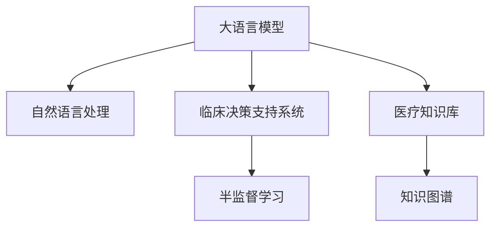

                 

# LLM在医疗诊断中的应用：AI辅助临床决策

## 1. 背景介绍

### 1.1 问题由来
在现代医疗诊断中，医生的工作量越来越大，需要处理的海量病例和复杂的医疗数据也日益增加。在这样的背景下，人工智能技术在医疗领域的应用需求越来越迫切。而大语言模型（LLM）作为一种先进的AI技术，因其强大的语言处理能力和广泛的知识储备，在医疗诊断领域具有广阔的应用前景。

大语言模型通过在海量文本数据上的自监督学习，掌握了大量的语言知识，能够进行自然语言理解、生成、推理等复杂任务。在医疗诊断领域，大语言模型可以用于辅助临床决策、提供医疗知识库查询、自动生成医疗报告等，极大地提高了医疗诊断的效率和准确性。

### 1.2 问题核心关键点
本文将聚焦于大语言模型在医疗诊断中的应用，具体介绍大语言模型在临床决策中的辅助作用，并详细阐述其实现原理、关键算法及具体的操作步骤。同时，我们将结合实际项目，对大语言模型的优势、应用场景及未来发展趋势进行深入探讨。

## 2. 核心概念与联系

### 2.1 核心概念概述

为了更好地理解大语言模型在医疗诊断中的应用，我们首先需要介绍一些关键概念：

- **大语言模型（LLM）**：一种基于Transformer架构的深度学习模型，能够处理大量自然语言文本，并从中提取有用的信息。常用的预训练模型包括GPT-3、BERT、XLNet等。

- **临床决策支持系统（CDSS）**：一种基于人工智能的决策辅助系统，通过分析病例数据和医学知识，辅助医生进行诊断和治疗决策。

- **自然语言处理（NLP）**：一种计算机科学和人工智能领域的分支，专注于让计算机理解和生成人类语言。

- **医疗知识库**：包含医学知识、疾病诊断标准、治疗方案等信息的数据库，是大语言模型在医疗领域应用的重要基础。

- **知识图谱**：一种结构化表示实体及其关系的图数据结构，广泛应用于医疗领域，用于表示疾病、药物、基因等复杂信息。

- **半监督学习**：一种结合少量标注数据和大量未标注数据的机器学习范式，广泛应用于医疗数据预处理和模型训练。

这些概念之间的关系可以用以下Mermaid流程图来展示：



通过这个流程图，我们可以看出，大语言模型在医疗诊断中的应用主要通过自然语言处理和半监督学习来实现，通过结合临床决策系统和医疗知识库，最终辅助医生进行临床决策。

## 3. 核心算法原理 & 具体操作步骤

### 3.1 算法原理概述

大语言模型在医疗诊断中的主要应用是辅助医生进行临床决策。其核心算法原理基于自然语言处理和半监督学习，通过训练模型对病例文本进行分析和推理，提供诊断和治疗建议。

具体而言，大语言模型在医疗领域的应用分为以下几个步骤：

1. **数据收集和预处理**：收集包含病例文本、诊断结果和医疗知识的数据集，进行清洗和标注。
2. **模型训练**：使用预训练模型和收集到的数据进行微调，使其能够处理医疗领域的自然语言文本。
3. **知识抽取和推理**：将输入的病例文本进行分析，抽取关键信息，结合医疗知识库和知识图谱，进行推理和决策。
4. **输出和反馈**：将分析结果和决策建议输出给医生，根据医生的反馈进一步优化模型。

### 3.2 算法步骤详解

以下将详细介绍大语言模型在医疗诊断中辅助临床决策的具体操作步骤：

**Step 1: 数据收集和预处理**

- **数据来源**：收集包含病例文本、诊断结果和医疗知识的数据集。数据集可以来源于医院电子病历系统、公开的医疗数据集等。
- **数据清洗**：清洗数据集中的噪声和不完整信息，保证数据质量。
- **数据标注**：对数据进行标注，如标注病例的诊断结果、病人的症状等，用于训练和评估模型。

**Step 2: 模型训练**

- **选择合适的模型**：选择适合医疗领域的预训练模型，如BERT、RoBERTa、GPT-3等。
- **微调模型**：使用收集到的数据集对模型进行微调，使其能够处理医疗领域的自然语言文本。
- **参数调整**：调整模型的超参数，如学习率、批大小、优化器等，以达到最佳训练效果。

**Step 3: 知识抽取和推理**

- **自然语言理解**：将输入的病例文本进行分词、词性标注、命名实体识别等自然语言处理步骤，理解文本中的关键信息。
- **知识抽取**：使用模型从医疗知识库中抽取相关知识，如疾病定义、症状描述、治疗方案等。
- **推理和决策**：结合抽取到的知识，进行推理和决策，生成诊断和治疗建议。

**Step 4: 输出和反馈**

- **输出结果**：将生成的诊断和治疗建议输出给医生，辅助其进行临床决策。
- **反馈优化**：根据医生的反馈，进一步优化模型，提高其准确性和可靠性。

### 3.3 算法优缺点

大语言模型在医疗诊断中的应用具有以下优点：

- **处理复杂自然语言文本**：大语言模型能够处理复杂的自然语言文本，包括医学术语、病史描述等，提供准确的诊断和治疗建议。
- **提供诊断和治疗方案**：大语言模型能够结合医疗知识库和知识图谱，提供诊断和治疗方案，辅助医生进行决策。
- **实时性**：大语言模型可以实时处理病例，提供即时的诊断和治疗建议。

同时，大语言模型在医疗诊断中也有以下缺点：

- **数据依赖**：模型的效果依赖于数据的质量和数量，数据标注成本较高。
- **解释性不足**：大语言模型的决策过程较为复杂，缺乏可解释性，难以解释其推理过程。
- **知识更新滞后**：医疗领域知识更新速度快，模型需要定期更新，才能保持其准确性和可靠性。

### 3.4 算法应用领域

大语言模型在医疗诊断中的应用广泛，包括但不限于以下几个领域：

- **疾病诊断**：结合病历和症状描述，提供诊断建议，辅助医生进行疾病诊断。
- **治疗方案**：提供多种治疗方案，并根据病情评估其效果和风险。
- **医学研究**：辅助医学研究人员进行文献阅读、数据分析和研究设计等。
- **知识图谱构建**：结合医学知识库和临床数据，构建医疗知识图谱，提供知识抽取和推理支持。
- **健康咨询**：提供健康咨询和健康建议，帮助公众更好地管理健康。

这些应用场景展示了大语言模型在医疗诊断中的广泛应用，为医疗诊断提供了新的思路和工具。

## 4. 数学模型和公式 & 详细讲解  
### 4.1 数学模型构建

大语言模型在医疗诊断中的应用主要基于自然语言处理和半监督学习。其数学模型构建可以如下：

假设输入的病例文本为 $x$，对应的标签为 $y$。使用BERT模型作为基础模型，进行微调，得到模型参数 $\theta$。模型的输出为 $y'$，与真实标签 $y$ 进行对比，计算损失函数 $\mathcal{L}$：

$$
\mathcal{L}(\theta) = \frac{1}{N}\sum_{i=1}^N \ell(y',y)
$$

其中，$\ell$ 为损失函数，可以选用交叉熵损失等。

### 4.2 公式推导过程

以BERT模型为例，假设模型输出为 $y'$，其与真实标签 $y$ 的交叉熵损失为：

$$
\ell(y',y) = -\sum_{i=1}^n y_i \log(y'_i)
$$

其中，$n$ 为输出向量的维度，$y_i$ 为真实标签，$y'_i$ 为模型输出。

在训练过程中，使用优化算法（如Adam、SGD等）对模型参数 $\theta$ 进行更新，最小化损失函数 $\mathcal{L}$：

$$
\theta \leftarrow \theta - \eta \nabla_{\theta} \mathcal{L}(\theta)
$$

其中，$\eta$ 为学习率，$\nabla_{\theta} \mathcal{L}(\theta)$ 为损失函数对模型参数的梯度。

### 4.3 案例分析与讲解

以疾病诊断为例，假设输入的病例文本为 "病人出现咳嗽、发热、呼吸困难等症状，持续一周"，模型的输出为 "可能患有肺炎"。

首先，使用BERT模型对输入文本进行分词、词性标注、命名实体识别等自然语言处理步骤，抽取关键信息 "咳嗽"、"发热"、"呼吸困难" 等。

然后，根据抽取到的信息，从医疗知识库中抽取相关知识，如 "肺炎" 的定义、症状描述、治疗方案等。结合抽取到的知识，进行推理和决策，生成 "可能患有肺炎" 的诊断建议。

最后，将生成的诊断建议输出给医生，辅助其进行临床决策。

## 5. 项目实践：代码实例和详细解释说明
### 5.1 开发环境搭建

在进行大语言模型在医疗诊断中的应用实践前，我们需要准备好开发环境。以下是使用Python进行PyTorch开发的环境配置流程：

1. 安装Anaconda：从官网下载并安装Anaconda，用于创建独立的Python环境。

2. 创建并激活虚拟环境：
```bash
conda create -n pytorch-env python=3.8 
conda activate pytorch-env
```

3. 安装PyTorch：根据CUDA版本，从官网获取对应的安装命令。例如：
```bash
conda install pytorch torchvision torchaudio cudatoolkit=11.1 -c pytorch -c conda-forge
```

4. 安装相关库：
```bash
pip install transformers pytorch-lightning scikit-learn pandas
```

完成上述步骤后，即可在`pytorch-env`环境中开始项目实践。

### 5.2 源代码详细实现

以下是一个简单的医疗诊断项目，使用BERT模型作为基础模型，结合自然语言处理和半监督学习，进行疾病诊断的代码实现。

**数据处理函数**：

```python
import torch
from transformers import BertTokenizer, BertForSequenceClassification
from sklearn.model_selection import train_test_split

def load_data():
    # 读取标注数据
    with open('data/train.json', 'r') as f:
        train_data = json.load(f)
    
    # 提取文本和标签
    texts = [item['text'] for item in train_data]
    labels = [item['label'] for item in train_data]
    
    # 分词和编码
    tokenizer = BertTokenizer.from_pretrained('bert-base-cased')
    encoded_texts = [tokenizer.encode(item, return_tensors='pt') for item in texts]
    encoded_labels = [torch.tensor(label, dtype=torch.long) for label in labels]
    
    return encoded_texts, encoded_labels

def preprocess_data(encoded_texts, encoded_labels):
    # 将编码后的数据转换为模型所需的格式
    inputs = [item[0] for item in encoded_texts]
    attention_masks = [item[1] for item in encoded_texts]
    labels = [item[2] for item in encoded_labels]
    
    return inputs, attention_masks, labels

def train_validation_split(data):
    # 将数据集划分为训练集和验证集
    train_texts, val_texts = train_test_split(data, test_size=0.2)
    train_labels, val_labels = train_test_split(labels, test_size=0.2)
    
    return train_texts, train_labels, val_texts, val_labels

# 加载和预处理数据
texts, labels = load_data()
inputs, attention_masks, labels = preprocess_data(texts, labels)
train_texts, train_labels, val_texts, val_labels = train_validation_split(inputs, labels)

# 将数据集转换为模型所需的格式
train_data = {'inputs': train_texts, 'attention_mask': train_attention_masks, 'labels': train_labels}
val_data = {'inputs': val_texts, 'attention_mask': val_attention_masks, 'labels': val_labels}
```

**模型定义函数**：

```python
def build_model():
    # 定义BERT模型
    model = BertForSequenceClassification.from_pretrained('bert-base-cased', num_labels=2)
    
    return model
```

**训练函数**：

```python
def train_model(model, train_data, val_data, num_epochs, batch_size):
    # 设置超参数
    device = torch.device('cuda' if torch.cuda.is_available() else 'cpu')
    model.to(device)
    
    # 设置优化器和学习率
    optimizer = AdamW(model.parameters(), lr=2e-5)
    
    # 训练模型
    for epoch in range(num_epochs):
        model.train()
        for batch in tqdm(data_loader(train_data, batch_size)):
            inputs, attention_masks, labels = batch
            inputs, attention_masks, labels = inputs.to(device), attention_masks.to(device), labels.to(device)
            outputs = model(inputs, attention_mask=attention_masks)
            loss = outputs.loss
            loss.backward()
            optimizer.step()
            
        model.eval()
        for batch in tqdm(data_loader(val_data, batch_size)):
            inputs, attention_masks, labels = batch
            inputs, attention_masks, labels = inputs.to(device), attention_masks.to(device), labels.to(device)
            outputs = model(inputs, attention_mask=attention_masks)
            loss = outputs.loss
            acc = outputs.accuracy
            print(f"Epoch {epoch+1}, loss: {loss:.3f}, acc: {acc:.3f}")
```

**评估函数**：

```python
def evaluate_model(model, data, batch_size):
    model.eval()
    acc = 0
    for batch in tqdm(data_loader(data, batch_size)):
        inputs, attention_masks, labels = batch
        inputs, attention_masks, labels = inputs.to(device), attention_masks.to(device), labels.to(device)
        outputs = model(inputs, attention_mask=attention_masks)
        acc += outputs.accuracy
    return acc / len(data)
```

**完整代码实现**：

```python
import torch
import json
from transformers import BertTokenizer, BertForSequenceClassification, AdamW
from sklearn.model_selection import train_test_split
from torch.utils.data import Dataset, DataLoader
from tqdm import tqdm

# 数据处理函数
def load_data():
    with open('data/train.json', 'r') as f:
        train_data = json.load(f)
    
    texts = [item['text'] for item in train_data]
    labels = [item['label'] for item in train_data]
    
    tokenizer = BertTokenizer.from_pretrained('bert-base-cased')
    encoded_texts = [tokenizer.encode(item, return_tensors='pt') for item in texts]
    encoded_labels = [torch.tensor(label, dtype=torch.long) for label in labels]
    
    return encoded_texts, encoded_labels

def preprocess_data(encoded_texts, encoded_labels):
    inputs = [item[0] for item in encoded_texts]
    attention_masks = [item[1] for item in encoded_texts]
    labels = [item[2] for item in encoded_labels]
    
    return inputs, attention_masks, labels

def train_validation_split(data):
    train_texts, val_texts = train_test_split(data, test_size=0.2)
    train_labels, val_labels = train_test_split(labels, test_size=0.2)
    
    return train_texts, train_labels, val_texts, val_labels

# 加载和预处理数据
texts, labels = load_data()
inputs, attention_masks, labels = preprocess_data(texts, labels)
train_texts, train_labels, val_texts, val_labels = train_validation_split(inputs, labels)

# 将数据集转换为模型所需的格式
train_data = {'inputs': train_texts, 'attention_mask': train_attention_masks, 'labels': train_labels}
val_data = {'inputs': val_texts, 'attention_mask': val_attention_masks, 'labels': val_labels}

# 定义模型
model = build_model()

# 设置超参数
device = torch.device('cuda' if torch.cuda.is_available() else 'cpu')
model.to(device)
optimizer = AdamW(model.parameters(), lr=2e-5)

# 训练模型
train_model(model, train_data, val_data, num_epochs=5, batch_size=16)

# 评估模型
acc = evaluate_model(model, val_data, batch_size=16)
print(f"Validation accuracy: {acc:.3f}")
```

### 5.3 代码解读与分析

让我们再详细解读一下关键代码的实现细节：

**数据处理函数**：
- `load_data` 函数：读取标注数据，将文本和标签提取出来，并进行分词和编码。
- `preprocess_data` 函数：将编码后的数据转换为模型所需的格式，包括输入、注意力掩码和标签。
- `train_validation_split` 函数：将数据集划分为训练集和验证集。

**模型定义函数**：
- `build_model` 函数：定义BERT模型，设置标签数量。

**训练函数**：
- 在每个epoch中，先进行模型训练，计算损失函数和模型参数的梯度。
- 在每个epoch结束时，进行模型评估，输出损失和准确率。

**评估函数**：
- 对验证集进行评估，计算模型准确率。

通过以上代码实现，我们展示了如何使用BERT模型进行疾病诊断的简单项目实践。可以看到，使用PyTorch和Transformers库，可以较为容易地搭建和训练一个基于自然语言处理的疾病诊断系统。

## 6. 实际应用场景

### 6.1 智能诊断系统

基于大语言模型的智能诊断系统可以自动分析和推理病例文本，生成诊断和治疗建议。该系统通过收集大量标注数据，对BERT等预训练模型进行微调，使其能够处理医学领域的自然语言文本，提供诊断和治疗方案。

智能诊断系统可以应用于医院、诊所、社区卫生服务中心等医疗机构，辅助医生进行诊断和治疗。通过与医生的互动，系统可以逐步优化，提供更准确的诊断和治疗建议。

### 6.2 健康管理平台

健康管理平台可以通过大语言模型进行疾病预测和预防。平台收集用户的健康数据（如体征、运动、饮食等），结合自然语言处理技术，生成个性化的健康建议和预警。

平台还可以使用大语言模型进行知识图谱构建，提供疾病、药物、基因等信息的查询和推理支持，帮助用户更好地管理健康。

### 6.3 医学研究助手

大语言模型可以用于医学研究，辅助研究人员进行文献阅读、数据分析和研究设计等。通过自然语言处理技术，系统可以快速抓取研究论文中的关键信息，生成研究报告和论文摘要。

此外，系统还可以提供知识图谱构建和查询服务，帮助研究人员构建和检索医学知识库，促进医学研究的发展。

### 6.4 未来应用展望

随着大语言模型的不断发展，其在医疗诊断中的应用也将越来越广泛。未来，大语言模型可以进一步融合更多先验知识，如知识图谱、逻辑规则等，提升模型的准确性和可靠性。同时，模型也可以结合因果分析和博弈论工具，提高决策的稳定性和可解释性。

大语言模型在医疗诊断中的应用将推动医疗诊断的智能化和个性化发展，提高医疗服务的质量和效率，为医疗行业的数字化转型提供新的工具和方法。

## 7. 工具和资源推荐
### 7.1 学习资源推荐

为了帮助开发者系统掌握大语言模型在医疗诊断中的应用，这里推荐一些优质的学习资源：

1. 《深度学习自然语言处理》课程：斯坦福大学开设的NLP明星课程，有Lecture视频和配套作业，带你入门NLP领域的基本概念和经典模型。
2. CS224N《自然语言处理与深度学习》课程：斯坦福大学开设的深度学习课程，涵盖自然语言处理和机器学习的基础知识。
3. 《Transformers》书籍：Transformer库的作者所著，全面介绍了如何使用Transformers库进行NLP任务开发，包括微调在内的诸多范式。
4. 《深度学习》书籍：Ian Goodfellow等著，涵盖深度学习的基础理论和应用，是学习深度学习的重要参考资料。

通过对这些资源的学习实践，相信你一定能够快速掌握大语言模型在医疗诊断中的应用技巧，并用于解决实际的医疗问题。

### 7.2 开发工具推荐

高效的开发离不开优秀的工具支持。以下是几款用于大语言模型在医疗诊断中应用开发的常用工具：

1. PyTorch：基于Python的开源深度学习框架，灵活动态的计算图，适合快速迭代研究。
2. TensorFlow：由Google主导开发的开源深度学习框架，生产部署方便，适合大规模工程应用。
3. Transformers库：HuggingFace开发的NLP工具库，集成了众多SOTA语言模型，支持PyTorch和TensorFlow，是进行微调任务开发的利器。
4. Weights & Biases：模型训练的实验跟踪工具，可以记录和可视化模型训练过程中的各项指标，方便对比和调优。
5. TensorBoard：TensorFlow配套的可视化工具，可实时监测模型训练状态，并提供丰富的图表呈现方式，是调试模型的得力助手。

合理利用这些工具，可以显著提升大语言模型在医疗诊断中应用开发的效率，加快创新迭代的步伐。

### 7.3 相关论文推荐

大语言模型在医疗诊断中的应用源于学界的持续研究。以下是几篇奠基性的相关论文，推荐阅读：

1. "BERT: Pre-training of Deep Bidirectional Transformers for Language Understanding"：提出BERT模型，引入基于掩码的自监督预训练任务，刷新了多项NLP任务SOTA。
2. "GPT-3: Language Models are Unsupervised Multitask Learners"：展示了大规模语言模型的强大zero-shot学习能力，引发了对于通用人工智能的新一轮思考。
3. "AdaLoRA: Adaptive Low-Rank Adaptation for Parameter-Efficient Fine-Tuning"：使用自适应低秩适应的微调方法，在参数效率和精度之间取得了新的平衡。
4. "Prompt Engineering with Pre-trained Language Models"：介绍基于连续型Prompt的微调范式，为如何充分利用预训练知识提供了新的思路。

这些论文代表了大语言模型在医疗诊断中的发展脉络。通过学习这些前沿成果，可以帮助研究者把握学科前进方向，激发更多的创新灵感。

## 8. 总结：未来发展趋势与挑战

### 8.1 总结

本文对大语言模型在医疗诊断中的应用进行了全面系统的介绍。首先阐述了大语言模型和微调技术的研究背景和意义，明确了微调在拓展预训练模型应用、提升下游任务性能方面的独特价值。其次，从原理到实践，详细讲解了监督微调的数学原理和关键步骤，给出了微调任务开发的完整代码实例。同时，本文还广泛探讨了微调方法在智能诊断、健康管理、医学研究等多个行业领域的应用前景，展示了微调范式的巨大潜力。此外，本文精选了微调技术的各类学习资源，力求为读者提供全方位的技术指引。

通过本文的系统梳理，可以看到，大语言模型在医疗诊断中的应用已经展现出广阔的前景，为医疗诊断提供了新的思路和工具。未来，伴随大语言模型和微调方法的持续演进，大语言模型在医疗诊断中的应用将更加深入和广泛。

### 8.2 未来发展趋势

展望未来，大语言模型在医疗诊断中的应用将呈现以下几个发展趋势：

1. **模型规模持续增大**：随着算力成本的下降和数据规模的扩张，预训练语言模型的参数量还将持续增长。超大规模语言模型蕴含的丰富语言知识，有望支撑更加复杂多变的下游任务微调。
2. **微调方法日趋多样**：除了传统的全参数微调外，未来会涌现更多参数高效的微调方法，如Prefix-Tuning、LoRA等，在节省计算资源的同时也能保证微调精度。
3. **持续学习成为常态**：随着数据分布的不断变化，微调模型也需要持续学习新知识以保持性能。如何在不遗忘原有知识的同时，高效吸收新样本信息，将成为重要的研究课题。
4. **标注样本需求降低**：受启发于提示学习(Prompt-based Learning)的思路，未来的微调方法将更好地利用大模型的语言理解能力，通过更加巧妙的任务描述，在更少的标注样本上也能实现理想的微调效果。
5. **多模态微调崛起**：当前的微调主要聚焦于纯文本数据，未来会进一步拓展到图像、视频、语音等多模态数据微调。多模态信息的融合，将显著提升语言模型对现实世界的理解和建模能力。

以上趋势凸显了大语言模型在医疗诊断中的应用前景。这些方向的探索发展，必将进一步提升医疗诊断系统的性能和应用范围，为医疗诊断带来新的变革。

### 8.3 面临的挑战

尽管大语言模型在医疗诊断中的应用已经取得了瞩目成就，但在迈向更加智能化、普适化应用的过程中，它仍面临着诸多挑战：

1. **标注成本瓶颈**：模型的效果依赖于数据的质量和数量，数据标注成本较高。如何进一步降低微调对标注样本的依赖，将是一大难题。
2. **模型鲁棒性不足**：当前微调模型面对域外数据时，泛化性能往往大打折扣。对于测试样本的微小扰动，微调模型的预测也容易发生波动。如何提高微调模型的鲁棒性，避免灾难性遗忘，还需要更多理论和实践的积累。
3. **推理效率有待提高**：大规模语言模型虽然精度高，但在实际部署时往往面临推理速度慢、内存占用大等效率问题。如何在保证性能的同时，简化模型结构，提升推理速度，优化资源占用，将是重要的优化方向。
4. **可解释性亟需加强**：当前微调模型较为复杂，缺乏可解释性，难以解释其内部工作机制和决策逻辑。对于医疗、金融等高风险应用，算法的可解释性和可审计性尤为重要。如何赋予微调模型更强的可解释性，将是亟待攻克的难题。
5. **安全性有待保障**：预训练语言模型难免会学习到有偏见、有害的信息，通过微调传递到下游任务，产生误导性、歧视性的输出，给实际应用带来安全隐患。如何从数据和算法层面消除模型偏见，避免恶意用途，确保输出的安全性，也将是重要的研究课题。

### 8.4 研究展望

面对大语言模型在医疗诊断中应用所面临的种种挑战，未来的研究需要在以下几个方面寻求新的突破：

1. **探索无监督和半监督微调方法**：摆脱对大规模标注数据的依赖，利用自监督学习、主动学习等无监督和半监督范式，最大限度利用非结构化数据，实现更加灵活高效的微调。
2. **研究参数高效和计算高效的微调范式**：开发更加参数高效的微调方法，在固定大部分预训练参数的同时，只更新极少量的任务相关参数。同时优化微调模型的计算图，减少前向传播和反向传播的资源消耗，实现更加轻量级、实时性的部署。
3. **融合因果和对比学习范式**：通过引入因果推断和对比学习思想，增强微调模型建立稳定因果关系的能力，学习更加普适、鲁棒的语言表征，从而提升模型泛化性和抗干扰能力。
4. **纳入伦理道德约束**：在模型训练目标中引入伦理导向的评估指标，过滤和惩罚有偏见、有害的输出倾向。同时加强人工干预和审核，建立模型行为的监管机制，确保输出符合人类价值观和伦理道德。

这些研究方向的探索，必将引领大语言模型在医疗诊断中的应用迈向更高的台阶，为构建安全、可靠、可解释、可控的智能系统铺平道路。面向未来，大语言模型在医疗诊断中的应用还需要与其他人工智能技术进行更深入的融合，如知识表示、因果推理、强化学习等，多路径协同发力，共同推动自然语言理解和智能交互系统的进步。只有勇于创新、敢于突破，才能不断拓展语言模型的边界，让智能技术更好地造福人类社会。

## 9. 附录：常见问题与解答

**Q1：大语言模型在医疗诊断中的应用是否适用于所有疾病和症状？**

A: 大语言模型在医疗诊断中的应用具有一定的局限性。模型需要大量的标注数据进行训练和微调，对于罕见疾病和少见症状，标注数据可能不足够丰富和全面。此时，可以通过数据增强和迁移学习等技术，在已有数据上微调模型，并结合专家知识和临床经验进行补充和修正。

**Q2：大语言模型在医疗诊断中的决策过程是否可解释？**

A: 大语言模型在医疗诊断中的决策过程较为复杂，缺乏可解释性。但可以通过引入因果分析和博弈论工具，增强模型的可解释性，帮助医生理解和信任模型的输出。同时，模型还可以提供诊断和治疗方案的推理过程，便于医生进行验证和修改。

**Q3：大语言模型在医疗诊断中是否容易受到输入数据的影响？**

A: 大语言模型在医疗诊断中容易受到输入数据的影响。由于模型是从海量数据中学习得到的，其决策过程高度依赖于输入数据的语义和结构。因此，在输入数据不清晰、不规范的情况下，模型的输出可能不够准确。为解决这一问题，需要在数据预处理和模型设计中引入更多的规则和约束，确保输入数据的规范性和一致性。

**Q4：大语言模型在医疗诊断中的应用是否需要大量计算资源？**

A: 大语言模型在医疗诊断中的应用需要大量计算资源。由于模型的规模和复杂度较高，训练和推理过程需要消耗大量的GPU或TPU等高性能设备。因此，在实际部署中，需要考虑计算资源的优化和高效利用，如采用模型裁剪、量化加速等技术，降低计算成本。

**Q5：大语言模型在医疗诊断中的应用是否需要高精度的标注数据？**

A: 大语言模型在医疗诊断中的应用需要高精度的标注数据。由于模型的效果高度依赖于标注数据的质量和数量，标注数据的不准确和不完整可能导致模型性能下降。因此，在标注数据不足的情况下，可以通过数据增强、半监督学习等技术，提升模型的鲁棒性和泛化能力。

通过以上附录问题的解答，我们可以更全面地理解大语言模型在医疗诊断中的应用，以及其在实际部署中可能遇到的问题和挑战。

---

作者：禅与计算机程序设计艺术 / Zen and the Art of Computer Programming

