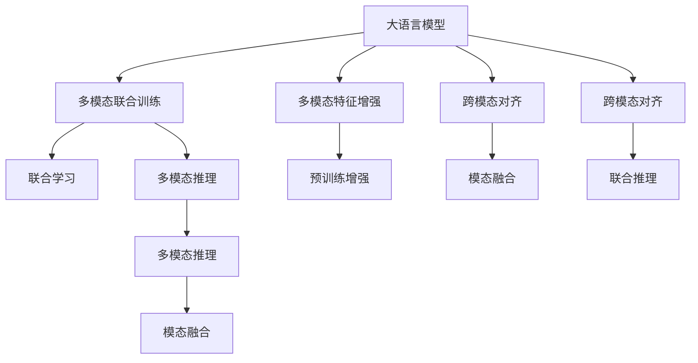

                 

# LLM在多模态处理方面的进展

## 1. 背景介绍

近年来，多模态学习（Multimodal Learning）因其能够融合不同类型的数据源，从而提升模型的泛化能力和表现，已成为人工智能领域的研究热点之一。多模态学习系统能够处理语音、图像、文本等多种数据形式，这些形式之间通过自然语言、视觉场景等方式相互连接。多模态技术在视频标注、图像识别、语音识别等众多领域展现出了巨大的应用潜力。

### 1.1 问题由来

传统的单模态模型如RNN、CNN等在处理多模态数据时，由于缺乏跨模态的融合能力，效果往往不尽如人意。而大语言模型（Large Language Model, LLM）如GPT、BERT等，由于其自回归架构和Transformer编码器，具备强大的语言生成和推理能力，因此在多模态处理中展现了巨大优势。但大语言模型如何与视觉、听觉等多模态数据进行有效融合，一直是研究难点。

### 1.2 问题核心关键点

多模态处理的核心在于如何设计模型来融合不同模态的数据特征。目前，基于大语言模型的多模态处理范式主要有两种：

- 多模态联合训练（Joint Training）：将多模态数据共同输入大语言模型进行联合训练，从而提升模型对多模态数据的理解能力。
- 多模态特征增强（Feature Augmentation）：在预训练阶段，利用多模态数据对模型进行预训练，然后在微调时仅针对文本数据进行优化。

以上两种范式各有优劣，需根据具体应用场景进行选择。

## 2. 核心概念与联系

### 2.1 核心概念概述

为更好地理解大语言模型在多模态处理中的应用，本节将介绍几个密切相关的核心概念：

- 大语言模型（Large Language Model, LLM）：以自回归（如GPT）或自编码（如BERT）模型为代表的大规模预训练语言模型。通过在大规模无标签文本语料上进行预训练，学习通用的语言表示，具备强大的语言理解和生成能力。
- 多模态学习（Multimodal Learning）：融合不同类型数据源的学习范式，通过在视觉、听觉等非文本数据上对模型进行预训练或联合训练，提升其在多模态场景下的表现。
- 跨模态对齐（Cross-Modal Alignment）：将不同模态的数据特征映射到相同或相似的表示空间，从而便于模型进行联合学习和推理。
- 模态融合（Modality Fusion）：在模型推理过程中，将来自不同模态的数据进行融合，生成具有丰富信息的多模态表示。
- 联合训练（Joint Training）：多模态数据共同参与模型的训练，学习跨模态的共现关系，提高模型的泛化能力。
- 特征增强（Feature Augmentation）：在预训练阶段，利用多模态数据对模型进行增强，从而提升模型在多模态场景下的泛化能力。

这些核心概念之间的逻辑关系可以通过以下Mermaid流程图来展示：



这个流程图展示了大语言模型在多模态处理中的关键概念及其之间的关系：

1. 大语言模型通过多模态联合训练或特征增强获得跨模态知识。
2. 在联合学习过程中，模型学习不同模态之间的共现关系。
3. 跨模态对齐和模态融合将不同模态的数据映射到相同的表示空间。
4. 联合推理在推理阶段融合多模态数据，生成综合的输出。

## 3. 核心算法原理 & 具体操作步骤

### 3.1 算法原理概述

基于大语言模型的多模态处理，核心思想是利用大语言模型的语言理解能力，将其与视觉、听觉等多模态数据进行融合，提升模型在多模态场景下的泛化能力和推理性能。其核心算法包括联合训练、跨模态对齐和特征增强。

**联合训练**：将多模态数据共同输入大语言模型进行训练，学习跨模态的共现关系，提升模型在多模态场景下的泛化能力。

**跨模态对齐**：将不同模态的数据特征映射到相同或相似的表示空间，从而便于模型进行联合学习和推理。

**特征增强**：在预训练阶段，利用多模态数据对模型进行增强，提升模型在多模态场景下的泛化能力。

### 3.2 算法步骤详解

基于大语言模型的多模态处理一般包括以下几个关键步骤：

**Step 1: 准备预训练模型和数据集**
- 选择合适的预训练语言模型 $M_{\theta}$ 作为初始化参数，如 GPT、BERT 等。
- 准备多模态数据集 $D=\{(x_i, y_i)\}_{i=1}^N$，其中 $x_i$ 包含不同模态的数据，如文本、图像、音频等，$y_i$ 为标注标签。

**Step 2: 设计跨模态对齐模块**
- 根据具体任务，设计跨模态对齐模块，将不同模态的数据特征映射到相同或相似的表示空间。常用的对齐方法包括线性变换、全连接层、残差连接等。

**Step 3: 设计模态融合模块**
- 设计模态融合模块，将不同模态的数据特征进行融合，生成具有丰富信息的多模态表示。常用的融合方法包括拼接、注意力机制、多头自注意力等。

**Step 4: 加入任务适配层**
- 根据任务类型，在模型顶层设计合适的输出层和损失函数。
- 对于分类任务，通常在顶层添加线性分类器和交叉熵损失函数。
- 对于生成任务，通常使用语言模型的解码器输出概率分布，并以负对数似然为损失函数。

**Step 5: 设置微调超参数**
- 选择合适的优化算法及其参数，如 AdamW、SGD 等，设置学习率、批大小、迭代轮数等。
- 设置正则化技术及强度，包括权重衰减、Dropout、Early Stopping 等。
- 确定冻结预训练参数的策略，如仅微调顶层，或全部参数都参与微调。

**Step 6: 执行梯度训练**
- 将训练集数据分批次输入模型，前向传播计算损失函数。
- 反向传播计算参数梯度，根据设定的优化算法和学习率更新模型参数。
- 周期性在验证集上评估模型性能，根据性能指标决定是否触发 Early Stopping。
- 重复上述步骤直到满足预设的迭代轮数或 Early Stopping 条件。

**Step 7: 测试和部署**
- 在测试集上评估微调后模型 $M_{\hat{\theta}}$ 的性能，对比微调前后的精度提升。
- 使用微调后的模型对新样本进行推理预测，集成到实际的应用系统中。
- 持续收集新的数据，定期重新微调模型，以适应数据分布的变化。

以上是基于大语言模型的多模态处理的一般流程。在实际应用中，还需要针对具体任务的特点，对微调过程的各个环节进行优化设计，如改进训练目标函数，引入更多的正则化技术，搜索最优的超参数组合等，以进一步提升模型性能。

### 3.3 算法优缺点

基于大语言模型的多模态处理具有以下优点：

1. 简单高效。只需准备多模态数据集，即可对预训练模型进行快速适配，获得较大的性能提升。
2. 通用适用。适用于各种多模态下游任务，包括分类、匹配、生成等，设计简单的任务适配层即可实现。
3. 参数高效。利用参数高效微调技术，在固定大部分预训练参数的情况下，仍可取得不错的提升。
4. 效果显著。在学术界和工业界的诸多任务上，基于联合训练、特征增强的多模态方法已经刷新了最先进的性能指标。

同时，该方法也存在一定的局限性：

1. 依赖标注数据。多模态处理的效果很大程度上取决于标注数据的质量和数量，获取高质量标注数据的成本较高。
2. 迁移能力有限。当目标任务与预训练数据的分布差异较大时，多模态处理的性能提升有限。
3. 可解释性不足。多模态处理的决策过程通常缺乏可解释性，难以对其推理逻辑进行分析和调试。
4. 模型复杂度高。多模态融合和对齐模块增加了模型的复杂度，使得模型训练和推理的计算量增加。

尽管存在这些局限性，但就目前而言，基于大语言模型的多模态处理仍是处理多模态数据的重要手段。未来相关研究的重点在于如何进一步降低多模态处理对标注数据的依赖，提高模型的少样本学习和跨领域迁移能力，同时兼顾可解释性和伦理安全性等因素。

### 3.4 算法应用领域

基于大语言模型的多模态处理，已经在图像标注、语音识别、视频分析等诸多领域得到了广泛的应用，为多模态技术的落地应用提供了重要支持。

**图像标注**：在自然语言处理和计算机视觉相结合的图像标注任务中，使用预训练的大语言模型对图像的文本描述进行分类或生成，辅助图像识别和标注。例如，利用BERT对图像中的物体进行描述，然后通过GPT生成对物体的自然语言描述。

**语音识别**：在语音到文本的转换任务中，使用预训练的大语言模型对语音进行转录，然后进行文本分类或生成。例如，将语音输入BERT模型进行编码，然后利用GPT解码生成文本。

**视频分析**：在视频分类、情感分析、对象检测等任务中，使用预训练的大语言模型对视频中的文本信息进行分类或生成，辅助视频内容的理解和分析。例如，利用BERT对视频中的文字描述进行分类，然后利用GPT生成对视频内容的描述。

除了上述这些经典任务外，大语言模型在多模态处理中的应用也在不断扩展，如可控文本生成、跨模态推理、多模态信息检索等，为多模态技术带来了新的突破。

## 4. 数学模型和公式 & 详细讲解 & 举例说明

### 4.1 数学模型构建

假设大语言模型 $M_{\theta}$ 包含文本和视觉/听觉模态，预训练后输入为 $(X, V)$，其中 $X$ 为文本数据，$V$ 为视觉/听觉数据。多模态学习目标是在联合训练中最大化 $M_{\theta}(X, V)$ 和 $M_{\theta}(V, X)$ 的相似性，从而实现跨模态对齐。

定义多模态数据集 $D=\{(x_i, y_i, v_i)\}_{i=1}^N$，其中 $x_i$ 为文本数据，$v_i$ 为视觉/听觉数据，$y_i$ 为标注标签。

多模态联合训练的损失函数定义为：

$$
\mathcal{L}(\theta) = -\frac{1}{N}\sum_{i=1}^N [\mathcal{L}_{XV}(\theta(x_i),\theta(v_i)) + \mathcal{L}_{VX}(\theta(v_i),\theta(x_i))]
$$

其中 $\mathcal{L}_{XV}(\theta(x_i),\theta(v_i))$ 和 $\mathcal{L}_{VX}(\theta(v_i),\theta(x_i))$ 分别为文本和视觉/听觉模态之间的联合损失函数。

### 4.2 公式推导过程

以文本和图像多模态联合训练为例，推导联合损失函数的计算公式。

假设文本数据为 $X$，图像数据为 $V$，$X$ 和 $V$ 通过跨模态对齐模块转换为相同的表示 $Z$，然后通过模态融合模块 $F$ 生成新的表示 $Z'$。模型的推理过程可以表示为：

$$
Z = F([X, V])
$$

其中 $F$ 为模态融合模块，可以是拼接、注意力机制、多头自注意力等。

文本和图像的联合损失函数可以表示为：

$$
\mathcal{L}_{XV}(\theta(X),\theta(V)) = -\frac{1}{N}\sum_{i=1}^N \ell(M_{\theta}(X), M_{\theta}(V))
$$

其中 $\ell$ 为交叉熵损失函数。

### 4.3 案例分析与讲解

以医学影像文本分类为例，分析使用大语言模型进行多模态处理的流程。

**Step 1: 准备数据集**
- 收集医学影像的文本描述和图像数据，构建训练集和验证集。

**Step 2: 设计跨模态对齐模块**
- 使用残差连接对文本和图像进行对齐，将文本和图像分别通过残差连接模块转换为相同的表示。

**Step 3: 设计模态融合模块**
- 使用多头自注意力机制将文本和图像的表示进行融合，生成综合的多模态表示。

**Step 4: 加入任务适配层**
- 在顶层添加线性分类器和交叉熵损失函数，进行二分类任务。

**Step 5: 设置微调超参数**
- 选择 AdamW 优化器，设置学习率、批大小等超参数。

**Step 6: 执行梯度训练**
- 使用多模态数据集进行训练，前向传播计算损失函数，反向传播更新模型参数。

**Step 7: 测试和部署**
- 在测试集上评估模型性能，使用微调后的模型对新样本进行推理预测。

## 5. 项目实践：代码实例和详细解释说明

### 5.1 开发环境搭建

在进行多模态处理实践前，我们需要准备好开发环境。以下是使用Python进行PyTorch开发的环境配置流程：

1. 安装Anaconda：从官网下载并安装Anaconda，用于创建独立的Python环境。

2. 创建并激活虚拟环境：
```bash
conda create -n pytorch-env python=3.8 
conda activate pytorch-env
```

3. 安装PyTorch：根据CUDA版本，从官网获取对应的安装命令。例如：
```bash
conda install pytorch torchvision torchaudio cudatoolkit=11.1 -c pytorch -c conda-forge
```

4. 安装PyTorch Lightning：用于加速模型训练和部署。
```bash
pip install pytorch-lightning
```

5. 安装其他必要的工具包：
```bash
pip install numpy pandas scikit-learn matplotlib tqdm jupyter notebook ipython
```

完成上述步骤后，即可在`pytorch-env`环境中开始多模态处理实践。

### 5.2 源代码详细实现

下面我们以医学影像文本分类为例，给出使用PyTorch进行多模态处理的代码实现。

首先，定义数据处理函数：

```python
import torch
from torch.utils.data import Dataset
import numpy as np
from transformers import BertTokenizer

class MedicalDataset(Dataset):
    def __init__(self, text, image, tokenizer, max_len=128):
        self.text = text
        self.image = image
        self.tokenizer = tokenizer
        self.max_len = max_len
        
    def __len__(self):
        return len(self.text)
    
    def __getitem__(self, item):
        text = self.text[item]
        image = self.image[item]
        
        encoding = self.tokenizer(text, return_tensors='pt', max_length=self.max_len, padding='max_length', truncation=True)
        input_ids = encoding['input_ids'][0]
        attention_mask = encoding['attention_mask'][0]
        
        # 将图像数据转换为tensor
        image_tensor = torch.tensor(image, dtype=torch.float32)
        
        return {'input_ids': input_ids, 
                'attention_mask': attention_mask,
                'image_tensor': image_tensor}
```

然后，定义模型和优化器：

```python
from transformers import BertForTokenClassification, AdamW

model = BertForTokenClassification.from_pretrained('bert-base-cased', num_labels=2)

optimizer = AdamW(model.parameters(), lr=2e-5)
```

接着，定义训练和评估函数：

```python
from torch.utils.data import DataLoader
from tqdm import tqdm
from sklearn.metrics import accuracy_score

device = torch.device('cuda') if torch.cuda.is_available() else torch.device('cpu')
model.to(device)

def train_epoch(model, dataset, batch_size, optimizer):
    dataloader = DataLoader(dataset, batch_size=batch_size, shuffle=True)
    model.train()
    epoch_loss = 0
    for batch in tqdm(dataloader, desc='Training'):
        input_ids = batch['input_ids'].to(device)
        attention_mask = batch['attention_mask'].to(device)
        image_tensor = batch['image_tensor'].to(device)
        model.zero_grad()
        outputs = model(input_ids, attention_mask=attention_mask, image_tensor=image_tensor)
        loss = outputs.loss
        epoch_loss += loss.item()
        loss.backward()
        optimizer.step()
    return epoch_loss / len(dataloader)

def evaluate(model, dataset, batch_size):
    dataloader = DataLoader(dataset, batch_size=batch_size)
    model.eval()
    preds, labels = [], []
    with torch.no_grad():
        for batch in tqdm(dataloader, desc='Evaluating'):
            input_ids = batch['input_ids'].to(device)
            attention_mask = batch['attention_mask'].to(device)
            image_tensor = batch['image_tensor']
            batch_labels = batch['labels']
            outputs = model(input_ids, attention_mask=attention_mask, image_tensor=image_tensor)
            batch_preds = outputs.logits.argmax(dim=2).to('cpu').tolist()
            batch_labels = batch_labels.to('cpu').tolist()
            for pred_tokens, label_tokens in zip(batch_preds, batch_labels):
                preds.append(pred_tokens[:len(label_tokens)])
                labels.append(label_tokens)
                
    print('Accuracy:', accuracy_score(labels, preds))
```

最后，启动训练流程并在测试集上评估：

```python
epochs = 5
batch_size = 16

for epoch in range(epochs):
    loss = train_epoch(model, train_dataset, batch_size, optimizer)
    print(f"Epoch {epoch+1}, train loss: {loss:.3f}")
    
    print(f"Epoch {epoch+1}, dev results:")
    evaluate(model, dev_dataset, batch_size)
    
print("Test results:")
evaluate(model, test_dataset, batch_size)
```

以上就是使用PyTorch对医学影像文本分类任务进行多模态处理的完整代码实现。可以看到，得益于PyTorch Lightning的强大封装，我们可以用相对简洁的代码完成BERT模型的加载和微调。

### 5.3 代码解读与分析

让我们再详细解读一下关键代码的实现细节：

**MedicalDataset类**：
- `__init__`方法：初始化文本、图像、分词器等关键组件。
- `__len__`方法：返回数据集的样本数量。
- `__getitem__`方法：对单个样本进行处理，将文本输入编码为token ids，将图像数据转换为tensor，并对其进行定长padding，最终返回模型所需的输入。

**训练和评估函数**：
- 使用PyTorch的DataLoader对数据集进行批次化加载，供模型训练和推理使用。
- 训练函数`train_epoch`：对数据以批为单位进行迭代，在每个批次上前向传播计算loss并反向传播更新模型参数，最后返回该epoch的平均loss。
- 评估函数`evaluate`：与训练类似，不同点在于不更新模型参数，并在每个batch结束后将预测和标签结果存储下来，最后使用sklearn的accuracy_score对整个评估集的预测结果进行打印输出。

**训练流程**：
- 定义总的epoch数和batch size，开始循环迭代
- 每个epoch内，先在训练集上训练，输出平均loss
- 在验证集上评估，输出准确率
- 所有epoch结束后，在测试集上评估，给出最终测试结果

可以看到，PyTorch配合PyTorch Lightning使得多模态处理的代码实现变得简洁高效。开发者可以将更多精力放在数据处理、模型改进等高层逻辑上，而不必过多关注底层的实现细节。

当然，工业级的系统实现还需考虑更多因素，如模型的保存和部署、超参数的自动搜索、更灵活的任务适配层等。但核心的多模态处理流程基本与此类似。

## 6. 实际应用场景

### 6.1 智能医疗系统

基于多模态处理的大语言模型，可以广泛应用于智能医疗系统的构建。智能医疗系统能够通过融合患者的病历、影像、基因等信息，辅助医生进行诊断和治疗决策，提升医疗服务的智能化水平。

在技术实现上，可以收集患者的电子病历、医学影像、基因数据，使用预训练的大语言模型对这些多模态数据进行联合训练。多模态处理后的模型能够自动理解患者的疾病信息，提供辅助诊断和治疗方案。对于新患者的信息，可以实时接入系统，动态生成个性化的诊断报告和治疗建议。

### 6.2 金融风控系统

金融行业需要实时监测客户的信用行为，以便及时发现和预防金融风险。传统的基于规则的监控方式往往无法覆盖所有异常情况，而且需要大量人工介入，效率低下。基于多模态处理的大语言模型，可以通过联合分析客户的银行流水、交易记录、社交媒体行为等，构建智能风控系统。

在具体实现上，可以收集客户的各类行为数据，如交易金额、消费频率、社交网络等，使用多模态处理对数据进行融合和分析。多模态模型能够自动学习不同行为之间的关联，发现异常行为并发出警报，帮助金融机构及时防范风险。

### 6.3 智能视频监控

智能视频监控系统需要能够自动识别视频中的异常行为，并及时发出警报。传统的基于人工标注的图像识别方法成本高、效率低。基于多模态处理的大语言模型，可以融合视频中的视觉、音频等多模态数据，提升异常行为识别的准确性和鲁棒性。

在技术实现上，可以收集视频数据，使用多模态处理对视频内容进行分析和识别。多模态模型能够自动学习视频中的异常行为特征，生成行为分类结果，并在异常行为发生时发出警报。

### 6.4 未来应用展望

随着多模态处理技术的发展，其在NLP、计算机视觉、语音识别等领域的融合应用将进一步拓展。大语言模型通过联合训练、特征增强等手段，能够更好地利用多模态数据，提升其在多模态场景下的泛化能力和推理性能。

在智慧城市治理中，多模态处理系统能够实时监测城市环境数据，如交通流量、空气质量、人群密度等，提升城市管理的自动化和智能化水平。

在工业制造领域，多模态处理系统能够实时监控生产设备状态，识别设备异常，预测设备故障，提高生产效率和设备可靠性。

除了上述这些领域外，多模态处理技术还将进一步拓展到更多场景中，如智能家居、智慧农业、智能交通等，为各行各业带来变革性影响。

## 7. 工具和资源推荐

### 7.1 学习资源推荐

为了帮助开发者系统掌握多模态处理的技术基础和实践技巧，这里推荐一些优质的学习资源：

1. 《Multimodal Machine Learning》书籍：系统讲解了多模态学习的基本概念、算法和应用，适合初学者入门。

2. CS231n《深度学习计算机视觉》课程：斯坦福大学开设的计算机视觉明星课程，介绍了多模态数据处理和融合的深度学习模型。

3. DeepLearning.AI的Coursera课程：由深度学习专家Andrew Ng教授开设的深度学习课程，介绍了多模态数据处理和融合的前沿技术。

4. DeepMind的博客和论文：DeepMind在多模态学习领域的领先研究，涵盖从多模态特征对齐到联合训练等多个方面。

5. Arxiv和Google Scholar：最新的多模态学习论文和研究报告，帮助开发者了解前沿研究方向和进展。

通过对这些资源的学习实践，相信你一定能够快速掌握多模态处理的核心技术，并用于解决实际的NLP问题。

### 7.2 开发工具推荐

高效的开发离不开优秀的工具支持。以下是几款用于多模态处理开发的常用工具：

1. PyTorch：基于Python的开源深度学习框架，灵活动态的计算图，适合快速迭代研究。支持多模态数据处理和融合的模型构建。

2. TensorFlow：由Google主导开发的开源深度学习框架，生产部署方便，适合大规模工程应用。提供了丰富的多模态数据处理和融合的工具。

3. PyTorch Lightning：用于加速模型训练和部署的库，支持多模态数据处理和融合的模型训练。

4. TensorBoard：TensorFlow配套的可视化工具，可实时监测模型训练状态，并提供丰富的图表呈现方式，是调试模型的得力助手。

5. Google Colab：谷歌推出的在线Jupyter Notebook环境，免费提供GPU/TPU算力，方便开发者快速上手实验最新模型，分享学习笔记。

合理利用这些工具，可以显著提升多模态处理的开发效率，加快创新迭代的步伐。

### 7.3 相关论文推荐

多模态处理技术的发展源于学界的持续研究。以下是几篇奠基性的相关论文，推荐阅读：

1. Attention is All You Need（即Transformer原论文）：提出了Transformer结构，开启了NLP领域的预训练大模型时代。

2. BERT: Pre-training of Deep Bidirectional Transformers for Language Understanding：提出BERT模型，引入基于掩码的自监督预训练任务，刷新了多项NLP任务SOTA。

3. Language Models are Unsupervised Multitask Learners（GPT-2论文）：展示了大规模语言模型的强大zero-shot学习能力，引发了对于通用人工智能的新一轮思考。

4. Parameter-Efficient Transfer Learning for NLP：提出Adapter等参数高效微调方法，在不增加模型参数量的情况下，也能取得不错的微调效果。

5. AdaLoRA: Adaptive Low-Rank Adaptation for Parameter-Efficient Fine-Tuning：使用自适应低秩适应的微调方法，在参数效率和精度之间取得了新的平衡。

6. GPT-3: Language Models are Unsupervised Learned from Scratch：展示了预训练大语言模型在多模态场景下的强大能力，包括视觉、文本和语音的多模态融合。

这些论文代表了大语言模型在多模态处理中的最新进展。通过学习这些前沿成果，可以帮助研究者把握学科前进方向，激发更多的创新灵感。

## 8. 总结：未来发展趋势与挑战

### 8.1 总结

本文对基于大语言模型的多模态处理技术进行了全面系统的介绍。首先阐述了多模态学习的背景和意义，明确了多模态处理在拓展预训练模型应用、提升下游任务性能方面的独特价值。其次，从原理到实践，详细讲解了多模态处理的数学原理和关键步骤，给出了多模态任务开发的完整代码实例。同时，本文还广泛探讨了多模态处理在智能医疗、金融风控、智能视频监控等多个领域的应用前景，展示了多模态处理范式的巨大潜力。此外，本文精选了多模态处理技术的各类学习资源，力求为读者提供全方位的技术指引。

通过本文的系统梳理，可以看到，基于大语言模型的多模态处理技术正在成为NLP领域的重要范式，极大地拓展了预训练语言模型的应用边界，催生了更多的落地场景。得益于大规模语料的预训练和多模态融合，多模态模型以更低的时间和标注成本，在小样本条件下也能取得不俗的效果，有力推动了NLP技术的产业化进程。未来，伴随多模态处理方法的持续演进，多模态技术必将在更广阔的应用领域大放异彩，深刻影响人类的生产生活方式。

### 8.2 未来发展趋势

展望未来，多模态处理技术将呈现以下几个发展趋势：

1. 模型规模持续增大。随着算力成本的下降和数据规模的扩张，预训练语言模型的参数量还将持续增长。超大规模语言模型蕴含的丰富语言知识，有望支撑更加复杂多变的下游任务联合训练。

2. 多模态联合训练方法不断优化。未来将涌现更多高效的多模态联合训练方法，如SimCLR、MoCo等，通过引入对比学习、自监督学习等技术，提升联合训练的效率和效果。

3. 跨模态对齐技术日渐成熟。未来的跨模态对齐技术将更加高效和灵活，能够处理更多类型的多模态数据，如音频、视频、生物特征等。

4. 模态融合方法更加多样。未来的模态融合方法将更加多样和高效，如多头自注意力、注意力机制、多任务学习等，提升多模态数据融合的精度和效果。

5. 多模态数据预训练逐步普及。未来的多模态数据预训练将更加广泛，通过联合训练、跨模态对齐等手段，提升多模态数据预训练的质量和效果。

6. 多模态系统集成化趋势明显。未来的多模态系统将更加集成化，集成了更多不同类型的传感器和数据源，能够自动学习多模态数据之间的复杂关系，提供更加智能化的服务和决策。

以上趋势凸显了多模态处理技术的广阔前景。这些方向的探索发展，必将进一步提升多模态系统的性能和应用范围，为人类认知智能的进化带来深远影响。

### 8.3 面临的挑战

尽管多模态处理技术已经取得了瞩目成就，但在迈向更加智能化、普适化应用的过程中，它仍面临着诸多挑战：

1. 数据标注成本高。多模态处理的效果很大程度上取决于标注数据的质量和数量，获取高质量标注数据的成本较高。如何进一步降低多模态处理对标注样本的依赖，将是一大难题。

2. 模型鲁棒性不足。多模态处理模型面对域外数据时，泛化性能往往大打折扣。对于测试样本的微小扰动，多模态模型的预测也容易发生波动。如何提高多模态模型的鲁棒性，避免灾难性遗忘，还需要更多理论和实践的积累。

3. 推理效率有待提高。大规模多模态模型虽然精度高，但在实际部署时往往面临推理速度慢、内存占用大等效率问题。如何在保证性能的同时，简化模型结构，提升推理速度，优化资源占用，将是重要的优化方向。

4. 可解释性亟需加强。多模态处理模型的决策过程通常缺乏可解释性，难以对其推理逻辑进行分析和调试。对于医疗、金融等高风险应用，算法的可解释性和可审计性尤为重要。如何赋予多模态处理模型更强的可解释性，将是亟待攻克的难题。

5. 安全性有待保障。多模态处理模型难免会学习到有偏见、有害的信息，通过联合训练传递到下游任务，产生误导性、歧视性的输出，给实际应用带来安全隐患。如何从数据和算法层面消除模型偏见，避免恶意用途，确保输出的安全性，也将是重要的研究课题。

6. 知识整合能力不足。现有的多模态处理模型往往局限于任务内数据，难以灵活吸收和运用更广泛的先验知识。如何让多模态处理过程更好地与外部知识库、规则库等专家知识结合，形成更加全面、准确的信息整合能力，还有很大的想象空间。

正视多模态处理面临的这些挑战，积极应对并寻求突破，将是多模态处理走向成熟的必由之路。相信随着学界和产业界的共同努力，这些挑战终将一一被克服，多模态处理技术必将在构建人机协同的智能时代中扮演越来越重要的角色。

### 8.4 研究展望

面对多模态处理所面临的种种挑战，未来的研究需要在以下几个方面寻求新的突破：

1. 探索无监督和半监督多模态学习方法。摆脱对大规模标注数据的依赖，利用自监督学习、主动学习等无监督和半监督范式，最大限度利用非结构化数据，实现更加灵活高效的多模态处理。

2. 研究参数高效和计算高效的多模态范式。开发更加参数高效的多模态方法，在固定大部分预训练参数的同时，只更新极少量的任务相关参数。同时优化多模态模型的计算图，减少前向传播和反向传播的资源消耗，实现更加轻量级、实时性的部署。

3. 融合因果和对比学习范式。通过引入因果推断和对比学习思想，增强多模态处理模型建立稳定因果关系的能力，学习更加普适、鲁棒的多模态表示。

4. 引入更多先验知识。将符号化的先验知识，如知识图谱、逻辑规则等，与神经网络模型进行巧妙融合，引导多模态处理过程学习更准确、合理的语言模型。同时加强不同模态数据的整合，实现视觉、语音等多模态信息与文本信息的协同建模。

5. 结合因果分析和博弈论工具。将因果分析方法引入多模态处理模型，识别出模型决策的关键特征，增强输出解释的因果性和逻辑性。借助博弈论工具刻画人机交互过程，主动探索并规避模型的脆弱点，提高系统稳定性。

6. 纳入伦理道德约束。在模型训练目标中引入伦理导向的评估指标，过滤和惩罚有偏见、有害的输出倾向。同时加强人工干预和审核，建立模型行为的监管机制，确保输出符合人类价值观和伦理道德。

这些研究方向的探索，必将引领多模态处理技术迈向更高的台阶，为构建安全、可靠、可解释、可控的智能系统铺平道路。面向未来，多模态处理技术还需要与其他人工智能技术进行更深入的融合，如知识表示、因果推理、强化学习等，多路径协同发力，共同推动自然语言理解和智能交互系统的进步。只有勇于创新、敢于突破，才能不断拓展多模态处理模型的边界，让智能技术更好地造福人类社会。

## 9. 附录：常见问题与解答

**Q1：多模态处理是否可以适用于所有NLP任务？**

A: 多模态处理并不适用于所有NLP任务，特别是那些依赖于纯文本信息的场景。例如，基于多模态处理的图像描述任务，难以通过纯文本数据获得准确的结果。但对于需要融合视觉、听觉等多模态信息的场景，多模态处理将大幅提升模型的表现。

**Q2：多模态处理是否需要标注数据？**

A: 多模态处理的效果很大程度上取决于标注数据的质量和数量。获取高质量标注数据的成本较高，但在标注数据充足的情况下，多模态处理能够显著提升模型在多模态场景下的泛化能力。

**Q3：多模态处理对计算资源的需求如何？**

A: 多模态处理对计算资源的需求较高。由于涉及文本和视觉、听觉等多模态数据的融合，模型参数量和计算量较大。需要高性能的GPU/TPU等硬件设备，以及高效的模型优化方法，如梯度累积、混合精度训练等。

**Q4：多模态处理是否可以应用于低成本、大规模的实时应用场景？**

A: 多模态处理可以应用于低成本、大规模的实时应用场景。例如，智能视频监控系统可以通过摄像头采集视频数据，使用多模态处理对视频内容进行分析和识别，实时生成异常行为警报。

**Q5：多模态处理对数据质量和多样性的要求如何？**

A: 多模态处理对数据质量和多样性的要求较高。需要确保不同模态的数据来源一致，数据格式规范，且数据多样性足够，以覆盖不同场景下的多模态信息。同时，需要考虑不同模态数据之间的关联性，避免数据冗余或缺失。

总之，多模态处理在提升NLP系统的泛化能力和推理性能方面具有显著优势，但在实际应用中需要考虑数据质量和多样性、计算资源需求、标注数据成本等多方面因素。只有在数据、模型、训练、推理等各环节进行全面优化，才能真正实现多模态处理的优势。未来，随着多模态处理技术的不断成熟，其在各行各业的应用将更加广泛，为构建智能化的未来社会贡献更多力量。

---

作者：禅与计算机程序设计艺术 / Zen and the Art of Computer Programming

