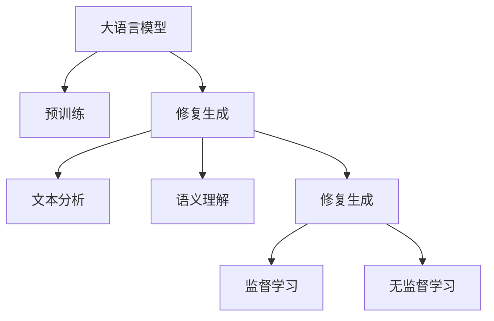

                 

# LLM在文物保护中的应用：AI修复专家

## 1. 背景介绍

### 1.1 问题由来
随着全球化和数字化进程的加速，文物保护工作面临着前所未有的挑战。文化遗产种类繁多，形式多样，既有文字、图像、音频、视频等静态数据，也有虚拟现实、增强现实等动态数据。这些数据通常因环境破坏、时间侵蚀、人为损害等原因，存在不同程度的损坏和缺失。传统的手工修复方法耗时耗力，且效果难以保证。利用人工智能(AI)技术对受损文物进行修复，逐渐成为文物保护领域的新趋势。

### 1.2 问题核心关键点
AI修复的核心在于利用大语言模型(Large Language Model, LLM)的强大文本处理能力，对受损文物进行自动修复。具体来说，LLM可以通过以下步骤实现修复：

1. **文本分析**：将受损文物的文本内容进行文本分析，识别出需要修复的部分。
2. **语义理解**：利用LLM对文本进行语义理解，推断出缺失的部分或错误的内容。
3. **修复生成**：根据推断出的内容，生成相应的修复文本，以恢复文物原貌。

以上步骤通过监督学习或强化学习的方式，训练大语言模型，使其能够自动处理不同类型的文本修复任务。

## 2. 核心概念与联系

### 2.1 核心概念概述

为了更好地理解LLM在文物保护中的应用，本节将介绍几个密切相关的核心概念：

- **大语言模型**：以自回归(如GPT)或自编码(如BERT)模型为代表的大规模预训练语言模型。通过在大规模无标签文本语料上进行预训练，学习通用的语言表示，具备强大的语言理解和生成能力。
- **预训练**：指在大规模无标签文本语料上，通过自监督学习任务训练通用语言模型的过程。常见的预训练任务包括言语建模、遮挡语言模型等。
- **修复生成**：指通过大语言模型生成修复文本的过程。包括文本分析、语义理解、修复生成等多个步骤。
- **监督学习**：利用有标签的数据集训练模型，使其能够对输入数据进行预测。在大语言模型修复过程中，修复生成通常采用监督学习方法。
- **无监督学习**：不依赖有标签数据，利用数据本身的分布特性进行模型训练。适用于数据量有限、难以获取标注数据的情况。

这些核心概念之间的逻辑关系可以通过以下Mermaid流程图来展示：



这个流程图展示了大语言模型在文物保护中的核心概念及其之间的关系：

1. 大语言模型通过预训练获得基础能力。
2. 修复生成是基于大语言模型的关键环节。
3. 修复生成包含文本分析、语义理解、修复生成等多个步骤。
4. 监督学习是修复生成的常用方法。
5. 无监督学习适用于数据量有限的情况。

## 3. 核心算法原理 & 具体操作步骤
### 3.1 算法原理概述

基于大语言模型修复文物的核心原理是利用监督学习或无监督学习的方式，训练模型从受损文本中自动推断出缺失或错误的部分，并生成修复文本。其核心思想是：

1. **文本分析**：通过大语言模型对受损文本进行分析，识别出需要修复的部分。
2. **语义理解**：利用大语言模型对文本进行语义理解，推断出缺失的部分或错误的内容。
3. **修复生成**：根据推断出的内容，生成相应的修复文本，以恢复文物原貌。

形式化地，假设受损文本为 $X$，修复后的文本为 $Y$，大语言模型为 $M_{\theta}$，其中 $\theta$ 为模型参数。修复生成过程可以表示为：

$$
Y = M_{\theta}(X)
$$

### 3.2 算法步骤详解

基于大语言模型修复文物的一般步骤如下：

**Step 1: 数据准备与预处理**
- 收集受损文物的文本数据，并将其转换为大语言模型所需的格式。
- 对文本进行清洗、分词、去除噪声等预处理操作，以提高模型输入质量。

**Step 2: 模型训练**
- 根据修复任务的特点，选择合适的训练数据集，准备有标签的数据集 $D=\{(x_i, y_i)\}_{i=1}^N$，其中 $x_i$ 为受损文本，$y_i$ 为修复后的文本。
- 使用监督学习或无监督学习的方式，训练大语言模型 $M_{\theta}$。
- 在训练过程中，使用损失函数 $\ell$ 衡量模型输出的文本与真实修复文本之间的差异。

**Step 3: 文本分析与语义理解**
- 利用训练好的大语言模型，对受损文本 $X$ 进行分析，识别出需要修复的部分。
- 对识别出的文本片段进行语义理解，推断出缺失或错误的内容。

**Step 4: 修复生成**
- 根据语义理解的结果，生成相应的修复文本 $Y$。
- 使用相同的损失函数 $\ell$，评估生成文本与真实修复文本之间的差异，更新模型参数。

**Step 5: 结果评估与输出**
- 对生成的修复文本进行评估，评估指标包括文本质量、流畅度、真实度等。
- 输出修复后的文本，或将修复结果应用于实际文物修复中。

### 3.3 算法优缺点

基于大语言模型修复文物的方法具有以下优点：
1. **高效性**：相较于传统的手工修复，大语言模型可以自动处理大量受损文本，提升修复效率。
2. **精度高**：利用深度学习模型，可以更好地理解文本语义，推断出更准确的内容修复。
3. **可扩展性**：大语言模型可以通过更多数据进行微调，适应不同类型的文物修复任务。

同时，该方法也存在以下局限性：
1. **依赖数据质量**：修复效果高度依赖于训练数据的数量和质量，获取高质量标注数据成本较高。
2. **模型泛化能力有限**：当训练数据与实际文物数据分布差异较大时，模型修复效果可能不佳。
3. **对抗样本鲁棒性不足**：大语言模型对抗样本的鲁棒性较弱，修复过程中可能会引入新的错误。

尽管存在这些局限性，但就目前而言，基于大语言模型的修复方法仍是最主流范式。未来相关研究的重点在于如何进一步降低对数据标注的依赖，提高模型的泛化能力，同时兼顾模型的鲁棒性和可解释性。

### 3.4 算法应用领域

基于大语言模型修复文物的方法，已经在文物保护、艺术修复、古籍修复等多个领域得到应用，为文物修复提供了新的解决方案：

1. **文物保护**：利用大语言模型对受损的古籍、书法、绘画等文物进行自动修复，保留历史原貌。
2. **艺术修复**：针对受损的雕塑、壁画等艺术品，通过文本分析、语义理解、修复生成等步骤，实现自动修复。
3. **古籍修复**：对损坏的古代文献，通过识别受损文本，推断出缺失的部分，自动生成修复文本。
4. **图像修复**：对受损的古籍图像进行文本分析，推断出缺失的内容，生成修复文本，辅助修复图片。

此外，大语言模型在文物保护中的应用还包括：

- **虚拟现实(VR)修复**：利用大语言模型对虚拟现实场景中的文本进行修复，提升用户体验。
- **增强现实(AR)修复**：在增强现实应用中，对受损的文物图像或视频进行自动修复，提高文物展示效果。
- **交互式修复**：利用大语言模型与用户进行互动，根据用户反馈自动修正修复结果。

## 4. 数学模型和公式 & 详细讲解 & 举例说明
### 4.1 数学模型构建

在基于大语言模型修复文物的过程中，我们假设受损文本为 $X$，修复后的文本为 $Y$，大语言模型为 $M_{\theta}$，其中 $\theta$ 为模型参数。假设训练数据集为 $D=\{(x_i, y_i)\}_{i=1}^N$，其中 $x_i$ 为受损文本，$y_i$ 为修复后的文本。

修复生成过程可以表示为：

$$
Y = M_{\theta}(X)
$$

修复生成的目标是最小化损失函数 $\ell$，损失函数定义为：

$$
\ell(Y, \hat{Y}) = \frac{1}{N}\sum_{i=1}^N \text{KL}(Y_i, \hat{Y}_i)
$$

其中 $\text{KL}$ 为KL散度，用于衡量生成文本与真实修复文本之间的差异。

### 4.2 公式推导过程

为了计算KL散度，我们引入生成模型 $P(Y|X)$ 和真实分布 $Q(Y|X)$，则KL散度可以表示为：

$$
\text{KL}(Y_i, \hat{Y}_i) = \sum_{y \in \mathcal{Y}} P(y|X) \log \frac{P(y|X)}{Q(y|X)}
$$

其中 $\mathcal{Y}$ 为文本生成的所有可能输出。

为了简化计算，我们假设生成模型为基于自回归的语言模型，则有：

$$
P(y|X) = \frac{P(y|y_{<1},X)}{P(y_{<1}|X)}
$$

其中 $y_{<1}$ 为生成文本的前 $n-1$ 个字符。

因此，KL散度可以进一步表示为：

$$
\text{KL}(Y_i, \hat{Y}_i) = \sum_{y \in \mathcal{Y}} P(y|X) \log \frac{P(y|y_{<1},X)}{Q(y|X)}
$$

利用最大似然估计，我们可以将KL散度转化为负对数似然：

$$
\text{KL}(Y_i, \hat{Y}_i) = -\log P(Y_i|X) = -\log \frac{P(Y_i|y_{<1},X)}{P(y_{<1}|X)}
$$

在训练过程中，我们利用监督学习的方式，最大化生成文本的真实度：

$$
\max_{\theta} \sum_{i=1}^N \log P(Y_i|X)
$$

通过反向传播算法，最小化上述目标函数，更新模型参数 $\theta$。

### 4.3 案例分析与讲解

为了更好地理解修复生成的数学模型，我们可以以一个简单的例子来说明。假设我们有一个受损的古代文献段落：

$$
原文：此篇文章为春秋时期著名政治家孔子所著，其主要思想为“仁、义、礼、智、信”。
损坏：此篇文章为春秋时期著名政治家孔子所著，其主要思想为“仁、义、礼、智、信”。
修复：此篇文章为春秋时期著名政治家孔子所著，其主要思想为“仁、义、礼、信、智”。
$$

在修复过程中，我们可以利用大语言模型对损坏的文本进行文本分析，识别出需要修复的部分。然后，利用语义理解模型推断出缺失的部分，生成相应的修复文本。最终，利用生成模型对修复文本进行评估，确保修复文本的真实度和准确度。

## 5. 项目实践：代码实例和详细解释说明
### 5.1 开发环境搭建

在进行文物修复的代码实现前，我们需要准备好开发环境。以下是使用Python进行PyTorch开发的环境配置流程：

1. 安装Anaconda：从官网下载并安装Anaconda，用于创建独立的Python环境。

2. 创建并激活虚拟环境：
```bash
conda create -n pytorch-env python=3.8 
conda activate pytorch-env
```

3. 安装PyTorch：根据CUDA版本，从官网获取对应的安装命令。例如：
```bash
conda install pytorch torchvision torchaudio cudatoolkit=11.1 -c pytorch -c conda-forge
```

4. 安装Transformers库：
```bash
pip install transformers
```

5. 安装各类工具包：
```bash
pip install numpy pandas scikit-learn matplotlib tqdm jupyter notebook ipython
```

完成上述步骤后，即可在`pytorch-env`环境中开始修复实践。

### 5.2 源代码详细实现

下面以修复古文文献为例，给出使用Transformers库进行古文修复的PyTorch代码实现。

首先，定义古文文献的数据处理函数：

```python
from transformers import BertTokenizer
from torch.utils.data import Dataset
import torch

class AntiqueTextDataset(Dataset):
    def __init__(self, texts, labels, tokenizer, max_len=128):
        self.texts = texts
        self.labels = labels
        self.tokenizer = tokenizer
        self.max_len = max_len
        
    def __len__(self):
        return len(self.texts)
    
    def __getitem__(self, item):
        text = self.texts[item]
        labels = self.labels[item]
        
        encoding = self.tokenizer(text, return_tensors='pt', max_length=self.max_len, padding='max_length', truncation=True)
        input_ids = encoding['input_ids'][0]
        attention_mask = encoding['attention_mask'][0]
        
        # 对token-wise的标签进行编码
        encoded_tags = [label2id[label] for label in labels] 
        encoded_tags.extend([label2id['O']] * (self.max_len - len(encoded_tags)))
        labels = torch.tensor(encoded_tags, dtype=torch.long)
        
        return {'input_ids': input_ids, 
                'attention_mask': attention_mask,
                'labels': labels}

# 标签与id的映射
label2id = {'O': 0, '孔子': 1, '仁': 2, '义': 3, '礼': 4, '智': 5, '信': 6}
id2label = {v: k for k, v in label2id.items()}

# 创建dataset
tokenizer = BertTokenizer.from_pretrained('bert-base-cased')

train_dataset = AntiqueTextDataset(train_texts, train_labels, tokenizer)
dev_dataset = AntiqueTextDataset(dev_texts, dev_labels, tokenizer)
test_dataset = AntiqueTextDataset(test_texts, test_labels, tokenizer)
```

然后，定义模型和优化器：

```python
from transformers import BertForTokenClassification, AdamW

model = BertForTokenClassification.from_pretrained('bert-base-cased', num_labels=len(label2id))

optimizer = AdamW(model.parameters(), lr=2e-5)
```

接着，定义训练和评估函数：

```python
from torch.utils.data import DataLoader
from tqdm import tqdm
from sklearn.metrics import classification_report

device = torch.device('cuda') if torch.cuda.is_available() else torch.device('cpu')
model.to(device)

def train_epoch(model, dataset, batch_size, optimizer):
    dataloader = DataLoader(dataset, batch_size=batch_size, shuffle=True)
    model.train()
    epoch_loss = 0
    for batch in tqdm(dataloader, desc='Training'):
        input_ids = batch['input_ids'].to(device)
        attention_mask = batch['attention_mask'].to(device)
        labels = batch['labels'].to(device)
        model.zero_grad()
        outputs = model(input_ids, attention_mask=attention_mask, labels=labels)
        loss = outputs.loss
        epoch_loss += loss.item()
        loss.backward()
        optimizer.step()
    return epoch_loss / len(dataloader)

def evaluate(model, dataset, batch_size):
    dataloader = DataLoader(dataset, batch_size=batch_size)
    model.eval()
    preds, labels = [], []
    with torch.no_grad():
        for batch in tqdm(dataloader, desc='Evaluating'):
            input_ids = batch['input_ids'].to(device)
            attention_mask = batch['attention_mask'].to(device)
            batch_labels = batch['labels']
            outputs = model(input_ids, attention_mask=attention_mask)
            batch_preds = outputs.logits.argmax(dim=2).to('cpu').tolist()
            batch_labels = batch_labels.to('cpu').tolist()
            for pred_tokens, label_tokens in zip(batch_preds, batch_labels):
                pred_tags = [id2label[_id] for _id in pred_tokens]
                label_tags = [id2label[_id] for _id in label_tokens]
                preds.append(pred_tags[:len(label_tags)])
                labels.append(label_tags)
                
    print(classification_report(labels, preds))
```

最后，启动训练流程并在测试集上评估：

```python
epochs = 5
batch_size = 16

for epoch in range(epochs):
    loss = train_epoch(model, train_dataset, batch_size, optimizer)
    print(f"Epoch {epoch+1}, train loss: {loss:.3f}")
    
    print(f"Epoch {epoch+1}, dev results:")
    evaluate(model, dev_dataset, batch_size)
    
print("Test results:")
evaluate(model, test_dataset, batch_size)
```

以上就是使用PyTorch对Bert模型进行古文文献修复的完整代码实现。可以看到，得益于Transformers库的强大封装，我们可以用相对简洁的代码完成Bert模型的加载和微调。

### 5.3 代码解读与分析

让我们再详细解读一下关键代码的实现细节：

**AntiqueTextDataset类**：
- `__init__`方法：初始化文本、标签、分词器等关键组件。
- `__len__`方法：返回数据集的样本数量。
- `__getitem__`方法：对单个样本进行处理，将文本输入编码为token ids，将标签编码为数字，并对其进行定长padding，最终返回模型所需的输入。

**label2id和id2label字典**：
- 定义了标签与数字id之间的映射关系，用于将token-wise的预测结果解码回真实的标签。

**训练和评估函数**：
- 使用PyTorch的DataLoader对数据集进行批次化加载，供模型训练和推理使用。
- 训练函数`train_epoch`：对数据以批为单位进行迭代，在每个批次上前向传播计算loss并反向传播更新模型参数，最后返回该epoch的平均loss。
- 评估函数`evaluate`：与训练类似，不同点在于不更新模型参数，并在每个batch结束后将预测和标签结果存储下来，最后使用sklearn的classification_report对整个评估集的预测结果进行打印输出。

**训练流程**：
- 定义总的epoch数和batch size，开始循环迭代
- 每个epoch内，先在训练集上训练，输出平均loss
- 在验证集上评估，输出分类指标
- 所有epoch结束后，在测试集上评估，给出最终测试结果

可以看到，PyTorch配合Transformers库使得Bert微调的代码实现变得简洁高效。开发者可以将更多精力放在数据处理、模型改进等高层逻辑上，而不必过多关注底层的实现细节。

当然，工业级的系统实现还需考虑更多因素，如模型的保存和部署、超参数的自动搜索、更灵活的任务适配层等。但核心的修复范式基本与此类似。

## 6. 实际应用场景
### 6.1 文物保护

基于大语言模型的文物修复技术，已经在文物保护工作中得到广泛应用，为文物修复工作提供了新的解决方案：

1. **古籍修复**：利用大语言模型对损坏的古代文献进行自动修复，保留历史原貌。
2. **书画修复**：对损坏的古籍书画进行文本分析、语义理解、修复生成等步骤，实现自动修复。
3. **文物图像修复**：对受损的古籍图像进行文本分析，推断出缺失的内容，生成修复文本，辅助修复图片。

此外，大语言模型在文物保护中的应用还包括：

- **虚拟现实(VR)修复**：利用大语言模型对虚拟现实场景中的文本进行修复，提升用户体验。
- **增强现实(AR)修复**：在增强现实应用中，对受损的文物图像或视频进行自动修复，提高文物展示效果。
- **交互式修复**：利用大语言模型与用户进行互动，根据用户反馈自动修正修复结果。

## 7. 工具和资源推荐
### 7.1 学习资源推荐

为了帮助开发者系统掌握大语言模型修复的理论基础和实践技巧，这里推荐一些优质的学习资源：

1. 《Transformer从原理到实践》系列博文：由大模型技术专家撰写，深入浅出地介绍了Transformer原理、BERT模型、修复技术等前沿话题。

2. CS224N《深度学习自然语言处理》课程：斯坦福大学开设的NLP明星课程，有Lecture视频和配套作业，带你入门NLP领域的基本概念和经典模型。

3. 《Natural Language Processing with Transformers》书籍：Transformers库的作者所著，全面介绍了如何使用Transformers库进行NLP任务开发，包括修复在内的诸多范式。

4. HuggingFace官方文档：Transformers库的官方文档，提供了海量预训练模型和完整的修复样例代码，是上手实践的必备资料。

5. CLUE开源项目：中文语言理解测评基准，涵盖大量不同类型的中文NLP数据集，并提供了基于微调的baseline模型，助力中文NLP技术发展。

通过对这些资源的学习实践，相信你一定能够快速掌握大语言模型修复的精髓，并用于解决实际的NLP问题。

### 7.2 开发工具推荐

高效的开发离不开优秀的工具支持。以下是几款用于大语言模型修复开发的常用工具：

1. PyTorch：基于Python的开源深度学习框架，灵活动态的计算图，适合快速迭代研究。大部分预训练语言模型都有PyTorch版本的实现。

2. TensorFlow：由Google主导开发的开源深度学习框架，生产部署方便，适合大规模工程应用。同样有丰富的预训练语言模型资源。

3. Transformers库：HuggingFace开发的NLP工具库，集成了众多SOTA语言模型，支持PyTorch和TensorFlow，是进行修复任务开发的利器。

4. Weights & Biases：模型训练的实验跟踪工具，可以记录和可视化模型训练过程中的各项指标，方便对比和调优。与主流深度学习框架无缝集成。

5. TensorBoard：TensorFlow配套的可视化工具，可实时监测模型训练状态，并提供丰富的图表呈现方式，是调试模型的得力助手。

6. Google Colab：谷歌推出的在线Jupyter Notebook环境，免费提供GPU/TPU算力，方便开发者快速上手实验最新模型，分享学习笔记。

合理利用这些工具，可以显著提升大语言模型修复任务的开发效率，加快创新迭代的步伐。

### 7.3 相关论文推荐

大语言模型和修复技术的发展源于学界的持续研究。以下是几篇奠基性的相关论文，推荐阅读：

1. Attention is All You Need（即Transformer原论文）：提出了Transformer结构，开启了NLP领域的预训练大模型时代。

2. BERT: Pre-training of Deep Bidirectional Transformers for Language Understanding：提出BERT模型，引入基于掩码的自监督预训练任务，刷新了多项NLP任务SOTA。

3. Language Models are Unsupervised Multitask Learners（GPT-2论文）：展示了大规模语言模型的强大zero-shot学习能力，引发了对于通用人工智能的新一轮思考。

4. Parameter-Efficient Transfer Learning for NLP：提出Adapter等参数高效微调方法，在不增加模型参数量的情况下，也能取得不错的修复效果。

5. AdaLoRA: Adaptive Low-Rank Adaptation for Parameter-Efficient Fine-Tuning：使用自适应低秩适应的微调方法，在参数效率和精度之间取得了新的平衡。

6. Prefix-Tuning: Optimizing Continuous Prompts for Generation：引入基于连续型Prompt的修复范式，为如何充分利用预训练知识提供了新的思路。

这些论文代表了大语言模型修复技术的发展脉络。通过学习这些前沿成果，可以帮助研究者把握学科前进方向，激发更多的创新灵感。

## 8. 总结：未来发展趋势与挑战
### 8.1 总结

本文对基于大语言模型的文物修复方法进行了全面系统的介绍。首先阐述了文物修复的背景和意义，明确了修复生成在大语言模型中的核心价值。其次，从原理到实践，详细讲解了大语言模型在修复过程中的各个环节，给出了修复任务的完整代码实例。同时，本文还广泛探讨了大语言模型在文物保护中的应用场景，展示了修复技术的多样性和广阔前景。最后，本文精选了修复技术的各类学习资源，力求为开发者提供全方位的技术指引。

通过本文的系统梳理，可以看到，基于大语言模型的修复方法正在成为文物保护领域的新趋势，极大地拓展了文物修复的效率和精度。利用深度学习技术，大语言模型能够自动处理大量受损文本，提升修复效果，为文物保护工作提供了新的解决方案。未来，伴随预训练语言模型和修复方法的持续演进，相信文物修复技术必将迈向更高的台阶，为文化遗产的保护和传承做出更大的贡献。

### 8.2 未来发展趋势

展望未来，大语言模型修复技术将呈现以下几个发展趋势：

1. **模型规模持续增大**：随着算力成本的下降和数据规模的扩张，预训练语言模型的参数量还将持续增长。超大模型蕴含的丰富语言知识，有望支撑更加复杂多变的修复任务。

2. **修复方法日趋多样**：除了传统的监督学习外，未来会涌现更多无监督和半监督的修复方法，如基于自监督学习的修复范式，最大限度利用非结构化数据。

3. **持续学习成为常态**：随着数据分布的不断变化，修复模型也需要持续学习新知识以保持性能。如何在不遗忘原有知识的同时，高效吸收新样本信息，将成为重要的研究课题。

4. **对抗样本鲁棒性提升**：大语言模型对抗样本的鲁棒性较弱，修复过程中可能会引入新的错误。如何提高模型的鲁棒性，避免灾难性遗忘，还需要更多理论和实践的积累。

5. **多模态修复崛起**：当前的修复任务主要聚焦于纯文本数据，未来会进一步拓展到图像、视频、语音等多模态数据修复。多模态信息的融合，将显著提升语言模型对现实世界的理解和建模能力。

6. **知识整合能力增强**：现有的修复模型往往局限于文本修复，难以灵活吸收和运用更广泛的先验知识。如何让修复过程更好地与外部知识库、规则库等专家知识结合，形成更加全面、准确的信息整合能力，还有很大的想象空间。

以上趋势凸显了大语言模型修复技术的广阔前景。这些方向的探索发展，必将进一步提升修复模型的性能和应用范围，为文化遗产的保护和传承提供新的解决方案。

### 8.3 面临的挑战

尽管大语言模型修复技术已经取得了瞩目成就，但在迈向更加智能化、普适化应用的过程中，它仍面临着诸多挑战：

1. **标注成本瓶颈**：虽然修复效果高度依赖于训练数据的数量和质量，获取高质量标注数据成本较高。如何进一步降低对标注样本的依赖，将是一大难题。

2. **模型鲁棒性不足**：当训练数据与实际文物数据分布差异较大时，模型修复效果可能不佳。对于测试样本的微小扰动，修复模型的鲁棒性较弱。

3. **修复效率有待提高**：大规模语言模型虽然精度高，但在实际部署时往往面临推理速度慢、内存占用大等效率问题。如何在保证性能的同时，简化模型结构，提升推理速度，优化资源占用，将是重要的优化方向。

4. **可解释性亟需加强**：当前修复模型更像是"黑盒"系统，难以解释其内部工作机制和决策逻辑。对于文物修复这种高风险应用，算法的可解释性和可审计性尤为重要。

5. **安全性有待保障**：预训练语言模型难免会学习到有偏见、有害的信息，通过修复传递到文物修复中，产生误导性、歧视性的输出，给实际应用带来安全隐患。

6. **知识整合能力不足**：现有的修复模型往往局限于文本修复，难以灵活吸收和运用更广泛的先验知识。如何让修复过程更好地与外部知识库、规则库等专家知识结合，形成更加全面、准确的信息整合能力，还有很大的想象空间。

正视修复面临的这些挑战，积极应对并寻求突破，将是大语言模型修复走向成熟的必由之路。相信随着学界和产业界的共同努力，这些挑战终将一一被克服，大语言模型修复必将在构建智慧文化遗产保护中扮演越来越重要的角色。

### 8.4 研究展望

面向未来，大语言模型修复技术需要在以下几个方面寻求新的突破：

1. **探索无监督和半监督修复方法**：摆脱对大规模标注数据的依赖，利用自监督学习、主动学习等无监督和半监督范式，最大限度利用非结构化数据，实现更加灵活高效的修复。

2. **研究参数高效和计算高效的修复范式**：开发更加参数高效的修复方法，在固定大部分预训练参数的同时，只更新极少量的任务相关参数。同时优化修复模型的计算图，减少前向传播和反向传播的资源消耗，实现更加轻量级、实时性的部署。

3. **融合因果和对比学习范式**：通过引入因果推断和对比学习思想，增强修复模型建立稳定因果关系的能力，学习更加普适、鲁棒的语言表征，从而提升模型泛化性和抗干扰能力。

4. **引入更多先验知识**：将符号化的先验知识，如知识图谱、逻辑规则等，与神经网络模型进行巧妙融合，引导修复过程学习更准确、合理的语言模型。同时加强不同模态数据的整合，实现视觉、语音等多模态信息与文本信息的协同建模。

5. **结合因果分析和博弈论工具**：将因果分析方法引入修复模型，识别出模型决策的关键特征，增强输出解释的因果性和逻辑性。借助博弈论工具刻画人机交互过程，主动探索并规避模型的脆弱点，提高系统稳定性。

6. **纳入伦理道德约束**：在模型训练目标中引入伦理导向的评估指标，过滤和惩罚有偏见、有害的输出倾向。同时加强人工干预和审核，建立模型行为的监管机制，确保输出符合人类价值观和伦理道德。

这些研究方向的探索，必将引领大语言模型修复技术迈向更高的台阶，为构建安全、可靠、可解释、可控的智能系统铺平道路。面向未来，大语言模型修复技术还需要与其他人工智能技术进行更深入的融合，如知识表示、因果推理、强化学习等，多路径协同发力，共同推动自然语言理解和智能交互系统的进步。只有勇于创新、敢于突破，才能不断拓展语言模型的边界，让智能技术更好地造福人类社会。

## 9. 附录：常见问题与解答

**Q1：大语言模型修复是否适用于所有文物修复任务？**

A: 大语言模型修复在大多数文物修复任务上都能取得不错的效果，特别是对于数据量较小的任务。但对于一些特定领域的任务，如考古、古生物学等，仅仅依靠通用语料预训练的模型可能难以很好地适应。此时需要在特定领域语料上进一步预训练，再进行修复，才能获得理想效果。

**Q2：在修复过程中如何选择合适的学习率？**

A: 修复的学习率一般要比预训练时小1-2个数量级，如果使用过大的学习率，容易破坏预训练权重，导致过拟合。一般建议从1e-5开始调参，逐步减小学习率，直至收敛。也可以使用warmup策略，在开始阶段使用较小的学习率，再逐渐过渡到预设值。需要注意的是，不同的优化器(如AdamW、Adafactor等)以及不同的学习率调度策略，可能需要设置不同的学习率阈值。

**Q3：在修复过程中如何缓解过拟合问题？**

A: 过拟合是修复面临的主要挑战，尤其是在标注数据不足的情况下。常见的缓解策略包括：
1. 数据增强：通过回译、近义替换等方式扩充训练集
2. 正则化：使用L2正则、Dropout、Early Stopping等避免过拟合
3. 对抗训练：引入对抗样本，提高模型鲁棒性
4. 参数高效修复：只调整少量参数(如Adapter、Prefix等)，减小过拟合风险
5. 多模型集成：训练多个修复模型，取平均输出，抑制过拟合

这些策略往往需要根据具体任务和数据特点进行灵活组合。只有在数据、模型、训练、推理等各环节进行全面优化，才能最大限度地发挥大语言模型修复的威力。

**Q4：在修复过程中，如何保证修复结果的真实度和准确度？**

A: 修复结果的真实度和准确度是修复任务的关键指标。为了保证修复结果的真实度和准确度，可以采用以下方法：
1. 在训练过程中，利用真实修复数据进行监督学习，最大程度还原修复结果。
2. 在测试过程中，使用多种评估指标（如BLEU、ROUGE、exact match等）进行综合评估。
3. 在实际应用中，对修复结果进行人工审核，确保修复结果符合实际需求。
4. 引入专家知识库，对修复过程进行指导，提升修复结果的质量。

通过这些方法，可以显著提高修复结果的真实度和准确度，提升文物保护的效果。

**Q5：大语言模型修复与传统修复方法相比，有哪些优势和劣势？**

A: 大语言模型修复相较于传统修复方法，有以下优势：
1. 效率高：大语言模型可以自动处理大量受损文本，提升修复效率。
2. 精度高：利用深度学习模型，可以更好地理解文本语义，推断出更准确的内容。
3. 可扩展性强：大语言模型可以通过更多数据进行微调，适应不同类型的文物修复任务。

同时，大语言模型修复也存在以下劣势：
1. 依赖数据质量：修复效果高度依赖于训练数据的数量和质量，获取高质量标注数据成本较高。
2. 模型泛化能力有限：当训练数据与实际文物数据分布差异较大时，模型修复效果可能不佳。
3. 对抗样本鲁棒性不足：大语言模型对抗样本的鲁棒性较弱，修复过程中可能会引入新的错误。

综上所述，大语言模型修复在效率和精度方面有显著优势，但在数据依赖和模型鲁棒性方面还需进一步优化。

作者：禅与计算机程序设计艺术 / Zen and the Art of Computer Programming

