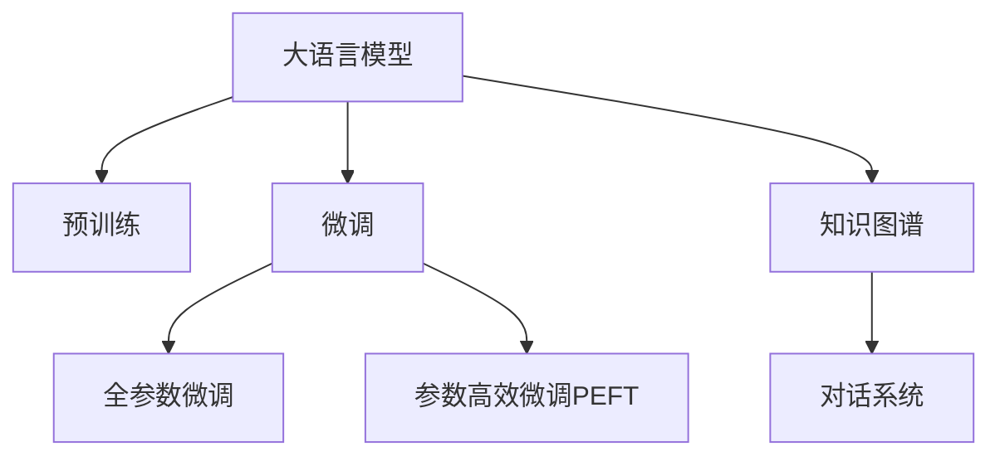

                 

## 1. 背景介绍

### 1.1 问题由来

智能客服系统作为企业客户服务的重要环节，承担着解决用户咨询、提升用户体验的关键任务。传统的客服系统通常依赖人工客服，人力成本高，响应速度慢，且无法24小时服务，用户体验难以保证。近年来，随着人工智能技术的快速发展，基于大语言模型（LLM）的智能客服系统开始逐渐进入人们的视野。

### 1.2 问题核心关键点

智能客服系统需要具备理解用户问题、提供精准答案、处理复杂对话、自动化质检等能力。大语言模型通过在海量文本数据上进行预训练，获得了强大的自然语言处理能力，能够在很大程度上满足智能客服系统的需求。

具体而言，智能客服系统的主要需求包括：
- 自然语言理解（NLU）：系统能够理解用户输入的自然语言问题，提取关键信息。
- 对话管理（DM）：系统能够处理多轮对话，提供连贯、准确的回复。
- 知识库检索（KB）：系统能够从知识库中快速检索出相关信息，辅助生成答案。
- 语音识别与合成：系统能够进行语音输入和输出的转换，提升用户体验。

大语言模型通过微调，可以学习到这些任务所需的语言表示，从而提升系统的性能。然而，大语言模型在智能客服系统中的应用仍面临一些挑战，如对特定领域的适应性、系统稳定性和用户体验等问题。

### 1.3 问题研究意义

智能客服系统的智能化升级，不仅能够大幅降低企业的人力成本，提升响应速度和服务质量，还能使客户获得更加高效、个性化的服务体验。通过大语言模型微调技术，智能客服系统可以具备更高的理解能力和对话管理能力，显著提高客服服务的智能化水平。

此外，智能客服系统还可以辅助进行更复杂、专业化的任务，如法律咨询、医疗问答等，拓展服务范围，提升系统价值。因此，研究大语言模型在智能客服中的应用前景，对于推动智能客服系统的发展，具有重要意义。

## 2. 核心概念与联系

### 2.1 核心概念概述

为更好地理解大语言模型在智能客服系统中的应用，本节将介绍几个密切相关的核心概念：

- 大语言模型（Large Language Model, LLM）：以自回归（如GPT）或自编码（如BERT）模型为代表的大规模预训练语言模型。通过在海量文本数据上进行预训练，学习到通用的语言知识，具备强大的自然语言处理能力。

- 自然语言处理（Natural Language Processing, NLP）：涉及语言识别、理解、生成等技术，旨在使计算机能够像人类一样处理自然语言。

- 对话系统（Dialogue System）：包括多轮对话管理、意图识别、上下文理解、知识库检索等功能，旨在模拟人类对话，提供个性化服务。

- 微调（Fine-Tuning）：通过在下游任务的标注数据上微调大语言模型，使其适应特定任务，提升性能。

- 知识图谱（Knowledge Graph）：将领域内的知识结构化表示，辅助智能客服系统进行信息检索和推理。

这些核心概念之间的逻辑关系可以通过以下Mermaid流程图来展示：



这个流程图展示了大语言模型在智能客服系统中的核心概念及其之间的关系：

1. 大语言模型通过预训练获得基础能力。
2. 微调是对预训练模型进行任务特定的优化，可以在特定的任务上提升性能。
3. 对话系统包括多轮对话管理、意图识别等功能，基于微调后的模型实现。
4. 知识图谱辅助系统进行信息检索和推理。

这些概念共同构成了智能客服系统的工作原理和优化方向。通过理解这些核心概念，我们可以更好地把握大语言模型在智能客服中的应用前景。

## 3. 核心算法原理 & 具体操作步骤
### 3.1 算法原理概述

智能客服系统的主要任务包括自然语言理解（NLU）和对话管理（DM）。自然语言理解任务的目标是理解用户输入的意图和关键信息，而对话管理任务则是在理解用户意图的基础上，生成适当的回复，并进行多轮对话管理。

基于大语言模型的智能客服系统，可以通过微调来适应特定任务的需求。具体而言，可以采用以下步骤：

1. 收集特定领域的标注数据，如客户咨询记录、常见问题解答等。
2. 将预训练的大语言模型作为初始参数，在标注数据上进行微调，学习领域特定的语言表示。
3. 在微调后的模型上进行自然语言理解和对话管理，生成自然流畅的回复。

### 3.2 算法步骤详解

基于大语言模型的智能客服系统，可以采用以下步骤进行微调：

**Step 1: 数据准备**
- 收集特定领域的标注数据，包括客户咨询记录、常见问题解答等。
- 将数据划分为训练集、验证集和测试集。
- 对数据进行预处理，如分词、标准化、标注意图等。

**Step 2: 模型选择与适配**
- 选择预训练的LLM模型，如GPT、BERT等。
- 根据任务需求，设计适合的输出层和损失函数。例如，对于分类任务，通常使用线性分类器，交叉熵损失；对于生成任务，使用语言模型的解码器，负对数似然损失。
- 选择合适的优化算法及其参数，如AdamW、SGD等，设置学习率、批大小、迭代轮数等。
- 设置正则化技术及强度，包括权重衰减、Dropout、Early Stopping等。

**Step 3: 模型训练**
- 使用训练集数据对模型进行迭代训练，通过前向传播计算损失函数，反向传播更新模型参数。
- 周期性在验证集上评估模型性能，根据性能指标决定是否触发Early Stopping。
- 重复上述步骤直到满足预设的迭代轮数或Early Stopping条件。

**Step 4: 模型评估与部署**
- 在测试集上评估微调后模型的性能，对比微调前后的精度提升。
- 使用微调后的模型对新样本进行推理预测，集成到实际的应用系统中。
- 持续收集新的数据，定期重新微调模型，以适应数据分布的变化。

### 3.3 算法优缺点

基于大语言模型的智能客服系统具有以下优点：
1. 快速响应：系统能够实时处理用户咨询，提升响应速度。
2. 准确性高：大语言模型经过微调后，能够理解复杂的自然语言，生成准确的回复。
3. 可扩展性强：系统可以处理多轮对话，提升客户体验。
4. 易维护：系统基于微调模型，便于进行维护和升级。

同时，该方法也存在一定的局限性：
1. 对标注数据的依赖：微调效果很大程度上取决于标注数据的质量和数量，标注数据获取成本较高。
2. 适应性问题：当任务与预训练数据的分布差异较大时，微调的性能提升有限。
3. 可解释性不足：微调模型的决策过程缺乏可解释性，难以对其推理逻辑进行分析和调试。

尽管存在这些局限性，但就目前而言，基于大语言模型的微调方法仍是最主流的智能客服系统范式。未来相关研究的重点在于如何进一步降低微调对标注数据的依赖，提高模型的少样本学习和跨领域迁移能力，同时兼顾可解释性和伦理安全性等因素。

### 3.4 算法应用领域

大语言模型微调技术在智能客服系统中的应用已经得到了广泛的应用，涵盖了各个环节，例如：

- 自然语言理解：通过微调模型，系统能够理解用户输入的自然语言问题，提取关键信息。
- 对话管理：通过微调模型，系统能够处理多轮对话，提供连贯、准确的回复。
- 知识库检索：通过微调模型，系统能够从知识库中快速检索出相关信息，辅助生成答案。
- 语音识别与合成：通过微调模型，系统能够进行语音输入和输出的转换，提升用户体验。

除了上述这些核心应用外，大语言模型微调技术还应用于智能客服系统的知识库构建、用户画像分析、情感分析等多个方面，为智能客服系统的智能化升级提供了有力支持。

## 4. 数学模型和公式 & 详细讲解  
### 4.1 数学模型构建

基于大语言模型的智能客服系统，其数学模型构建主要涉及自然语言理解和对话管理两个部分。以下是详细介绍：

**自然语言理解（NLU）**
- 输入：用户输入的自然语言问题 $x$。
- 输出：系统识别的用户意图 $y$ 和关键信息 $z$。
- 模型：预训练的大语言模型 $M_{\theta}$。

**对话管理（DM）**
- 输入：用户输入的自然语言问题 $x$ 和历史对话记录 $c$。
- 输出：系统生成的回复 $y$。
- 模型：微调后的对话管理模型 $M_{\theta'}$。

### 4.2 公式推导过程

以自然语言理解任务为例，其公式推导过程如下：

假设输入为 $x$，模型输出为 $y$ 和 $z$，则自然语言理解任务的目标是最大化 $p(y,z|x)$。在模型 $M_{\theta}$ 上，通过前向传播计算得到输出 $y$ 和 $z$，利用交叉熵损失函数进行训练。具体公式为：

$$
L = -\frac{1}{N}\sum_{i=1}^N [y_i\log p(y_i|x_i) + z_i\log p(z_i|x_i)]
$$

其中 $y_i$ 和 $z_i$ 为样本的意图和关键信息，$p(y_i|x_i)$ 和 $p(z_i|x_i)$ 为模型的预测概率，$N$ 为样本数量。

对于对话管理任务，可以使用类似的公式进行推导。

### 4.3 案例分析与讲解

以下是一个简单的自然语言理解任务案例，以帮助理解公式的具体应用：

**案例一：意图识别**
- 输入：客户咨询记录 "我需要售后服务支持"
- 输出：意图为 "售后服务"
- 模型：预训练的BERT模型
- 训练过程：通过微调模型，使模型在标注数据上准确识别出客户的意图

假设输入为 $x$，模型输出为 $y$，则意图识别的目标函数为：

$$
L = -\frac{1}{N}\sum_{i=1}^N [y_i\log p(y_i|x_i)]
$$

其中 $y_i$ 为样本的意图标签，$p(y_i|x_i)$ 为模型的预测概率。

通过反向传播和优化算法，模型不断更新参数，最小化损失函数，最终使模型在标注数据上准确识别客户的意图。

## 5. 项目实践：代码实例和详细解释说明
### 5.1 开发环境搭建

在进行智能客服系统的开发之前，需要先搭建好开发环境。以下是使用Python进行PyTorch开发的环境配置流程：

1. 安装Anaconda：从官网下载并安装Anaconda，用于创建独立的Python环境。

2. 创建并激活虚拟环境：
```bash
conda create -n pytorch-env python=3.8 
conda activate pytorch-env
```

3. 安装PyTorch：根据CUDA版本，从官网获取对应的安装命令。例如：
```bash
conda install pytorch torchvision torchaudio cudatoolkit=11.1 -c pytorch -c conda-forge
```

4. 安装Transformers库：
```bash
pip install transformers
```

5. 安装各类工具包：
```bash
pip install numpy pandas scikit-learn matplotlib tqdm jupyter notebook ipython
```

完成上述步骤后，即可在`pytorch-env`环境中开始智能客服系统的开发。

### 5.2 源代码详细实现

这里我们以一个简单的意图识别模型为例，给出使用Transformers库进行自然语言理解任务的PyTorch代码实现。

首先，定义模型和优化器：

```python
from transformers import BertForTokenClassification, AdamW

model = BertForTokenClassification.from_pretrained('bert-base-cased', num_labels=5)
optimizer = AdamW(model.parameters(), lr=2e-5)
```

然后，定义训练和评估函数：

```python
from torch.utils.data import DataLoader
from tqdm import tqdm
from sklearn.metrics import classification_report

device = torch.device('cuda') if torch.cuda.is_available() else torch.device('cpu')
model.to(device)

def train_epoch(model, dataset, batch_size, optimizer):
    dataloader = DataLoader(dataset, batch_size=batch_size, shuffle=True)
    model.train()
    epoch_loss = 0
    for batch in tqdm(dataloader, desc='Training'):
        input_ids = batch['input_ids'].to(device)
        attention_mask = batch['attention_mask'].to(device)
        labels = batch['labels'].to(device)
        model.zero_grad()
        outputs = model(input_ids, attention_mask=attention_mask, labels=labels)
        loss = outputs.loss
        epoch_loss += loss.item()
        loss.backward()
        optimizer.step()
    return epoch_loss / len(dataloader)

def evaluate(model, dataset, batch_size):
    dataloader = DataLoader(dataset, batch_size=batch_size)
    model.eval()
    preds, labels = [], []
    with torch.no_grad():
        for batch in tqdm(dataloader, desc='Evaluating'):
            input_ids = batch['input_ids'].to(device)
            attention_mask = batch['attention_mask'].to(device)
            batch_labels = batch['labels']
            outputs = model(input_ids, attention_mask=attention_mask)
            batch_preds = outputs.logits.argmax(dim=2).to('cpu').tolist()
            batch_labels = batch_labels.to('cpu').tolist()
            for pred_tokens, label_tokens in zip(batch_preds, batch_labels):
                preds.append(pred_tokens[:len(label_tokens)])
                labels.append(label_tokens)
                
    print(classification_report(labels, preds))
```

最后，启动训练流程并在测试集上评估：

```python
epochs = 5
batch_size = 16

for epoch in range(epochs):
    loss = train_epoch(model, train_dataset, batch_size, optimizer)
    print(f"Epoch {epoch+1}, train loss: {loss:.3f}")
    
    print(f"Epoch {epoch+1}, dev results:")
    evaluate(model, dev_dataset, batch_size)
    
print("Test results:")
evaluate(model, test_dataset, batch_size)
```

以上就是使用PyTorch对BERT进行意图识别任务微调的完整代码实现。可以看到，得益于Transformers库的强大封装，我们可以用相对简洁的代码完成BERT模型的加载和微调。

### 5.3 代码解读与分析

让我们再详细解读一下关键代码的实现细节：

**数据集定义**
- `NERDataset`类：定义了数据集类，用于处理标注数据。
- `tag2id`和`id2tag`：定义了标签与数字id之间的映射关系。

**模型定义**
- `BertForTokenClassification`类：从预训练的BERT模型中选择合适的层和输出头，设计意图标签预测的任务。
- `AdamW`优化器：选择AdamW优化器进行模型参数的更新。

**训练函数**
- `train_epoch`函数：对数据集进行迭代训练，计算损失函数并更新模型参数。
- `evaluate`函数：对模型进行评估，计算模型在测试集上的性能指标。

**训练流程**
- `epochs`和`batch_size`：定义训练轮数和批次大小。
- `train_epoch`函数：在训练集上训练模型，输出平均损失。
- `evaluate`函数：在验证集和测试集上评估模型，输出分类指标。

通过上述代码，我们可以看到，基于大语言模型的智能客服系统可以通过微调来实现自然语言理解和对话管理。开发者可以根据具体任务，对微调过程的各个环节进行优化设计，如改进训练目标函数，引入更多的正则化技术，搜索最优的超参数组合等，以进一步提升模型性能。

## 6. 实际应用场景

### 6.1 智能客服系统

智能客服系统作为企业客户服务的重要环节，承担着解决用户咨询、提升用户体验的关键任务。传统的客服系统通常依赖人工客服，人力成本高，响应速度慢，且无法24小时服务，用户体验难以保证。

基于大语言模型的智能客服系统，可以7x24小时不间断服务，快速响应用户咨询，提供高效、个性化的服务。通过微调，系统能够理解复杂的自然语言，生成准确的回复，处理多轮对话，提升客户满意度。

### 6.2 金融客服系统

金融客服系统需要实时监测市场舆论动向，以便及时应对负面信息传播，规避金融风险。传统的人工客服系统无法处理大量客户咨询，响应速度慢，效率低下。

基于大语言模型的金融客服系统，可以在实时抓取的网络文本数据上，进行情感分析、舆情监测等任务。微调后的模型能够自动判断文本属于何种情感，监测市场舆情，一旦发现负面信息激增等异常情况，系统便会自动预警，帮助金融机构快速应对潜在风险。

### 6.3 医疗客服系统

医疗客服系统需要提供专业的医疗咨询服务，解答用户的健康问题。传统的人工客服系统无法快速响应复杂、专业化的医疗咨询，用户满意度难以保证。

基于大语言模型的医疗客服系统，可以通过微调，学习医疗领域的知识表示，辅助医生进行问答。系统能够理解自然语言问题，从知识库中检索相关信息，生成准确的答案，提升医疗服务的智能化水平。

### 6.4 未来应用展望

随着大语言模型和微调方法的不断发展，基于微调范式将在更多领域得到应用，为传统行业带来变革性影响。

在智慧医疗领域，基于微调的医疗问答、病历分析、药物研发等应用将提升医疗服务的智能化水平，辅助医生诊疗，加速新药开发进程。

在智能教育领域，微调技术可应用于作业批改、学情分析、知识推荐等方面，因材施教，促进教育公平，提高教学质量。

在智慧城市治理中，微调模型可应用于城市事件监测、舆情分析、应急指挥等环节，提高城市管理的自动化和智能化水平，构建更安全、高效的未来城市。

此外，在企业生产、社会治理、文娱传媒等众多领域，基于大模型微调的人工智能应用也将不断涌现，为经济社会发展注入新的动力。相信随着预训练语言模型和微调方法的持续演进，大语言模型微调必将在构建人机协同的智能时代中扮演越来越重要的角色。

## 7. 工具和资源推荐
### 7.1 学习资源推荐

为了帮助开发者系统掌握大语言模型在智能客服系统中的应用，这里推荐一些优质的学习资源：

1. 《Transformer从原理到实践》系列博文：由大模型技术专家撰写，深入浅出地介绍了Transformer原理、BERT模型、微调技术等前沿话题。

2. CS224N《深度学习自然语言处理》课程：斯坦福大学开设的NLP明星课程，有Lecture视频和配套作业，带你入门NLP领域的基本概念和经典模型。

3. 《Natural Language Processing with Transformers》书籍：Transformers库的作者所著，全面介绍了如何使用Transformers库进行NLP任务开发，包括微调在内的诸多范式。

4. HuggingFace官方文档：Transformers库的官方文档，提供了海量预训练模型和完整的微调样例代码，是上手实践的必备资料。

5. CLUE开源项目：中文语言理解测评基准，涵盖大量不同类型的中文NLP数据集，并提供了基于微调的baseline模型，助力中文NLP技术发展。

通过对这些资源的学习实践，相信你一定能够快速掌握大语言模型在智能客服系统中的应用方法，并用于解决实际的NLP问题。

### 7.2 开发工具推荐

高效的开发离不开优秀的工具支持。以下是几款用于智能客服系统开发的常用工具：

1. PyTorch：基于Python的开源深度学习框架，灵活动态的计算图，适合快速迭代研究。大部分预训练语言模型都有PyTorch版本的实现。

2. TensorFlow：由Google主导开发的开源深度学习框架，生产部署方便，适合大规模工程应用。同样有丰富的预训练语言模型资源。

3. Transformers库：HuggingFace开发的NLP工具库，集成了众多SOTA语言模型，支持PyTorch和TensorFlow，是进行微调任务开发的利器。

4. Weights & Biases：模型训练的实验跟踪工具，可以记录和可视化模型训练过程中的各项指标，方便对比和调优。与主流深度学习框架无缝集成。

5. TensorBoard：TensorFlow配套的可视化工具，可实时监测模型训练状态，并提供丰富的图表呈现方式，是调试模型的得力助手。

6. Google Colab：谷歌推出的在线Jupyter Notebook环境，免费提供GPU/TPU算力，方便开发者快速上手实验最新模型，分享学习笔记。

合理利用这些工具，可以显著提升智能客服系统的开发效率，加快创新迭代的步伐。

### 7.3 相关论文推荐

大语言模型在智能客服系统中的应用研究源于学界的持续研究。以下是几篇奠基性的相关论文，推荐阅读：

1. Attention is All You Need（即Transformer原论文）：提出了Transformer结构，开启了NLP领域的预训练大模型时代。

2. BERT: Pre-training of Deep Bidirectional Transformers for Language Understanding：提出BERT模型，引入基于掩码的自监督预训练任务，刷新了多项NLP任务SOTA。

3. Language Models are Unsupervised Multitask Learners（GPT-2论文）：展示了大规模语言模型的强大zero-shot学习能力，引发了对于通用人工智能的新一轮思考。

4. Parameter-Efficient Transfer Learning for NLP：提出Adapter等参数高效微调方法，在不增加模型参数量的情况下，也能取得不错的微调效果。

5. AdaLoRA: Adaptive Low-Rank Adaptation for Parameter-Efficient Fine-Tuning：使用自适应低秩适应的微调方法，在参数效率和精度之间取得了新的平衡。

6. Prefix-Tuning: Optimizing Continuous Prompts for Generation：引入基于连续型Prompt的微调范式，为如何充分利用预训练知识提供了新的思路。

这些论文代表了大语言模型在智能客服系统中的应用发展脉络。通过学习这些前沿成果，可以帮助研究者把握学科前进方向，激发更多的创新灵感。

## 8. 总结：未来发展趋势与挑战

### 8.1 总结

本文对基于大语言模型的智能客服系统进行了全面系统的介绍。首先阐述了智能客服系统的需求和挑战，明确了大语言模型微调在提升系统性能方面的独特价值。其次，从原理到实践，详细讲解了微调数学模型和关键步骤，给出了智能客服系统开发的完整代码实例。同时，本文还广泛探讨了微调方法在多个行业领域的应用前景，展示了微调范式的巨大潜力。

通过本文的系统梳理，可以看到，基于大语言模型的微调方法正在成为智能客服系统的重要范式，极大地拓展了预训练语言模型的应用边界，催生了更多的落地场景。受益于大规模语料的预训练，微调模型以更低的时间和标注成本，在小样本条件下也能取得理想的性能，有力推动了智能客服系统的发展。未来，伴随预训练语言模型和微调方法的持续演进，智能客服系统必将在构建人机协同的智能时代中扮演越来越重要的角色。

### 8.2 未来发展趋势

展望未来，大语言模型微调技术在智能客服系统中的应用将呈现以下几个发展趋势：

1. 模型规模持续增大。随着算力成本的下降和数据规模的扩张，预训练语言模型的参数量还将持续增长。超大规模语言模型蕴含的丰富语言知识，有望支撑更加复杂多变的智能客服任务。

2. 微调方法日趋多样。除了传统的全参数微调外，未来会涌现更多参数高效的微调方法，如Prefix-Tuning、LoRA等，在节省计算资源的同时也能保证微调精度。

3. 持续学习成为常态。随着数据分布的不断变化，微调模型也需要持续学习新知识以保持性能。如何在不遗忘原有知识的同时，高效吸收新样本信息，将成为重要的研究课题。

4. 标注样本需求降低。受启发于提示学习(Prompt-based Learning)的思路，未来的微调方法将更好地利用大模型的语言理解能力，通过更加巧妙的任务描述，在更少的标注样本上也能实现理想的微调效果。

5. 少样本学习成为热点。随着数据标注成本的增加，少样本学习成为提升智能客服系统性能的重要手段。通过精心设计的提示模板，可以在少量样本上进行有效微调，提升系统的泛化能力。

6. 跨领域迁移能力增强。大语言模型在多种任务上的预训练使得其具备较强的跨领域迁移能力。未来，微调方法将进一步提升模型的跨领域迁移能力，支持在更多场景中的应用。

以上趋势凸显了大语言模型微调技术在智能客服系统中的应用前景。这些方向的探索发展，必将进一步提升智能客服系统的智能化水平，为人类认知智能的进化带来深远影响。

### 8.3 面临的挑战

尽管大语言模型微调技术已经取得了瞩目成就，但在迈向更加智能化、普适化应用的过程中，它仍面临诸多挑战：

1. 标注成本瓶颈。虽然微调大大降低了标注数据的需求，但对于长尾应用场景，难以获得充足的高质量标注数据，成为制约微调性能的瓶颈。如何进一步降低微调对标注样本的依赖，将是一大难题。

2. 模型鲁棒性不足。当任务与预训练数据的分布差异较大时，微调的性能提升有限。对于测试样本的微小扰动，微调模型的预测也容易发生波动。如何提高微调模型的鲁棒性，避免灾难性遗忘，还需要更多理论和实践的积累。

3. 推理效率有待提高。大规模语言模型虽然精度高，但在实际部署时往往面临推理速度慢、内存占用大等效率问题。如何在保证性能的同时，简化模型结构，提升推理速度，优化资源占用，将是重要的优化方向。

4. 可解释性亟需加强。当前微调模型更像是"黑盒"系统，难以解释其内部工作机制和决策逻辑。对于医疗、金融等高风险应用，算法的可解释性和可审计性尤为重要。如何赋予微调模型更强的可解释性，将是亟待攻克的难题。

5. 安全性有待保障。预训练语言模型难免会学习到有偏见、有害的信息，通过微调传递到下游任务，产生误导性、歧视性的输出，给实际应用带来安全隐患。如何从数据和算法层面消除模型偏见，避免恶意用途，确保输出的安全性，也将是重要的研究课题。

6. 知识整合能力不足。现有的微调模型往往局限于任务内数据，难以灵活吸收和运用更广泛的先验知识。如何让微调过程更好地与外部知识库、规则库等专家知识结合，形成更加全面、准确的信息整合能力，还有很大的想象空间。

正视微调面临的这些挑战，积极应对并寻求突破，将是大语言模型微调技术迈向成熟的必由之路。相信随着学界和产业界的共同努力，这些挑战终将一一被克服，大语言模型微调必将在构建安全、可靠、可解释、可控的智能系统铺平道路。

### 8.4 研究展望

面对大语言模型微调技术在智能客服系统中的应用挑战，未来的研究需要在以下几个方面寻求新的突破：

1. 探索无监督和半监督微调方法。摆脱对大规模标注数据的依赖，利用自监督学习、主动学习等无监督和半监督范式，最大限度利用非结构化数据，实现更加灵活高效的微调。

2. 研究参数高效和计算高效的微调范式。开发更加参数高效的微调方法，在固定大部分预训练参数的同时，只更新极少量的任务相关参数。同时优化微调模型的计算图，减少前向传播和反向传播的资源消耗，实现更加轻量级、实时性的部署。

3. 融合因果和对比学习范式。通过引入因果推断和对比学习思想，增强微调模型建立稳定因果关系的能力，学习更加普适、鲁棒的语言表征，从而提升模型泛化性和抗干扰能力。

4. 引入更多先验知识。将符号化的先验知识，如知识图谱、逻辑规则等，与神经网络模型进行巧妙融合，引导微调过程学习更准确、合理的语言模型。同时加强不同模态数据的整合，实现视觉、语音等多模态信息与文本信息的协同建模。

5. 结合因果分析和博弈论工具。将因果分析方法引入微调模型，识别出模型决策的关键特征，增强输出解释的因果性和逻辑性。借助博弈论工具刻画人机交互过程，主动探索并规避模型的脆弱点，提高系统稳定性。

6. 纳入伦理道德约束。在模型训练目标中引入伦理导向的评估指标，过滤和惩罚有偏见、有害的输出倾向。同时加强人工干预和审核，建立模型行为的监管机制，确保输出符合人类价值观和伦理道德。

这些研究方向的探索，必将引领大语言模型微调技术迈向更高的台阶，为构建安全、可靠、可解释、可控的智能系统铺平道路。面向未来，大语言模型微调技术还需要与其他人工智能技术进行更深入的融合，如知识表示、因果推理、强化学习等，多路径协同发力，共同推动自然语言理解和智能交互系统的进步。只有勇于创新、敢于突破，才能不断拓展语言模型的边界，让智能技术更好地造福人类社会。

## 9. 附录：常见问题与解答

**Q1：大语言模型微调是否适用于所有智能客服任务？**

A: 大语言模型微调在大多数智能客服任务上都能取得不错的效果，特别是对于数据量较小的任务。但对于一些特定领域的任务，如法律、医疗等，仅仅依靠通用语料预训练的模型可能难以很好地适应。此时需要在特定领域语料上进一步预训练，再进行微调，才能获得理想效果。此外，对于一些需要时效性、个性化很强的任务，如对话、推荐等，微调方法也需要针对性的改进优化。

**Q2：微调过程中如何选择合适的学习率？**

A: 微调的学习率一般要比预训练时小1-2个数量级，如果使用过大的学习率，容易破坏预训练权重，导致过拟合。一般建议从1e-5开始调参，逐步减小学习率，直至收敛。也可以使用warmup策略，在开始阶段使用较小的学习率，再逐渐过渡到预设值。需要注意的是，不同的优化器(如AdamW、Adafactor等)以及不同的学习率调度策略，可能需要设置不同的学习率阈值。

**Q3：采用大语言模型微调时会面临哪些资源瓶颈？**

A: 目前主流的预训练大模型动辄以亿计的参数规模，对算力、内存、存储都提出了很高的要求。GPU/TPU等高性能设备是必不可少的，但即便如此，超大批次的训练和推理也可能遇到显存不足的问题。因此需要采用一些资源优化技术，如梯度积累、混合精度训练、模型并行等，来突破硬件瓶颈。同时，模型的存储和读取也可能占用大量时间和空间，需要采用模型压缩、稀疏化存储等方法进行优化。

**Q4：如何缓解微调过程中的过拟合问题？**

A: 过拟合是微调面临的主要挑战，尤其是在标注数据不足的情况下。常见的缓解策略包括：
1. 数据增强：通过回译、近义替换等方式扩充训练集
2. 正则化：使用L2正则、Dropout、Early Stopping等避免过拟合
3. 对抗训练：引入对抗样本，提高模型鲁棒性
4. 参数高效微调：只调整少量参数(如Adapter、Prefix等)，减小过拟合风险
5. 多模型集成：训练多个微调模型，取平均输出，抑制过拟合

这些策略往往需要根据具体任务和数据特点进行灵活组合。只有在数据、模型、训练、推理等各环节进行全面优化，才能最大限度地发挥大语言模型微调的威力。

**Q5：大语言模型微调是否需要大量的标注数据？**

A: 虽然大语言模型微调对标注数据的需求较少，但在一些特定领域或小样本任务上，仍然需要收集大量的标注数据。标注数据的质量和数量直接影响微调效果。对于长尾领域或冷门任务，获取高质量标注数据可能面临较大挑战，需要结合无监督学习、主动学习等技术，以降低对标注数据的依赖。

**Q6：大语言模型微调是否需要调整模型参数？**

A: 是的，大语言模型微调需要调整模型参数以适应特定任务的需求。通过微调，模型能够在少量标注数据上进行任务特定化的训练，提升性能。调整的参数量取决于任务的复杂度和模型的规模，通常全参数微调需要更新所有参数，参数高效微调只更新部分参数。

**Q7：大语言模型微调是否需要重新预训练？**

A: 一般情况下，大语言模型微调不需要重新预训练。模型通过大规模无标签数据的预训练，已经学到了丰富的语言知识，能够快速适应下游任务。但在某些特殊情况下，如任务与预训练数据的分布差异较大，可以考虑在特定领域上进一步预训练，再结合微调方法，以提升性能。

**Q8：大语言模型微调是否需要调整输出层？**

A: 是的，大语言模型微调需要设计合适的输出层以适应特定任务的输出形式。对于分类任务，通常使用线性分类器，交叉熵损失；对于生成任务，使用语言模型的解码器，负对数似然损失。输出层的调整是微调过程中不可忽视的一部分，直接影响模型在特定任务上的性能。

通过本文的系统梳理，可以看到，基于大语言模型的微调方法正在成为智能客服系统的重要范式，极大地拓展了预训练语言模型的应用边界，催生了更多的落地场景。受益于大规模语料的预训练，微调模型以更低的时间和标注成本，在小样本条件下也能取得理想的性能，有力推动了智能客服系统的发展。未来，伴随预训练语言模型和微调方法的持续演进，智能客服系统必将在构建人机协同的智能时代中扮演越来越重要的角色。

