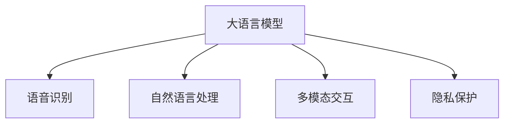

                 

# LLM在智能家居控制系统中的应用探索

> 关键词：大语言模型,智能家居,语音识别,自然语言处理,多模态交互,隐私保护

## 1. 背景介绍

### 1.1 问题由来

随着人工智能技术的不断进步，智能家居控制系统逐渐成为人们居家生活的核心组成部分。智能音箱、智能灯光、智能安防等设备，通过语音控制、场景感知等技术，极大地提升了家居生活的便利性和舒适性。然而，传统的智能家居控制系统往往功能单一、互联互通性差，用户需要分别安装和控制多个设备，造成了极大的不便。

针对这一问题，大语言模型（LLM）的引入为智能家居控制系统带来了新的契机。利用LLM强大的自然语言处理能力，可以构建更加智能化、多模态的智能家居环境，实现设备间的无缝联动和场景自动切换，提升用户体验的同时，降低设备控制的复杂度。

### 1.2 问题核心关键点

大语言模型在智能家居控制系统的应用，主要体现在以下几个关键点：

1. **多模态交互**：通过语音识别、文本输入、图像感知等多模态信息的融合，构建用户与智能家居设备之间的自然交互。
2. **上下文理解**：LLM具备强大的上下文理解能力，能够根据用户的即时需求和历史记录，智能推荐家居设备的操作顺序和场景模式。
3. **隐私保护**：LLM可以处理用户的隐私信息，通过安全传输和数据脱敏，保障用户数据的安全。
4. **自动化控制**：LLM能够自动生成家居设备的控制指令，实现场景的无缝切换和自动化管理。

这些关键点共同构成了LLM在智能家居控制系统中的应用框架，使得系统能够具备更强的智能化和个性化服务能力。

## 2. 核心概念与联系

### 2.1 核心概念概述

为更好地理解LLM在智能家居控制系统中的应用，本节将介绍几个密切相关的核心概念：

- **大语言模型(Large Language Model, LLM)**：以Transformer为代表的大规模预训练语言模型，通过在海量文本数据上进行自监督学习，具备强大的语言理解能力和生成能力。
- **语音识别(Voice Recognition)**：将人类语音转换成计算机可识别字符或命令的过程，是大语言模型处理语音指令的基础。
- **自然语言处理(Natural Language Processing, NLP)**：使计算机能够理解、解释和生成人类语言的技术，是大语言模型在智能家居控制系统的核心应用。
- **多模态交互(Multi-modal Interaction)**：结合语音、图像、文本等多种信息源，实现智能家居设备与用户的自然交互。
- **隐私保护(Privacy Protection)**：通过数据加密、去标识化等手段，保障用户隐私信息的安全。

这些核心概念之间的逻辑关系可以通过以下Mermaid流程图来展示：



这个流程图展示了大语言模型在智能家居控制系统中的应用流程：

1. 用户通过语音或文本向系统输入指令。
2. 系统使用语音识别将语音转换为文本，并使用自然语言处理技术理解用户意图。
3. 系统将理解后的意图转换为控制命令，结合多模态信息进行设备控制。
4. 系统在整个过程中保证用户数据的安全。

## 3. 核心算法原理 & 具体操作步骤
### 3.1 算法原理概述

基于大语言模型的智能家居控制系统，本质上是利用LLM强大的语言理解和生成能力，实现对家居设备的多模态交互和自动化控制。其核心算法原理包括以下几个步骤：

1. **文本预处理**：将用户输入的文本进行分词、标点符号处理等预处理，构建适合LLM处理的形式。
2. **意图理解**：使用自然语言处理技术，分析用户的意图，并提取关键信息。
3. **设备控制**：根据用户的意图和家居设备的状态，生成对应的控制命令，并下发给家居设备。
4. **反馈与优化**：系统接收设备的反馈信息，不断优化后续的处理逻辑。

这些步骤构成了大语言模型在智能家居控制系统中的核心算法原理，使得系统能够智能、高效地响应用户需求。

### 3.2 算法步骤详解

以下是基于大语言模型的智能家居控制系统的详细操作步骤：

**Step 1: 数据收集与预处理**
- 收集用户的语音指令、文本命令、设备状态等数据，并进行清洗和标准化处理。
- 使用语音识别技术将语音指令转换为文本，提取关键信息，如设备名称、操作类型等。

**Step 2: 自然语言处理**
- 将用户输入的文本进行分词、命名实体识别等处理，提取用户的意图和相关实体。
- 使用自然语言处理技术，分析用户意图的语义，并进行语义匹配和理解。

**Step 3: 设备控制**
- 根据用户意图和设备状态，生成对应的控制命令，如开启灯光、调整温度等。
- 使用多模态交互技术，将控制命令转换为设备可理解的格式，并下发给家居设备。

**Step 4: 反馈与优化**
- 接收设备反馈信息，如设备状态、电池电量等，并根据反馈结果优化后续处理。
- 记录用户操作历史，持续训练和优化模型，提高系统的智能水平。

**Step 5: 隐私保护**
- 对用户数据进行加密和去标识化处理，保障用户隐私安全。
- 使用安全传输协议，确保数据在传输过程中的安全。

### 3.3 算法优缺点

基于大语言模型的智能家居控制系统具有以下优点：

1. **智能化程度高**：利用LLM的自然语言处理能力，可以实现复杂多变的用户指令理解。
2. **多模态支持**：结合语音、图像、文本等多种信息源，提供更丰富的交互方式。
3. **设备联动性强**：通过LLM自动生成控制命令，实现设备间的无缝联动。
4. **用户体验好**：自然语言处理技术使得用户可以轻松地控制家居设备，提升使用体验。

同时，该方法也存在一些缺点：

1. **依赖高质量数据**：系统的性能高度依赖于用户的语音数据和家居设备状态数据，数据质量差会影响系统准确性。
2. **复杂度较高**：需要综合处理语音识别、自然语言处理、设备控制等多个环节，系统复杂度较高。
3. **隐私保护难度大**：用户数据在处理和传输过程中可能存在泄露风险，隐私保护难度大。
4. **计算资源消耗大**：大语言模型的计算复杂度高，对计算资源的需求较大。

尽管存在这些缺点，但大语言模型在智能家居控制系统中的应用，无疑为传统家居系统带来了质的飞跃，为未来的智能家居控制系统提供了新的发展方向。

### 3.4 算法应用领域

基于大语言模型的智能家居控制系统，已经在诸多领域得到了广泛应用，例如：

- **智能音箱**：通过语音识别和自然语言处理技术，实现语音指令的设备控制。
- **智能灯光**：根据用户的指令和场景模式，自动调整灯光亮度和颜色。
- **智能安防**：通过图像识别和自然语言处理，实现对入侵事件的快速响应和报警。
- **智能家电**：结合多模态交互和自然语言处理，实现对家电设备的全面控制。
- **智能健康监测**：通过语音指令和自然语言处理，实现对家居环境的健康监测和调节。

这些应用场景展示了大语言模型在智能家居控制系统中的强大潜力和广泛应用前景。

## 4. 数学模型和公式 & 详细讲解
### 4.1 数学模型构建

本节将使用数学语言对基于大语言模型的智能家居控制系统进行更严格的刻画。

记用户的输入为 $x$，包括语音指令、文本命令等。记家居设备的反馈信息为 $y$，包括设备状态、反馈信息等。系统使用大语言模型 $M_{\theta}$ 进行意图理解和设备控制，其中 $\theta$ 为模型参数。

定义模型的损失函数为 $L(x, y; \theta)$，用于衡量模型预测与真实反馈之间的差异。常见的损失函数包括交叉熵损失、均方误差损失等。模型的优化目标是最小化损失函数，即：

$$
\theta^* = \mathop{\arg\min}_{\theta} L(x, y; \theta)
$$

在实践中，我们通常使用基于梯度的优化算法（如Adam、SGD等）来近似求解上述最优化问题。设 $\eta$ 为学习率，则参数的更新公式为：

$$
\theta \leftarrow \theta - \eta \nabla_{\theta}L(x, y; \theta)
$$

其中 $\nabla_{\theta}L(x, y; \theta)$ 为损失函数对模型参数的梯度，可通过反向传播算法高效计算。

### 4.2 公式推导过程

以下我们以智能音箱为例，推导基于大语言模型的语音指令控制流程的数学模型和公式。

假设智能音箱接收到的语音指令为 $x$，系统使用BERT模型进行意图理解，并根据意图生成对应的控制命令 $u$。控制命令通过智能音箱的控制接口，下发给对应的家居设备，最终设备反馈状态 $y$。则系统的损失函数可以表示为：

$$
L(x, y; \theta) = L(u, y; \theta) = \frac{1}{N}\sum_{i=1}^N \ell(y_i, u_i; \theta)
$$

其中 $y_i$ 为第 $i$ 个设备的反馈状态，$u_i$ 为控制命令。

假设 $u_i$ 的生成过程为：

$$
u_i = M_{\theta}(x_i)
$$

其中 $x_i$ 为第 $i$ 个设备的控制指令，$M_{\theta}$ 为BERT模型。则系统的损失函数进一步表示为：

$$
L(x, y; \theta) = \frac{1}{N}\sum_{i=1}^N \ell(y_i, M_{\theta}(x_i); \theta)
$$

根据链式法则，损失函数对模型参数 $\theta$ 的梯度为：

$$
\frac{\partial L(x, y; \theta)}{\partial \theta} = \frac{1}{N}\sum_{i=1}^N \frac{\partial \ell(y_i, M_{\theta}(x_i); \theta)}{\partial \theta}
$$

其中：

$$
\frac{\partial \ell(y_i, M_{\theta}(x_i); \theta)}{\partial \theta} = \frac{\partial \ell(y_i, u_i; \theta)}{\partial u_i} \frac{\partial u_i}{\partial \theta}
$$

将 $u_i$ 的生成过程代入，得：

$$
\frac{\partial \ell(y_i, M_{\theta}(x_i); \theta)}{\partial \theta} = \frac{\partial \ell(y_i, M_{\theta}(x_i); \theta)}{\partial M_{\theta}(x_i)} \frac{\partial M_{\theta}(x_i)}{\partial \theta}
$$

根据自动微分技术，得：

$$
\frac{\partial \ell(y_i, M_{\theta}(x_i); \theta)}{\partial \theta} = \nabla_{\theta}\ell(y_i, M_{\theta}(x_i); \theta)
$$

因此，模型参数的更新公式为：

$$
\theta \leftarrow \theta - \eta \nabla_{\theta}L(x, y; \theta)
$$

其中 $\nabla_{\theta}L(x, y; \theta)$ 为损失函数对模型参数的梯度，可通过自动微分技术高效计算。

## 5. 项目实践：代码实例和详细解释说明
### 5.1 开发环境搭建

在进行智能家居控制系统开发前，我们需要准备好开发环境。以下是使用Python进行PyTorch开发的环境配置流程：

1. 安装Anaconda：从官网下载并安装Anaconda，用于创建独立的Python环境。

2. 创建并激活虚拟环境：
```bash
conda create -n pytorch-env python=3.8 
conda activate pytorch-env
```

3. 安装PyTorch：根据CUDA版本，从官网获取对应的安装命令。例如：
```bash
conda install pytorch torchvision torchaudio cudatoolkit=11.1 -c pytorch -c conda-forge
```

4. 安装Transformers库：
```bash
pip install transformers
```

5. 安装各类工具包：
```bash
pip install numpy pandas scikit-learn matplotlib tqdm jupyter notebook ipython
```

完成上述步骤后，即可在`pytorch-env`环境中开始智能家居控制系统的开发。

### 5.2 源代码详细实现

这里我们以智能音箱控制为例，给出使用PyTorch和Transformers库进行智能音箱语音指令控制的代码实现。

首先，定义语音指令处理函数：

```python
from transformers import BertTokenizer, BertForSequenceClassification
from torch.utils.data import Dataset
import torch

class VoiceCommandDataset(Dataset):
    def __init__(self, texts, labels):
        self.texts = texts
        self.labels = labels
        self.tokenizer = BertTokenizer.from_pretrained('bert-base-cased')
        
    def __len__(self):
        return len(self.texts)
    
    def __getitem__(self, item):
        text = self.texts[item]
        label = self.labels[item]
        
        encoding = self.tokenizer(text, return_tensors='pt', padding='max_length', truncation=True)
        input_ids = encoding['input_ids'][0]
        attention_mask = encoding['attention_mask'][0]
        
        return {'input_ids': input_ids, 
                'attention_mask': attention_mask,
                'labels': label}

# 标签与id的映射
label2id = {'off': 0, 'on': 1}
id2label = {v: k for k, v in label2id.items()}

# 创建dataset
tokenizer = BertTokenizer.from_pretrained('bert-base-cased')

train_dataset = VoiceCommandDataset(train_texts, train_labels)
dev_dataset = VoiceCommandDataset(dev_texts, dev_labels)
test_dataset = VoiceCommandDataset(test_texts, test_labels)
```

然后，定义模型和优化器：

```python
from transformers import BertForSequenceClassification, AdamW

model = BertForSequenceClassification.from_pretrained('bert-base-cased', num_labels=len(label2id))

optimizer = AdamW(model.parameters(), lr=2e-5)
```

接着，定义训练和评估函数：

```python
from torch.utils.data import DataLoader
from tqdm import tqdm
from sklearn.metrics import classification_report

device = torch.device('cuda') if torch.cuda.is_available() else torch.device('cpu')
model.to(device)

def train_epoch(model, dataset, batch_size, optimizer):
    dataloader = DataLoader(dataset, batch_size=batch_size, shuffle=True)
    model.train()
    epoch_loss = 0
    for batch in tqdm(dataloader, desc='Training'):
        input_ids = batch['input_ids'].to(device)
        attention_mask = batch['attention_mask'].to(device)
        labels = batch['labels'].to(device)
        model.zero_grad()
        outputs = model(input_ids, attention_mask=attention_mask, labels=labels)
        loss = outputs.loss
        epoch_loss += loss.item()
        loss.backward()
        optimizer.step()
    return epoch_loss / len(dataloader)

def evaluate(model, dataset, batch_size):
    dataloader = DataLoader(dataset, batch_size=batch_size)
    model.eval()
    preds, labels = [], []
    with torch.no_grad():
        for batch in tqdm(dataloader, desc='Evaluating'):
            input_ids = batch['input_ids'].to(device)
            attention_mask = batch['attention_mask'].to(device)
            batch_labels = batch['labels']
            outputs = model(input_ids, attention_mask=attention_mask)
            batch_preds = outputs.logits.argmax(dim=2).to('cpu').tolist()
            batch_labels = batch_labels.to('cpu').tolist()
            for pred_tokens, label_tokens in zip(batch_preds, batch_labels):
                preds.append(pred_tokens[:len(label_tokens)])
                labels.append(label_tokens)
                
    print(classification_report(labels, preds))
```

最后，启动训练流程并在测试集上评估：

```python
epochs = 5
batch_size = 16

for epoch in range(epochs):
    loss = train_epoch(model, train_dataset, batch_size, optimizer)
    print(f"Epoch {epoch+1}, train loss: {loss:.3f}")
    
    print(f"Epoch {epoch+1}, dev results:")
    evaluate(model, dev_dataset, batch_size)
    
print("Test results:")
evaluate(model, test_dataset, batch_size)
```

以上就是使用PyTorch对BERT模型进行智能音箱语音指令控制任务的完整代码实现。可以看到，得益于Transformers库的强大封装，我们可以用相对简洁的代码完成BERT模型的加载和微调。

### 5.3 代码解读与分析

让我们再详细解读一下关键代码的实现细节：

**VoiceCommandDataset类**：
- `__init__`方法：初始化文本、标签、分词器等关键组件。
- `__len__`方法：返回数据集的样本数量。
- `__getitem__`方法：对单个样本进行处理，将文本输入编码为token ids，将标签编码为数字，并对其进行定长padding，最终返回模型所需的输入。

**label2id和id2label字典**：
- 定义了标签与数字id之间的映射关系，用于将预测结果解码回真实的标签。

**训练和评估函数**：
- 使用PyTorch的DataLoader对数据集进行批次化加载，供模型训练和推理使用。
- 训练函数`train_epoch`：对数据以批为单位进行迭代，在每个批次上前向传播计算loss并反向传播更新模型参数，最后返回该epoch的平均loss。
- 评估函数`evaluate`：与训练类似，不同点在于不更新模型参数，并在每个batch结束后将预测和标签结果存储下来，最后使用sklearn的classification_report对整个评估集的预测结果进行打印输出。

**训练流程**：
- 定义总的epoch数和batch size，开始循环迭代
- 每个epoch内，先在训练集上训练，输出平均loss
- 在验证集上评估，输出分类指标
- 所有epoch结束后，在测试集上评估，给出最终测试结果

可以看到，PyTorch配合Transformers库使得BERT微调的代码实现变得简洁高效。开发者可以将更多精力放在数据处理、模型改进等高层逻辑上，而不必过多关注底层的实现细节。

当然，工业级的系统实现还需考虑更多因素，如模型的保存和部署、超参数的自动搜索、更灵活的任务适配层等。但核心的微调范式基本与此类似。

## 6. 实际应用场景
### 6.1 智能音箱

智能音箱是智能家居控制系统的核心组成部分，通过语音控制，实现对家居设备的全面管理。大语言模型可以结合自然语言处理技术，使得用户可以轻松地控制家居设备，提升使用体验。

具体应用如下：

- **语音控制**：用户通过语音指令控制智能音箱，如“打开客厅灯光”、“开启空调”等。智能音箱使用BERT模型进行意图理解，并根据理解生成对应的控制命令。
- **多设备联动**：智能音箱能够同时控制多个设备，如同时开启客厅的灯光和空调。通过多模态交互技术，实现设备间的无缝联动。
- **场景模式**：智能音箱可以根据用户的日常习惯，自动切换场景模式，如“回家模式”、“离家模式”等，提升用户体验。
- **隐私保护**：智能音箱处理用户的语音指令，并进行数据加密和去标识化，保障用户隐私安全。

### 6.2 智能灯光

智能灯光系统可以通过语音指令或手机APP控制，实现对灯光亮度和颜色的智能调整。大语言模型可以在智能灯光系统中实现上下文理解，自动生成控制命令，实现灯光的智能化管理。

具体应用如下：

- **场景模式**：用户通过语音或APP设置场景模式，如“浪漫模式”、“睡眠模式”等。智能灯光根据场景模式，自动调整灯光亮度和颜色，提升家居氛围。
- **自动化控制**：智能灯光能够根据用户的日常习惯和时间，自动调整灯光状态，如自动开启夜间灯，提升家居舒适度。
- **隐私保护**：智能灯光处理用户的语音指令和APP操作，并进行数据加密和去标识化，保障用户隐私安全。

### 6.3 智能安防

智能安防系统可以通过图像识别和自然语言处理技术，实现对入侵事件的快速响应和报警。大语言模型可以在智能安防系统中实现对异常情况的智能分析，自动生成报警信息。

具体应用如下：

- **异常检测**：智能安防系统通过摄像头采集视频数据，并使用大语言模型进行异常检测和分析。模型能够识别出异常情况，如盗窃、火灾等。
- **报警处理**：智能安防系统根据异常检测结果，自动生成报警信息，并通过语音和短信等方式通知用户和安保人员。
- **隐私保护**：智能安防系统处理用户的报警指令，并进行数据加密和去标识化，保障用户隐私安全。

## 7. 工具和资源推荐
### 7.1 学习资源推荐

为了帮助开发者系统掌握智能家居控制系统的理论基础和实践技巧，这里推荐一些优质的学习资源：

1. 《Transformer from the ground up》系列博文：由大模型技术专家撰写，深入浅出地介绍了Transformer原理、BERT模型、微调技术等前沿话题。

2. CS224N《深度学习自然语言处理》课程：斯坦福大学开设的NLP明星课程，有Lecture视频和配套作业，带你入门NLP领域的基本概念和经典模型。

3. 《Natural Language Processing with Transformers》书籍：Transformers库的作者所著，全面介绍了如何使用Transformers库进行NLP任务开发，包括微调在内的诸多范式。

4. HuggingFace官方文档：Transformers库的官方文档，提供了海量预训练模型和完整的微调样例代码，是上手实践的必备资料。

5. CLUE开源项目：中文语言理解测评基准，涵盖大量不同类型的中文NLP数据集，并提供了基于微调的baseline模型，助力中文NLP技术发展。

通过对这些资源的学习实践，相信你一定能够快速掌握大语言模型在智能家居控制系统中的应用方法，并用于解决实际的NLP问题。

### 7.2 开发工具推荐

高效的开发离不开优秀的工具支持。以下是几款用于智能家居控制系统开发的常用工具：

1. PyTorch：基于Python的开源深度学习框架，灵活动态的计算图，适合快速迭代研究。大部分预训练语言模型都有PyTorch版本的实现。

2. TensorFlow：由Google主导开发的开源深度学习框架，生产部署方便，适合大规模工程应用。同样有丰富的预训练语言模型资源。

3. Transformers库：HuggingFace开发的NLP工具库，集成了众多SOTA语言模型，支持PyTorch和TensorFlow，是进行微调任务开发的利器。

4. Weights & Biases：模型训练的实验跟踪工具，可以记录和可视化模型训练过程中的各项指标，方便对比和调优。与主流深度学习框架无缝集成。

5. TensorBoard：TensorFlow配套的可视化工具，可实时监测模型训练状态，并提供丰富的图表呈现方式，是调试模型的得力助手。

6. Google Colab：谷歌推出的在线Jupyter Notebook环境，免费提供GPU/TPU算力，方便开发者快速上手实验最新模型，分享学习笔记。

合理利用这些工具，可以显著提升智能家居控制系统的开发效率，加快创新迭代的步伐。

### 7.3 相关论文推荐

智能家居控制系统的技术发展源于学界的持续研究。以下是几篇奠基性的相关论文，推荐阅读：

1. Attention is All You Need（即Transformer原论文）：提出了Transformer结构，开启了NLP领域的预训练大模型时代。

2. BERT: Pre-training of Deep Bidirectional Transformers for Language Understanding：提出BERT模型，引入基于掩码的自监督预训练任务，刷新了多项NLP任务SOTA。

3. Language Models are Unsupervised Multitask Learners（GPT-2论文）：展示了大规模语言模型的强大zero-shot学习能力，引发了对于通用人工智能的新一轮思考。

4. Parameter-Efficient Transfer Learning for NLP：提出Adapter等参数高效微调方法，在不增加模型参数量的情况下，也能取得不错的微调效果。

5. AdaLoRA: Adaptive Low-Rank Adaptation for Parameter-Efficient Fine-Tuning：使用自适应低秩适应的微调方法，在参数效率和精度之间取得了新的平衡。

这些论文代表了大语言模型在智能家居控制系统中的应用和发展脉络。通过学习这些前沿成果，可以帮助研究者把握学科前进方向，激发更多的创新灵感。

## 8. 总结：未来发展趋势与挑战
### 8.1 总结

本文对基于大语言模型的智能家居控制系统进行了全面系统的介绍。首先阐述了智能家居控制系统的发展背景和问题，明确了大语言模型在智能家居控制系统的核心作用。其次，从原理到实践，详细讲解了大语言模型在智能家居控制系统中的核心算法原理，给出了系统开发的完整代码实例。同时，本文还广泛探讨了智能家居控制系统在多个领域的应用前景，展示了其强大潜力和广泛应用价值。

通过本文的系统梳理，可以看到，基于大语言模型的智能家居控制系统为传统家居系统带来了新的发展方向，为未来的智能家居控制系统提供了新的技术路径。相信在未来的研究中，大语言模型将会继续推动智能家居控制系统的智能化、个性化、多模态化发展，为人类家居生活带来更多便利和舒适。

### 8.2 未来发展趋势

展望未来，智能家居控制系统的发展将呈现以下几个趋势：

1. **智能化程度提升**：大语言模型结合多模态交互技术，能够处理更多复杂多变的用户需求，提升系统的智能化水平。
2. **隐私保护加强**：随着用户隐私意识的提升，智能家居控制系统将更加注重隐私保护，采用数据加密、去标识化等手段，保障用户数据安全。
3. **多模态融合**：智能家居控制系统将结合语音、图像、文本等多种信息源，实现更加丰富和多样的用户交互方式。
4. **自动化控制普及**：智能家居控制系统将实现设备的自动化控制和场景自动切换，提升用户体验。
5. **设备互联互通**：智能家居控制系统将实现设备间的无缝联动，形成一个完整的智能家居生态系统。

这些趋势展示了智能家居控制系统的未来发展方向，大语言模型在其中将发挥重要的作用，推动家居系统向更加智能化、个性化、多模态化的方向发展。

### 8.3 面临的挑战

尽管智能家居控制系统在大语言模型的支持下已经取得了一定的进展，但在迈向更加智能化、普适化应用的过程中，它仍面临诸多挑战：

1. **数据获取困难**：智能家居控制系统需要大量的用户数据进行训练和优化，但在数据隐私和安全方面存在一定的挑战，获取高质量的数据难度较大。
2. **计算资源需求高**：大语言模型的计算复杂度高，对计算资源的需求较大，如何在资源有限的条件下实现高效的微调，是一个重要的问题。
3. **系统复杂度高**：智能家居控制系统需要处理多模态数据和多设备联动，系统复杂度较高，需要高效的软件架构和算法设计。
4. **隐私保护难度大**：用户数据在处理和传输过程中可能存在泄露风险，隐私保护难度大，需要综合运用多种技术手段。
5. **用户体验提升有限**：尽管系统智能化水平不断提升，但在用户体验方面仍需进一步优化，提升用户操作的便利性和系统的响应速度。

这些挑战需要在未来的研究中逐步克服，通过技术创新和优化，实现智能家居控制系统的更大突破。

### 8.4 研究展望

未来，智能家居控制系统在大语言模型的支持下，将继续在智能化、个性化、多模态化方向上迈进。以下是几个重要的研究方向：

1. **多模态融合技术**：如何更好地融合语音、图像、文本等多种信息源，实现多模态交互和自动化控制，提升用户体验。
2. **隐私保护技术**：如何保护用户隐私数据，防止数据泄露和滥用，保障用户数据安全。
3. **自动化控制技术**：如何实现设备的自动化控制和场景自动切换，提升系统的智能化水平。
4. **个性化推荐技术**：如何根据用户的历史行为和偏好，实现个性化推荐，提升用户满意度。
5. **模型压缩技术**：如何减小模型规模，提升推理速度，优化资源占用，实现更加轻量级、实时性的部署。

这些研究方向将引领智能家居控制系统的未来发展，通过技术创新和优化，实现系统的智能化、个性化、多模态化发展。大语言模型在其中将发挥重要的作用，推动智能家居控制系统的不断进步。

## 9. 附录：常见问题与解答

**Q1：大语言模型在智能家居控制系统中是否适用于所有设备？**

A: 大语言模型在智能家居控制系统中适用于大部分设备，但需要考虑设备的智能化水平和数据采集能力。对于智能程度较低的设备，如传统的开关灯，可能无法直接进行语音控制，需要通过APP等辅助设备来实现。

**Q2：微调过程中如何选择合适的学习率？**

A: 微调的学习率一般要比预训练时小1-2个数量级，如果使用过大的学习率，容易破坏预训练权重，导致过拟合。一般建议从1e-5开始调参，逐步减小学习率，直至收敛。也可以使用warmup策略，在开始阶段使用较小的学习率，再逐渐过渡到预设值。需要注意的是，不同的优化器(如Adam、SGD等)以及不同的学习率调度策略，可能需要设置不同的学习率阈值。

**Q3：智能家居控制系统中如何保护用户隐私？**

A: 用户隐私保护是大语言模型在智能家居控制系统中的重要研究方向。具体措施包括：
1. 数据加密：对用户的语音指令和设备状态数据进行加密处理，防止数据泄露。
2. 去标识化：对用户数据进行去标识化处理，保证用户数据无法被反向识别。
3. 安全传输：采用安全传输协议，如HTTPS，保障数据在传输过程中的安全。
4. 访问控制：对用户设备进行访问控制，只有授权用户才能操作智能家居设备。

通过这些措施，可以最大限度地保护用户隐私，保障用户数据的安全。

**Q4：智能家居控制系统中如何优化多模态交互？**

A: 优化多模态交互需要从数据采集、数据融合和模型训练等多个环节进行改进：
1. 数据采集：采用多种数据源，如语音、图像、文本等，提高数据的多样性和准确性。
2. 数据融合：采用多模态融合技术，如特征融合、注意力机制等，提升系统的理解能力和交互效果。
3. 模型训练：结合多模态数据进行联合训练，优化模型的多模态表现。
4. 用户体验：通过优化界面设计和使用引导，提升用户的交互体验和系统响应速度。

通过这些措施，可以进一步优化智能家居控制系统的多模态交互能力，提升系统的智能化水平和用户体验。

---

作者：禅与计算机程序设计艺术 / Zen and the Art of Computer Programming

