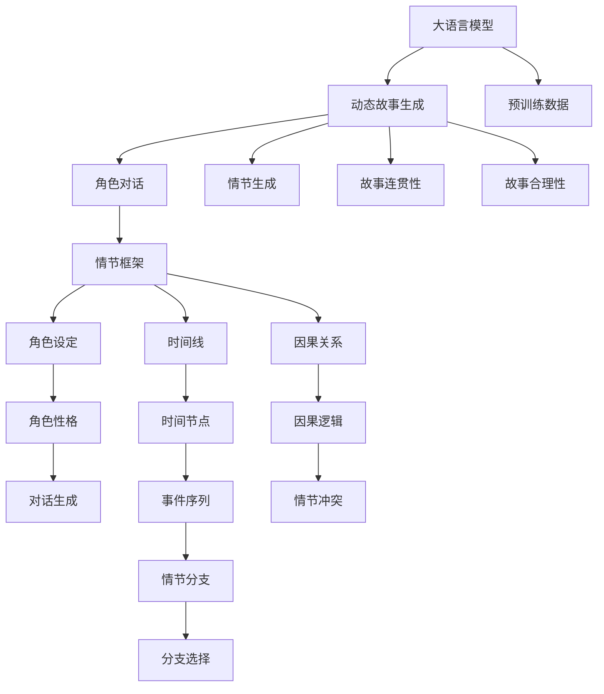

                 

## 1. 背景介绍

### 1.1 问题由来
视频游戏叙事（Gameplay Narrative）是游戏设计中至关重要的一环。随着技术的发展，游戏叙事已经从传统的线性故事模式，逐步向更加复杂、动态的交互叙事转变。传统的线性叙事依赖脚本编写和任务设计，难以处理玩家选择的非线性剧情分支，且生成复杂剧情时开发成本和难度巨大。因此，研究人员开始探索使用人工智能（AI）技术，自动生成动态、可交互的游戏叙事，以期降低叙事开发的成本和时间。

大语言模型（Large Language Models, LLM）凭借其强大的语言理解和生成能力，为自动生成动态故事提供了可能。具体而言，LLM可以在游戏剧情构建、角色对话、情节生成等方面，自动生成满足玩家选择的游戏世界。这不仅能够极大降低叙事开发的难度和成本，还能够提供更加丰富和可交互的叙事体验。

### 1.2 问题核心关键点
实现动态故事生成涉及的核心问题包括：

- 如何利用大语言模型高效生成符合玩家选择的游戏剧情？
- 如何构建可交互的故事框架，使得玩家选择能够影响故事走向？
- 如何设计合理的叙事算法，以实现动态故事的有效生成和持续更新？
- 如何确保生成的故事具备连贯性、合理性，符合玩家期待和游戏世界观？

本文将重点探讨这些问题，并给出动态故事生成的具体实现方法。

## 2. 核心概念与联系

### 2.1 核心概念概述

为更好地理解动态故事生成的原理，我们先介绍几个核心概念：

- **大语言模型（LLM）**：以自回归模型（如GPT）或自编码模型（如BERT）为代表的大规模预训练语言模型。通过在大规模无标签文本语料上进行预训练，学习通用的语言知识。

- **动态故事生成（Dynamic Story Generation）**：在玩家交互过程中，自动生成符合玩家选择的游戏剧情，以形成动态、可交互的故事模式。

- **角色对话（Dialogue）**：在故事生成中，角色之间的交互对话需要自然流畅，能够动态响应玩家的选择和行为。

- **情节生成（Plot Generation）**：根据玩家的选择和行为，动态生成故事中的情节和事件。

- **情节框架（Plot Framework）**：用于指导故事生成的规则和逻辑，如时间线、因果关系、人物关系等。

这些核心概念之间的逻辑关系可以通过以下Mermaid流程图来展示：



这个流程图展示了大语言模型在动态故事生成中的作用：

1. 大语言模型从预训练数据中学习语言知识。
2. 动态故事生成结合角色对话和情节生成，基于情节框架生成连贯合理的故事。
3. 角色对话和情节生成需要考虑故事连贯性和合理性，确保生成的故事符合玩家期望和游戏世界观。

## 3. 核心算法原理 & 具体操作步骤

### 3.1 算法原理概述

动态故事生成的核心算法是**基于大语言模型的生成模型**。该模型以大语言模型为基础，通过特定的情节框架指导生成符合玩家选择的剧情分支。算法的核心思想是将动态故事生成问题转化为序列生成问题，利用大语言模型的语言生成能力，自动生成故事。

具体而言，动态故事生成可以分为以下步骤：

1. 定义情节框架：构建游戏叙事的规则和逻辑，如时间线、因果关系、人物关系等。
2. 确定玩家选择：在玩家交互过程中，动态收集玩家的选择和行为。
3. 生成故事分支：根据情节框架和玩家选择，生成多个情节分支。
4. 动态更新故事：实时更新故事内容，确保生成故事连贯、合理，符合玩家期待和游戏世界观。

### 3.2 算法步骤详解

以下详细讲解动态故事生成的具体步骤：

**Step 1: 准备情节框架**
- 定义游戏剧情的时间线、因果关系、人物关系等规则。例如，通过时间线划分剧情阶段，每个阶段包括起始时间、结束时间、事件列表等。
- 构建情节框架，包括事件触发条件、角色设定、对话生成规则等。

**Step 2: 定义玩家选择和行为**
- 确定玩家选择，如角色对话、物品使用、事件触发等。
- 实时收集玩家的选择和行为，更新剧情中的状态。

**Step 3: 生成故事分支**
- 根据情节框架和玩家选择，动态生成多个故事分支。每个分支代表一个可能的情节发展方向。
- 利用大语言模型，自动生成故事中的对话、事件描述、情节冲突等。

**Step 4: 动态更新故事**
- 实时更新故事内容，确保生成故事连贯、合理，符合玩家期待和游戏世界观。
- 使用大语言模型，生成符合玩家选择的情节分支，并更新故事内容。
- 动态调整情节框架和角色设定，根据玩家选择和故事发展进行灵活调整。

### 3.3 算法优缺点

动态故事生成具有以下优点：

1. 大幅降低叙事开发成本和时间。自动生成动态故事，减少了人工编写脚本和任务设计的复杂度。
2. 提供更加丰富和可交互的叙事体验。根据玩家选择动态生成故事，能够提供更加个性化的游戏体验。
3. 提升叙事生成的效率和灵活性。利用大语言模型，实时生成和更新故事，能够快速应对玩家选择和行为的变化。

但同时，动态故事生成也存在以下缺点：

1. 对大语言模型的依赖较大。需要高质量的大语言模型作为基础，模型的性能直接影响故事生成的质量。
2. 生成的故事可能缺乏连贯性和合理性。特别是当情节框架和角色设定不完善时，生成的故事可能不符合游戏世界观。
3. 需要持续维护和更新情节框架。随着游戏的进程和玩家选择的变化，情节框架需要不断调整和优化。

### 3.4 算法应用领域

动态故事生成已经在视频游戏领域得到了广泛应用，主要应用于以下方面：

1. **角色对话系统**：根据玩家的选择和行为，自动生成角色对话，提升互动体验。
2. **剧情生成系统**：自动生成符合玩家选择的游戏剧情，提供动态叙事模式。
3. **任务生成系统**：动态生成任务和事件，根据玩家的选择调整任务难度和类型。
4. **情节冲突系统**：根据玩家选择动态生成情节冲突，增加故事的多样性和复杂性。
5. **角色成长系统**：根据玩家行为动态生成角色成长路径，提供个性化的成长体验。

除了这些经典应用外，动态故事生成还被创新性地应用于虚拟世界生成、可玩性增强、情感响应等方面，为游戏开发提供了新的方向。

## 4. 数学模型和公式 & 详细讲解

### 4.1 数学模型构建

动态故事生成的数学模型可以分为两个部分：情节框架和玩家选择。

- **情节框架**：定义情节框架为图结构，每个节点表示一个时间点，边表示事件和时间线关系。情节框架可以用有向图 $G=(V,E)$ 表示，其中 $V$ 为节点集合，$E$ 为边集合。

- **玩家选择**：玩家的选择和行为可以用向量 $x_t$ 表示，其中 $t$ 表示时间步，$x_t$ 包含玩家在当前时间步的选择和行为。例如，$x_t$ 可以表示为 $\{x_{t_1},x_{t_2},...,x_{t_n}\}$，其中 $x_{t_i}$ 为玩家在时间步 $t_i$ 的选择和行为。

### 4.2 公式推导过程

假设情节框架的节点数为 $N$，边数为 $M$，玩家选择的向量长度为 $T$。动态故事生成的目标是最小化生成的故事与情节框架的差异，即：

$$
\min_{x} \sum_{t=1}^T ||x_t - \hat{x}_t||^2
$$

其中 $\hat{x}_t$ 为情节框架在时间步 $t$ 的预测选择和行为。

具体推导过程如下：

1. **情节框架表示**：将情节框架表示为矩阵 $A \in \mathbb{R}^{N \times M}$，其中 $A_{ij}$ 表示节点 $i$ 到节点 $j$ 的边权重。

2. **玩家选择表示**：将玩家选择的向量表示为 $x \in \mathbb{R}^T$，其中 $x_t$ 为玩家选择的向量。

3. **动态故事生成目标**：目标是生成一个故事序列 $x$，使得 $x$ 尽可能接近情节框架的预测 $A \hat{x}$。

通过最小化均方误差（Mean Squared Error, MSE），可以有效地衡量生成的故事与情节框架的差异。具体公式为：

$$
\min_{x} \frac{1}{T} \sum_{t=1}^T ||x_t - A \hat{x}_t||^2
$$

其中 $A$ 为情节框架的表示矩阵，$\hat{x}_t$ 为情节框架在时间步 $t$ 的预测选择和行为。

### 4.3 案例分析与讲解

假设我们有一个简单的情节框架，包含三个节点和两条边，如下图所示：

```
节点1: 开始
节点2: 中间
节点3: 结束
边1: 开始 -> 中间
边2: 中间 -> 结束
```

玩家的选择和行为可以用向量表示为：

$$
x_1 = [选择开始, 与NPC交互], \quad x_2 = [进入商店, 购买物品], \quad x_3 = [离开商店]
$$

情节框架的表示矩阵 $A$ 为：

$$
A = \begin{bmatrix}
0 & 1 & 0 \\
0 & 0 & 1 \\
1 & 0 & 0
\end{bmatrix}
$$

动态故事生成的目标是最小化均方误差：

$$
\min_{x} \frac{1}{3} ((x_1 - A \hat{x}_1)^2 + (x_2 - A \hat{x}_2)^2 + (x_3 - A \hat{x}_3)^2)
$$

根据情节框架的预测 $\hat{x}$，可以动态生成符合玩家选择的故事分支。例如，如果玩家选择开始并交互NPC，则生成从节点1到节点2的分支；如果玩家进入商店并购买物品，则生成从节点2到节点3的分支。

## 5. 项目实践：代码实例和详细解释说明

### 5.1 开发环境搭建

在进行动态故事生成实践前，我们需要准备好开发环境。以下是使用Python进行PyTorch开发的环境配置流程：

1. 安装Anaconda：从官网下载并安装Anaconda，用于创建独立的Python环境。

2. 创建并激活虚拟环境：
```bash
conda create -n pytorch-env python=3.8 
conda activate pytorch-env
```

3. 安装PyTorch：根据CUDA版本，从官网获取对应的安装命令。例如：
```bash
conda install pytorch torchvision torchaudio cudatoolkit=11.1 -c pytorch -c conda-forge
```

4. 安装Transformers库：
```bash
pip install transformers
```

5. 安装各类工具包：
```bash
pip install numpy pandas scikit-learn matplotlib tqdm jupyter notebook ipython
```

完成上述步骤后，即可在`pytorch-env`环境中开始开发实践。

### 5.2 源代码详细实现

下面我们以角色对话系统为例，给出使用Transformers库对BERT模型进行动态故事生成的PyTorch代码实现。

首先，定义情节框架和玩家选择的函数：

```python
import torch
from transformers import BertTokenizer, BertForMaskedLM

class PlotFramework:
    def __init__(self):
        self.node_num = 3  # 节点数
        self.edge_num = 2  # 边数
        self.time_steps = 3  # 时间步数
        self.time_line = [(0, 1), (1, 2)]  # 时间线
        self.node_names = ['开始', '中间', '结束']
        self.edge_names = ['开始 -> 中间', '中间 -> 结束']

    def node_time(self, node):
        for i, (start, end) in enumerate(self.time_line):
            if node == start:
                return i
            elif node == end:
                return i + 1
        return -1

    def node_name(self, node):
        if node == 0:
            return '开始'
        elif node == 1:
            return '中间'
        elif node == 2:
            return '结束'
        else:
            return '未知节点'

class PlayerChoice:
    def __init__(self):
        self.choices = []
        self.time_step = 0

    def add_choice(self, choice):
        self.choices.append(choice)
        self.time_step += 1

    def time_step(self):
        return self.time_step

    def choices(self):
        return self.choices
```

然后，定义动态故事生成的函数：

```python
class DynamicStory:
    def __init__(self, plot_framework, player_choice):
        self.plot_framework = plot_framework
        self.player_choice = player_choice

    def generate_story(self):
        story = ''
        for i in range(self.player_choice.time_step()):
            node = self.plot_framework.node_time(self.player_choice.choices()[i][0])
            if node == -1:
                raise ValueError('未知节点')
            story += f'选择 {self.plot_framework.node_name(node)}\n'
        return story
```

接下来，实现使用BERT模型进行角色对话的代码：

```python
from transformers import BertTokenizer, BertForMaskedLM, BertModel

class DialogueSystem:
    def __init__(self):
        self.tokenizer = BertTokenizer.from_pretrained('bert-base-cased')
        self.model = BertForMaskedLM.from_pretrained('bert-base-cased')

    def generate_response(self, input_text, max_length=128):
        input_tokens = self.tokenizer.encode(input_text, max_length=max_length, truncation=True, padding='max_length', return_tensors='pt')
        outputs = self.model(input_tokens)
        logits = outputs.logits
        predicted_token_id = torch.argmax(logits, dim=2)[0]
        response_text = self.tokenizer.decode(predicted_token_id, skip_special_tokens=True)
        return response_text

    def respond_to_choice(self, choice, previous_response):
        input_text = f'玩家说：{choice}'
        if previous_response is not None:
            input_text += f', {previous_response}'
        return self.generate_response(input_text)
```

最后，结合情节框架、玩家选择和角色对话，实现动态故事生成的完整代码：

```python
if __name__ == '__main__':
    plot_framework = PlotFramework()
    player_choice = PlayerChoice()
    dialogue_system = DialogueSystem()

    player_choice.add_choice(('进入商店', '购买物品'))
    player_choice.add_choice(('离开商店', None))

    story = DynamicStory(plot_framework, player_choice)
    response1 = dialogue_system.respond_to_choice('进入商店', None)
    player_choice.add_choice(('购买物品', response1))
    response2 = dialogue_system.respond_to_choice('购买物品', response1)
    player_choice.add_choice(('离开商店', response2))

    print(story.generate_story())
```

以上代码实现了一个简单的角色对话系统，可以根据玩家选择生成符合情节框架的故事分支。

### 5.3 代码解读与分析

让我们再详细解读一下关键代码的实现细节：

**PlotFramework类**：
- `__init__`方法：初始化情节框架，包括节点数、边数、时间步数、时间线、节点和边名称等。
- `node_time`方法：根据节点和起始时间，返回情节框架中对应的时间步。
- `node_name`方法：根据节点编号，返回节点名称。

**PlayerChoice类**：
- `__init__`方法：初始化玩家选择，包括选择列表和时间步。
- `add_choice`方法：添加玩家的选择和行为。
- `time_step`方法：返回当前时间步。
- `choices`方法：返回玩家选择的列表。

**DynamicStory类**：
- `__init__`方法：初始化动态故事生成器，包括情节框架和玩家选择。
- `generate_story`方法：根据情节框架和玩家选择，生成动态故事。

**DialogueSystem类**：
- `__init__`方法：初始化对话系统，包括分词器和BERT模型。
- `generate_response`方法：根据输入文本生成响应。
- `respond_to_choice`方法：根据玩家选择和之前响应，生成新的响应。

**动态故事生成**：
- 使用`PlayerChoice`类动态收集玩家的选择和行为。
- 使用`DialogueSystem`类根据玩家选择生成角色对话。
- 使用`DynamicStory`类根据情节框架和玩家选择生成动态故事。

## 6. 实际应用场景

### 6.1 游戏剧情生成

动态故事生成在视频游戏剧情生成中的应用非常广泛。例如，在RPG游戏中，根据玩家的选择和行为，自动生成不同的剧情分支。这些剧情分支可以是随机生成，也可以是根据玩家的历史行为和偏好，动态生成符合玩家期望的故事情节。

在MMORPG（大型多人在线角色扮演游戏）中，动态故事生成可以帮助游戏开发者更好地构建复杂的任务系统和NPC（非玩家角色）行为。例如，根据玩家的选择和行为，动态生成NPC的对话和行动，提升游戏体验和互动性。

### 6.2 虚拟世界生成

虚拟世界生成是虚拟现实（VR）和增强现实（AR）技术的重要应用。动态故事生成可以用于自动生成虚拟世界的地图、环境、角色等，提升虚拟世界的多样性和可交互性。例如，在虚拟城市中，根据玩家的选择和行为，动态生成不同的建筑、道路和事件，提供更加丰富的互动体验。

在虚拟角色扮演游戏中，动态故事生成可以自动生成角色任务、对话和剧情，提升游戏的深度和可玩性。例如，在游戏中自动生成NPC任务和对话，根据玩家的选择和行为，动态生成不同的结局和奖励，提供更加个性化的游戏体验。

### 6.3 角色成长系统

角色成长系统是游戏设计中的重要组成部分，用于控制角色的技能、属性和装备等。动态故事生成可以用于自动生成角色成长路径和任务，提升游戏的吸引力和可玩性。

例如，在角色扮演游戏中，根据玩家的选择和行为，动态生成角色的技能升级、属性变化和装备购买等。这些成长路径可以根据玩家的选择和行为，实时调整和优化，提升游戏的可重玩性和深度。

## 7. 工具和资源推荐

### 7.1 学习资源推荐

为了帮助开发者系统掌握动态故事生成的理论基础和实践技巧，这里推荐一些优质的学习资源：

1. 《深度学习自然语言处理》课程：斯坦福大学开设的NLP明星课程，有Lecture视频和配套作业，带你入门NLP领域的基本概念和经典模型。
2. 《Transformer从原理到实践》系列博文：由大模型技术专家撰写，深入浅出地介绍了Transformer原理、BERT模型、动态故事生成等前沿话题。
3. 《Natural Language Processing with Transformers》书籍：Transformers库的作者所著，全面介绍了如何使用Transformers库进行NLP任务开发，包括动态故事生成在内的诸多范式。
4. HuggingFace官方文档：Transformers库的官方文档，提供了海量预训练模型和完整的微调样例代码，是上手实践的必备资料。

通过对这些资源的学习实践，相信你一定能够快速掌握动态故事生成的精髓，并用于解决实际的NLP问题。

### 7.2 开发工具推荐

高效的开发离不开优秀的工具支持。以下是几款用于动态故事生成开发的常用工具：

1. PyTorch：基于Python的开源深度学习框架，灵活动态的计算图，适合快速迭代研究。大部分预训练语言模型都有PyTorch版本的实现。
2. TensorFlow：由Google主导开发的开源深度学习框架，生产部署方便，适合大规模工程应用。同样有丰富的预训练语言模型资源。
3. Transformers库：HuggingFace开发的NLP工具库，集成了众多SOTA语言模型，支持PyTorch和TensorFlow，是进行动态故事生成开发的利器。
4. Weights & Biases：模型训练的实验跟踪工具，可以记录和可视化模型训练过程中的各项指标，方便对比和调优。与主流深度学习框架无缝集成。
5. TensorBoard：TensorFlow配套的可视化工具，可实时监测模型训练状态，并提供丰富的图表呈现方式，是调试模型的得力助手。
6. Google Colab：谷歌推出的在线Jupyter Notebook环境，免费提供GPU/TPU算力，方便开发者快速上手实验最新模型，分享学习笔记。

合理利用这些工具，可以显著提升动态故事生成的开发效率，加快创新迭代的步伐。

### 7.3 相关论文推荐

动态故事生成在近年来得到了广泛的研究和应用。以下是几篇奠基性的相关论文，推荐阅读：

1. Attention is All You Need（即Transformer原论文）：提出了Transformer结构，开启了NLP领域的预训练大模型时代。
2. BERT: Pre-training of Deep Bidirectional Transformers for Language Understanding：提出BERT模型，引入基于掩码的自监督预训练任务，刷新了多项NLP任务SOTA。
3. Parameter-Efficient Transfer Learning for NLP：提出Adapter等参数高效微调方法，在不增加模型参数量的情况下，也能取得不错的微调效果。
4. Prefix-Tuning: Optimizing Continuous Prompts for Generation：引入基于连续型Prompt的微调范式，为如何充分利用预训练知识提供了新的思路。
5. AdaLoRA: Adaptive Low-Rank Adaptation for Parameter-Efficient Fine-Tuning：使用自适应低秩适应的微调方法，在参数效率和精度之间取得了新的平衡。

这些论文代表了大语言模型微调技术的发展脉络。通过学习这些前沿成果，可以帮助研究者把握学科前进方向，激发更多的创新灵感。

## 8. 总结：未来发展趋势与挑战

### 8.1 总结

本文对基于大语言模型的动态故事生成方法进行了全面系统的介绍。首先阐述了动态故事生成的背景和意义，明确了动态故事生成在视频游戏中的独特价值。其次，从原理到实践，详细讲解了动态故事生成的数学模型和关键步骤，给出了动态故事生成任务的完整代码实例。同时，本文还探讨了动态故事生成在视频游戏、虚拟世界、角色成长等领域的实际应用场景，展示了动态故事生成范式的巨大潜力。此外，本文还推荐了动态故事生成的学习资源、开发工具和相关论文，力求为读者提供全方位的技术指引。

通过本文的系统梳理，可以看到，动态故事生成作为大语言模型应用的重要范式，正在成为视频游戏叙事设计的重要手段，极大地降低了叙事开发的难度和成本，提升了游戏的互动性和可玩性。未来，伴随大语言模型和动态故事生成技术的持续演进，游戏叙事设计必将进入新的发展阶段，为玩家提供更加丰富和多样化的游戏体验。

### 8.2 未来发展趋势

展望未来，动态故事生成技术将呈现以下几个发展趋势：

1. **深度融合游戏设计**：动态故事生成将与游戏设计深度融合，成为游戏叙事设计的核心技术。开发人员可以根据动态故事生成结果，灵活调整游戏剧情和任务，提供更加丰富和可交互的游戏体验。

2. **跨平台应用**：动态故事生成将不再局限于单一平台，而是跨平台应用于手机、PC、VR/AR等多个平台，提升整体游戏体验。

3. **实时生成**：动态故事生成将实现实时生成，能够根据玩家即时选择和行为，动态更新游戏剧情和角色行为，提升游戏的互动性和可玩性。

4. **多模态交互**：动态故事生成将结合视觉、听觉、触觉等多种模态信息，实现更加全面和立体的游戏体验。例如，在虚拟现实游戏中，动态故事生成可以结合虚拟环境和角色动作，提升游戏的沉浸感和交互性。

5. **个性化推荐**：动态故事生成将结合个性化推荐技术，根据玩家的历史行为和偏好，动态生成符合玩家期望的故事分支，提供更加个性化的游戏体验。

### 8.3 面临的挑战

尽管动态故事生成技术已经取得了一定进展，但在实现广泛应用的过程中，仍面临诸多挑战：

1. **资源需求高**：动态故事生成需要大量的计算资源和存储资源，特别是大语言模型的使用，增加了系统部署的难度和成本。
2. **算法复杂度大**：动态故事生成的算法复杂度较高，需要处理大量的文本和用户选择，容易产生瓶颈和延迟。
3. **实时性要求高**：实时生成需要高并发、低延迟的系统架构，需要优化算法和系统设计，提升系统性能。
4. **安全性问题**：动态故事生成需要处理大量的用户数据和隐私信息，需要严格的数据安全和隐私保护措施。
5. **跨平台兼容性**：动态故事生成需要在不同平台和设备上进行兼容，需要进行跨平台优化和测试，提升用户体验。

### 8.4 研究展望

面对动态故事生成所面临的种种挑战，未来的研究需要在以下几个方面寻求新的突破：

1. **优化算法**：开发更加高效的动态故事生成算法，提升生成速度和质量，降低计算和存储成本。例如，结合自适应学习、稀疏表示等技术，优化生成过程。

2. **改进系统架构**：设计更加高效的系统架构，提升实时性和并发性，优化资源利用率。例如，使用分布式计算、模型压缩等技术，优化系统性能。

3. **加强数据隐私保护**：在动态故事生成过程中，严格保护用户隐私和数据安全，确保数据的合法合规使用。例如，采用差分隐私、联邦学习等技术，保护用户数据隐私。

4. **跨平台兼容**：实现跨平台兼容，提升动态故事生成的可移植性和普及率。例如，使用跨平台API和标准协议，确保不同平台之间的兼容性。

5. **多模态融合**：结合多模态信息，提升动态故事生成的全面性和立体性。例如，在虚拟现实游戏中，结合视觉、听觉、触觉等多种模态信息，提升游戏的沉浸感和交互性。

这些研究方向将引领动态故事生成技术迈向更高的台阶，为游戏开发和虚拟现实技术带来新的突破和创新。面向未来，动态故事生成技术还需要与其他人工智能技术进行更深入的融合，如知识表示、因果推理、强化学习等，多路径协同发力，共同推动游戏叙事的进步。只有勇于创新、敢于突破，才能不断拓展语言模型的边界，让智能技术更好地造福游戏玩家。

## 9. 附录：常见问题与解答

**Q1：如何提高动态故事生成的连贯性和合理性？**

A: 提高动态故事生成的连贯性和合理性需要多方面的努力：

1. **情节框架优化**：构建合理的情节框架，包括时间线、因果关系、人物关系等，确保故事生成的连贯性和合理性。

2. **预训练语言模型**：使用高质量的预训练语言模型，提升生成内容的语言流畅性和多样性。

3. **正则化技术**：使用正则化技术，如L2正则、Dropout、Early Stopping等，防止生成内容过拟合，提升内容的泛化能力。

4. **模型融合**：结合多模型融合技术，提升生成内容的连贯性和合理性。例如，使用Transformer模型和规则引擎相结合，提升生成内容的逻辑性和合理性。

5. **用户反馈**：收集用户反馈，根据用户评价和意见，动态调整情节框架和生成算法，提升生成内容的满意度和体验感。

**Q2：动态故事生成如何提升游戏的可玩性和互动性？**

A: 动态故事生成可以通过以下方式提升游戏的可玩性和互动性：

1. **个性化推荐**：根据玩家的历史行为和偏好，动态生成符合玩家期望的故事分支，提供更加个性化的游戏体验。

2. **角色成长系统**：根据玩家的选择和行为，动态生成角色的技能升级、属性变化和装备购买等，提升游戏的可重玩性和深度。

3. **NPC行为生成**：根据玩家的选择和行为，动态生成NPC的对话和行动，提升游戏的互动性和沉浸感。

4. **任务生成系统**：根据玩家的选择和行为，动态生成任务和事件，提供更加丰富和多样的游戏内容。

5. **情节冲突系统**：根据玩家的选择和行为，动态生成情节冲突和情节分支，提升游戏的复杂性和深度。

**Q3：动态故事生成是否会降低游戏的可控性？**

A: 动态故事生成可能会降低游戏的可控性，但也提供了新的机会：

1. **降低可控性**：动态故事生成可能会降低游戏的可控性，玩家的选择和行为将影响故事的发展，降低了游戏的确定性。

2. **提升可控性**：动态故事生成也可以通过情节框架和规则，提供可控的游戏体验。例如，可以通过情节框架设定一些关键节点，确保故事的发展方向。

3. **平衡可控性与灵活性**：动态故事生成可以通过平衡情节框架和规则，提供可控性和灵活性相结合的游戏体验。例如，在RPG游戏中，可以通过情节框架设定一些关键任务和剧情分支，提升游戏的可控性，同时结合动态生成，提供更加多样和丰富的故事体验。

总之，动态故事生成需要平衡可控性和灵活性，根据具体游戏设计需要进行灵活调整。

**Q4：动态故事生成是否需要大量的用户数据？**

A: 动态故事生成需要大量的用户数据，以提升生成内容的合理性和连贯性。但同时，也需要保护用户隐私和数据安全。

1. **数据采集**：通过游戏内收集用户数据，如玩家选择、行为、对话等，用于训练动态故事生成模型。

2. **数据隐私保护**：在数据采集过程中，严格保护用户隐私和数据安全，避免数据泄露和滥用。例如，采用差分隐私、联邦学习等技术，保护用户数据隐私。

3. **用户反馈**：收集用户反馈，根据用户评价和意见，动态调整情节框架和生成算法，提升生成内容的满意度和体验感。

总之，动态故事生成需要在数据采集和隐私保护之间取得平衡，确保用户数据的安全和合理使用。

**Q5：动态故事生成是否可以应用于多种类型的游戏？**

A: 动态故事生成可以应用于多种类型的游戏，但需要根据具体游戏类型进行调整：

1. **RPG游戏**：在RPG游戏中，动态故事生成可以用于生成角色对话、NPC行为和任务系统，提升游戏的互动性和可玩性。

2. **MMORPG游戏**：在MMORPG游戏中，动态故事生成可以用于生成NPC任务和对话，提升游戏的多样性和复杂性。

3. **AR/VR游戏**：在AR/VR游戏中，动态故事生成可以结合虚拟环境和角色动作，提升游戏的沉浸感和交互性。

4. **卡牌游戏**：在卡牌游戏中，动态故事生成可以用于生成任务和事件，提升游戏的可重玩性和深度。

5. **模拟游戏**：在模拟游戏中，动态故事生成可以用于生成任务和情节，提升游戏的模拟性和逼真度。

总之，动态故事生成可以应用于多种类型的游戏，但需要根据具体游戏类型进行灵活调整，以提供最佳的游戏体验。

---

作者：禅与计算机程序设计艺术 / Zen and the Art of Computer Programming

