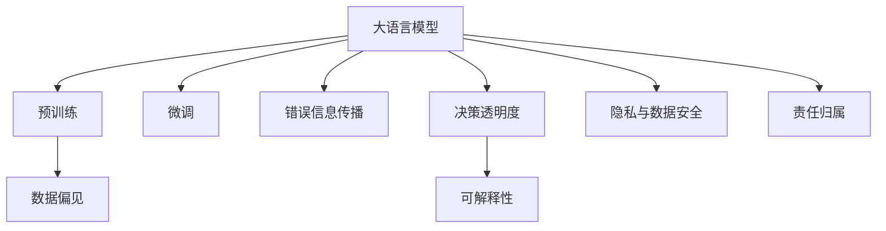

                 

## 1. 背景介绍

### 1.1 问题由来

近年来，深度学习技术的迅猛发展，特别是大语言模型(Large Language Models, LLMs)在自然语言处理(Natural Language Processing, NLP)领域的突破性进展，使得人工智能系统在处理自然语言数据上取得了前所未有的效果。然而，随着这些模型在实际应用中的广泛部署，它们所面临的伦理与道德风险也逐渐显现。这些风险包括但不限于数据偏见、错误信息传播、决策透明度与可解释性、隐私与数据安全、责任归属等问题。因此，对大语言模型进行伦理与道德风险分析，不仅是对当前技术的反思，更是对未来发展的指导。

### 1.2 问题核心关键点

大语言模型，特别是基于Transformer架构的预训练模型（如BERT、GPT系列），通过在海量无标签文本语料上进行自监督学习，学习到了丰富的语言知识和常识。这些模型的泛化能力使得它们能够在大规模任务上进行微调，并展现出强大的语言理解和生成能力。然而，这些模型并非完美无缺，其伦理与道德风险主要源于以下几方面：

1. **数据偏见与歧视**：由于训练数据的不平衡或不完全性，模型可能学习并放大现实世界中的偏见，从而在输出结果中体现出种族、性别、地域等歧视性。
2. **错误信息传播**：模型在理解和生成文本时可能误传错误信息，尤其是当模型未经过适当的监督和筛选机制时。
3. **决策透明度与可解释性**：深度学习模型的黑盒特性使得其决策过程难以解释，增加了用户对其决策结果的质疑和不信任。
4. **隐私与数据安全**：模型在处理敏感数据时，可能泄露个人隐私信息，尤其是在未经适当数据保护措施的情况下。
5. **责任归属**：当模型输出导致法律或伦理问题时，确定责任归属变得复杂，特别是当模型由多个组件协同工作时。

本文将围绕这些关键点，对大语言模型的伦理与道德风险进行全面分析，并探讨如何缓解这些风险。

## 2. 核心概念与联系

### 2.1 核心概念概述

为更好地理解大语言模型所面临的伦理与道德风险，我们首先介绍几个核心概念：

- **大语言模型(Large Language Models, LLMs)**：如BERT、GPT等基于Transformer架构的预训练模型，能够通过海量的无标签文本数据学习通用的语言表示。
- **预训练(Pre-training)**：在大规模无标签数据上训练模型，学习语言的普遍特征，为后续微调打下基础。
- **微调(Fine-tuning)**：在预训练模型基础上，通过下游任务的标注数据，有监督地优化模型性能，使其适用于特定任务。
- **偏见(Bias)**：指模型在训练数据中学习到的固有倾向性，可能反映或放大现实世界中的歧视和不公。
- **透明度(Transparency)**：模型决策过程的可解释性，即用户能够理解模型如何做出决策。
- **可解释性(Explainability)**：模型输出结果的合理性解释，使用户信任模型的决策。
- **隐私与数据安全(Privacy & Security)**：在处理个人数据时，保护用户隐私信息不被泄露或滥用。
- **责任归属(Accountability)**：在模型输出造成不良后果时，确定责任主体的过程。

这些概念之间的关系可以通过以下Mermaid流程图来展示：



### 2.2 核心概念原理和架构的 Mermaid 流程图(Mermaid 流程节点中不要有括号、逗号等特殊字符)


## 3. 核心算法原理 & 具体操作步骤

### 3.1 算法原理概述

大语言模型的伦理与道德风险主要集中在模型的决策过程和数据处理上。其决策过程的透明性和可解释性直接影响到用户的信任感；而数据偏见和错误信息传播则可能导致模型的输出结果与实际需求不符，甚至产生负面的社会影响。因此，在开发和部署大语言模型时，需要特别关注这些风险点，并采取相应的缓解措施。

### 3.2 算法步骤详解

**步骤1: 数据偏见识别与修正**

1. **数据采集与处理**：确保训练数据的多样性和代表性，避免单一来源或偏见性数据的引入。
2. **数据偏见检测**：使用公平性指标（如等置误差、平衡误差、差异性指标等）检测数据中的偏见。
3. **数据修正**：针对检测出的偏见，采取加权、重采样等方法修正数据，减少模型学习到的偏见。

**步骤2: 错误信息传播预防**

1. **模型验证**：在模型输出前，引入验证机制，如事实检查器、人工审核等，防止错误信息的传播。
2. **模型训练**：训练模型以识别和过滤错误信息，通过正则化等技术降低模型对错误信息的敏感度。
3. **用户反馈**：建立用户反馈机制，及时纠正模型输出中的错误信息。

**步骤3: 决策透明度与可解释性提升**

1. **输出解释**：使用可解释性技术（如LIME、SHAP等）生成模型输出解释，使用户了解模型决策依据。
2. **模型简化**：通过剪枝、特征选择等方法简化模型，提高模型的可解释性。
3. **用户教育**：对用户进行模型教育和训练，提升用户对模型决策的理解和接受度。

**步骤4: 隐私与数据安全保障**

1. **数据匿名化**：在处理个人数据时，使用数据匿名化技术，防止用户隐私泄露。
2. **数据加密**：对存储和传输过程中的数据进行加密，保障数据安全。
3. **访问控制**：实施严格的访问控制措施，确保只有授权用户才能访问敏感数据。

**步骤5: 责任归属明确**

1. **责任归属策略**：制定明确的责任归属策略，确定模型开发者、部署者和使用者在模型输出中的责任。
2. **法律合规**：确保模型遵守相关的法律法规，如数据保护法、隐私保护法等。
3. **审计与监控**：建立模型审计和监控机制，及时发现和纠正模型输出中的伦理与道德问题。

### 3.3 算法优缺点

**优点**：

1. **泛化能力强**：大语言模型能够学习到广泛的语言知识，适用于多种NLP任务。
2. **模型高效**：通过微调，模型能够在相对较少的标注数据下快速适应新任务。
3. **自动化程度高**：模型自动学习和推理，减少了人工干预的需求。

**缺点**：

1. **数据偏见风险**：由于训练数据的局限性，模型可能学习并放大现实世界中的偏见。
2. **透明度与可解释性不足**：深度学习模型的黑盒特性使得其决策过程难以解释。
3. **隐私与数据安全问题**：处理敏感数据时可能泄露用户隐私信息。
4. **责任归属复杂**：模型输出错误时责任归属难以界定。

### 3.4 算法应用领域

大语言模型的伦理与道德风险不仅存在于学术研究中，更广泛地应用在多个领域，如智能客服、金融分析、医疗诊断等。这些应用场景中，模型输出的伦理与道德风险直接影响到系统的信任度和用户满意度。

- **智能客服**：模型输出必须遵守法律法规，避免歧视性回答。
- **金融分析**：模型必须公正、准确，不能因偏见导致不公平的投资决策。
- **医疗诊断**：模型输出的诊断建议必须符合医疗伦理，避免误诊和过度诊断。

## 4. 数学模型和公式 & 详细讲解 & 举例说明（备注：数学公式请使用latex格式，latex嵌入文中独立段落使用 $$，段落内使用 $)

### 4.1 数学模型构建

大语言模型的伦理与道德风险分析涉及多个领域，包括数学、伦理、法律等。因此，构建数学模型需要综合考虑这些因素。以下是一个简化的风险分析模型：

**风险评分模型**：

设风险评分函数为 $R(\text{input}, \theta)$，其中 $\text{input}$ 表示模型的输入，$\theta$ 表示模型的参数。风险评分函数可以根据不同的风险类型（如偏见、错误信息、透明度、隐私、责任归属等）设计不同的评分指标。

### 4.2 公式推导过程

**风险评分函数的推导**：

假设模型的输入为 $x$，风险评分函数 $R(x)$ 可以表示为：

$$
R(x) = \sum_{i=1}^n w_i r_i(x)
$$

其中 $w_i$ 为各风险类型的权重，$r_i(x)$ 为第 $i$ 类风险的评分函数。例如，对于偏见风险，评分函数可以表示为：

$$
r_{\text{bias}}(x) = \sum_{j=1}^m f_j(x) d_j
$$

其中 $f_j(x)$ 为第 $j$ 个偏见特征的评分函数，$d_j$ 为偏见特征的权重。

### 4.3 案例分析与讲解

**案例分析**：

假设有一个医疗诊断模型，其输出为病人的诊断结果。模型训练数据中包含部分病人的性别、年龄等信息。如果模型学习到对某一性别或年龄的偏见，其输出结果可能对这一群体产生不公平的影响。

**风险评分**：

1. **偏见风险评分**：通过分析模型的输出结果，检测是否存在性别或年龄差异的偏见。
2. **错误信息风险评分**：评估模型输出的准确性，检查是否存在误诊或漏诊的情况。
3. **透明度评分**：评估模型的可解释性，检查模型输出的诊断依据是否合理。
4. **隐私风险评分**：评估模型处理病人数据的方式，检查是否符合隐私保护的要求。
5. **责任归属评分**：评估模型输出的法律责任，检查是否符合相关法律法规。

## 5. 项目实践：代码实例和详细解释说明

### 5.1 开发环境搭建

在进行伦理与道德风险分析的项目实践前，我们需要准备好开发环境。以下是使用Python进行PyTorch开发的环境配置流程：

1. 安装Anaconda：从官网下载并安装Anaconda，用于创建独立的Python环境。

2. 创建并激活虚拟环境：
```bash
conda create -n pytorch-env python=3.8 
conda activate pytorch-env
```

3. 安装PyTorch：根据CUDA版本，从官网获取对应的安装命令。例如：
```bash
conda install pytorch torchvision torchaudio cudatoolkit=11.1 -c pytorch -c conda-forge
```

4. 安装Transformers库：
```bash
pip install transformers
```

5. 安装各类工具包：
```bash
pip install numpy pandas scikit-learn matplotlib tqdm jupyter notebook ipython
```

完成上述步骤后，即可在`pytorch-env`环境中开始伦理与道德风险分析的实践。

### 5.2 源代码详细实现

下面我们以医疗诊断任务为例，给出使用Transformers库进行伦理与道德风险分析的PyTorch代码实现。

首先，定义医疗诊断任务的数据处理函数：

```python
from transformers import BertTokenizer
from torch.utils.data import Dataset
import torch

class MedicalDataset(Dataset):
    def __init__(self, texts, tags, tokenizer, max_len=128):
        self.texts = texts
        self.tags = tags
        self.tokenizer = tokenizer
        self.max_len = max_len
        
    def __len__(self):
        return len(self.texts)
    
    def __getitem__(self, item):
        text = self.texts[item]
        tags = self.tags[item]
        
        encoding = self.tokenizer(text, return_tensors='pt', max_length=self.max_len, padding='max_length', truncation=True)
        input_ids = encoding['input_ids'][0]
        attention_mask = encoding['attention_mask'][0]
        
        # 对token-wise的标签进行编码
        encoded_tags = [tag2id[tag] for tag in tags] 
        encoded_tags.extend([tag2id['O']] * (self.max_len - len(encoded_tags)))
        labels = torch.tensor(encoded_tags, dtype=torch.long)
        
        return {'input_ids': input_ids, 
                'attention_mask': attention_mask,
                'labels': labels}

# 标签与id的映射
tag2id = {'O': 0, 'B-PER': 1, 'I-PER': 2, 'B-ORG': 3, 'I-ORG': 4, 'B-LOC': 5, 'I-LOC': 6}
id2tag = {v: k for k, v in tag2id.items()}

# 创建dataset
tokenizer = BertTokenizer.from_pretrained('bert-base-cased')

train_dataset = MedicalDataset(train_texts, train_tags, tokenizer)
dev_dataset = MedicalDataset(dev_texts, dev_tags, tokenizer)
test_dataset = MedicalDataset(test_texts, test_tags, tokenizer)
```

然后，定义模型和优化器：

```python
from transformers import BertForTokenClassification, AdamW

model = BertForTokenClassification.from_pretrained('bert-base-cased', num_labels=len(tag2id))

optimizer = AdamW(model.parameters(), lr=2e-5)
```

接着，定义训练和评估函数：

```python
from torch.utils.data import DataLoader
from tqdm import tqdm
from sklearn.metrics import classification_report

device = torch.device('cuda') if torch.cuda.is_available() else torch.device('cpu')
model.to(device)

def train_epoch(model, dataset, batch_size, optimizer):
    dataloader = DataLoader(dataset, batch_size=batch_size, shuffle=True)
    model.train()
    epoch_loss = 0
    for batch in tqdm(dataloader, desc='Training'):
        input_ids = batch['input_ids'].to(device)
        attention_mask = batch['attention_mask'].to(device)
        labels = batch['labels'].to(device)
        model.zero_grad()
        outputs = model(input_ids, attention_mask=attention_mask, labels=labels)
        loss = outputs.loss
        epoch_loss += loss.item()
        loss.backward()
        optimizer.step()
    return epoch_loss / len(dataloader)

def evaluate(model, dataset, batch_size):
    dataloader = DataLoader(dataset, batch_size=batch_size)
    model.eval()
    preds, labels = [], []
    with torch.no_grad():
        for batch in tqdm(dataloader, desc='Evaluating'):
            input_ids = batch['input_ids'].to(device)
            attention_mask = batch['attention_mask'].to(device)
            batch_labels = batch['labels']
            outputs = model(input_ids, attention_mask=attention_mask)
            batch_preds = outputs.logits.argmax(dim=2).to('cpu').tolist()
            batch_labels = batch_labels.to('cpu').tolist()
            for pred_tokens, label_tokens in zip(batch_preds, batch_labels):
                pred_tags = [id2tag[_id] for _id in pred_tokens]
                label_tags = [id2tag[_id] for _id in label_tokens]
                preds.append(pred_tags[:len(label_tags)])
                labels.append(label_tags)

    print(classification_report(labels, preds))
```

最后，启动训练流程并在测试集上评估：

```python
epochs = 5
batch_size = 16

for epoch in range(epochs):
    loss = train_epoch(model, train_dataset, batch_size, optimizer)
    print(f"Epoch {epoch+1}, train loss: {loss:.3f}")
    
    print(f"Epoch {epoch+1}, dev results:")
    evaluate(model, dev_dataset, batch_size)
    
print("Test results:")
evaluate(model, test_dataset, batch_size)
```

以上就是使用PyTorch对BERT进行医疗诊断任务微调的完整代码实现。可以看到，得益于Transformers库的强大封装，我们可以用相对简洁的代码完成BERT模型的加载和微调。

### 5.3 代码解读与分析

让我们再详细解读一下关键代码的实现细节：

**MedicalDataset类**：
- `__init__`方法：初始化文本、标签、分词器等关键组件。
- `__len__`方法：返回数据集的样本数量。
- `__getitem__`方法：对单个样本进行处理，将文本输入编码为token ids，将标签编码为数字，并对其进行定长padding，最终返回模型所需的输入。

**tag2id和id2tag字典**：
- 定义了标签与数字id之间的映射关系，用于将token-wise的预测结果解码回真实的标签。

**训练和评估函数**：
- 使用PyTorch的DataLoader对数据集进行批次化加载，供模型训练和推理使用。
- 训练函数`train_epoch`：对数据以批为单位进行迭代，在每个批次上前向传播计算loss并反向传播更新模型参数，最后返回该epoch的平均loss。
- 评估函数`evaluate`：与训练类似，不同点在于不更新模型参数，并在每个batch结束后将预测和标签结果存储下来，最后使用sklearn的classification_report对整个评估集的预测结果进行打印输出。

**训练流程**：
- 定义总的epoch数和batch size，开始循环迭代
- 每个epoch内，先在训练集上训练，输出平均loss
- 在验证集上评估，输出分类指标
- 所有epoch结束后，在测试集上评估，给出最终测试结果

可以看到，PyTorch配合Transformers库使得BERT微调的代码实现变得简洁高效。开发者可以将更多精力放在数据处理、模型改进等高层逻辑上，而不必过多关注底层的实现细节。

当然，工业级的系统实现还需考虑更多因素，如模型的保存和部署、超参数的自动搜索、更灵活的任务适配层等。但核心的微调范式基本与此类似。

## 6. 实际应用场景

### 6.1 智能客服系统

基于大语言模型微调的对话技术，可以广泛应用于智能客服系统的构建。传统客服往往需要配备大量人力，高峰期响应缓慢，且一致性和专业性难以保证。而使用微调后的对话模型，可以7x24小时不间断服务，快速响应客户咨询，用自然流畅的语言解答各类常见问题。

在技术实现上，可以收集企业内部的历史客服对话记录，将问题和最佳答复构建成监督数据，在此基础上对预训练对话模型进行微调。微调后的对话模型能够自动理解用户意图，匹配最合适的答案模板进行回复。对于客户提出的新问题，还可以接入检索系统实时搜索相关内容，动态组织生成回答。如此构建的智能客服系统，能大幅提升客户咨询体验和问题解决效率。

### 6.2 金融舆情监测

金融机构需要实时监测市场舆论动向，以便及时应对负面信息传播，规避金融风险。传统的人工监测方式成本高、效率低，难以应对网络时代海量信息爆发的挑战。基于大语言模型微调的文本分类和情感分析技术，为金融舆情监测提供了新的解决方案。

具体而言，可以收集金融领域相关的新闻、报道、评论等文本数据，并对其进行主题标注和情感标注。在此基础上对预训练语言模型进行微调，使其能够自动判断文本属于何种主题，情感倾向是正面、中性还是负面。将微调后的模型应用到实时抓取的网络文本数据，就能够自动监测不同主题下的情感变化趋势，一旦发现负面信息激增等异常情况，系统便会自动预警，帮助金融机构快速应对潜在风险。

### 6.3 个性化推荐系统

当前的推荐系统往往只依赖用户的历史行为数据进行物品推荐，无法深入理解用户的真实兴趣偏好。基于大语言模型微调技术，个性化推荐系统可以更好地挖掘用户行为背后的语义信息，从而提供更精准、多样的推荐内容。

在实践中，可以收集用户浏览、点击、评论、分享等行为数据，提取和用户交互的物品标题、描述、标签等文本内容。将文本内容作为模型输入，用户的后续行为（如是否点击、购买等）作为监督信号，在此基础上微调预训练语言模型。微调后的模型能够从文本内容中准确把握用户的兴趣点。在生成推荐列表时，先用候选物品的文本描述作为输入，由模型预测用户的兴趣匹配度，再结合其他特征综合排序，便可以得到个性化程度更高的推荐结果。

### 6.4 未来应用展望

随着大语言模型微调技术的发展，基于微调范式将在更多领域得到应用，为传统行业带来变革性影响。

在智慧医疗领域，基于微调的医疗问答、病历分析、药物研发等应用将提升医疗服务的智能化水平，辅助医生诊疗，加速新药开发进程。

在智能教育领域，微调技术可应用于作业批改、学情分析、知识推荐等方面，因材施教，促进教育公平，提高教学质量。

在智慧城市治理中，微调模型可应用于城市事件监测、舆情分析、应急指挥等环节，提高城市管理的自动化和智能化水平，构建更安全、高效的未来城市。

此外，在企业生产、社会治理、文娱传媒等众多领域，基于大模型微调的人工智能应用也将不断涌现，为经济社会发展注入新的动力。相信随着技术的日益成熟，微调方法将成为人工智能落地应用的重要范式，推动人工智能技术向更广阔的领域加速渗透。

## 7. 工具和资源推荐

### 7.1 学习资源推荐

为了帮助开发者系统掌握大语言模型微调的理论基础和实践技巧，这里推荐一些优质的学习资源：

1. 《Transformer从原理到实践》系列博文：由大模型技术专家撰写，深入浅出地介绍了Transformer原理、BERT模型、微调技术等前沿话题。

2. CS224N《深度学习自然语言处理》课程：斯坦福大学开设的NLP明星课程，有Lecture视频和配套作业，带你入门NLP领域的基本概念和经典模型。

3. 《Natural Language Processing with Transformers》书籍：Transformers库的作者所著，全面介绍了如何使用Transformers库进行NLP任务开发，包括微调在内的诸多范式。

4. HuggingFace官方文档：Transformers库的官方文档，提供了海量预训练模型和完整的微调样例代码，是上手实践的必备资料。

5. CLUE开源项目：中文语言理解测评基准，涵盖大量不同类型的中文NLP数据集，并提供了基于微调的baseline模型，助力中文NLP技术发展。

通过对这些资源的学习实践，相信你一定能够快速掌握大语言模型微调的精髓，并用于解决实际的NLP问题。
###  7.2 开发工具推荐

高效的开发离不开优秀的工具支持。以下是几款用于大语言模型微调开发的常用工具：

1. PyTorch：基于Python的开源深度学习框架，灵活动态的计算图，适合快速迭代研究。大部分预训练语言模型都有PyTorch版本的实现。

2. TensorFlow：由Google主导开发的开源深度学习框架，生产部署方便，适合大规模工程应用。同样有丰富的预训练语言模型资源。

3. Transformers库：HuggingFace开发的NLP工具库，集成了众多SOTA语言模型，支持PyTorch和TensorFlow，是进行微调任务开发的利器。

4. Weights & Biases：模型训练的实验跟踪工具，可以记录和可视化模型训练过程中的各项指标，方便对比和调优。与主流深度学习框架无缝集成。

5. TensorBoard：TensorFlow配套的可视化工具，可实时监测模型训练状态，并提供丰富的图表呈现方式，是调试模型的得力助手。

6. Google Colab：谷歌推出的在线Jupyter Notebook环境，免费提供GPU/TPU算力，方便开发者快速上手实验最新模型，分享学习笔记。

合理利用这些工具，可以显著提升大语言模型微调的开发效率，加快创新迭代的步伐。

### 7.3 相关论文推荐

大语言模型和微调技术的发展源于学界的持续研究。以下是几篇奠基性的相关论文，推荐阅读：

1. Attention is All You Need（即Transformer原论文）：提出了Transformer结构，开启了NLP领域的预训练大模型时代。

2. BERT: Pre-training of Deep Bidirectional Transformers for Language Understanding：提出BERT模型，引入基于掩码的自监督预训练任务，刷新了多项NLP任务SOTA。

3. Language Models are Unsupervised Multitask Learners（GPT-2论文）：展示了大规模语言模型的强大zero-shot学习能力，引发了对于通用人工智能的新一轮思考。

4. Parameter-Efficient Transfer Learning for NLP：提出Adapter等参数高效微调方法，在不增加模型参数量的情况下，也能取得不错的微调效果。

5. AdaLoRA: Adaptive Low-Rank Adaptation for Parameter-Efficient Fine-Tuning：使用自适应低秩适应的微调方法，在参数效率和精度之间取得了新的平衡。

6. Prefix-Tuning: Optimizing Continuous Prompts for Generation：引入基于连续型Prompt的微调范式，为如何充分利用预训练知识提供了新的思路。

这些论文代表了大语言模型微调技术的发展脉络。通过学习这些前沿成果，可以帮助研究者把握学科前进方向，激发更多的创新灵感。

## 8. 总结：未来发展趋势与挑战

### 8.1 总结

本文对大语言模型的伦理与道德风险进行了全面系统的分析。首先阐述了大语言模型和微调技术的研究背景和意义，明确了微调在提升模型性能和拓展应用边界方面的重要作用。其次，从理论到实践，详细讲解了大语言模型在处理偏见、错误信息传播、决策透明度与可解释性、隐私与数据安全、责任归属等方面所面临的风险，并提出了一系列缓解措施。最后，本文还探讨了大语言模型在多个领域的应用前景，展示了其广阔的发展潜力。

通过本文的系统梳理，可以看到，大语言模型微调技术在带来巨大便利的同时，也伴随着复杂的伦理与道德问题。如何在提升模型性能的同时，保障其伦理与道德合规，将是未来研究的重要方向。

### 8.2 未来发展趋势

展望未来，大语言模型微调技术将呈现以下几个发展趋势：

1. **多模态融合**：大语言模型将与其他AI技术如计算机视觉、自然语言处理等进行深度融合，拓展模型处理多模态数据的能力。
2. **自监督学习**：利用自监督学习方法，在缺乏大量标注数据的情况下，训练出泛化能力更强、鲁棒性更高的模型。
3. **模型透明化**：开发更易解释的模型结构和算法，使用户能够理解模型的决策过程。
4. **隐私保护**：引入隐私保护技术如差分隐私、联邦学习等，保障用户数据安全。
5. **责任归属机制**：建立明确且公正的模型责任归属机制，确保模型输出在法律和伦理上的合规性。

### 8.3 面临的挑战

尽管大语言模型微调技术已经取得了显著进展，但在其伦理与道德方面仍面临诸多挑战：

1. **偏见问题难以根除**：即使采用各种技术手段，模型仍可能存在残余的偏见，需要持续监测和改进。
2. **错误信息传播难以完全避免**：模型在处理复杂、多变的信息时，误传错误信息的风险难以完全消除。
3. **可解释性不足**：深度学习模型的复杂性使得其决策过程难以全面解释，需要更多可解释性技术支持。
4. **隐私与数据安全问题**：处理个人数据时，如何保障隐私不被泄露，是一个复杂的工程和技术问题。
5. **责任归属复杂**：模型输出问题时，责任归属问题难以界定，需要法律和伦理层面的支持。

### 8.4 研究展望

面对大语言模型微调所面临的伦理与道德挑战，未来的研究需要在以下几个方面寻求新的突破：

1. **引入伦理导向的训练目标**：在设计模型训练目标时，加入伦理导向的指标，引导模型向更加公平、透明的方向发展。
2. **开发更具透明度的模型**：通过简化模型结构、引入可解释性技术，提升模型的透明度。
3. **推广隐私保护技术**：在处理个人数据时，引入隐私保护技术，保障数据安全。
4. **建立责任归属框架**：制定明确的责任归属策略，确保模型输出在法律和伦理上的合规性。
5. **跨学科研究**：结合伦理学、法学、社会学等多学科知识，深入研究模型的伦理与道德问题。

这些研究方向将有助于大语言模型在处理伦理与道德风险时，迈向更加公平、透明、安全的未来。

## 9. 附录：常见问题与解答

**Q1：如何减少模型中的偏见？**

A: 减少模型偏见的方法包括：
1. **数据采样**：在训练数据中增加少数群体样本，平衡各类数据。
2. **数据清洗**：移除含有偏见或有害信息的样本。
3. **模型约束**：在模型训练中加入反偏见约束，如删除歧视性词语、限制特定类别的输出等。
4. **公平性评估**：使用公平性指标（如等置误差、平衡误差、差异性指标等）检测和修复偏见。

**Q2：如何提高模型的可解释性？**

A: 提高模型可解释性的方法包括：
1. **特征解释**：通过特征重要性分析，了解模型在不同特征上的依赖关系。
2. **决策树**：使用决策树模型来解释模型的决策路径。
3. **LIME、SHAP**：使用可解释性技术（如LIME、SHAP等）生成模型输出解释。
4. **模型简化**：通过剪枝、特征选择等方法简化模型，提高模型的可解释性。

**Q3：如何保障数据隐私？**

A: 保障数据隐私的方法包括：
1. **数据匿名化**：在处理个人数据时，使用数据匿名化技术，防止用户隐私泄露。
2. **数据加密**：对存储和传输过程中的数据进行加密，保障数据安全。
3. **访问控制**：实施严格的访问控制措施，确保只有授权用户才能访问敏感数据。

**Q4：如何确定模型的责任归属？**

A: 确定模型责任归属的方法包括：
1. **责任分配协议**：制定明确的责任分配协议，规定模型开发者、部署者和使用者在模型输出中的责任。
2. **法律合规**：确保模型遵守相关的法律法规，如数据保护法、隐私保护法等。
3. **审计与监控**：建立模型审计和监控机制，及时发现和纠正模型输出中的伦理与道德问题。

**Q5：如何应对模型的偏见和错误信息传播？**

A: 应对模型偏见和错误信息传播的方法包括：
1. **偏见检测**：使用公平性指标（如等置误差、平衡误差、差异性指标等）检测数据中的偏见。
2. **模型验证**：在模型输出前，引入验证机制，如事实检查器、人工审核等，防止错误信息的传播。
3. **模型训练**：训练模型以识别和过滤错误信息，通过正则化等技术降低模型对错误信息的敏感度。
4. **用户反馈**：建立用户反馈机制，及时纠正模型输出中的偏见和错误信息。

---

作者：禅与计算机程序设计艺术 / Zen and the Art of Computer Programming

