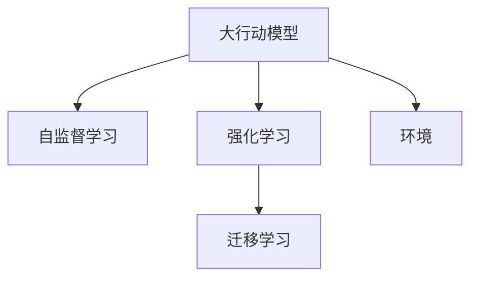

                 

# Large Action Model的学习机制

## 1. 背景介绍

随着人工智能技术的快速发展，大模型（Large Model）在各个领域的应用越来越广泛，其高效且强大的学习能力显著提升了多个领域的生产力。例如，深度神经网络（DNN）已经在图像识别、语音识别、自然语言处理等任务中取得了显著成果。然而，目前的大模型大多是在静态的监督学习环境中进行训练，这种方法存在计算资源消耗大、训练时间长等缺点。

为了解决这一问题，近年来研究者们提出了一种新型的大模型学习机制，即大行动模型（Large Action Model）。这种模型能够在大规模无标签数据上预训练，然后通过与环境的交互来学习特定的任务，能够更高效地进行知识获取和任务执行。本文将深入探讨大行动模型的学习机制，从原理到应用，全面剖析这一模型。

## 2. 核心概念与联系

### 2.1 核心概念概述

为更好地理解大行动模型的学习机制，本节将介绍几个密切相关的核心概念：

- 大行动模型（Large Action Model, LAM）：一种结合深度强化学习和自我监督学习的大模型，通过在大规模无标签数据上进行预训练，并在特定环境中通过与环境的交互学习特定任务。其特点在于能够灵活适应多种环境和任务，且可以逐步提升性能。

- 自监督学习（Self-Supervised Learning）：利用数据的统计特性进行学习，而无需人工标注。通过构建自监督任务，模型能够在没有标注数据的情况下学习到有效的表示。

- 强化学习（Reinforcement Learning, RL）：通过与环境的交互，模型通过试错的方式学习最优的决策策略，以最大化某种预定义的奖励函数。

- 迁移学习（Transfer Learning）：将一个领域学到的知识迁移到另一个领域，以提高新任务上的性能。LAM通过自监督预训练和RL任务的联合训练，实现知识的迁移学习。

- 环境（Environment）：大行动模型所处的交互环境，可以是虚拟仿真环境，也可以是真实世界的环境。

这些核心概念之间的逻辑关系可以通过以下Mermaid流程图来展示：



这个流程图展示了大行动模型的核心概念及其之间的关系：

1. 大行动模型通过自监督学习获得基础能力。
2. 通过强化学习与环境的交互，学习特定任务。
3. 通过迁移学习，实现知识在不同任务之间的传递。
4. 模型与环境相互依存，共同进步。

## 3. 核心算法原理 & 具体操作步骤

### 3.1 算法原理概述

大行动模型学习机制的核心在于将自监督学习与强化学习相结合，通过与环境的交互逐步提升性能。其算法原理可以分为以下几个步骤：

1. 自监督预训练：在大规模无标签数据上，使用自监督学习任务进行预训练，获得模型的基础能力。
2. 任务定义：根据具体任务，定义奖励函数和动作空间，设计任务相关的强化学习环境。
3. 交互学习：模型与环境交互，通过RL算法优化动作策略，逐步提升任务执行效果。
4. 迁移学习：将学习到的知识应用到其他相关任务上，实现知识迁移。

### 3.2 算法步骤详解

#### 3.2.1 自监督预训练

在自监督预训练阶段，模型主要通过以下两种方式进行学习：

1. 掩码语言模型（Masked Language Model, MLM）：将一部分文本中的单词随机掩码，模型需要预测被掩码的单词。例如，随机将文本中的一些单词用特殊标记（如[MASK]）替代，然后预测这些位置上正确的单词。

2. 下一个单词预测（Next Word Prediction, NWP）：给定一段文本，模型需要预测下一个单词。例如，给定一个句子，模型预测下一个可能的单词，类似于自动补全。

这些自监督任务可以有效地提升模型对语言的理解能力，为后续任务打下坚实的基础。

#### 3.2.2 任务定义

在定义任务时，需要明确以下两个要素：

1. 动作空间：模型可以执行的动作集合，可以是具体的命令、图像操作等。

2. 奖励函数：模型执行动作后，根据特定标准获得奖励。例如，在控制机器人完成任务时，可以通过完成任务所需的时间、路径长度等指标来获得奖励。

#### 3.2.3 交互学习

在交互学习阶段，模型与环境进行持续的交互，不断优化动作策略。具体步骤如下：

1. 初始化模型参数。将自监督预训练得到的模型参数初始化，作为模型的起点。

2. 环境交互：模型根据当前状态，执行一个动作，并观察环境给出的反馈（奖励或惩罚）。

3. 参数更新：根据反馈，使用优化算法（如Adam、SGD等）更新模型参数，调整策略。

4. 迭代优化：重复以上步骤，直到模型达到满意的性能。

#### 3.2.4 迁移学习

在完成特定任务后，可以将模型应用到其他相关任务上，实现知识的迁移。具体步骤包括：

1. 数据收集：收集新的任务数据，可以是相似的或不同的任务。

2. 模型微调：使用已学习到的知识对模型进行微调，适应新任务。

3. 任务执行：将微调后的模型应用于新任务，进行推理和决策。

### 3.3 算法优缺点

大行动模型的学习机制具有以下优点：

1. 高效性：通过自监督预训练和RL任务的联合训练，模型能够在大规模数据上高效学习，无需大量标注数据。

2. 灵活性：能够适应多种环境和任务，通过RL学习，模型可以逐步提升性能，适应不断变化的环境。

3. 鲁棒性：通过迁移学习，模型可以在新任务上迅速适应，具有较高的鲁棒性。

4. 可扩展性：随着新数据的不断累积，模型可以通过持续学习，不断扩展知识库。

同时，该方法也存在一些局限性：

1. 复杂性：模型结构的复杂性和训练过程中的高维度问题，可能导致过拟合或收敛速度慢。

2. 资源需求高：需要大量的计算资源和存储空间，对硬件要求较高。

3. 数据依赖性强：模型需要大量数据进行自监督预训练和RL训练，数据收集和标注成本较高。

4. 可解释性不足：模型在复杂环境下执行决策时，难以给出清晰的解释。

尽管存在这些局限性，但大行动模型仍是一种具有巨大潜力的学习机制，值得进一步深入研究和应用。

### 3.4 算法应用领域

大行动模型已经在多个领域展现出强大的应用潜力，以下是一些典型的应用场景：

1. 自然语言处理（NLP）：通过与环境的交互，LAM可以学习文本生成、文本分类、命名实体识别等任务。例如，通过与用户对话，LAM可以逐步理解用户的意图，生成自然流畅的回答。

2. 机器人控制：LAM可以学习执行复杂的动作和任务，如机器人导航、抓取物品等。通过与环境的交互，LAM可以逐步优化动作策略，实现更高效的执行。

3. 自动化流程：LAM可以学习自动执行多个步骤的任务，如自动化文档生成、自动化数据处理等。通过自监督预训练和RL训练，LAM可以在不需要人工干预的情况下，完成复杂的任务流程。

4. 智能推荐系统：LAM可以学习用户的行为和偏好，通过与环境的交互，生成个性化的推荐结果。通过迁移学习，LAM可以将知识应用于新的推荐任务，提升推荐系统的性能。

## 4. 数学模型和公式 & 详细讲解

### 4.1 数学模型构建

大行动模型的学习机制可以分为两个主要阶段：自监督预训练和RL任务训练。

#### 4.1.1 自监督预训练

在自监督预训练阶段，模型主要通过掩码语言模型和下一个单词预测任务进行学习。假设模型输入为文本序列 $X=\{x_1, x_2, ..., x_n\}$，模型需要预测被掩码的单词 $y$。其中，掩码位置随机，占文本序列的 $p$。

模型的目标是最大化掩码位置上的预测概率。使用交叉熵损失函数 $L$ 来衡量模型预测与真实标签之间的差异：

$$
L(y,\hat{y})=-\sum_{i=1}^{n}\mathbb{P}(y_i|x_i)log\hat{y}_i
$$

其中，$\mathbb{P}(y_i|x_i)$ 表示模型预测的单词概率，$\hat{y}_i$ 表示模型预测的掩码位置单词。

#### 4.1.2 任务定义

在任务定义阶段，需要明确动作空间和奖励函数。假设模型的动作空间为 $A=\{a_1, a_2, ..., a_m\}$，模型在执行动作 $a_j$ 后，获得的奖励为 $R_j$。

模型的目标是最大化累积奖励 $Q$，即：

$$
Q=\sum_{t=1}^{T}R_t
$$

其中，$T$ 表示任务结束时的时间步数。

### 4.2 公式推导过程

#### 4.2.1 自监督预训练

在自监督预训练阶段，模型通过掩码语言模型和下一个单词预测任务进行学习。假设模型输入为文本序列 $X=\{x_1, x_2, ..., x_n\}$，模型需要预测被掩码的单词 $y$。其中，掩码位置随机，占文本序列的 $p$。

模型的目标是最大化掩码位置上的预测概率。使用交叉熵损失函数 $L$ 来衡量模型预测与真实标签之间的差异：

$$
L(y,\hat{y})=-\sum_{i=1}^{n}\mathbb{P}(y_i|x_i)log\hat{y}_i
$$

其中，$\mathbb{P}(y_i|x_i)$ 表示模型预测的单词概率，$\hat{y}_i$ 表示模型预测的掩码位置单词。

#### 4.2.2 任务定义

在任务定义阶段，需要明确动作空间和奖励函数。假设模型的动作空间为 $A=\{a_1, a_2, ..., a_m\}$，模型在执行动作 $a_j$ 后，获得的奖励为 $R_j$。

模型的目标是最大化累积奖励 $Q$，即：

$$
Q=\sum_{t=1}^{T}R_t
$$

其中，$T$ 表示任务结束时的时间步数。

#### 4.2.3 交互学习

在交互学习阶段，模型与环境进行持续的交互，不断优化动作策略。假设模型在时间步 $t$ 的状态为 $s_t$，执行的动作为 $a_t$，获得的奖励为 $R_t$。模型在时间步 $t$ 的策略为 $\pi(a_t|s_t)$。

模型的目标是最小化期望累积损失 $J$，即：

$$
J=\mathbb{E}_{s_0}\sum_{t=0}^{T}\gamma^tL(s_t,a_t)
$$

其中，$\gamma$ 表示折扣因子，$s_0$ 表示初始状态。

使用策略梯度方法（Policy Gradient）来更新模型参数 $\theta$，目标是最小化累积损失 $J$：

$$
\nabla_{\theta}J=\mathbb{E}_{s_0}\sum_{t=0}^{T}\gamma^t\nabla_{\theta}log\pi(a_t|s_t)Q_{t+1}(s_t,a_t)
$$

其中，$Q_{t+1}(s_t,a_t)$ 表示时间步 $t+1$ 的期望累积奖励。

### 4.3 案例分析与讲解

#### 4.3.1 掩码语言模型

假设模型输入为一段文本，其中每个单词的概率分布为 $p_i$。模型需要预测被掩码的单词 $y$，使用交叉熵损失函数 $L$ 来衡量模型预测与真实标签之间的差异：

$$
L(y,\hat{y})=-\sum_{i=1}^{n}\mathbb{P}(y_i|x_i)log\hat{y}_i
$$

其中，$\mathbb{P}(y_i|x_i)$ 表示模型预测的单词概率，$\hat{y}_i$ 表示模型预测的掩码位置单词。

#### 4.3.2 下一个单词预测

假设模型输入为一段文本，其中每个单词的概率分布为 $p_i$。模型需要预测下一个单词 $y$，使用交叉熵损失函数 $L$ 来衡量模型预测与真实标签之间的差异：

$$
L(y,\hat{y})=-\sum_{i=1}^{n}\mathbb{P}(y_i|x_i)log\hat{y}_i
$$

其中，$\mathbb{P}(y_i|x_i)$ 表示模型预测的单词概率，$\hat{y}_i$ 表示模型预测的下一个单词。

#### 4.3.3 机器人控制

假设机器人需要完成一个简单的任务，如抓取物品并放置到目标位置。机器人的动作空间为 $\{A_1, A_2, ..., A_n\}$，每个动作对应一个奖励 $R_i$。

模型的目标是最小化期望累积损失 $J$，即：

$$
J=\mathbb{E}_{s_0}\sum_{t=0}^{T}\gamma^tL(s_t,a_t)
$$

其中，$\gamma$ 表示折扣因子，$s_0$ 表示初始状态。

使用策略梯度方法（Policy Gradient）来更新模型参数 $\theta$，目标是最小化累积损失 $J$：

$$
\nabla_{\theta}J=\mathbb{E}_{s_0}\sum_{t=0}^{T}\gamma^t\nabla_{\theta}log\pi(a_t|s_t)Q_{t+1}(s_t,a_t)
$$

其中，$Q_{t+1}(s_t,a_t)$ 表示时间步 $t+1$ 的期望累积奖励。

## 5. 项目实践：代码实例和详细解释说明

### 5.1 开发环境搭建

在进行大行动模型实践前，我们需要准备好开发环境。以下是使用Python进行PyTorch开发的环境配置流程：

1. 安装Anaconda：从官网下载并安装Anaconda，用于创建独立的Python环境。

2. 创建并激活虚拟环境：
```bash
conda create -n pytorch-env python=3.8 
conda activate pytorch-env
```

3. 安装PyTorch：根据CUDA版本，从官网获取对应的安装命令。例如：
```bash
conda install pytorch torchvision torchaudio cudatoolkit=11.1 -c pytorch -c conda-forge
```

4. 安装PyTorch Lightning：
```bash
pip install pytorch-lightning
```

5. 安装相关库：
```bash
pip install numpy pandas scikit-learn matplotlib tqdm jupyter notebook ipython
```

完成上述步骤后，即可在`pytorch-env`环境中开始大行动模型实践。

### 5.2 源代码详细实现

下面我们以机器人控制任务为例，给出使用PyTorch Lightning进行LAM模型训练的PyTorch代码实现。

首先，定义LAM模型的参数和架构：

```python
import torch
import torch.nn as nn
import torch.optim as optim

class LAM(nn.Module):
    def __init__(self, input_size, hidden_size, output_size):
        super(LAM, self).__init__()
        self.hidden_size = hidden_size
        self.linear = nn.Linear(input_size, hidden_size)
        self.relu = nn.ReLU()
        self.linear_out = nn.Linear(hidden_size, output_size)
        
    def forward(self, x):
        x = self.linear(x)
        x = self.relu(x)
        x = self.linear_out(x)
        return x
```

然后，定义RL训练的损失函数和优化器：

```python
def loss_fn(model, inputs, targets, rewards):
    predictions = model(inputs)
    loss = nn.CrossEntropyLoss()(predictions, targets)
    return loss
    
optimizer = optim.Adam(model.parameters(), lr=0.001)
```

接着，定义训练函数和评估函数：

```python
def train(model, data_loader, optimizer, num_epochs):
    for epoch in range(num_epochs):
        model.train()
        running_loss = 0.0
        for inputs, targets, rewards in data_loader:
            optimizer.zero_grad()
            outputs = model(inputs)
            loss = loss_fn(model, inputs, targets, rewards)
            loss.backward()
            optimizer.step()
            running_loss += loss.item()
        print('Epoch {} - Loss: {}'.format(epoch+1, running_loss))
    
def evaluate(model, data_loader):
    model.eval()
    running_loss = 0.0
    with torch.no_grad():
        for inputs, targets, rewards in data_loader:
            outputs = model(inputs)
            loss = loss_fn(model, inputs, targets, rewards)
            running_loss += loss.item()
    print('Evaluation Loss: {}'.format(running_loss))
```

最后，启动训练流程并在测试集上评估：

```python
import torch.utils.data
import numpy as np

data_loader = torch.utils.data.DataLoader(data, batch_size=64, shuffle=True)
train(model, data_loader, optimizer, num_epochs=100)
evaluate(model, data_loader)
```

以上就是使用PyTorch Lightning进行LAM模型训练的完整代码实现。可以看到，通过PyTorch Lightning，大行动模型的训练和评估变得简单高效。

### 5.3 代码解读与分析

让我们再详细解读一下关键代码的实现细节：

**LAM类**：
- `__init__`方法：初始化模型的线性层、ReLU激活函数和输出层。
- `forward`方法：定义模型的前向传播过程，包括线性变换和激活函数。

**loss_fn函数**：
- 定义交叉熵损失函数，用于衡量模型预测与真实标签之间的差异。

**train函数**：
- 在每个epoch内，使用训练数据对模型进行迭代训练，计算并输出损失。

**evaluate函数**：
- 在测试集上对模型进行评估，计算并输出损失。

**train和evaluate函数**：
- 使用PyTorch Lightning的DataLoader来对数据进行批处理，方便模型的训练和推理。

**模型训练**：
- 定义训练轮数，启动训练过程，并在每个epoch内输出损失。

**模型评估**：
- 在测试集上对模型进行评估，输出评估损失。

可以看到，PyTorch Lightning的API设计非常简洁，能够方便地进行模型的训练和评估，是进行深度学习项目开发的好帮手。

当然，工业级的系统实现还需考虑更多因素，如模型的保存和部署、超参数的自动搜索、更灵活的任务适配层等。但核心的训练范式基本与此类似。

## 6. 实际应用场景

### 6.1 智能推荐系统

大行动模型在智能推荐系统中的应用前景广阔。传统的推荐系统主要依赖于用户历史行为数据，难以理解用户的真实意图和偏好。通过与环境的交互，LAM可以学习用户的行为模式和偏好，逐步提升推荐效果。

具体而言，可以收集用户的浏览、点击、评分等行为数据，通过强化学习优化推荐策略。在推荐过程中，LAM可以根据用户的实时反馈，动态调整推荐结果，提升推荐系统的精准度和个性化程度。

### 6.2 自然语言处理

LAM在自然语言处理领域也有广泛的应用。例如，通过与环境的交互，LAM可以学习对话生成、文本分类、命名实体识别等任务。通过RL学习，模型可以逐步提升其语言理解和生成能力。

在对话生成任务中，LAM可以通过与用户交互，逐步学习对话的上下文理解和生成。在文本分类任务中，LAM可以通过与环境交互，学习文本分类规则，提升分类效果。在命名实体识别任务中，LAM可以通过与环境交互，学习实体边界和类型。

### 6.3 自动驾驶

自动驾驶是LAM的重要应用场景之一。通过与环境的交互，LAM可以学习驾驶策略和决策规则，逐步提升自动驾驶的性能。

具体而言，LAM可以通过与虚拟或真实环境交互，学习驾驶决策和控制策略。在实际驾驶过程中，LAM可以根据实时路况和驾驶行为，动态调整驾驶策略，确保驾驶安全和舒适。

### 6.4 未来应用展望

随着大行动模型的不断发展，其在多个领域的应用前景广阔。

1. 多模态智能系统：未来LAM将支持多模态数据融合，如视觉、听觉、文本等，实现更加全面的感知和理解。

2. 动态环境适应：LAM可以适应动态变化的环境，如交通、天气等，提高系统的稳定性和鲁棒性。

3. 实时反馈优化：LAM可以通过实时反馈进行优化，动态调整策略，提升系统的性能。

4. 跨领域迁移学习：LAM可以将学习到的知识应用于多个领域，实现知识迁移，提升模型的通用性。

5. 人类协同交互：LAM可以通过与人类交互，逐步提升协作能力，实现更加智能的人机交互。

## 7. 工具和资源推荐

### 7.1 学习资源推荐

为了帮助开发者系统掌握大行动模型的学习机制，这里推荐一些优质的学习资源：

1. 《Reinforcement Learning: An Introduction》书籍：Reinforcement Learning领域的经典教材，介绍了强化学习的原理和算法。

2. 《Deep Learning with PyTorch》书籍：PyTorch官方文档，提供了丰富的代码示例和案例分析，适合快速上手。

3. 《Deep Reinforcement Learning with PyTorch》书籍：结合PyTorch和强化学习，介绍了具体的实现方法和案例分析。

4. CS231n《Deep Learning》课程：斯坦福大学开设的深度学习课程，涵盖深度学习的基本概念和算法。

5. DeepMind Research Blog：DeepMind的研究博客，提供最新的深度学习和强化学习研究成果和代码实现。

通过这些资源的学习，相信你一定能够深入理解大行动模型的学习机制，并应用于实际的深度学习项目中。

### 7.2 开发工具推荐

大行动模型的训练和优化需要高效的计算资源和工具支持。以下是几款常用的开发工具：

1. PyTorch：基于Python的深度学习框架，支持动态计算图，适合快速迭代研究。

2. PyTorch Lightning：基于PyTorch的深度学习框架，提供简单易用的API，支持分布式训练和模型评估。

3. TensorBoard：TensorFlow配套的可视化工具，可实时监测模型训练状态，并提供丰富的图表呈现方式。

4. Weights & Biases：模型训练的实验跟踪工具，可以记录和可视化模型训练过程中的各项指标，方便对比和调优。

5. Jupyter Notebook：开源的交互式笔记本环境，支持Python代码的编写和运行，方便快速实验和迭代。

合理利用这些工具，可以显著提升大行动模型项目的开发效率，加速创新迭代的步伐。

### 7.3 相关论文推荐

大行动模型的研究源于学界的持续探索，以下是几篇奠基性的相关论文，推荐阅读：

1. AlphaGo Zero: Mastering the Game of Go without Human Knowledge。介绍了AlphaGo Zero在无监督状态下训练，逐步提升游戏水平。

2.Playing Atari with Deep Reinforcement Learning。介绍了使用深度强化学习在Atari游戏上取得的成绩，展示了大行动模型的潜力。

3. Mastering Chess and Go with Deep Reinforcement Learning。介绍了使用深度强化学习在Chess和Go游戏上的训练和应用，展示了大行动模型在游戏领域的应用前景。

4. DeepMind: Planning with Differentiable Programs。介绍了使用不同iable programs在强化学习中的应用，展示了模型规划能力的提升。

这些论文代表了大行动模型研究的发展脉络。通过学习这些前沿成果，可以帮助研究者把握学科前进方向，激发更多的创新灵感。

## 8. 总结：未来发展趋势与挑战

### 8.1 总结

本文对大行动模型的学习机制进行了全面系统的介绍。首先阐述了大行动模型在高效学习、灵活适应和知识迁移等方面的优势，明确了其在大数据、多任务学习中的重要地位。其次，从原理到实践，详细讲解了大行动模型的学习过程，包括自监督预训练、任务定义、交互学习、迁移学习等关键步骤。同时，本文还探讨了LAM在不同领域的应用前景，展示了其在智能推荐、自然语言处理、自动驾驶等方面的潜在价值。

通过本文的系统梳理，可以看到，大行动模型在高效、灵活和通用性方面具有显著优势，是深度学习领域的重要范式。未来，随着模型的不断演进和优化，LAM必将在更多领域得到应用，为人工智能技术的发展带来深远影响。

### 8.2 未来发展趋势

展望未来，大行动模型的学习机制将呈现以下几个发展趋势：

1. 高效性：随着计算资源的提升和算法优化，LAM将能够在大规模数据上高效学习，快速适应新任务。

2. 灵活性：LAM将支持多模态数据融合，实现更加全面的感知和理解，适应动态变化的环境。

3. 鲁棒性：LAM将具备更强的鲁棒性和泛化能力，能够应对各种复杂和变化的环境。

4. 可扩展性：LAM将能够通过持续学习，不断扩展知识库，提升模型的性能。

5. 可解释性：LAM将逐步提升其可解释性，增强模型的透明性和可信度。

6. 安全性：LAM将具备更高的安全性，避免恶意行为和数据泄露。

以上趋势凸显了大行动模型学习机制的广阔前景，这些方向的探索发展，必将进一步提升LAM的性能和应用范围，为人工智能技术的发展注入新的动力。

### 8.3 面临的挑战

尽管大行动模型具有诸多优势，但在其发展过程中仍面临一些挑战：

1. 数据依赖性：LAM需要大量数据进行自监督预训练和RL训练，数据收集和标注成本较高。

2. 计算资源需求高：LAM的训练和优化需要大量的计算资源和存储空间，对硬件要求较高。

3. 可解释性不足：LAM在复杂环境下执行决策时，难以给出清晰的解释。

4. 安全性问题：LAM在应用过程中可能面临数据泄露和模型攻击等安全隐患。

尽管存在这些挑战，但随着技术的不断进步和优化，LAM必将在未来得到更广泛的应用，成为人工智能技术的重要组成部分。

### 8.4 研究展望

未来，在大行动模型领域的研究还需要从以下几个方面进行探索：

1. 高效学习算法：研究更加高效的学习算法，优化模型参数更新策略，提高训练速度和稳定性。

2. 多模态融合：研究多模态数据融合技术，提高模型的感知和理解能力。

3. 动态环境适应：研究动态环境适应技术，提升模型的鲁棒性和泛化能力。

4. 可解释性增强：研究可解释性增强技术，提高模型的透明性和可信度。

5. 安全性保障：研究安全性保障技术，确保模型应用的安全性。

6. 跨领域迁移学习：研究跨领域迁移学习技术，提升模型的通用性和适应性。

这些研究方向将推动大行动模型技术的不断演进和优化，为人工智能技术的发展带来新的突破和应用。

## 9. 附录：常见问题与解答

**Q1：大行动模型与传统强化学习模型有何不同？**

A: 大行动模型与传统强化学习模型的主要区别在于数据获取方式和模型结构。传统强化学习模型主要依赖于人工设计的奖励函数和动作空间，需要大量的标注数据进行训练，而大行动模型则可以通过自监督学习在大规模无标签数据上预训练，利用与环境的交互学习任务，逐步提升性能。

**Q2：大行动模型在实际应用中需要注意哪些问题？**

A: 在实际应用中，大行动模型需要注意以下问题：

1. 数据采集：需要采集高质量、多样化的数据进行自监督预训练和RL训练。

2. 模型优化：需要选择合适的模型结构和学习算法，进行高效的模型优化。

3. 系统部署：需要考虑模型的部署和运行环境，确保系统的稳定性和可扩展性。

4. 用户反馈：需要收集用户的反馈信息，进行动态调整和优化。

5. 安全防护：需要采取措施，保障数据和模型的安全。

6. 可解释性：需要提高模型的可解释性，增强系统的透明性和可信度。

这些问题的解决将有助于大行动模型在实际应用中取得更好的效果。

**Q3：大行动模型在推荐系统中的应用有哪些优势？**

A: 大行动模型在推荐系统中的应用具有以下优势：

1. 个性化推荐：通过与环境的交互，LAM可以逐步学习用户的偏好和行为模式，提供更加个性化的推荐结果。

2. 实时推荐：LAM可以通过实时反馈进行优化，动态调整推荐策略，提升推荐系统的性能。

3. 跨领域迁移：LAM可以将学习到的知识应用于多个领域，提升推荐系统的通用性。

4. 多模态融合：LAM可以支持多模态数据融合，实现更加全面的感知和理解，提升推荐效果。

5. 动态环境适应：LAM可以适应动态变化的环境，提高推荐系统的鲁棒性。

这些优势使得大行动模型在推荐系统中的应用具有广阔的前景。

**Q4：大行动模型在自动驾驶中的应用有哪些优势？**

A: 大行动模型在自动驾驶中的应用具有以下优势：

1. 动态决策：LAM可以通过与环境的交互，逐步学习驾驶决策和控制策略，提升自动驾驶的安全性和舒适性。

2. 实时优化：LAM可以根据实时路况和驾驶行为，动态调整驾驶策略，提高自动驾驶的性能。

3. 多任务学习：LAM可以将学习到的知识应用于多个驾驶任务，提升系统的通用性。

4. 可解释性：LAM可以通过与人类交互，逐步提升协作能力，实现更加智能的人机交互。

这些优势使得大行动模型在自动驾驶中的应用具有巨大的潜力。

---

作者：禅与计算机程序设计艺术 / Zen and the Art of Computer Programming

