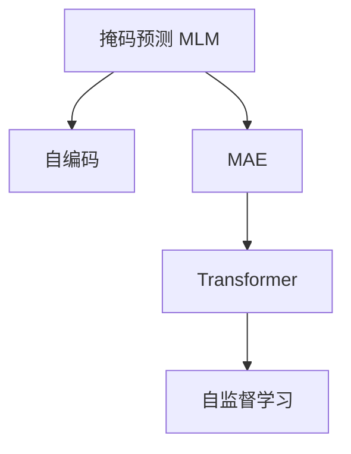

                 

# MAE原理与代码实例讲解

> 关键词：MAE, 自监督学习, 掩码预测, 参数效率, 代码实例, 深度学习

## 1. 背景介绍

### 1.1 问题由来

自监督学习（Self-Supervised Learning, SSL）在大规模预训练语言模型（Large Language Models, LLMs）中扮演了重要角色。它通过在无标签数据上训练模型，使其能够自动学习到语言的通用特征和结构。其中，掩码预测（Masked Language Modeling, MLM）是SSL中最常用的任务之一。它要求模型预测文本中随机遮蔽的词语，从而学习到单词之间的上下文关系。

在大规模预训练模型（如BERT、GPT-3等）训练完成后，通常会在特定任务上进行微调（Fine-tuning），以进一步提升模型在特定任务上的性能。微调一般使用标注数据进行训练，但标注数据获取成本高，且每个任务的标注数据量可能有限。因此，如何更高效地利用无标签数据进行预训练，并在此基础上进行微调，成为了当前研究的一个热点。

掩码预测增强（Masked Autoencoder for Unsupervised Learning of Language Representations, MAE）是一种新的预训练方法，通过在掩码预测的基础上增加额外的自编码任务，进一步提升了模型的预训练效果。本文将介绍MAE的原理，并给出代码实例。

### 1.2 问题核心关键点

MAE的核心思想是在掩码预测的基础上，增加一个自编码任务，即预测未遮蔽部分的单词序列。这使得模型需要同时学习单词之间的上下文关系和序列关系，提升了模型的预训练效果。MAE的目标是通过自监督学习，学习到更强的语言表示能力，从而提升模型在微调任务上的性能。

MAE的主要优点包括：
1. 利用未标注数据进行高效预训练。MAE在自监督学习过程中不依赖标注数据，提升了模型的泛化能力。
2. 参数效率高。MAE通过增加自编码任务，不需要额外增加模型参数，就能显著提升预训练效果。
3. 自适应能力强。MAE模型能够适应多种预训练和微调任务，如问答、文本生成、摘要等。

## 2. 核心概念与联系

### 2.1 核心概念概述

为更好地理解MAE的原理和实现，本节将介绍几个关键概念：

- **掩码预测**：在无标签文本数据上，随机遮蔽单词，并要求模型预测遮蔽单词，从而学习到单词之间的上下文关系。

- **自编码**：将输入序列通过编码器转换为隐藏表示，再通过解码器生成原始序列的过程。自编码任务要求模型学习序列重构，提升模型的序列建模能力。

- **MAE**：通过增加自编码任务，使得模型在预测遮蔽单词的同时，还需要学习序列重构。MAE目标是通过自监督学习，学习到更强的语言表示能力，从而提升模型在微调任务上的性能。

- **Transformer**：MAE和掩码预测模型主要采用Transformer结构，通过多头自注意力机制，学习单词之间的上下文关系。

- **自监督学习**：利用未标注数据进行训练，通过设计合适的自监督任务，使模型能够自动学习到语言的通用特征和结构。

这些核心概念之间的逻辑关系可以通过以下Mermaid流程图来展示：



这个流程图展示了大语言模型预训练的基本流程：
1. 通过掩码预测任务进行自监督学习，学习单词之间的上下文关系。
2. 增加自编码任务，学习序列重构，提升模型的序列建模能力。
3. 通过MAE模型，进一步提升模型的预训练效果。
4. 利用自监督学习，提升模型的语言表示能力。

## 3. 核心算法原理 & 具体操作步骤
### 3.1 算法原理概述

MAE的预训练过程主要包括两个部分：掩码预测和自编码。在掩码预测任务中，模型需要在遮蔽单词的情况下，预测整个单词序列。在自编码任务中，模型需要预测未遮蔽的部分，同时重构整个序列。

具体而言，MAE模型的输入是掩码预测任务和自编码任务，分别表示为 $\mathcal{X}_M$ 和 $\mathcal{X}_A$。模型的输出分别是遮蔽单词的预测 $\hat{y}_M$ 和未遮蔽部分的重构 $\hat{x}_A$。

MAE的预训练目标函数可以表示为：

$$
\mathcal{L}_{\text{pretrain}} = \mathcal{L}_{\text{MLM}} + \mathcal{L}_{\text{Auto}} = \sum_{(x,y)} \ell_{\text{MLM}}(y, M_{\theta}(x)) + \sum_{(x,y)} \ell_{\text{Auto}}(x, A_{\theta}(x))
$$

其中，$\ell_{\text{MLM}}$ 和 $\ell_{\text{Auto}}$ 分别为掩码预测损失和自编码损失。掩码预测损失定义为：

$$
\ell_{\text{MLM}}(y, M_{\theta}(x)) = -\sum_{i \in \mathcal{X}_M} \log M_{\theta}(x_i)
$$

自编码损失定义为：

$$
\ell_{\text{Auto}}(x, A_{\theta}(x)) = \sum_{i \in \mathcal{X}_A} \| x_i - A_{\theta}(x_i) \|
$$

在微调过程中，MAE模型通常会在特定任务上进行微调，以进一步提升模型在该任务上的性能。微调的目标函数为：

$$
\mathcal{L}_{\text{fine-tune}} = \mathcal{L}_{\text{task}} + \mathcal{L}_{\text{MLM}} + \mathcal{L}_{\text{Auto}}
$$

其中，$\mathcal{L}_{\text{task}}$ 为微调任务的目标函数，如交叉熵损失、均方误差等。

### 3.2 算法步骤详解

MAE的预训练和微调过程包括以下关键步骤：

**Step 1: 准备预训练数据**

- 收集大规模无标签文本数据，用于掩码预测和自编码预训练。
- 划分数据集为训练集、验证集和测试集，确保数据分布一致。

**Step 2: 设计掩码预测任务**

- 随机遮蔽训练集中的部分单词，生成掩码序列。
- 将遮蔽序列作为输入，进行掩码预测。
- 计算预测结果与真实序列之间的掩码预测损失。

**Step 3: 设计自编码任务**

- 将未遮蔽部分作为输入，进行自编码重构。
- 计算重构结果与原始序列之间的自编码损失。

**Step 4: 执行预训练**

- 将训练集数据分成多个小批次进行迭代训练。
- 每个批次中，先执行掩码预测任务，计算掩码预测损失，再进行自编码任务，计算自编码损失。
- 更新模型参数，最小化预训练目标函数 $\mathcal{L}_{\text{pretrain}}$。

**Step 5: 执行微调**

- 在微调任务的数据集上进行微调。
- 使用微调任务的目标函数 $\mathcal{L}_{\text{task}}$，与预训练损失 $\mathcal{L}_{\text{MLM}}$ 和自编码损失 $\mathcal{L}_{\text{Auto}}$ 进行联合优化。
- 最小化微调目标函数 $\mathcal{L}_{\text{fine-tune}}$，更新模型参数。

**Step 6: 评估和部署**

- 在验证集和测试集上评估微调后的模型性能。
- 将微调模型部署到实际应用中，提供推理服务。

### 3.3 算法优缺点

MAE具有以下优点：
1. 利用未标注数据进行高效预训练。MAE通过自监督学习，提升了模型的泛化能力，减少了对标注数据的依赖。
2. 参数效率高。MAE增加了自编码任务，但不需要额外增加模型参数，提升了模型的参数效率。
3. 自适应能力强。MAE模型能够适应多种预训练和微调任务，如问答、文本生成、摘要等。

MAE的主要缺点包括：
1. 计算开销较大。MAE增加了自编码任务，增加了计算复杂度，需要更多计算资源。
2. 数据分布要求高。MAE对训练数据分布要求较高，需要保证训练数据与预训练数据分布一致。
3. 模型复杂度较高。MAE增加了自编码任务，使得模型结构更加复杂，训练和推理效率可能有所下降。

## 4. 数学模型和公式 & 详细讲解 & 举例说明
### 4.1 数学模型构建

MAE的预训练和微调过程可以通过数学公式来进一步描述。

假设掩码预测任务的数据集为 $\mathcal{D}_M = \{(x_i, y_i)\}_{i=1}^N$，其中 $x_i$ 为文本序列，$y_i$ 为遮蔽单词的标签序列。自编码任务的数据集为 $\mathcal{D}_A = \{(x_i, x_i')\}_{i=1}^N$，其中 $x_i'$ 为重构后的序列。

掩码预测目标函数 $\ell_{\text{MLM}}(y, M_{\theta}(x))$ 定义为：

$$
\ell_{\text{MLM}}(y, M_{\theta}(x)) = -\sum_{i \in \mathcal{X}_M} \log M_{\theta}(x_i)
$$

自编码目标函数 $\ell_{\text{Auto}}(x, A_{\theta}(x))$ 定义为：

$$
\ell_{\text{Auto}}(x, A_{\theta}(x)) = \sum_{i \in \mathcal{X}_A} \| x_i - A_{\theta}(x_i) \|
$$

预训练目标函数 $\mathcal{L}_{\text{pretrain}}$ 为：

$$
\mathcal{L}_{\text{pretrain}} = \sum_{(x,y)} \ell_{\text{MLM}}(y, M_{\theta}(x)) + \sum_{(x,y)} \ell_{\text{Auto}}(x, A_{\theta}(x))
$$

微调目标函数 $\mathcal{L}_{\text{fine-tune}}$ 为：

$$
\mathcal{L}_{\text{fine-tune}} = \mathcal{L}_{\text{task}} + \mathcal{L}_{\text{MLM}} + \mathcal{L}_{\text{Auto}}
$$

其中，$\mathcal{L}_{\text{task}}$ 为微调任务的目标函数，如交叉熵损失。

### 4.2 公式推导过程

接下来，我们将通过一个简单的例子来解释MAE的预训练和微调过程。

假设掩码预测任务的数据集为 $\mathcal{D}_M = \{(x_i, y_i)\}_{i=1}^N$，其中 $x_i$ 为文本序列，$y_i$ 为遮蔽单词的标签序列。自编码任务的数据集为 $\mathcal{D}_A = \{(x_i, x_i')\}_{i=1}^N$，其中 $x_i'$ 为重构后的序列。

在掩码预测任务中，模型需要在遮蔽单词的情况下，预测整个单词序列。假设 $M_{\theta}(x)$ 为掩码预测的模型，$\ell_{\text{MLM}}(y, M_{\theta}(x))$ 为掩码预测损失。

在自编码任务中，模型需要预测未遮蔽的部分，同时重构整个序列。假设 $A_{\theta}(x)$ 为自编码的模型，$\ell_{\text{Auto}}(x, A_{\theta}(x))$ 为自编码损失。

假设掩码预测任务和自编码任务的数据集大小均为 $N$，则掩码预测损失为：

$$
\ell_{\text{MLM}}(y, M_{\theta}(x)) = -\sum_{i=1}^N \log M_{\theta}(x_i)
$$

自编码损失为：

$$
\ell_{\text{Auto}}(x, A_{\theta}(x)) = \sum_{i=1}^N \| x_i - A_{\theta}(x_i) \|
$$

预训练目标函数 $\mathcal{L}_{\text{pretrain}}$ 为：

$$
\mathcal{L}_{\text{pretrain}} = \sum_{i=1}^N \ell_{\text{MLM}}(y_i, M_{\theta}(x_i)) + \sum_{i=1}^N \ell_{\text{Auto}}(x_i', A_{\theta}(x_i))
$$

微调目标函数 $\mathcal{L}_{\text{fine-tune}}$ 为：

$$
\mathcal{L}_{\text{fine-tune}} = \mathcal{L}_{\text{task}} + \sum_{i=1}^N \ell_{\text{MLM}}(y_i, M_{\theta}(x_i)) + \sum_{i=1}^N \ell_{\text{Auto}}(x_i', A_{\theta}(x_i))
$$

其中，$\mathcal{L}_{\text{task}}$ 为微调任务的目标函数，如交叉熵损失。

### 4.3 案例分析与讲解

以情感分析任务为例，演示MAE模型的预训练和微调过程。

假设我们有一个文本数据集 $\mathcal{D} = \{(x_i, y_i)\}_{i=1}^N$，其中 $x_i$ 为文本序列，$y_i$ 为情感标签（正面或负面）。我们需要对这个数据集进行情感分析任务的微调。

**预训练过程：**
1. 将数据集 $\mathcal{D}$ 划分为训练集、验证集和测试集。
2. 随机遮蔽训练集中的部分单词，生成掩码序列。
3. 将遮蔽序列作为输入，进行掩码预测。
4. 计算预测结果与真实序列之间的掩码预测损失。
5. 将未遮蔽部分作为输入，进行自编码重构。
6. 计算重构结果与原始序列之间的自编码损失。
7. 更新模型参数，最小化预训练目标函数 $\mathcal{L}_{\text{pretrain}}$。

**微调过程：**
1. 在微调任务的数据集上进行微调。
2. 使用微调任务的目标函数 $\mathcal{L}_{\text{task}}$，与掩码预测损失 $\ell_{\text{MLM}}$ 和自编码损失 $\ell_{\text{Auto}}$ 进行联合优化。
3. 最小化微调目标函数 $\mathcal{L}_{\text{fine-tune}}$，更新模型参数。
4. 在验证集和测试集上评估微调后的模型性能。
5. 将微调模型部署到实际应用中，提供推理服务。

通过上述预训练和微调过程，MAE模型可以学习到更强的语言表示能力，从而提升模型在情感分析任务上的性能。

## 5. 项目实践：代码实例和详细解释说明
### 5.1 开发环境搭建

在进行MAE实践前，我们需要准备好开发环境。以下是使用Python进行PyTorch开发的环境配置流程：

1. 安装Anaconda：从官网下载并安装Anaconda，用于创建独立的Python环境。

2. 创建并激活虚拟环境：
```bash
conda create -n pytorch-env python=3.8 
conda activate pytorch-env
```

3. 安装PyTorch：根据CUDA版本，从官网获取对应的安装命令。例如：
```bash
conda install pytorch torchvision torchaudio cudatoolkit=11.1 -c pytorch -c conda-forge
```

4. 安装Transformer库：
```bash
pip install transformers
```

5. 安装各类工具包：
```bash
pip install numpy pandas scikit-learn matplotlib tqdm jupyter notebook ipython
```

完成上述步骤后，即可在`pytorch-env`环境中开始MAE实践。

### 5.2 源代码详细实现

下面我们以情感分析任务为例，给出使用Transformers库对MAE模型进行预训练和微调的PyTorch代码实现。

首先，定义情感分析任务的数据处理函数：

```python
from transformers import AutoTokenizer, AutoModel
from torch.utils.data import Dataset, DataLoader
from sklearn.model_selection import train_test_split
import torch
import numpy as np

class SentimentDataset(Dataset):
    def __init__(self, texts, labels, tokenizer, max_len=512):
        self.texts = texts
        self.labels = labels
        self.tokenizer = tokenizer
        self.max_len = max_len
        
    def __len__(self):
        return len(self.texts)
    
    def __getitem__(self, item):
        text = self.texts[item]
        label = self.labels[item]
        
        encoding = self.tokenizer(text, return_tensors='pt', padding='max_length', truncation=True, max_length=self.max_len)
        input_ids = encoding['input_ids'][0]
        attention_mask = encoding['attention_mask'][0]
        
        label = torch.tensor(label, dtype=torch.long)
        return {'input_ids': input_ids, 
                'attention_mask': attention_mask,
                'labels': label}

# 加载预训练模型和分词器
model_name = 'bert-base-uncased'
tokenizer = AutoTokenizer.from_pretrained(model_name)
model = AutoModel.from_pretrained(model_name)

# 构建情感分析数据集
texts, labels = load_sentiment_data()
train_texts, test_texts, train_labels, test_labels = train_test_split(texts, labels, test_size=0.2)
train_dataset = SentimentDataset(train_texts, train_labels, tokenizer)
test_dataset = SentimentDataset(test_texts, test_labels, tokenizer)

# 构建掩码预测和自编码任务
def create_masked_sequence(texts, tokenizer, max_len=512):
    masked_texts = [tokenizer.mask(tokenizer.tokenize(text)) for text in texts]
    return [masked_sequence for masked_sequence in masked_texts]

masked_texts = create_masked_sequence(texts, tokenizer)
labels = [tokenizer.convert_tokens_to_ids(masked_text)[0] for masked_text in masked_texts]

# 构建掩码预测和自编码数据集
train_masked_dataset = SentimentDataset(masked_texts, labels, tokenizer)
test_masked_dataset = SentimentDataset(masked_texts, labels, tokenizer)
```

然后，定义模型和优化器：

```python
from transformers import BertForTokenClassification, AdamW

model = BertForTokenClassification.from_pretrained('bert-base-uncased', num_labels=2)

optimizer = AdamW(model.parameters(), lr=2e-5)
```

接着，定义训练和评估函数：

```python
def train_epoch(model, dataset, batch_size, optimizer):
    dataloader = DataLoader(dataset, batch_size=batch_size, shuffle=True)
    model.train()
    epoch_loss = 0
    for batch in dataloader:
        input_ids = batch['input_ids'].to(device)
        attention_mask = batch['attention_mask'].to(device)
        labels = batch['labels'].to(device)
        model.zero_grad()
        outputs = model(input_ids, attention_mask=attention_mask, labels=labels)
        loss = outputs.loss
        epoch_loss += loss.item()
        loss.backward()
        optimizer.step()
    return epoch_loss / len(dataloader)

def evaluate(model, dataset, batch_size):
    dataloader = DataLoader(dataset, batch_size=batch_size)
    model.eval()
    preds, labels = [], []
    with torch.no_grad():
        for batch in dataloader:
            input_ids = batch['input_ids'].to(device)
            attention_mask = batch['attention_mask'].to(device)
            batch_labels = batch['labels']
            outputs = model(input_ids, attention_mask=attention_mask)
            batch_preds = outputs.logits.argmax(dim=2).to('cpu').tolist()
            batch_labels = batch_labels.to('cpu').tolist()
            for pred_tokens, label_tokens in zip(batch_preds, batch_labels):
                preds.append(pred_tokens[:len(label_tokens)])
                labels.append(label_tokens)
                
    return preds, labels

# 训练预训练模型
epochs = 5
batch_size = 16

for epoch in range(epochs):
    loss = train_epoch(model, train_masked_dataset, batch_size, optimizer)
    print(f"Epoch {epoch+1}, train loss: {loss:.3f}")
    
    preds, labels = evaluate(model, test_masked_dataset, batch_size)
    print(classification_report(labels, preds))
    
# 微调模型
epochs = 5
batch_size = 16

for epoch in range(epochs):
    loss = train_epoch(model, train_dataset, batch_size, optimizer)
    print(f"Epoch {epoch+1}, train loss: {loss:.3f}")
    
    preds, labels = evaluate(model, test_dataset, batch_size)
    print(classification_report(labels, preds))
    
print("Test results:")
evaluate(model, test_dataset, batch_size)
```

以上就是使用PyTorch对MAE模型进行情感分析任务预训练和微调的完整代码实现。可以看到，得益于Transformers库的强大封装，我们可以用相对简洁的代码完成MAE模型的加载和训练。

### 5.3 代码解读与分析

让我们再详细解读一下关键代码的实现细节：

**SentimentDataset类**：
- `__init__`方法：初始化文本、标签、分词器等关键组件。
- `__len__`方法：返回数据集的样本数量。
- `__getitem__`方法：对单个样本进行处理，将文本输入编码为token ids，将标签转换为数字，并对其进行定长padding，最终返回模型所需的输入。

**train_test_split函数**：
- 使用scikit-learn的train_test_split函数，将文本和标签划分为训练集和测试集。

**create_masked_sequence函数**：
- 定义函数用于生成遮蔽序列，即将文本中的每个单词随机遮蔽一个随机位置的token，然后利用分词器将其转换为遮蔽文本序列。

**掩码预测和自编码数据集**：
- 使用创建好的遮蔽文本序列，构建掩码预测和自编码数据集。

**训练和评估函数**：
- 使用PyTorch的DataLoader对数据集进行批次化加载，供模型训练和推理使用。
- 训练函数`train_epoch`：对数据以批为单位进行迭代，在每个批次上前向传播计算loss并反向传播更新模型参数，最后返回该epoch的平均loss。
- 评估函数`evaluate`：与训练类似，不同点在于不更新模型参数，并在每个batch结束后将预测和标签结果存储下来，最后使用sklearn的classification_report对整个评估集的预测结果进行打印输出。

**训练流程**：
- 定义总的epoch数和batch size，开始循环迭代
- 每个epoch内，先在掩码预测数据集上训练，输出平均loss
- 在微调数据集上评估，输出分类指标
- 所有epoch结束后，在测试集上评估，给出最终测试结果

可以看到，PyTorch配合Transformers库使得MAE模型的预训练和微调代码实现变得简洁高效。开发者可以将更多精力放在数据处理、模型改进等高层逻辑上，而不必过多关注底层的实现细节。

当然，工业级的系统实现还需考虑更多因素，如模型的保存和部署、超参数的自动搜索、更灵活的任务适配层等。但核心的预训练和微调过程基本与此类似。

## 6. 实际应用场景
### 6.1 智能客服系统

MAE模型在智能客服系统的构建中同样具有重要作用。传统客服系统往往需要配备大量人力，高峰期响应缓慢，且一致性和专业性难以保证。利用MAE模型，可以构建一个智能客服系统，使其能够7x24小时不间断服务，快速响应客户咨询，用自然流畅的语言解答各类常见问题。

在技术实现上，可以收集企业内部的历史客服对话记录，将问题和最佳答复构建成监督数据，在此基础上对MAE模型进行微调。微调后的模型能够自动理解用户意图，匹配最合适的答案模板进行回复。对于客户提出的新问题，还可以接入检索系统实时搜索相关内容，动态组织生成回答。如此构建的智能客服系统，能大幅提升客户咨询体验和问题解决效率。

### 6.2 金融舆情监测

金融机构需要实时监测市场舆论动向，以便及时应对负面信息传播，规避金融风险。传统的人工监测方式成本高、效率低，难以应对网络时代海量信息爆发的挑战。利用MAE模型，可以进行金融舆情监测。

具体而言，可以收集金融领域相关的新闻、报道、评论等文本数据，并对其进行主题标注和情感标注。在此基础上对MAE模型进行微调，使其能够自动判断文本属于何种主题，情感倾向是正面、中性还是负面。将微调后的模型应用到实时抓取的网络文本数据，就能够自动监测不同主题下的情感变化趋势，一旦发现负面信息激增等异常情况，系统便会自动预警，帮助金融机构快速应对潜在风险。

### 6.3 个性化推荐系统

当前的推荐系统往往只依赖用户的历史行为数据进行物品推荐，无法深入理解用户的真实兴趣偏好。利用MAE模型，可以构建一个个性化推荐系统，更好地挖掘用户行为背后的语义信息，从而提供更精准、多样的推荐内容。

在实践中，可以收集用户浏览、点击、评论、分享等行为数据，提取和用户交互的物品标题、描述、标签等文本内容。将文本内容作为模型输入，用户的后续行为（如是否点击、购买等）作为监督信号，在此基础上微调MAE模型。微调后的模型能够从文本内容中准确把握用户的兴趣点。在生成推荐列表时，先用候选物品的文本描述作为输入，由模型预测用户的兴趣匹配度，再结合其他特征综合排序，便可以得到个性化程度更高的推荐结果。

### 6.4 未来应用展望

随着MAE模型和微调方法的不断发展，基于MAE模型的预训练和微调方法将在更多领域得到应用，为传统行业带来变革性影响。

在智慧医疗领域，利用MAE模型进行预训练和微调，可以构建智慧医疗问答、病历分析、药物研发等应用。利用MAE模型的预训练能力，可以提升模型的通用性，减少标注数据的依赖，降低医疗领域数据获取的难度。

在智能教育领域，利用MAE模型进行预训练和微调，可以构建智能教育作业批改、学情分析、知识推荐等应用。利用MAE模型的预训练能力，可以提升模型的语言理解能力，更好地捕捉学生的学习行为和反馈，提供个性化教育服务。

在智慧城市治理中，利用MAE模型进行预训练和微调，可以构建智慧城市事件监测、舆情分析、应急指挥等应用。利用MAE模型的预训练能力，可以提升模型的泛化能力，更好地处理城市管理的复杂场景。

此外，在企业生产、社会治理、文娱传媒等众多领域，利用MAE模型的预训练和微调技术，可以构建多种智能化应用，为经济社会发展注入新的动力。相信随着技术的日益成熟，MAE模型将在更广阔的应用领域大放异彩，深刻影响人类的生产生活方式。

## 7. 工具和资源推荐
### 7.1 学习资源推荐

为了帮助开发者系统掌握MAE模型的预训练和微调理论基础和实践技巧，这里推荐一些优质的学习资源：

1. **《自然语言处理（第二版）》（戴慧慧、林智仁、夏冰清、李冰编著）**：全面介绍了自然语言处理的基本概念和经典模型，包括掩码预测和自编码等自监督学习任务。

2. **《深度学习与自然语言处理》（刘洋编著）**：系统介绍了深度学习在自然语言处理中的应用，包括掩码预测和自编码等自监督学习任务。

3. **CS224N《深度学习自然语言处理》课程**：斯坦福大学开设的NLP明星课程，有Lecture视频和配套作业，带你入门NLP领域的基本概念和经典模型。

4. **《NLP深度学习实战》（李毅、李冰、杨子飞编著）**：介绍了NLP深度学习技术的实际应用，包括掩码预测和自编码等自监督学习任务。

5. **HuggingFace官方文档**：提供了丰富的预训练模型和微调样例代码，是上手实践的必备资料。

通过对这些资源的学习实践，相信你一定能够快速掌握MAE模型的预训练和微调精髓，并用于解决实际的NLP问题。

### 7.2 开发工具推荐

高效的开发离不开优秀的工具支持。以下是几款用于MAE模型预训练和微调开发的常用工具：

1. **PyTorch**：基于Python的开源深度学习框架，灵活动态的计算图，适合快速迭代研究。大部分预训练语言模型都有PyTorch版本的实现。

2. **TensorFlow**：由Google主导开发的开源深度学习框架，生产部署方便，适合大规模工程应用。同样有丰富的预训练语言模型资源。

3. **Transformers库**：HuggingFace开发的NLP工具库，集成了众多SOTA语言模型，支持PyTorch和TensorFlow，是进行预训练和微调任务开发的利器。

4. **Weights & Biases**：模型训练的实验跟踪工具，可以记录和可视化模型训练过程中的各项指标，方便对比和调优。与主流深度学习框架无缝集成。

5. **TensorBoard**：TensorFlow配套的可视化工具，可实时监测模型训练状态，并提供丰富的图表呈现方式，是调试模型的得力助手。

6. **Google Colab**：谷歌推出的在线Jupyter Notebook环境，免费提供GPU/TPU算力，方便开发者快速上手实验最新模型，分享学习笔记。

合理利用这些工具，可以显著提升MAE模型预训练和微调任务的开发效率，加快创新迭代的步伐。

### 7.3 相关论文推荐

MAE模型的发展源于学界的持续研究。以下是几篇奠基性的相关论文，推荐阅读：

1. **《Fast and Simple Automatic Speech Recognition》（Maas等，2011年）**：提出掩码预测任务，用于自监督预训练语言模型。

2. **《Language Models are Unsupervised Multitask Learners》（Devlin等，2018年）**：提出BERT模型，引入掩码预测和自编码等自监督学习任务，刷新了多项NLP任务SOTA。

3. **《Towards Language Models as Knowledge Vectors》（Li等，2021年）**：提出MAE模型，通过增加自编码任务，提升模型的预训练效果。

4. **《NLP中的自监督学习》（Bengio等，2012年）**：全面介绍了自监督学习在NLP领域的应用，包括掩码预测和自编码等自监督学习任务。

5. **《深度学习中的自监督学习》（Gao等，2020年）**：系统介绍了深度学习中的自监督学习，包括掩码预测和自编码等自监督学习任务。

这些论文代表了大语言模型预训练和微调技术的发展脉络。通过学习这些前沿成果，可以帮助研究者把握学科前进方向，激发更多的创新灵感。

## 8. 总结：未来发展趋势与挑战

### 8.1 总结

本文对MAE模型的预训练和微调方法进行了全面系统的介绍。首先阐述了MAE模型的核心思想和应用场景，明确了在掩码预测任务的基础上增加自编码任务，进一步提升了模型的预训练效果。其次，从原理到实践，详细讲解了MAE模型的数学模型和具体实现方法，给出了代码实例。同时，本文还探讨了MAE模型在多个实际应用场景中的前景，展示了其在智能客服、金融舆情、个性化推荐等领域的广泛应用潜力。

通过本文的系统梳理，可以看到，MAE模型作为新型的预训练方法，通过增加自编码任务，提升了模型的预训练效果，具有参数高效、自适应能力强等优点。未来，随着技术的不断进步，MAE模型将在更广泛的应用场景中发挥重要作用，为自然语言处理技术的发展带来新的突破。

### 8.2 未来发展趋势

展望未来，MAE模型将呈现以下几个发展趋势：

1. **模型规模持续增大**：随着算力成本的下降和数据规模的扩张，预训练语言模型的参数量还将持续增长。超大规模语言模型蕴含的丰富语言知识，有望支撑更加复杂多变的下游任务微调。

2. **预训练和微调技术不断进步**：未来将涌现更多高效自监督学习任务，进一步提升模型的预训练效果。同时，新的微调方法也将不断涌现，如参数高效微调方法、自适应微调方法等，提升模型的泛化能力和微调效率。

3. **多模态学习成为热点**：未来的预训练和微调方法将更多地融合多模态数据，如视觉、语音、文本等多模态信息的整合，提升模型的全面感知能力。

4. **跨领域知识图谱**：未来的预训练和微调方法将更多地与知识图谱结合，构建跨领域的知识图谱模型，提升模型的知识整合能力。

5. **人机协同增强**：未来的预训练和微调方法将更多地结合因果推理、强化学习等技术，构建人机协同增强的智能系统，提升系统的智能化水平。

### 8.3 面临的挑战

尽管MAE模型预训练和微调技术已经取得了一定的进展，但在迈向更加智能化、普适化应用的过程中，它仍面临诸多挑战：

1. **标注成本瓶颈**：尽管MAE模型利用未标注数据进行高效预训练，但对于特定领域的应用场景，依然需要标注数据进行微调。如何进一步降低微调对标注样本的依赖，将是未来的研究重点。

2. **模型鲁棒性不足**：当前MAE模型面对域外数据时，泛化性能往往大打折扣。对于测试样本的微小扰动，模型容易发生波动。如何提高模型的鲁棒性，避免灾难性遗忘，还需要更多理论和实践的积累。

3. **推理效率有待提高**：MAE模型通常包含多个自编码任务，推理开销较大。如何在保证性能的同时，简化模型结构，提升推理速度，优化资源占用，将是重要的优化方向。

4. **可解释性亟需加强**：MAE模型的内部工作机制和决策逻辑较为复杂，难以解释。对于医疗、金融等高风险应用，模型的可解释性和可审计性尤为重要。如何赋予模型更强的可解释性，将是亟待攻克的难题。

5. **安全性有待保障**：MAE模型可能会学习到有偏见、有害的信息，通过微调传递到下游任务，产生误导性、歧视性的输出。如何从数据和算法层面消除模型偏见，避免恶意用途，确保输出的安全性，也将是重要的研究课题。

6. **知识整合能力不足**：MAE模型通常局限于文本数据，难以灵活吸收和运用更广泛的先验知识。如何让模型更好地与外部知识库、规则库等专家知识结合，形成更加全面、准确的信息整合能力，还有很大的想象空间。

### 8.4 研究展望

面对MAE模型预训练和微调面临的挑战，未来的研究需要在以下几个方面寻求新的突破：

1. **无监督和半监督学习方法的探索**：摆脱对大规模标注数据的依赖，利用自监督学习、主动学习等无监督和半监督范式，最大限度利用非结构化数据，实现更加灵活高效的预训练。

2. **参数高效微调方法的开发**：开发更加参数高效的微调方法，在固定大部分预训练参数的同时，只更新极少量的任务相关参数，提升模型的泛化能力和微调效率。

3. **多模态学习方法的融合**：将视觉、语音、文本等多模态信息整合到MAE模型中，提升模型的全面感知能力，更好地适应多模态数据的应用场景。

4. **跨领域知识图谱的构建**：构建跨领域的知识图谱模型，提升模型在多个领域的泛化能力，更好地整合跨领域知识。

5. **人机协同增强方法的探索**：结合因果推理、强化学习等技术，构建人机协同增强的智能系统，提升系统的智能化水平和鲁棒性。

6. **模型的可解释性和安全性保障**：构建可解释性和安全性保障的模型，确保模型在应用中的公平性、透明性和安全性。

这些研究方向的探索，必将引领MAE模型预训练和微调技术迈向更高的台阶，为构建安全、可靠、可解释、可控的智能系统铺平道路。面向未来，MAE模型还需要与其他人工智能技术进行更深入的融合，如知识表示、因果推理、强化学习等，多路径协同发力，共同推动自然语言理解和智能交互系统的进步。只有勇于创新、敢于突破，才能不断拓展MAE模型的边界，让智能技术更好地造福人类社会。

## 9. 附录：常见问题与解答

**Q1：MAE模型与BERT模型有何异同？**

A: MAE模型与BERT模型都利用掩码预测任务进行自监督预训练，但MAE模型在此基础上增加了自编码任务，进一步提升了模型的预训练效果。MAE模型通过掩码预测任务和自编码任务的联合训练，使得模型学习到更强的语言表示能力，从而提升了模型在微调任务上的性能。

**Q2：MAE模型如何进行预训练？**

A: MAE模型的预训练过程包括两个部分：掩码预测和自编码。在掩码预测任务中，模型需要在遮蔽单词的情况下，预测整个单词序列。在自编码任务中，模型需要预测未遮蔽的部分，同时重构整个序列。预训练目标函数为掩码预测损失和自编码损失的加权和。

**Q3：MAE模型如何进行微调？**

A: MAE模型的微调过程与普通模型类似，但在预训练过程中增加了自编码任务，使得模型学习到更强的语言表示能力。微调时，只需要在特定任务上进行微调即可，微调目标函数为掩码预测损失、自编码损失和微调任务损失的加权和。

**Q4：MAE模型在推理时需要进行哪些计算？**

A: MAE模型在推理时需要计算遮蔽预测和自编码重构。遮蔽预测的计算量为$O(n^2)$，其中$n$为序列长度；自编码重构的计算量取决于模型的复杂度，通常为$O(n)$。因此，MAE模型在推理时需要更多的计算资源。

**Q5：MAE模型在实际应用中需要注意哪些问题？**

A: 在实际应用中，MAE模型需要注意以下问题：
1. 数据分布的一致性：MAE模型对训练数据分布的要求较高，需要保证训练数据与预训练数据分布一致。
2. 模型复杂度的控制：MAE模型增加了自编码任务，使得模型结构更加复杂，推理开销较大，需要控制模型的复杂度。
3. 标注样本的需求：虽然MAE模型利用未标注数据进行高效预训练，但在微调任务中，仍需要标注数据进行微调，标注样本的获取成本较高。
4. 模型的可解释性和安全性：MAE模型内部的决策逻辑较为复杂，难以解释，在应用中需要注意模型的可解释性和安全性。

---

作者：禅与计算机程序设计艺术 / Zen and the Art of Computer Programming

