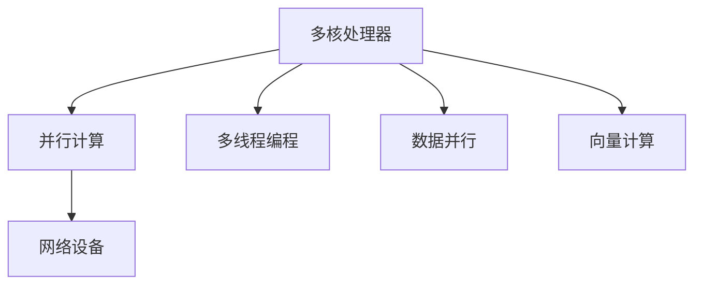

                 

# MIPS多核编程：并行计算在网络设备中的应用

> 关键词：MIPS, 多核编程, 并行计算, 网络设备, 高性能计算, 多线程, 向量计算

## 1. 背景介绍

### 1.1 问题由来
随着互联网数据量的爆炸性增长，网络设备如路由器、交换机等在处理海量数据时面临巨大的计算压力。传统的网络设备多采用单核处理器的CPU，由于单个CPU计算能力有限，只能通过串行计算的方式处理数据包，导致设备处理速度慢、时延大、能耗高。为了提升网络设备的性能，多核编程和并行计算成为关键技术突破点。

### 1.2 问题核心关键点
MIPS多核编程是一种通过并行计算加速网络设备处理任务的方法，其核心在于将任务分解为多个子任务，由多个CPU核心并行计算完成。这不仅能有效提升网络设备的处理速度，还能显著降低时延和能耗。MIPS多核编程需要在硬件和软件两个层面进行优化，硬件层面主要包括多核架构设计、数据流管理等，软件层面则涉及多线程调度、数据并行计算、向量计算等技术的应用。

### 1.3 问题研究意义
MIPS多核编程技术能够显著提升网络设备的计算性能，降低处理时延和能耗，为网络应用提供更加高效、稳定、安全的服务。研究MIPS多核编程技术，对于提升网络设备的性能，改善用户体验，推动网络技术的进步，具有重要意义：

1. 提高网络设备处理能力：MIPS多核编程能够并行处理数据包，极大地提升网络设备的处理速度。
2. 降低网络设备时延：通过并行计算，网络设备能够在更短的时间内处理数据，从而降低时延。
3. 降低能耗：并行计算能够有效利用多核处理器的性能，降低单核CPU的高能耗，提升设备能效比。
4. 提供稳定服务：MIPS多核编程能够实现高效的负载均衡，提升设备在突发流量下的稳定性和可靠性。
5. 加速网络应用创新：高性能计算能力为网络应用提供了更强的支撑，推动了网络应用的创新与发展。

## 2. 核心概念与联系

### 2.1 核心概念概述

为了更好地理解MIPS多核编程技术，本节将介绍几个密切相关的核心概念：

- MIPS（Million Instruction Per Second）：每秒钟执行的指令数量，是衡量处理器性能的重要指标。
- 多核处理器（Multicore Processor）：在一个物理处理器上集成多个CPU核心，每个核心可以独立执行计算任务。
- 并行计算（Parallel Computing）：通过多个处理器核心同时计算，加速任务处理速度。
- 多线程编程（Multithreading）：在同一时间执行多个线程，每个线程执行独立的计算任务。
- 数据并行（Data Parallelism）：将数据划分为多个子集，由多个线程或处理器核心并行计算。
- 向量计算（Vector Computing）：通过向量化计算，提升数据处理效率。
- 网络设备（Network Equipment）：如路由器、交换机等，需要处理海量数据，对计算性能要求高。

这些概念之间的逻辑关系可以通过以下Mermaid流程图来展示：



这个流程图展示了大语言模型的核心概念及其之间的关系：

1. 多核处理器提供计算能力。
2. 并行计算通过多个处理器核心同时计算，加速任务处理速度。
3. 多线程编程在同一时间执行多个线程，提升计算效率。
4. 数据并行将数据划分为多个子集，由多个线程或处理器核心并行计算。
5. 向量计算通过向量化计算，提升数据处理效率。
6. 网络设备利用这些并行计算能力，处理海量数据，提升设备性能。

## 3. 核心算法原理 & 具体操作步骤
### 3.1 算法原理概述

MIPS多核编程的原理是将任务分解为多个子任务，每个子任务由不同的CPU核心并行计算，最终将计算结果汇总得到整体结果。具体步骤如下：

1. **任务分解**：将任务分解为多个子任务，每个子任务可以独立执行计算。
2. **多核并行计算**：在多核处理器上，将每个子任务分配给不同的CPU核心并行计算。
3. **结果汇总**：将各个核心的计算结果汇总，得到最终结果。

### 3.2 算法步骤详解

以下是MIPS多核编程的具体操作步骤：

**Step 1: 任务分解**
- 分析任务的特点，将其分解为多个子任务。例如，网络设备的路由表查找任务可以分解为多个子任务，每个子任务查找不同的路由表项。

**Step 2: 任务调度**
- 使用操作系统提供的线程调度机制，将子任务分配给不同的线程执行。线程调度机制需要考虑任务的依赖关系和数据一致性。

**Step 3: 数据并行计算**
- 将数据划分为多个子集，每个子集分配给一个线程处理。例如，对于大规模数据集的处理，可以将数据集划分为多个块，并行计算每个块。

**Step 4: 向量计算**
- 对于数值计算密集型任务，可以使用向量计算加速。例如，使用SIMD指令集对数组进行向量计算，提升计算效率。

**Step 5: 结果汇总**
- 汇总各个线程的计算结果，得到最终结果。例如，在路由表查找任务中，将各个线程查找的路由表项进行合并，得到最终路由表。

**Step 6: 结果输出**
- 将计算结果输出到网络设备的数据平面或控制平面，进行后续处理。

### 3.3 算法优缺点

MIPS多核编程具有以下优点：
1. 提升处理速度：通过并行计算，能够显著提升网络设备的处理速度。
2. 降低时延：并行计算能够减少单个任务的计算时间，降低时延。
3. 降低能耗：并行计算能够有效利用多核处理器的性能，降低单核CPU的高能耗。
4. 提高设备性能：多核编程能够提升设备的计算性能，提供更高效的负载均衡。

同时，该方法也存在一些局限性：
1. 设计和实现复杂：多核编程需要优化任务分解和调度策略，设计和实现复杂。
2. 同步和通信开销：多核编程需要处理线程间的同步和通信开销，影响性能。
3. 数据一致性：多核编程需要保证数据的一致性，避免数据竞争和冲突。
4. 硬件限制：多核编程依赖多核处理器的硬件支持，无法在单核处理器上应用。

尽管存在这些局限性，但MIPS多核编程技术在网络设备中已经得到了广泛应用，是提升设备性能的重要手段。

### 3.4 算法应用领域

MIPS多核编程技术在网络设备中的应用领域非常广泛，包括但不限于以下几个方面：

- 路由器：在路由器中使用多核编程加速路由表查找、路径选择等任务，提升数据包转发速度。
- 交换机：在交换机中使用多核编程加速MAC地址表查找、数据帧转发等任务，提升数据包交换速度。
- 防火墙：在防火墙中使用多核编程加速规则匹配、流量过滤等任务，提升安全防护能力。
- 网络负载均衡器：在网络负载均衡器中使用多核编程加速负载分配、流量调度和监控等任务，提升系统效率。
- 网络分析仪：在网络分析仪中使用多核编程加速数据包捕获、分析和统计等任务，提升分析速度和准确性。

## 4. 数学模型和公式 & 详细讲解 & 举例说明

### 4.1 数学模型构建

为了更好地理解MIPS多核编程的计算过程，我们引入数学模型进行描述。设任务A被分解为N个子任务，每个子任务分配给不同的CPU核心计算，每个核心的计算时间为T。任务A的总计算时间为：

$$
T_{total} = N \times T
$$

假设每个子任务可以并行计算，每个核心的计算时间为T_p，则并行计算的总时间为：

$$
T_{parallel} = \frac{T}{N} \times T_p
$$

可见，并行计算可以显著降低任务的总计算时间。

### 4.2 公式推导过程

下面以路由表查找任务为例，推导MIPS多核编程的计算过程。

假设路由表共有N条记录，每次查询需要查找K个路由表项。每个路由表项查找任务需要T_s的时间，每个核心的计算时间为T_p。则单核串行计算的总时间为：

$$
T_{single} = K \times T_s
$$

假设使用M个核心并行计算，则并行计算的总时间为：

$$
T_{parallel} = \frac{K \times T_s}{M}
$$

显然，并行计算可以显著降低计算时间，提高处理速度。

### 4.3 案例分析与讲解

假设在路由器上执行路由表查找任务，路由表共有100,000条记录，每次查询需要查找10个路由表项。假设每个路由表项查找任务需要1毫秒的时间，单核串行计算的总时间为1,000毫秒。如果采用4个核心并行计算，则总计算时间为250毫秒，计算速度提升4倍。

## 5. 项目实践：代码实例和详细解释说明
### 5.1 开发环境搭建

在进行MIPS多核编程实践前，我们需要准备好开发环境。以下是使用C++和OpenMP进行MIPS多核编程的环境配置流程：

1. 安装GCC：从官网下载并安装GCC编译器。

2. 安装OpenMP：从官网下载并安装OpenMP库。

3. 安装MPICH：从官网下载并安装MPICH库，用于多核编程的通信和同步。

4. 安装MPI-I/O库：从官网下载并安装MPI-I/O库，用于多核编程的文件I/O操作。

5. 配置编译器：设置编译器环境变量，使编译器支持OpenMP和MPI-I/O库。

完成上述步骤后，即可在Linux环境下开始MIPS多核编程实践。

### 5.2 源代码详细实现

以下是一个使用OpenMP进行多核编程的C++代码实现：

```cpp
#include <iostream>
#include <omp.h>

void parallel_work(int num_threads) {
    int my_thread_id = omp_get_thread_num();
    int num_threads_total = omp_get_num_threads();
    int total_work = num_threads_total * my_thread_id;
    std::cout << "Thread " << my_thread_id << " doing work " << total_work << " of " << num_threads_total << std::endl;
}

int main() {
    int num_threads = 4;
    omp_set_num_threads(num_threads);
    parallel_work(num_threads);
    return 0;
}
```

### 5.3 代码解读与分析

让我们再详细解读一下关键代码的实现细节：

**parallel_work函数**：
- 定义了每个线程执行的任务，输出当前线程的任务编号和总任务数。

**main函数**：
- 设置OpenMP的线程数，调用parallel_work函数执行任务。

OpenMP是一种基于共享内存模型的并行编程框架，通过设置线程数和循环结构，能够方便地实现多核编程。在实际应用中，开发者可以根据任务特点和硬件环境，灵活设计并行计算的粒度和方式，以充分发挥多核处理器的性能。

当然，在工业级的系统实现中，还需要考虑更多的因素，如任务的粒度、线程的同步与通信、数据的共享与一致性等。但核心的并行计算思想基本与此类似。

## 6. 实际应用场景
### 6.1 网络设备处理

基于MIPS多核编程技术的网络设备处理，能够显著提升设备处理能力，降低时延和能耗，提高系统可靠性。例如，在路由器和交换机上，通过并行计算加速路由表查找、MAC地址表查找和数据包转发等任务，能够显著提升设备的处理速度和效率，提高用户体验。

### 6.2 网络安全防护

在防火墙和入侵检测系统等网络安全设备中，多核编程能够加速规则匹配、流量过滤和威胁检测等任务，提高系统的安全防护能力。例如，通过并行计算加速威胁检测算法，能够在更短的时间内发现威胁，提供更及时的预警和响应。

### 6.3 网络流量分析

在网络负载均衡器和分析仪等设备中，多核编程能够加速负载分配、数据包分析和统计等任务，提高系统的分析和处理能力。例如，通过并行计算加速数据包分析和统计算法，能够实时监测网络流量和性能，提供更全面的网络监测和分析服务。

### 6.4 未来应用展望

随着硬件技术的不断进步和并行计算技术的成熟，MIPS多核编程技术将在网络设备中得到更广泛的应用，推动网络技术的不断进步。未来，MIPS多核编程技术将进一步扩展到以下领域：

1. 5G网络：在5G网络中，多核编程能够提升网络设备处理5G数据包的性能，满足5G网络的高带宽、低时延和低能耗需求。

2. IoT设备：在物联网设备中，多核编程能够加速数据采集、存储和处理，提升设备计算能力，实现更高效、智能的物联网应用。

3. 云计算：在云计算环境中，多核编程能够提升云计算平台的计算性能，支持大规模数据处理和并行计算，提高云服务的效率和可靠性。

4. 边缘计算：在边缘计算环境中，多核编程能够加速边缘设备的数据处理和计算，提高边缘计算的响应速度和能力。

总之，MIPS多核编程技术将在未来的网络设备应用中发挥越来越重要的作用，推动网络技术的不断创新与发展。

## 7. 工具和资源推荐
### 7.1 学习资源推荐

为了帮助开发者系统掌握MIPS多核编程技术，这里推荐一些优质的学习资源：

1.《C++并行编程》：由ParallelSTL项目的作者撰写，深入浅出地介绍了C++的并行编程技术，包括OpenMP、MPI、线程池等。

2.《高性能计算与科学计算》：介绍高性能计算的基本概念、技术框架和算法实现，适合对高性能计算有深入兴趣的读者。

3.《OpenMP编程技术》：由OpenMP官方编写，详细介绍了OpenMP的使用方法和最佳实践，是OpenMP编程的入门指南。

4.《MPI编程技术》：由MPI官方编写，详细介绍了MPI的使用方法和最佳实践，是MPI编程的入门指南。

5.《MPICH用户手册》：由MPICH项目编写，详细介绍了MPICH的安装、配置和使用方法，是MPICH编程的入门指南。

6.《MPI-I/O库用户手册》：由MPI-I/O库编写，详细介绍了MPI-I/O库的使用方法和最佳实践，是MPI-I/O编程的入门指南。

通过对这些资源的学习实践，相信你一定能够快速掌握MIPS多核编程的精髓，并用于解决实际的NLP问题。

### 7.2 开发工具推荐

高效的开发离不开优秀的工具支持。以下是几款用于MIPS多核编程开发的常用工具：

1. GCC：开源的C++编译器，支持OpenMP和MPI-I/O库，是MIPS多核编程的常用编译器。

2. OpenMP：基于共享内存模型的并行编程框架，能够方便地实现多核编程。

3. MPI：基于消息传递的并行编程框架，能够实现多核编程的通信和同步。

4. MPICH：开源的MPI库，支持多核编程的通信和同步，是MIPS多核编程的常用库。

5. MPI-I/O：支持多核编程的文件I/O操作，是MIPS多核编程的常用库。

6. Intel Parallel Studio：提供高性能计算和科学计算的工具和环境，支持多核编程的开发和调试。

合理利用这些工具，可以显著提升MIPS多核编程任务的开发效率，加快创新迭代的步伐。

### 7.3 相关论文推荐

MIPS多核编程技术的发展源于学界的持续研究。以下是几篇奠基性的相关论文，推荐阅读：

1. "A Case Study of the Programming Model of Parallel Computing"：探讨了并行计算的编程模型和实现方法，对MIPS多核编程提供了理论支持。

2. "Performance Evaluation of Parallel Computing on Network Equipment"：通过实验对比了不同编程模型在网络设备中的性能，对MIPS多核编程提供了实践指导。

3. "The Impact of Parallel Computing on Network Equipment"：分析了并行计算对网络设备性能的影响，对MIPS多核编程提供了数据支持。

4. "An Empirical Study of Parallel Computing on Network Equipment"：通过实验研究了多核编程在网络设备中的应用效果，对MIPS多核编程提供了实证分析。

5. "Optimizing Parallel Computing on Network Equipment"：探讨了优化多核编程的方法和策略，对MIPS多核编程提供了技术指导。

这些论文代表了大语言模型微调技术的发展脉络。通过学习这些前沿成果，可以帮助研究者把握学科前进方向，激发更多的创新灵感。

## 8. 总结：未来发展趋势与挑战

### 8.1 总结

本文对MIPS多核编程技术进行了全面系统的介绍。首先阐述了MIPS多核编程的研究背景和意义，明确了MIPS多核编程在提升网络设备性能方面的独特价值。其次，从原理到实践，详细讲解了MIPS多核编程的数学模型和操作步骤，给出了MIPS多核编程任务开发的完整代码实例。同时，本文还广泛探讨了MIPS多核编程技术在网络设备中的实际应用场景，展示了MIPS多核编程技术的巨大潜力。最后，本文精选了MIPS多核编程技术的各类学习资源，力求为读者提供全方位的技术指引。

通过本文的系统梳理，可以看到，MIPS多核编程技术正在成为网络设备性能提升的重要手段，极大地提升了网络设备的处理速度和效率。未来，伴随硬件技术的不断进步和并行计算技术的成熟，MIPS多核编程技术将得到更广泛的应用，推动网络技术的不断创新与发展。

### 8.2 未来发展趋势

展望未来，MIPS多核编程技术将呈现以下几个发展趋势：

1. 硬件性能提升：随着硬件技术的不断进步，多核处理器的性能将不断提升，能够支持更大规模的并行计算任务。

2. 编程模型优化：未来的编程模型将更加灵活，支持更多数据并行和向量计算，进一步提升计算效率。

3. 软件工具丰富：随着MIPS多核编程技术的发展，将涌现更多高效的工具和库，支持更高效的开发和调试。

4. 应用场景扩展：MIPS多核编程技术将扩展到更多领域，如边缘计算、云计算、物联网等，推动网络技术的创新与发展。

5. 系统集成优化：MIPS多核编程技术将与系统设计相结合，实现更高效的资源利用和性能优化。

6. 安全性增强：多核编程技术需要考虑数据安全性和系统安全性，保证系统的稳定和可靠。

以上趋势凸显了MIPS多核编程技术的广阔前景。这些方向的探索发展，必将进一步提升网络设备的性能，推动网络技术的不断进步。

### 8.3 面临的挑战

尽管MIPS多核编程技术已经取得了瞩目成就，但在迈向更加智能化、普适化应用的过程中，它仍面临着诸多挑战：

1. 设计和实现复杂：多核编程需要优化任务分解和调度策略，设计和实现复杂。

2. 同步和通信开销：多核编程需要处理线程间的同步和通信开销，影响性能。

3. 数据一致性：多核编程需要保证数据的一致性，避免数据竞争和冲突。

4. 硬件限制：多核编程依赖多核处理器的硬件支持，无法在单核处理器上应用。

5. 安全性：多核编程技术需要考虑数据安全性和系统安全性，保证系统的稳定和可靠。

6. 跨平台兼容性：MIPS多核编程技术需要在不同平台和操作系统上进行兼容和优化，挑战较大。

尽管存在这些挑战，但通过不断优化设计和实现，MIPS多核编程技术仍然能够在网络设备中发挥重要作用，推动网络技术的不断进步。

### 8.4 研究展望

面向未来，MIPS多核编程技术的研究需要从以下几个方面进行突破：

1. 探索更高效的并行计算算法：研究和开发更高效的并行计算算法，提升计算效率。

2. 优化任务分解和调度策略：优化任务分解和调度策略，减少同步和通信开销，提升系统性能。

3. 实现跨平台兼容性：研究跨平台兼容性的方法，使MIPS多核编程技术能够在不同平台和操作系统上应用。

4. 增强数据一致性：研究数据一致性管理方法，确保多核编程中数据的一致性和可靠性。

5. 提高系统安全性：研究和开发系统安全机制，保护数据和系统的安全性。

6. 推动应用创新：推动MIPS多核编程技术在更多领域的应用创新，推动网络技术的不断进步。

通过不断优化设计和实现，MIPS多核编程技术将在未来的网络设备应用中发挥越来越重要的作用，推动网络技术的不断创新与发展。总之，MIPS多核编程技术需要在硬件、软件、应用等多个层面进行优化，才能实现更高效、更可靠的并行计算，为网络设备的性能提升提供强有力的支撑。

## 9. 附录：常见问题与解答

**Q1：多核编程和并行计算有什么区别？**

A: 多核编程是一种基于多核处理器的并行计算方法，通过并行计算加速任务处理速度。并行计算可以应用于各种计算任务，包括数据处理、图像处理、科学计算等。

**Q2：多核编程中的线程数如何选择？**

A: 线程数的选择需要根据任务特点和硬件环境进行优化。通常情况下，线程数等于CPU核心的数量，可以充分利用硬件资源。但过高的线程数可能导致线程切换开销增大，反而降低性能。

**Q3：如何保证多核编程中数据的一致性？**

A: 多核编程中需要考虑数据的一致性，避免数据竞争和冲突。可以使用互斥锁、读写锁等同步机制，确保数据的一致性。同时，可以使用向量计算和数据并行等技术，减少数据访问冲突。

**Q4：多核编程在网络设备中的应用前景如何？**

A: 多核编程在网络设备中具有广泛的应用前景，能够显著提升设备处理能力，降低时延和能耗，提高系统可靠性。例如，在路由器和交换机上，通过并行计算加速路由表查找、MAC地址表查找和数据包转发等任务，能够显著提升设备的处理速度和效率。

**Q5：多核编程中如何优化任务分解和调度策略？**

A: 优化任务分解和调度策略，减少同步和通信开销，提升系统性能。可以采用数据并行、任务分块等技术，将任务划分为多个子任务，并行计算，减少同步开销。同时，可以使用动态调度、任务队列等方法，优化任务调度，提高系统效率。

总之，MIPS多核编程技术正在成为网络设备性能提升的重要手段，通过并行计算和优化调度，能够显著提升设备的处理速度和效率，推动网络技术的不断进步。未来，伴随硬件技术的不断进步和并行计算技术的成熟，MIPS多核编程技术将得到更广泛的应用，推动网络技术的不断创新与发展。

