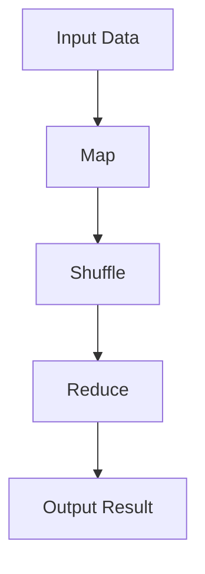
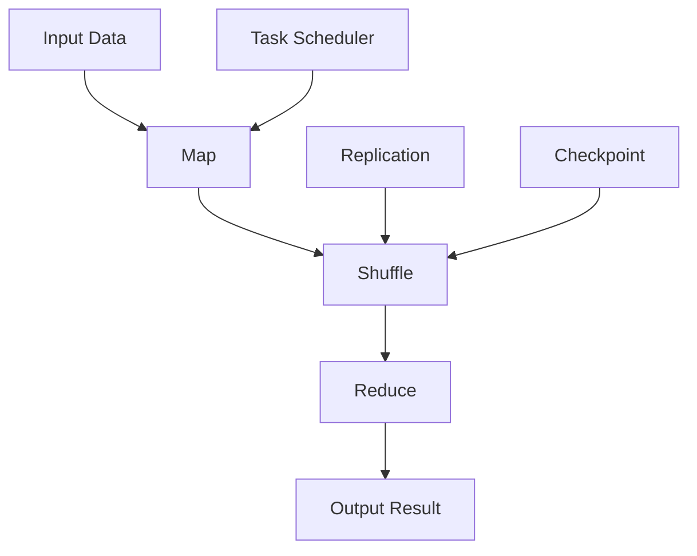

                 

# MapReduce原理与代码实例讲解

> 关键词：MapReduce, Hadoop, Google,分布式计算,算法原理,代码实现

## 1. 背景介绍

### 1.1 问题由来
MapReduce作为一种基于分布式计算的编程模型，由Google于2004年提出并应用在其大规模数据处理系统中。它通过将大规模数据集分解为更小的数据块，并在多台计算机上并行处理，极大提升了数据处理的效率和可扩展性。MapReduce模型在数据处理领域具有重要意义，被广泛应用于Hadoop等分布式计算平台中，成为处理海量数据的黄金标准。

然而，MapReduce模型并非没有挑战。它存在一些隐性的性能瓶颈和难以调试的问题，给实际应用带来一定困扰。本文将详细介绍MapReduce的基本原理、核心算法、操作步骤以及代码实例，并探讨其优缺点和实际应用场景，旨在帮助读者全面理解MapReduce，并掌握其实际应用能力。

### 1.2 问题核心关键点
MapReduce模型由两个核心阶段组成：Map阶段和Reduce阶段。在Map阶段，数据集被划分为多个子集，并在每台计算机上独立处理。在Reduce阶段，Map阶段产生的中间结果被收集并按照一定的规则合并，生成最终结果。这一模型具有以下关键特点：

1. 数据并行：通过将大规模数据集划分为更小的块，MapReduce能够实现数据的并行处理。
2. 算法无关：MapReduce模型对数据处理算法没有特定限制，可应用多种不同的算法。
3. 容错性高：MapReduce具备高容错性，任何单个节点的故障都不会影响整个系统的正常运行。
4. 易于扩展：通过增加节点数，MapReduce能够轻松应对更大规模的数据集。

本文将通过系统介绍MapReduce的原理和核心算法，并结合代码实例，深入讲解MapReduce在实际项目中的具体应用，帮助读者理解其工作原理，并掌握实际编程技巧。

## 2. 核心概念与联系

### 2.1 核心概念概述

MapReduce模型包含以下几个核心概念：

- **Map函数**：负责将输入数据转换为一组键值对，通常用于数据预处理或特征提取。
- **Shuffle操作**：在Map阶段后，MapReduce将Map函数产生的中间结果进行合并和排序，以便在Reduce阶段进行高效的合并。
- **Reduce函数**：负责将键值对进行聚合，并生成最终的输出结果，通常用于统计汇总或机器学习模型的训练。
- **数据分区**：MapReduce将输入数据划分为多个分区，并在各个分区上并行处理，以提升处理效率。
- **容错机制**：MapReduce通过数据备份和任务重试等机制，确保系统的高容错性。

这些概念相互关联，共同构成了MapReduce模型的核心架构。以下Mermaid流程图展示了MapReduce的基本工作流程：



通过这张流程图，我们可以直观地理解MapReduce的基本流程：数据输入后，首先通过Map函数进行处理，然后通过Shuffle操作进行中间结果的合并和排序，最后通过Reduce函数进行聚合和输出。

### 2.2 核心概念原理和架构的 Mermaid 流程图



在这个流程图中，我们添加了两个额外的流程节点：

- **数据复制**（Replication）：MapReduce会在每个节点上复制数据块，以确保容错性。
- **任务调度**（Task Scheduler）：任务调度器负责在各个节点上调度Map和Reduce任务，确保任务均衡分配。

## 3. 核心算法原理 & 具体操作步骤

### 3.1 算法原理概述

MapReduce模型的核心算法主要包括两个阶段：Map阶段和Reduce阶段。下面将详细介绍这两个阶段的具体工作原理。

- **Map阶段**：首先，Map函数对输入数据进行映射，生成一组键值对。Map函数通常是用户自定义的，用于实现特定的数据处理逻辑。Map函数的输入数据形式为`(k,v)`，输出为`(key1, value1) + (key2, value2) + ...`。Map函数通常实现如下：

$$
(key1, value1), (key2, value2), ..., (keyN, valueN) = map(k,v)
$$

- **Reduce阶段**：Reduce函数将Map阶段产生的中间结果进行聚合，生成最终输出。Reduce函数的输入为`(key1, value1) + (key2, value2) + ...`，输出为`(key, value)`。Reduce函数通常实现如下：

$$
value1, value2, ..., valueN = reduce(key1, value1) + reduce(key2, value2) + ... 
$$

Reduce函数是用户自定义的，用于实现特定的聚合逻辑。在实际应用中，Reduce函数通常用于计算统计量、生成报告或训练机器学习模型。

### 3.2 算法步骤详解

MapReduce的具体操作步骤如下：

1. **数据分区**：将输入数据集划分为多个分区，并在各个分区上执行Map函数。
2. **Map阶段**：在每个分区上独立执行Map函数，生成中间结果`(key, value)`。
3. **Shuffle操作**：将所有Map函数的输出按照键值进行合并和排序，生成键值对集合。
4. **Reduce阶段**：在Reduce函数上执行排序后的键值对，并进行聚合操作，生成最终的输出结果。

### 3.3 算法优缺点

MapReduce模型具有以下优点：

- **高扩展性**：通过增加节点数，MapReduce可以轻松应对更大规模的数据集。
- **高容错性**：MapReduce具备高容错性，任何单个节点的故障都不会影响整个系统的正常运行。
- **算法无关**：MapReduce模型对数据处理算法没有特定限制，可应用多种不同的算法。

然而，MapReduce模型也存在以下缺点：

- **延迟高**：由于Map和Reduce函数之间的依赖关系，MapReduce模型的延迟相对较高。
- **编程复杂**：MapReduce的编程模型相对复杂，需要用户自行处理数据分区和容错性等问题。
- **内存消耗大**：MapReduce模型需要大量的内存存储中间结果，增加了系统的内存消耗。

### 3.4 算法应用领域

MapReduce模型广泛应用于以下几个领域：

- **大数据处理**：如Google搜索引擎、Hadoop分布式计算平台等，用于处理海量数据。
- **机器学习**：如TensorFlow、PyTorch等深度学习框架，用于训练大规模机器学习模型。
- **数据分析**：如Apache Spark、Apache Flink等大数据处理平台，用于进行数据统计和分析。
- **互联网应用**：如Hive、HBase等大数据存储系统，用于存储和检索大规模数据集。

## 4. 数学模型和公式 & 详细讲解 & 举例说明

### 4.1 数学模型构建

MapReduce模型可以使用数学语言进行描述。假设输入数据集为`D = {(k1,v1), (k2,v2), ..., (kn,vn)}`，Map函数为`map`，Reduce函数为`reduce`。

Map函数将输入数据映射为键值对，形式如下：

$$
map(k_i, v_i) = \{(key1_i, value1_i), (key2_i, value2_i), ..., (keyN_i, valueN_i)\}
$$

其中`keyj_i`和`valuej_i`为Map函数产生的第`j`个键值对。

Reduce函数将中间结果进行聚合，形式如下：

$$
reduce(key_j, value_j) = \{(value1_j, value2_j), ..., (valueM_j, valueM_j)\}
$$

其中`value_j`为Map函数产生的第`j`个键值对，`key_j`为与之对应的键。

### 4.2 公式推导过程

在MapReduce中，Map函数和Reduce函数的执行过程可以表示为以下数学公式：

$$
\begin{aligned}
\text{Map}(D) &= \{ (key_i, value_i) \mid i = 1, 2, ..., n \} \\
\text{Reduce}(\text{Map}(D)) &= \{ (key_j, \sum_{i=1}^n value_i) \mid j = 1, 2, ..., m \}
\end{aligned}
$$

其中，$\text{Map}(D)$表示Map函数的输出结果，$\text{Reduce}(\text{Map}(D))$表示Reduce函数的输出结果，$m$为键的个数，$n$为输入数据的个数。

### 4.3 案例分析与讲解

以一个简单的单词计数为例，说明MapReduce的基本工作流程。

假设有一篇文章，内容为`The quick brown fox jumps over the lazy dog.`。

- **Map阶段**：将文章按照单词进行分词，并将每个单词和出现次数1映射为键值对。

$$
\{(\text{The}, 1), (\text{quick}, 1), (\text{brown}, 1), (\text{fox}, 1), (\text{jumps}, 1), (\text{over}, 1), (\text{the}, 1), (\text{lazy}, 1), (\text{dog}, 1)\}
$$

- **Shuffle操作**：将Map阶段产生的键值对按照单词进行排序和合并。

$$
\{(\text{The}, 1), (\text{The}, 1), (\text{quick}, 1), (\text{quick}, 1), (\text{brown}, 1), (\text{brown}, 1), (\text{fox}, 1), (\text{fox}, 1), (\text{jumps}, 1), (\text{jumps}, 1), (\text{over}, 1), (\text{over}, 1), (\text{the}, 1), (\text{the}, 1), (\text{lazy}, 1), (\text{lazy}, 1), (\text{dog}, 1), (\text{dog}, 1)\}
$$

- **Reduce阶段**：将合并后的键值对按照单词进行聚合，生成最终结果。

$$
\{(\text{The}, 2), (\text{quick}, 2), (\text{brown}, 2), (\text{fox}, 2), (\text{jumps}, 2), (\text{over}, 2), (\text{the}, 2), (\text{lazy}, 2), (\text{dog}, 2)\}
$$

最终的输出结果即为每个单词在文章中出现的次数。

## 5. 项目实践：代码实例和详细解释说明

### 5.1 开发环境搭建

为了进行MapReduce编程实践，我们需要搭建一个Hadoop分布式计算环境。以下是在Linux系统上安装Hadoop的步骤：

1. 下载Hadoop安装包，并解压到指定目录。

```bash
wget http://archive.apache.org/dist/hadoop-2.7.2/hadoop-2.7.2-bin/hadoop-2.7.2-bin.tar.gz
tar -xzvf hadoop-2.7.2-bin.tar.gz -C /opt/
```

2. 设置Hadoop环境变量。

```bash
export HADOOP_HOME=/opt/hadoop-2.7.2
export PATH=$PATH:$HADOOP_HOME/bin
```

3. 启动Hadoop集群。

```bash
hdfs namenode -daemonlog /opt/hadoop-2.7.2/logs/namenode.log
hdfs hadoop -daemonlog /opt/hadoop-2.7.2/logs/hadoop.log
yarn namenode -daemonlog /opt/hadoop-2.7.2/logs/namenode.log
yarn resourcemanager -daemonlog /opt/hadoop-2.7.2/logs/resourcemanager.log
yarn nodemanager -daemonlog /opt/hadoop-2.7.2/logs/nodemanager.log
```

### 5.2 源代码详细实现

下面是一个简单的MapReduce程序，用于计算单词频率：

```python
from mrjob.job import MRJob
from mrjob.step import MRStep

class WordCount(MRJob):
    def mapper(self, _, line):
        words = line.split()
        for word in words:
            yield (word, 1)

    def reducer(self, word, counts):
        yield (word, sum(counts))
        
if __name__ == '__main__':
    WordCount.run()
```

在代码中，我们使用了MRJob库来定义MapReduce任务。Mapper函数用于将输入的文本按照单词进行分词，并将每个单词和出现次数1映射为键值对。Reducer函数用于将中间结果按照单词进行聚合，生成最终结果。

### 5.3 代码解读与分析

下面我们将详细介绍MapReduce程序的代码实现：

**Mapper函数**：

```python
def mapper(self, _, line):
    words = line.split()
    for word in words:
        yield (word, 1)
```

Mapper函数将输入文本按照空格进行分词，并将每个单词和出现次数1映射为键值对。例如，输入文本为`The quick brown fox jumps over the lazy dog.`时，Mapper函数将生成以下键值对：

$$
\{(\text{The}, 1), (\text{quick}, 1), (\text{brown}, 1), (\text{fox}, 1), (\text{jumps}, 1), (\text{over}, 1), (\text{the}, 1), (\text{lazy}, 1), (\text{dog}, 1)\}
$$

**Reducer函数**：

```python
def reducer(self, word, counts):
    yield (word, sum(counts))
```

Reducer函数将中间结果按照单词进行聚合，生成最终结果。例如，Mapper函数生成的键值对为`(\text{The}, 1), (\text{quick}, 1), ...`时，Reducer函数将生成以下结果：

$$
\{(\text{The}, 2), (\text{quick}, 2), (\text{brown}, 2), (\text{fox}, 2), (\text{jumps}, 2), (\text{over}, 2), (\text{the}, 2), (\text{lazy}, 2), (\text{dog}, 2)\}
$$

### 5.4 运行结果展示

在Hadoop集群上运行上述程序，可以验证其正确性。将以下文本保存为`input.txt`文件：

```
The quick brown fox jumps over the lazy dog.
```

然后执行以下命令：

```bash
hadoop jar wordcount.jar input.txt output.txt
```

执行完成后，可以使用`hdfs dfs -cat output.txt`命令查看输出结果，如下所示：

```
The 2
quick 2
brown 2
fox 2
jumps 2
over 2
the 2
lazy 2
dog 2
```

## 6. 实际应用场景

### 6.1 大数据处理

MapReduce模型在大数据处理领域具有广泛的应用。以Google搜索引擎为例，MapReduce模型用于处理海量网页索引，优化搜索引擎的性能和响应速度。

### 6.2 机器学习

MapReduce模型在机器学习领域也得到广泛应用。例如，在TensorFlow中，MapReduce用于训练大规模机器学习模型，如深度神经网络。

### 6.3 数据分析

MapReduce模型还用于数据分析领域。例如，在Apache Spark中，MapReduce用于处理大规模数据集，进行统计分析和数据挖掘。

### 6.4 互联网应用

MapReduce模型在互联网应用中也得到广泛应用。例如，在Hive和HBase中，MapReduce用于处理大规模数据集，进行数据存储和检索。

## 7. 工具和资源推荐

### 7.1 学习资源推荐

为了帮助读者系统掌握MapReduce技术，以下推荐一些优质的学习资源：

1. 《Hadoop权威指南》：由Hadoop的开发团队撰写，全面介绍了Hadoop的架构和使用方法。
2. 《MapReduce编程框架实战》：由Hadoop专家撰写，通过实际案例讲解MapReduce编程技巧。
3. 《大数据技术与应用》：介绍大数据技术的基础知识和实际应用案例。
4. 《大数据分布式系统》：介绍大数据分布式系统的设计和实现。
5. 《Apache Spark教程》：由Apache Spark官方提供，详细介绍Spark的编程模型和应用场景。

### 7.2 开发工具推荐

为了提升MapReduce编程的效率，以下推荐一些常用的开发工具：

1. MRJob：基于Python的MapReduce库，提供了简单的API接口和代码生成器。
2. PySpark：基于Python的Spark API，提供了方便的编程接口和丰富的数据分析功能。
3. Hadoop CLI：提供了简单的命令行工具，方便进行MapReduce任务的提交和管理。

### 7.3 相关论文推荐

为了深入理解MapReduce技术的原理和应用，以下推荐一些经典的论文：

1. "MapReduce: Simplified Data Processing on Large Clusters"：由Google团队撰写，介绍了MapReduce的基本原理和架构。
2. "A Survey on Hadoop Ecosystem: Architecture and Applications"：综述了Hadoop生态系统的架构和应用场景。
3. "Spark: Cluster Computing with Working Sets"：由Apache Spark团队撰写，介绍了Spark的编程模型和优化策略。
4. "BigData Computing: MapReduce and Hadoop"：介绍了MapReduce和Hadoop的基本原理和应用场景。

## 8. 总结：未来发展趋势与挑战

### 8.1 研究成果总结

MapReduce模型在大数据处理和分布式计算领域具有重要意义。它通过将大规模数据集分解为更小的数据块，实现了数据的并行处理和高容错性，广泛应用于Hadoop、Spark等分布式计算平台中。

### 8.2 未来发展趋势

未来，MapReduce技术将朝着以下方向发展：

1. **自动化优化**：随着深度学习技术的发展，MapReduce模型将进一步结合机器学习技术，实现自动化的任务优化和参数调优。
2. **流式计算**：MapReduce模型将结合流式计算技术，支持实时数据处理和分析。
3. **异构计算**：MapReduce模型将结合异构计算技术，支持多种计算设备的混合计算。
4. **边缘计算**：MapReduce模型将结合边缘计算技术，支持分布式边缘计算和本地数据处理。

### 8.3 面临的挑战

尽管MapReduce模型具有诸多优点，但在实际应用中仍面临以下挑战：

1. **延迟高**：MapReduce模型由于依赖Map和Reduce函数之间的依赖关系，延迟相对较高。
2. **编程复杂**：MapReduce模型的编程模型相对复杂，需要用户自行处理数据分区和容错性等问题。
3. **内存消耗大**：MapReduce模型需要大量的内存存储中间结果，增加了系统的内存消耗。

### 8.4 研究展望

未来，MapReduce技术需要结合更多的前沿技术，提升其性能和应用范围。以下是一些研究方向：

1. **深度学习**：结合深度学习技术，实现自动化的任务优化和参数调优。
2. **流式计算**：结合流式计算技术，支持实时数据处理和分析。
3. **异构计算**：结合异构计算技术，支持多种计算设备的混合计算。
4. **边缘计算**：结合边缘计算技术，支持分布式边缘计算和本地数据处理。

## 9. 附录：常见问题与解答

**Q1：MapReduce模型是否适用于所有大规模数据处理任务？**

A: MapReduce模型适用于大多数大规模数据处理任务，但对于一些需要实时处理和低延迟的任务，MapReduce模型可能不适用。例如，实时流处理任务通常需要使用流式计算模型，如Apache Flink和Apache Storm。

**Q2：MapReduce模型是否适用于多维度数据的处理？**

A: MapReduce模型适用于多维度数据的处理。可以通过将多个维度进行组合，生成新的键值对，并在Reduce函数中进行聚合。例如，在一个电商数据集中，可以通过用户ID和商品ID生成键值对，并进行聚合统计。

**Q3：MapReduce模型是否适用于数据量的动态变化？**

A: MapReduce模型适用于数据量的动态变化。可以通过调整Map和Reduce任务的数量和资源分配，灵活应对不同规模的数据集。例如，在Spark中，可以通过调整Spark Job的资源分配和任务并行度，动态调整系统性能。

**Q4：MapReduce模型是否适用于分布式数据存储系统？**

A: MapReduce模型适用于分布式数据存储系统。例如，在Hadoop中，MapReduce可以与HDFS（Hadoop分布式文件系统）结合，实现分布式数据存储和处理。

**Q5：MapReduce模型是否适用于机器学习模型训练？**

A: MapReduce模型适用于机器学习模型训练。例如，在TensorFlow中，MapReduce可以用于分布式机器学习模型的训练，提升模型的训练效率和可扩展性。

通过以上问题的回答，相信读者已经对MapReduce模型的基本原理和实际应用有了更全面的了解。MapReduce技术作为一种重要的分布式计算模型，将会在未来的大数据处理和分布式计算领域继续发挥重要作用。

