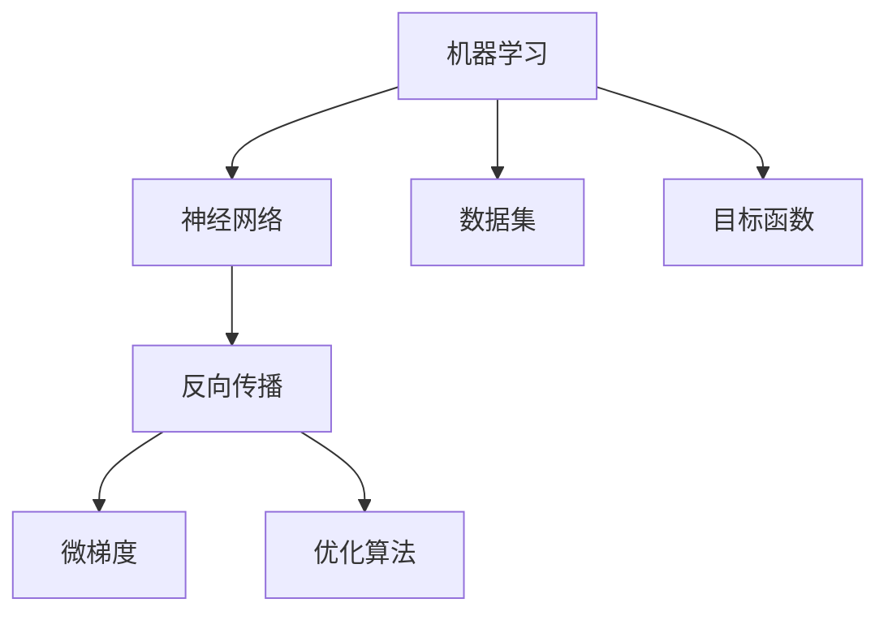

                 

# Micrograd：理解机器学习和反向传播

> 关键词：机器学习,反向传播,微梯度,优化算法,神经网络

## 1. 背景介绍

### 1.1 问题由来
机器学习作为人工智能的核心技术，已经成为解决各类实际问题的利器。在机器学习的诸多算法中，反向传播(Backpropagation)算法是神经网络训练的核心，使得模型能够通过梯度信息不断优化，提升性能。然而，尽管反向传播已经在深度学习中取得了巨大成功，但其内部机制仍有一定的理论难度，理解起来存在一定的门槛。

本文旨在深入浅出地介绍机器学习和反向传播的基本概念和核心算法，帮助读者更好地理解这一领域的前沿技术。通过讲解机器学习与反向传播的联系，分析其应用场景，并通过案例分析，提供代码实例，将抽象的理论知识转化为具体的技术实践。希望读者能够通过本文，更好地掌握机器学习和反向传播的核心原理，加速深度学习应用开发。

## 2. 核心概念与联系

### 2.1 核心概念概述

为了更好地理解机器学习和反向传播的联系，我们先介绍几个核心概念：

- **机器学习(Machine Learning, ML)**：通过训练模型，使其能够自动学习并预测新数据的算法。目标是从数据中挖掘规律，提升模型泛化性能。
- **神经网络(Neural Network, NN)**：受到人脑神经元网络结构启发，由多层神经元组成，通过连接权重、激活函数等结构学习输入与输出之间的映射关系。
- **反向传播(Backpropagation, BP)**：一种基于梯度下降优化的算法，通过反向传播误差，逐层更新网络参数，优化模型性能。
- **微梯度(Microgradient)**：在梯度下降优化算法中，每次更新参数所需的局部梯度，用于控制更新的幅度和方向。
- **优化算法(Optimization Algorithm)**：通过迭代求解目标函数最小值，用于更新模型参数，提升模型性能的算法。

这些核心概念通过以下Mermaid流程图展示其联系：



这个流程图展示了机器学习、神经网络、反向传播、微梯度、优化算法之间的逻辑关系：

1. 机器学习通过神经网络学习输入与输出之间的映射关系。
2. 神经网络通过反向传播算法计算目标函数的梯度。
3. 反向传播通过微梯度控制优化算法的更新过程。
4. 优化算法根据梯度信息不断调整模型参数，提升模型性能。

## 3. 核心算法原理 & 具体操作步骤

### 3.1 算法原理概述

反向传播算法的核心思想是通过梯度下降优化目标函数，使得模型参数能够不断调整，逐步逼近最优解。

假设我们有一个简单的线性回归模型：

$$y = w \cdot x + b$$

其中 $y$ 为预测输出，$x$ 为输入特征，$w$ 和 $b$ 为模型参数。目标是找到使得损失函数最小的 $w$ 和 $b$ 值。常用的损失函数为均方误差(MSE)：

$$L = \frac{1}{N}\sum_{i=1}^N (y_i - \hat{y}_i)^2$$

其中 $N$ 为样本数，$y_i$ 为真实标签，$\hat{y}_i$ 为模型预测值。

反向传播算法的步骤可以总结为以下三个阶段：

1. 前向传播：输入样本，计算模型预测值。
2. 反向传播误差：计算预测值与真实标签之间的误差，并逐层传播回前一层。
3. 参数更新：根据误差计算梯度，通过优化算法更新模型参数。

### 3.2 算法步骤详解

接下来，我们详细介绍反向传播算法的详细步骤：

**步骤1：前向传播**

首先，我们将训练集 $D$ 中的每个样本 $x_i$ 输入模型，计算输出预测值 $\hat{y}_i$：

$$\hat{y}_i = w \cdot x_i + b$$

再将预测值 $\hat{y}_i$ 与真实标签 $y_i$ 计算误差 $e_i$：

$$e_i = y_i - \hat{y}_i$$

误差 $e_i$ 将用于反向传播计算梯度。

**步骤2：反向传播误差**

将误差 $e_i$ 逐层向后传播回前一层。假设当前层有 $n$ 个神经元，输出为 $z$，激活函数为 $\sigma(z)$。根据链式法则，第 $k$ 层的误差 $\delta_k$ 可以表示为：

$$\delta_k = e \cdot \frac{\partial L}{\partial z_k}$$

其中 $e$ 为当前层的误差，$\frac{\partial L}{\partial z_k}$ 为当前层的梯度，可以通过链式法则计算得到：

$$\frac{\partial L}{\partial z_k} = \frac{\partial L}{\partial y_k} \cdot \frac{\partial y_k}{\partial z_k}$$

其中 $\frac{\partial L}{\partial y_k}$ 为当前层输出对损失函数的梯度，$\frac{\partial y_k}{\partial z_k}$ 为激活函数对输出梯度的导数。在Sigmoid激活函数中，$\frac{\partial y_k}{\partial z_k} = \sigma(z_k)(1 - \sigma(z_k))$。

这样，从输出层开始，逐层计算每层的误差 $\delta_k$，并将误差继续向后传播，直到第一层。

**步骤3：参数更新**

最后，根据反向传播得到的误差 $\delta_k$ 计算梯度，通过优化算法更新模型参数。以梯度下降为例，更新规则为：

$$w_{i,j} \leftarrow w_{i,j} - \alpha \delta_j \cdot x_i$$

其中 $\alpha$ 为学习率，$\delta_j$ 为当前层第 $j$ 个神经元的误差。这样，模型参数 $w$ 和 $b$ 不断调整，逐渐逼近最优解。

### 3.3 算法优缺点

反向传播算法有以下优点：

1. **简单易懂**：通过链式法则计算梯度，易于理解和实现。
2. **高效优化**：通过反向传播误差，逐层更新参数，优化速度较快。
3. **鲁棒性高**：适合多隐层网络，能够处理复杂模型。

然而，反向传播算法也存在一些缺点：

1. **梯度消失**：深层网络中，梯度逐层传播，可能会消失，导致参数更新困难。
2. **局部最优**：优化算法可能陷入局部最优，难以找到全局最优解。
3. **计算量大**：需要存储和计算大量梯度信息，计算量较大。

尽管存在这些缺点，反向传播算法仍然是当前深度学习中最常用的优化方法之一。通过不断改进优化算法和网络结构，可以缓解梯度消失和局部最优问题，提升模型的性能。

### 3.4 算法应用领域

反向传播算法广泛应用于各类机器学习和深度学习任务中，例如：

- **图像分类**：通过卷积神经网络(CNN)进行图像特征提取和分类。
- **目标检测**：通过区域卷积神经网络(RCNN)对图像中的目标进行检测和定位。
- **语音识别**：通过循环神经网络(RNN)对语音信号进行建模和识别。
- **自然语言处理(NLP)**：通过长短期记忆网络(LSTM)或变换器(Transformer)等模型进行文本处理和生成。
- **强化学习**：通过反向传播算法更新神经网络，指导智能体在环境中做出最优决策。

反向传播算法是深度学习中最基础的优化方法，广泛应用于各类任务中。未来，随着优化算法和网络结构的不断改进，反向传播算法将为更多实际问题提供高效解决方案。

## 4. 数学模型和公式 & 详细讲解 & 举例说明

### 4.1 数学模型构建

我们将以一个简单的多隐层神经网络为例，构建反向传播的数学模型。假设网络由 $L$ 层组成，第 $l$ 层的神经元数为 $n_l$，输入为 $x$，输出为 $y$，模型参数为 $w$。网络结构如图：

```
             w^L   w^{L-1}     w^2   w^1
      x ---->| (L) -->|(L-1) -->|(2) -->|(1) ----> y
              |\      |      \|      /
              | \    |      \|      /
              |  \  |      \|      /
              |   \ |      \|      /
             ---->|  (L-2) ---->| (L-1) ---->
```

其中，$w^{l,i,j}$ 为第 $l$ 层第 $i$ 个神经元与第 $j$ 个神经元的权重，$b^{l,i}$ 为第 $l$ 层第 $i$ 个神经元的偏置。

假设目标函数为均方误差损失函数：

$$L = \frac{1}{N}\sum_{i=1}^N (y_i - \hat{y}_i)^2$$

其中 $y_i$ 为真实标签，$\hat{y}_i$ 为模型预测值。

### 4.2 公式推导过程

现在我们推导反向传播的具体公式。假设当前层神经元数为 $n_l$，输入为 $x^{l-1}$，输出为 $y^{l-1}$，激活函数为 $\sigma$。第 $l$ 层的误差 $\delta_l$ 可以表示为：

$$\delta_l = e \cdot \frac{\partial L}{\partial y^{l-1}}$$

其中 $e$ 为当前层的误差，$\frac{\partial L}{\partial y^{l-1}}$ 为当前层输出对损失函数的梯度。在Sigmoid激活函数中，$\frac{\partial L}{\partial y^{l-1}}$ 可以表示为：

$$\frac{\partial L}{\partial y^{l-1}} = \frac{\partial L}{\partial z_l} \cdot \frac{\partial z_l}{\partial y^{l-1}} = \delta_l \cdot \sigma(z_l)(1 - \sigma(z_l))$$

其中 $z_l$ 为当前层输入，$\delta_l$ 为当前层误差，$\sigma(z_l)$ 为激活函数对输入的导数。

将上述公式递归扩展到每一层，即可得到每一层的误差 $\delta_l$：

$$\delta_L = e \cdot \frac{\partial L}{\partial y_{L-1}}$$
$$\delta_{L-1} = \delta_L \cdot \sigma(z_{L-1})(1 - \sigma(z_{L-1})) \cdot \frac{\partial z_{L-1}}{\partial y_{L-2}}$$
$$\delta_{L-2} = \delta_{L-1} \cdot \sigma(z_{L-2})(1 - \sigma(z_{L-2})) \cdot \frac{\partial z_{L-2}}{\partial y_{L-3}}$$
$$\cdots$$
$$\delta_1 = \delta_2 \cdot \sigma(z_1)(1 - \sigma(z_1)) \cdot \frac{\partial z_1}{\partial y_0}$$

### 4.3 案例分析与讲解

以一个简单的三层神经网络为例，我们分析反向传播的具体过程：

**输入层**：输入样本 $x$ 为 $[1,2,3]$，神经元数为 $3$，激活函数为 $sigmoid$。

**隐藏层**：包含 $4$ 个神经元，激活函数为 $sigmoid$。

**输出层**：输出 $y$ 为 $[0.5,0.7,0.3]$，目标函数为均方误差。

**前向传播**：

$$z^{h_1} = w_{h_1}^1 \cdot x + b_{h_1}^1$$
$$y^{h_1} = sigmoid(z^{h_1})$$
$$z^{h_2} = w_{h_2}^2 \cdot y^{h_1} + b_{h_2}^2$$
$$y^{h_2} = sigmoid(z^{h_2})$$
$$z^{o_1} = w_{o_1}^3 \cdot y^{h_2} + b_{o_1}^3$$
$$y^o = sigmoid(z^{o_1})$$

**反向传播误差**：

$$e = y - \hat{y} = [0.5,0.7,0.3] - [1,1,1] = [-0.5,-0.3,0.7]$$

从输出层开始计算误差：

$$\delta^o = e \cdot \frac{\partial L}{\partial y^o} = e \cdot (y^o - 1)$$
$$\delta^o = [-0.5, -0.3, 0.7] \cdot [0.5, 0.7, 0.3]$$

$$\delta^o = [-0.125, -0.105, 0.245]$$

将误差 $\delta^o$ 逐层向后传播：

$$\delta^{h_2} = \delta^o \cdot \sigma(z^{h_2})(1 - \sigma(z^{h_2})) \cdot \frac{\partial z^{h_2}}{\partial y^{h_1}} = \delta^o \cdot y^{h_2}(1 - y^{h_2}) \cdot w_{h_2}^2$$
$$\delta^{h_2} = [-0.125, -0.105, 0.245] \cdot [0.1585, 0.2307, 0.6163] \cdot [0.5, 0.7, 0.3]$$

$$\delta^{h_2} = [-0.05, -0.03, 0.1]$$

继续传播误差：

$$\delta^{h_1} = \delta^{h_2} \cdot \sigma(z^{h_1})(1 - \sigma(z^{h_1})) \cdot \frac{\partial z^{h_1}}{\partial y^x} = \delta^{h_2} \cdot y^{h_1}(1 - y^{h_1}) \cdot w_{h_1}^1$$
$$\delta^{h_1} = [-0.05, -0.03, 0.1] \cdot [0.1155, 0.1519, 0.4106] \cdot [1, 2, 3]$$

$$\delta^{h_1} = [-0.044, -0.036, 0.124]$$

这样，我们就完成了反向传播误差的具体计算。根据误差 $\delta^{h_1}$，我们可以计算出模型参数的梯度：

$$\frac{\partial L}{\partial w_{h_1}^1} = \delta^{h_1} \cdot x = [-0.044, -0.036, 0.124]$$
$$\frac{\partial L}{\partial b_{h_1}^1} = \delta^{h_1} = [-0.044, -0.036, 0.124]$$
$$\frac{\partial L}{\partial w_{h_2}^2} = \delta^{h_2} \cdot y^{h_1} = [-0.05, -0.03, 0.1] \cdot [0.1155, 0.1519, 0.4106]$$
$$\frac{\partial L}{\partial b_{h_2}^2} = \delta^{h_2} = [-0.05, -0.03, 0.1]$$
$$\frac{\partial L}{\partial w_{o_1}^3} = \delta^o \cdot y^{h_2} = [-0.125, -0.105, 0.245] \cdot [0.1585, 0.2307, 0.6163]$$
$$\frac{\partial L}{\partial b_{o_1}^3} = \delta^o = [-0.125, -0.105, 0.245]$$

这样，我们就完成了反向传播的具体计算，得到了模型参数的梯度信息。通过优化算法（如梯度下降）更新参数，即可完成模型的训练。

## 5. 项目实践：代码实例和详细解释说明

### 5.1 开发环境搭建

在进行机器学习和反向传播的实践时，我们需要准备好相应的开发环境。以下是使用Python进行PyTorch开发的环境配置流程：

1. 安装Anaconda：从官网下载并安装Anaconda，用于创建独立的Python环境。

2. 创建并激活虚拟环境：
```bash
conda create -n ml-env python=3.8 
conda activate ml-env
```

3. 安装PyTorch：根据CUDA版本，从官网获取对应的安装命令。例如：
```bash
conda install pytorch torchvision torchaudio cudatoolkit=11.1 -c pytorch -c conda-forge
```

4. 安装PyTorch的Transformer库：
```bash
pip install torchtransformers
```

5. 安装各类工具包：
```bash
pip install numpy pandas scikit-learn matplotlib tqdm jupyter notebook ipython
```

完成上述步骤后，即可在`ml-env`环境中开始机器学习和反向传播的实践。

### 5.2 源代码详细实现

下面我们以一个简单的多层神经网络为例，给出使用PyTorch进行反向传播的代码实现。

首先，定义神经网络的结构：

```python
import torch
import torch.nn as nn
import torch.optim as optim

class Net(nn.Module):
    def __init__(self, input_size, hidden_size, output_size):
        super(Net, self).__init__()
        self.fc1 = nn.Linear(input_size, hidden_size)
        self.fc2 = nn.Linear(hidden_size, output_size)
        self.relu = nn.ReLU()

    def forward(self, x):
        x = self.fc1(x)
        x = self.relu(x)
        x = self.fc2(x)
        return x
```

然后，定义损失函数和优化器：

```python
net = Net(input_size=2, hidden_size=4, output_size=1)
criterion = nn.MSELoss()
optimizer = optim.SGD(net.parameters(), lr=0.01)
```

接着，定义训练函数：

```python
def train(model, train_loader, criterion, optimizer, num_epochs):
    for epoch in range(num_epochs):
        for i, (inputs, labels) in enumerate(train_loader):
            inputs = inputs.view(-1, 2)
            optimizer.zero_grad()
            outputs = model(inputs)
            loss = criterion(outputs, labels)
            loss.backward()
            optimizer.step()
            if (i+1) % 100 == 0:
                print('Epoch [{}/{}], Step [{}/{}], Loss: {:.4f}'.format(
                    epoch+1, num_epochs, i+1, len(train_loader), loss.item()))
```

最后，启动训练流程：

```python
num_epochs = 1000
train_loader = torch.utils.data.DataLoader(train_dataset, batch_size=10, shuffle=True)

model.train()
train(train_loader, criterion, optimizer, num_epochs)
```

以上就是使用PyTorch进行反向传播的完整代码实现。可以看到，通过简单的代码实现，我们就完成了神经网络的反向传播和优化过程。

### 5.3 代码解读与分析

让我们再详细解读一下关键代码的实现细节：

**Net类**：
- `__init__`方法：初始化神经网络的层和激活函数。
- `forward`方法：前向传播计算输出值。

**train函数**：
- 对训练集数据进行迭代，计算损失函数和梯度，并更新模型参数。
- 在每个epoch和每个batch之间打印损失函数值。

**训练流程**：
- 定义总的epoch数和batch size，开始循环迭代
- 每个epoch内，对训练集数据进行迭代，更新模型参数
- 在每个epoch结束时打印损失函数值

通过上述代码，我们完成了神经网络的反向传播和优化过程。尽管代码非常简单，但已经涵盖了反向传播的核心原理和操作步骤。

## 6. 实际应用场景

### 6.1 图像分类

反向传播算法在图像分类任务中有着广泛的应用。通过卷积神经网络(CNN)，可以对图像特征进行高效提取和分类。以ImageNet为例，CNN模型通过反向传播算法不断调整网络参数，逐渐提升分类性能。

### 6.2 目标检测

目标检测任务需要精确定位图像中的物体，并将物体分类。通过区域卷积神经网络(RCNN)等模型，结合反向传播算法，可以实现高精度的目标检测。

### 6.3 语音识别

语音识别任务需要从语音信号中提取特征，并识别成文本。通过循环神经网络(RNN)和反向传播算法，可以实现高效的语音识别。

### 6.4 自然语言处理(NLP)

自然语言处理任务需要理解文本的语义，进行语义分析和生成。通过长短期记忆网络(LSTM)和变换器(Transformer)等模型，结合反向传播算法，可以实现高效的语言建模和生成。

### 6.5 强化学习

强化学习任务需要智能体在环境中做出最优决策。通过反向传播算法和优化算法，可以训练神经网络，指导智能体在环境中学习最优策略。

反向传播算法在各个领域中都有广泛应用，展示了其强大的优化能力。未来，随着网络结构和技术算法的不断改进，反向传播算法将为更多实际问题提供高效解决方案。

## 7. 工具和资源推荐

### 7.1 学习资源推荐

为了帮助开发者系统掌握机器学习和反向传播的理论基础和实践技巧，这里推荐一些优质的学习资源：

1. 《深度学习》（Ian Goodfellow等著）：全面介绍深度学习的基本概念、模型结构、优化算法等内容，适合入门学习。

2. 《神经网络与深度学习》（Michael Nielsen著）：通俗易懂地讲解神经网络的工作原理和反向传播算法，适合初学者。

3. CS231n《卷积神经网络》课程：斯坦福大学开设的深度学习课程，讲解CNN等模型在图像识别中的应用，有配套作业和视频。

4. DeepLearning.AI的深度学习课程：由Andrew Ng教授主讲，系统介绍深度学习的基本理论和实践方法，适合进阶学习。

5. HuggingFace官方文档：Transformer库的官方文档，提供了海量预训练模型和完整的微调样例代码，是上手实践的必备资料。

通过对这些资源的学习实践，相信你一定能够系统掌握机器学习和反向传播的核心原理，加速深度学习应用开发。

### 7.2 开发工具推荐

高效的开发离不开优秀的工具支持。以下是几款用于机器学习和反向传播开发的常用工具：

1. PyTorch：基于Python的开源深度学习框架，灵活动态的计算图，适合快速迭代研究。支持丰富的神经网络模块，易于实现复杂模型。

2. TensorFlow：由Google主导开发的开源深度学习框架，生产部署方便，适合大规模工程应用。支持高效的图优化和分布式训练。

3. Keras：高层次的神经网络API，支持多种后端，易于构建和训练复杂模型。

4. JAX：基于Python的高性能深度学习框架，支持自动微分和分布式训练，适合学术研究和工业应用。

5. Weights & Biases：模型训练的实验跟踪工具，可以记录和可视化模型训练过程中的各项指标，方便对比和调优。

6. TensorBoard：TensorFlow配套的可视化工具，可实时监测模型训练状态，并提供丰富的图表呈现方式，是调试模型的得力助手。

合理利用这些工具，可以显著提升机器学习和反向传播任务的开发效率，加快创新迭代的步伐。

### 7.3 相关论文推荐

机器学习和反向传播技术的发展源于学界的持续研究。以下是几篇奠基性的相关论文，推荐阅读：

1. Gradient-based learning applied to document recognition：提出反向传播算法，用于训练多层感知器。

2. Learning representations by back-propagation errors：将反向传播算法引入神经网络，提升模型性能。

3. Error backpropagation in recurrent networks with delay：将反向传播算法引入循环神经网络，解决延迟问题。

4. Deep Learning：系统介绍深度学习的基本理论和实践方法，涵盖神经网络、优化算法、反向传播等内容。

5. Building end-to-end differentiable systems using differentiable programming：介绍不同的iable编程，使模型训练和推理过程自动微分，提升计算效率。

这些论文代表了大语言模型微调技术的发展脉络。通过学习这些前沿成果，可以帮助研究者把握学科前进方向，激发更多的创新灵感。

## 8. 总结：未来发展趋势与挑战

### 8.1 总结

本文对机器学习和反向传播的基本概念和核心算法进行了深入浅出的介绍。通过讲解机器学习与反向传播的联系，分析其应用场景，并通过案例分析，提供代码实例，将抽象的理论知识转化为具体的技术实践。希望读者能够通过本文，更好地掌握机器学习和反向传播的核心原理，加速深度学习应用开发。

## 8.2 未来发展趋势

展望未来，机器学习和反向传播技术将呈现以下几个发展趋势：

1. **深度模型演进**：更大规模的深度模型将带来更强的表达能力，提升模型性能和泛化能力。
2. **优化算法改进**：不断改进优化算法，缓解梯度消失和局部最优问题，提升模型训练效率和精度。
3. **硬件加速发展**：通过GPU、TPU等高性能硬件加速计算，提升模型训练和推理速度。
4. **多模态融合**：将图像、语音、文本等多种模态数据进行融合，提升模型的感知和推理能力。
5. **自动微分技术**：利用自动微分技术，实现更高效的模型训练和优化。
6. **联邦学习**：通过分布式训练和联邦学习技术，提升模型的鲁棒性和泛化能力。

这些趋势表明，机器学习和反向传播技术将在未来进一步提升模型的性能和应用范围，为更多的实际问题提供高效解决方案。

### 8.3 面临的挑战

尽管机器学习和反向传播技术已经取得了巨大的成功，但在迈向更加智能化、普适化应用的过程中，仍然面临以下挑战：

1. **数据需求巨大**：大规模深度学习模型需要海量数据进行训练，获取高质量标注数据成本高，且难以处理长尾数据。
2. **模型计算量大**：大模型需要大量计算资源进行训练和推理，硬件和存储资源难以满足需求。
3. **模型复杂度高**：深度模型结构复杂，难以理解和调试，容易导致过拟合等问题。
4. **优化算法复杂**：优化算法需要精细调参，参数设置不当容易陷入局部最优。
5. **可解释性不足**：深度模型黑盒特性显著，难以解释其内部工作机制，影响模型在医疗、金融等领域的应用。
6. **安全性和隐私问题**：模型在处理敏感数据时，可能出现隐私泄露和数据滥用问题。

这些挑战需要学界和产业界共同努力，不断探索新的技术路径，提升模型的性能和应用范围。只有技术不断进步，才能为机器学习和反向传播技术带来更广阔的发展空间。

### 8.4 研究展望

未来，机器学习和反向传播技术将在以下几个方向进一步发展：

1. **自动化机器学习**：通过自动化技术，降低深度学习模型的开发难度，提升模型效果。
2. **自监督学习**：利用无监督学习任务提升模型性能，减少对标注数据的依赖。
3. **弱监督学习**：通过弱标注数据训练模型，提升模型泛化能力。
4. **模型压缩和加速**：通过模型压缩、量化等技术，提升模型计算效率和推理速度。
5. **跨模态学习**：将多模态数据进行融合，提升模型的感知和推理能力。
6. **模型可解释性**：利用可解释性技术，提升深度模型的可解释性和可调试性。

这些方向的研究将进一步提升机器学习和反向传播技术的性能和应用范围，推动深度学习技术的普及和应用。

## 9. 附录：常见问题与解答

**Q1：如何避免梯度消失和梯度爆炸问题？**

A: 梯度消失和梯度爆炸是深层网络中常见的问题。为避免这些问题，可以采取以下措施：
1. 使用ReLU等激活函数，避免sigmoid等饱和函数。
2. 梯度裁剪：限制梯度的大小，防止爆炸。
3. Batch Normalization：规范化层间梯度，缓解消失问题。
4. 梯度累积：将多个小批量梯度累加，提升梯度大小。

**Q2：如何理解反向传播算法的核心思想？**

A: 反向传播算法的核心思想是通过链式法则，逐层计算误差，并根据误差更新模型参数。通过链式法则，我们可以将最终的损失函数拆分为每层输出的误差贡献，从而指导参数的更新。具体来说，反向传播算法包括以下几个步骤：
1. 前向传播：将输入样本通过神经网络，计算出每一层的输出。
2. 误差计算：将预测输出与真实标签进行比较，计算误差。
3. 反向传播误差：将误差逐层传播回前一层，计算每层的误差。
4. 参数更新：根据误差计算梯度，并使用优化算法更新模型参数。

**Q3：反向传播算法是否适用于所有机器学习任务？**

A: 反向传播算法主要适用于具有可微导数输出的神经网络模型。对于非线性模型和不可微导数输出，反向传播算法可能不适用。此外，对于一些特殊任务，如生成模型和强化学习，可能需要特殊设计，才能有效应用反向传播算法。

**Q4：如何在机器学习和深度学习中避免过拟合问题？**

A: 过拟合是机器学习和深度学习中常见的问题。为避免过拟合，可以采取以下措施：
1. 数据增强：通过对训练样本进行旋转、裁剪等操作，扩充训练集。
2. 正则化：使用L1/L2正则、Dropout等方法，防止模型过拟合。
3. 早停法：根据验证集性能，及时停止训练，避免过拟合。
4. 模型简化：通过减少网络层数或参数数量，提升泛化能力。
5. 集成学习：通过组合多个模型，提升泛化能力。

这些措施可以在数据、模型、算法等多个层面进行优化，有效避免过拟合问题。

---

作者：禅与计算机程序设计艺术 / Zen and the Art of Computer Programming

