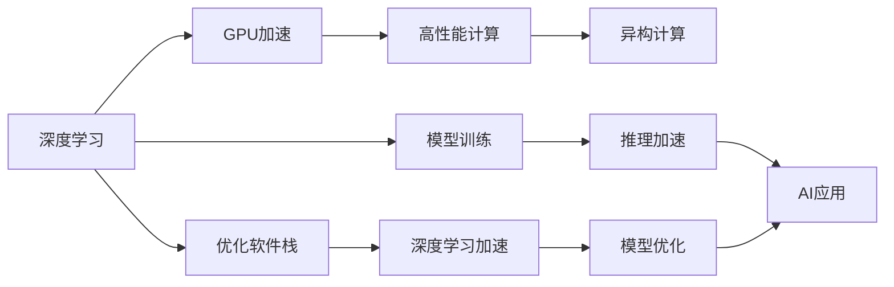

                 

# NVIDIA的算力支持与AI发展

## 1. 背景介绍

### 1.1 问题由来

随着人工智能(AI)技术在各个领域的应用逐渐深入，算力成为制约AI发展的核心瓶颈。尤其是在深度学习领域，高精度、大规模的深度神经网络模型需要庞大的计算资源进行训练和推理。如何在有限的计算资源下，最大化AI系统的性能，是当前学术界和工业界共同面临的重要挑战。

NVIDIA作为全球领先的GPU厂商，一直以来都是深度学习和大规模AI计算的首选平台。近年来，NVIDIA在算力支持方面不断创新突破，推出了多个高性能GPU和AI平台，极大地提升了AI系统的计算效率和应用性能。

### 1.2 问题核心关键点

NVIDIA的算力支持与AI发展主要涉及以下几个关键点：

- **GPU架构与性能**：NVIDIA如何通过不断提升GPU架构，使得GPU性能持续突破，更好地支撑AI计算需求。
- **计算平台与生态**：NVIDIA是如何构建和扩展AI计算平台，为开发者提供一体化的AI解决方案。
- **软件栈优化**：NVIDIA如何通过优化软件栈，提升AI模型的训练效率和推理速度。
- **异构计算与融合**：NVIDIA如何融合异构计算资源，提升AI系统的综合性能。

通过深入理解这些关键点，我们可以更好地把握NVIDIA在AI领域的技术优势和发展方向。

## 2. 核心概念与联系

### 2.1 核心概念概述

为了更清楚地理解NVIDIA的算力支持与AI发展，我们先介绍几个核心概念：

- **GPU (Graphics Processing Unit)**：一种专门用于图形渲染和通用并行计算的硬件芯片。NVIDIA的GPU以其高性能和可编程能力著称，广泛应用于深度学习和其他高性能计算任务。

- **深度学习 (Deep Learning)**：一种基于神经网络的机器学习方法，通过多层非线性映射，可以从大量数据中提取高维特征，用于图像、语音、文本等多种任务。

- **高性能计算 (High-Performance Computing, HPC)**：指利用高性能计算集群和超级计算机，解决科学计算、数据分析、模拟仿真等复杂问题。

- **异构计算 (Heterogeneous Computing)**：指结合CPU、GPU、FPGA等多种计算资源，提升计算效率和系统性能。

- **深度学习加速 (Deep Learning Acceleration)**：通过优化GPU架构和软件栈，提升深度学习模型的训练和推理速度，降低计算成本。

### 2.2 核心概念原理和架构的 Mermaid 流程图



这个流程图展示了深度学习、GPU加速、高性能计算、异构计算、深度学习加速等概念之间的联系。GPU作为深度学习加速的核心硬件，通过高性能计算和异构计算等技术，为深度学习模型的训练和推理提供了强大的支持。同时，优化软件栈也是提升深度学习系统性能的重要手段。

## 3. 核心算法原理 & 具体操作步骤

### 3.1 算法原理概述

NVIDIA的算力支持与AI发展，主要通过以下几个方面的算法原理和操作步骤实现：

- **GPU架构优化**：通过不断提升GPU的并行计算能力，使得GPU性能持续突破，更好地支持深度学习模型的训练和推理。
- **高性能计算平台构建**：通过构建高性能计算集群和超级计算机，为深度学习任务提供强大的计算资源。
- **深度学习加速算法**：通过优化深度学习算法，提升模型的训练和推理速度，降低计算成本。
- **异构计算融合**：通过结合CPU、GPU、FPGA等多种计算资源，提升系统的综合性能。

### 3.2 算法步骤详解

以下是NVIDIA在算力支持与AI发展方面的详细操作步骤：

#### 3.2.1 GPU架构优化

1. **设计并行结构**：NVIDIA通过不断改进GPU架构，增加了更多的并行计算单元和指令流水线，提升了GPU的计算能力。
2. **提升时钟频率**：通过提升GPU的时钟频率，加快计算速度。
3. **优化访存架构**：通过改进GPU的内存访问方式，减少数据传输延迟，提升计算效率。
4. **硬件加速**：通过硬件加速技术，如Tensor Core、张量核(Tensor Core)，加速矩阵计算、深度学习等密集型计算任务。

#### 3.2.2 高性能计算平台构建

1. **构建GPU集群**：通过构建GPU集群，利用多台GPU的并行计算能力，提升计算速度。
2. **引入超级计算机**：通过引入超级计算机，提供更强大的计算资源，支持复杂的科学计算任务。
3. **优化网络通信**：通过优化GPU集群中的网络通信，减少数据传输延迟，提升系统吞吐量。

#### 3.2.3 深度学习加速算法

1. **模型压缩与量化**：通过模型压缩和量化技术，减少模型的参数量和计算复杂度，提升训练和推理速度。
2. **优化深度学习框架**：通过优化深度学习框架，如TensorFlow、PyTorch等，提升模型的训练和推理效率。
3. **引入混合精度计算**：通过混合精度计算技术，如16位浮点数计算，减少内存占用，提升训练速度。

#### 3.2.4 异构计算融合

1. **结合CPU和GPU**：通过结合CPU和GPU，利用两者的优势互补，提升系统的综合性能。
2. **引入FPGA加速**：通过引入FPGA加速，提升特定任务的计算效率。
3. **优化数据流动**：通过优化数据流动方式，减少不同计算资源之间的通信开销。

### 3.3 算法优缺点

NVIDIA的算力支持与AI发展方法具有以下优点：

- **高性能**：通过优化GPU架构和平台，NVIDIA提供了强大的计算能力，提升了深度学习模型的训练和推理速度。
- **可扩展性**：通过构建GPU集群和超级计算机，NVIDIA提供了可扩展的计算资源，支持大规模AI任务。
- **综合性能**：通过融合异构计算资源，NVIDIA提升了系统的综合性能，解决了特定任务中的计算瓶颈。

同时，该方法也存在以下缺点：

- **成本高**：高性能计算平台和GPU集群建设成本较高，需要较大的资金投入。
- **技术门槛高**：深度学习加速和异构计算技术复杂，需要较高的技术门槛和专业经验。
- **数据通信开销**：在高性能计算集群中，不同计算节点之间的数据通信开销较大，可能影响系统效率。

### 3.4 算法应用领域

NVIDIA的算力支持与AI发展方法在以下几个领域得到了广泛应用：

- **深度学习研究**：通过高性能GPU和计算平台，支持深度学习模型的训练和推理，加速科研进展。
- **工业生产**：通过异构计算和深度学习加速技术，提升工业生产的自动化水平和效率。
- **医疗诊断**：通过高性能计算和深度学习技术，提升医疗影像分析和疾病诊断的准确性。
- **自动驾驶**：通过高性能GPU和计算平台，支持自动驾驶系统的实时计算和决策。
- **科学研究**：通过超级计算机和高性能计算平台，支持复杂的科学计算和模拟仿真任务。

## 4. 数学模型和公式 & 详细讲解 & 举例说明

### 4.1 数学模型构建

NVIDIA的算力支持与AI发展，主要通过以下几个数学模型进行构建：

1. **深度学习模型**：如卷积神经网络(CNN)、循环神经网络(RNN)、变分自编码器(VAE)等。这些模型通过多层非线性映射，从大量数据中提取高维特征。
2. **高性能计算模型**：如GPU集群和超级计算机，通过并行计算和分布式计算，提升计算速度。
3. **异构计算模型**：如结合CPU、GPU、FPGA的计算系统，通过优化数据流动和任务调度，提升系统性能。

### 4.2 公式推导过程

以深度学习模型为例，以下是对NVIDIA深度学习加速算法的公式推导过程：

1. **模型压缩**：通过量化技术，将模型参数转换为更小的数据类型，如16位浮点数，减少内存占用和计算复杂度。设原始参数数量为 $W$，量化后的参数数量为 $W'$，则有：

   $$
   W' = \frac{W}{2^k}
   $$

   其中 $k$ 表示量化位宽，一般为16。

2. **混合精度计算**：通过混合精度计算技术，将模型的部分参数转换为16位浮点数，提升训练速度。设模型参数数量为 $W$，其中 $W_1$ 为16位参数，$W_2$ 为32位参数，则有：

   $$
   W = W_1 + W_2
   $$

   $$
   W_1 = \frac{W}{2}
   $$

   $$
   W_2 = \frac{W}{2}
   $$

3. **优化深度学习框架**：通过优化深度学习框架，如TensorFlow、PyTorch等，提升模型的训练和推理效率。

### 4.3 案例分析与讲解

以NVIDIA深度学习加速算法为例，以下是对其中的关键案例进行详细分析：

**案例1：混合精度训练**

NVIDIA通过混合精度训练技术，将深度学习模型中的部分参数转换为16位浮点数，显著提升训练速度。具体实现方式如下：

1. **数据准备**：将模型参数分为16位和32位两部分。
2. **混合精度训练**：在训练过程中，使用16位参数进行前向传播和反向传播，使用32位参数更新参数。
3. **结果验证**：在测试过程中，使用32位参数进行推理验证，确保模型性能不受影响。

**案例2：模型压缩**

NVIDIA通过模型压缩技术，将深度学习模型的参数数量减少到原来的一半，提升训练和推理速度。具体实现方式如下：

1. **量化参数**：将模型参数进行量化，转换为16位或8位浮点数。
2. **模型结构优化**：去除不必要的层和参数，简化模型结构。
3. **结果验证**：在测试过程中，使用原始参数进行推理验证，确保模型性能不受影响。

## 5. 项目实践：代码实例和详细解释说明

### 5.1 开发环境搭建

以下是在NVIDIA平台上进行深度学习模型训练和推理的开发环境搭建步骤：

1. **安装NVIDIA GPU**：确保计算平台配备了高性能NVIDIA GPU。
2. **安装NVIDIA CUDA**：从NVIDIA官网下载并安装CUDA工具包，用于GPU编程。
3. **安装NVIDIA cuDNN**：从NVIDIA官网下载并安装cuDNN库，用于深度学习加速。
4. **安装深度学习框架**：如TensorFlow、PyTorch等，通过CUDA和cuDNN库进行优化。
5. **安装NVIDIA NCCL**：从NVIDIA官网下载并安装NCCL库，用于GPU集群中的数据通信。

### 5.2 源代码详细实现

以下是一个使用NVIDIA平台进行深度学习模型训练的示例代码：

```python
import tensorflow as tf
import numpy as np

# 加载数据
train_data = np.load('train_data.npy')
train_labels = np.load('train_labels.npy')

# 定义模型
model = tf.keras.Sequential([
    tf.keras.layers.Dense(256, activation='relu', input_shape=(784,)),
    tf.keras.layers.Dense(10, activation='softmax')
])

# 编译模型
model.compile(optimizer=tf.keras.optimizers.Adam(learning_rate=0.001),
              loss=tf.keras.losses.SparseCategoricalCrossentropy(from_logits=True),
              metrics=['accuracy'])

# 训练模型
model.fit(train_data, train_labels, epochs=10, batch_size=32)

# 推理模型
test_data = np.load('test_data.npy')
test_labels = np.load('test_labels.npy')
predictions = model.predict(test_data)

# 评估模型
model.evaluate(test_data, test_labels)
```

### 5.3 代码解读与分析

以下是代码中关键部分的解读与分析：

- **数据准备**：通过numpy库加载训练数据和标签。
- **模型定义**：使用TensorFlow框架定义一个简单的全连接神经网络模型。
- **模型编译**：指定优化器、损失函数和评估指标，编译模型。
- **模型训练**：通过fit方法训练模型，指定训练轮数和批大小。
- **模型推理**：通过predict方法对测试数据进行推理，得到预测结果。
- **模型评估**：通过evaluate方法评估模型性能，得到准确率等指标。

## 6. 实际应用场景

### 6.1 智能医疗

在智能医疗领域，NVIDIA的算力支持与AI发展带来了许多创新应用。例如，通过深度学习模型和GPU加速，医生能够快速准确地分析医学影像，提升诊断效率和准确性。NVIDIA的超级计算机和GPU集群，支持大规模医疗数据的处理和分析，为疾病预测和个性化治疗提供了强大的计算资源。

### 6.2 自动驾驶

在自动驾驶领域，NVIDIA的算力支持与AI发展为车辆提供了实时的感知和决策能力。通过高性能GPU和深度学习模型，车辆能够识别道路标志、交通信号和行人，做出安全可靠的驾驶决策。NVIDIA的异构计算平台，结合CPU和GPU，支持实时计算和数据处理，为自动驾驶提供了强大的计算支持。

### 6.3 科学研究

在科学研究领域，NVIDIA的超级计算机和GPU集群，支持复杂的科学计算和模拟仿真任务。例如，天文学家可以通过GPU加速的模拟软件，模拟宇宙的演化过程，研究黑洞和暗物质等深奥的科学问题。生物学家可以使用GPU加速的分子动力学模拟，研究蛋白质的结构和功能。

### 6.4 未来应用展望

NVIDIA的算力支持与AI发展，将在以下几个方面展现更广阔的前景：

- **多模态计算**：结合GPU、CPU、FPGA等多种计算资源，支持更复杂多变的AI应用场景。
- **实时计算**：通过优化计算平台和算法，实现低延迟、高吞吐量的实时计算，满足实时应用需求。
- **边缘计算**：在边缘设备上进行轻量级计算，减少数据传输延迟，提升系统效率。
- **量子计算**：结合量子计算技术，提升深度学习模型的计算能力，探索新型的AI算法。

## 7. 工具和资源推荐

### 7.1 学习资源推荐

为了帮助开发者掌握NVIDIA的算力支持与AI发展技术，以下是一些优质的学习资源：

1. **NVIDIA Deep Learning SDK**：NVIDIA提供的深度学习开发工具包，包含多种深度学习框架的优化版本。
2. **NVIDIA Developer**：NVIDIA的开发者社区，提供丰富的技术文档、教程和样例代码。
3. **NVIDIA cuDNN**：NVIDIA优化的深度学习加速库，提升深度学习算法的计算效率。
4. **NVIDIA NCCL**：NVIDIA优化的GPU集群通信库，支持高效的数据传输和通信。
5. **Deep Learning Specialization**：Coursera上由深度学习领域的权威人士Andrew Ng教授的课程，全面介绍深度学习算法和NVIDIA的深度学习加速技术。

### 7.2 开发工具推荐

以下是一些用于NVIDIA平台深度学习开发的常用工具：

1. **NVIDIA CUDA**：NVIDIA优化的GPU编程工具，支持高性能并行计算。
2. **NVIDIA cuDNN**：NVIDIA优化的深度学习加速库，提升深度学习算法的计算效率。
3. **NVIDIA NCCL**：NVIDIA优化的GPU集群通信库，支持高效的数据传输和通信。
4. **TensorFlow**：Google开发的深度学习框架，通过NVIDIA的优化，提升训练和推理速度。
5. **PyTorch**：Facebook开发的深度学习框架，通过NVIDIA的优化，提升训练和推理速度。

### 7.3 相关论文推荐

以下是一些关于NVIDIA算力支持与AI发展的相关论文，推荐阅读：

1. **CUDA Programming Guide**：NVIDIA的CUDA编程指南，详细介绍了如何使用CUDA工具进行GPU编程。
2. **cuDNN User Guide**：NVIDIA的cuDNN用户手册，介绍了cuDNN库的使用方法和优化技巧。
3. **NVIDIA NCCL User Guide**：NVIDIA的NCCL用户手册，介绍了NCCL库的使用方法和优化技巧。
4. **NVIDIA Deep Learning SDK**：NVIDIA的深度学习开发工具包，包含多种深度学习框架的优化版本。
5. **Deep Learning Acceleration on the NVIDIA GPU**：NVIDIA的研究论文，探讨了GPU加速在深度学习中的重要性和实现方法。

## 8. 总结：未来发展趋势与挑战

### 8.1 总结

本文详细介绍了NVIDIA在算力支持与AI发展方面的核心概念、算法原理和操作步骤。通过优化GPU架构、构建高性能计算平台、提升深度学习加速算法和融合异构计算资源，NVIDIA为深度学习模型的训练和推理提供了强大的计算支持。同时，我们通过案例分析，展示了NVIDIA的算力支持在实际应用中的广泛应用和显著效果。

通过本文的系统梳理，可以看到，NVIDIA在算力支持与AI发展方面的技术优势和创新突破，为深度学习模型的训练和推理提供了全新的解决方案。随着AI技术的不断进步，NVIDIA的算力支持将继续发挥重要作用，推动深度学习在各个领域的应用和发展。

### 8.2 未来发展趋势

NVIDIA的算力支持与AI发展未来将呈现以下几个发展趋势：

1. **异构计算融合**：通过结合GPU、CPU、FPGA等多种计算资源，提升系统的综合性能，支持更复杂多变的AI应用场景。
2. **实时计算优化**：通过优化计算平台和算法，实现低延迟、高吞吐量的实时计算，满足实时应用需求。
3. **边缘计算优化**：在边缘设备上进行轻量级计算，减少数据传输延迟，提升系统效率。
4. **量子计算结合**：结合量子计算技术，提升深度学习模型的计算能力，探索新型的AI算法。
5. **自动化优化**：通过自动化工具和算法，优化深度学习模型的训练和推理过程，提升计算效率和系统性能。

### 8.3 面临的挑战

尽管NVIDIA在算力支持与AI发展方面取得了显著进展，但仍面临以下挑战：

1. **计算成本高**：高性能计算平台和GPU集群建设成本较高，需要较大的资金投入。
2. **技术门槛高**：深度学习加速和异构计算技术复杂，需要较高的技术门槛和专业经验。
3. **数据通信开销**：在高性能计算集群中，不同计算节点之间的数据通信开销较大，可能影响系统效率。
4. **模型复杂度高**：深度学习模型的计算复杂度较高，需要优化算法和硬件架构来提升计算效率。
5. **软件栈复杂**：深度学习框架和加速库的优化需要较高的技术水平和实践经验，开发难度较大。

### 8.4 研究展望

为了应对这些挑战，未来的研究需要在以下几个方面进行深入探索：

1. **计算成本优化**：通过新型硬件架构和节能技术，降低计算平台和集群建设成本。
2. **技术门槛降低**：通过简化编程模型和优化开发工具，降低深度学习加速和异构计算的技术门槛。
3. **通信效率提升**：通过优化数据传输方式和通信协议，降低计算集群中的数据通信开销。
4. **模型复杂度优化**：通过模型压缩、量化等技术，减少深度学习模型的计算复杂度。
5. **软件栈优化**：通过优化深度学习框架和加速库，提升开发效率和系统性能。

通过在这些方面的持续探索和创新，NVIDIA的算力支持与AI发展必将取得更大的突破，推动深度学习技术在各个领域的应用和发展。

## 9. 附录：常见问题与解答

### Q1：如何提升NVIDIA GPU的计算能力？

A: 提升NVIDIA GPU的计算能力主要通过以下几个方法：

1. **升级GPU架构**：NVIDIA不断改进GPU架构，增加了更多的并行计算单元和指令流水线，提升了GPU的计算能力。
2. **提升时钟频率**：通过提升GPU的时钟频率，加快计算速度。
3. **优化访存架构**：通过改进GPU的内存访问方式，减少数据传输延迟，提升计算效率。
4. **引入硬件加速**：通过硬件加速技术，如Tensor Core，加速矩阵计算、深度学习等密集型计算任务。

### Q2：NVIDIA GPU集群如何构建？

A: 构建NVIDIA GPU集群主要通过以下几个步骤：

1. **选择计算节点**：选择合适的计算节点，确保每个节点配备高性能NVIDIA GPU。
2. **安装CUDA和cuDNN**：在每个计算节点上安装CUDA和cuDNN工具包，用于GPU编程和深度学习加速。
3. **安装NCCL库**：在每个计算节点上安装NCCL库，用于GPU集群中的数据通信。
4. **设置计算任务**：通过MPI等分布式计算框架，设置计算任务，进行并行计算。
5. **优化通信效率**：通过优化通信方式和协议，减少数据传输延迟，提升系统效率。

### Q3：如何优化NVIDIA深度学习模型的训练和推理？

A: 优化NVIDIA深度学习模型的训练和推理主要通过以下几个方法：

1. **模型压缩和量化**：通过量化技术，将模型参数转换为更小的数据类型，减少内存占用和计算复杂度。
2. **混合精度计算**：通过混合精度计算技术，将模型的部分参数转换为16位浮点数，提升训练速度。
3. **优化深度学习框架**：通过优化深度学习框架，如TensorFlow、PyTorch等，提升模型的训练和推理效率。
4. **引入混合精度计算**：通过混合精度计算技术，将模型的部分参数转换为16位浮点数，提升训练速度。
5. **优化数据流动**：通过优化数据流动方式，减少不同计算资源之间的通信开销。

### Q4：NVIDIA算力支持与AI发展面临哪些挑战？

A: NVIDIA算力支持与AI发展面临以下挑战：

1. **计算成本高**：高性能计算平台和GPU集群建设成本较高，需要较大的资金投入。
2. **技术门槛高**：深度学习加速和异构计算技术复杂，需要较高的技术门槛和专业经验。
3. **数据通信开销**：在高性能计算集群中，不同计算节点之间的数据通信开销较大，可能影响系统效率。
4. **模型复杂度高**：深度学习模型的计算复杂度较高，需要优化算法和硬件架构来提升计算效率。
5. **软件栈复杂**：深度学习框架和加速库的优化需要较高的技术水平和实践经验，开发难度较大。

### Q5：NVIDIA未来在算力支持与AI发展方面有何展望？

A: NVIDIA未来在算力支持与AI发展方面的展望如下：

1. **异构计算融合**：通过结合GPU、CPU、FPGA等多种计算资源，提升系统的综合性能，支持更复杂多变的AI应用场景。
2. **实时计算优化**：通过优化计算平台和算法，实现低延迟、高吞吐量的实时计算，满足实时应用需求。
3. **边缘计算优化**：在边缘设备上进行轻量级计算，减少数据传输延迟，提升系统效率。
4. **量子计算结合**：结合量子计算技术，提升深度学习模型的计算能力，探索新型的AI算法。
5. **自动化优化**：通过自动化工具和算法，优化深度学习模型的训练和推理过程，提升计算效率和系统性能。

---

作者：禅与计算机程序设计艺术 / Zen and the Art of Computer Programming

