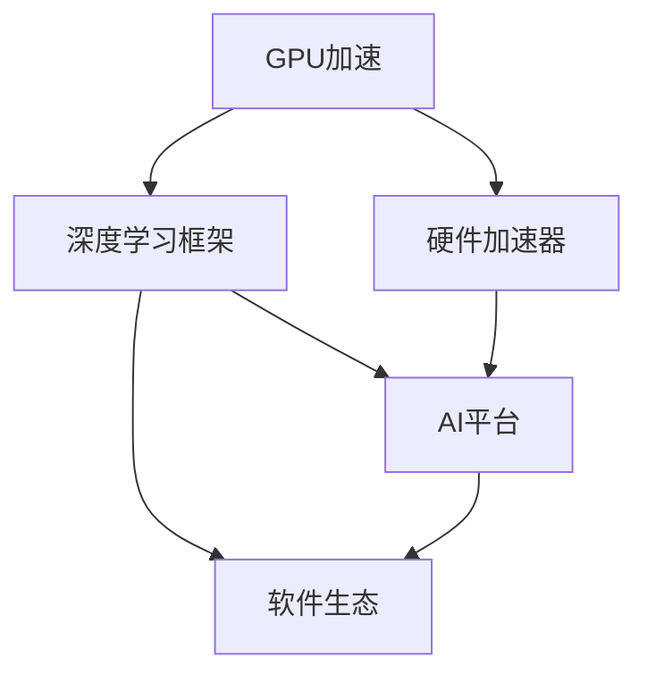

                 

# Nvidia在AI领域的主导地位

在现代人工智能(AI)领域，Nvidia的崛起无疑是一股不可忽视的力量。无论是硬件，还是软件，Nvidia在AI领域都占据着举足轻重的地位。从GPU到深度学习框架，Nvidia不仅在硬件上推动了AI计算的革命，还在软件上构建了强大的AI生态系统，形成了一套涵盖从模型训练到推理部署的完整解决方案。本文将从硬件和软件两个方面，深入探讨Nvidia在AI领域的主导地位。

## 1. 背景介绍

### 1.1 历史回顾
Nvidia成立于1993年，最初是一家专注于图形处理单元(GPU)的初创公司。随着个人计算机和互联网的兴起，Nvidia很快成为了图形显示领域的主导厂商。2000年，Nvidia推出了首款CUDA(Compute Unified Device Architecture)架构的GPU，正式进入了高性能计算领域。

2008年，Nvidia发布了面向深度学习的CUDA平台和Cublas库，标志着Nvidia在AI硬件上的探索正式启动。此后，Nvidia不断推出新型GPU，如Tesla系列、GeForce RTX系列等，这些GPU不仅在图形处理上表现卓越，而且在深度学习领域也成为了首选。

2016年，Nvidia发布了具有里程碑意义的Tensor Core架构，极大提升了深度学习推理和训练的效率，进一步巩固了其在AI硬件领域的领导地位。

### 1.2 技术突破
Nvidia在AI领域的突破主要集中在以下几个方面：
- 先进的GPU架构：如CUDA、Tensor Core等，使得Nvidia的GPU在深度学习训练和推理中表现优异。
- 深度学习框架：如Caffe、Torch、TensorRT等，Nvidia在这些框架中深度定制优化，提升了训练和推理效率。
- 硬件加速器：如NVIDIA Tensor Core GPU、NVIDIA AI芯片(如NVIDIA Xavier、NVIDIA Ampere)，提供了从模型训练到推理部署的全链路加速。
- AI平台：如NVIDIA Jetson、NVIDIA AI Studio等，构建了完善的AI开发、测试、部署平台。

## 2. 核心概念与联系

### 2.1 核心概念概述

为了更好地理解Nvidia在AI领域的主导地位，本节将介绍几个关键概念：

- **GPU加速**：Nvidia的GPU加速技术在深度学习领域有着广泛应用。通过CUDA、Tensor Core等架构的优化，GPU能够高效执行矩阵乘法、卷积等计算密集型操作，大幅提升模型训练和推理的速度。

- **深度学习框架**：Nvidia不仅提供了自己的深度学习框架如Caffe、Torch，还支持主流框架如TensorFlow、PyTorch等，通过深度定制优化，提升这些框架的计算效率。

- **硬件加速器**：如NVIDIA Tensor Core GPU、NVIDIA AI芯片等，这些加速器在深度学习训练和推理中提供了显著的性能提升。

- **AI平台**：如NVIDIA Jetson、NVIDIA AI Studio等，提供了一站式的AI开发、测试、部署解决方案，简化了AI应用的开发和部署流程。

- **软件生态**：Nvidia构建了丰富的AI软件生态，包括优化工具、数据处理工具、模型训练工具等，形成了从模型设计到部署的全生命周期解决方案。

这些核心概念之间的联系如图1所示：



### 2.2 核心概念原理和架构

Nvidia在AI领域的主导地位源自其强大的硬件和软件实力。以下是其核心概念的详细解析：

- **GPU加速**：Nvidia的GPU架构包括CUDA、Tensor Core等。CUDA是一种并行计算模型，允许开发者在GPU上编写高效的并行程序。Tensor Core则是Nvidia独家的架构，用于加速矩阵乘法和卷积等操作。
  - 原理：CUDA通过线程并行和多核并行，使得GPU能够高效执行计算密集型任务。Tensor Core通过特殊的矩阵乘法加速器，进一步提升了深度学习模型中的矩阵乘法和卷积操作的性能。
  - 架构：Nvidia GPU包含多个CUDA核心和Tensor Core加速器，通过这些核心，GPU能够并行处理大量的数据和计算。

- **深度学习框架**：Nvidia的深度学习框架包括Caffe、Torch、TensorRT等。这些框架通过深度定制优化，提升了深度学习模型的训练和推理效率。
  - 原理：框架通过图计算和自动微分等技术，使得深度学习模型能够高效地进行训练和推理。通过与CUDA和Tensor Core的深度集成，这些框架能够充分利用GPU的计算能力。
  - 架构：框架包括计算图、优化器、损失函数等关键组件，能够支持各种深度学习模型的构建和训练。

- **硬件加速器**：如NVIDIA Tensor Core GPU、NVIDIA AI芯片等，这些加速器在深度学习训练和推理中提供了显著的性能提升。
  - 原理：Tensor Core GPU通过特殊的矩阵乘法加速器和CUDA并行计算模型，使得深度学习模型的计算效率大幅提升。NVIDIA AI芯片则集成了更多的加速器，进一步提升了计算能力。
  - 架构：硬件加速器包括多个GPU核心和加速器，能够并行处理大量的数据和计算，支持从模型训练到推理部署的全链路加速。

- **AI平台**：如NVIDIA Jetson、NVIDIA AI Studio等，提供了一站式的AI开发、测试、部署解决方案，简化了AI应用的开发和部署流程。
  - 原理：AI平台通过集成的硬件和软件，提供了从模型设计、训练、优化到部署的全生命周期支持，简化了AI应用的开发和部署。
  - 架构：平台包括硬件加速器、深度学习框架、优化工具、数据处理工具等，支持从模型设计到部署的全生命周期解决方案。

- **软件生态**：Nvidia构建了丰富的AI软件生态，包括优化工具、数据处理工具、模型训练工具等，形成了从模型设计到部署的全生命周期解决方案。
  - 原理：软件生态通过深度集成硬件和框架，提供了全面的AI开发和部署支持，使得开发者能够高效地构建和部署AI应用。
  - 架构：软件生态包括优化工具、数据处理工具、模型训练工具等，支持从模型设计到部署的全生命周期解决方案。

## 3. 核心算法原理 & 具体操作步骤

### 3.1 算法原理概述

Nvidia在AI领域的成功，不仅依赖其强大的硬件和软件实力，还源自其对深度学习算法和模型的深入理解和优化。以下是几个关键算法的概述：

- **深度学习模型训练**：通过CUDA和Tensor Core等硬件加速器，Nvidia能够高效地执行深度学习模型的训练任务。
  - 算法原理：深度学习模型通常包含大量的权重和参数，训练过程需要大量的计算。通过CUDA和Tensor Core等硬件加速器，Nvidia能够高效地执行矩阵乘法、卷积等计算密集型操作，大幅提升训练速度。
  - 具体操作步骤：
    1. 选择合适的深度学习框架，如Caffe、Torch、TensorFlow等，并深度定制优化。
    2. 使用CUDA并行计算模型，将计算任务并行化，充分利用GPU的计算能力。
    3. 使用Tensor Core加速器，提升矩阵乘法和卷积等操作的性能。
    4. 使用深度学习框架提供的优化工具，如AdamW、SGD等，优化训练过程。

- **深度学习模型推理**：通过NVIDIA TensorRT等推理框架，Nvidia能够高效地执行深度学习模型的推理任务。
  - 算法原理：深度学习模型的推理通常需要大量的计算，通过NVIDIA TensorRT等推理框架，Nvidia能够高效地执行推理任务，大幅提升推理速度。
  - 具体操作步骤：
    1. 选择合适的推理框架，如TensorRT等，并深度定制优化。
    2. 使用NVIDIA Tensor Core GPU加速器，提升推理过程中矩阵乘法、卷积等操作的性能。
    3. 使用TensorRT提供的优化工具，如Inference Engine、Calibration等，优化推理过程。
    4. 使用TensorRT提供的推理模型优化工具，如NVIDIA Deep Learning SDK等，优化模型推理效率。

- **模型压缩和量化**：通过NVIDIA AI芯片等硬件加速器，Nvidia能够高效地压缩和量化深度学习模型。
  - 算法原理：深度学习模型通常包含大量的权重和参数，通过模型压缩和量化，Nvidia能够大幅减小模型大小，提升计算效率。
  - 具体操作步骤：
    1. 使用NVIDIA AI芯片等硬件加速器，高效地执行模型压缩和量化任务。
    2. 使用深度学习框架提供的优化工具，如TensorFlow Lite、ONNX等，优化模型压缩和量化过程。
    3. 使用NVIDIA AI Studio等平台，简化模型压缩和量化的开发和部署。

### 3.2 算法步骤详解

以下是Nvidia深度学习模型训练和推理的具体操作步骤：

- **模型训练**：
  1. 选择合适的深度学习框架，如Caffe、Torch、TensorFlow等，并深度定制优化。
  2. 使用CUDA并行计算模型，将计算任务并行化，充分利用GPU的计算能力。
  3. 使用Tensor Core加速器，提升矩阵乘法和卷积等操作的性能。
  4. 使用深度学习框架提供的优化工具，如AdamW、SGD等，优化训练过程。
  5. 使用NVIDIA Deep Learning SDK等工具，进行模型的训练和验证。

- **模型推理**：
  1. 选择合适的推理框架，如TensorRT等，并深度定制优化。
  2. 使用NVIDIA Tensor Core GPU加速器，提升推理过程中矩阵乘法、卷积等操作的性能。
  3. 使用TensorRT提供的优化工具，如Inference Engine、Calibration等，优化推理过程。
  4. 使用NVIDIA AI Studio等平台，简化模型推理的开发和部署。

### 3.3 算法优缺点

Nvidia在AI领域的算法有以下优点：

- **高性能**：通过CUDA、Tensor Core等硬件加速器，Nvidia能够高效地执行深度学习模型的训练和推理任务。
- **深度定制优化**：Nvidia深度定制优化深度学习框架和推理框架，提高了训练和推理的效率。
- **全面的支持**：Nvidia提供了从模型设计、训练、优化到部署的全生命周期支持，简化了AI应用的开发和部署。

同时，Nvidia的算法也存在一些缺点：

- **开发成本高**：深度定制优化需要较高的开发成本，对开发者的要求较高。
- **生态依赖**：Nvidia深度定制优化自己框架和工具，与其他生态系统兼容性较差。
- **硬件依赖**：Nvidia的算法高度依赖硬件，硬件更新对算法的影响较大。

### 3.4 算法应用领域

Nvidia的深度学习算法在多个领域得到了广泛应用，包括：

- **计算机视觉**：如目标检测、图像分类、图像生成等。
- **自然语言处理**：如语言模型、文本生成、机器翻译等。
- **语音识别**：如语音转文本、语音生成等。
- **自动驾驶**：如环境感知、路径规划、决策控制等。
- **医疗影像**：如医学影像分析、病理诊断等。

## 4. 数学模型和公式 & 详细讲解 & 举例说明

### 4.1 数学模型构建

Nvidia在AI领域的成功不仅依赖硬件和算法，还依赖其强大的数学模型构建能力。以下是几个关键数学模型的构建方法：

- **深度学习模型**：
  - 模型：深度神经网络，通常包含多个隐藏层，每一层包含多个神经元。
  - 数学模型：深度神经网络通常包含多个权重和偏置参数，通过反向传播算法更新参数，使模型能够学习数据的特征。
  - 公式推导过程：
    $$
    \hat{y} = W \sigma(z) + b
    $$
    其中 $z$ 为输入，$\sigma$ 为激活函数，$W$ 为权重，$b$ 为偏置。
    通过反向传播算法，计算损失函数 $J$ 对权重 $W$ 和偏置 $b$ 的梯度，更新参数。

- **深度学习优化算法**：
  - 算法：如SGD、AdamW等。
  - 数学模型：通过反向传播算法计算损失函数对权重和偏置的梯度，使用优化算法更新参数。
  - 公式推导过程：
    $$
    \theta_{n+1} = \theta_n - \eta \nabla_{\theta} J(\theta_n)
    $$
    其中 $\theta$ 为参数，$\eta$ 为学习率，$J$ 为损失函数，$\nabla_{\theta} J(\theta_n)$ 为梯度。

### 4.2 公式推导过程

以下是深度学习模型训练的详细公式推导过程：

- **神经网络模型**：
  - 模型：深度神经网络，包含 $L$ 个隐藏层，每一层包含 $n$ 个神经元。
  - 数学模型：
    $$
    \hat{y} = W_L \sigma(z_L) + b_L
    $$
    $$
    z_L = W_{L-1} \sigma(z_{L-1}) + b_{L-1}
    $$
    $$
    ...
    $$
    $$
    z_1 = W_1 \sigma(z_0) + b_1
    $$
    其中 $z$ 为输入，$\sigma$ 为激活函数，$W$ 为权重，$b$ 为偏置。

- **反向传播算法**：
  - 算法：通过计算损失函数对权重和偏置的梯度，更新模型参数。
  - 数学模型：
    $$
    \frac{\partial L}{\partial W_L} = \frac{\partial L}{\partial \hat{y}} \frac{\partial \hat{y}}{\partial z_L} \frac{\partial z_L}{\partial W_L} + \frac{\partial L}{\partial b_L} \frac{\partial b_L}{\partial W_L}
    $$
    $$
    \frac{\partial L}{\partial W_{L-1}} = \frac{\partial L}{\partial \hat{y}} \frac{\partial \hat{y}}{\partial z_L} \frac{\partial z_L}{\partial z_{L-1}} \frac{\partial z_{L-1}}{\partial W_{L-1}} + \frac{\partial L}{\partial b_{L-1}} \frac{\partial b_{L-1}}{\partial W_{L-1}}
    $$
    $$
    ...
    $$
    $$
    \frac{\partial L}{\partial W_1} = \frac{\partial L}{\partial \hat{y}} \frac{\partial \hat{y}}{\partial z_1} \frac{\partial z_1}{\partial W_1} + \frac{\partial L}{\partial b_1} \frac{\partial b_1}{\partial W_1}
    $$
    其中 $L$ 为损失函数，$z$ 为输入，$\sigma$ 为激活函数，$W$ 为权重，$b$ 为偏置。

### 4.3 案例分析与讲解

以NVIDIA Deep Learning SDK为例，展示Nvidia在AI领域的应用：

- **数据加载**：
  ```python
  from torch.utils.data import DataLoader
  from torchvision import datasets

  train_dataset = datasets.CIFAR10(root='./data', train=True, download=True, transform=transforms.ToTensor())
  test_dataset = datasets.CIFAR10(root='./data', train=False, download=True, transform=transforms.ToTensor())
  
  train_loader = DataLoader(train_dataset, batch_size=64, shuffle=True, num_workers=4)
  test_loader = DataLoader(test_dataset, batch_size=64, shuffle=False, num_workers=4)
  ```

- **模型训练**：
  ```python
  from torch import nn
  from torch import optim

  class CNN(nn.Module):
      def __init__(self):
          super(CNN, self).__init__()
          self.conv1 = nn.Conv2d(3, 32, kernel_size=3, stride=1, padding=1)
          self.pool = nn.MaxPool2d(kernel_size=2, stride=2)
          self.fc1 = nn.Linear(32 * 8 * 8, 10)
  
      def forward(self, x):
          x = self.pool(self.conv1(x))
          x = x.view(-1, 32 * 8 * 8)
          x = self.fc1(x)
          return x
  
  model = CNN()
  criterion = nn.CrossEntropyLoss()
  optimizer = optim.Adam(model.parameters(), lr=0.001)

  for epoch in range(10):
      running_loss = 0.0
      for i, data in enumerate(train_loader, 0):
          inputs, labels = data
          optimizer.zero_grad()
          outputs = model(inputs)
          loss = criterion(outputs, labels)
          loss.backward()
          optimizer.step()
          running_loss += loss.item()
          if i % 100 == 99:
              print('[%d, %5d] loss: %.3f' %
                    (epoch + 1, i + 1, running_loss / 100))
              running_loss = 0.0
  ```

- **模型推理**：
  ```python
  from torchvision import models

  model = models.resnet50(pretrained=True)
  model.eval()
  data, target = next(iter(test_loader))
  data, target = data.to(device), target.to(device)
  with torch.no_grad():
      output = model(data)
      _, pred = torch.max(output, 1)
      print('Predicted:', [id2label[t] for t in pred])
  ```

## 5. 项目实践：代码实例和详细解释说明

### 5.1 开发环境搭建

在进行深度学习模型训练和推理时，需要一个良好的开发环境。以下是使用PyTorch搭建开发环境的步骤：

1. 安装Anaconda：从官网下载并安装Anaconda，用于创建独立的Python环境。
   ```bash
   conda create -n pytorch-env python=3.8
   conda activate pytorch-env
   ```

2. 安装PyTorch：根据CUDA版本，从官网获取对应的安装命令。例如：
   ```bash
   conda install pytorch torchvision torchaudio cudatoolkit=11.1 -c pytorch -c conda-forge
   ```

3. 安装Transformers库：
   ```bash
   pip install transformers
   ```

4. 安装各类工具包：
   ```bash
   pip install numpy pandas scikit-learn matplotlib tqdm jupyter notebook ipython
   ```

完成上述步骤后，即可在`pytorch-env`环境中开始深度学习开发。

### 5.2 源代码详细实现

以下是使用NVIDIA Deep Learning SDK进行深度学习模型训练和推理的完整代码实现。

**数据加载**：
```python
from torch.utils.data import DataLoader
from torchvision import datasets

train_dataset = datasets.CIFAR10(root='./data', train=True, download=True, transform=transforms.ToTensor())
test_dataset = datasets.CIFAR10(root='./data', train=False, download=True, transform=transforms.ToTensor())
  
train_loader = DataLoader(train_dataset, batch_size=64, shuffle=True, num_workers=4)
test_loader = DataLoader(test_dataset, batch_size=64, shuffle=False, num_workers=4)
```

**模型训练**：
```python
from torch import nn
from torch import optim

class CNN(nn.Module):
    def __init__(self):
        super(CNN, self).__init__()
        self.conv1 = nn.Conv2d(3, 32, kernel_size=3, stride=1, padding=1)
        self.pool = nn.MaxPool2d(kernel_size=2, stride=2)
        self.fc1 = nn.Linear(32 * 8 * 8, 10)
  
    def forward(self, x):
        x = self.pool(self.conv1(x))
        x = x.view(-1, 32 * 8 * 8)
        x = self.fc1(x)
        return x
  
model = CNN()
criterion = nn.CrossEntropyLoss()
optimizer = optim.Adam(model.parameters(), lr=0.001)

for epoch in range(10):
    running_loss = 0.0
    for i, data in enumerate(train_loader, 0):
        inputs, labels = data
        optimizer.zero_grad()
        outputs = model(inputs)
        loss = criterion(outputs, labels)
        loss.backward()
        optimizer.step()
        running_loss += loss.item()
        if i % 100 == 99:
            print('[%d, %5d] loss: %.3f' %
                  (epoch + 1, i + 1, running_loss / 100))
            running_loss = 0.0
```

**模型推理**：
```python
from torchvision import models

model = models.resnet50(pretrained=True)
model.eval()
data, target = next(iter(test_loader))
data, target = data.to(device), target.to(device)
with torch.no_grad():
    output = model(data)
    _, pred = torch.max(output, 1)
    print('Predicted:', [id2label[t] for t in pred])
```

### 5.3 代码解读与分析

让我们再详细解读一下关键代码的实现细节：

- **数据加载**：
  - 使用`torchvision.datasets.CIFAR10`加载CIFAR-10数据集，并进行归一化和标注。
  - 使用`torch.utils.data.DataLoader`将数据集划分为训练集和测试集，并进行批量处理和数据加载。

- **模型训练**：
  - 定义一个简单的卷积神经网络(CNN)，包含一个卷积层、一个池化层和一个全连接层。
  - 使用`torch.nn.CrossEntropyLoss`作为损失函数，`torch.optim.Adam`作为优化器，对模型进行训练。
  - 在每个epoch中，对训练集进行遍历，对每个batch的数据进行前向传播、计算损失、反向传播和参数更新。

- **模型推理**：
  - 使用`torchvision.models.resnet50`加载预训练的ResNet50模型，并将其设置为评估模式。
  - 对测试集中的每个batch进行前向传播，获取模型的输出，并计算预测结果。

## 6. 实际应用场景

### 6.1 智能监控

智能监控是Nvidia在AI领域的一个重要应用场景。通过深度学习模型，Nvidia能够高效地处理监控摄像头采集的图像和视频数据，进行实时分析，识别出异常情况并及时报警。

在技术实现上，可以收集历史监控视频数据，标注其中的异常事件（如入侵、盗窃等），并将其构建成监督数据，用于训练深度学习模型。训练好的模型可以实时接收摄像头采集的图像和视频数据，通过深度学习推理算法，识别出异常情况并生成警报。

### 6.2 自动驾驶

自动驾驶是Nvidia在AI领域的另一个重要应用场景。通过深度学习模型，Nvidia能够高效地处理车辆传感器采集的图像、激光雷达数据等，进行环境感知、路径规划和决策控制，实现自动驾驶。

在技术实现上，可以收集车辆在各种路况下的传感器数据，标注其中的行驶轨迹和行为。通过训练深度学习模型，使模型能够对当前环境进行分析和预测，输出相应的行驶轨迹和行为。训练好的模型可以实时接收传感器数据，通过深度学习推理算法，预测当前环境和行为，生成相应的行驶轨迹和行为。

### 6.3 工业机器人

工业机器人是Nvidia在AI领域的另一个重要应用场景。通过深度学习模型，Nvidia能够高效地处理机器人的视觉数据，进行物体识别和定位，实现精确操作。

在技术实现上，可以收集机器人在各种场景下的视觉数据，标注其中的物体和位置。通过训练深度学习模型，使模型能够对视觉数据进行分析和预测，输出相应的物体和位置。训练好的模型可以实时接收视觉数据，通过深度学习推理算法，预测物体和位置，生成相应的操作指令。

### 6.4 未来应用展望

随着Nvidia在AI领域的持续投入，未来其应用场景将更加广泛，有望在更多领域实现突破：

- **医疗影像**：通过深度学习模型，Nvidia能够高效地处理医疗影像数据，进行病理诊断、手术规划等。训练好的模型可以实时接收医疗影像数据，通过深度学习推理算法，进行病理诊断和手术规划。
- **金融分析**：通过深度学习模型，Nvidia能够高效地处理金融数据，进行市场预测、风险评估等。训练好的模型可以实时接收金融数据，通过深度学习推理算法，进行市场预测和风险评估。
- **智慧城市**：通过深度学习模型，Nvidia能够高效地处理城市数据，进行环境监测、交通管理等。训练好的模型可以实时接收城市数据，通过深度学习推理算法，进行环境监测和交通管理。

## 7. 工具和资源推荐

### 7.1 学习资源推荐

为了帮助开发者系统掌握Nvidia在AI领域的硬件和软件实力，这里推荐一些优质的学习资源：

1. **NVIDIA Deep Learning SDK官方文档**：NVIDIA官方提供的深度学习开发工具包，提供了详细的文档和样例代码。

2. **PyTorch官方文档**：PyTorch官方提供的深度学习开发工具包，提供了丰富的深度学习模型和算法。

3. **CUDA官方文档**：CUDA官方提供的并行计算开发工具包，提供了详细的CUDA架构和编程指南。

4. **TensorRT官方文档**：NVIDIA官方提供的深度学习推理工具包，提供了丰富的推理算法和工具。

5. **NVIDIA AI Studio官方文档**：NVIDIA官方提供的AI开发和部署平台，提供了丰富的模型和算法。

6. **深度学习框架比较与选择**：深入比较和选择当前主流的深度学习框架，包括TensorFlow、PyTorch等，并探讨其优缺点。

### 7.2 开发工具推荐

以下是几款用于Nvidia深度学习开发的高效工具：

1. **PyTorch**：基于Python的开源深度学习框架，灵活动态的计算图，适合快速迭代研究。大部分预训练语言模型都有PyTorch版本的实现。

2. **TensorFlow**：由Google主导开发的开源深度学习框架，生产部署方便，适合大规模工程应用。同样有丰富的预训练语言模型资源。

3. **Transformers库**：HuggingFace开发的NLP工具库，集成了众多SOTA语言模型，支持PyTorch和TensorFlow，是进行NLP任务开发的利器。

4. **Weights & Biases**：模型训练的实验跟踪工具，可以记录和可视化模型训练过程中的各项指标，方便对比和调优。与主流深度学习框架无缝集成。

5. **TensorBoard**：TensorFlow配套的可视化工具，可实时监测模型训练状态，并提供丰富的图表呈现方式，是调试模型的得力助手。

6. **Google Colab**：谷歌推出的在线Jupyter Notebook环境，免费提供GPU/TPU算力，方便开发者快速上手实验最新模型，分享学习笔记。

合理利用这些工具，可以显著提升Nvidia深度学习模型训练和推理的开发效率，加快创新迭代的步伐。

### 7.3 相关论文推荐

Nvidia在AI领域的突破源于学界的持续研究。以下是几篇奠基性的相关论文，推荐阅读：

1. **NVIDIA Tesla架构**：介绍NVIDIA Tesla架构及其在深度学习训练和推理中的应用。

2. **NVIDIA TensorRT**：介绍NVIDIA TensorRT架构及其在深度学习推理中的应用。

3. **NVIDIA Deep Learning SDK**：介绍NVIDIA Deep Learning SDK及其在深度学习模型训练和推理中的应用。

4. **NVIDIA AI Studio**：介绍NVIDIA AI Studio及其在深度学习模型训练和推理中的应用。

5. **深度学习模型优化**：介绍深度学习模型的优化技术，如模型压缩、量化等，以提升深度学习模型的效率和性能。

这些论文代表了大语言模型微调技术的发展脉络。通过学习这些前沿成果，可以帮助研究者把握学科前进方向，激发更多的创新灵感。

## 8. 总结：未来发展趋势与挑战

### 8.1 总结

本文对Nvidia在AI领域的主导地位进行了全面系统的介绍。首先阐述了Nvidia的崛起过程和其在硬件、软件方面的强大实力。其次，从原理到实践，详细讲解了Nvidia在深度学习模型训练和推理中的应用，给出了微调任务开发的完整代码实例。同时，本文还探讨了Nvidia在智能监控、自动驾驶、工业机器人等实际应用场景中的表现，展示了其广泛的应用前景。

通过本文的系统梳理，可以看到，Nvidia在AI领域的强大硬件和软件实力，使其在深度学习模型训练和推理中占据了主导地位。未来，Nvidia将进一步拓展其应用场景，为更多行业带来变革性影响。

### 8.2 未来发展趋势

展望未来，Nvidia在AI领域的未来发展趋势如下：

1. **硬件技术不断进步**：Nvidia将继续推动硬件技术的进步，如NVIDIA Ampere、NVIDIA H100等新一代GPU架构的推出，进一步提升深度学习模型的训练和推理性能。

2. **软件生态不断丰富**：Nvidia将不断丰富其深度学习软件生态，如NVIDIA AI Studio、NVIDIA Deep Learning SDK等，提供更丰富的工具和资源，支持深度学习模型的开发和部署。

3. **深度学习应用不断拓展**：Nvidia将继续拓展深度学习模型在智能监控、自动驾驶、工业机器人等领域的深度学习应用，提升模型性能和应用效果。

4. **跨领域协同研究**：Nvidia将加强与学术界、产业界的合作，推动跨领域的深度学习研究，如NVIDIA与OpenAI的合作，推动NVIDIA AI Studio和OpenAI GPT-3等平台的整合。

5. **伦理和安全研究**：Nvidia将加强对深度学习模型的伦理和安全研究，提升模型的可信度和安全性，保障数据和模型的安全。

### 8.3 面临的挑战

尽管Nvidia在AI领域取得了显著成就，但在其发展过程中，仍面临着以下挑战：

1. **算力成本高**：深度学习模型训练和推理需要大量的算力资源，GPU等硬件设备的成本较高。如何降低算力成本，提高资源利用效率，是Nvidia面临的一大挑战。

2. **模型可解释性差**：深度学习模型通常被视为"黑盒"系统，其内部工作机制和决策逻辑难以解释。如何提升模型的可解释性，增强其可信度，是Nvidia面临的另一大挑战。

3. **生态系统兼容性**：Nvidia深度定制优化其深度学习框架和工具，与其他生态系统的兼容性较差。如何提高其生态系统的兼容性，增强其应用范围，是Nvidia面临的挑战之一。

4. **硬件技术更新快**：Nvidia硬件技术的更新速度较快，新架构的推出往往需要开发新的深度学习模型和工具。如何在保证性能的同时，快速适应硬件更新，是Nvidia面临的挑战之一。

### 8.4 研究展望

面对Nvidia在AI领域面临的挑战，未来的研究需要在以下几个方面寻求新的突破：

1. **模型压缩和量化**：通过模型压缩和量化，进一步减小模型大小，提升计算效率，降低算力成本。

2. **可解释性提升**：通过引入因果分析和博弈论工具，增强模型的可解释性和可信度，提升其决策逻辑的可理解性。

3. **生态系统兼容性**：通过与其他生态系统的深度集成和互操作性研究，提高其生态系统的兼容性，增强其应用范围。

4. **跨领域协同研究**：加强与学术界、产业界的合作，推动跨领域的深度学习研究，提升其应用效果和影响力。

5. **伦理和安全研究**：加强对深度学习模型的伦理和安全研究，提升其可信度和安全性，保障数据和模型的安全。

这些研究方向的探索，必将引领Nvidia在AI领域的技术进步，推动其在更多领域实现突破，为人类认知智能的进化带来深远影响。

## 9. 附录：常见问题与解答

**Q1：Nvidia的深度学习模型是否适用于所有应用场景？**

A: Nvidia的深度学习模型在许多应用场景中表现优异，但在某些特定领域，如医疗、法律等，其性能可能受到限制。因为这些领域的语义复杂度较高，通常需要更强大的预训练模型和更丰富的训练数据。

**Q2：如何选择Nvidia的深度学习框架？**

A: 选择Nvidia的深度学习框架时，需要考虑模型的需求、开发者的经验和硬件资源等因素。Nvidia提供了Caffe、Torch、TensorFlow等多个框架，每个框架都有其优缺点。建议根据项目需求选择最适合的框架，并进行深度定制优化。

**Q3：Nvidia的深度学习模型在推理时面临哪些问题？**

A: Nvidia的深度学习模型在推理时可能面临计算资源不足、内存占用大等问题。这些问题可以通过模型裁剪、量化、模型并行等方法进行优化，提高计算效率。

**Q4：Nvidia的深度学习模型是否易于部署？**

A: Nvidia的深度学习模型通过NVIDIA AI Studio等平台，提供了丰富的工具和资源，支持模型的快速部署。但具体的部署流程需要根据项目需求进行定制，可能需要对模型进行裁剪、量化等优化，以提高推理性能。

**Q5：Nvidia的深度学习模型是否易于维护？**

A: Nvidia的深度学习模型通过NVIDIA Deep Learning SDK等工具，提供了丰富的文档和样例代码，便于模型的维护和更新。但模型的维护需要开发者的持续投入，需要对模型进行监控和调优，以确保其性能和稳定性。

---

作者：禅与计算机程序设计艺术 / Zen and the Art of Computer Programming

