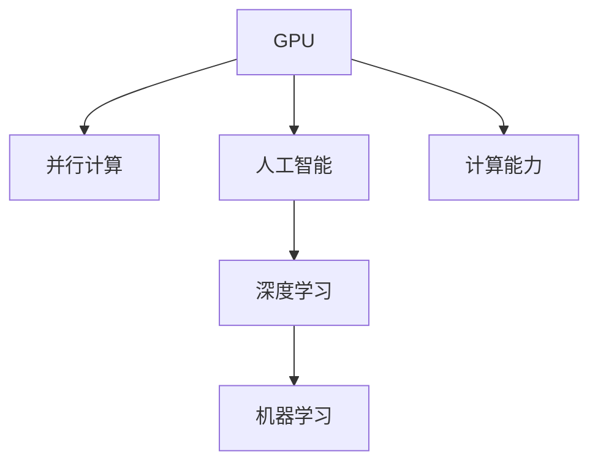

                 

# Nvidia的GPU与AI发展的关系

> 关键词：GPU, 人工智能, 深度学习, 机器学习, 计算能力

## 1. 背景介绍

### 1.1 问题由来
在过去的十年里，人工智能(AI)技术取得了显著的进步，特别是在深度学习和机器学习领域。这些技术的发展极大地推动了科学研究、商业应用和日常生活的各个方面。GPU（图形处理单元）的普及和优化，为人工智能的加速发展提供了至关重要的基础设施。

在AI的发展初期，CPU（中央处理器）被用来执行计算密集型任务。然而，随着深度学习模型的日益复杂，CPU在处理大规模矩阵计算和并行操作时显得力不从心。为了解决这一问题，Nvidia和其他公司推出了专门用于加速计算的GPU，这不仅显著提高了数据处理速度，还为大规模神经网络模型的训练提供了可能。

## 2. 核心概念与联系

### 2.1 核心概念概述

要理解Nvidia的GPU与AI发展的关系，我们需要掌握以下核心概念：

- **GPU**：图形处理单元，最初设计用于加速图像和视频处理。GPU具有高度并行化的架构，能够同时处理多个计算任务。
- **人工智能**：使计算机系统具备智能行为的技术，涉及机器学习、深度学习等。
- **深度学习**：一种机器学习技术，模仿人类大脑的神经网络结构，通过多层非线性变换进行数据处理和模式识别。
- **机器学习**：让计算机通过数据和算法自动学习模式和规律，并在新数据上做出预测。
- **计算能力**：指计算机在单位时间内执行的运算次数，直接影响AI模型的训练和推理速度。

这些概念相互关联，共同构成了现代AI技术的基础。GPU作为计算能力的关键组成部分，极大地推动了深度学习和机器学习的发展。

### 2.2 核心概念原理和架构的 Mermaid 流程图



这个流程图展示了GPU、并行计算、人工智能、深度学习和机器学习之间的关系。GPU通过提供并行计算能力，为AI模型的训练和推理提供了强大的计算支持。

## 3. 核心算法原理 & 具体操作步骤

### 3.1 算法原理概述

Nvidia的GPU加速了深度学习模型的训练和推理，其核心原理是通过并行计算加速矩阵和张量运算。GPU的架构设计使得它能够在单个芯片上处理成百上千的计算核心，大大提高了数据处理速度和效率。

深度学习模型通常由大量的参数组成，需要大量的计算资源进行优化。GPU的并行处理能力使得深度学习模型的训练时间从几天缩短到几小时，甚至几分钟。这对于大规模模型的训练和优化至关重要。

### 3.2 算法步骤详解

使用Nvidia GPU进行深度学习模型训练的步骤如下：

1. **数据准备**：将数据集加载到GPU内存中，并进行预处理和分批处理。

2. **模型定义**：使用深度学习框架（如TensorFlow、PyTorch等）定义模型结构。

3. **优化器选择**：选择合适的优化器（如SGD、Adam等）和超参数，如学习率、批大小等。

4. **模型训练**：将模型和数据集输入GPU，开始训练过程。

5. **模型评估**：在验证集上评估模型性能，并根据需要进行调整。

6. **模型部署**：将训练好的模型部署到实际应用中，进行推理预测。

### 3.3 算法优缺点

#### 优点：
- **高效计算**：GPU的并行计算能力使得深度学习模型的训练速度大大提升。
- **广泛的适用性**：支持各种深度学习框架和模型，适用范围广。
- **资源丰富**：Nvidia提供了多种GPU型号，满足不同规模和类型的AI应用需求。

#### 缺点：
- **能耗高**：GPU的高并行计算能力带来了较高的能耗，需要配套的高效散热系统。
- **成本高**：高性能GPU价格昂贵，对小型企业和小型项目可能是一个经济负担。
- **学习曲线陡峭**：需要掌握GPU编程和深度学习框架，对于新手来说学习成本较高。

### 3.4 算法应用领域

Nvidia的GPU在以下几个领域得到了广泛应用：

- **计算机视觉**：如图像识别、目标检测、图像分割等。
- **自然语言处理**：如文本分类、语言模型、机器翻译等。
- **语音识别**：如语音识别、语音合成等。
- **推荐系统**：如个性化推荐、广告推荐等。
- **游戏开发**：如实时渲染、动态场景生成等。
- **医疗健康**：如医学影像分析、疾病预测等。

## 4. 数学模型和公式 & 详细讲解

### 4.1 数学模型构建

深度学习模型通常由以下组成部分组成：

- **输入层**：接受原始数据，如图像像素、文本词向量等。
- **隐藏层**：进行特征提取和模式识别，包含多个全连接层和卷积层等。
- **输出层**：产生最终的预测结果，如分类标签、概率分布等。

数学上，深度学习模型可以被表示为一个有向无环图（DAG），每个节点代表一个计算步骤，每个边代表数据流或参数流。

### 4.2 公式推导过程

以一个简单的全连接神经网络为例，其前向传播的公式如下：

$$
h = g(Wx + b)
$$

其中，$h$ 是隐藏层输出，$x$ 是输入，$W$ 是权重矩阵，$b$ 是偏置项，$g$ 是非线性激活函数。

后向传播过程中，使用链式法则计算梯度：

$$
\frac{\partial L}{\partial W} = \frac{\partial L}{\partial h} \frac{\partial h}{\partial W}
$$

其中，$L$ 是损失函数，$\frac{\partial h}{\partial W}$ 是梯度。

### 4.3 案例分析与讲解

假设我们有一个手写数字识别的深度学习模型，使用MNIST数据集进行训练。模型由3个全连接层和ReLU激活函数组成。训练过程如下：

1. **数据准备**：将MNIST数据集加载到GPU内存中，并进行归一化处理。

2. **模型定义**：使用TensorFlow定义一个包含3个全连接层的神经网络，其中隐藏层包含256个神经元。

3. **优化器选择**：使用Adam优化器，设置学习率为0.001。

4. **模型训练**：将模型和数据集输入GPU，开始训练过程。使用批量大小为64，迭代100个epoch。

5. **模型评估**：在测试集上评估模型性能，计算准确率、损失值等指标。

6. **模型部署**：将训练好的模型部署到实际应用中，进行手写数字识别。

## 5. 项目实践：代码实例和详细解释说明

### 5.1 开发环境搭建

在开始实践前，需要搭建好开发环境。以下是一个使用TensorFlow和Nvidia GPU进行深度学习模型训练的示例环境配置。

1. **安装TensorFlow**：
   ```
   pip install tensorflow-gpu
   ```

2. **安装Nvidia GPU驱动和CUDA**：
   从Nvidia官网下载适用于自己GPU型号的驱动和CUDA版本，并按照官方指南进行安装。

3. **配置环境变量**：
   在环境变量中添加以下内容，以确保TensorFlow能够使用Nvidia GPU：
   ```
   export CUDA_VISIBLE_DEVICES=0
   export CUBLAS_WORKSPACE_CONFIG=4096:8
   ```

4. **安装TensorBoard**：
   ```
   pip install tensorboard
   ```

### 5.2 源代码详细实现

以下是一个使用TensorFlow和Nvidia GPU进行手写数字识别的深度学习模型训练的代码实现：

```python
import tensorflow as tf
from tensorflow.keras import layers

# 加载数据集
mnist = tf.keras.datasets.mnist
(x_train, y_train), (x_test, y_test) = mnist.load_data()

# 数据预处理
x_train, x_test = x_train / 255.0, x_test / 255.0

# 定义模型
model = tf.keras.models.Sequential([
    layers.Flatten(input_shape=(28, 28)),
    layers.Dense(256, activation='relu'),
    layers.Dense(10, activation='softmax')
])

# 编译模型
model.compile(optimizer='adam', loss='sparse_categorical_crossentropy', metrics=['accuracy'])

# 训练模型
model.fit(x_train, y_train, epochs=10, validation_data=(x_test, y_test))

# 评估模型
model.evaluate(x_test, y_test)
```

### 5.3 代码解读与分析

这个示例代码展示了使用TensorFlow进行深度学习模型训练的基本流程：

1. **数据加载和预处理**：加载MNIST数据集，并将数据归一化到[0,1]之间。

2. **模型定义**：定义一个包含2个全连接层的神经网络，其中隐藏层包含256个神经元，使用ReLU激活函数。

3. **模型编译**：使用Adam优化器和交叉熵损失函数进行模型编译。

4. **模型训练**：在GPU上使用批量大小为64的随机梯度下降（SGD）算法训练模型。

5. **模型评估**：在测试集上评估模型性能，输出准确率和损失值。

6. **模型部署**：在实际应用中，可以使用训练好的模型进行手写数字识别。

## 6. 实际应用场景

### 6.1 计算机视觉

Nvidia的GPU在计算机视觉领域得到了广泛应用，如图像识别、目标检测、图像分割等。例如，YOLO（You Only Look Once）模型在目标检测任务中表现优异，得益于Nvidia GPU的高并行计算能力。

### 6.2 自然语言处理

Nvidia的GPU在自然语言处理领域也有重要应用，如文本分类、语言模型、机器翻译等。BERT（Bidirectional Encoder Representations from Transformers）模型就是通过Nvidia GPU进行大规模预训练的，极大地推动了自然语言处理技术的发展。

### 6.3 语音识别

语音识别是Nvidia GPU在AI应用中的另一个重要领域。Nvidia的GPU能够高效处理大规模音频数据，使得语音识别模型的训练和推理变得可行。

### 6.4 推荐系统

Nvidia的GPU在推荐系统中的应用也非常广泛。例如，Netflix使用GPU加速推荐系统的训练，能够在短时间内处理大量的用户数据，提高推荐准确率。

## 7. 工具和资源推荐

### 7.1 学习资源推荐

1. **Nvidia官方文档**：Nvidia提供了丰富的官方文档和教程，涵盖了GPU编程、深度学习框架等方面的内容。

2. **Deep Learning Specialization**：由Andrew Ng教授主讲的深度学习课程，在Coursera上提供了丰富的学习资源。

3. **TensorFlow官方文档**：TensorFlow官方文档提供了详细的API参考和示例代码，方便开发者学习和实践。

4. **PyTorch官方文档**：PyTorch官方文档提供了丰富的教程和示例代码，适合学习和实践深度学习。

### 7.2 开发工具推荐

1. **Jupyter Notebook**：一款轻量级的交互式编程环境，支持GPU计算，方便开发者进行模型训练和调试。

2. **TensorBoard**：Nvidia提供的可视化工具，可以实时监测模型训练状态，并生成图表。

3. **Anaconda**：一款Python环境管理工具，可以方便地创建和管理虚拟环境，支持多种深度学习框架。

4. **CUDA Toolkit**：Nvidia提供的GPU编程工具包，支持GPU并行计算。

### 7.3 相关论文推荐

1. **"CUDA-Capabilities of NVIDIA"**：Nvidia官方论文，详细介绍了CUDA架构和GPU编程技术。

2. **"Deep Learning with PyTorch and CUDA"**：PyTorch官方教程，介绍了如何在Nvidia GPU上使用PyTorch进行深度学习模型训练。

3. **"GPU-Accelerated Deep Learning with TensorFlow"**：TensorFlow官方文档，介绍了如何在Nvidia GPU上使用TensorFlow进行深度学习模型训练。

## 8. 总结：未来发展趋势与挑战

### 8.1 研究成果总结

Nvidia的GPU加速了深度学习模型的训练和推理，推动了人工智能技术的发展。以下是几项重要的研究成果：

1. **深度学习加速**：通过并行计算能力，Nvidia GPU显著提升了深度学习模型的训练速度。

2. **大数据处理**：Nvidia GPU能够处理大规模数据集，支持深度学习模型的超大规模训练。

3. **高性能计算**：Nvidia GPU在计算密集型任务中表现优异，为AI技术提供了强大的计算支持。

### 8.2 未来发展趋势

未来，Nvidia的GPU将继续推动AI技术的发展，以下是几个重要的发展趋势：

1. **更高的计算能力**：随着Nvidia GPU的不断升级，计算能力将进一步提升，支持更大规模和更复杂的AI模型训练。

2. **更高效能比**：Nvidia GPU将进一步优化能效比，降低能耗，提高能效利用率。

3. **更多的应用场景**：Nvidia GPU将在更多领域得到应用，如自动驾驶、医疗健康、金融服务等。

### 8.3 面临的挑战

尽管Nvidia的GPU在AI领域取得了显著进展，但仍面临一些挑战：

1. **高成本**：高性能GPU价格昂贵，对小型企业和项目是一个经济负担。

2. **能耗问题**：Nvidia GPU的高计算能力带来了较高的能耗，需要配套的高效散热系统。

3. **学习曲线陡峭**：GPU编程和深度学习框架的学习曲线较陡峭，新手需要更多时间和资源进行学习和实践。

### 8.4 研究展望

未来的研究将集中在以下几个方面：

1. **更高效能比的GPU**：研发更高效的GPU架构，提升能效比，降低能耗。

2. **自动化优化**：开发自动化GPU优化工具，帮助开发者更轻松地进行模型训练和优化。

3. **跨平台兼容性**：增强GPU的跨平台兼容性，使得开发者能够更方便地在不同系统上使用Nvidia GPU。

4. **AI芯片集成**：将Nvidia GPU与其他AI芯片集成，构建更强大的AI计算平台。

总之，Nvidia的GPU与AI发展的关系是密不可分的，GPU的计算能力推动了AI技术的快速发展。未来，随着GPU技术的不断进步，人工智能将迎来更多突破和创新。

## 9. 附录：常见问题与解答

**Q1: GPU在AI训练中的作用是什么？**

A: GPU通过其并行计算能力，显著提升了深度学习模型的训练速度。GPU的高效性使得大规模神经网络模型的训练成为可能，加速了AI技术的发展。

**Q2: GPU在AI训练中如何优化？**

A: GPU可以通过以下几个方式进行优化：
1. **数据并行**：将数据切分成多个小批次，在多个GPU核心上并行计算。
2. **模型并行**：将大模型切分成多个子模型，在多个GPU上并行计算。
3. **异步计算**：在GPU计算过程中，允许不同的计算任务交替执行，提高计算效率。

**Q3: 如何选择适合的Nvidia GPU？**

A: 选择适合的Nvidia GPU需要考虑以下几个因素：
1. **计算能力**：根据深度学习模型的规模和复杂度，选择计算能力合适的GPU。
2. **内存大小**：根据数据集的大小和模型参数的数量，选择内存足够大的GPU。
3. **功耗和散热**：考虑实际应用的环境和设备散热需求，选择功耗合理、散热性能良好的GPU。

**Q4: GPU在AI训练中的性能瓶颈有哪些？**

A: GPU在AI训练中的性能瓶颈主要包括：
1. **内存带宽**：GPU的内存带宽有限，限制了数据传输速度。
2. **GPU内存不足**：大规模模型需要大量的内存，可能导致GPU内存不足。
3. **网络延迟**：GPU计算过程中，数据需要在GPU和CPU之间频繁传输，可能带来延迟问题。

**Q5: GPU在AI训练中的应用未来展望是什么？**

A: 未来，GPU在AI训练中的应用将更加广泛，包括：
1. **自动驾驶**：GPU将用于训练自动驾驶算法，提升车辆的安全性和可靠性。
2. **医疗健康**：GPU将用于医疗影像分析、疾病预测等，提高医疗诊断的准确性和效率。
3. **金融服务**：GPU将用于高频交易、风险管理等，提升金融服务的智能化水平。

总之，GPU与AI的发展密不可分，GPU的高效计算能力推动了AI技术的快速发展。未来，随着GPU技术的不断进步，人工智能将迎来更多突破和创新。

---

作者：禅与计算机程序设计艺术 / Zen and the Art of Computer Programming

