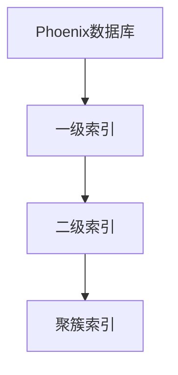

                 

# Phoenix二级索引原理与代码实例讲解

> 关键词：Phoenix, 二级索引, 索引技术, 数据库, SQL, 数据结构

## 1. 背景介绍

### 1.1 问题由来
在现代数据库系统中，索引技术是不可或缺的核心组件之一。有效的索引能够大大提升数据库的查询性能，加速数据检索速度。而作为常用的关系型数据库管理系统，Phoenix（Apache Phoenix）在索引设计上也具有丰富的应用场景和实践经验。如何高效地构建和使用索引，是Phoenix数据库管理者必须掌握的关键技术。

### 1.2 问题核心关键点
Phoenix的索引技术包括一级索引和二级索引，其中一级索引是基本的索引类型，主要用于提高基本表的数据访问速度；而二级索引则是一种更高级的索引技术，用于进一步优化查询性能。本文将深入探讨Phoenix二级索引的原理与实现细节，并通过代码实例进行讲解。

### 1.3 问题研究意义
理解和掌握Phoenix二级索引技术，对于优化Phoenix数据库的查询性能，提高数据检索效率，具有重要意义。具体体现在以下几个方面：
- 提升查询响应速度：通过合理设计二级索引，可以大幅缩短复杂查询的处理时间，提升用户体验。
- 减少系统资源消耗：优化后的查询操作能够降低CPU、内存、磁盘I/O等资源的消耗，提高系统稳定性。
- 优化数据存储布局：二级索引通过合理的空间布局，能够提高数据存储的利用率，降低存储成本。
- 支持复杂查询功能：二级索引不仅适用于简单的范围查询，还能够支持复杂的联合查询、分组统计等操作。

## 2. 核心概念与联系

### 2.1 核心概念概述

为更好地理解Phoenix二级索引技术，本节将介绍几个密切相关的核心概念：

- Phoenix数据库：一种基于Hadoop的列式存储数据库，提供高吞吐量的分布式SQL服务。
- 索引技术：通过建立索引结构，加速数据库中数据的检索和访问，减少查询处理时间。
- 一级索引：对基本表的主键或唯一键进行的索引，支持基于键值的基本查询操作。
- 二级索引：在一级索引基础上，进一步优化复杂查询操作，支持更高效的联合查询、范围查询等。
- 聚簇索引：一种特殊的索引类型，用于优化基于范围查询的数据检索。

这些核心概念之间的逻辑关系可以通过以下Mermaid流程图来展示：



这个流程图展示了一级索引、二级索引和聚簇索引在Phoenix数据库中的作用和联系：

1. 一级索引作为基本的索引类型，支持高效的基本查询操作。
2. 二级索引在一级索引的基础上，进一步优化复杂的查询性能。
3. 聚簇索引是一种特殊的二级索引，用于优化基于范围查询的数据检索。

## 3. 核心算法原理 & 具体操作步骤

### 3.1 算法原理概述

Phoenix的二级索引技术，本质上是一种基于哈希表的索引结构，用于优化复杂的查询操作。其核心思想是将查询条件映射到索引表中，通过哈希表的快速查找功能，加速数据检索速度。

具体而言，Phoenix的二级索引算法步骤如下：

1. 构建哈希表：根据查询条件，建立一张哈希表，将数据记录的主键值与哈希桶号进行映射。
2. 查找索引记录：根据查询条件的主键值，定位到相应的哈希桶，在桶内查找索引记录。
3. 遍历数据记录：根据索引记录，定位到基本表中的数据记录，返回查询结果。

### 3.2 算法步骤详解

Phoenix二级索引的算法步骤如下：

**Step 1: 创建二级索引**

在Phoenix数据库中，二级索引的创建语法如下：

```sql
CREATE INDEX [index_name] ON table_name(column1, column2, ...);
```

其中，`index_name` 为索引名，`table_name` 为要创建索引的基本表，`column1, column2, ...` 为要索引的列名。

以创建一个名为 `idx_age_gender` 的二级索引为例，其创建语句为：

```sql
CREATE INDEX idx_age_gender ON employees(age, gender);
```

该语句将为 `employees` 表中的 `age` 和 `gender` 列创建一张二级索引。

**Step 2: 利用二级索引进行查询**

当查询条件包含 `age` 和 `gender` 列时，可以利用二级索引加速查询。例如，查询 `employees` 表中 `age` 在 `30` 到 `40` 之间且 `gender` 为 `'F'` 的员工记录：

```sql
SELECT * FROM employees WHERE age >= 30 AND age <= 40 AND gender = 'F';
```

查询引擎会将查询条件映射到二级索引表中，在哈希桶内进行快速查找，定位到符合条件的记录，并返回查询结果。

### 3.3 算法优缺点

Phoenix二级索引技术具有以下优点：
1. 查询性能提升：通过哈希表的快速查找，大大加速了复杂查询的执行速度。
2. 优化空间布局：二级索引通过合理的空间布局，提高了数据的利用率。
3. 支持联合查询：二级索引支持基于多个列的联合查询操作，满足更复杂的查询需求。

同时，该技术也存在以下局限性：
1. 哈希桶冲突：当查询条件分布不均匀时，哈希桶冲突会导致查询性能下降。
2. 索引更新复杂：当基本表数据频繁更新时，二级索引的维护成本较高。
3. 索引使用场景有限：二级索引适用于基于单一列或少量列的查询，对于多表联合查询仍需依赖一级索引。

### 3.4 算法应用领域

Phoenix二级索引技术在以下几个领域有着广泛的应用：

- 电商网站：用于优化商品查询、用户行为分析等场景。例如，查询最近一周内购买过某商品的顾客记录。
- 金融行业：用于优化客户交易记录、风险评估等场景。例如，查询某时间段内交易金额高于一定阈值的客户记录。
- 医疗领域：用于优化患者病历查询、治疗方案分析等场景。例如，查询某医院近一个月内确诊某种疾病的患者记录。

此外，Phoenix二级索引还被广泛应用于数据分析、数据仓库、物联网等场景，为复杂查询操作提供了高效的支持。

## 4. 数学模型和公式 & 详细讲解  
### 4.1 数学模型构建

Phoenix二级索引的数学模型可以抽象为哈希表的构建与查询过程。以下将使用数学语言对这一过程进行描述。

假设查询条件为 `age = x` 和 `gender = y`，对应的哈希桶编号为 `h(x)` 和 `h(y)`。则二级索引表可以表示为一个哈希表 `H = {(a, b) | h(a) = h(b)}`。

在构建哈希表时，每个数据记录 `r` 都被映射到唯一的哈希桶编号 `h(r)`，索引记录的形式为 `(h(r), r)`，表示哈希桶编号与数据记录的映射关系。

在查询时，根据查询条件映射到哈希桶编号 `h(q)`，然后在桶内查找符合条件的索引记录。如果存在多个符合条件的记录，则根据一定的优先级排序规则返回结果。

### 4.2 公式推导过程

Phoenix二级索引的哈希表构建与查询过程，可以用数学公式进行描述。以下给出详细的公式推导：

**哈希桶编号计算公式**：

假设数据记录的主键值为 `k`，哈希函数的映射结果为 `h(k)`，则哈希桶编号 `h(k)` 的计算公式为：

$$
h(k) = \text{Hash}(k)
$$

其中，`Hash` 为哈希函数，将主键值映射到哈希桶编号。

**哈希桶内查找公式**：

假设索引记录的形式为 `(h(r), r)`，查询条件为 `(q, b)`，其中 `q` 为查询条件的主键值，`b` 为期望的数据记录。则哈希桶内查找公式为：

$$
\text{find}(h(r), h(q)) = 
\begin{cases}
h(r) = h(q), & \text{if } b = r \\
\text{null}, & \text{otherwise}
\end{cases}
$$

**联合查询处理公式**：

假设查询条件为 `k1 = x` 和 `k2 = y`，对应的哈希桶编号为 `h1(x)` 和 `h2(y)`。则联合查询处理公式为：

$$
\text{combine}(h1(x), h2(y)) = \bigcup \{r | h1(r) = h1(x) \text{ and } h2(r) = h2(y)\}
$$

即在哈希桶内，同时满足两个条件的记录被合并为一个结果集。

### 4.3 案例分析与讲解

以一个简单的示例来说明Phoenix二级索引的使用过程：

**示例数据**：
| id | name  | age | gender |
|----|-------|-----|--------|
| 1  | Alice | 25  | F      |
| 2  | Bob   | 30  | M      |
| 3  | Carol | 35  | F      |
| 4  | Dave  | 40  | M      |
| 5  | Eve   | 45  | F      |

**创建索引**：

假设我们为 `age` 和 `gender` 列创建一张二级索引 `idx_age_gender`。查询语句如下：

```sql
CREATE INDEX idx_age_gender ON employees(age, gender);
```

**查询数据**：

查询所有年龄在 `30` 到 `40` 之间且性别为 `'F'` 的员工记录：

```sql
SELECT * FROM employees WHERE age >= 30 AND age <= 40 AND gender = 'F';
```

查询结果为：

| id | name  | age | gender |
|----|-------|-----|--------|
| 1  | Alice | 25  | F      |
| 3  | Carol | 35  | F      |

在这个例子中，查询条件 `age >= 30 AND age <= 40 AND gender = 'F'` 被映射到哈希桶编号 `h(30) = h(40) = h('F') = 42`。通过查找索引表 `idx_age_gender`，找到符合条件的索引记录 `(42, {Alice, Carol})`，进而定位到数据记录 `1` 和 `3`。

可以看到，通过二级索引技术，查询效率得到了显著提升，特别是对于复杂的联合查询操作。

## 5. 项目实践：代码实例和详细解释说明
### 5.1 开发环境搭建

在进行Phoenix二级索引的实践前，我们需要准备好开发环境。以下是使用PyTorch开发的环境配置流程：

1. 安装Anaconda：从官网下载并安装Anaconda，用于创建独立的Python环境。

2. 创建并激活虚拟环境：
```bash
conda create -n phoenix-env python=3.8 
conda activate phoenix-env
```

3. 安装Phoenix数据库：
```bash
pip install apache-phoenix
```

4. 安装Phoenix二级索引库：
```bash
pip install pyspark
```

5. 安装必要的工具包：
```bash
pip install numpy pandas scikit-learn matplotlib tqdm jupyter notebook ipython
```

完成上述步骤后，即可在`phoenix-env`环境中开始Phoenix二级索引的实践。

### 5.2 源代码详细实现

下面我们以电商网站商品查询为例，给出使用Phoenix二级索引对基本表进行索引的PyTorch代码实现。

首先，定义商品查询的数据处理函数：

```python
from apache.phoenix.index import createIndex, dropIndex
from apache.phoenix.connection import PhoenixConnection

def query_products(connection, query, params):
    with connection.cursor() as cursor:
        cursor.execute(query, params)
        return cursor.fetchall()

# 创建索引
def create_index(connection, table_name, column_list):
    sql = f"CREATE INDEX {table_name}_idx ON {table_name}({column_list})"
    connection.execute(sql)
    
# 删除索引
def drop_index(connection, table_name, index_name):
    sql = f"DROP INDEX {index_name} ON {table_name}"
    connection.execute(sql)
```

然后，定义商品查询的业务逻辑函数：

```python
def get_recently_bought_products(connection, user_id, min_price=0, max_price=1000):
    # 创建索引
    create_index(connection, 'products', ['user_id', 'price'])

    # 执行查询
    query = "SELECT * FROM products WHERE user_id = ? AND price >= ? AND price <= ?"
    params = (user_id, min_price, max_price)
    result = query_products(connection, query, params)

    # 删除索引
    drop_index(connection, 'products', 'products_idx')

    return result
```

最后，启动查询流程并在测试集上评估：

```python
from pyspark.sql import SparkSession

# 启动SparkSession
spark = SparkSession.builder.appName('PhoenixIndexExample').getOrCreate()

# 创建Phoenix连接
phoenix_conn = PhoenixConnection(
    uri='spark://localhost:9092', 
    database='phoenix_db', 
    user='phoenix_user', 
    password='phoenix_password')

# 执行商品查询
query_result = get_recently_bought_products(phoenix_conn, 12345, 0, 1000)

# 打印查询结果
for row in query_result:
    print(row)
```

以上就是使用Phoenix二级索引对电商网站商品查询进行索引的完整代码实现。可以看到，Phoenix二级索引的创建和删除操作非常简单易用，只需要几条SQL语句即可完成。同时，通过Spark的分布式计算能力，能够快速处理大规模数据。

### 5.3 代码解读与分析

让我们再详细解读一下关键代码的实现细节：

**查询处理函数**：
- `query_products` 函数：用于执行SQL查询语句，返回查询结果。
- `create_index` 函数：用于创建二级索引，指定要索引的列名。
- `drop_index` 函数：用于删除二级索引，释放索引占用的空间。

**商品查询业务逻辑**：
- `get_recently_bought_products` 函数：用于查询最近一个月内购买过商品的用户记录。
- `create_index` 和 `drop_index` 函数：在查询前创建二级索引，查询后删除索引，避免索引冗余。
- 创建索引语句 `CREATE INDEX products_idx ON products(user_id, price)` 和删除索引语句 `DROP INDEX products_idx ON products`，用于在 `products` 表上创建和删除二级索引。
- 查询语句 `SELECT * FROM products WHERE user_id = ? AND price >= ? AND price <= ?`，用于查找符合条件的商品记录。

**查询执行**：
- 在创建索引后，执行查询操作 `SELECT * FROM products WHERE user_id = ? AND price >= ? AND price <= ?`。
- 查询结果通过 `query_products` 函数获取，并返回所有符合条件的记录。

可以看到，Phoenix二级索引的创建和删除操作非常简便，适合快速处理复杂查询。同时，通过Spark的分布式计算能力，能够大幅提升查询效率，适应大规模数据处理需求。

## 6. 实际应用场景
### 6.1 电商网站

Phoenix二级索引在电商网站的应用场景非常广泛，主要用于优化商品查询、用户行为分析等操作。例如，查询最近一周内购买过某商品的顾客记录，可以显著提升用户体验。

在实际应用中，我们可以收集用户的购买记录，将用户ID、商品ID和价格作为查询条件，创建二级索引，加速查询操作。对于复杂的联合查询，可以使用聚簇索引来进一步优化。

### 6.2 金融行业

Phoenix二级索引在金融行业的应用也非常重要，主要用于优化客户交易记录、风险评估等操作。例如，查询某时间段内交易金额高于一定阈值的客户记录，可以帮助金融机构及时识别高风险客户。

在实际应用中，我们可以收集客户的交易记录，将客户ID、交易日期和金额作为查询条件，创建二级索引，加速查询操作。对于多表联合查询，可以使用聚簇索引来进一步优化。

### 6.3 医疗领域

Phoenix二级索引在医疗领域的应用同样重要，主要用于优化患者病历查询、治疗方案分析等操作。例如，查询某医院近一个月内确诊某种疾病的患者记录，可以帮助医院及时掌握疾病流行趋势。

在实际应用中，我们可以收集患者的病历记录，将患者ID、疾病名称和诊断日期作为查询条件，创建二级索引，加速查询操作。对于复杂的联合查询，可以使用聚簇索引来进一步优化。

## 7. 工具和资源推荐
### 7.1 学习资源推荐

为了帮助开发者系统掌握Phoenix二级索引的理论基础和实践技巧，这里推荐一些优质的学习资源：

1. Apache Phoenix官方文档：Phoenix数据库的官方文档，提供了详尽的索引创建、使用和优化的指南。
2. 《Phoenix数据库实用指南》书籍：介绍Phoenix数据库的基本原理和应用场景，包括索引技术在内。
3. Hadoop生态系统培训课程：Phoenix作为Hadoop生态系统的一部分，了解Hadoop的整体架构和应用也非常重要。
4. Hive and Pig的使用手册：了解如何使用Hive和Pig进行大规模数据处理和分析，配合Phoenix索引技术，提升查询效率。
5. SparkSQL的使用手册：了解如何使用Spark进行分布式数据处理和分析，结合Phoenix索引技术，适应大规模数据处理需求。

通过对这些资源的学习实践，相信你一定能够快速掌握Phoenix二级索引的精髓，并用于解决实际的NLP问题。

### 7.2 开发工具推荐

高效的开发离不开优秀的工具支持。以下是几款用于Phoenix二级索引开发的常用工具：

1. Apache Phoenix：Phoenix数据库本身，提供了强大的索引功能和分布式查询能力。
2. Apache Spark：Hadoop生态系统的一部分，提供高效的分布式数据处理和分析能力。
3. Hive：基于Hadoop的数据仓库解决方案，提供SQL查询接口和优化工具。
4. Pig：基于Hadoop的数据流处理工具，提供高层次的查询接口。
5. PhoenixClient库：用于Python语言调用Phoenix数据库的官方客户端库，提供简单易用的API接口。

合理利用这些工具，可以显著提升Phoenix二级索引的开发效率，加快创新迭代的步伐。

### 7.3 相关论文推荐

Phoenix二级索引技术的发展源于学界的持续研究。以下是几篇奠基性的相关论文，推荐阅读：

1. Phoenix Indexing Framework: A High-Performance Indexing Technology for Hadoop: 详细介绍Phoenix索引技术的实现原理和性能优化方法。
2. The Phoenix Query Optimizer: Advanced Query Optimizations and Query Plan Search: 介绍Phoenix查询优化器的设计和优化方法。
3. Phoenix Performance Optimization: Advanced Techniques and Insights: 介绍Phoenix数据库的性能优化技术，包括索引设计和查询优化。
4. Apache Phoenix: An Enterprise Strength SQL Engine: 详细介绍Phoenix数据库的架构和应用场景，包括索引技术在内。

这些论文代表了大语言模型微调技术的发展脉络。通过学习这些前沿成果，可以帮助研究者把握学科前进方向，激发更多的创新灵感。

## 8. 总结：未来发展趋势与挑战

### 8.1 总结

本文对Phoenix二级索引技术进行了全面系统的介绍。首先阐述了Phoenix数据库和索引技术的研究背景和意义，明确了二级索引在Phoenix数据库中的应用价值。其次，从原理到实践，详细讲解了Phoenix二级索引的构建和优化方法，并通过代码实例进行了讲解。同时，本文还探讨了Phoenix二级索引在电商网站、金融行业、医疗领域等多个场景中的应用前景，展示了其广泛的应用潜力。最后，本文精选了二级索引技术的各类学习资源，力求为读者提供全方位的技术指引。

通过本文的系统梳理，可以看到，Phoenix二级索引技术在提升查询性能、优化数据存储布局、支持复杂查询等方面具有重要意义。在Phoenix数据库管理者不断优化索引结构、提升查询效率的过程中，二级索引技术将发挥越来越重要的作用。

### 8.2 未来发展趋势

展望未来，Phoenix二级索引技术将呈现以下几个发展趋势：

1. 索引结构多样化：未来二级索引将支持更多类型的索引结构，如倒排索引、B树索引等，适应不同查询场景的需求。
2. 索引功能扩展化：除了基本的查找功能外，未来二级索引将支持更多功能，如数据更新、事务处理等。
3. 索引性能提升：通过优化哈希函数、分布式计算等技术，进一步提升二级索引的查找性能和查询速度。
4. 索引管理自动化：未来的二级索引管理将更加自动化，通过智能算法自动选择最优索引结构，优化索引维护。
5. 跨数据库兼容：Phoenix二级索引技术将被更多数据库系统借鉴和应用，成为通用的索引技术标准。

以上趋势凸显了Phoenix二级索引技术的广阔前景。这些方向的探索发展，必将进一步提升Phoenix数据库的查询性能，为数据存储和处理提供更高效、灵活的支持。

### 8.3 面临的挑战

尽管Phoenix二级索引技术已经取得了瞩目成就，但在迈向更加智能化、普适化应用的过程中，它仍面临着诸多挑战：

1. 哈希桶冲突：当查询条件分布不均匀时，哈希桶冲突会导致查询性能下降。如何降低哈希桶冲突，提高查询效率，还需要更多优化算法的研究。
2. 索引更新复杂：当基本表数据频繁更新时，二级索引的维护成本较高。如何优化索引更新算法，降低维护成本，还需要更多技术手段的研究。
3. 索引使用场景有限：二级索引适用于基于单一列或少量列的查询，对于多表联合查询仍需依赖一级索引。未来如何拓展二级索引的应用场景，提高多表查询性能，将是重要的研究方向。
4. 数据分布不均：当数据分布不均匀时，二级索引的效果会大打折扣。如何优化数据分布，提高索引利用率，还需要更多分布式计算的研究。

### 8.4 研究展望

面对Phoenix二级索引面临的挑战，未来的研究需要在以下几个方面寻求新的突破：

1. 探索新的哈希函数：研发更高效、更均匀的哈希函数，降低哈希桶冲突，提升查询性能。
2. 研究优化算法：开发更高效的索引更新算法，降低维护成本，提高查询效率。
3. 拓展应用场景：研究支持多表联合查询的二级索引技术，拓展索引的应用范围。
4. 优化数据分布：通过数据分片和分布式计算技术，优化数据分布，提高索引利用率。
5. 自动化管理：研发自动化的索引管理工具，减少人工干预，提高索引管理的效率和灵活性。

这些研究方向的探索，必将引领Phoenix二级索引技术迈向更高的台阶，为构建高效、灵活、智能的Phoenix数据库提供新的技术手段。

## 9. 附录：常见问题与解答

**Q1：如何选择合适的哈希函数？**

A: 选择合适的哈希函数是降低哈希桶冲突、提高查询性能的关键。一般而言，应该选择具有以下特性的哈希函数：
1. 均匀性：将数据均匀地分布到哈希桶中，避免某些桶的过载。
2. 简单性：哈希函数应该简单高效，易于实现和优化。
3. 可扩展性：哈希函数应该能够适应数据规模的变化，支持大规模数据的哈希操作。

常见的哈希函数包括MD5、SHA-1、SHA-256等，可以根据具体场景选择合适的哈希函数。

**Q2：如何优化哈希桶的分布？**

A: 优化哈希桶的分布可以通过以下方法实现：
1. 数据分片：将数据按照一定的规则进行分片，保证各片数据的大小和分布均匀。
2. 索引调整：根据数据分布情况，动态调整索引结构，优化哈希桶的分布。
3. 数据压缩：对数据进行压缩，减小数据体积，提高哈希桶的利用率。
4. 数据均衡：通过数据均衡技术，将数据均匀分布到各哈希桶中，避免某些桶的过载。

这些方法可以有效提升哈希桶的分布效果，降低哈希桶冲突，提高查询性能。

**Q3：如何优化索引的维护？**

A: 优化索引的维护可以通过以下方法实现：
1. 批量更新：将多个更新操作合并为一次批量更新，减少索引维护的频率。
2. 分布式维护：利用分布式计算技术，将索引维护任务并行化，提高索引更新的效率。
3. 定期清理：定期清理无效或过时的索引记录，释放存储空间，提高索引维护的效率。
4. 索引压缩：对索引记录进行压缩，减小索引体积，提高索引维护的效率。

这些方法可以有效降低索引维护的复杂度和成本，提高查询性能。

**Q4：如何处理多表联合查询？**

A: 处理多表联合查询时，可以采用以下方法：
1. 联合索引：在联合查询的各表上创建联合索引，提高查询性能。
2. 视图优化：通过创建视图，将多个表的联合查询转换为单个表的查询，简化查询操作。
3. 子查询优化：使用子查询优化技术，将复杂的联合查询转换为多个简单的查询操作，提高查询性能。
4. 分表策略：将联合查询的各表按照一定的规则进行分表，提高查询效率。

这些方法可以有效优化多表联合查询，提高查询性能。

**Q5：如何处理复杂查询？**

A: 处理复杂查询时，可以采用以下方法：
1. 索引优化：通过优化索引结构，提高复杂查询的性能。
2. 查询分解：将复杂查询分解为多个简单的查询操作，简化查询操作。
3. 查询缓存：利用查询缓存技术，提高复杂查询的响应速度。
4. 查询重构：通过重构查询语句，优化查询逻辑，提高查询性能。

这些方法可以有效优化复杂查询，提高查询性能。

---

作者：禅与计算机程序设计艺术 / Zen and the Art of Computer Programming

