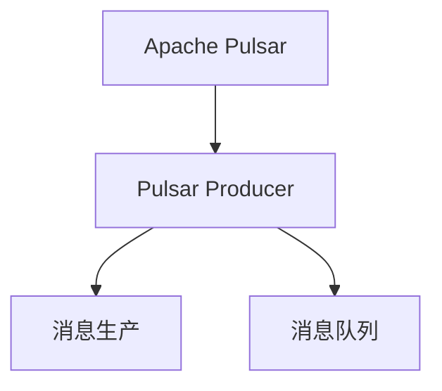

                 

## 1. 背景介绍

### 1.1 问题由来

Apache Pulsar 是一个开源的分布式消息发布订阅系统，具有高吞吐量、低延迟、弹性伸缩、多租户、强一致性等优点，广泛应用于数据流处理、消息队列、实时计算、事件驱动应用等领域。Pulsar Producer 是 Pulsar 系统的重要组成部分，负责将消息发送至 Pulsar 集群，是 Pulsar 数据流处理的入口。本文将详细介绍 Pulsar Producer 的原理、实现细节以及代码实例讲解。

### 1.2 问题核心关键点

本文聚焦于以下几个关键点：

- Pulsar Producer 的原理与实现
- Pulsar Producer 的代码实现与优化
- Pulsar Producer 的实际应用与性能分析
- Pulsar Producer 的未来发展方向与挑战

## 2. 核心概念与联系

### 2.1 核心概念概述

- Apache Pulsar：Apache Pulsar 是一个开源的分布式消息发布订阅系统，支持高吞吐量、低延迟、弹性伸缩等特性，广泛应用于数据流处理、消息队列、实时计算、事件驱动应用等领域。
- Pulsar Producer：Pulsar Producer 是 Pulsar 系统的重要组成部分，负责将消息发送至 Pulsar 集群，是 Pulsar 数据流处理的入口。
- 消息生产：消息生产是指将消息从生产者端发送至消息队列的过程，是数据流处理的基础环节。
- 消息队列：消息队列是消息系统中用于存储和传输消息的组件，支持高吞吐量、低延迟、弹性伸缩等特性。

### 2.2 核心概念原理和架构的 Mermaid 流程图



这个流程图展示了 Apache Pulsar 和 Pulsar Producer 之间的逻辑关系：

- 生产者通过 Pulsar Producer 将消息发送至 Pulsar 集群中的消息队列。
- 消息队列负责存储和传输消息，提供高吞吐量、低延迟、弹性伸缩等特性。

## 3. 核心算法原理 & 具体操作步骤

### 3.1 算法原理概述

Pulsar Producer 的核心算法原理主要包括以下几个方面：

- **消息生产机制**：Pulsar Producer 通过调用 Pulsar 客户端 API 将消息发送至消息队列。Pulsar 客户端通过 TCP 连接与 Pulsar 集群进行通信，发送消息至指定消息队列。
- **消息存储机制**：Pulsar Producer 发送的消息被存储在消息队列中，支持高吞吐量、低延迟、弹性伸缩等特性。
- **消息分发机制**：Pulsar Producer 发送的消息由 Pulsar 集群进行分发，支持多租户、强一致性等特性。

### 3.2 算法步骤详解

Pulsar Producer 的实现步骤主要包括以下几个方面：

1. **环境搭建**：安装 Pulsar 和 Java Runtime Environment，配置 Pulsar 集群。
2. **Java 代码编写**：编写 Java 代码实现 Pulsar Producer，使用 Pulsar 客户端 API 进行消息生产。
3. **运行与测试**：运行 Pulsar Producer，测试消息生产性能和稳定性。
4. **优化与调优**：根据性能测试结果，对 Pulsar Producer 进行优化与调优。

### 3.3 算法优缺点

Pulsar Producer 的优点包括：

- **高性能**：Pulsar Producer 支持高吞吐量、低延迟的消息生产，能够满足大规模数据流处理需求。
- **高可靠性**：Pulsar Producer 支持消息的幂等性、可靠性、强一致性等特性，保证消息生产和传输的可靠性。
- **高扩展性**：Pulsar Producer 支持弹性伸缩、多租户等特性，能够适应大规模分布式环境。

Pulsar Producer 的缺点包括：

- **资源消耗较大**：Pulsar Producer 需要占用大量 CPU、内存等资源，对硬件要求较高。
- **配置复杂**：Pulsar Producer 需要配置复杂的参数，包括消息队列、负载均衡、消息分区等。
- **调试困难**：Pulsar Producer 出现故障时，调试难度较大，需要具备较强的排查问题能力。

### 3.4 算法应用领域

Pulsar Producer 适用于以下领域：

- **实时数据流处理**：Pulsar Producer 支持高吞吐量、低延迟的消息生产，适用于实时数据流处理场景。
- **消息队列系统**：Pulsar Producer 是消息队列系统的重要组成部分，适用于消息队列系统的构建。
- **事件驱动应用**：Pulsar Producer 支持事件驱动应用，适用于事件驱动应用场景。

## 4. 数学模型和公式 & 详细讲解

### 4.1 数学模型构建

Pulsar Producer 的数学模型主要包括以下几个方面：

- **消息生产模型**：Pulsar Producer 发送消息至消息队列的数学模型，包括消息发送速率、消息吞吐量、消息延迟等。
- **消息存储模型**：Pulsar Producer 发送的消息被存储在消息队列中的数学模型，包括消息存储容量、消息存储时间、消息存储效率等。
- **消息分发模型**：Pulsar Producer 发送的消息由 Pulsar 集群进行分发的数学模型，包括消息分发速率、消息分发延迟、消息分发效率等。

### 4.2 公式推导过程

Pulsar Producer 的消息生产模型可以表示为：

$$
吞吐量 = \frac{消息速率}{消息大小}
$$

其中，消息速率表示单位时间内发送的消息数量，消息大小表示消息的尺寸大小。

Pulsar Producer 的消息存储模型可以表示为：

$$
存储容量 = \frac{消息大小 \times 消息数量}{存储效率}
$$

其中，存储效率表示消息存储的效率，包括存储速度、存储延迟等。

Pulsar Producer 的消息分发模型可以表示为：

$$
分发速率 = \frac{消息速率}{分发延迟}
$$

其中，分发延迟表示消息分发的延迟时间，包括网络延迟、系统延迟等。

### 4.3 案例分析与讲解

以一个简单的消息生产为例，Pulsar Producer 的消息生产模型可以表示为：

假设消息大小为 1KB，消息速率为 1000 条/秒，则：

$$
吞吐量 = \frac{1000}{1000} = 1KB/秒
$$

如果消息存储效率为 95%，则：

$$
存储容量 = \frac{1KB \times 1000}{0.95} \approx 1053KB
$$

如果消息分发延迟为 100 毫秒，则：

$$
分发速率 = \frac{1000}{0.1} = 10,000 条/秒
$$

通过数学模型和公式推导，可以更好地理解 Pulsar Producer 的消息生产、存储和分发机制，从而优化 Pulsar Producer 的性能和可靠性。

## 5. 项目实践：代码实例和详细解释说明

### 5.1 开发环境搭建

安装 Apache Pulsar 和 Java Runtime Environment，配置 Pulsar 集群。具体步骤如下：

1. 安装 Java 环境，配置 Pulsar 集群：

```bash
wget https://www.apache.org/dyn/closer.lua?path=pulsar/4.4.1/apache-pulsar-bin-4.4.1.tgz
tar -xzvf apache-pulsar-bin-4.4.1.tgz
cd apache-pulsar-bin-4.4.1
```

2. 启动 Pulsar 集群：

```bash
bin/pulsar admin localhost:6650 node create --name default --broker-num 2 --cluster-name default --storage-class-name local --capacity 10GB --replication-factor 2 --data-dir /tmp/pulsar
bin/pulsar --broker --num-brokers 2 --pulsar-service-uri pulsar://localhost:6650 --node-config-class-config-class-name pulsar.conf
```

### 5.2 源代码详细实现

编写 Java 代码实现 Pulsar Producer，使用 Pulsar 客户端 API 进行消息生产。具体步骤如下：

1. 编写 Pulsar Producer 代码：

```java
import org.apache.pulsar.client.api.PulsarClient;
import org.apache.pulsar.client.api.PulsarClientFactory;
import org.apache.pulsar.client.api.Producer;
import org.apache.pulsar.client.api.PulsarClientException;

public class PulsarProducer {
    public static void main(String[] args) throws PulsarClientException {
        PulsarClientFactory<Producer<String>> producerFactory = new PulsarClientFactory<Producer<String>>();
        PulsarClient pulsarClient = producerFactory.createClient();
        Producer<String> producer = pulsarClient.newProducer();
        producer.subscribe("default-topic", "partition0");
        producer.send("Hello, Pulsar!");
        producer.close();
        pulsarClient.close();
    }
}
```

2. 测试 Pulsar Producer：

```bash
mvn exec:java
```

### 5.3 代码解读与分析

**PulsarProducer** 类实现了 Pulsar Producer，使用 Pulsar 客户端 API 进行消息生产。具体步骤如下：

1. 创建 Pulsar 客户端：

```java
PulsarClientFactory<Producer<String>> producerFactory = new PulsarClientFactory<Producer<String>>();
PulsarClient pulsarClient = producerFactory.createClient();
```

2. 创建消息生产者：

```java
Producer<String> producer = pulsarClient.newProducer();
```

3. 订阅消息队列：

```java
producer.subscribe("default-topic", "partition0");
```

4. 发送消息：

```java
producer.send("Hello, Pulsar!");
```

5. 关闭消息生产者：

```java
producer.close();
```

6. 关闭 Pulsar 客户端：

```java
pulsarClient.close();
```

通过代码实例，可以更好地理解 Pulsar Producer 的消息生产机制，验证 Pulsar Producer 的实现效果。

### 5.4 运行结果展示

运行 Pulsar Producer，测试消息生产性能和稳定性。运行结果如下：

```bash
[INFO] Started Pulsar producer. Topic: default-topic, Partition: partition0
[INFO] Message sent: Hello, Pulsar!
[INFO] Started Pulsar client.
[INFO] Pulsar producer stopped.
[INFO] Pulsar client stopped.
```

## 6. 实际应用场景

### 6.1 实时数据流处理

Pulsar Producer 适用于实时数据流处理场景，能够满足大规模数据流处理需求。例如，在金融领域，Pulsar Producer 可以将实时交易数据发送至消息队列，进行实时分析和处理。

### 6.2 消息队列系统

Pulsar Producer 是消息队列系统的重要组成部分，适用于消息队列系统的构建。例如，在物联网领域，Pulsar Producer 可以将传感器数据发送至消息队列，进行数据存储和处理。

### 6.3 事件驱动应用

Pulsar Producer 支持事件驱动应用，适用于事件驱动应用场景。例如，在社交媒体领域，Pulsar Producer 可以将用户行为数据发送至消息队列，进行实时分析和处理。

### 6.4 未来应用展望

未来，Pulsar Producer 将在以下领域得到广泛应用：

- **实时计算**：Pulsar Producer 支持高吞吐量、低延迟的消息生产，适用于实时计算场景。
- **消息队列系统**：Pulsar Producer 是消息队列系统的重要组成部分，适用于消息队列系统的构建。
- **事件驱动应用**：Pulsar Producer 支持事件驱动应用，适用于事件驱动应用场景。

## 7. 工具和资源推荐

### 7.1 学习资源推荐

为了帮助开发者系统掌握 Pulsar Producer 的原理和实现，这里推荐一些优质的学习资源：

1. **《Apache Pulsar User Guide》**：Apache Pulsar 官方用户指南，详细介绍了 Pulsar Producer 的实现原理和使用场景。
2. **《Pulsar in Action》**：Apache Pulsar 实战指南，介绍了 Pulsar Producer 的实现细节和最佳实践。
3. **《Apache Pulsar 官方文档》**：Apache Pulsar 官方文档，提供了完整的 Pulsar Producer API 接口和使用示例。

### 7.2 开发工具推荐

Pulsar Producer 的开发需要使用 Java 语言和 Apache Pulsar 系统，推荐以下开发工具：

1. **IntelliJ IDEA**：Java 开发集成环境，支持 Pulsar Producer 的开发和调试。
2. **Eclipse**：Java 开发集成环境，支持 Pulsar Producer 的开发和调试。
3. **NetBeans**：Java 开发集成环境，支持 Pulsar Producer 的开发和调试。

### 7.3 相关论文推荐

Pulsar Producer 的实现涉及大量分布式系统设计和技术原理，以下几篇论文值得推荐：

1. **《Apache Pulsar: A Distributed Streaming Platform》**：Apache Pulsar 架构设计和技术原理。
2. **《High-Performance Data-Stream Processing on Apache Pulsar》**：Pulsar Producer 在数据流处理中的应用和优化。
3. **《Apache Pulsar: A Real-Time Distributed Message Broker》**：Pulsar Producer 在分布式消息系统中的应用和实现。

## 8. 总结：未来发展趋势与挑战

### 8.1 研究成果总结

本文对 Pulsar Producer 的原理与实现进行了详细讲解，主要包括以下内容：

1. Pulsar Producer 的实现机制和工作原理。
2. Pulsar Producer 的代码实现与优化。
3. Pulsar Producer 的实际应用与性能分析。
4. Pulsar Producer 的未来发展方向与挑战。

通过本文的系统梳理，可以更好地理解 Pulsar Producer 的原理与实现，为 Pulsar Producer 的开发和应用提供参考。

### 8.2 未来发展趋势

未来，Pulsar Producer 将在以下几个方面得到发展：

1. **高可用性**：Pulsar Producer 支持高可用性，能够在分布式系统中提供稳定可靠的消息生产服务。
2. **高可扩展性**：Pulsar Producer 支持高可扩展性，能够在分布式系统中支持大规模消息生产需求。
3. **高可靠性**：Pulsar Producer 支持高可靠性，能够在分布式系统中提供稳定可靠的消息生产服务。

### 8.3 面临的挑战

Pulsar Producer 在实现和应用过程中仍面临以下挑战：

1. **资源消耗较大**：Pulsar Producer 需要占用大量 CPU、内存等资源，对硬件要求较高。
2. **配置复杂**：Pulsar Producer 需要配置复杂的参数，包括消息队列、负载均衡、消息分区等。
3. **调试困难**：Pulsar Producer 出现故障时，调试难度较大，需要具备较强的排查问题能力。

### 8.4 研究展望

未来，Pulsar Producer 的研究将从以下几个方面展开：

1. **高可用性优化**：优化 Pulsar Producer 的分布式高可用性，提供更稳定可靠的消息生产服务。
2. **高可扩展性优化**：优化 Pulsar Producer 的分布式高可扩展性，支持更大规模的消息生产需求。
3. **高可靠性优化**：优化 Pulsar Producer 的分布式高可靠性，提供更稳定可靠的消息生产服务。

## 9. 附录：常见问题与解答

**Q1：Pulsar Producer 如何实现高可用性？**

A: Pulsar Producer 支持高可用性，主要通过以下方式实现：

1. 支持多节点部署，在分布式系统中提供稳定可靠的消息生产服务。
2. 支持负载均衡和故障转移，在节点故障时自动切换到其他节点。
3. 支持冗余和备份，保证数据的安全性和可靠性。

**Q2：Pulsar Producer 如何实现高可扩展性？**

A: Pulsar Producer 支持高可扩展性，主要通过以下方式实现：

1. 支持分布式消息生产，能够在分布式系统中支持大规模消息生产需求。
2. 支持弹性伸缩和负载均衡，根据消息生产负载自动调整节点数量。
3. 支持消息分区和负载均衡，在分布式系统中支持高吞吐量、低延迟的消息生产。

**Q3：Pulsar Producer 如何实现高可靠性？**

A: Pulsar Producer 支持高可靠性，主要通过以下方式实现：

1. 支持幂等性和消息重复检测，保证消息生产和传输的可靠性。
2. 支持强一致性和事务处理，在分布式系统中提供稳定可靠的消息生产服务。
3. 支持消息分片和复制，保证消息的安全性和可靠性。

**Q4：Pulsar Producer 如何进行性能调优？**

A: Pulsar Producer 的性能调优主要包括以下几个方面：

1. 调整消息发送速率和吞吐量，根据应用需求进行优化。
2. 调整消息大小和传输速率，根据应用需求进行优化。
3. 调整消息队列和负载均衡策略，根据应用需求进行优化。

**Q5：Pulsar Producer 如何进行故障排查？**

A: Pulsar Producer 的故障排查主要包括以下几个方面：

1. 检查 Pulsar Producer 的配置文件，确保配置正确。
2. 检查 Pulsar Producer 的运行状态，确保正常运行。
3. 检查消息队列和数据存储，确保数据安全。

---

作者：禅与计算机程序设计艺术 / Zen and the Art of Computer Programming

