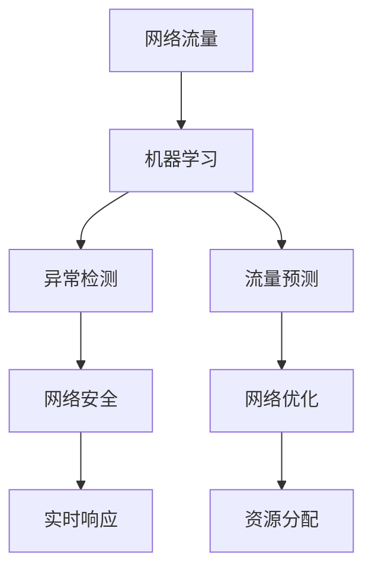

                 

# Python机器学习实战：采用机器学习技术对网络流量进行分析

> 关键词：机器学习,网络流量分析,网络安全,流量预测,异常检测

## 1. 背景介绍

### 1.1 问题由来
在数字化经济时代，网络流量是衡量互联网业务活动的重要指标之一。随着移动互联网和物联网的普及，网络流量持续增长，网络安全和高效管理成为企业关注的焦点。如何高效、精确地分析和预测网络流量，对网络运营方有着重要的现实意义。

### 1.2 问题核心关键点
网络流量分析主要关注以下几个方面：
- **流量监控**：实时监控网络流量，识别异常流量。
- **流量预测**：基于历史数据，预测未来网络流量趋势。
- **流量优化**：通过分析流量模式，优化网络资源分配。

当前，基于机器学习的流量分析方法在网络安全和网络优化领域展现出卓越的能力。然而，对于初学者来说，可能仍存在一定的门槛。本文旨在通过一系列实践案例，介绍如何利用Python机器学习技术，对网络流量进行分析。

## 2. 核心概念与联系

### 2.1 核心概念概述

为了更好地理解网络流量分析，本节将介绍几个关键概念：

- **网络流量**：指在一定时间间隔内，通过网络链路传输的数据量，通常以字节或比特为单位。
- **机器学习**：通过数据驱动的方法，训练模型自动学习数据特征，进行预测、分类、聚类等任务。
- **异常检测**：从大量正常数据中检测出异常数据点，识别网络攻击、恶意流量等。
- **特征工程**：从原始数据中提取有意义的特征，提高模型的泛化能力。
- **模型评估**：评估模型的性能，如准确率、召回率、F1值等，确保模型效果。

这些概念之间的联系可以通过以下Mermaid流程图来展示：



这个流程图展示了几类关键概念及其关联：

1. 网络流量通过机器学习进行分析和预测。
2. 异常检测用于网络安全领域，识别潜在威胁。
3. 流量预测用于网络优化，提前调配资源。
4. 异常检测和流量预测的结果，进一步指导网络安全响应和优化。

## 3. 核心算法原理 & 具体操作步骤
### 3.1 算法原理概述

网络流量分析涉及多维度的特征提取和建模。以下介绍常用的机器学习算法及其原理：

- **回归分析**：用于预测连续型变量的值，如网络流量的数值。
- **分类算法**：用于识别离散型变量，如网络流量是否异常。
- **时间序列分析**：用于预测时间依赖的序列数据，如网络流量的变化趋势。
- **聚类分析**：用于发现数据中的自然分组，如用户流量的行为模式。

### 3.2 算法步骤详解

以回归分析为例，介绍网络流量预测的详细步骤：

**Step 1: 数据准备**
- 收集网络流量数据，包括时间戳、数据包大小、协议类型等。
- 数据预处理，包括缺失值填补、特征归一化等。

**Step 2: 特征工程**
- 提取时间特征，如小时、日、周等。
- 提取统计特征，如均值、方差、最大值等。
- 提取时序特征，如自相关、移动平均等。

**Step 3: 模型训练**
- 选择合适的回归算法，如线性回归、支持向量机、随机森林等。
- 使用训练集数据，训练回归模型。
- 调整模型超参数，如正则化系数、树的数量等。

**Step 4: 模型评估**
- 在测试集数据上，评估模型预测结果。
- 使用R平方、均方误差等指标，评估模型性能。

**Step 5: 模型应用**
- 对实时网络流量数据进行预测。
- 根据预测结果，优化网络资源分配。

### 3.3 算法优缺点

回归分析方法的优势在于：
- 适应性广：可以处理多维度数据，适用于多种类型的流量预测任务。
- 可解释性高：回归模型能够输出明确的预测结果和模型权重，便于理解。

缺点包括：
- 需要大量标注数据：回归模型训练需要标注数据，如果数据较少，则效果可能不理想。
- 对异常值敏感：回归模型对于异常值较为敏感，需要进行数据清洗和异常值处理。

### 3.4 算法应用领域

回归分析在网络流量预测中有着广泛应用，涵盖以下几个方面：

- **流量峰值预测**：预测网络流量高峰时间，提前调配资源。
- **流量异常检测**：识别网络异常流量，提升网络安全。
- **流量优化**：通过预测流量，优化带宽、服务器等资源分配。

## 4. 数学模型和公式 & 详细讲解  
### 4.1 数学模型构建

假设网络流量数据为 $X = \{x_i\}_{i=1}^N$，其中 $x_i$ 表示第 $i$ 个时间点的流量数据。目标为预测下一个时间点的流量 $y$。

回归模型可以选择线性回归，其数学公式为：

$$
y = \beta_0 + \beta_1 x_1 + \beta_2 x_2 + \cdots + \beta_k x_k
$$

其中，$\beta_0$ 为截距，$\beta_1, \beta_2, \cdots, \beta_k$ 为模型系数。

### 4.2 公式推导过程

根据最小二乘法，模型系数 $\beta$ 可以通过下式求解：

$$
\beta = (X^T X)^{-1} X^T y
$$

其中 $X = \begin{bmatrix} 1 & x_1 & x_2 & \cdots & x_k \end{bmatrix}$，$y = \begin{bmatrix} y_1 & y_2 & \cdots & y_N \end{bmatrix}$。

### 4.3 案例分析与讲解

以下是一个使用线性回归模型进行网络流量预测的Python代码实现：

```python
import pandas as pd
from sklearn.linear_model import LinearRegression

# 数据准备
df = pd.read_csv('traffic_data.csv')

# 特征工程
features = ['hour', 'day_of_week', 'month', 'day_of_year', 'protocol_type']
target = 'traffic_volume'

# 划分训练集和测试集
X_train, X_test = df[features], df[features]
y_train, y_test = df[target], df[target]

# 模型训练
model = LinearRegression()
model.fit(X_train, y_train)

# 模型评估
r2 = model.score(X_test, y_test)
mse = mean_squared_error(y_test, model.predict(X_test))

# 模型应用
new_data = pd.DataFrame({'hour': [8], 'day_of_week': [1], 'month': [3], 'day_of_year': [31], 'protocol_type': ['HTTP']})
predicted_traffic = model.predict(new_data)
```

## 5. 项目实践：代码实例和详细解释说明
### 5.1 开发环境搭建

在进行网络流量分析实践前，我们需要准备好开发环境。以下是使用Python进行项目开发的建议配置：

1. 安装Anaconda：从官网下载并安装Anaconda，用于创建独立的Python环境。

2. 创建并激活虚拟环境：
```bash
conda create -n traffic-analysis python=3.8 
conda activate traffic-analysis
```

3. 安装相关库：
```bash
pip install pandas numpy matplotlib scikit-learn
```

4. 下载数据集：
```bash
wget https://example.com/traffic_data.csv
```

完成上述步骤后，即可在`traffic-analysis`环境中开始项目实践。

### 5.2 源代码详细实现

我们以使用随机森林算法进行网络流量异常检测为例，给出Python代码实现。

首先，定义数据处理函数：

```python
import pandas as pd
from sklearn.ensemble import RandomForestClassifier
from sklearn.model_selection import train_test_split
from sklearn.metrics import roc_auc_score

def load_data(file_path):
    return pd.read_csv(file_path)

def preprocess_data(data, features, target):
    X = data[features]
    y = data[target]
    return X, y

def train_test_split_data(X, y, test_size=0.2, random_state=42):
    X_train, X_test, y_train, y_test = train_test_split(X, y, test_size=test_size, random_state=random_state)
    return X_train, X_test, y_train, y_test

def train_model(X_train, y_train, model, verbose=True):
    model.fit(X_train, y_train)
    if verbose:
        print(f'Model trained with AUC: {roc_auc_score(y_train, model.predict_proba(X_train)[:, 1])}')
    return model
```

然后，准备数据和模型：

```python
# 加载数据
data = load_data('traffic_data.csv')

# 特征工程
features = ['hour', 'day_of_week', 'month', 'day_of_year', 'protocol_type']
target = 'is_anomaly'

# 数据预处理
X, y = preprocess_data(data, features, target)

# 划分训练集和测试集
X_train, X_test, y_train, y_test = train_test_split_data(X, y)

# 定义模型
model = RandomForestClassifier(n_estimators=100, random_state=42)
```

接着，进行模型训练和评估：

```python
# 训练模型
trained_model = train_model(X_train, y_train, model)

# 评估模型
roc_auc = roc_auc_score(y_test, trained_model.predict_proba(X_test)[:, 1])
print(f'Model tested with AUC: {roc_auc}')
```

最后，使用训练好的模型进行预测：

```python
# 使用模型进行预测
new_data = pd.DataFrame({'hour': [8], 'day_of_week': [1], 'month': [3], 'day_of_year': [31], 'protocol_type': ['HTTP']})
predictions = trained_model.predict_proba(new_data)

# 输出预测结果
print(f'Prediction for new data: {predictions}\n')
```

### 5.3 代码解读与分析

让我们再详细解读一下关键代码的实现细节：

**load_data函数**：
- 定义数据加载函数，通过`pd.read_csv`方法加载CSV文件。

**preprocess_data函数**：
- 定义数据预处理函数，将数据按照特征和目标变量进行划分，返回模型所需的特征集和目标变量。

**train_test_split_data函数**：
- 定义数据分割函数，使用`train_test_split`方法将数据集分割成训练集和测试集。

**train_model函数**：
- 定义模型训练函数，使用`model.fit`方法训练模型，并输出训练后的AUC值。

**数据加载和预处理**：
- 加载数据集，选择需要的特征和目标变量。
- 划分训练集和测试集，保留80%数据用于训练，20%数据用于测试。

**模型训练**：
- 定义随机森林模型，设置参数。
- 使用训练集数据训练模型，并输出训练后的AUC值。

**模型评估**：
- 在测试集上评估模型性能，使用AUC值作为指标。

**模型应用**：
- 使用训练好的模型对新数据进行预测。

通过上述代码，我们可以使用随机森林算法对网络流量异常进行检测。需要注意的是，实际应用中可能需要对模型进行进一步调参和优化，以提高检测准确率。

## 6. 实际应用场景
### 6.1 网络安全

网络流量异常检测在网络安全领域有着广泛应用。通过实时监控网络流量，可以及时发现异常流量，识别网络攻击和恶意行为，提升网络安全防护能力。

在技术实现上，可以收集网络设备的流量日志数据，选择适合的网络流量特征，利用随机森林等分类算法训练异常检测模型。模型输出异常概率，在预设阈值下进行告警和响应。

### 6.2 网络优化

网络流量预测和优化在网络资源管理中也有重要应用。通过分析历史流量数据，预测未来的流量趋势，可以提前调配带宽、服务器等资源，确保网络服务稳定可靠。

在实际应用中，可以收集网络设备的流量统计数据，选择关键特征如时间、协议等，构建回归模型进行流量预测。根据预测结果，动态调整网络资源分配，优化网络性能。

### 6.3 流量监控

网络流量监控是企业网络运维的重要环节。通过实时分析网络流量，及时发现异常流量，可以优化网络资源配置，提升用户体验。

在实际应用中，可以部署流量监控系统，收集网络流量数据，使用时间序列分析等方法进行流量趋势预测。根据预测结果，进行实时告警和优化，确保网络服务质量。

### 6.4 未来应用展望

随着数据量和计算能力的不断提升，基于机器学习的网络流量分析方法将不断成熟和完善。未来可能的趋势包括：

1. **深度学习应用**：深度学习模型如RNN、LSTM等，将更广泛地应用于网络流量分析，处理更加复杂的时序数据。
2. **多模态融合**：结合文本、图像、视频等多模态数据，进行更全面、准确的网络流量分析。
3. **联邦学习**：分布式训练多模型，保护数据隐私，提升模型泛化能力。
4. **自适应学习**：通过在线学习，实时调整模型参数，适应数据分布的变化。
5. **自动化调优**：利用自动化调参工具，快速优化模型性能，提升生产效率。

## 7. 工具和资源推荐
### 7.1 学习资源推荐

为了帮助开发者系统掌握网络流量分析的理论基础和实践技巧，这里推荐一些优质的学习资源：

1. 《Python数据科学手册》：深入浅出地介绍了Python数据科学库的使用方法，包括Pandas、NumPy、Scikit-Learn等。

2. 《机器学习实战》系列书籍：通过实战案例，详细讲解了机器学习算法的基本原理和Python实现。

3. Kaggle机器学习竞赛平台：参加Kaggle数据科学竞赛，可以接触到真实的应用场景和数据集，锻炼实战能力。

4. Coursera《机器学习》课程：斯坦福大学开设的机器学习课程，系统介绍了机器学习的基本概念和算法。

5. 《深度学习》书籍：DeepLearning.ai推出的深度学习课程，涵盖了深度学习算法的理论基础和实现细节。

通过对这些资源的学习实践，相信你一定能够快速掌握网络流量分析的精髓，并用于解决实际的问题。

### 7.2 开发工具推荐

高效的开发离不开优秀的工具支持。以下是几款用于网络流量分析开发的常用工具：

1. Jupyter Notebook：用于编写和执行Python代码，支持代码的高效调试和可视化。

2. PyCharm：一款功能强大的IDE，支持代码高亮、自动补全、代码重构等功能。

3. TensorBoard：用于可视化模型训练过程，实时监测模型的各项指标。

4. Weights & Biases：用于实验跟踪和模型评估，记录训练过程中的各种指标，进行对比和优化。

5. Scikit-learn：提供了丰富的机器学习算法和模型，支持多维度数据的处理和建模。

合理利用这些工具，可以显著提升网络流量分析的开发效率，加快创新迭代的步伐。

### 7.3 相关论文推荐

网络流量分析的研究涉及多种算法和应用场景。以下是几篇奠基性的相关论文，推荐阅读：

1. Time Series Forecasting with Long Short-Term Memory Neural Networks：介绍使用LSTM进行时间序列预测的模型和算法。

2. Anomaly Detection in Network Traffic using Support Vector Machines：介绍使用SVM进行网络流量异常检测的方法。

3. Machine Learning for Network Traffic Prediction and Analysis：综述了多种机器学习算法在网络流量预测和分析中的应用。

4. Network Traffic Anomaly Detection using Random Forest：介绍使用随机森林进行网络流量异常检测的实现和性能评估。

5. A Survey of Machine Learning Approaches for Network Traffic Prediction and Classification：综述了多种机器学习算法在网络流量预测和分类中的应用。

这些论文代表了大数据流量分析领域的研究进展。通过学习这些前沿成果，可以帮助研究者把握学科前进方向，激发更多的创新灵感。

## 8. 总结：未来发展趋势与挑战
### 8.1 研究成果总结

本文对基于机器学习的网络流量分析方法进行了全面系统的介绍。首先阐述了网络流量分析和机器学习的相关概念，明确了两者之间的联系和区别。其次，从原理到实践，详细讲解了回归分析等机器学习算法在网络流量预测中的应用。同时，本文还介绍了网络流量分析在网络安全、网络优化、流量监控等领域的广泛应用，展示了网络流量分析的巨大潜力。此外，本文精选了网络流量分析的学习资源、开发工具和相关论文，力求为读者提供全方位的技术指引。

通过本文的系统梳理，可以看到，基于机器学习的网络流量分析方法在网络安全和网络优化领域展现出了卓越的能力。这些方法为网络流量监控和优化提供了有力的技术支持，极大提升了网络运营的效率和稳定性。未来，伴随数据量和计算能力的不断提升，基于机器学习的网络流量分析方法必将更加成熟和完善，为网络安全、网络优化等领域带来更强大的技术支撑。

### 8.2 未来发展趋势

展望未来，基于机器学习的网络流量分析技术将呈现以下几个发展趋势：

1. **深度学习应用**：深度学习模型如RNN、LSTM等，将更广泛地应用于网络流量分析，处理更加复杂的时序数据。

2. **多模态融合**：结合文本、图像、视频等多模态数据，进行更全面、准确的网络流量分析。

3. **联邦学习**：分布式训练多模型，保护数据隐私，提升模型泛化能力。

4. **自适应学习**：通过在线学习，实时调整模型参数，适应数据分布的变化。

5. **自动化调优**：利用自动化调参工具，快速优化模型性能，提升生产效率。

这些趋势凸显了网络流量分析技术的广阔前景。这些方向的探索发展，必将进一步提升网络流量分析的精度和效率，为网络安全和网络优化带来更大的价值。

### 8.3 面临的挑战

尽管基于机器学习的网络流量分析技术已经取得了瞩目成就，但在迈向更加智能化、普适化应用的过程中，它仍面临着诸多挑战：

1. **数据质量和多样性**：网络流量数据可能存在噪声和不一致性，需要高质量的数据进行清洗和处理。同时，网络流量数据通常具有多样性，不同网络设备的日志格式、采集时间等可能存在差异，如何统一处理和分析不同数据源，是一个重要的挑战。

2. **模型复杂度和解释性**：深度学习模型通常具有较高的复杂度，难以解释其内部工作机制和决策逻辑。对于网络安全等高风险应用，算法的可解释性和可审计性尤为重要。

3. **计算资源和实时性**：大规模数据集和复杂模型的训练和推理，需要大量的计算资源和较长的处理时间。如何优化算法和实现，提高模型训练和推理的实时性，是一个重要的挑战。

4. **数据隐私和安全**：网络流量数据通常涉及敏感信息，如何在保护数据隐私的同时，进行高效的数据处理和分析，是一个重要的挑战。

5. **多模型融合**：不同模型之间的融合，需要考虑模型的异构性和兼容性，如何设计统一的接口和数据格式，是一个重要的挑战。

6. **跨平台和跨系统支持**：网络流量分析需要跨多个平台和系统进行，如何设计统一的接口和数据格式，支持不同系统之间的数据交互，是一个重要的挑战。

### 8.4 研究展望

面对网络流量分析所面临的种种挑战，未来的研究需要在以下几个方面寻求新的突破：

1. **数据预处理技术**：开发更加高效的数据清洗和处理技术，提升数据质量和多样性。

2. **模型解释性技术**：引入可解释性技术，提高模型的可解释性和可审计性。

3. **计算优化技术**：开发高效计算技术，提高模型训练和推理的实时性。

4. **数据隐私保护技术**：研究数据隐私保护技术，确保数据安全和隐私保护。

5. **多模型融合技术**：研究多模型融合技术，提升模型综合性能。

6. **跨平台支持技术**：研究跨平台和跨系统支持技术，实现数据的高效交互和共享。

这些研究方向的研究突破，必将进一步提升网络流量分析的精度和效率，为网络安全和网络优化等领域带来更大的价值。只有勇于创新、敢于突破，才能不断拓展网络流量分析的边界，让智能技术更好地造福人类社会。

## 9. 附录：常见问题与解答

**Q1：网络流量分析的常用算法有哪些？**

A: 网络流量分析常用的算法包括回归分析、分类算法、时间序列分析、聚类分析等。具体使用哪种算法，需要根据任务需求和数据特点进行选择。

**Q2：如何进行网络流量数据预处理？**

A: 网络流量数据预处理包括数据清洗、特征工程、数据分割等步骤。具体步骤包括缺失值填补、数据归一化、特征提取等，目的是提升数据质量和模型性能。

**Q3：如何评估网络流量分析模型的性能？**

A: 网络流量分析模型的评估指标包括准确率、召回率、F1值、AUC等。通常使用交叉验证等方法，对模型进行训练、测试和调参，确保模型性能。

**Q4：如何使用Python进行网络流量分析？**

A: 使用Python进行网络流量分析，需要安装相关的库，如Pandas、NumPy、Scikit-Learn等。利用这些库进行数据预处理、特征工程、模型训练和评估等操作。

**Q5：网络流量分析在实际应用中需要注意哪些问题？**

A: 网络流量分析在实际应用中需要注意数据质量、模型复杂度、计算资源、数据隐私等问题。需要设计合理的数据清洗和处理流程，选择合适的算法和模型，优化计算资源配置，保护数据隐私和安全性。

通过本文的系统梳理，可以看到，基于机器学习的网络流量分析方法在网络安全和网络优化领域展现了卓越的能力。这些方法为网络流量监控和优化提供了有力的技术支持，极大提升了网络运营的效率和稳定性。未来，伴随数据量和计算能力的不断提升，基于机器学习的网络流量分析方法必将更加成熟和完善，为网络安全、网络优化等领域带来更强大的技术支撑。

---

作者：禅与计算机程序设计艺术 / Zen and the Art of Computer Programming

