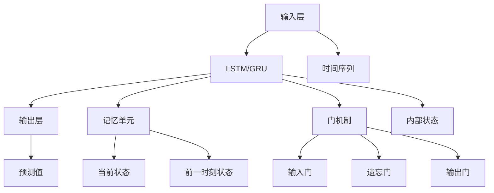

                 

## 1. 背景介绍

在人工智能的诸多领域中，序列数据预测是一项极具挑战性和应用价值的任务。这涵盖了从语音识别、时间序列分析到自然语言处理等多个方面。其中，长短时记忆网络（Long Short-Term Memory, LSTM）和门控循环单元（Gated Recurrent Unit, GRU）是两种广泛应用的深度学习模型，因其在处理序列数据时的优异性能而备受青睐。

LSTM与GRU模型均源自于循环神经网络（Recurrent Neural Network, RNN），但相较于标准的RNN模型，它们在处理长期依赖和梯度消失问题上展现了显著优势。本文将详细探讨LSTM与GRU的原理与应用，并通过实例演示其在序列数据预测中的具体应用。

## 2. 核心概念与联系

### 2.1 核心概念概述

为帮助读者更好地理解LSTM与GRU，下面对几个核心概念进行简要介绍：

- **序列数据**：指时间上按照特定顺序排列的数据，常见于自然语言、时间序列等领域。
- **循环神经网络（RNN）**：一种能够处理序列数据的神经网络，通过网络中的循环结构来保存序列信息。
- **长短时记忆网络（LSTM）**：一种特殊的RNN，通过引入记忆单元（Cell）和门机制（Gate），有效地解决了传统RNN中的梯度消失问题，特别适合处理长序列数据。
- **门控循环单元（GRU）**：LSTM的变体，通过简化门机制，在保持长期依赖处理能力的同时，减少了计算量，提高效率。
- **序列数据预测**：利用序列数据的过去信息，预测未来的数据值。

### 2.2 核心概念原理和架构的 Mermaid 流程图



上述图表展示了LSTM和GRU的基本架构。输入层接收序列数据，经由记忆单元和门机制，LSTM或GRU模型能够有效处理序列信息，并通过输出层给出预测值。

## 3. 核心算法原理 & 具体操作步骤

### 3.1 算法原理概述

LSTM与GRU的核心在于其记忆单元和门机制。记忆单元用于存储序列信息，而门机制则决定哪些信息被更新、保留或丢弃。

#### LSTM模型

LSTM引入了三个门：输入门（Input Gate）、遗忘门（Forget Gate）和输出门（Output Gate），分别控制信息的输入、忘记和输出。其中，输入门和遗忘门决定当前细胞状态和前一时刻细胞状态之间的关系。输出门则决定了当前细胞状态的输出。

#### GRU模型

GRU通过简化门机制，只保留了更新门（Update Gate）和重置门（Reset Gate），控制信息的更新和保留。相比于LSTM，GRU的计算量更小，同时保持了对长期依赖的有效处理。

### 3.2 算法步骤详解

#### 3.2.1 输入层

输入层接收序列数据，并将其转化为神经网络可处理的张量形式。以文本数据为例，通常会将每个词转换为独热编码向量。

#### 3.2.2 记忆单元和门机制

在LSTM和GRU中，记忆单元用于存储序列信息。门机制则根据输入和前一时刻的记忆单元状态，决定信息的更新、保留或丢弃。

#### 3.2.3 输出层

输出层通常采用线性层，将记忆单元的最终状态映射到预测值。

#### 3.2.4 反向传播与优化

训练过程采用反向传播算法，通过计算损失函数对模型参数的梯度，使用优化算法（如Adam、SGD）更新模型参数。

### 3.3 算法优缺点

#### 3.3.1 LSTM的优缺点

**优点**：
- **长序列处理能力**：LSTM能够有效处理长期依赖，适合处理长序列数据。
- **门机制灵活性**：通过多个门控制信息流，灵活性较高。

**缺点**：
- **计算复杂度高**：由于门机制的存在，LSTM的计算量较大。
- **易过拟合**：由于门机制的存在，LSTM较易发生过拟合。

#### 3.3.2 GRU的优缺点

**优点**：
- **计算高效**：相比于LSTM，GRU简化了门机制，计算量较小。
- **模型稳定性**：GRU的参数更少，模型更稳定，不易发生过拟合。

**缺点**：
- **对长序列的处理能力稍弱**：尽管GRU在计算效率上更优，但处理长序列时的性能稍逊于LSTM。

### 3.4 算法应用领域

LSTM与GRU在序列数据预测领域有广泛应用，包括：

- **自然语言处理**：如机器翻译、文本生成、情感分析等。
- **语音识别**：如声学模型、语音转换等。
- **时间序列分析**：如股票预测、天气预测等。

## 4. 数学模型和公式 & 详细讲解 & 举例说明

### 4.1 数学模型构建

假设我们有一个时间序列 $X = \{x_t\}_{t=1}^T$，我们的目标是根据 $X$ 预测下一个值 $x_{T+1}$。

#### LSTM模型

LSTM模型的记忆单元状态为 $C_t$，通过三个门（输入门、遗忘门、输出门）控制信息的流向。LSTM的计算公式如下：

$$
\begin{aligned}
&\text{输入门} &= \sigma(W_{x_i}x_t + W_{h_{t-1}}h_{t-1} + b_i) \\
&\text{遗忘门} &= \sigma(W_{x_i}x_t + W_{h_{t-1}}h_{t-1} + b_f) \\
&\text{更新门} &= \tanh(W_{x_i}x_t + W_{h_{t-1}}h_{t-1} + b_u) \\
&\text{输出门} &= \sigma(W_{x_i}x_t + W_{h_{t-1}}h_{t-1} + b_o) \\
&C_t &= \text{遗忘门} \cdot C_{t-1} + \text{输入门} \cdot \text{更新门}
\end{aligned}
$$

#### GRU模型

GRU通过更新门和重置门控制信息的流向，计算公式如下：

$$
\begin{aligned}
&\text{重置门} &= \sigma(W_{x_i}x_t + W_{h_{t-1}}h_{t-1} + b_r) \\
&\text{更新门} &= \sigma(W_{x_i}x_t + W_{h_{t-1}}h_{t-1} + b_u) \\
&C_t &= \text{重置门} \cdot C_{t-1} + (1-\text{重置门}) \cdot x_t \\
&h_t &= \text{更新门} \cdot \tanh(C_t)
\end{aligned}
$$

### 4.2 公式推导过程

LSTM与GRU模型的推导过程较为复杂，涉及向量加法、点乘、非线性激活函数（如Sigmoid、Tanh）等。具体推导过程可以参考相关的深度学习课程或书籍。

### 4.3 案例分析与讲解

以文本生成为例，LSTM与GRU模型通过记忆单元和门机制，能够有效地捕捉文本中的上下文信息，生成连贯的文本。

## 5. 项目实践：代码实例和详细解释说明

### 5.1 开发环境搭建

首先需要安装Python及其依赖包，如TensorFlow、Keras等深度学习框架。具体步骤如下：

1. 安装Python：
```
sudo apt-get install python3
```

2. 安装TensorFlow：
```
pip install tensorflow
```

3. 安装Keras：
```
pip install keras
```

### 5.2 源代码详细实现

以下是一个使用Keras实现LSTM文本生成的示例代码：

```python
from keras.models import Sequential
from keras.layers import LSTM, Dense, Dropout

# 构建LSTM模型
model = Sequential()
model.add(LSTM(128, return_sequences=True, input_shape=(None, 100)))
model.add(Dropout(0.2))
model.add(LSTM(128))
model.add(Dropout(0.2))
model.add(Dense(1000))
model.add(Dense(1000, activation='tanh'))
model.add(Dense(1000, activation='softmax'))

# 编译模型
model.compile(optimizer='adam', loss='categorical_crossentropy', metrics=['accuracy'])

# 训练模型
model.fit(X_train, y_train, epochs=10, batch_size=128, validation_data=(X_test, y_test))
```

### 5.3 代码解读与分析

**模型构建**：
- `LSTM`层用于处理序列数据，`return_sequences=True`表示模型返回整个序列的输出。
- `Dense`层用于输出预测结果。
- `Dropout`层用于防止过拟合。

**模型编译**：
- `compile`方法用于设置模型的优化器、损失函数和评价指标。

**模型训练**：
- `fit`方法用于训练模型，`validation_data`参数指定验证集。

### 5.4 运行结果展示

训练完成后，使用测试集进行评估：

```python
test_loss, test_acc = model.evaluate(X_test, y_test)
print('Test accuracy:', test_acc)
```

## 6. 实际应用场景

LSTM与GRU模型在实际应用中展现出了强大的预测能力。以下列举几个典型应用场景：

### 6.1 语音识别

在语音识别领域，LSTM和GRU被广泛应用于声学模型中，通过捕捉声学特征与文本序列之间的映射关系，实现语音到文本的转换。

### 6.2 机器翻译

在机器翻译领域，LSTM和GRU模型被用于翻译模型，通过处理源语言和目标语言之间的序列对应关系，实现高精度的翻译。

### 6.3 股票预测

在股票预测领域，LSTM和GRU模型能够捕捉历史股价序列中的长期依赖关系，预测未来股价变化趋势。

### 6.4 未来应用展望

随着深度学习技术的不断发展，LSTM和GRU在序列数据预测领域的应用前景更加广阔。未来，它们将在更多领域大放异彩。

## 7. 工具和资源推荐

### 7.1 学习资源推荐

1. **《深度学习》课程**：由Andrew Ng主讲的Coursera课程，深入浅出地介绍了深度学习的基本概念和实现技术。
2. **《Python深度学习》书籍**：适合初学者入门的深度学习入门书籍，内容全面，代码清晰。
3. **Keras官方文档**：Keras深度学习框架的官方文档，提供了丰富的示例代码和详细解释。
4. **arXiv预印本**：最新的深度学习研究论文，有助于了解最新的研究方向和技术进展。

### 7.2 开发工具推荐

1. **Jupyter Notebook**：免费的交互式编程环境，适合进行模型训练和调试。
2. **TensorBoard**：可视化工具，实时监控模型训练状态。
3. **GitHub**：代码托管平台，便于版本控制和协作开发。

### 7.3 相关论文推荐

1. **《Long Short-Term Memory》**：Hochreiter等人的经典论文，提出了LSTM模型。
2. **《A Gated Recurrent Unit》**：Cho等人的论文，提出了GRU模型。

## 8. 总结：未来发展趋势与挑战

### 8.1 研究成果总结

本文详细介绍了LSTM与GRU模型在序列数据预测中的应用，通过理论分析、代码实现和实际案例展示了其在深度学习中的重要性和广泛应用。

### 8.2 未来发展趋势

1. **模型优化**：未来将继续优化LSTM与GRU的架构和训练方法，提升模型的预测性能。
2. **模型融合**：探索LSTM与GRU与其他深度学习模型的融合应用，如卷积神经网络（CNN）、注意力机制等。
3. **模型迁移**：研究如何将LSTM与GRU模型应用于更多领域，如医疗、金融等。

### 8.3 面临的挑战

1. **计算资源需求高**：LSTM与GRU模型在处理长序列数据时计算量较大，需要高性能计算资源支持。
2. **模型过拟合**：LSTM与GRU模型易发生过拟合，需要在训练过程中引入正则化技术。
3. **数据标注困难**：部分应用领域的数据标注成本高，限制了模型在大规模数据集上的训练。

### 8.4 研究展望

未来研究应着重于以下几个方向：
1. **自监督学习**：通过无监督学习方式，减少对标注数据的依赖。
2. **模型压缩与优化**：探索模型压缩与优化方法，降低模型计算复杂度，提高推理效率。
3. **跨领域迁移学习**：研究如何利用LSTM与GRU模型在不同领域的数据上实现迁移学习，提高模型的泛化能力。

## 9. 附录：常见问题与解答

**Q1：LSTM与GRU的计算复杂度相同吗？**

A：LSTM的计算复杂度相对较高，因为它包含更多的门机制。GRU虽然计算复杂度较低，但处理长序列的能力稍弱。

**Q2：如何选择合适的模型架构？**

A：选择模型架构应考虑数据的特性、任务需求和计算资源。LSTM适用于处理长序列数据，而GRU则更适用于处理计算资源有限的场景。

**Q3：训练过程中如何进行超参数调优？**

A：超参数调优是模型训练的重要环节。通常使用网格搜索、随机搜索、贝叶斯优化等方法，根据模型表现调整超参数。

**Q4：模型在实际应用中如何部署？**

A：模型部署通常需要将训练好的模型导出为可执行文件，并通过API接口或服务化方式提供给客户端使用。

---

作者：禅与计算机程序设计艺术 / Zen and the Art of Computer Programming

