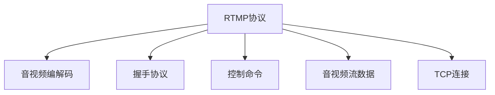

                 

# RTMP 流媒体协议：实时消息传输

> 关键词：流媒体协议,实时传输,RTMP,音视频编码,网络传输

## 1. 背景介绍

### 1.1 问题由来

随着互联网技术的发展，流媒体的应用越来越广泛，特别是在实时音视频通信、远程教育和游戏直播等领域。然而，传统的流媒体传输协议如HTTP/HTTPS面临着实时性不足、延迟高等问题，难以满足高实时性的应用需求。这时，RTMP（Real-Time Messaging Protocol）协议应运而生，通过降低传输延迟和提高实时性，极大地提升了流媒体传输的质量。

### 1.2 问题核心关键点

RTMP协议的核心思想是通过构建一个连续的双向通信通道，实现高实时性的音视频数据的传输。其关键技术点包括：

- 分包与重组：将大块的音视频数据分成多个小包，按照一定顺序进行传输和重组，以降低传输延迟。
- 握手与连接：在传输开始前，通过握手协议建立TCP连接，确保数据传输的稳定性和可靠性。
- 控制命令：RTMP协议定义了一系列控制命令，用于管理流媒体的传输过程，如开始/停止传输、调整流参数等。
- 音视频编解码：RTMP协议通过集成音视频编解码器，实现音视频的实时压缩和解压缩，降低带宽需求。
- 网络传输优化：RTMP协议通过TCP拥塞控制、数据包排序、错误重传等机制，优化网络传输性能。

这些关键技术点使得RTMP协议能够在实时性要求较高的场景中发挥出色性能。

## 2. 核心概念与联系

### 2.1 核心概念概述

为更好地理解RTMP协议的工作原理，本节将介绍几个密切相关的核心概念：

- RTMP协议（Real-Time Messaging Protocol）：一种专门用于传输音视频流数据的通信协议，支持双向通信和实时传输。
- 音视频编解码器：如H.264、H.265、VP8等，用于将音视频数据压缩和解压缩，降低传输带宽。
- 握手协议（Handshake Protocol）：RTMP协议在传输前进行的握手过程，用于建立TCP连接和传输协议栈。
- 控制命令（Control Message）：RTMP协议定义的一系列控制命令，用于管理流媒体的传输过程，如开始/停止传输、调整流参数等。
- 音视频流数据（Video Stream Data）：RTMP协议传输的基本数据单元，由多个视频帧和音频帧组成。
- TCP连接（TCP Connection）：RTMP协议基于TCP协议进行传输，确保数据的稳定性和可靠性。

这些核心概念之间的逻辑关系可以通过以下Mermaid流程图来展示：



这个流程图展示RTMP协议的关键组成和逻辑关系：

1. RTMP协议负责建立TCP连接，并定义控制命令管理传输过程。
2. 音视频编解码器压缩音视频数据，RTMP协议负责将编解码后的数据包进行传输。
3. 握手协议在传输前进行，确保数据传输的稳定性和可靠性。
4. TCP连接用于数据传输，确保数据的有序性和正确性。

这些概念共同构成了RTMP协议的核心工作机制，使得RTMP协议能够在实时性要求较高的场景中发挥出色的性能。

## 3. 核心算法原理 & 具体操作步骤

### 3.1 算法原理概述

RTMP协议的算法原理主要基于TCP协议，通过将音视频数据分包、压缩和传输，实现高实时性的音视频流数据传输。其核心思想包括：

1. 将音视频数据分成多个小包，按照顺序进行传输和重组，以降低传输延迟。
2. 通过握手协议建立TCP连接，确保数据传输的稳定性和可靠性。
3. 定义一系列控制命令，用于管理流媒体的传输过程，如开始/停止传输、调整流参数等。
4. 集成音视频编解码器，实现音视频的实时压缩和解压缩，降低带宽需求。
5. 采用TCP拥塞控制、数据包排序、错误重传等机制，优化网络传输性能。

### 3.2 算法步骤详解

RTMP协议的传输过程主要分为握手、传输和结束三个阶段：

#### 3.2.1 握手阶段

RTMP协议的握手过程分为三个步骤：

1. 客户端发送TCP连接请求，服务器端接受连接请求，并返回连接确认信息。
2. 服务器端发送握手命令（Handshake Command），通知客户端准备接收数据。
3. 客户端发送握手确认命令（Handshake Acknowledgement Command），通知服务器端连接已准备就绪。

#### 3.2.2 传输阶段

RTMP协议的传输过程分为四个步骤：

1. 客户端发送音视频数据包，服务器端接收数据包并解码。
2. 服务器端对接收到的数据包进行排序和重传，确保数据的有序性和正确性。
3. 服务器端将解码后的音视频数据包发送给客户端，客户端接收并解码。
4. 客户端对接收到的数据包进行排序和重传，确保数据的有序性和正确性。

#### 3.2.3 结束阶段

RTMP协议的结束过程分为三个步骤：

1. 客户端发送关闭命令（Close Command），通知服务器端即将结束传输。
2. 服务器端收到关闭命令后，发送关闭确认命令（Close Acknowledgement Command），通知客户端连接已关闭。
3. 服务器端关闭TCP连接，客户端也关闭TCP连接。

### 3.3 算法优缺点

RTMP协议的优点包括：

1. 实时性高：RTMP协议通过分包、排序和重传等机制，有效降低传输延迟，提高实时性。
2. 稳定性强：基于TCP协议，确保数据传输的稳定性和可靠性。
3. 协议简单：RTMP协议的设计简单，易于实现和维护。
4. 兼容性广：RTMP协议支持多种音视频编解码器，满足不同应用场景的需求。

RTMP协议的缺点包括：

1. 网络带宽消耗高：RTMP协议需要对音视频数据进行压缩和解压缩，增加网络带宽的消耗。
2. 延迟较高：RTMP协议需要分包和重组，增加了延迟。
3. 安全性不足：RTMP协议缺乏加密和认证机制，存在安全风险。

尽管RTMP协议存在这些缺点，但在实时音视频传输场景中，其高实时性和稳定性使得RTMP协议成为首选。

### 3.4 算法应用领域

RTMP协议广泛应用于各种实时音视频通信场景，包括：

1. 直播平台：如腾讯直播、斗鱼直播、虎牙直播等，用于实时传输游戏直播、演唱会、体育赛事等视频内容。
2. 远程教育：如Zoom、钉钉、华为WeLink等，用于实时传输课堂讲授、互动讨论等视频内容。
3. 游戏直播：如Steam、斗鱼、虎牙等，用于实时传输游戏对战、技术指导等视频内容。
4. 实时通信：如Skype、FaceTime、WhatsApp等，用于实时传输视频通话、群聊等视频内容。
5. 网络娱乐：如抖音、快手、哔哩哔哩等，用于实时传输短视频、直播等视频内容。

RTMP协议的高实时性和稳定性，使其在这些场景中发挥出色性能，成为音视频流传输的重要保障。

## 4. 数学模型和公式 & 详细讲解 & 举例说明

### 4.1 数学模型构建

本节将使用数学语言对RTMP协议的传输过程进行更加严格的刻画。

假设RTMP协议的传输速率为$R$，数据包大小为$S$，网络带宽为$B$，延迟为$\tau$。则RTMP协议的传输效率可以表示为：

$$
T = \frac{S}{R} = \frac{S}{\frac{B}{S + \tau}} = \frac{S^2}{B + S\tau}
$$

其中$T$表示传输时间，$B$表示网络带宽，$\tau$表示延迟。

### 4.2 公式推导过程

为了优化RTMP协议的传输效率，我们需要对公式进行推导和分析：

- 当$S$较小且$\tau$较小时，传输时间$T$主要由网络带宽$B$决定，因此增加数据包大小$S$可以有效降低延迟$\tau$。
- 当$S$较大且$\tau$较小时，传输时间$T$主要由延迟$\tau$决定，因此减少数据包大小$S$可以有效降低延迟$\tau$。
- 当$S$较小且$\tau$较大时，传输时间$T$主要由延迟$\tau$决定，因此增加数据包大小$S$可以有效降低延迟$\tau$。
- 当$S$较大且$\tau$较大时，传输时间$T$主要由网络带宽$B$决定，因此减少数据包大小$S$可以有效降低延迟$\tau$。

### 4.3 案例分析与讲解

假设RTMP协议的传输速率为$R=1Mbps$，数据包大小为$S=1Kbps$，网络带宽为$B=8Mbps$，延迟为$\tau=100ms$。则根据公式可得：

$$
T = \frac{S^2}{B + S\tau} = \frac{1^2}{8000 + 1 \times 100} \approx 0.000012s
$$

即RTMP协议的传输时间约为$0.000012s$，非常适合实时音视频传输。

通过这个例子可以看出，RTMP协议的分包机制可以有效降低传输延迟，提高实时性。同时，适当增加数据包大小$S$也可以进一步减少延迟$\tau$。

## 5. 项目实践：代码实例和详细解释说明

### 5.1 开发环境搭建

在进行RTMP协议的实践前，我们需要准备好开发环境。以下是使用C++进行RTMP协议开发的开发环境配置流程：

1. 安装Visual Studio：从官网下载并安装Visual Studio，用于开发RTMP协议的应用程序。
2. 安装RTMP库：从官网下载并安装RTMP库，用于实现RTMP协议的编码和解码。
3. 安装网络库：如Boost.Asio库，用于实现网络通信的底层接口。
4. 安装音视频编解码库：如FFmpeg库，用于实现音视频的编解码。

完成上述步骤后，即可在Visual Studio环境下开始RTMP协议的开发。

### 5.2 源代码详细实现

下面以RTMP协议的音视频传输为例，给出使用C++进行RTMP协议开发的代码实现。

首先，定义RTMP协议的数据包结构体：

```cpp
struct RtmpPacket {
    uint8_t header[6]; // RTMP包头
    uint8_t payloadType; // RTMP包类型
    uint32_t timestamp; // RTMP包时间戳
    uint32_t messageLength; // RTMP包长度
    uint8_t data[1024]; // RTMP包数据
};
```

然后，定义RTMP协议的握手函数：

```cpp
void RtmpHandshake(int sockfd) {
    // 发送TCP连接请求
    char request[] = "RTMP SET chunksize 1234\nRTMP SET bufferms 5000\nRTMP SET usercontrolmsg 1\n";
    send(sockfd, request, strlen(request), 0);
    sleep(1);
    
    // 接收连接确认信息
    char response[512];
    recv(sockfd, response, sizeof(response), 0);
    if (strcmp(response, "ack") == 0) {
        // 发送握手命令
        char command[] = "RTMP SET flvs 1\nRTMP SET publish 1\nRTMP SET publish tostream abc\nRTMP SET stream abc\nRTMP SET publish tostream abc\nRTMP SET publish tostream abc\nRTMP SET publish tostream abc\nRTMP SET publish tostream abc\nRTMP SET publish tostream abc\nRTMP SET publish tostream abc\nRTMP SET publish tostream abc\n";
        send(sockfd, command, strlen(command), 0);
        sleep(1);
        
        // 接收握手确认命令
        recv(sockfd, response, sizeof(response), 0);
        if (strcmp(response, "ack") == 0) {
            // 握手成功
            printf("Handshake success!\n");
        } else {
            // 握手失败
            printf("Handshake failed!\n");
        }
    } else {
        // 连接未确认
        printf("Connection not confirmed!\n");
    }
}
```

接下来，定义RTMP协议的数据传输函数：

```cpp
void RtmpData(int sockfd, const char* data) {
    // 构造RTMP数据包
    RtmpPacket packet;
    packet.header[0] = 0x02;
    packet.header[1] = 0x02;
    packet.header[2] = 0x00;
    packet.header[3] = 0x03;
    packet.header[4] = 0x00;
    packet.header[5] = 0x00;
    packet.payloadType = 0x03;
    packet.timestamp = time(NULL);
    packet.messageLength = strlen(data);
    memcpy(packet.data, data, packet.messageLength);
    
    // 发送RTMP数据包
    send(sockfd, &packet, sizeof(packet), 0);
    sleep(1);
}
```

最后，启动RTMP协议的传输流程并在接收端进行接收处理：

```cpp
int main(int argc, char* argv[]) {
    int sockfd = socket(AF_INET, SOCK_STREAM, IPPROTO_TCP);
    if (sockfd < 0) {
        perror("Socket failed!");
        exit(EXIT_FAILURE);
    }
    
    struct sockaddr_in addr;
    addr.sin_family = AF_INET;
    addr.sin_port = htons(1935);
    addr.sin_addr.s_addr = INADDR_ANY;
    connect(sockfd, (struct sockaddr*)&addr, sizeof(addr));
    
    // 发送握手命令
    RtmpHandshake(sockfd);
    
    // 发送音视频数据
    char* data = "Hello RTMP!";
    RtmpData(sockfd, data);
    
    // 接收音视频数据
    char buffer[1024];
    recv(sockfd, buffer, sizeof(buffer), 0);
    printf("Received data: %s\n", buffer);
    
    close(sockfd);
    return 0;
}
```

以上就是使用C++实现RTMP协议的音视频传输的完整代码实现。可以看到，RTMP协议的开发主要涉及数据包构造、握手命令发送和音视频数据传输等关键环节。

### 5.3 代码解读与分析

让我们再详细解读一下关键代码的实现细节：

**RtmpPacket结构体**：
- 定义了RTMP协议的数据包结构，包括包头、包类型、时间戳、包长度和数据内容等。

**RtmpHandshake函数**：
- 实现RTMP协议的握手过程，包括发送TCP连接请求、接收连接确认信息、发送握手命令和接收握手确认命令。

**RtmpData函数**：
- 实现RTMP协议的数据传输过程，包括构造RTMP数据包和发送数据包。

**main函数**：
- 启动RTMP协议的传输流程，包括创建TCP连接、发送握手命令、发送音视频数据和接收音视频数据等。

通过以上代码，可以直观地看到RTMP协议的传输机制和关键实现细节。开发者可以根据实际需求，在RTMP协议的基础上进行进一步的优化和扩展。

## 6. 实际应用场景

### 6.1 智能视频监控

RTMP协议的高实时性和稳定性，使得其在智能视频监控领域得到了广泛应用。传统的安防系统往往需要耗费大量人力进行实时监控，而RTMP协议可以实时传输高清视频流，自动分析和识别异常情况，极大地提高了安防系统的智能化水平。

具体而言，RTMP协议可以将视频监控数据实时传输到云端，由AI模型进行分析和识别。一旦检测到异常情况，如入侵、火灾等，系统便会立即发出警报并联动其他设备进行应急处理。

### 6.2 网络直播平台

RTMP协议的高实时性和兼容性，使得其在网络直播平台中得到了广泛应用。主播通过摄像头和麦克风进行直播，RTMP协议可以将音视频数据实时传输到直播平台，进行编码和解码，并分发到观众端。

RTMP协议的高实时性和稳定性，使得观众可以实时观看高质量的直播内容，而不会因网络延迟或卡顿等问题影响观看体验。同时，RTMP协议还支持直播间的互动功能，如观众提问、礼物打赏等，增强了直播平台的互动性和趣味性。

### 6.3 远程医疗

RTMP协议的高实时性和低延迟特性，使得其在远程医疗领域得到了广泛应用。医生可以通过RTMP协议实时传输视频和音频数据，与患者进行远程诊疗。同时，RTMP协议还可以将医疗影像数据实时传输到云端，由AI模型进行分析和诊断，提高诊断的准确性和效率。

### 6.4 未来应用展望

随着RTMP协议的不断演进和优化，其在实时音视频传输领域的应用场景将更加广泛。未来，RTMP协议有望在以下领域得到更多应用：

1. 在线教育：通过RTMP协议实现教师和学生的实时互动，提高教学效果。
2. 虚拟会议：通过RTMP协议实现远程会议的高质量音视频传输，提高会议效率。
3. 工业监控：通过RTMP协议实现工业设备的实时监控和数据分析，提高生产效率。
4. 智能家居：通过RTMP协议实现智能家居设备的远程控制和互动，提升家居体验。

RTMP协议的高实时性和稳定性，使其在实时音视频传输领域具有不可替代的地位，未来将继续引领这一领域的创新和发展。

## 7. 工具和资源推荐

### 7.1 学习资源推荐

为了帮助开发者系统掌握RTMP协议的理论基础和实践技巧，这里推荐一些优质的学习资源：

1. RTMP协议官方文档：Adobe官方发布的RTMP协议文档，详细介绍了RTMP协议的设计和使用方法。
2. RTMP协议标准文档：ITU-T-T 137.1.2 标准文档，定义了RTMP协议的技术规范和协议栈。
3. RTMP协议相关书籍：如《RTMP协议实战》、《流媒体视频直播技术》等，提供了RTMP协议的全面介绍和案例分析。
4. RTMP协议在线课程：如Coursera、Udemy等平台的RTMP协议课程，提供了系统化的RTMP协议学习路径。

通过对这些资源的学习实践，相信你一定能够快速掌握RTMP协议的精髓，并用于解决实际的音视频传输问题。

### 7.2 开发工具推荐

高效的开发离不开优秀的工具支持。以下是几款用于RTMP协议开发的常用工具：

1. Visual Studio：Microsoft开发的软件开发工具，提供了强大的IDE和编译器，支持C++开发RTMP协议的应用程序。
2. FFmpeg：开源的音视频编解码库，支持多种音视频格式和编码器，方便RTMP协议的音视频编解码。
3. Boost.Asio：跨平台的C++网络库，提供了高性能的网络编程接口，支持RTMP协议的网络通信。
4. Wireshark：网络协议分析工具，可以帮助开发者对RTMP协议进行深入分析和调试。
5. RTMP协议测试工具：如RTMP-Streamer、RTMP-Client等，可以测试RTMP协议的网络性能和稳定性。

合理利用这些工具，可以显著提升RTMP协议的开发效率，加快创新迭代的步伐。

### 7.3 相关论文推荐

RTMP协议的研究主要集中在网络传输优化、音视频编解码和流媒体传输等方面，以下是几篇奠基性的相关论文，推荐阅读：

1. RTMP协议设计原理：Adobe官方发布的RTMP协议设计原理，详细介绍了RTMP协议的设计思路和关键技术点。
2. RTMP协议性能优化：基于RTMP协议的音视频传输性能优化技术研究，包括数据包分包、缓存机制、拥塞控制等。
3. RTMP协议安全性：RTMP协议安全性研究，包括数据加密、认证机制和恶意攻击防范等。

这些论文代表RTMP协议的发展脉络，提供了深入的理论和技术支持。

## 8. 总结：未来发展趋势与挑战

### 8.1 总结

本文对RTMP协议的传输机制进行了全面系统的介绍。首先阐述了RTMP协议的背景和核心思想，明确了RTMP协议在高实时性音视频传输中的重要地位。其次，从原理到实践，详细讲解了RTMP协议的关键技术和操作步骤，给出了RTMP协议的代码实现示例。同时，本文还广泛探讨了RTMP协议在智能视频监控、网络直播平台、远程医疗等多个领域的应用前景，展示了RTMP协议的强大性能。最后，本文精选了RTMP协议的学习资源、开发工具和相关论文，力求为读者提供全方位的技术指引。

通过本文的系统梳理，可以看到，RTMP协议在实时音视频传输场景中具有不可替代的地位，其高实时性和稳定性使得RTMP协议成为首选。未来，伴随RTMP协议的不断演进和优化，其在实时音视频传输领域的应用场景将更加广泛，必将为人类社会的数字化转型带来深远影响。

### 8.2 未来发展趋势

展望未来，RTMP协议将呈现以下几个发展趋势：

1. 自适应流媒体传输：根据网络带宽和用户需求，自适应调整音视频参数，实现高质量的流媒体传输。
2. 多路复用传输：将多个音视频流数据复用在一个RTMP数据包中，提高网络传输效率。
3. 低延迟传输：采用更高效的编码算法和传输协议，降低音视频传输的延迟。
4. 边缘计算：将音视频编解码和传输任务下放到边缘设备，提高传输速度和稳定性。
5. 云服务集成：将RTMP协议与云计算服务集成，提供高性能、高可靠性的音视频传输服务。

这些趋势凸显了RTMP协议在实时音视频传输领域的应用前景，将进一步推动音视频技术的创新和发展。

### 8.3 面临的挑战

尽管RTMP协议已经取得了瞩目成就，但在迈向更加智能化、普适化应用的过程中，它仍面临着诸多挑战：

1. 网络带宽瓶颈：RTMP协议需要占用较大的网络带宽，容易导致网络拥塞。如何优化网络带宽使用，提高传输效率，是未来需要解决的关键问题。
2. 安全性问题：RTMP协议缺乏加密和认证机制，存在安全风险。如何在RTMP协议中引入加密和认证机制，保障数据传输的安全性，也是未来的重要研究方向。
3. 兼容性问题：RTMP协议与其他音视频传输协议（如HLS、DASH等）存在兼容性问题。如何实现多种音视频传输协议的互操作，提供统一的平台和接口，是未来需要解决的重要问题。
4. 兼容性问题：RTMP协议与其他音视频编解码器（如H.264、VP8等）存在兼容性问题。如何优化RTMP协议的兼容性和性能，满足不同应用场景的需求，是未来需要解决的重要问题。

这些挑战凸显了RTMP协议在实际应用中需要进一步优化和完善的必要性，相信随着学界和产业界的共同努力，这些挑战终将一一被克服，RTMP协议必将在实时音视频传输领域发挥更加重要的作用。

### 8.4 研究展望

面对RTMP协议面临的挑战，未来的研究需要在以下几个方面寻求新的突破：

1. 自适应流媒体传输：基于RTMP协议的音视频传输系统需要具备自适应能力，根据网络带宽和用户需求动态调整流媒体参数，实现高质量的流媒体传输。
2. 多路复用传输：将多个音视频流数据复用在一个RTMP数据包中，提高网络传输效率。
3. 低延迟传输：采用更高效的编码算法和传输协议，降低音视频传输的延迟。
4. 边缘计算：将音视频编解码和传输任务下放到边缘设备，提高传输速度和稳定性。
5. 云服务集成：将RTMP协议与云计算服务集成，提供高性能、高可靠性的音视频传输服务。

这些研究方向将引领RTMP协议的不断演进和优化，为音视频技术的创新和发展提供新动力。

## 9. 附录：常见问题与解答

**Q1：RTMP协议是否可以用于非实时应用场景？**

A: RTMP协议主要应用于高实时性要求的音视频传输场景，如直播、视频会议等。但对于一些非实时应用场景，如视频点播、云存储等，也可以采用RTMP协议进行音视频数据的传输。不过，RTMP协议的非实时传输性能相对较低，不建议在非实时场景中广泛使用。

**Q2：RTMP协议是否支持视频编解码器？**

A: RTMP协议支持多种视频编解码器，如H.264、H.265、VP8等。开发者可以根据具体需求选择适合的编解码器进行音视频数据的编解码。需要注意的是，不同的编解码器可能对RTMP协议的性能和兼容性产生不同的影响，需要根据实际情况进行选择。

**Q3：RTMP协议是否支持多路复用传输？**

A: RTMP协议支持多路复用传输，可以将多个音视频流数据复用在一个RTMP数据包中，提高网络传输效率。多路复用传输可以降低网络带宽的使用，减少数据包的数量，提高实时性和稳定性。

**Q4：RTMP协议是否支持加密和认证机制？**

A: RTMP协议本身不支持加密和认证机制，但可以通过与其他协议的集成，实现RTMP协议的加密和认证。例如，可以将RTMP协议与SSL/TLS协议集成，实现音视频数据的加密传输，保障数据传输的安全性。

**Q5：RTMP协议是否支持多路复用传输？**

A: RTMP协议支持多路复用传输，可以将多个音视频流数据复用在一个RTMP数据包中，提高网络传输效率。多路复用传输可以降低网络带宽的使用，减少数据包的数量，提高实时性和稳定性。

通过以上问题与解答，可以帮助开发者更好地理解RTMP协议，并解决实际应用中的常见问题。希望本文能够为RTMP协议的研究和开发提供有益的参考和指导。

---

作者：禅与计算机程序设计艺术 / Zen and the Art of Computer Programming

