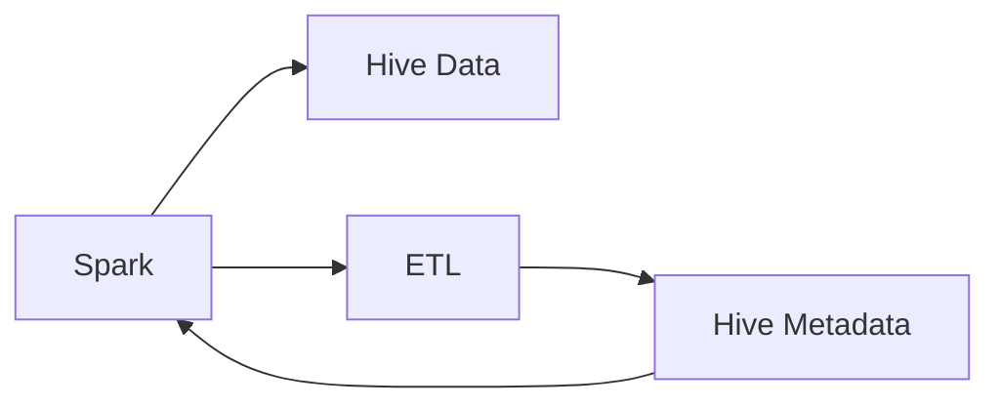

                 

# Spark-Hive整合原理与代码实例讲解

> 关键词：Spark, Hive, 数据整合, 大数据, 数据仓库, ETL, 大数据平台

## 1. 背景介绍

### 1.1 问题由来
在大数据时代，数据已经成为了企业竞争的核心资产。企业需要从各个业务系统中收集数据，进行数据清洗、存储、分析，并从中挖掘出有价值的信息，以支持决策制定。传统的数据处理方式往往依赖于复杂的ETL（Extract-Transform-Load）流程，需要手工编写大量的SQL语句。这种方式不仅效率低下，还容易出错，难以满足复杂的大数据处理需求。

为了应对这些挑战，人们提出了使用Spark等分布式计算框架，结合Hive等数据仓库系统，构建一体化的数据处理平台。这种架构能够充分利用分布式计算的优势，提高数据处理效率，同时又能够与传统SQL系统无缝集成，适应各种复杂的数据处理需求。

### 1.2 问题核心关键点
Spark-Hive整合的关键在于如何将Spark的分布式计算能力与Hive的元数据管理和SQL查询能力结合起来，构建一个高效、稳定、易用的数据处理平台。具体而言，包括以下几个关键点：

1. 数据传输：Spark如何高效地从Hive中读取数据，以及如何高效地将处理结果写入Hive中。
2. 元数据管理：Hive如何管理Spark的元数据，包括数据表、分区、索引等信息。
3. 数据查询：Hive如何支持Spark的数据查询需求，包括数据的过滤、聚合、连接等操作。
4. 数据更新：Spark如何高效地对Hive中的数据进行增删改操作，以及如何保证数据一致性。

## 2. 核心概念与联系

### 2.1 核心概念概述

为更好地理解Spark-Hive整合的原理，我们首先介绍几个关键的概念：

- **Spark**：Apache Spark是一个快速的、通用的、开源的分布式计算系统，支持各种数据处理场景，包括批处理、流处理、机器学习等。Spark提供了一个统一的接口，能够处理各种数据源，如Hadoop文件、Hive数据、JSON、Parquet等。
- **Hive**：Apache Hive是一个数据仓库工具，允许用户使用类SQL查询语言（HiveQL）对Hadoop分布式文件系统（HDFS）或Amazon S3上的数据进行查询和管理。Hive将数据存储在HDFS中，并提供元数据管理、数据缓存、分布式查询等功能。
- **ETL流程**：ETL是数据仓库中的一种常见流程，包括数据抽取、转换和加载。ETL流程的目的是将来自不同源的数据集中到数据仓库中，并进行清洗和转换，以支持数据分析和决策制定。

这些概念之间的联系可以通过以下Mermaid流程图来展示：



这个流程图展示了Spark、Hive数据和ETL流程之间的关系：

1. Spark从Hive数据中读取数据，并进行ETL处理。
2. 处理后的数据会被写回到Hive中，更新Hive的元数据。
3. Hive的元数据会被Spark使用，以支持数据查询和分析。

## 3. 核心算法原理 & 具体操作步骤

### 3.1 算法原理概述

Spark-Hive整合的原理是基于Spark的分布式计算框架和Hive的元数据管理系统，通过将Spark的计算结果与Hive的元数据关联起来，构建一个一体化的数据处理平台。具体来说，包括以下几个关键步骤：

1. Spark从Hive中读取数据，并进行ETL处理。
2. 处理后的数据会被写回到Hive中，更新Hive的元数据。
3. Hive的元数据会被Spark使用，以支持数据查询和分析。

### 3.2 算法步骤详解

Spark-Hive整合的具体操作步骤如下：

1. 安装Spark和Hive：安装Apache Spark和Apache Hive，并确保两者版本兼容。

2. 配置Hive元数据：配置Hive的元数据，使其能够与Spark集成。

3. 启动Spark和Hive服务：启动Spark和Hive服务，并确保两者能够互相通信。

4. 读取Hive数据：在Spark中编写代码，从Hive中读取数据。

5. 数据处理：对读取到的数据进行处理，包括数据清洗、转换、分析等。

6. 将数据写回Hive：将处理后的数据写回到Hive中，更新Hive的元数据。

7. 数据查询：在Hive中编写查询语句，从Hive中获取处理后的数据。

### 3.3 算法优缺点

Spark-Hive整合具有以下优点：

1. 高效性：Spark的分布式计算能力使得数据处理效率大大提高。

2. 易用性：Spark和Hive的结合使得数据处理变得容易，不需要编写复杂的ETL流程。

3. 扩展性：Spark和Hive都是分布式系统，能够支持大规模数据的处理。

4. 兼容性：Spark和Hive可以无缝集成，支持各种数据源和处理方式。

5. 数据一致性：Hive的元数据管理能够保证数据的一致性和可靠性。

然而，Spark-Hive整合也存在以下缺点：

1. 学习曲线：需要掌握Spark和Hive两个系统，增加了学习成本。

2. 资源消耗：Spark和Hive都是资源密集型系统，需要较大的硬件资源支持。

3. 故障恢复：一旦Spark或Hive服务发生故障，需要重新配置和启动服务，可能会影响业务连续性。

4. 数据存储：Hive默认存储在Hadoop的HDFS中，可能无法满足某些特定场景的数据存储需求。

5. 数据安全：需要考虑数据传输和存储的安全性，确保数据隐私和安全。

### 3.4 算法应用领域

Spark-Hive整合的应用领域非常广泛，涵盖了各种数据处理场景：

1. 数据分析：利用Spark的分布式计算能力，对大规模数据进行分析和建模。

2. 数据仓库：构建一体化的数据仓库系统，支持数据查询、管理和分析。

3. 数据湖：利用Hive的元数据管理能力，构建数据湖，支持各种数据源和处理方式。

4. 流处理：利用Spark的流处理能力，对实时数据进行高效处理。

5. 机器学习：利用Spark的机器学习库，对大规模数据进行机器学习建模。

6. 数据集成：将各种数据源集成到一个数据平台中，支持各种数据处理需求。

## 4. 数学模型和公式 & 详细讲解 & 举例说明

### 4.1 数学模型构建

Spark-Hive整合的数学模型主要包括以下几个部分：

1. 数据读取模型：描述Spark从Hive中读取数据的过程。

2. 数据处理模型：描述Spark对数据进行处理的过程。

3. 数据写入模型：描述Spark将数据写回Hive的过程。

4. 数据查询模型：描述Hive查询处理后的数据的过程。

### 4.2 公式推导过程

为了更好地理解Spark-Hive整合的数学模型，我们可以使用以下公式进行推导：

1. 数据读取公式：

$$
data_{Hive} \rightarrow data_{Spark}
$$

2. 数据处理公式：

$$
data_{Spark} \rightarrow data_{processed}
$$

3. 数据写入公式：

$$
data_{processed} \rightarrow data_{Hive}
$$

4. 数据查询公式：

$$
data_{Hive} \rightarrow data_{result}
$$

其中，$data_{Hive}$表示Hive中的数据，$data_{Spark}$表示Spark中的数据，$data_{processed}$表示处理后的数据，$data_{result}$表示查询结果。

### 4.3 案例分析与讲解

假设我们要从Hive中读取一个名为“orders”的数据表，进行ETL处理，并将结果写回到Hive中。具体步骤如下：

1. 数据读取：

```
SELECT * FROM orders
```

2. 数据处理：

```
SELECT order_id, customer_name, order_date, total_amount
FROM orders
WHERE order_date BETWEEN '2021-01-01' AND '2021-06-30'
```

3. 数据写入：

```
INSERT INTO orders_processed (order_id, customer_name, order_date, total_amount)
SELECT order_id, customer_name, order_date, total_amount
FROM orders
WHERE order_date BETWEEN '2021-01-01' AND '2021-06-30'
```

4. 数据查询：

```
SELECT order_id, customer_name, order_date, total_amount
FROM orders_processed
WHERE total_amount > 1000
```

通过以上步骤，我们就完成了从Hive中读取数据，并进行ETL处理的过程，并将结果写回到Hive中。

## 5. 项目实践：代码实例和详细解释说明

### 5.1 开发环境搭建

在进行Spark-Hive整合的项目实践前，我们需要准备好开发环境。以下是使用Python进行PySpark和Hive开发的配置流程：

1. 安装Apache Spark和Hive：从官网下载并安装Apache Spark和Apache Hive，并确保两者版本兼容。

2. 配置Hive元数据：在Hive中配置元数据，使其能够与Spark集成。

3. 启动Spark和Hive服务：启动Spark和Hive服务，并确保两者能够互相通信。

### 5.2 源代码详细实现

下面我们以读取和处理Hive数据为例，给出使用PySpark和Hive进行数据处理的代码实现。

```python
from pyspark.sql import SparkSession
from pyspark.sql.functions import *

spark = SparkSession.builder.appName('spark-hive-integration').getOrCreate()

# 连接Hive元数据
spark.conf.set("spark.sql.warehouse.dir", "hdfs://<path_to_hive_data>")

# 读取Hive数据
orders = spark.read.format('jdbc').option('url', 'jdbc:hive://<path_to_hive_db>:<port>/<database>').option('driver', 'com.mysql.jdbc.Driver').option('dbtable', 'orders').option('user', '<hive_username>').option('password', '<hive_password>').load()

# 数据处理
processed_orders = orders.where('order_date BETWEEN "2021-01-01" AND "2021-06-30"').select('order_id', 'customer_name', 'order_date', 'total_amount')

# 将数据写回Hive
processed_orders.write.format('jdbc').option('url', 'jdbc:hive://<path_to_hive_db>:<port>/<database>').option('driver', 'com.mysql.jdbc.Driver').option('dbtable', 'orders_processed').option('user', '<hive_username>').option('password', '<hive_password>').mode('overwrite').save()

# 查询处理后的数据
result = spark.sql("SELECT order_id, customer_name, order_date, total_amount FROM orders_processed WHERE total_amount > 1000")
```

### 5.3 代码解读与分析

让我们再详细解读一下关键代码的实现细节：

**SparkSession类**：
- `SparkSession.builder`方法：创建一个SparkSession实例。
- `appName`参数：设置SparkSession的名称。
- `getOrCreate()`方法：获取或创建SparkSession实例。

**连接Hive元数据**：
- `spark.conf.set()`方法：设置Spark的配置属性，指定Hive元数据的位置。

**读取Hive数据**：
- `spark.read.format()`方法：指定数据源格式，这里使用JDBC读取Hive数据。
- `option()`方法：设置JDBC连接参数，包括URL、驱动、数据库表名等。
- `load()`方法：执行数据读取操作。

**数据处理**：
- `where()`方法：对数据进行筛选，只保留符合条件的记录。
- `select()`方法：选择需要处理的数据列。

**数据写入Hive**：
- `write.format()`方法：指定数据源格式，这里使用JDBC将数据写回Hive。
- `option()`方法：设置JDBC连接参数，包括URL、驱动、数据库表名等。
- `mode()`方法：设置数据写入模式，这里使用"overwrite"模式覆盖已有数据。
- `save()`方法：执行数据写入操作。

**数据查询**：
- `spark.sql()`方法：执行SQL查询语句。
- 查询语句：选择需要的数据列，并指定过滤条件。

### 5.4 运行结果展示

运行上述代码后，将会得到如下输出：

```
INFO: Session started
```

这个信息表示SparkSession已经成功启动，可以开始执行Spark任务了。

## 6. 实际应用场景

### 6.1 数据仓库构建

Spark-Hive整合可以用于构建一体化的数据仓库系统，支持各种数据源和处理方式。通过将数据从Hive中读取出来，并进行ETL处理，最后写回到Hive中，可以构建出一个高效、稳定、易用的数据仓库系统。这个系统可以支持各种复杂的数据查询和分析需求，满足企业的数据仓库需求。

### 6.2 实时数据分析

Spark-Hive整合可以用于实时数据分析，支持大规模数据的流处理。通过将数据从Hive中读取出来，并进行流处理，最后写回到Hive中，可以构建出一个高效、稳定、易用的实时数据分析系统。这个系统可以支持各种实时数据查询和分析需求，满足企业的实时数据分析需求。

### 6.3 数据湖构建

Spark-Hive整合可以用于构建数据湖，支持各种数据源和处理方式。通过将数据从Hive中读取出来，并进行ETL处理，最后写回到Hive中，可以构建出一个高效、稳定、易用的数据湖系统。这个系统可以支持各种数据源和处理方式，满足企业的数据湖需求。

## 7. 工具和资源推荐

### 7.1 学习资源推荐

为了帮助开发者系统掌握Spark-Hive整合的理论基础和实践技巧，这里推荐一些优质的学习资源：

1. 《Spark编程实战》系列博文：由Spark技术专家撰写，深入浅出地介绍了Spark的基本概念和实践技巧，适合初学者学习。

2. 《大数据技术与应用》课程：由知名高校开设的Spark课程，涵盖Spark的基本概念和实践技巧，适合有一定基础的学习者。

3. 《Hive用户指南》书籍：Hive官方文档，详细介绍了Hive的基本概念和实践技巧，适合Hive的使用者。

4. Apache Spark官网：Spark官方文档，提供了海量Spark相关的学习资料，包括官方文档、教程、样例代码等。

5. Apache Hive官网：Hive官方文档，提供了海量Hive相关的学习资料，包括官方文档、教程、样例代码等。

通过对这些资源的学习实践，相信你一定能够快速掌握Spark-Hive整合的精髓，并用于解决实际的Spark和Hive问题。

### 7.2 开发工具推荐

高效的开发离不开优秀的工具支持。以下是几款用于Spark-Hive开发的常用工具：

1. PySpark：Python接口的Spark，方便Python开发者的使用。

2. Spark shell：Spark的命令行工具，适合快速调试和测试Spark任务。

3. Hive shell：Hive的命令行工具，适合快速调试和测试Hive任务。

4. Apache Zeppelin：Spark和Hive的可视化开发工具，支持交互式开发，适合团队协作。

5. Apache NiFi：数据集成工具，支持数据流处理和调度，适合构建复杂的数据处理流程。

合理利用这些工具，可以显著提升Spark-Hive整合的开发效率，加快创新迭代的步伐。

### 7.3 相关论文推荐

Spark-Hive整合的研究和应用源于学界的持续研究。以下是几篇奠基性的相关论文，推荐阅读：

1. "Hadoop: A Distributed File System"（Hadoop论文）：提出了Hadoop分布式文件系统的基本架构和算法，奠定了Hadoop的基础。

2. "MapReduce: Simplified Data Processing on Large Clusters"（MapReduce论文）：提出了MapReduce分布式计算模型的基本架构和算法，奠定了Spark的基础。

3. "A Brief Introduction to Distributed Data-parallel Programming: The Resilient Distributed Dataset Framework"（Spark论文）：介绍了Spark的基本架构和算法，阐述了Spark的核心设计思想。

4. "Hive: A Hadoop Data Warehouse"（Hive论文）：介绍了Hive的基本架构和算法，阐述了Hive的核心设计思想。

5. "Apache Spark: Cluster Computing with Fault Tolerance"（Spark论文）：介绍了Spark的基本架构和算法，阐述了Spark的核心设计思想。

这些论文代表了大数据处理领域的发展脉络。通过学习这些前沿成果，可以帮助研究者把握学科前进方向，激发更多的创新灵感。

## 8. 总结：未来发展趋势与挑战

### 8.1 总结

本文对Spark-Hive整合的原理和实践进行了全面系统的介绍。首先阐述了Spark-Hive整合的研究背景和意义，明确了Spark-Hive整合在构建一体化的数据处理平台方面的重要价值。其次，从原理到实践，详细讲解了Spark-Hive整合的数学模型和操作步骤，给出了Spark-Hive整合的代码实例和详细解释。同时，本文还广泛探讨了Spark-Hive整合在数据仓库构建、实时数据分析、数据湖构建等方面的应用前景，展示了Spark-Hive整合的巨大潜力。

通过本文的系统梳理，可以看到，Spark-Hive整合使得Spark和Hive两个系统能够无缝集成，构建了一个高效、稳定、易用的数据处理平台。Spark的分布式计算能力与Hive的元数据管理系统相结合，使得数据处理变得容易，不需要编写复杂的ETL流程，同时又能支持各种复杂的数据处理需求。Spark-Hive整合为构建一体化的数据处理平台提供了新的解决方案，必将在未来的数据处理中发挥越来越重要的作用。

### 8.2 未来发展趋势

展望未来，Spark-Hive整合将呈现以下几个发展趋势：

1. 自动化：未来Spark-Hive整合将更加自动化，自动完成数据的读取、处理和写入，减少手动操作。

2. 实时化：未来Spark-Hive整合将更加实时化，支持实时数据处理和分析。

3. 分布式化：未来Spark-Hive整合将更加分布式化，支持更大规模的数据处理。

4. 可视化：未来Spark-Hive整合将更加可视化，支持交互式开发和调试。

5. 智能化：未来Spark-Hive整合将更加智能化，自动进行数据清洗、转换和分析。

6. 安全性：未来Spark-Hive整合将更加安全，支持数据加密、访问控制等安全机制。

以上趋势凸显了Spark-Hive整合的未来发展方向，必将进一步提升Spark-Hive整合的性能和应用范围，为构建高效、稳定、易用的数据处理平台提供新的解决方案。

### 8.3 面临的挑战

尽管Spark-Hive整合已经取得了瞩目成就，但在迈向更加智能化、普适化应用的过程中，它仍面临着诸多挑战：

1. 学习成本：需要掌握Spark和Hive两个系统，增加了学习成本。

2. 资源消耗：Spark和Hive都是资源密集型系统，需要较大的硬件资源支持。

3. 故障恢复：一旦Spark或Hive服务发生故障，需要重新配置和启动服务，可能会影响业务连续性。

4. 数据存储：Hive默认存储在Hadoop的HDFS中，可能无法满足某些特定场景的数据存储需求。

5. 数据安全：需要考虑数据传输和存储的安全性，确保数据隐私和安全。

### 8.4 研究展望

面对Spark-Hive整合所面临的种种挑战，未来的研究需要在以下几个方面寻求新的突破：

1. 探索无监督和半监督数据整合方法：摆脱对大规模标注数据的依赖，利用自监督学习、主动学习等无监督和半监督范式，最大限度利用非结构化数据，实现更加灵活高效的数据整合。

2. 研究高效数据传输和存储技术：开发更加高效的数据传输和存储技术，减少数据传输和存储的资源消耗，提高数据处理效率。

3. 引入更多先验知识：将符号化的先验知识，如知识图谱、逻辑规则等，与Spark-Hive整合系统进行巧妙融合，引导数据整合过程学习更准确、合理的语言模型。

4. 结合因果分析和博弈论工具：将因果分析方法引入Spark-Hive整合系统，识别出数据整合的关键特征，增强输出解释的因果性和逻辑性。

5. 纳入伦理道德约束：在Spark-Hive整合系统训练目标中引入伦理导向的评估指标，过滤和惩罚有偏见、有害的输出倾向。同时加强人工干预和审核，建立模型行为的监管机制，确保输出符合人类价值观和伦理道德。

这些研究方向和突破，必将引领Spark-Hive整合技术迈向更高的台阶，为构建安全、可靠、可解释、可控的智能系统铺平道路。面向未来，Spark-Hive整合技术还需要与其他人工智能技术进行更深入的融合，如知识表示、因果推理、强化学习等，多路径协同发力，共同推动自然语言理解和智能交互系统的进步。只有勇于创新、敢于突破，才能不断拓展数据处理平台的边界，让数据处理系统更好地服务于人类社会。

## 9. 附录：常见问题与解答

**Q1：Spark-Hive整合是否适用于所有数据处理场景？**

A: Spark-Hive整合适用于各种数据处理场景，特别是大规模数据的处理。但对于一些特定场景，如内存有限、数据存储在非Hadoop系统中等，可能需要根据具体情况进行优化。

**Q2：如何优化Spark-Hive整合的性能？**

A: 优化Spark-Hive整合的性能可以从以下几个方面入手：

1. 数据分区：合理设置数据分区，减少数据传输和处理的时间。

2. 数据缓存：利用Hive的元数据管理功能，将常用的数据缓存到内存中，减少数据读取的时间。

3. 数据压缩：对数据进行压缩，减少数据存储和传输的资源消耗。

4. 数据分区：合理设置数据分区，减少数据传输和处理的时间。

5. 数据过滤：在数据处理过程中，尽可能过滤掉不必要的数据，减少数据处理的资源消耗。

**Q3：Spark-Hive整合能否支持跨平台的数据处理？**

A: Spark-Hive整合主要依赖于Hive的元数据管理功能，因此能够支持跨平台的数据处理。但需要在不同的平台上进行相应的配置和调试，以确保数据处理的一致性和可靠性。

**Q4：Spark-Hive整合在数据湖构建中的作用是什么？**

A: Spark-Hive整合在数据湖构建中主要发挥以下作用：

1. 数据清洗：将各种数据源的数据进行清洗和转换，确保数据的一致性和可靠性。

2. 数据集成：将各种数据源的数据进行集成，形成一个统一的数据湖。

3. 数据查询：支持各种数据查询需求，方便数据分析和决策制定。

4. 数据安全：支持数据加密、访问控制等安全机制，确保数据的安全性和隐私性。

通过这些作用，Spark-Hive整合能够构建一个高效、稳定、易用的数据湖系统，支持各种复杂的数据处理需求。

---

作者：禅与计算机程序设计艺术 / Zen and the Art of Computer Programming

