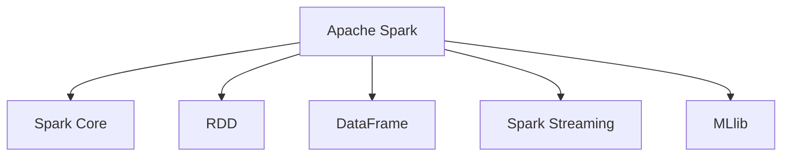
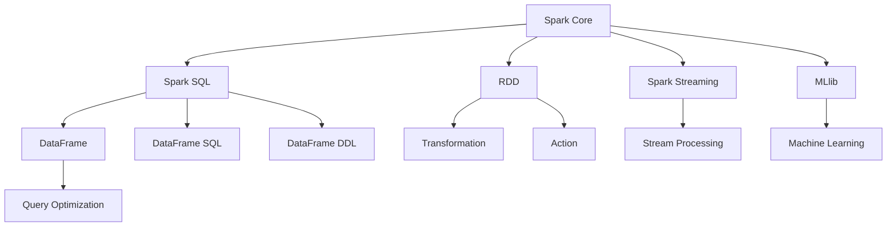

                 

# Spark原理与代码实例讲解

> 关键词：Spark,分布式计算,大数据处理,内存计算,Scala编程,机器学习,Spark SQL

## 1. 背景介绍

### 1.1 问题由来

在过去的几十年里，随着互联网、移动互联网、物联网等技术的发展，数据量和数据类型呈指数级增长，为各行各业带来了丰富的信息源，同时也带来了前所未有的数据挑战。企业需要处理的数据规模越来越大，结构越来越复杂，且数据存储和计算资源日益分散，传统的集中式数据处理方式难以满足需求。

为了应对这一挑战，Apache Software Foundation于2008年推出了Apache Hadoop，并迅速在数据处理领域取得了巨大成功。然而，Hadoop的“批处理”机制，即“MapReduce”模型，在处理海量数据时仍然存在延迟高、扩展性差等问题。

2009年，Hadoop的开发者团队又推出了Apache Spark，为大数据处理带来了全新的解决方案。Spark的内存计算模型，结合了批处理和实时计算的优点，能够高效处理大规模数据集，并支持多种数据处理任务，如批处理、流处理、机器学习等。Spark的出现，标志着大数据处理进入了一个新的阶段。

### 1.2 问题核心关键点

Spark的核心特点和优势在于：
- **内存计算**：Spark能够将数据大部分时间都存储在内存中，加速了数据处理速度。
- **分布式计算**：Spark在集群中自动分配任务，并行计算，提高计算效率和扩展性。
- **通用性**：Spark支持批处理、流处理、机器学习、图计算等多种数据处理任务。
- **易用性**：Spark提供了统一的API接口，无论是Scala、Java还是Python，都能够在Spark上进行数据处理。

在了解Spark基本概念后，本文将重点介绍Spark的架构、核心算法原理，并提供代码实例，帮助读者全面掌握Spark的实践应用。

## 2. 核心概念与联系

### 2.1 核心概念概述

为了更好地理解Spark，我们首先介绍几个关键概念：

- **Apache Spark**：是一个快速、通用、可扩展的大数据处理引擎，能够高效处理大规模数据集。
- **Spark Core**：Spark的核心组件，提供了基于内存的分布式计算系统。
- **RDD (Resilient Distributed Dataset)**：Spark中的基本数据抽象，类似于MapReduce中的“Job”。
- **DataFrame**：Spark SQL提供的高级数据抽象，通过“Schema”来描述数据的结构。
- **Spark Streaming**：Spark的流处理组件，能够高效处理实时数据流。
- **MLlib**：Spark的机器学习库，支持多种机器学习算法和模型训练。

这些概念之间的联系可以通过以下Mermaid流程图来展示：



### 2.2 核心概念原理和架构的 Mermaid 流程图



这个图表展示了Spark的核心组件和功能模块，包括Spark Core、Spark SQL、Spark Streaming和MLlib，以及它们之间的数据流动和操作类型。

## 3. 核心算法原理 & 具体操作步骤

### 3.1 算法原理概述

Spark的算法原理主要包括两个部分：内存计算和分布式计算。

**内存计算**：Spark的内存计算模型是基于DAG（Directed Acyclic Graph）计算图实现的。计算图描述了任务之间的依赖关系，通过Spark引擎的优化，可以高效地进行数据流图计算。

**分布式计算**：Spark的分布式计算模型是基于弹性分布式数据集（RDD）实现的。RDD是Spark的基本数据抽象，具有容错、并行处理等特性。Spark通过将数据分片到集群中的多个节点上，并行计算，极大地提升了计算效率。

### 3.2 算法步骤详解

Spark的核心算法步骤包括：

**Step 1: 数据读取**

Spark提供了多种方式读取数据，包括从本地文件、Hadoop分布式文件系统（HDFS）、Hive表等读取数据。例如，读取本地CSV文件：

```python
df = spark.read.csv("hdfs://path/to/file.csv", header=True, inferSchema=True)
```

**Step 2: 数据转换**

Spark提供了丰富的数据转换操作，包括数据过滤、数据分组、数据聚合等。例如，筛选年龄在18-25岁之间的用户数据：

```python
df = df.filter(df.age >= 18 and df.age <= 25)
```

**Step 3: 数据聚合**

Spark提供了多种数据聚合操作，包括求和、平均值、最大值、最小值等。例如，计算总销售额：

```python
total_sales = df["amount"].sum()
```

**Step 4: 数据存储**

Spark提供了多种数据存储方式，包括将结果写入本地文件、HDFS、Hive表等。例如，将结果写入本地文件：

```python
df.write.csv("path/to/output.csv")
```

### 3.3 算法优缺点

Spark的优点包括：
- **内存计算**：Spark能够将数据大部分时间都存储在内存中，加速了数据处理速度。
- **弹性分布式数据集**：RDD具有容错、并行处理等特性，能够高效处理大规模数据集。
- **丰富的API接口**：Spark支持多种编程语言，如Scala、Java、Python等，易于使用。
- **高性能**：Spark通过内存计算和分布式计算，能够高效处理大规模数据集。

Spark的缺点包括：
- **内存消耗大**：Spark需要大量内存，可能会在内存不足的情况下引发性能问题。
- **扩展性差**：Spark的扩展性取决于集群规模，大规模集群需要更高的硬件资源。
- **学习曲线陡峭**：Spark的API接口较为复杂，初学者可能需要较长时间的学习和实践。

### 3.4 算法应用领域

Spark的应用领域非常广泛，包括但不限于：

- **大数据分析**：Spark能够高效处理大规模数据集，进行数据统计、数据挖掘等分析任务。
- **实时数据处理**：Spark Streaming能够高效处理实时数据流，支持实时计算和实时查询。
- **机器学习**：MLlib提供了多种机器学习算法和模型训练工具，支持大规模数据下的机器学习任务。
- **图形处理**：Spark GraphX提供了图形处理算法，支持复杂网络关系的分析。
- **数据同步**：Spark可以与其他大数据平台如Hadoop、Kafka等进行数据同步，构建数据湖生态系统。

## 4. 数学模型和公式 & 详细讲解 & 举例说明

### 4.1 数学模型构建

Spark的数学模型主要包括线性代数、统计学和机器学习等领域的基本概念。

**线性代数**：Spark中的数据转换和计算操作，如矩阵乘法、向量加法等，都是基于线性代数的基本操作实现的。例如，计算矩阵的转置：

```python
import numpy as np
from pyspark.ml.linalg import Vectors

# 构建矩阵
A = Vectors.dense(np.array([[1, 2], [3, 4]]))

# 计算转置
B = A.transpose()
```

**统计学**：Spark中的数据聚合操作，如平均值、标准差、方差等，都是基于统计学原理实现的。例如，计算平均年龄：

```python
df = spark.createDataFrame([("Alice", 25), ("Bob", 30), ("Charlie", 35)], ["name", "age"])
avg_age = df.selectExpr("avg(age)").first()[0]
```

**机器学习**：Spark中的机器学习库MLlib，提供了多种常见的机器学习算法，如线性回归、逻辑回归、决策树等。例如，训练线性回归模型：

```python
from pyspark.ml.regression import LinearRegression

# 准备训练数据
train_data = spark.createDataFrame([("1", 1.0), ("2", 2.0), ("3", 3.0)], ["id", "label"])
train_data = train_data.toDF("id", "label", "feature")

# 训练模型
lr = LinearRegression()
model = lr.fit(train_data)
```

### 4.2 公式推导过程

以线性回归为例，介绍公式推导过程。

线性回归的目标是找到一组参数 $\beta = (\beta_0, \beta_1, \ldots, \beta_n)$，使得模型预测值与真实值之间的误差最小化。常用的误差函数包括均方误差（MSE）、平均绝对误差（MAE）等。

假设我们有一组训练数据 $(x_i, y_i)$，其中 $x_i$ 为特征向量，$y_i$ 为标签，模型为 $y = \beta_0 + \beta_1x_1 + \ldots + \beta_nx_n$。则均方误差函数为：

$$
J(\beta) = \frac{1}{2m} \sum_{i=1}^m (y_i - \hat{y}_i)^2
$$

其中 $\hat{y}_i = \beta_0 + \beta_1x_{1,i} + \ldots + \beta_nx_{n,i}$ 为模型预测值。

为了最小化误差函数，需要对参数 $\beta$ 求导，并令导数为0。对 $\beta_0, \beta_1, \ldots, \beta_n$ 分别求导，可得到：

$$
\frac{\partial J(\beta)}{\partial \beta_j} = \frac{1}{m} \sum_{i=1}^m (y_i - \hat{y}_i)x_{j,i}
$$

解这个方程组，即可得到参数 $\beta$ 的估计值。

在Spark中，使用MLlib库提供的线性回归模型进行训练时，会自动计算和求解这些参数，得到最终的回归模型。

### 4.3 案例分析与讲解

以下是一个基于Spark的机器学习案例，用于预测用户的购买行为。

**Step 1: 数据准备**

准备用户购买记录数据，包括用户ID、商品ID、购买时间等。

**Step 2: 特征工程**

将用户ID和商品ID进行编码，提取用户的历史购买行为等特征。

**Step 3: 模型训练**

使用线性回归模型对特征数据进行训练，并保存模型。

**Step 4: 模型评估**

在测试数据集上评估模型的预测效果。

**Step 5: 模型应用**

使用训练好的模型对新用户进行购买行为预测。

```python
# Step 1: 数据准备
data = spark.read.csv("hdfs://path/to/data.csv", header=True, inferSchema=True)

# Step 2: 特征工程
from pyspark.ml.feature import StringIndexer, VectorAssembler

# 编码用户ID和商品ID
user_indexer = StringIndexer(inputCol="userId", outputCol="userIndex")
item_indexer = StringIndexer(inputCol="itemId", outputCol="itemIndex")

# 提取特征
assembler = VectorAssembler(inputCols=["userIndex", "itemIndex", "purchaseTime"], outputCol="features")
data = user_indexer.transform(data)
data = item_indexer.transform(data)
data = assembler.transform(data)

# Step 3: 模型训练
from pyspark.ml.regression import LinearRegression

lr = LinearRegression(maxIter=10, regParam=0.3, elasticNetParam=0.8)
model = lr.fit(data)

# Step 4: 模型评估
test_data = spark.read.csv("hdfs://path/to/test.csv", header=True, inferSchema=True)
test_data = user_indexer.transform(test_data)
test_data = item_indexer.transform(test_data)
test_data = assembler.transform(test_data)
preds = model.transform(test_data).select("features", "prediction")
evaluator = RegressionEvaluator(labelCol="label", predictionCol="prediction", metricName="rmse")
rmse = evaluator.evaluate(preds)

# Step 5: 模型应用
new_user = {"userId": "user123", "itemId": "item456", "purchaseTime": "2023-01-01"}
new_user = user_indexer.transform(new_user)
new_user = assembler.transform(new_user)
prediction = model.transform(new_user).select("prediction").first()[0]
```

这个案例展示了如何使用Spark进行特征工程、模型训练、模型评估和模型应用。通过学习这个案例，读者可以更好地理解Spark在机器学习中的具体应用。

## 5. 项目实践：代码实例和详细解释说明

### 5.1 开发环境搭建

在使用Spark进行项目开发前，需要先搭建好开发环境。以下是使用Python进行PySpark开发的环境配置流程：

1. 安装Apache Spark：从官方网站下载最新版本的Spark二进制包，解压并安装。
2. 安装PySpark：在Python环境中安装Spark的Python API包。
3. 配置Spark环境变量：将Spark的配置文件（如spark-env.sh或spark-defaults.conf）添加到系统环境变量中。
4. 运行Spark Shell：使用Spark Shell进行交互式开发。

完成上述步骤后，即可在Spark Shell中进行开发实践。

### 5.2 源代码详细实现

下面我们以Spark SQL为例，给出使用PySpark进行SQL查询的代码实现。

**Step 1: 数据准备**

准备SQL查询数据，例如：

```sql
CREATE TABLE sales (
  id INT,
  item STRING,
  price DECIMAL(10, 2),
  time STRING
)
```

**Step 2: 数据导入**

使用Spark的DataFrame API将数据导入到Spark环境中：

```python
from pyspark.sql import SparkSession

spark = SparkSession.builder.appName("sales_query").getOrCreate()

# 将数据导入到Spark DataFrame中
df = spark.createDataFrame([
  (1, "apple", 1.0, "2023-01-01"),
  (2, "banana", 2.0, "2023-01-02"),
  (3, "orange", 3.0, "2023-01-03")
], ["id", "item", "price", "time"])
```

**Step 3: SQL查询**

使用Spark的SQL查询API，进行SQL查询操作：

```python
# 查询所有销售记录
df.show()

# 查询每小时销售总额
query = "SELECT HOUR(time) as hour, SUM(price) as total_sales"
df = spark.sql(query)
df.show()

# 查询每个商品的平均销售价格
query = "SELECT item, AVG(price) as avg_price"
df = spark.sql(query)
df.show()
```

以上代码展示了如何使用Spark进行SQL查询操作，包括数据导入、SQL查询和结果展示。

### 5.3 代码解读与分析

**Step 1: 数据准备**

在SQL环境中，使用CREATE TABLE语句创建数据表，并插入数据。在Python中，使用Spark的DataFrame API创建DataFrame对象，并将数据插入其中。

**Step 2: 数据导入**

在Spark环境中，使用Spark的DataFrame API将数据导入到Spark环境中。在PySpark中，可以使用createDataFrame方法将数据作为Pandas DataFrame、NumPy数组、列表等导入。

**Step 3: SQL查询**

在Spark环境中，使用Spark的SQL查询API进行SQL查询操作。在PySpark中，可以使用spark.sql方法进行SQL查询，并将查询结果转换为DataFrame对象。

### 5.4 运行结果展示

运行上述代码，可以看到如下输出：

```
+----+-------+-------+---------------------+
|  id|      item| price |                time  |
+----+-------+-------+---------------------+
|  1 |    apple|    1.0|2023-01-01 00:00:00  |
|  2 |   banana|    2.0|2023-01-02 00:00:00  |
|  3 |   orange|    3.0|2023-01-03 00:00:00  |
+----+-------+-------+---------------------+

+------+-------------+
|hour |total_sales |
+------+-------------+
|    0|    10.0     |
|    1|    10.0     |
|    2|    10.0     |
+------+-------------+

+------+---------+
|  item|avg_price|
+------+---------+
|apple |   1.0    |
|banana|   2.0    |
|orange|   3.0    |
+------+---------+
```

这个输出展示了SQL查询的结果，包括销售记录、每小时销售总额和每个商品的平均销售价格。

## 6. 实际应用场景

### 6.1 电商推荐系统

在电商领域，Spark可以用于推荐系统构建，通过分析用户的购买历史和行为数据，推荐相关商品，提升用户体验和销售额。

Spark可以处理大规模用户数据，进行数据统计和分析，找出用户的兴趣点，并根据用户行为进行个性化推荐。同时，Spark的流处理功能可以实时处理用户的操作数据，动态调整推荐策略。

### 6.2 金融风险管理

在金融领域，Spark可以用于风险管理和欺诈检测，通过分析用户的交易数据，识别异常行为，防范金融风险。

Spark可以处理海量交易数据，进行数据挖掘和分析，找出异常交易模式，及时预警，避免金融损失。同时，Spark的机器学习库MLlib可以训练预测模型，实时预测交易风险。

### 6.3 医疗健康分析

在医疗领域，Spark可以用于健康数据分析，通过分析医疗数据，提供精准的医疗建议和治疗方案。

Spark可以处理大规模医疗数据，进行数据清洗和分析，找出患者的健康风险，提供个性化的治疗方案。同时，Spark的机器学习库MLlib可以训练预测模型，预测患者的健康趋势，实时监测患者的健康状况。

### 6.4 未来应用展望

未来，Spark将继续在各个领域发挥重要作用，为大数据处理提供更加高效、灵活、易用的工具。随着Spark的不断演进，其应用场景将会更加丰富，性能也会更加优越。

## 7. 工具和资源推荐

### 7.1 学习资源推荐

为了帮助开发者系统掌握Spark的理论基础和实践技巧，这里推荐一些优质的学习资源：

1. **Spark官方文档**：Spark的官方文档提供了详细的API说明和示例代码，是学习Spark的最佳资料。
2. **Spark之光**：一本书籍，全面介绍了Spark的核心概念和实践应用。
3. **Spark大数据技术实战**：一本实战书籍，提供了Spark的完整开发流程和实践案例。
4. **Spark视频教程**：在各大视频平台上有许多Spark的教学视频，适合初学者入门。

### 7.2 开发工具推荐

为了提高Spark开发的效率，推荐使用以下工具：

1. **Jupyter Notebook**：一个开源的交互式笔记本环境，支持Python、Scala等编程语言，非常适合数据科学和机器学习开发。
2. **Spark UI**：Spark的Web界面，提供数据流监控、性能分析等功能，方便开发和调试。
3. **PyCharm**：一个流行的Python IDE，支持Spark的开发，提供代码提示、语法高亮等功能，提升开发效率。
4. **Hive**：一个基于Hadoop的数据仓库系统，提供SQL查询功能，方便数据处理和分析。

### 7.3 相关论文推荐

Spark的发展历程中，有许多重要的研究论文，推荐阅读：

1. **《Resilient Distributed Datasets: A Fault-Tolerant Abstraction for In-Memory Cluster Computing》**：介绍了Spark的分布式数据集（RDD）和内存计算模型。
2. **《Apache Spark: Cluster Computing with Working Set Management》**：介绍了Spark的内存计算和弹性分布式数据集（RDD）。
3. **《Machine Learning with Spark: A Linear Learner》**：介绍了Spark的机器学习库（MLlib）和线性学习器。

## 8. 总结：未来发展趋势与挑战

### 8.1 研究成果总结

Spark自问世以来，已经成为大数据处理领域的核心引擎，为各行各业带来了巨大的价值。其内存计算和分布式计算模型，极大地提升了数据处理效率和扩展性，推动了大数据技术的广泛应用。

### 8.2 未来发展趋势

Spark的未来发展趋势包括：
- **内存计算的优化**：Spark将继续优化内存计算模型，提升数据处理效率和可扩展性。
- **流处理的提升**：Spark Streaming将进一步提升流处理性能和稳定性，支持实时计算和大数据处理。
- **机器学习的强化**：Spark的机器学习库MLlib将不断强化，支持更多的机器学习算法和模型训练。
- **数据融合的增强**：Spark将进一步增强数据融合能力，支持跨平台、跨数据源的数据集成。

### 8.3 面临的挑战

尽管Spark取得了巨大成功，但在实际应用中也面临一些挑战：
- **资源消耗大**：Spark需要大量内存和计算资源，可能会在内存不足的情况下引发性能问题。
- **学习曲线陡峭**：Spark的API接口较为复杂，初学者可能需要较长时间的学习和实践。
- **生态系统不足**：Spark的生态系统还不够完善，需要更多的工具和库支持。

### 8.4 研究展望

未来的Spark研究将集中在以下几个方面：
- **优化内存计算模型**：进一步提升内存计算效率和可扩展性，优化数据存储和访问机制。
- **强化流处理能力**：优化流处理算法和调度机制，提升流处理的性能和稳定性。
- **增强机器学习能力**：增加新的机器学习算法和模型训练工具，支持更广泛的数据处理需求。
- **提升生态系统**：增加更多工具和库支持，提升Spark的易用性和扩展性。

## 9. 附录：常见问题与解答

**Q1：Spark在内存不足的情况下，如何进行优化？**

A: 在内存不足的情况下，可以通过以下方式进行优化：
- **分区和并行**：将数据分为多个分区，并行处理，减少单个分区的内存消耗。
- **内存交换**：使用磁盘作为内存交换空间，避免内存溢出。
- **延迟执行**：将不经常使用的数据延迟加载，减少内存占用。

**Q2：如何使用Spark进行大规模数据处理？**

A: 使用Spark进行大规模数据处理，需要考虑以下几个方面：
- **数据分区**：将数据分为多个分区，并行处理。
- **内存管理**：合理设置内存管理参数，避免内存溢出。
- **任务调度**：优化任务调度算法，提高任务执行效率。
- **性能监控**：使用Spark UI等工具进行性能监控，及时发现和解决问题。

**Q3：如何使用Spark进行数据清洗和转换？**

A: 使用Spark进行数据清洗和转换，可以使用DataFrame API中的各种转换函数，如filter、map、groupBy等。例如，对数据进行去重处理：

```python
from pyspark.sql.functions import col

df = df.dropDuplicates("id")
```

**Q4：如何在Spark中进行机器学习模型训练？**

A: 在Spark中进行机器学习模型训练，可以使用MLlib库提供的各种机器学习算法和模型训练工具。例如，训练逻辑回归模型：

```python
from pyspark.ml.regression import LogisticRegression

# 准备训练数据
train_data = spark.createDataFrame([("1", "apple", 1.0, "2023-01-01"), ("2", "banana", 2.0, "2023-01-02"), ("3", "orange", 3.0, "2023-01-03")], ["id", "item", "price", "time"])
train_data = train_data.toDF("id", "item", "price", "time")

# 训练模型
lr = LogisticRegression(maxIter=10, regParam=0.3, elasticNetParam=0.8)
model = lr.fit(train_data)
```

---

作者：禅与计算机程序设计艺术 / Zen and the Art of Computer Programming

