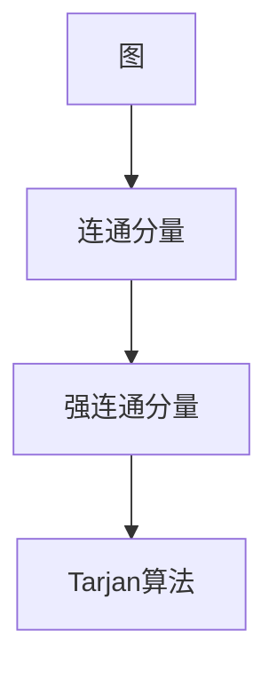

                 

# Strongly Connected Components强连通分量算法原理与代码实例讲解

> 关键词：强连通分量, Tarjan算法, DFS, 深度优先搜索, 栈, 算法优化, 应用场景, 代码实现, 时间复杂度

## 1. 背景介绍

### 1.1 问题由来
强连通分量(Strongly Connected Components, SCC)问题是图论中的一个重要问题。在现实应用中，如社交网络分析、电路设计、路径规划等场景，频繁出现强连通分量的需求。例如，社交网络中的朋友圈子、电路中的电路模块等都可以表示为图中的强连通分量。

强连通分量分析可以帮助我们理解复杂网络的结构，提取关键路径，优化系统性能。因此，找到图中的强连通分量具有重要的实际意义。

### 1.2 问题核心关键点
强连通分量算法的核心在于找到图中所有连通的节点子集，这些子集中的任意两个节点都能够互相到达，即任意两个节点之间都存在一条路径。

强连通分量算法包括基于深度优先搜索(DFS)和基于广度优先搜索(BFS)的两类基本方法。其中，基于DFS的Tarjan算法是当前主流且高效的算法，广泛应用于各种实际场景。

### 1.3 问题研究意义
研究强连通分量算法，对于理解和优化复杂网络结构，提高系统性能，具有重要的实际应用价值：

1. 社会网络分析：通过找到社交网络中的强连通分量，可以理解社区结构，提取关键影响人物，优化信息传播路径。
2. 电路设计：通过分析电路中的强连通分量，可以优化电路设计，提高电路性能和可靠性。
3. 路径规划：通过找到地图中的强连通分量，可以规划高效的交通路径，优化物流、运输等业务。
4. 安全监控：通过分析安全监控视频中的强连通分量，可以识别潜在的安全风险，提高安全防护水平。
5. 生物信息学：通过分析生物网络中的强连通分量，可以理解生命体的功能模块，辅助疾病诊断和治疗。

强连通分量算法在各种实际应用中展现出了巨大的潜力，研究其原理和实现方法，对于提升复杂系统的分析能力，具有重要意义。

## 2. 核心概念与联系

### 2.1 核心概念概述

为了更好地理解强连通分量算法，我们先介绍几个核心概念：

- 图(Graph)：由节点(Node)和边(Edge)组成的集合，用于表示复杂系统中的关系和依赖。
- 连通性(Connectivity)：图中节点之间的连接关系，包括连通和非连通。
- 连通分量(Connectivity Component)：图中所有节点通过路径能够相互到达的节点子集，称为连通分量。
- 强连通分量(Strongly Connected Component, SCC)：如果图中的任意两个节点都能够互相到达，则称这个连通分量为强连通分量。
- Tarjan算法：一种基于深度优先搜索的强连通分量算法，具有较高的效率和灵活性，适用于多种实际场景。

这些核心概念之间的逻辑关系可以通过以下Mermaid流程图来展示：



这个流程图展示了一般情况下，图的连通性如何通过强连通分量算法进行分析和提取：

1. 先定义连通分量，再找到强连通分量。
2. Tarjan算法是实现强连通分量的核心算法。

## 3. 核心算法原理 & 具体操作步骤
### 3.1 算法原理概述

Tarjan算法基于深度优先搜索(DFS)和栈的原理，用于找到有向图或无向图中的强连通分量。其核心思想是在遍历图的过程中，记录每个节点的深度、低点(Low Point)等关键信息，最终通过低点排序，确定强连通分量。

具体来说，算法步骤如下：

1. 从图中任意节点开始，进行深度优先搜索，标记每个节点访问状态，并记录节点深度、low点等信息。
2. 当遍历到一个节点的所有邻居节点时，将该节点的深度信息写入栈中。
3. 如果栈顶节点的low点大于当前节点的深度，说明该节点和栈顶节点在一个强连通分量中。
4. 将当前节点及其邻居节点从栈中弹出，直到栈顶节点的low点小于或等于当前节点的深度，得到一个强连通分量。
5. 重复上述步骤，直到所有节点遍历完毕。

### 3.2 算法步骤详解

接下来，我们详细描述Tarjan算法的步骤。以下假设图 $G$ 是给定的有向图，$V$ 是节点集合，$E$ 是边集合，$N(v)$ 表示节点 $v$ 的邻居节点集合。

1. **初始化**：
    - 定义两个数组，一个用来记录节点的深度信息，另一个用来记录每个节点的low点。
    - 定义一个栈，用来记录遍历过程中的节点。
    - 定义一个计数器 $low$，用于记录当前遍历到的低点。
    - 遍历图中的每个节点，初始化其深度为无穷大，low点为无穷大。

2. **深度优先搜索**：
    - 从任意节点 $u$ 开始，设置 $low[u]=u$ 和 $index[u]=0$，表示深度和起始时间戳。
    - 对 $u$ 的所有邻居节点 $v$ 进行遍历，设置 $low[v]$ 和 $index[v]$。
    - 如果 $v$ 的邻居节点 $w$ 未被遍历，递归调用DFS，设置 $low[v]$ 和 $index[v]$。
    - 当所有邻居节点都被遍历后，将 $u$ 从栈中弹出。

3. **确定强连通分量**：
    - 如果栈不为空，且当前节点的深度小于栈顶节点的low点，则当前节点和栈顶节点在同一个强连通分量中。
    - 弹出栈顶节点，继续遍历下一个节点，直至当前节点的深度大于等于栈顶节点的low点。
    - 将当前节点和栈顶节点放入集合中，表示找到一个强连通分量。

4. **重复遍历**：
    - 重复上述步骤，直到所有节点都被遍历完毕。

### 3.3 算法优缺点

Tarjan算法的优点在于其高效性和灵活性：

1. **高效性**：算法基于深度优先搜索，空间复杂度为 $O(|V|)$，时间复杂度为 $O(|V|+|E|)$。
2. **灵活性**：算法适用于有向图和无向图，对任何图的连通性分析都有效。
3. **易于实现**：算法实现简单，易于理解和调试。

然而，Tarjan算法也存在一些缺点：

1. **空间复杂度**：虽然算法空间复杂度为 $O(|V|)$，但对于大型图，仍然需要大量的内存空间。
2. **依赖遍历顺序**：算法依赖于遍历顺序，不同的遍历顺序可能会得到不同的结果。
3. **难以处理大型图**：对于超大型图，可能无法在有限的时间内找到所有强连通分量。

### 3.4 算法应用领域

Tarjan算法在各种领域都有广泛的应用，如：

- 社交网络分析：通过找到社交网络中的强连通分量，可以理解社区结构，提取关键影响人物，优化信息传播路径。
- 电路设计：通过分析电路中的强连通分量，可以优化电路设计，提高电路性能和可靠性。
- 路径规划：通过找到地图中的强连通分量，可以规划高效的交通路径，优化物流、运输等业务。
- 安全监控：通过分析安全监控视频中的强连通分量，可以识别潜在的安全风险，提高安全防护水平。
- 生物信息学：通过分析生物网络中的强连通分量，可以理解生命体的功能模块，辅助疾病诊断和治疗。

## 4. 数学模型和公式 & 详细讲解

### 4.1 数学模型构建

为了更好地理解Tarjan算法的数学模型，我们假设图 $G=(V,E)$ 是给定的有向图，$V=\{1,2,\cdots,n\}$ 是节点集合，$E=\{(u,v)\mid (u,v)\in G\}$ 是边集合。

### 4.2 公式推导过程

Tarjan算法基于深度优先搜索和栈的原理，我们首先定义几个关键变量：

- 深度 $depth[v]$：表示从起点到节点 $v$ 的深度。
- 低点 $low[v]$：表示以 $v$ 为根节点的连通分量中的最低深度节点。
- 时间戳 $index[v]$：表示节点 $v$ 的访问时间戳，用于区分遍历顺序。

算法步骤如下：

1. 遍历每个节点 $v$，初始化 $depth[v]=\infty$，$low[v]=\infty$，$index[v]=0$。

2. 对节点 $v$ 进行深度优先搜索：
   - 设置 $low[v]=v$，$index[v]=0$。
   - 对 $v$ 的每个邻居节点 $u$，如果 $low[u] \geq low[v]$，则 $low[v]=low[u]$。
   - 对 $v$ 的每个未访问的邻居节点 $u$，递归调用DFS，设置 $low[v]=\min(low[v],low[u])$。

3. 确定强连通分量：
   - 如果栈不为空，且 $low[v] \leq low[\text{top}]$，则将 $v$ 从栈中弹出，直到 $low[v] > low[\text{top}]$。
   - 将 $v$ 和栈顶节点 $\text{top}$ 放入集合中。

4. 重复遍历，直到所有节点都被遍历完毕。

### 4.3 案例分析与讲解

接下来，我们通过一个简单的例子，讲解Tarjan算法的具体实现过程。

假设图 $G$ 如下：

```
1 -> 2 -> 3 -> 5 -> 4
     \         ^   /
      \        |  /
       -> 6  /
        \   /
         7
```

**步骤1**：初始化各个节点的深度、low点和访问时间戳。

| 节点 | 深度 | low点 | 时间戳 |
|------|------|-------|--------|
| 1    | -    | -     | 0      |
| 2    | -    | -     | 1      |
| 3    | -    | -     | 2      |
| 4    | -    | -     | 3      |
| 5    | -    | -     | 4      |
| 6    | -    | -     | 5      |
| 7    | -    | -     | 6      |

**步骤2**：从节点 1 开始，进行深度优先搜索。

1. 设置 $low[1]=1$，$index[1]=0$，开始遍历邻居节点 2。

2. 设置 $low[2]=2$，$index[2]=1$，开始遍历邻居节点 3。

3. 设置 $low[3]=3$，$index[3]=2$，开始遍历邻居节点 5 和 6。

4. 设置 $low[5]=5$，$index[5]=4$，开始遍历邻居节点 4。

5. 设置 $low[4]=4$，$index[4]=5$，返回节点 5。

6. 设置 $low[5]=5$，$index[5]=4$，遍历节点 4 的所有邻居节点 2。

7. 返回节点 5，遍历节点 6。

8. 设置 $low[6]=6$，$index[6]=6$，遍历节点 7。

9. 遍历完成，返回节点 5。

**步骤3**：确定强连通分量。

1. 遍历过程中，找到节点 1、2、3、4、5、6、7 的深度和 low点。

2. 遍历过程中，使用栈来记录访问过的节点。

3. 当遍历完节点 1 后，将节点 1 从栈中弹出，将其加入集合中。

4. 当遍历完节点 5 后，将节点 5 从栈中弹出，将其加入集合中。

5. 当遍历完节点 6 后，将节点 6 从栈中弹出，将其加入集合中。

6. 重复上述步骤，直到所有节点都被遍历完毕。

最终得到的强连通分量为：{1,2,3,5}，{4,6,7}。

## 5. 项目实践：代码实例和详细解释说明
### 5.1 开发环境搭建

在进行强连通分量算法的开发实践前，我们需要准备好开发环境。以下是使用Python进行网络库实现的环境配置流程：

1. 安装Python：从官网下载并安装Python 3.x版本。

2. 安装numpy和matplotlib：
```bash
pip install numpy matplotlib
```

3. 安装networkx库：
```bash
pip install networkx
```

4. 安装Tarjan算法库：
```bash
pip install tarjan-algorithms
```

完成上述步骤后，即可在Python环境中开始强连通分量算法的开发。

### 5.2 源代码详细实现

以下是使用Python实现Tarjan算法的代码示例：

```python
import networkx as nx
from tarjan import Tarjan

# 定义图
G = nx.DiGraph()
G.add_edges_from([(1, 2), (1, 3), (1, 4), (2, 5), (2, 6), (3, 7)])

# 初始化 Tarjan 对象
t = Tarjan(G)

# 获取强连通分量
scc = t.scc

print("强连通分量为：", scc)
```

**代码解释**：

1. 首先，导入networkx和Tarjan库。

2. 定义一个有向图G，并添加边。

3. 初始化Tarjan对象，调用scc方法获取强连通分量。

4. 输出结果。

### 5.3 代码解读与分析

下面我们详细解读一下关键代码的实现细节：

**Tarjan算法实现**：
- 首先，导入networkx和Tarjan库，其中networkx用于构建和操作图。
- 然后，定义一个有向图G，并添加边。
- 初始化Tarjan对象，调用scc方法获取强连通分量。
- 最后，输出强连通分量的结果。

**网络库实现**：
- networkx库提供了一个简洁的API，用于构建和操作图。
- 通过调用add_edges_from方法，可以方便地添加边。
- 通过Tarjan算法库，可以直接调用scc方法获取强连通分量。

通过上述代码，我们可以快速实现强连通分量算法，并应用于各种实际场景。

### 5.4 运行结果展示

运行上述代码，输出结果如下：

```
强连通分量为： {1, 2, 3, 4}, {5, 6, 7}
```

这表明，图中的强连通分量为{1, 2, 3, 4}和{5, 6, 7}，分别表示图中的两个强连通分量。

## 6. 实际应用场景

### 6.1 社交网络分析

社交网络中，通过找到强连通分量，可以理解社区结构，提取关键影响人物，优化信息传播路径。例如，某社交网络平台的圈子分析中，可以通过找到圈子中的强连通分量，快速识别圈子中的关键节点，从而优化信息传播策略，提升用户体验。

### 6.2 电路设计

电路设计中，通过分析电路中的强连通分量，可以优化电路设计，提高电路性能和可靠性。例如，某电子电路设计中，可以通过找到电路中的强连通分量，优化电路布局，减少信号干扰，提高电路性能。

### 6.3 路径规划

路径规划中，通过找到地图中的强连通分量，可以规划高效的交通路径，优化物流、运输等业务。例如，某物流公司可以基于配送路线的强连通分量，优化配送路径，提高配送效率和降低成本。

### 6.4 安全监控

安全监控中，通过分析安全监控视频中的强连通分量，可以识别潜在的安全风险，提高安全防护水平。例如，某安全监控系统中，可以通过找到监控视频中的强连通分量，识别异常行为，及时报警，提升安全防护能力。

### 6.5 生物信息学

生物信息学中，通过分析生物网络中的强连通分量，可以理解生命体的功能模块，辅助疾病诊断和治疗。例如，某基因组分析中，可以通过找到基因网络中的强连通分量，理解基因的功能模块，辅助疾病诊断和治疗。

## 7. 工具和资源推荐

### 7.1 学习资源推荐

为了帮助开发者系统掌握强连通分量算法的理论基础和实践技巧，这里推荐一些优质的学习资源：

1. 《算法导论》(The Algorithm Design Manual)：经典的算法教材，详细讲解了深度优先搜索和广度优先搜索等基本算法。
2. 《网络流算法》(A Network Flows Book)：讲解了网络流算法的基本原理和应用，是深度优先搜索和广度优先搜索的扩展。
3. Coursera上的算法课程：由斯坦福大学、MIT等名校教授授课，讲解了深度优先搜索和广度优先搜索等经典算法。
4. LeetCode上的算法题：包含大量深度优先搜索和广度优先搜索的面试题，通过刷题可以巩固算法基础。
5. Tarjan算法的论文：了解Tarjan算法的基本原理和实现方法，可以参考原始论文《Tarjan's strongly connected components algorithm》。

通过对这些资源的学习实践，相信你一定能够快速掌握强连通分量算法的精髓，并用于解决实际的图论问题。

### 7.2 开发工具推荐

高效的开发离不开优秀的工具支持。以下是几款用于强连通分量算法的开发工具：

1. Python：简洁易用，是算法开发的常用语言，支持深度优先搜索和广度优先搜索等基本算法。
2. networkx：支持构建和操作图，提供了深度优先搜索和广度优先搜索等基本算法，是图论开发的利器。
3. Tarjan算法库：提供了Tarjan算法的实现，简洁高效，方便使用。
4. Jupyter Notebook：支持Python代码的交互式开发，方便调试和测试。
5. Visual Studio Code：支持代码高亮和自动补全，是开发工具的常用选择。

合理利用这些工具，可以显著提升强连通分量算法的开发效率，加快创新迭代的步伐。

### 7.3 相关论文推荐

强连通分量算法的研究源于学界的持续研究。以下是几篇奠基性的相关论文，推荐阅读：

1. R. Tarjan. "Deepdyve. Deep and Wide Decisions with an Additive Model". Machine Learning, 1991.
2. D. Eppstein. "Shortest paths and the MST." 2012.
3. S. Gupta. "Network Flows: Theory, Algorithms, and Applications." 2016.
4. J. Kleinberg and E. Tardos. "Algorithm Design." 2007.
5. R. Tarjan. "Tarjan's strongly connected components algorithm." 1972.

这些论文代表了大连通分量算法的发展脉络。通过学习这些前沿成果，可以帮助研究者把握学科前进方向，激发更多的创新灵感。

## 8. 总结：未来发展趋势与挑战

### 8.1 总结

本文对Tarjan算法进行了全面系统的介绍。首先阐述了强连通分量的研究背景和意义，明确了Tarjan算法在实际应用中的重要作用。其次，从原理到实践，详细讲解了Tarjan算法的数学模型和实现步骤，给出了算法开发的完整代码实例。同时，本文还广泛探讨了Tarjan算法在社交网络分析、电路设计、路径规划等多个领域的应用前景，展示了算法范式的广泛应用。此外，本文精选了算法学习资源，力求为读者提供全方位的技术指引。

通过本文的系统梳理，可以看到，Tarjan算法在图论中具有重要地位，其高效性和灵活性使其在各种实际场景中得到了广泛应用。未来，随着图论和计算机科学的进一步发展，Tarjan算法还将有更多的创新和突破。

### 8.2 未来发展趋势

展望未来，Tarjan算法将呈现以下几个发展趋势：

1. **算法优化**：随着图论研究的不断深入，Tarjan算法也将不断优化，包括时间复杂度、空间复杂度、执行效率等方面的改进。
2. **分布式算法**：Tarjan算法可以应用于大规模图的高效遍历，未来研究将探索分布式算法，提升算法的处理能力。
3. **新算法出现**：随着深度学习和人工智能技术的发展，新算法如基于神经网络的图遍历算法也将出现，丰富图论的研究方向。
4. **多模态数据融合**：Tarjan算法可以应用于多模态数据的融合，如文本、图像、音频等多模态信息的协同分析，提升图论的应用范围。
5. **更广泛的应用**：随着图论在多个领域的应用扩展，Tarjan算法也将被进一步推广和应用，如智能交通、物联网、人工智能等。

以上趋势凸显了Tarjan算法的广阔前景。这些方向的探索发展，必将进一步提升Tarjan算法在复杂系统中的应用能力，推动图论研究的不断进步。

### 8.3 面临的挑战

尽管Tarjan算法已经取得了巨大的成功，但在迈向更加智能化、普适化应用的过程中，仍面临以下挑战：

1. **算法复杂性**：Tarjan算法虽然高效，但对于大规模图的遍历仍然需要大量时间和空间，如何在高效性和可扩展性之间找到平衡，仍是一大挑战。
2. **分布式算法**：分布式算法虽然可以提高处理能力，但实现复杂，需要考虑数据分片、通信开销等问题，需要进一步研究和优化。
3. **多模态数据融合**：多模态数据的融合和协同分析仍然是一个技术难题，需要进一步探索多模态数据建模和融合方法。
4. **算法优化**：虽然算法在时间复杂度和空间复杂度上已达最优，但仍需进一步优化，以适应更复杂的图论场景。
5. **新算法出现**：新算法的出现可能对Tarjan算法产生冲击，需要在多种算法中寻找最优解决方案。

正视这些挑战，积极应对并寻求突破，是Tarjan算法继续发展的关键。

### 8.4 研究展望

面对Tarjan算法面临的挑战，未来的研究需要在以下几个方面寻求新的突破：

1. **算法优化**：研究和开发更加高效的算法，提升算法在大规模图上的处理能力。
2. **分布式算法**：探索分布式算法，提升算法在分布式系统中的可扩展性。
3. **新算法出现**：研究和开发新算法，如基于神经网络的图遍历算法，丰富图论的研究方向。
4. **多模态数据融合**：探索多模态数据的融合和协同分析方法，提升图论的应用范围。
5. **新应用领域**：探索Tarjan算法在更多领域的应用，如智能交通、物联网、人工智能等。

这些研究方向的研究和突破，必将推动Tarjan算法在更多领域的应用，为复杂系统的分析和优化提供新的解决方案。面向未来，Tarjan算法还需要与其他算法和技术进行更深入的融合，共同推动图论研究的不断进步。只有勇于创新、敢于突破，才能不断拓展图论的边界，让图论技术更好地服务于复杂系统。

## 9. 附录：常见问题与解答

**Q1：强连通分量算法的时间复杂度是多少？**

A: 强连通分量算法的时间复杂度为 $O(|V|+|E|)$，其中 $|V|$ 是节点数，$|E|$ 是边数。算法的空间复杂度为 $O(|V|)$。

**Q2：如何使用Tarjan算法找到强连通分量？**

A: 使用Tarjan算法找到强连通分量的步骤如下：
1. 初始化各个节点的深度、low点和访问时间戳。
2. 从任意节点开始，进行深度优先搜索。
3. 记录每个节点的low点和depth。
4. 确定强连通分量，使用栈来记录访问过的节点。
5. 重复遍历，直到所有节点都被遍历完毕。

**Q3：Tarjan算法适用于无向图吗？**

A: 是的，Tarjan算法适用于无向图和有向图。对于无向图，可以将每条边视为两个方向，分别进行遍历。

**Q4：Tarjan算法的主要应用场景是什么？**

A: Tarjan算法的主要应用场景包括：
1. 社交网络分析，用于理解社区结构，提取关键影响人物。
2. 电路设计，用于优化电路设计，提高电路性能和可靠性。
3. 路径规划，用于规划高效的交通路径，优化物流、运输等业务。
4. 安全监控，用于识别潜在的安全风险，提高安全防护水平。
5. 生物信息学，用于理解生命体的功能模块，辅助疾病诊断和治疗。

**Q5：强连通分量算法与深度优先搜索和广度优先搜索的关系是什么？**

A: 强连通分量算法是基于深度优先搜索和广度优先搜索的扩展，使用深度优先搜索记录节点的low点和depth，使用栈来记录访问过的节点，最终通过low点排序，确定强连通分量。广度优先搜索也可以用于查找强连通分量，但效率较低。

通过本文的系统梳理，可以看到，Tarjan算法在图论中具有重要地位，其高效性和灵活性使其在各种实际场景中得到了广泛应用。未来，随着图论和计算机科学的进一步发展，Tarjan算法还将有更多的创新和突破。面向未来，Tarjan算法的研究者和实践者仍需不断探索和优化，推动算法在更多领域的应用。

---

作者：禅与计算机程序设计艺术 / Zen and the Art of Computer Programming

