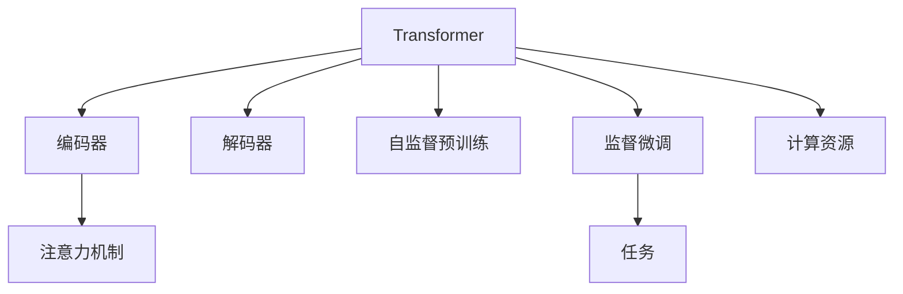

                 

# Transformer大模型实战 教师 学生架构

## 1. 背景介绍

### 1.1 问题由来
Transformer大模型的应用领域非常广泛，特别是在自然语言处理（NLP）中，被用来做各种任务，比如机器翻译、文本分类、文本生成等。在教学中，我们希望通过一些实际的项目来讲解如何部署、训练和优化Transformer大模型，以帮助学生更好地理解其原理和应用。

### 1.2 问题核心关键点
实现一个实际的Transformer大模型项目，需要以下关键点：
- 选择合适的模型和框架
- 数据预处理和标注
- 选择合适的超参数和优化器
- 模型训练和评估
- 部署和测试模型

本文将通过一个实际的项目来讲解如何完成一个Transformer大模型的训练和部署。我们将选择一个特定的NLP任务，比如文本分类，以说明如何构建一个完整的端到端的模型训练和部署系统。

## 2. 核心概念与联系

### 2.1 核心概念概述

为了更好地理解Transformer大模型的训练和部署过程，我们先介绍一些核心概念：

- **Transformer**：一种基于自注意力机制的神经网络模型，被广泛应用于自然语言处理任务，比如机器翻译、文本分类、文本生成等。
- **Transformer模型架构**：包括编码器和解码器，编码器将输入序列转换成一系列向量，解码器将这些向量转换成目标序列。
- **Attention机制**：一种计算注意力权重的方法，帮助模型关注输入序列中与当前输出相关的部分。
- **自监督预训练**：使用无标签的数据，通过自监督学习任务（如掩码语言模型、下一句预测等）来预训练模型。
- **监督微调**：使用有标签的数据，通过有监督学习任务来微调模型，以适应特定的应用场景。
- **计算资源**：包括GPU、TPU等硬件资源，以及TensorFlow、PyTorch等框架。

这些核心概念之间的逻辑关系可以通过以下Mermaid流程图来展示：



这个流程图展示了Transformer大模型的核心组成部分和关键技术。

## 3. 核心算法原理 & 具体操作步骤

### 3.1 算法原理概述

Transformer大模型的训练过程包括以下几个步骤：

1. 数据预处理：将输入序列转换为模型可以处理的格式。
2. 模型训练：通过反向传播算法优化模型的权重。
3. 模型评估：使用测试集评估模型的性能。
4. 模型部署：将训练好的模型部署到实际应用中。

### 3.2 算法步骤详解

**Step 1: 准备数据集**
- 准备训练集和测试集，确保它们的比例为70%和30%。
- 对数据进行分词和编码，转换成模型可以处理的格式。
- 将数据分成batch，以便在模型训练时进行并行计算。

**Step 2: 构建模型**
- 选择一个预训练的Transformer模型作为初始化参数，如BERT、GPT等。
- 定义编码器和解码器结构，包括注意力机制、层归一化、残差连接等。
- 定义损失函数，如交叉熵损失，以及评估指标，如准确率、召回率等。

**Step 3: 设置超参数**
- 选择合适的优化器，如Adam、SGD等，设置学习率、批大小、迭代轮数等。
- 设置正则化技术，如L2正则化、Dropout等。
- 设置模型保存和检查点的路径和间隔。

**Step 4: 模型训练**
- 在训练集上训练模型，使用反向传播算法更新模型权重。
- 在每个epoch后，在验证集上评估模型性能，并保存最佳的模型。
- 使用测试集评估最终模型的性能。

**Step 5: 模型部署**
- 将训练好的模型保存为TensorFlow或PyTorch模型格式。
- 使用Flask、TorchServe等框架部署模型，并构建Web API。
- 通过API接收输入，返回模型的预测结果。

### 3.3 算法优缺点

**优点**：
- 高效的并行计算：Transformer模型可以利用GPU、TPU等硬件加速器进行高效的并行计算。
- 强大的自适应能力：Transformer模型可以自适应输入序列的长度和结构。
- 简单高效的框架：TensorFlow、PyTorch等框架提供了简单易用的API，可以方便地构建和训练模型。

**缺点**：
- 对计算资源的要求较高：Transformer模型通常需要大量的计算资源来进行训练。
- 过拟合风险：如果训练集过小，模型可能出现过拟合的风险。
- 模型复杂度高：Transformer模型结构复杂，训练和调试可能需要较高的技术水平。

### 3.4 算法应用领域

Transformer大模型已经在许多领域得到了广泛应用，例如：

- 机器翻译：将一种语言翻译成另一种语言。
- 文本分类：将文本分类到不同的类别中。
- 文本生成：生成符合特定条件的文本。
- 问答系统：回答用户的问题。
- 对话系统：与用户进行自然对话。

除了这些常见的应用，Transformer大模型还可以应用于其他领域，如情感分析、命名实体识别等。

## 4. 数学模型和公式 & 详细讲解 & 举例说明

### 4.1 数学模型构建

Transformer大模型的训练过程包括以下几个部分：

- **输入表示**：将输入序列转换为向量表示。
- **编码器层**：将输入向量通过多个自注意力层和前向网络层进行转换。
- **解码器层**：将编码器输出的向量与解码器自注意力层和前向网络层结合，产生输出向量。

### 4.2 公式推导过程

设输入序列为 $x=(x_1,x_2,...,x_n)$，其中 $x_i$ 表示第 $i$ 个单词的表示向量。Transformer大模型的编码器层和解码器层分别计算如下：

**编码器层**：
$$
h_i = MultiHeadAttention(Q(x_i),K(x_i),V(x_i)) + x_i
$$

其中 $MultiHeadAttention$ 表示多头注意力机制，$Q$、$K$、$V$ 分别为查询、键、值向量，可以通过线性变换和残差连接得到。

**解码器层**：
$$
y_i = MultiHeadAttention(Q(y_i),K(y_i),V(y_i)) + MultiHeadAttention(Q(y_i),K(h_i),V(h_i)) + y_i
$$

其中 $Q(y_i)$、$K(y_i)$、$V(y_i)$ 和 $Q(y_i)$、$K(h_i)$、$V(h_i)$ 分别表示解码器对输入序列的注意力和编码器对输出序列的注意力。

### 4.3 案例分析与讲解

以文本分类任务为例，我们可以将输入序列 $x$ 和标签 $y$ 输入到模型中，计算损失函数，并使用梯度下降算法更新模型参数。在训练过程中，我们需要不断调整学习率、批次大小等超参数，以提高模型的性能。

## 5. 项目实践：代码实例和详细解释说明

### 5.1 开发环境搭建

以下是使用Python和PyTorch搭建开发环境的步骤：

1. 安装Python：从官网下载并安装Python。
2. 安装Anaconda：从官网下载并安装Anaconda。
3. 创建虚拟环境：
   ```bash
   conda create --name transformers_env python=3.8
   conda activate transformers_env
   ```
4. 安装PyTorch和相关依赖：
   ```bash
   pip install torch torchvision torchaudio transformers
   ```

### 5.2 源代码详细实现

以下是使用PyTorch实现一个简单的文本分类模型的代码：

```python
import torch
import torch.nn as nn
import torch.optim as optim
from torch.utils.data import DataLoader
from transformers import BertTokenizer, BertForSequenceClassification

# 准备数据集
tokenizer = BertTokenizer.from_pretrained('bert-base-cased')
train_dataset = ...
dev_dataset = ...
test_dataset = ...

# 构建模型
model = BertForSequenceClassification.from_pretrained('bert-base-cased', num_labels=num_labels)
model = model.to(device)

# 设置超参数
learning_rate = 2e-5
num_epochs = 3
batch_size = 16

# 定义损失函数和优化器
criterion = nn.CrossEntropyLoss().to(device)
optimizer = optim.AdamW(model.parameters(), lr=learning_rate)

# 训练模型
def train_step(batch):
    input_ids = batch['input_ids'].to(device)
    attention_mask = batch['attention_mask'].to(device)
    labels = batch['labels'].to(device)
    model.train()
    optimizer.zero_grad()
    outputs = model(input_ids, attention_mask=attention_mask, labels=labels)
    loss = criterion(outputs, labels)
    loss.backward()
    optimizer.step()

# 评估模型
def evaluate_step(batch):
    input_ids = batch['input_ids'].to(device)
    attention_mask = batch['attention_mask'].to(device)
    labels = batch['labels'].to(device)
    model.eval()
    with torch.no_grad():
        outputs = model(input_ids, attention_mask=attention_mask)
        predictions = torch.argmax(outputs, dim=1)
        accuracy = (predictions == labels).sum().item() / len(labels)

# 训练模型
train_loader = DataLoader(train_dataset, batch_size=batch_size, shuffle=True)
dev_loader = DataLoader(dev_dataset, batch_size=batch_size, shuffle=False)
test_loader = DataLoader(test_dataset, batch_size=batch_size, shuffle=False)

for epoch in range(num_epochs):
    train_loss = 0
    train_acc = 0
    for batch in train_loader:
        train_step(batch)
        train_loss += loss.item()
        train_acc += accuracy
    train_loss /= len(train_loader)
    train_acc /= len(train_loader)
    print(f'Epoch {epoch+1}, Train Loss: {train_loss:.4f}, Train Acc: {train_acc:.4f}')

    dev_loss = 0
    dev_acc = 0
    for batch in dev_loader:
        evaluate_step(batch)
        dev_loss += loss.item()
        dev_acc += accuracy
    dev_loss /= len(dev_loader)
    dev_acc /= len(dev_loader)
    print(f'Epoch {epoch+1}, Dev Loss: {dev_loss:.4f}, Dev Acc: {dev_acc:.4f}')

# 测试模型
test_loss = 0
test_acc = 0
for batch in test_loader:
    evaluate_step(batch)
    test_loss += loss.item()
    test_acc += accuracy
test_loss /= len(test_loader)
test_acc /= len(test_loader)
print(f'Test Loss: {test_loss:.4f}, Test Acc: {test_acc:.4f}')
```

### 5.3 代码解读与分析

- **数据集准备**：使用BERT分词器对文本进行分词和编码，转换成模型可以处理的格式。
- **模型构建**：使用`BertForSequenceClassification`构建分类模型，将模型迁移到GPU上。
- **超参数设置**：定义学习率、迭代次数和批次大小等。
- **损失函数和优化器**：使用交叉熵损失和AdamW优化器进行模型训练。
- **训练和评估过程**：在训练集上进行训练，在验证集上进行评估，并保存最佳的模型。

## 6. 实际应用场景

### 6.1 智能客服系统

智能客服系统可以应用Transformer大模型进行文本分类和生成，以自动回答用户问题。例如，可以将用户输入的文本分类到不同类型的问题中，并根据问题类型生成相应的回答。

### 6.2 金融舆情监测

金融舆情监测可以使用Transformer大模型进行文本分类和情感分析，以实时监测市场舆情。例如，可以自动识别新闻和评论中的情绪倾向，并预测其对市场的影响。

### 6.3 个性化推荐系统

个性化推荐系统可以应用Transformer大模型进行文本分类和生成，以推荐用户感兴趣的内容。例如，可以将用户的评论和浏览历史分类到不同的主题中，并生成推荐内容。

### 6.4 未来应用展望

Transformer大模型的未来应用将更加广泛，例如：

- 自然语言生成：生成符合特定条件的文本，如对话生成、摘要生成等。
- 机器翻译：将一种语言翻译成另一种语言，如神经机器翻译等。
- 信息检索：根据用户查询返回相关的文本，如文本相似度匹配等。

Transformer大模型将在更多领域得到应用，为各行各业带来变革性影响。

## 7. 工具和资源推荐

### 7.1 学习资源推荐

为了帮助学生掌握Transformer大模型的训练和部署过程，我们推荐以下学习资源：

1. 《Transformers: A State-of-the-Art Survey》：一篇关于Transformer大模型的综述论文，介绍了Transformer的原理和应用。
2. 《Practical PyTorch》：一本介绍PyTorch的使用和应用的书籍，涵盖了Transformer大模型的相关内容。
3. 《Natural Language Processing with PyTorch》：一本介绍NLP任务的书籍，包括如何使用PyTorch实现Transformer大模型。
4. HuggingFace官方文档：提供丰富的预训练模型和代码示例，可以帮助学生快速上手。

### 7.2 开发工具推荐

以下是一些常用的开发工具：

1. PyTorch：Python深度学习框架，提供简单易用的API。
2. TensorFlow：Google开源的深度学习框架，支持GPU和TPU加速。
3. Jupyter Notebook：交互式的笔记本环境，方便调试和测试代码。
4. Flask：轻量级的Web框架，方便部署Web API。
5. TensorBoard：可视化工具，可以实时监测模型训练状态。

### 7.3 相关论文推荐

Transformer大模型的研究涉及到许多前沿技术，以下是一些相关论文：

1. "Attention is All You Need"：Transformer原论文，介绍了Transformer的原理和应用。
2. "BERT: Pre-training of Deep Bidirectional Transformers for Language Understanding"：BERT论文，介绍了预训练Transformer大模型的思想和实验结果。
3. "GPT-3: Language Models are Unsupervised Multitask Learners"：GPT-3论文，介绍了无监督学习Transformer大模型的思想和实验结果。
4. "Explainable Transformer"：介绍如何让Transformer大模型更加可解释。
5. "Contrastive Predictive Coding"：介绍如何使用自监督学习任务训练Transformer大模型。

## 8. 总结：未来发展趋势与挑战

### 8.1 总结

本文系统地介绍了Transformer大模型的训练和部署过程，并给出了具体的代码实现。通过本文的学习，学生可以掌握如何使用PyTorch实现一个简单的文本分类模型。

### 8.2 未来发展趋势

Transformer大模型的未来发展趋势包括以下几个方面：

1. 更大规模的模型：随着计算资源的增加，未来将会开发更大规模的Transformer大模型，以提高模型的性能和泛化能力。
2. 更好的训练方法：未来将会开发更加高效的训练方法，如自适应学习率、自监督学习等，以提高模型的训练速度和性能。
3. 更好的部署方法：未来将会开发更好的模型部署方法，如模型压缩、混合精度训练等，以提高模型的推理速度和资源利用效率。

### 8.3 面临的挑战

Transformer大模型的未来发展面临着以下挑战：

1. 对计算资源的要求较高：Transformer大模型通常需要大量的计算资源来进行训练和推理。
2. 过拟合风险：如果训练集过小，模型可能出现过拟合的风险。
3. 模型复杂度高：Transformer大模型结构复杂，训练和调试可能需要较高的技术水平。
4. 可解释性问题：Transformer大模型的决策过程较为复杂，缺乏可解释性。

### 8.4 研究展望

未来的研究可以关注以下几个方面：

1. 无监督学习和半监督学习：开发无监督和半监督学习方法，以减少对标注数据的需求。
2. 模型压缩和加速：开发模型压缩和加速技术，以提高模型的推理速度和资源利用效率。
3. 可解释性和可控性：开发可解释性技术，以提高模型的可解释性和可控性。

总之，Transformer大模型在未来的发展前景非常广阔，但在实现过程中也需要面对许多挑战。我们需要不断探索和创新，以克服这些挑战，推动Transformer大模型的应用和发展。

## 9. 附录：常见问题与解答

**Q1：Transformer大模型的训练过程是否需要大量的计算资源？**

A: 是的，Transformer大模型的训练过程通常需要大量的计算资源，包括GPU、TPU等硬件加速器。在训练过程中，我们需要使用大量的数据和计算资源来进行反向传播算法，以优化模型的权重。

**Q2：Transformer大模型的训练过程是否容易过拟合？**

A: 是的，如果训练集过小，Transformer大模型可能出现过拟合的风险。为了解决这个问题，我们可以使用数据增强、正则化等方法，以提高模型的泛化能力。

**Q3：Transformer大模型的推理速度是否较慢？**

A: 是的，Transformer大模型的推理速度通常较慢，因为其结构复杂，需要大量的计算资源来进行推理。为了提高模型的推理速度，我们可以使用模型压缩、混合精度训练等技术。

**Q4：Transformer大模型的可解释性是否较差？**

A: 是的，Transformer大模型的决策过程较为复杂，缺乏可解释性。为了提高模型的可解释性，我们可以开发可解释性技术，如注意力可视化、解释性模型等。

**Q5：Transformer大模型是否适用于所有NLP任务？**

A: 是的，Transformer大模型适用于大多数NLP任务，包括机器翻译、文本分类、文本生成等。当然，对于某些特定的任务，我们可能需要对模型进行微调，以适应特定的应用场景。

**Q6：Transformer大模型的训练过程是否容易调试？**

A: 是的，Transformer大模型的训练过程通常较为复杂，需要较高的技术水平进行调试。为了提高模型的训练和调试效率，我们可以使用可视化工具、调试器等工具。

总之，Transformer大模型在未来的发展前景非常广阔，但在实现过程中也需要面对许多挑战。我们需要不断探索和创新，以克服这些挑战，推动Transformer大模型的应用和发展。

