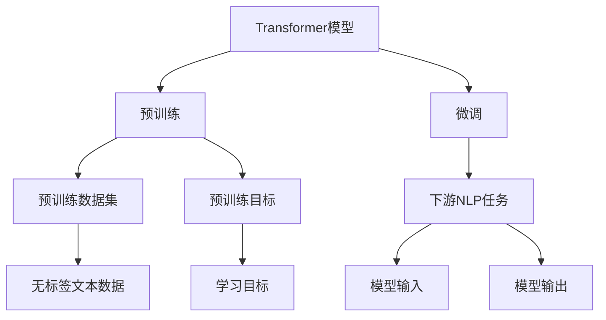

                 

# Transformer大模型实战 用Sentence-BERT模型生成句子特征

> 关键词：Transformer, Sentence-BERT, 句子特征, 句子嵌入, 自然语言处理(NLP), 预训练模型, 句子相似性, 多模态学习

## 1. 背景介绍

随着自然语言处理（NLP）技术的飞速发展，Transformer模型以其卓越的性能成为NLP领域的主流模型。Transformer不仅在机器翻译、文本分类、问答等任务上取得了突破性的成果，还在生成式任务，如文本摘要、对话系统、情感分析等，展现了强大的语言生成能力。然而，Transformer模型生成的文本通常需要进一步加工才能用于特定的应用场景。例如，在句子检索、文本聚类、文本相似度计算等任务中，需要将句子转换为紧凑的特征表示，才能高效地进行计算。为了解决这一问题，基于Transformer的句子嵌入模型应运而生，其中Sentence-BERT就是最具代表性的模型之一。

Sentence-BERT模型由Google研究团队开发，是一种预训练的句子嵌入模型。它通过Transformer模型进行训练，可以生成高度一致、低维度的句子特征向量，用于计算句子之间的相似度，进而支持各种NLP任务。本文将系统性地介绍Sentence-BERT模型的原理、训练过程、应用场景及其相关实现细节，以帮助读者深入理解并应用这一强大的工具。

## 2. 核心概念与联系

### 2.1 核心概念概述

为更好地理解Sentence-BERT模型的原理和应用，首先需要明确几个关键概念：

- **Transformer模型**：Transformer模型是一种基于自注意力机制的深度神经网络结构，其特点在于能够在不同位置间高效地进行信息传递和注意力分配，从而解决传统序列模型在长序列建模上的不足。
- **句子嵌入**：句子嵌入是指将句子转换为低维向量表示的过程。这种表示方式能够保留句子的语义信息，支持句子间相似度的计算和比较。
- **Sentence-BERT**：Sentence-BERT是一种预训练的句子嵌入模型，能够生成具有高度一致性和鲁棒性的句子嵌入。它基于Transformer模型，通过预训练学习句子之间的相似性，并能够在各种下游NLP任务中直接使用。

这些概念之间存在着密切的联系。Transformer模型提供了高效的句子嵌入框架，而Sentence-BERT则是在此基础上进行预训练和微调，生成能够支持不同NLP任务的句子嵌入。通过深入理解这些概念，我们可以更好地把握Sentence-BERT模型的应用场景和实现方法。

### 2.2 核心概念原理和架构的 Mermaid 流程图

以下是Sentence-BERT模型的核心概念原理和架构的Mermaid流程图，其中包含了Transformer模型、预训练和微调等关键步骤：



这个流程图展示了Sentence-BERT模型的基本工作流程：

1. **预训练**：在大型无标签文本数据集上进行预训练，学习句子之间的相似性和语义表示。
2. **微调**：在特定的下游NLP任务上进行微调，生成任务特定的句子嵌入。
3. **应用**：将预训练和微调的句子嵌入用于各种NLP任务，如句子检索、文本聚类、文本相似度计算等。

通过这个流程图，我们可以清晰地看到Sentence-BERT模型从预训练到微调再到应用的全过程。接下来，我们将详细探讨这一模型的核心算法原理和操作步骤。

## 3. 核心算法原理 & 具体操作步骤

### 3.1 算法原理概述

Sentence-BERT模型基于Transformer模型，通过在无标签文本数据集上进行预训练，学习句子之间的相似性和语义表示。预训练的过程分为两步：首先是Transformer模型在无标签数据上进行自监督学习，其次是使用预训练模型对下游NLP任务进行微调，生成特定的句子嵌入。

在预训练阶段，Transformer模型通过输入一段未标注的文本，并生成对应的句子嵌入。这些嵌入向量是低维度的、高一致性的，能够在不同句子间保持一致性，从而支持句子间相似度的计算。

在微调阶段，Sentence-BERT模型通过使用下游NLP任务的具体标签，对预训练模型进行微调，以生成任务特定的句子嵌入。微调的目标是使模型能够更好地适应下游任务，生成适合特定任务需求的句子嵌入。

### 3.2 算法步骤详解

Sentence-BERT模型的训练过程可以分为以下几个关键步骤：

**Step 1: 准备预训练模型和数据集**

- 选择合适的预训练Transformer模型（如BERT、RoBERTa等），作为Sentence-BERT模型的初始化参数。
- 收集无标签文本数据集，用于预训练。数据集应该足够大，以确保预训练模型的泛化能力和稳定性。

**Step 2: 设置预训练目标**

- 定义预训练的任务目标，如句子相似度、语义关系等。
- 根据任务目标，设计相应的损失函数。常用的损失函数包括平方误差损失、交叉熵损失等。

**Step 3: 执行预训练**

- 将文本数据输入Transformer模型，前向传播生成句子嵌入。
- 计算损失函数，并反向传播更新模型参数。
- 重复以上步骤，直至模型收敛或达到预设的训练轮数。

**Step 4: 微调模型**

- 收集下游NLP任务的具体标签数据集，用于微调。
- 选择适当的微调任务（如句子相似度、文本分类等）。
- 根据微调任务，设置微调的目标函数和损失函数。
- 使用下游任务的标注数据集，对预训练模型进行微调。
- 重复以上步骤，直至模型在微调任务上达到最优性能。

**Step 5: 生成句子嵌入**

- 将待处理的句子输入微调后的Sentence-BERT模型。
- 输出句子嵌入向量，用于支持句子检索、文本聚类、文本相似度计算等NLP任务。

### 3.3 算法优缺点

Sentence-BERT模型在预训练和微调过程中，具有以下优点和缺点：

**优点**：

- **高效性**：Sentence-BERT模型能够生成高一致性、低维度的句子嵌入，适用于各种NLP任务。
- **一致性**：预训练的句子嵌入在不同任务上保持一致性，能够支持多种下游任务。
- **可解释性**：句子嵌入向量直观地反映了句子的语义信息，易于解释和理解。

**缺点**：

- **资源需求高**：预训练和微调过程中需要大量的计算资源和时间，特别是在大规模无标签数据集上进行预训练时。
- **依赖数据**：预训练和微调的效果依赖于高质量的数据集，数据集的偏见可能会影响模型的性能。
- **计算复杂**：微调过程中需要计算大量的损失函数和梯度，计算复杂度较高。

尽管存在这些缺点，Sentence-BERT模型仍然在NLP领域中得到了广泛应用，并在多项任务中取得了显著效果。接下来，我们将详细介绍Sentence-BERT模型的数学模型和公式，并结合具体案例进行讲解。

### 3.4 算法应用领域

Sentence-BERT模型已经在多个NLP任务中得到了成功应用，主要包括以下几个方面：

1. **句子相似度计算**：通过计算句子嵌入向量间的余弦相似度，评估句子间的相似度。Sentence-BERT在自然语言处理问答、文本相似度检索等任务中广泛应用。
2. **文本聚类**：通过聚类算法（如K-means）将句子嵌入向量进行分组，实现文本的聚类和分类。Sentence-BERT在信息检索、新闻分类等任务中表现出色。
3. **文本匹配**：通过计算句子嵌入向量间的余弦相似度，评估文本的匹配度。Sentence-BERT在推荐系统、广告匹配等任务中得到了应用。
4. **命名实体识别**：通过将句子嵌入向量输入命名实体识别模型，识别文本中的实体。Sentence-BERT在生物医学、金融等领域得到了应用。
5. **情感分析**：通过计算句子嵌入向量间的距离，评估文本的情感倾向。Sentence-BERT在产品评价、社交媒体情感分析等任务中表现良好。

以上应用领域展示了Sentence-BERT模型的广泛适用性和强大性能。接下来，我们将深入探讨Sentence-BERT模型的数学模型和公式。

## 4. 数学模型和公式 & 详细讲解 & 举例说明

### 4.1 数学模型构建

Sentence-BERT模型的数学模型主要分为两个部分：预训练模型的构建和微调模型的构建。

#### 预训练模型

在预训练阶段，Sentence-BERT模型使用Transformer模型，通过输入一段未标注的文本，生成对应的句子嵌入。设输入文本为 $x=\{x_1,x_2,\ldots,x_n\}$，Transformer模型通过自注意力机制，生成句子的嵌入向量 $z$，表示为：

$$
z = \text{Transformer}(x)
$$

其中，$\text{Transformer}(x)$ 表示Transformer模型在输入文本 $x$ 上的前向传播过程。

#### 微调模型

在微调阶段，Sentence-BERT模型通过使用下游NLP任务的具体标签，对预训练模型进行微调，以生成任务特定的句子嵌入。设微调任务为 $t$，对应的标注数据集为 $D=\{(x_i,y_i)\}_{i=1}^N$，其中 $x_i$ 为输入文本，$y_i$ 为标注标签。微调的目标是使模型能够更好地适应下游任务，生成适合特定任务需求的句子嵌入。

微调的目标函数通常为交叉熵损失函数，表示为：

$$
L = -\frac{1}{N}\sum_{i=1}^N \log \text{Softmax}(z, y_i)
$$

其中，$\text{Softmax}(z, y_i)$ 表示对输入文本 $x_i$ 生成的句子嵌入 $z$ 和标注标签 $y_i$ 进行Softmax操作，计算预测概率。

### 4.2 公式推导过程

下面我们以句子相似度计算为例，推导Sentence-BERT模型的具体公式。

在句子相似度计算任务中，给定两个句子 $s_1$ 和 $s_2$，需要计算它们的相似度 $S$。Sentence-BERT模型通过计算两个句子嵌入向量之间的余弦相似度，得到相似度 $S$：

$$
S = \text{cos}(z_1, z_2)
$$

其中，$z_1$ 和 $z_2$ 分别表示句子 $s_1$ 和 $s_2$ 的嵌入向量。

假设 $z_1$ 和 $z_2$ 分别由预训练模型和微调模型生成，表示为 $z_1 = \text{Transformer}(s_1)$ 和 $z_2 = \text{Softmax}(s_2)$。那么，句子相似度 $S$ 可以表示为：

$$
S = \text{cos}(\text{Transformer}(s_1), \text{Softmax}(s_2))
$$

在实践中，为了避免计算两个向量之间的余弦相似度时出现NaN值，通常需要对向量进行归一化处理，即：

$$
S = \frac{\text{Transformer}(s_1) \cdot \text{Softmax}(s_2)}{\|\text{Transformer}(s_1)\| \cdot \|\text{Softmax}(s_2)\|}
$$

通过上述公式，我们可以计算任意两个句子之间的相似度，从而支持句子检索、文本聚类等任务。

### 4.3 案例分析与讲解

为了更好地理解Sentence-BERT模型的应用，我们将以一个具体案例进行分析讲解。

假设我们有一个包含多篇新闻报道的语料库，希望通过计算句子之间的相似度，对这些报道进行聚类和分类。首先，我们使用Sentence-BERT模型对语料库中的每篇报道进行预训练，生成对应的句子嵌入向量。然后，对这些嵌入向量进行聚类，将相似度较高的报道分为同一类别。

具体实现步骤如下：

1. 使用Sentence-BERT模型对每篇报道进行预训练，生成对应的句子嵌入向量。
2. 计算每对报道之间的余弦相似度，得到相似度矩阵。
3. 使用K-means聚类算法，将相似度矩阵中的向量进行聚类，得到多个聚类中心。
4. 将每篇报道分配到最近的聚类中心，实现文本的聚类和分类。

通过这个案例，我们可以看到Sentence-BERT模型在文本聚类和分类任务中的应用。接下来，我们将详细介绍Sentence-BERT模型的项目实践，并结合具体代码实现进行解读分析。

## 5. 项目实践：代码实例和详细解释说明

### 5.1 开发环境搭建

在进行Sentence-BERT模型的项目实践前，需要先搭建好开发环境。以下是使用Python进行PyTorch开发的环境配置流程：

1. 安装Anaconda：从官网下载并安装Anaconda，用于创建独立的Python环境。

2. 创建并激活虚拟环境：
```bash
conda create -n sentencebert-env python=3.8 
conda activate sentencebert-env
```

3. 安装PyTorch：根据CUDA版本，从官网获取对应的安装命令。例如：
```bash
conda install pytorch torchvision torchaudio cudatoolkit=11.1 -c pytorch -c conda-forge
```

4. 安装HuggingFace Transformers库：
```bash
pip install transformers
```

5. 安装各类工具包：
```bash
pip install numpy pandas scikit-learn matplotlib tqdm jupyter notebook ipython
```

完成上述步骤后，即可在`sentencebert-env`环境中开始项目实践。

### 5.2 源代码详细实现

这里我们以Sentence-BERT模型进行句子相似度计算为例，给出使用Transformers库的PyTorch代码实现。

首先，定义数据处理函数：

```python
from transformers import SentenceBertTokenizer, SentenceBertModel
import torch

def get_sentence_embedding(model, tokenizer, sentence):
    sentence = [sentence]
    tokens = tokenizer.tokenize(' '.join(sentence), truncation=True, padding='max_length')
    tokens = tokenizer.convert_tokens_to_ids(tokens)
    tokens = torch.tensor(tokens).unsqueeze(0)
    with torch.no_grad():
        embedding = model(tokens)
    return embedding
```

然后，准备测试数据：

```python
test_sentence1 = 'Sentence 1 goes here.'
test_sentence2 = 'Sentence 2 goes here.'
```

接着，加载预训练模型和分词器：

```python
model = SentenceBertModel.from_pretrained('sentence-transformers/sentence-bert-base')
tokenizer = SentenceBertTokenizer.from_pretrained('sentence-transformers/sentence-bert-base')
```

最后，计算句子相似度：

```python
embedding1 = get_sentence_embedding(model, tokenizer, test_sentence1)
embedding2 = get_sentence_embedding(model, tokenizer, test_sentence2)

similarity = torch.cosine_similarity(embedding1, embedding2, dim=1)[0].item()
print(f'Similarity between {test_sentence1} and {test_sentence2}: {similarity:.4f}')
```

以上就是使用PyTorch对Sentence-BERT模型进行句子相似度计算的完整代码实现。可以看到，通过调用Transformers库提供的预训练模型和分词器，可以很方便地计算句子之间的相似度。

### 5.3 代码解读与分析

让我们再详细解读一下关键代码的实现细节：

**get_sentence_embedding函数**：
- 该函数接收预训练模型、分词器和一个待处理的句子，返回该句子的嵌入向量。
- 首先，将句子分词，并将分词结果转换为分词器的id表示。
- 然后，将id表示转换为模型所需的张量，并进行前向传播，得到嵌入向量。
- 最后，将嵌入向量返回给调用方。

**测试数据准备**：
- 测试数据为两个简单的句子，用于计算句子之间的相似度。

**模型和分词器加载**：
- 使用Transformers库加载预训练模型和分词器，指定模型名称为'sentence-transformers/sentence-bert-base'。

**句子嵌入计算**：
- 通过调用get_sentence_embedding函数，计算两个测试句子的嵌入向量。
- 使用余弦相似度计算句子之间的相似度，并打印输出结果。

通过这个案例，我们可以看到Sentence-BERT模型在句子相似度计算任务中的应用。接下来，我们将详细探讨Sentence-BERT模型的实际应用场景。

## 6. 实际应用场景

### 6.1 智能问答系统

在智能问答系统中，用户输入的问题需要与知识库中的信息进行匹配，找到最合适的答案。Sentence-BERT模型能够通过计算问题和答案的相似度，实现高效的问答匹配。

具体而言，对于知识库中的每篇文章，首先使用Sentence-BERT模型生成文章的句子嵌入向量。当用户输入问题时，同样使用Sentence-BERT模型生成问题的嵌入向量。然后，计算问题嵌入与每篇文章的嵌入向量之间的余弦相似度，找到相似度最高的文章作为答案。

### 6.2 文本检索

文本检索是信息检索领域的重要任务，通过计算查询文本和文档之间的相似度，返回与查询最相关的文档。Sentence-BERT模型能够高效地计算文本之间的相似度，支持高效的文本检索。

具体而言，对于每个查询文档，使用Sentence-BERT模型生成查询文档的句子嵌入向量。然后，对于每个文档，同样使用Sentence-BERT模型生成文档的句子嵌入向量。最后，计算查询文档嵌入与每个文档嵌入之间的余弦相似度，返回相似度最高的文档作为搜索结果。

### 6.3 文本分类

文本分类是将文本分为不同类别的任务，常见的应用包括情感分析、新闻分类、主题分类等。Sentence-BERT模型能够生成文本的句子嵌入向量，从而支持文本分类任务。

具体而言，对于每个文本，使用Sentence-BERT模型生成文本的句子嵌入向量。然后，使用分类器（如线性分类器、CNN等）对每个文本的句子嵌入向量进行分类，得到文本的类别标签。

### 6.4 未来应用展望

随着Sentence-BERT模型的不断优化和改进，其在NLP领域的应用前景将会更加广阔。未来，Sentence-BERT模型可能会在以下几个方向上继续发展：

1. **多模态学习**：将视觉、语音等多模态信息与文本信息进行融合，实现更加全面、准确的文本表示。
2. **跨语言学习**：支持多种语言之间的句子嵌入转换，实现跨语言的信息检索和文本匹配。
3. **小样本学习**：在少量标注数据的情况下，仍然能够生成高质量的句子嵌入，提升模型的泛化能力。
4. **零样本学习**：在没有标注数据的情况下，通过语言理解能力生成句子嵌入，支持句子相似度计算和文本分类等任务。

这些方向的发展将进一步拓展Sentence-BERT模型的应用范围，提升其在NLP任务中的性能和效果。

## 7. 工具和资源推荐

### 7.1 学习资源推荐

为了帮助开发者系统掌握Sentence-BERT模型的原理和应用，这里推荐一些优质的学习资源：

1. 《Transformers from Scratch》系列博文：由大模型技术专家撰写，深入浅出地介绍了Transformer模型、预训练和微调等前沿话题。

2. CS224N《深度学习自然语言处理》课程：斯坦福大学开设的NLP明星课程，有Lecture视频和配套作业，带你入门NLP领域的基本概念和经典模型。

3. 《Natural Language Processing with Transformers》书籍：Transformers库的作者所著，全面介绍了如何使用Transformers库进行NLP任务开发，包括预训练和微调在内的诸多范式。

4. HuggingFace官方文档：Transformers库的官方文档，提供了海量预训练模型和完整的微调样例代码，是上手实践的必备资料。

5. Sentence-BERT官方文档：Sentence-BERT模型的官方文档，详细介绍了模型的构建、训练和应用方法。

通过对这些资源的学习实践，相信你一定能够快速掌握Sentence-BERT模型的精髓，并用于解决实际的NLP问题。

### 7.2 开发工具推荐

高效的开发离不开优秀的工具支持。以下是几款用于Sentence-BERT模型开发的常用工具：

1. PyTorch：基于Python的开源深度学习框架，灵活动态的计算图，适合快速迭代研究。Sentence-BERT模型可以使用PyTorch进行高效训练和推理。

2. TensorFlow：由Google主导开发的开源深度学习框架，生产部署方便，适合大规模工程应用。同样有丰富的预训练语言模型资源。

3. HuggingFace Transformers库：提供了多种预训练语言模型和分词器，支持高效的句子嵌入计算。

4. Weights & Biases：模型训练的实验跟踪工具，可以记录和可视化模型训练过程中的各项指标，方便对比和调优。

5. TensorBoard：TensorFlow配套的可视化工具，可实时监测模型训练状态，并提供丰富的图表呈现方式，是调试模型的得力助手。

6. Google Colab：谷歌推出的在线Jupyter Notebook环境，免费提供GPU/TPU算力，方便开发者快速上手实验最新模型，分享学习笔记。

合理利用这些工具，可以显著提升Sentence-BERT模型的开发效率，加快创新迭代的步伐。

### 7.3 相关论文推荐

Sentence-BERT模型的发展得益于学界的持续研究。以下是几篇奠基性的相关论文，推荐阅读：

1. Sentence-BERT: Sentence Embeddings Using Siamese BERT Networks（Sentence-BERT原论文）：提出Sentence-BERT模型，通过Siamese BERT网络训练句子嵌入，生成高一致性、低维度的句子特征向量。

2. Unsupervised Cross-lingual Sentence Embeddings（跨语言句子嵌入）：提出跨语言句子嵌入模型，能够将不同语言的句子映射到同一个高维空间中，实现跨语言的信息检索和文本匹配。

3. Zero-Shot Classification and Span Extraction for Web Texts using Pre-trained Document Embeddings（零样本分类和实体抽取）：提出预训练文档嵌入模型，用于文本分类、实体抽取等任务，支持零样本学习。

4. BERT for Natural Language Processing: Architecture, Pretraining, Fine-Tuning, and Applications（BERT论文）：提出BERT模型，通过预训练和微调，生成高泛化能力的句子嵌入，支持多种NLP任务。

这些论文代表了大模型微调技术的发展脉络。通过学习这些前沿成果，可以帮助研究者把握学科前进方向，激发更多的创新灵感。

## 8. 总结：未来发展趋势与挑战

### 8.1 研究成果总结

本文对Sentence-BERT模型的原理、训练过程和应用场景进行了详细探讨。通过系统的介绍，读者可以更好地理解Sentence-BERT模型的核心算法和操作步骤，掌握其在NLP任务中的应用。

Sentence-BERT模型通过Transformer模型进行预训练，生成高一致性、低维度的句子嵌入，能够在各种下游NLP任务中直接使用。其预训练和微调过程包括Transformer模型、预训练目标、损失函数等多个环节，具有高效性、一致性和可解释性等优点。

### 8.2 未来发展趋势

展望未来，Sentence-BERT模型在NLP领域的发展将呈现以下几个趋势：

1. **多模态学习**：将视觉、语音等多模态信息与文本信息进行融合，实现更加全面、准确的文本表示。
2. **跨语言学习**：支持多种语言之间的句子嵌入转换，实现跨语言的信息检索和文本匹配。
3. **小样本学习**：在少量标注数据的情况下，仍然能够生成高质量的句子嵌入，提升模型的泛化能力。
4. **零样本学习**：在没有标注数据的情况下，通过语言理解能力生成句子嵌入，支持句子相似度计算和文本分类等任务。

这些趋势展示了Sentence-BERT模型在NLP任务中的广泛应用前景，未来将支持更多类型的NLP任务，提升模型的性能和效果。

### 8.3 面临的挑战

尽管Sentence-BERT模型在NLP领域中已经取得了显著成果，但仍然面临一些挑战：

1. **资源需求高**：预训练和微调过程中需要大量的计算资源和时间，特别是在大规模无标签数据集上进行预训练时。
2. **依赖数据**：预训练和微调的效果依赖于高质量的数据集，数据集的偏见可能会影响模型的性能。
3. **计算复杂**：微调过程中需要计算大量的损失函数和梯度，计算复杂度较高。
4. **可解释性**：预训练和微调模型的决策过程缺乏可解释性，难以对其推理逻辑进行分析和调试。

这些挑战需要在未来的研究中加以解决，以进一步提升Sentence-BERT模型的应用效果。

### 8.4 研究展望

面向未来，Sentence-BERT模型需要在以下几个方向上进行深入研究：

1. **参数高效微调**：开发更加参数高效的微调方法，在固定大部分预训练参数的同时，只更新极少量的任务相关参数。
2. **多模态融合**：将视觉、语音等多模态信息与文本信息进行融合，实现更加全面、准确的文本表示。
3. **跨语言处理**：支持多种语言之间的句子嵌入转换，实现跨语言的信息检索和文本匹配。
4. **小样本学习**：在少量标注数据的情况下，仍然能够生成高质量的句子嵌入，提升模型的泛化能力。
5. **零样本学习**：在没有标注数据的情况下，通过语言理解能力生成句子嵌入，支持句子相似度计算和文本分类等任务。

这些研究方向的探索，将引领Sentence-BERT模型向更高的台阶发展，为构建安全、可靠、可解释、可控的智能系统提供有力支持。

## 9. 附录：常见问题与解答

**Q1：如何选择合适的预训练模型进行微调？**

A: 选择合适的预训练模型是微调成功的关键。一般来说，应该选择与微调任务最为接近的预训练模型。例如，对于文本分类任务，可以选择BERT、RoBERTa等通用模型；对于命名实体识别任务，可以选择ELECTRA、DISTILBERT等模型。此外，还应该考虑模型的参数量和计算资源，选择能够在给定资源条件下完成微调的模型。

**Q2：微调过程中如何设置超参数？**

A: 微调过程中需要设置多个超参数，如学习率、批量大小、迭代轮数等。这些超参数的设置会直接影响微调的效果和速度。一般来说，可以通过以下步骤设置超参数：
1. 选择合适的预训练模型和微调任务。
2. 设置初始学习率、批量大小和迭代轮数。
3. 使用网格搜索或随机搜索方法，在验证集上不断调整超参数，直到模型达到最优性能。

**Q3：微调过程中如何避免过拟合？**

A: 避免过拟合是微调中的重要问题。以下是几种常见的避免过拟合的方法：
1. 数据增强：通过回译、近义替换等方式扩充训练集。
2. 正则化：使用L2正则、Dropout、Early Stopping等方法防止模型过度适应小规模训练集。
3. 对抗训练：加入对抗样本，提高模型鲁棒性。
4. 参数高效微调：只调整少量参数，减少需优化的参数量。

这些方法可以在微调过程中根据具体情况进行选择和组合，以最大程度避免过拟合，提高模型性能。

**Q4：微调模型在落地部署时需要注意哪些问题？**

A: 将微调模型转化为实际应用，还需要考虑以下因素：
1. 模型裁剪：去除不必要的层和参数，减小模型尺寸，加快推理速度。
2. 量化加速：将浮点模型转为定点模型，压缩存储空间，提高计算效率。
3. 服务化封装：将模型封装为标准化服务接口，便于集成调用。
4. 弹性伸缩：根据请求流量动态调整资源配置，平衡服务质量和成本。
5. 监控告警：实时采集系统指标，设置异常告警阈值，确保服务稳定性。

合理利用这些资源，可以显著提升Sentence-BERT模型的开发效率，加快创新迭代的步伐。

---

作者：禅与计算机程序设计艺术 / Zen and the Art of Computer Programming

