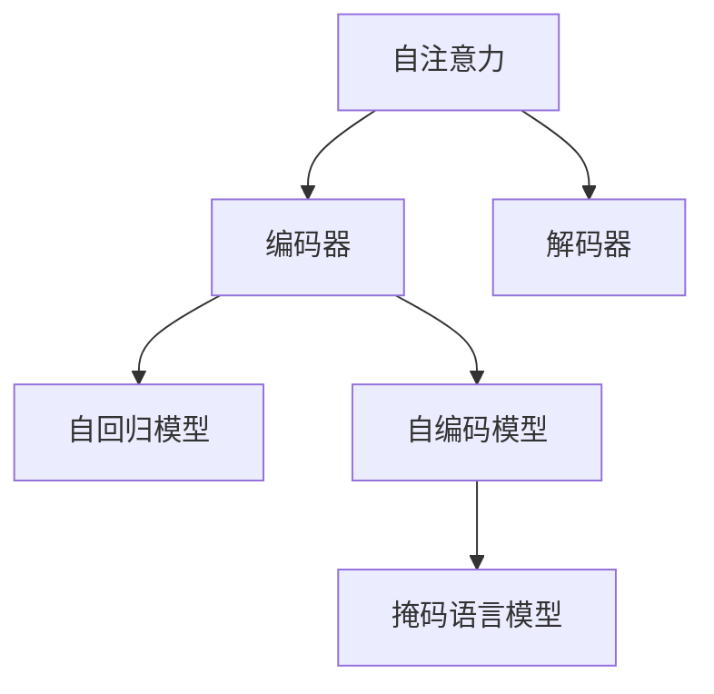

                 

# Transformer大模型实战 训练Transformer

> 关键词：Transformer,自注意力,语言模型,参数高效,微调,解码器,训练,推理

## 1. 背景介绍

### 1.1 问题由来
Transformer模型以其出色的性能和简洁的设计在自然语言处理(Natural Language Processing, NLP)领域引发了革命性的变革。它采用自注意力机制取代传统的循环神经网络(RNN)结构，不仅提升了模型的并行化能力，还取得了显著的语言表示能力。然而，实现Transformer模型的训练和推理，尤其是对于大规模语料（如GPT-3）的训练，对计算资源提出了极高的要求。因此，理解和掌握Transformer模型的训练方法，对于其应用与优化具有重要意义。

### 1.2 问题核心关键点
Transformer模型训练的核心问题包括：
- 自注意力机制的计算复杂度。
- 参数量巨大的编码器和解码器设计。
- 高效的训练和推理算法。
- 大量的正则化策略。

本节将逐一介绍这些关键问题，并提供一些通用的解决方案。

## 2. 核心概念与联系

### 2.1 核心概念概述

为更好地理解Transformer模型的训练，我们首先介绍几个核心概念：

- **自注意力机制**：Transformer模型的核心组件，通过计算每个词与其他词的注意力权重，捕捉句子中词语之间的关系。
- **编码器**：Transformer模型中的输入层，将文本转换为高维向量表示。
- **解码器**：Transformer模型中的输出层，用于生成目标序列，如翻译结果。
- **自回归模型**：基于目标序列预测自身，适用于生成任务。
- **自编码模型**：基于输入序列预测自身，适用于分类和理解任务。
- **掩码语言模型**：在自编码模型的基础上，部分词进行掩码处理，以预训练通用语言模型。

这些概念之间的逻辑关系可以通过以下Mermaid流程图来展示：



这个流程图展示了她其中的核心概念：

1. 自注意力机制是Transformer的核心。
2. 编码器负责输入转换。
3. 解码器负责生成输出。
4. 自回归模型和自编码模型分别对应生成和理解任务。
5. 掩码语言模型用于预训练模型。

## 3. 核心算法原理 & 具体操作步骤
### 3.1 算法原理概述

Transformer模型采用自注意力机制计算输入序列中每个词与其它词的关联关系，最终输出表示序列中的每个词。其训练过程主要分为两个步骤：预训练和微调。

- **预训练**：使用大规模无标注数据，对模型进行自回归或掩码语言模型的预训练，以获得通用语言表示。
- **微调**：基于下游任务的需求，对预训练模型进行微调，优化特定任务的效果。

### 3.2 算法步骤详解

Transformer模型的训练过程可以分为以下几个关键步骤：

**Step 1: 数据准备与预处理**
- 准备数据集：收集预训练和微调所需的数据集。
- 数据预处理：对文本进行分词、编码、padding等处理，以便模型能够接受。
- 数据增强：采用回译、随机插入、随机替换等技术，扩充数据集，增强模型的泛化能力。

**Step 2: 模型初始化**
- 初始化模型：使用随机初始化或预训练模型初始化Transformer模型。
- 定义损失函数：选择适当的损失函数，如交叉熵、均方误差等。
- 设置优化器：选择合适的优化算法，如Adam、SGD等，并设定学习率、批大小等参数。

**Step 3: 训练模型**
- 前向传播：将输入序列输入模型，计算预测输出。
- 计算损失：根据真实标签计算预测输出与真实标签之间的差异，得到损失值。
- 反向传播：使用梯度下降算法，根据损失值更新模型参数。
- 循环迭代：重复上述步骤，直到模型收敛或达到预设的迭代次数。

**Step 4: 微调模型**
- 收集下游任务数据：准备微调所需的数据集。
- 定义任务适配层：根据任务类型，设计合适的输出层和损失函数。
- 设置微调超参数：选择合适的学习率、批大小等。
- 执行微调：在微调数据集上使用模型进行训练。

**Step 5: 评估模型**
- 评估模型：在测试集上评估模型性能，如准确率、召回率、F1值等。
- 优化模型：根据评估结果，对模型进行优化，如调整学习率、超参数等。
- 部署模型：将模型部署到实际应用中，进行推理预测。

### 3.3 算法优缺点

Transformer模型训练的优势在于：
1. 高并行化：自注意力机制和Transformer架构支持高效的并行化计算。
2. 预训练通用：通过在大规模无标注数据上进行预训练，学习通用的语言表示。
3. 参数高效：通过参数高效微调技术，可以只微调小部分模型参数，降低计算成本。

然而，Transformer模型训练也存在一些局限性：
1. 计算资源需求高：编码器和解码器设计庞大，训练和推理耗时长、资源消耗大。
2. 易过拟合：在大规模数据集上训练时，模型容易过拟合。
3. 训练难度大：模型复杂度高，训练过程需精细调参，收敛较慢。
4. 模型泛化能力差：在特定领域应用时，泛化能力可能不如通用预训练模型。

## 4. 数学模型和公式 & 详细讲解  
### 4.1 数学模型构建

Transformer模型的核心是自注意力机制。假设输入序列为 $x = (x_1, x_2, \ldots, x_n)$，输出序列为 $y = (y_1, y_2, \ldots, y_n)$，自注意力机制的公式为：

$$
\text{Attention}(Q, K, V) = \text{Softmax}(\frac{QK^T}{\sqrt{d_k}})V
$$

其中，$Q$ 为查询向量，$K$ 和 $V$ 为键向量和值向量，$d_k$ 为键向量的维度。在模型中，查询向量、键向量和值向量通常为输入序列、位置编码和嵌入向量，即 $Q = XW^Q, K = XW^K, V = XW^V$。

### 4.2 公式推导过程

Transformer模型的编码器由多层编码器组成，每一层包含自注意力子层和前馈神经网络子层。自注意力子层的公式为：

$$
\text{MultiHeadAttention}(Q, K, V) = \text{Concat}(head_1, head_2, \ldots, head_h)W^O
$$

其中，$head_h = \text{Attention}(QW^Q, KW^K, VW^V)$。

Transformer模型的训练过程主要涉及前向传播和反向传播。前向传播的计算流程如下：

1. 计算自注意力子层的输出。
2. 通过前馈神经网络子层计算输出。
3. 计算下一层的输入，叠加前一层的输出。

反向传播的计算流程如下：
1. 计算损失函数。
2. 计算梯度。
3. 更新模型参数。

### 4.3 案例分析与讲解

以机器翻译为例，假设输入序列为 $s = (\text{I}, \text{love}, \text{you})$，输出序列为 $t = (\text{Je}, \text{aime}, \text{tu})$。模型的训练过程如下：

1. 对输入序列 $s$ 进行编码，得到查询向量 $Q$。
2. 对输出序列 $t$ 进行解码，得到预测序列 $\hat{t}$。
3. 计算预测序列 $\hat{t}$ 与真实序列 $t$ 之间的交叉熵损失。
4. 使用梯度下降算法更新模型参数。

## 5. 项目实践：代码实例和详细解释说明
### 5.1 开发环境搭建

在进行Transformer模型训练前，我们需要准备好开发环境。以下是使用Python进行PyTorch开发的环境配置流程：

1. 安装Anaconda：从官网下载并安装Anaconda，用于创建独立的Python环境。

2. 创建并激活虚拟环境：
```bash
conda create -n pytorch-env python=3.8 
conda activate pytorch-env
```

3. 安装PyTorch：根据CUDA版本，从官网获取对应的安装命令。例如：
```bash
conda install pytorch torchvision torchaudio cudatoolkit=11.1 -c pytorch -c conda-forge
```

4. 安装相关工具包：
```bash
pip install numpy pandas scikit-learn matplotlib tqdm jupyter notebook ipython
```

完成上述步骤后，即可在`pytorch-env`环境中开始训练流程。

### 5.2 源代码详细实现

这里我们以机器翻译任务为例，给出使用PyTorch进行Transformer模型训练的代码实现。

首先，定义模型和优化器：

```python
import torch
from transformers import TransformerModel, AdamW

# 定义模型
model = TransformerModel.from_pretrained('bert-base-cased')

# 定义优化器
optimizer = AdamW(model.parameters(), lr=2e-5)
```

然后，定义训练和评估函数：

```python
from transformers import DataCollatorForLanguageModeling
from transformers import Trainer, TrainingArguments

# 数据预处理
tokenizer = AutoTokenizer.from_pretrained('bert-base-cased')
dataset = TokenDataset(...)
collator = DataCollatorForLanguageModeling(tokenizer=tokenizer)

# 定义训练参数
training_args = TrainingArguments(output_dir='./results', logging_dir='./logs', logging_steps=10)
```

接着，定义训练过程：

```python
from transformers import Trainer

# 定义训练器
trainer = Trainer(
    model=model,
    args=training_args,
    train_dataset=train_dataset,
    eval_dataset=eval_dataset,
    data_collator=collator,
    evaluation_strategy='epoch',
    max_steps=-1,
    logging_steps=1000,
)

# 训练模型
trainer.train()
```

最后，在测试集上评估：

```python
# 评估模型
trainer.evaluate(eval_dataset)
```

以上就是使用PyTorch进行Transformer模型训练的完整代码实现。可以看到，得益于HuggingFace的Transformer库，我们可以用相对简洁的代码完成模型的加载和训练。

### 5.3 代码解读与分析

让我们再详细解读一下关键代码的实现细节：

**TransformerModel类**：
- 从预训练模型进行加载，如BERT、GPT等。

**AdamW优化器**：
- 使用AdamW优化器进行参数更新，支持权重衰减和动量。

**DataCollatorForLanguageModeling类**：
- 对数据进行批次化，支持基于Transformer模型的数据处理。

**TrainingArguments类**：
- 定义训练参数，如输出目录、日志目录、日志步长等。

**Trainer类**：
- 定义训练器的配置，包括模型、参数、训练集、评估集等。
- 训练模型的训练器，负责模型的训练和评估。

**train方法**：
- 使用训练器进行模型训练，支持多种训练策略和评估方法。

可以看到，HuggingFace的Transformer库提供了一整套完整的Transformer模型训练流程，使得模型的实现更加便捷和高效。

## 6. 实际应用场景
### 6.1 机器翻译

Transformer模型在机器翻译任务上取得了突破性进展，其自回归机制能够高效地生成翻译结果，且模型的并行化能力使其能够快速处理大量数据。

### 6.2 文本摘要

Transformer模型在文本摘要任务上也取得了良好的表现。其自注意力机制能够捕捉文本中的关键信息，生成简洁的摘要。

### 6.3 命名实体识别

Transformer模型在命名实体识别任务中也能够表现优异。通过在编码器中引入不同的注意力权重，模型能够更加准确地识别出文本中的实体。

### 6.4 未来应用展望

Transformer模型在未来的应用场景中将更加广泛。除了传统的机器翻译和文本生成任务，它还可以应用于文本分类、情感分析、问答系统等任务，甚至在语音识别、图像处理等领域也有望取得突破。

## 7. 工具和资源推荐
### 7.1 学习资源推荐

为了帮助开发者系统掌握Transformer模型的训练理论基础和实践技巧，这里推荐一些优质的学习资源：

1. 《Transformers: State-of-the-Art Natural Language Processing》书籍：该书由大模型技术专家撰写，深入浅出地介绍了Transformer原理、应用和优化技巧。

2. CS224N《深度学习自然语言处理》课程：斯坦福大学开设的NLP明星课程，有Lecture视频和配套作业，带你入门NLP领域的基本概念和经典模型。

3. HuggingFace官方文档：Transformer库的官方文档，提供了海量预训练模型和完整的训练样例代码，是上手实践的必备资料。

4. Natural Language Processing Specialization：Coursera平台上的NLP系列课程，涵盖了机器学习、深度学习等基础知识，适合初学者入门。

5. Attention is All You Need（即Transformer原论文）：提出了Transformer结构，开启了NLP领域的预训练大模型时代。

通过对这些资源的学习实践，相信你一定能够快速掌握Transformer模型的训练精髓，并用于解决实际的NLP问题。

### 7.2 开发工具推荐

高效的开发离不开优秀的工具支持。以下是几款用于Transformer模型训练开发的常用工具：

1. PyTorch：基于Python的开源深度学习框架，灵活动态的计算图，适合快速迭代研究。Transformer模型有PyTorch版本的实现。

2. TensorFlow：由Google主导开发的开源深度学习框架，生产部署方便，适合大规模工程应用。同样有丰富的预训练语言模型资源。

3. HuggingFace Transformers库：集成了众多SOTA语言模型，支持PyTorch和TensorFlow，是进行Transformer模型训练开发的利器。

4. Weights & Biases：模型训练的实验跟踪工具，可以记录和可视化模型训练过程中的各项指标，方便对比和调优。与主流深度学习框架无缝集成。

5. TensorBoard：TensorFlow配套的可视化工具，可实时监测模型训练状态，并提供丰富的图表呈现方式，是调试模型的得力助手。

6. Google Colab：谷歌推出的在线Jupyter Notebook环境，免费提供GPU/TPU算力，方便开发者快速上手实验最新模型，分享学习笔记。

合理利用这些工具，可以显著提升Transformer模型训练任务的开发效率，加快创新迭代的步伐。

### 7.3 相关论文推荐

Transformer模型和其训练方法的发展源于学界的持续研究。以下是几篇奠基性的相关论文，推荐阅读：

1. Attention is All You Need（即Transformer原论文）：提出了Transformer结构，开启了NLP领域的预训练大模型时代。

2. Neural Machine Translation by Jointly Learning to Align and Translate（即Seq2Seq模型）：提出了基于Seq2Seq框架的机器翻译模型，为Transformer模型提供了基础。

3. Transformer-XL: Attentive Language Models Beyond a Fixed-Length Context（即Transformer-XL）：提出了长距离依赖的Transformer模型，解决了常规Transformer模型中的梯度消失问题。

4. BigQuery: Fast Neural Network Dataset Search（即BigQuery）：提出了基于Transformer的快速查询优化算法，提升了数据检索的效率。

5. Google's Neural Machine Translation System: Bridging the Gap Between Human and Machine Translation（即Google的神经机器翻译系统）：展示了Google在大规模机器翻译任务上的成果。

这些论文代表了大模型和Transformer模型训练技术的发展脉络。通过学习这些前沿成果，可以帮助研究者把握学科前进方向，激发更多的创新灵感。

## 8. 总结：未来发展趋势与挑战

### 8.1 总结

本文对Transformer模型的训练方法进行了全面系统的介绍。首先阐述了Transformer模型和微调的核心理论，明确了其在NLP领域的重要作用。其次，从原理到实践，详细讲解了模型的构建和训练过程，给出了微调任务开发的完整代码实例。同时，本文还探讨了Transformer模型在机器翻译、文本摘要、命名实体识别等多个实际应用场景中的表现，展示了其强大的应用前景。

通过本文的系统梳理，可以看到，Transformer模型通过自注意力机制和Transformer架构，展示了其高并行化、高泛化能力，成为NLP领域的新范式。其训练过程包括预训练和微调，在模型设计、数据处理、优化器选择等方面都有其独到之处。未来，随着算力成本的降低和数据规模的扩张，Transformer模型将继续引领NLP技术的发展。

### 8.2 未来发展趋势

展望未来，Transformer模型将呈现以下几个发展趋势：

1. 模型规模持续增大。随着算力成本的下降和数据规模的扩张，预训练语言模型的参数量还将持续增长。超大规模语言模型蕴含的丰富语言知识，有望支撑更加复杂多变的下游任务。

2. 微调方法日趋多样。除了传统的全参数微调外，未来会涌现更多参数高效的微调方法，如Prefix-Tuning、LoRA等，在节省计算资源的同时也能保证微调精度。

3. 持续学习成为常态。随着数据分布的不断变化，微调模型也需要持续学习新知识以保持性能。如何在不遗忘原有知识的同时，高效吸收新样本信息，将成为重要的研究课题。

4. 标注样本需求降低。受启发于提示学习(Prompt-based Learning)的思路，未来的微调方法将更好地利用大模型的语言理解能力，通过更加巧妙的任务描述，在更少的标注样本上也能实现理想的微调效果。

5. 多模态微调崛起。当前的微调主要聚焦于纯文本数据，未来会进一步拓展到图像、视频、语音等多模态数据微调。多模态信息的融合，将显著提升语言模型对现实世界的理解和建模能力。

6. 模型通用性增强。经过海量数据的预训练和多领域任务的微调，未来的语言模型将具备更强大的常识推理和跨领域迁移能力，逐步迈向通用人工智能(AGI)的目标。

以上趋势凸显了大模型训练技术的广阔前景。这些方向的探索发展，必将进一步提升NLP系统的性能和应用范围，为人类认知智能的进化带来深远影响。

### 8.3 面临的挑战

尽管Transformer模型训练技术已经取得了瞩目成就，但在迈向更加智能化、普适化应用的过程中，它仍面临着诸多挑战：

1. 计算资源瓶颈。Transformer模型参数量巨大，对算力、内存、存储都提出了很高的要求。GPU/TPU等高性能设备是必不可少的，但即便如此，超大批次的训练和推理也可能遇到显存不足的问题。如何优化模型结构和训练算法，是重要的优化方向。

2. 模型泛化能力不足。当前Transformer模型面对域外数据时，泛化性能往往大打折扣。对于测试样本的微小扰动，模型预测也容易发生波动。如何提高模型鲁棒性，避免灾难性遗忘，还需要更多理论和实践的积累。

3. 推理效率有待提高。大规模语言模型虽然精度高，但在实际部署时往往面临推理速度慢、内存占用大等效率问题。如何在保证性能的同时，简化模型结构，提升推理速度，优化资源占用，将是重要的优化方向。

4. 可解释性亟需加强。当前Transformer模型更像是"黑盒"系统，难以解释其内部工作机制和决策逻辑。对于医疗、金融等高风险应用，算法的可解释性和可审计性尤为重要。如何赋予模型更强的可解释性，将是亟待攻克的难题。

5. 安全性有待保障。预训练语言模型难免会学习到有偏见、有害的信息，通过微调传递到下游任务，产生误导性、歧视性的输出，给实际应用带来安全隐患。如何从数据和算法层面消除模型偏见，避免恶意用途，确保输出的安全性，也将是重要的研究课题。

6. 知识整合能力不足。现有的Transformer模型往往局限于任务内数据，难以灵活吸收和运用更广泛的先验知识。如何让模型更好地整合知识库、规则库等专家知识，形成更加全面、准确的信息整合能力，还有很大的想象空间。

正视Transformer模型训练面临的这些挑战，积极应对并寻求突破，将是大模型训练技术迈向成熟的必由之路。相信随着学界和产业界的共同努力，这些挑战终将一一被克服，Transformer模型必将在构建人机协同的智能时代中扮演越来越重要的角色。

### 8.4 研究展望

面对Transformer模型训练所面临的种种挑战，未来的研究需要在以下几个方面寻求新的突破：

1. 探索无监督和半监督微调方法。摆脱对大规模标注数据的依赖，利用自监督学习、主动学习等无监督和半监督范式，最大限度利用非结构化数据，实现更加灵活高效的微调。

2. 研究参数高效和计算高效的微调范式。开发更加参数高效的微调方法，在固定大部分预训练参数的同时，只更新极少量的任务相关参数。同时优化微调模型的计算图，减少前向传播和反向传播的资源消耗，实现更加轻量级、实时性的部署。

3. 融合因果和对比学习范式。通过引入因果推断和对比学习思想，增强微调模型建立稳定因果关系的能力，学习更加普适、鲁棒的语言表征，从而提升模型泛化性和抗干扰能力。

4. 引入更多先验知识。将符号化的先验知识，如知识图谱、逻辑规则等，与神经网络模型进行巧妙融合，引导微调过程学习更准确、合理的语言模型。同时加强不同模态数据的整合，实现视觉、语音等多模态信息与文本信息的协同建模。

5. 结合因果分析和博弈论工具。将因果分析方法引入微调模型，识别出模型决策的关键特征，增强输出解释的因果性和逻辑性。借助博弈论工具刻画人机交互过程，主动探索并规避模型的脆弱点，提高系统稳定性。

6. 纳入伦理道德约束。在模型训练目标中引入伦理导向的评估指标，过滤和惩罚有偏见、有害的输出倾向。同时加强人工干预和审核，建立模型行为的监管机制，确保输出符合人类价值观和伦理道德。

这些研究方向的探索，必将引领Transformer模型训练技术迈向更高的台阶，为构建安全、可靠、可解释、可控的智能系统铺平道路。面向未来，Transformer模型训练技术还需要与其他人工智能技术进行更深入的融合，如知识表示、因果推理、强化学习等，多路径协同发力，共同推动自然语言理解和智能交互系统的进步。只有勇于创新、敢于突破，才能不断拓展语言模型的边界，让智能技术更好地造福人类社会。

## 9. 附录：常见问题与解答

**Q1：Transformer模型训练是否适用于所有NLP任务？**

A: Transformer模型训练在大多数NLP任务上都能取得不错的效果，特别是对于数据量较小的任务。但对于一些特定领域的任务，如医学、法律等，仅仅依靠通用语料预训练的模型可能难以很好地适应。此时需要在特定领域语料上进一步预训练，再进行微调，才能获得理想效果。此外，对于一些需要时效性、个性化很强的任务，如对话、推荐等，Transformer模型也需要针对性的改进优化。

**Q2：训练过程中如何选择合适的学习率？**

A: 训练过程中，选择合适的学习率至关重要。一般建议从1e-5开始调参，逐步减小学习率。同时，不同的优化器(如Adam、SGD等)以及不同的学习率调度策略，可能需要设置不同的学习率阈值。例如，AdamW优化器一般推荐使用较小的学习率。

**Q3：如何缓解Transformer模型训练过程中的过拟合问题？**

A: 缓解过拟合问题可以通过以下几种方法：
1. 数据增强：通过回译、随机插入、随机替换等技术，扩充数据集，增强模型的泛化能力。
2. 正则化：使用L2正则、Dropout等技术，防止模型过度适应训练数据。
3. 对抗训练：引入对抗样本，提高模型鲁棒性。
4. 参数高效微调：只调整部分模型参数，减小过拟合风险。

这些策略往往需要根据具体任务和数据特点进行灵活组合。只有在数据、模型、训练、推理等各环节进行全面优化，才能最大限度地发挥Transformer模型的训练威力。

**Q4：Transformer模型在落地部署时需要注意哪些问题？**

A: 将Transformer模型转化为实际应用，还需要考虑以下因素：
1. 模型裁剪：去除不必要的层和参数，减小模型尺寸，加快推理速度。
2. 量化加速：将浮点模型转为定点模型，压缩存储空间，提高计算效率。
3. 服务化封装：将模型封装为标准化服务接口，便于集成调用。
4. 弹性伸缩：根据请求流量动态调整资源配置，平衡服务质量和成本。
5. 监控告警：实时采集系统指标，设置异常告警阈值，确保服务稳定性。
6. 安全防护：采用访问鉴权、数据脱敏等措施，保障数据和模型安全。

合理利用这些工具，可以显著提升Transformer模型训练任务的开发效率，加快创新迭代的步伐。

**Q5：Transformer模型训练中的计算资源瓶颈如何应对？**

A: Transformer模型训练中的计算资源瓶颈可以通过以下方法应对：
1. 模型裁剪：去除不必要的层和参数，减小模型尺寸，加快推理速度。
2. 量化加速：将浮点模型转为定点模型，压缩存储空间，提高计算效率。
3. 混合精度训练：使用混合精度技术，减少内存消耗，提高训练速度。
4. 模型并行：使用模型并行技术，将模型划分为多个部分，分布式训练。
5. 优化器选择：选择合适的优化器，如AdamW、Adafactor等，减少训练时间。

这些方法可以显著缓解计算资源瓶颈，提高训练效率。但需要注意的是，不同的优化方法可能对模型的收敛性能产生影响，需要进行综合评估。

---

作者：禅与计算机程序设计艺术 / Zen and the Art of Computer Programming

