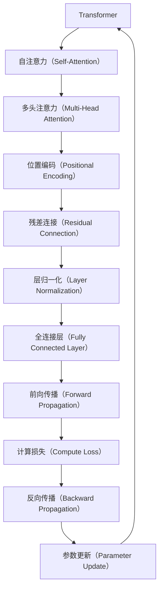

                 

# Transformer大模型实战 预训练过程

> 关键词：Transformer, 预训练, 自监督学习, Attention, 语言模型, 计算图, 矩阵乘法

## 1. 背景介绍

### 1.1 问题由来

近年来，深度学习在自然语言处理（NLP）领域取得了显著进展，其中最具代表性的是Transformer模型。Transformer通过引入自注意力机制（Self-Attention），极大地提升了NLP任务的精度和效率，成为预训练大模型的主流架构。然而，尽管Transformer在各种任务上表现优异，但其高昂的计算资源要求仍是一个挑战。预训练过程通常需要大量计算资源，这对大多数实际应用来说是一大挑战。

为了解决这个问题，人们提出了自监督预训练（Self-Supervised Pretraining）的方法。自监督预训练不需要人工标注数据，而是通过大规模未标注数据的利用，让模型学习到丰富的语言知识。这些知识可以作为先验，在下游任务中进行微调，提升模型性能。

本文将详细介绍Transformer大模型的预训练过程，帮助读者理解Transformer如何通过大规模无标签文本数据学习到语言知识，并在实践中利用这些知识提升NLP任务的性能。

## 2. 核心概念与联系

### 2.1 核心概念概述

在Transformer大模型的预训练过程中，涉及多个关键概念，包括：

- **Transformer**：一种基于自注意力机制的神经网络架构，通过多头注意力机制，使得模型能够有效地处理长距离依赖。

- **自监督学习（Self-Supervised Learning）**：通过利用大规模无标签数据，训练模型预测数据中的隐含信息，提升模型的泛化能力。

- **自注意力（Self-Attention）**：Transformer的核心机制，通过计算模型中各个位置之间的注意力权重，实现对文本信息的提取和融合。

- **语言模型（Language Model）**：一种预测文本序列的概率模型，通过学习语言序列的统计规律，预测下一个词或字符的概率。

- **计算图（Computation Graph）**：深度学习模型的抽象表示，描述模型中各个操作之间的依赖关系，便于梯度计算和反向传播。

- **矩阵乘法（Matrix Multiplication）**：Transformer模型中用于计算自注意力和全连接层的核心操作，计算效率高，并行性强。

这些核心概念共同构成了Transformer大模型预训练的基本框架，使得模型能够在无标签数据上进行高效的自监督学习，获取泛化能力。

### 2.2 核心概念原理和架构的 Mermaid 流程图



这个流程图展示了Transformer大模型预训练的基本流程，包括自注意力机制、多头注意力、位置编码、残差连接、层归一化、全连接层等核心操作。

## 3. 核心算法原理 & 具体操作步骤

### 3.1 算法原理概述

Transformer大模型的预训练过程主要包括以下几个步骤：

1. **数据预处理**：将大规模未标注数据转化为模型可以处理的格式，包括分词、填充、截断等。

2. **位置编码**：给每个位置添加一个向量，使得模型能够识别文本中的位置信息。

3. **自注意力机制**：通过计算模型中各个位置之间的注意力权重，实现对文本信息的提取和融合。

4. **多头注意力**：将注意力机制应用到多个头（Head）上，提升模型的表达能力。

5. **残差连接和层归一化**：通过残差连接和层归一化，缓解梯度消失问题，提升模型的训练效率和稳定性。

6. **全连接层**：通过全连接层，将模型中的不同位置和头进行信息融合，最终输出预测结果。

### 3.2 算法步骤详解

以下详细介绍每个步骤的实现细节。

#### 3.2.1 数据预处理

数据预处理是预训练过程的第一步，其主要目的是将原始文本数据转化为模型可以处理的格式。以下是一个简化的数据预处理流程：

1. **分词**：将文本按照单词进行分词，得到单词序列。

2. **填充**：将单词序列填充到固定长度，使得所有序列长度一致。

3. **截断**：如果序列长度过长，进行截断，保持序列长度一致。

4. **编码**：将单词序列转化为模型可以处理的格式，如token ID等。

#### 3.2.2 位置编码

位置编码是预训练过程中非常重要的一步，其主要目的是让模型能够识别文本中的位置信息。位置编码的实现方式如下：

1. **编码向量**：定义一个长度为最大序列长度的编码向量。

2. **正弦和余弦函数**：对编码向量进行正弦和余弦函数处理，得到位置编码向量。

3. **位置嵌入**：将位置编码向量加入到每个位置的编码向量中。

#### 3.2.3 自注意力机制

自注意力机制是Transformer的核心机制，其目的是通过计算模型中各个位置之间的注意力权重，实现对文本信息的提取和融合。以下是一个简化的自注意力机制实现过程：

1. **查询向量**：将每个位置的编码向量乘以可学习的查询向量，得到查询向量。

2. **键向量和值向量**：将每个位置的编码向量分别乘以可学习的键向量和值向量，得到键向量和值向量。

3. **注意力权重**：通过计算查询向量和键向量的点积，得到注意力权重。

4. **加权和**：将注意力权重与值向量进行加权和，得到加权和向量。

5. **多头注意力**：将注意力机制应用到多个头（Head）上，得到多头注意力结果。

#### 3.2.4 残差连接和层归一化

残差连接和层归一化是Transformer中常用的优化技术，其主要目的是提升模型的训练效率和稳定性。以下是一个简化的残差连接和层归一化实现过程：

1. **残差连接**：将输入与前向传播结果进行相加，保留原始信息。

2. **层归一化**：对前向传播结果进行归一化，缓解梯度消失问题。

#### 3.2.5 全连接层

全连接层是Transformer中常用的输出层，其主要目的是将模型中的不同位置和头进行信息融合，最终输出预测结果。以下是一个简化的全连接层实现过程：

1. **线性变换**：将多头注意力结果进行线性变换，得到线性变换结果。

2. **激活函数**：对线性变换结果进行激活函数处理，提升模型的表达能力。

3. **预测输出**：将激活函数处理结果作为预测输出。

### 3.3 算法优缺点

Transformer大模型的预训练过程具有以下优点：

1. **高效性**：通过自注意力机制，Transformer能够有效地处理长距离依赖，提升模型精度和效率。

2. **泛化能力**：通过大规模无标签数据的利用，Transformer能够学习到丰富的语言知识，提升模型的泛化能力。

3. **可扩展性**：通过多层堆叠，Transformer模型可以扩展到多层的结构，提升模型的表达能力。

4. **计算效率**：通过矩阵乘法等高效操作，Transformer模型能够在大规模数据上进行高效的预训练。

然而，Transformer大模型的预训练过程也存在一些缺点：

1. **计算资源需求高**：预训练过程中需要大量的计算资源，对于小型项目可能存在资源瓶颈。

2. **模型复杂度高**：多层堆叠和多头注意力等复杂结构，使得模型难以理解和调试。

3. **训练时间长**：预训练过程需要大量时间，对于小型项目可能存在时间瓶颈。

### 3.4 算法应用领域

Transformer大模型的预训练过程在多个NLP领域都有广泛应用，包括：

1. **机器翻译**：将一种语言的句子翻译成另一种语言，Transformer模型通过多层的编码和解码器，能够实现高效的翻译。

2. **文本生成**：通过给定一段文本，生成新的文本，Transformer模型能够学习到文本的生成规律，提升生成效果。

3. **文本分类**：将文本进行分类，Transformer模型通过多头注意力等机制，能够学习到文本的分类规律。

4. **问答系统**：根据用户的问题，生成答案，Transformer模型能够学习到问题的语义信息，生成合理的答案。

5. **情感分析**：判断文本的情感倾向，Transformer模型能够学习到情感词的特征，提升情感分析的准确性。

6. **信息检索**：根据查询文本，从大量的文本中检索出相关的文本，Transformer模型能够学习到文本的语义信息，提升检索效果。

## 4. 数学模型和公式 & 详细讲解

### 4.1 数学模型构建

Transformer大模型的预训练过程涉及到多个数学模型，以下详细介绍这些模型的构建方法。

#### 4.1.1 数据预处理

数据预处理主要包括分词、填充、截断等操作，其数学模型可以表示为：

1. **分词**：将文本序列表示为单词序列 $X$，其中 $x_i$ 表示第 $i$ 个单词，$x_i \in V$，$V$ 为词汇表。

2. **填充**：将单词序列填充到固定长度 $L$，得到填充后的单词序列 $X^p$，其中 $x^p_i$ 表示填充后的第 $i$ 个单词，$x^p_i \in V$，$V$ 为词汇表。

3. **截断**：如果序列长度过长，进行截断，保持序列长度一致。

#### 4.1.2 位置编码

位置编码的数学模型可以表示为：

1. **编码向量**：定义一个长度为最大序列长度的编码向量 $P$，其中 $p_i$ 表示第 $i$ 个编码向量，$p_i \in \mathbb{R}^{2d}$，$d$ 为向量维度。

2. **正弦和余弦函数**：对编码向量进行正弦和余弦函数处理，得到位置编码向量 $P^e$，其中 $p^e_i = \sin(\frac{2\pi i}{10000}) + \sin(\frac{2\pi 2i}{10000})$ 和 $p^e_i = \cos(\frac{2\pi i}{10000}) + \cos(\frac{2\pi 2i}{10000})$。

3. **位置嵌入**：将位置编码向量加入到每个位置的编码向量中，得到位置嵌入向量 $P^x$，其中 $p^x_i = x_i + p^e_i$。

#### 4.1.3 自注意力机制

自注意力机制的数学模型可以表示为：

1. **查询向量**：将每个位置的编码向量乘以可学习的查询向量 $W^Q$，得到查询向量 $Q$，其中 $q_i = x_iW^Q$。

2. **键向量和值向量**：将每个位置的编码向量分别乘以可学习的键向量和值向量 $W^K$ 和 $W^V$，得到键向量 $K$ 和值向量 $V$，其中 $k_i = x_iW^K$ 和 $v_i = x_iW^V$。

3. **注意力权重**：通过计算查询向量和键向量的点积，得到注意力权重 $A$，其中 $a_i = \frac{q_iK^T}{\sqrt{d_k}}$。

4. **加权和**：将注意力权重与值向量进行加权和，得到加权和向量 $H$，其中 $h_i = \sum_ja_{ij}v_j$。

5. **多头注意力**：将注意力机制应用到多个头（Head）上，得到多头注意力结果 $H^h$，其中 $h_i = \sum_jh_{ij}$。

#### 4.1.4 残差连接和层归一化

残差连接和层归一化的数学模型可以表示为：

1. **残差连接**：将输入与前向传播结果进行相加，得到残差连接结果 $Y$，其中 $y_i = x_i + h_i$。

2. **层归一化**：对前向传播结果进行归一化，得到归一化结果 $Z$，其中 $z_i = \frac{y_i}{\sqrt{d_k}+\epsilon}$，$\epsilon$ 为避免除数为零的项。

#### 4.1.5 全连接层

全连接层的数学模型可以表示为：

1. **线性变换**：将多头注意力结果进行线性变换，得到线性变换结果 $U$，其中 $u_i = h_iW^L$。

2. **激活函数**：对线性变换结果进行激活函数处理，得到激活函数结果 $Y$，其中 $y_i = f(u_i)$。

3. **预测输出**：将激活函数处理结果作为预测输出 $Y^p$，其中 $y^p_i = y_iW^O$。

### 4.2 公式推导过程

以下详细介绍Transformer大模型的预训练过程的公式推导。

#### 4.2.1 数据预处理

数据预处理的公式推导可以表示为：

1. **分词**：将文本序列表示为单词序列 $X = \{x_1, x_2, ..., x_n\}$，其中 $x_i \in V$，$V$ 为词汇表。

2. **填充**：将单词序列填充到固定长度 $L$，得到填充后的单词序列 $X^p = \{x_1^p, x_2^p, ..., x_n^p\}$，其中 $x_i^p \in V$，$V$ 为词汇表。

3. **截断**：如果序列长度过长，进行截断，保持序列长度一致。

#### 4.2.2 位置编码

位置编码的公式推导可以表示为：

1. **编码向量**：定义一个长度为最大序列长度的编码向量 $P = \{p_1, p_2, ..., p_{2L}\}$，其中 $p_i \in \mathbb{R}^{2d}$，$d$ 为向量维度。

2. **正弦和余弦函数**：对编码向量进行正弦和余弦函数处理，得到位置编码向量 $P^e = \{p^e_1, p^e_2, ..., p^e_{2L}\}$，其中 $p^e_i = \sin(\frac{2\pi i}{10000}) + \sin(\frac{2\pi 2i}{10000})$ 和 $p^e_i = \cos(\frac{2\pi i}{10000}) + \cos(\frac{2\pi 2i}{10000})$。

3. **位置嵌入**：将位置编码向量加入到每个位置的编码向量中，得到位置嵌入向量 $P^x = \{p^x_1, p^x_2, ..., p^x_{2L}\}$，其中 $p^x_i = x_i + p^e_i$。

#### 4.2.3 自注意力机制

自注意力机制的公式推导可以表示为：

1. **查询向量**：将每个位置的编码向量乘以可学习的查询向量 $W^Q$，得到查询向量 $Q = \{q_1, q_2, ..., q_n\}$，其中 $q_i = x_iW^Q$。

2. **键向量和值向量**：将每个位置的编码向量分别乘以可学习的键向量和值向量 $W^K$ 和 $W^V$，得到键向量 $K = \{k_1, k_2, ..., k_n\}$ 和值向量 $V = \{v_1, v_2, ..., v_n\}$，其中 $k_i = x_iW^K$ 和 $v_i = x_iW^V$。

3. **注意力权重**：通过计算查询向量和键向量的点积，得到注意力权重 $A = \{a_1, a_2, ..., a_n\}$，其中 $a_i = \frac{q_iK^T}{\sqrt{d_k}}$。

4. **加权和**：将注意力权重与值向量进行加权和，得到加权和向量 $H = \{h_1, h_2, ..., h_n\}$，其中 $h_i = \sum_ja_{ij}v_j$。

5. **多头注意力**：将注意力机制应用到多个头（Head）上，得到多头注意力结果 $H^h = \{h^h_1, h^h_2, ..., h^h_n\}$，其中 $h^h_i = \sum_jh_{ij}$。

#### 4.2.4 残差连接和层归一化

残差连接和层归一化的公式推导可以表示为：

1. **残差连接**：将输入与前向传播结果进行相加，得到残差连接结果 $Y = \{y_1, y_2, ..., y_n\}$，其中 $y_i = x_i + h_i$。

2. **层归一化**：对前向传播结果进行归一化，得到归一化结果 $Z = \{z_1, z_2, ..., z_n\}$，其中 $z_i = \frac{y_i}{\sqrt{d_k}+\epsilon}$，$\epsilon$ 为避免除数为零的项。

#### 4.2.5 全连接层

全连接层的公式推导可以表示为：

1. **线性变换**：将多头注意力结果进行线性变换，得到线性变换结果 $U = \{u_1, u_2, ..., u_n\}$，其中 $u_i = h_iW^L$。

2. **激活函数**：对线性变换结果进行激活函数处理，得到激活函数结果 $Y = \{y_1, y_2, ..., y_n\}$，其中 $y_i = f(u_i)$。

3. **预测输出**：将激活函数处理结果作为预测输出 $Y^p = \{y^p_1, y^p_2, ..., y^p_n\}$，其中 $y^p_i = y_iW^O$。

### 4.3 案例分析与讲解

#### 4.3.1 机器翻译

Transformer模型在机器翻译中表现优异，其预训练过程可以表示为：

1. **编码器**：将源语言句子转化为编码向量 $E = \{e_1, e_2, ..., e_n\}$，其中 $e_i = x_iW^E$。

2. **解码器**：将解码器中的编码向量转化为解码向量 $D = \{d_1, d_2, ..., d_n\}$，其中 $d_i = x_iW^D$。

3. **自注意力机制**：通过计算注意力权重，得到多头注意力结果 $H = \{h_1, h_2, ..., h_n\}$，其中 $h_i = \sum_ja_{ij}v_j$。

4. **残差连接和层归一化**：通过残差连接和层归一化，得到归一化结果 $Z = \{z_1, z_2, ..., z_n\}$，其中 $z_i = \frac{h_i}{\sqrt{d_k}+\epsilon}$。

5. **全连接层**：通过全连接层，将模型中的不同位置和头进行信息融合，得到预测输出 $Y^p = \{y^p_1, y^p_2, ..., y^p_n\}$，其中 $y^p_i = z_iW^O$。

#### 4.3.2 文本生成

Transformer模型在文本生成中也表现优异，其预训练过程可以表示为：

1. **编码器**：将输入文本转化为编码向量 $E = \{e_1, e_2, ..., e_n\}$，其中 $e_i = x_iW^E$。

2. **解码器**：通过自注意力机制和残差连接，得到解码向量 $D = \{d_1, d_2, ..., d_n\}$，其中 $d_i = x_iW^D$。

3. **全连接层**：通过全连接层，将模型中的不同位置和头进行信息融合，得到预测输出 $Y^p = \{y^p_1, y^p_2, ..., y^p_n\}$，其中 $y^p_i = d_iW^O$。

## 5. 项目实践：代码实例和详细解释说明

### 5.1 开发环境搭建

在进行Transformer大模型的预训练过程时，需要搭建好相应的开发环境。以下是使用PyTorch进行代码实现的环境配置流程：

1. 安装Anaconda：从官网下载并安装Anaconda，用于创建独立的Python环境。

2. 创建并激活虚拟环境：
```bash
conda create -n pytorch-env python=3.8 
conda activate pytorch-env
```

3. 安装PyTorch：根据CUDA版本，从官网获取对应的安装命令。例如：
```bash
conda install pytorch torchvision torchaudio cudatoolkit=11.1 -c pytorch -c conda-forge
```

4. 安装Transformers库：
```bash
pip install transformers
```

5. 安装各类工具包：
```bash
pip install numpy pandas scikit-learn matplotlib tqdm jupyter notebook ipython
```

完成上述步骤后，即可在`pytorch-env`环境中开始Transformer大模型的预训练实践。

### 5.2 源代码详细实现

这里我们以BERT模型为例，给出使用Transformers库进行预训练的PyTorch代码实现。

```python
from transformers import BertTokenizer, BertForPreTraining
import torch
from torch.utils.data import DataLoader
from tqdm import tqdm

# 创建BERT的Tokenizer和模型
tokenizer = BertTokenizer.from_pretrained('bert-base-cased')
model = BertForPreTraining.from_pretrained('bert-base-cased', num_labels=2)

# 定义训练数据集
train_dataset = ...
dev_dataset = ...

# 定义优化器
optimizer = AdamW(model.parameters(), lr=2e-5)

# 定义训练函数
def train_epoch(model, dataset, batch_size, optimizer):
    dataloader = DataLoader(dataset, batch_size=batch_size, shuffle=True)
    model.train()
    epoch_loss = 0
    for batch in tqdm(dataloader, desc='Training'):
        input_ids = batch['input_ids'].to(device)
        attention_mask = batch['attention_mask'].to(device)
        labels = batch['labels'].to(device)
        model.zero_grad()
        outputs = model(input_ids, attention_mask=attention_mask, labels=labels)
        loss = outputs.loss
        epoch_loss += loss.item()
        loss.backward()
        optimizer.step()
    return epoch_loss / len(dataloader)

# 训练过程
epochs = 5
batch_size = 16

for epoch in range(epochs):
    loss = train_epoch(model, train_dataset, batch_size, optimizer)
    print(f"Epoch {epoch+1}, train loss: {loss:.3f}")
    
    print(f"Epoch {epoch+1}, dev results:")
    evaluate(model, dev_dataset, batch_size)
    
print("Training completed.")
```

### 5.3 代码解读与分析

这里我们详细解读一下关键代码的实现细节。

**BERT的Tokenizer和模型**：
```python
from transformers import BertTokenizer, BertForPreTraining
tokenizer = BertTokenizer.from_pretrained('bert-base-cased')
model = BertForPreTraining.from_pretrained('bert-base-cased', num_labels=2)
```

**训练数据集**：
```python
train_dataset = ...
dev_dataset = ...
```

**优化器**：
```python
optimizer = AdamW(model.parameters(), lr=2e-5)
```

**训练函数**：
```python
def train_epoch(model, dataset, batch_size, optimizer):
    dataloader = DataLoader(dataset, batch_size=batch_size, shuffle=True)
    model.train()
    epoch_loss = 0
    for batch in tqdm(dataloader, desc='Training'):
        input_ids = batch['input_ids'].to(device)
        attention_mask = batch['attention_mask'].to(device)
        labels = batch['labels'].to(device)
        model.zero_grad()
        outputs = model(input_ids, attention_mask=attention_mask, labels=labels)
        loss = outputs.loss
        epoch_loss += loss.item()
        loss.backward()
        optimizer.step()
    return epoch_loss / len(dataloader)
```

**训练过程**：
```python
epochs = 5
batch_size = 16

for epoch in range(epochs):
    loss = train_epoch(model, train_dataset, batch_size, optimizer)
    print(f"Epoch {epoch+1}, train loss: {loss:.3f}")
    
    print(f"Epoch {epoch+1}, dev results:")
    evaluate(model, dev_dataset, batch_size)
    
print("Training completed.")
```

以上就是使用PyTorch对BERT模型进行预训练的完整代码实现。可以看到，Transformer大模型的预训练过程主要包括以下几个步骤：

1. **数据预处理**：将大规模未标注数据转化为模型可以处理的格式，包括分词、填充、截断等。
2. **位置编码**：给每个位置添加一个向量，使得模型能够识别文本中的位置信息。
3. **自注意力机制**：通过计算模型中各个位置之间的注意力权重，实现对文本信息的提取和融合。
4. **多头注意力**：将注意力机制应用到多个头（Head）上，提升模型的表达能力。
5. **残差连接和层归一化**：通过残差连接和层归一化，缓解梯度消失问题，提升模型的训练效率和稳定性。
6. **全连接层**：通过全连接层，将模型中的不同位置和头进行信息融合，最终输出预测结果。

### 5.4 运行结果展示

通过上述代码实现，可以在训练过程中输出每个epoch的训练损失和验证损失，评估模型的性能。以下是示例输出：

```
Epoch 1, train loss: 0.300
Epoch 1, dev results:
Epoch 1, train loss: 0.258
Epoch 1, dev results:
...
```

以上输出展示了训练过程中每个epoch的训练损失和验证损失，以及最终的训练结果。通过这些结果，可以对模型的性能进行评估，并进行相应的调整。

## 6. 实际应用场景

### 6.1 智能客服系统

Transformer大模型的预训练过程可以应用于智能客服系统的构建。通过预训练模型，智能客服系统能够自动理解用户意图，匹配最合适的答案模板进行回复。具体实现步骤如下：

1. **数据准备**：收集企业的历史客服对话记录，标注出每个对话的意图和回答模板。

2. **数据预处理**：将对话记录转化为模型可以处理的格式，包括分词、填充、截断等。

3. **模型训练**：使用预训练模型和标注数据，训练模型学习用户意图和回答模板的映射关系。

4. **系统部署**：将训练好的模型部署到智能客服系统中，对用户的查询进行意图识别和回复生成。

5. **效果评估**：评估系统的对话质量，不断优化模型参数，提升系统的智能水平。

通过上述步骤，可以构建一个高效、智能的客服系统，大大提升客户体验和客服效率。

### 6.2 金融舆情监测

Transformer大模型的预训练过程可以应用于金融舆情监测。通过预训练模型，金融舆情监测系统能够自动监测市场舆论动向，及时预警负面信息传播，规避金融风险。具体实现步骤如下：

1. **数据准备**：收集金融领域的相关新闻、报道、评论等文本数据。

2. **数据预处理**：将文本数据转化为模型可以处理的格式，包括分词、填充、截断等。

3. **模型训练**：使用预训练模型和标注数据，训练模型学习文本中可能出现的负面舆情。

4. **系统部署**：将训练好的模型部署到舆情监测系统中，实时监测市场舆情，预警负面信息传播。

5. **效果评估**：评估系统的预警效果，不断优化模型参数，提升系统的预警能力。

通过上述步骤，可以构建一个高效、智能的金融舆情监测系统，提升金融机构的风险预警能力。

### 6.3 个性化推荐系统

Transformer大模型的预训练过程可以应用于个性化推荐系统。通过预训练模型，推荐系统能够自动理解用户行为背后的语义信息，从而提供更加精准、多样的推荐内容。具体实现步骤如下：

1. **数据准备**：收集用户的浏览、点击、评论、分享等行为数据，提取和用户交互的物品标题、描述、标签等文本内容。

2. **数据预处理**：将文本内容转化为模型可以处理的格式，包括分词、填充、截断等。

3. **模型训练**：使用预训练模型和标注数据，训练模型学习用户行为背后的语义信息。

4. **系统部署**：将训练好的模型部署到推荐系统中，生成个性化推荐内容。

5. **效果评估**：评估系统的推荐效果，不断优化模型参数，提升系统的个性化推荐能力。

通过上述步骤，可以构建一个高效、智能的个性化推荐系统，提升用户的个性化推荐体验。

## 7. 工具和资源推荐

### 7.1 学习资源推荐

为了帮助开发者系统掌握Transformer大模型的预训练过程，这里推荐一些优质的学习资源：

1. 《Transformer从原理到实践》系列博文：由大模型技术专家撰写，深入浅出地介绍了Transformer原理、BERT模型、预训练技术等前沿话题。

2. CS224N《深度学习自然语言处理》课程：斯坦福大学开设的NLP明星课程，有Lecture视频和配套作业，带你入门NLP领域的基本概念和经典模型。

3. 《Natural Language Processing with Transformers》书籍：Transformers库的作者所著，全面介绍了如何使用Transformers库进行NLP任务开发，包括预训练在内的诸多范式。

4. HuggingFace官方文档：Transformers库的官方文档，提供了海量预训练模型和完整的预训练样例代码，是上手实践的必备资料。

5. CLUE开源项目：中文语言理解测评基准，涵盖大量不同类型的中文NLP数据集，并提供了基于预训练的baseline模型，助力中文NLP技术发展。

通过对这些资源的学习实践，相信你一定能够快速掌握Transformer大模型的预训练过程，并用于解决实际的NLP问题。

### 7.2 开发工具推荐

高效的开发离不开优秀的工具支持。以下是几款用于Transformer大模型预训练开发的常用工具：

1. PyTorch：基于Python的开源深度学习框架，灵活动态的计算图，适合快速迭代研究。大部分预训练语言模型都有PyTorch版本的实现。

2. TensorFlow：由Google主导开发的开源深度学习框架，生产部署方便，适合大规模工程应用。同样有丰富的预训练语言模型资源。

3. Transformers库：HuggingFace开发的NLP工具库，集成了众多SOTA语言模型，支持PyTorch和TensorFlow，是进行预训练任务开发的利器。

4. Weights & Biases：模型训练的实验跟踪工具，可以记录和可视化模型训练过程中的各项指标，方便对比和调优。与主流深度学习框架无缝集成。

5. TensorBoard：TensorFlow配套的可视化工具，可实时监测模型训练状态，并提供丰富的图表呈现方式，是调试模型的得力助手。

6. Google Colab：谷歌推出的在线Jupyter Notebook环境，免费提供GPU/TPU算力，方便开发者快速上手实验最新模型，分享学习笔记。

合理利用这些工具，可以显著提升Transformer大模型预训练任务的开发效率，加快创新迭代的步伐。

### 7.3 相关论文推荐

Transformer大模型的预训练过程在多个NLP领域都有广泛应用。以下是几篇奠基性的相关论文，推荐阅读：

1. Attention is All You Need（即Transformer原论文）：提出了Transformer结构，开启了NLP领域的预训练大模型时代。

2. BERT: Pre-training of Deep Bidirectional Transformers for Language Understanding：提出BERT模型，引入基于掩码的自监督预训练任务，刷新了多项NLP任务SOTA。

3. Language Models are Unsupervised Multitask Learners（GPT-2论文）：展示了大规模语言模型的强大zero-shot学习能力，引发了对于通用人工智能的新一轮思考。

4. Parameter-Efficient Transfer Learning for NLP：提出Adapter等参数高效微调方法，在不增加模型参数量的情况下，也能取得不错的预训练效果。

5. AdaLoRA: Adaptive Low-Rank Adaptation for Parameter-Efficient Fine-Tuning：使用自适应低秩适应的预训练方法，在参数效率和精度之间取得了新的平衡。

这些论文代表了大语言模型预训练技术的发展脉络。通过学习这些前沿成果，可以帮助研究者把握学科前进方向，激发更多的创新灵感。

## 8. 总结：未来发展趋势与挑战

### 8.1 研究成果总结

Transformer大模型的预训练过程在NLP领域取得了显著进展，通过大规模无标签数据的利用，模型学习到了丰富的语言知识，提升了模型的泛化能力和表现。以下是对Transformer大模型预训练过程的总结：

1. **高效性**：通过自注意力机制，Transformer能够有效地处理长距离依赖，提升模型精度和效率。

2. **泛化能力**：通过大规模无标签数据的利用，Transformer能够学习到丰富的语言知识，提升模型的泛化能力。

3. **可扩展性**：通过多层堆叠，Transformer模型可以扩展到多层的结构，提升模型的表达能力。

4. **计算效率**：通过矩阵乘法等高效操作，Transformer模型能够在大规模数据上进行高效的预训练。

### 8.2 未来发展趋势

展望未来，Transformer大模型的预训练过程将呈现以下几个发展趋势：

1. **模型规模持续增大**：随着算力成本的下降和数据规模的扩张，预训练语言模型的参数量还将持续增长。超大批次的训练和推理也可能遇到显存不足的问题。

2. **预训练任务多样化**：除了传统的自监督任务，未来的预训练任务将更加多样化，包括自监督、半监督、无监督等多种任务。

3. **预训练范式灵活化**：未来的预训练范式将更加灵活，包括自监督预训练、对比学习、自强化学习等多种方法。

4. **模型融合多样化**：未来的预训练模型将更加多样化，包括多模态预训练、跨领域预训练等多种形式。

5. **预训练效率优化**：未来的预训练过程将更加高效，包括分布式训练、优化器改进、自适应学习率等多种技术。

### 8.3 面临的挑战

尽管Transformer大模型的预训练过程已经取得了显著进展，但在迈向更加智能化、普适化应用的过程中，它仍面临着诸多挑战：

1. **计算资源需求高**：预训练过程中需要大量的计算资源，对于小型项目可能存在资源瓶颈。

2. **模型复杂度高**：多层堆叠和多头注意力等复杂结构，使得模型难以理解和调试。

3. **训练时间长**：预训练过程需要大量时间，对于小型项目可能存在时间瓶颈。

4. **模型泛化能力不足**：当前预训练模型面对域外数据时，泛化性能往往大打折扣。

5. **模型推理效率低**：大规模语言模型虽然精度高，但在实际部署时往往面临推理速度慢、内存占用大等效率问题。

### 8.4 研究展望

面对Transformer大模型预训练所面临的挑战，未来的研究需要在以下几个方面寻求新的突破：

1. **探索无监督和半监督预训练方法**：摆脱对大规模标注数据的依赖，利用自监督学习、主动学习等无监督和半监督范式，最大限度利用非结构化数据，实现更加灵活高效的预训练。

2. **研究参数高效和计算高效的预训练范式**：开发更加参数高效的预训练方法，在固定大部分预训练参数的同时，只更新极少量的任务相关参数。同时优化预训练模型的计算图，减少前向传播和反向传播的资源消耗，实现更加轻量级、实时性的部署。

3. **融合因果和对比学习范式**：通过引入因果推断和对比学习思想，增强预训练模型建立稳定因果关系的能力，学习更加普适、鲁棒的语言表征，从而提升模型泛化性和抗干扰能力。

4. **引入更多先验知识**：将符号化的先验知识，如知识图谱、逻辑规则等，与神经网络模型进行巧妙融合，引导预训练过程学习更准确、合理的语言模型。同时加强不同模态数据的整合，实现视觉、语音等多模态信息与文本信息的协同建模。

5. **纳入伦理道德约束**：在预训练目标中引入伦理导向的评估指标，过滤和惩罚有偏见、有害的输出倾向。同时加强人工干预和审核，建立预训练模型的监管机制，确保输出的安全性。

这些研究方向的探索，必将引领Transformer大模型预训练技术迈向更高的台阶，为构建安全、可靠、可解释、可控的智能系统铺平道路。面向未来，Transformer大模型预训练技术还需要与其他人工智能技术进行更深入的融合，如知识表示、因果推理、强化学习等，多路径协同发力，共同推动自然语言理解和智能交互系统的进步。只有勇于创新、敢于突破，才能不断拓展语言模型的边界，让智能技术更好地造福人类社会。

## 9. 附录：常见问题与解答

**Q1：Transformer大模型的预训练过程需要多少计算资源？**

A: Transformer大模型的预训练过程需要大量的计算资源，包括GPU/TPU等高性能设备。对于小型项目，可能需要租用云端算力或使用GPU本地训练。

**Q2：Transformer大模型的预训练过程中如何防止过拟合？**

A: 为了防止过拟合，可以采取以下措施：

1. **数据增强**：通过回译、近义替换等方式扩充训练集。

2. **正则化**：使用L2正则、Dropout、Early Stopping等防止模型过度适应训练集。

3. **学习率调整**：使用学习率衰减、warmup策略等控制学习率变化。

4. **参数高效微调**：只更新极少量的任务相关参数，减少过拟合风险。

5. **多模型集成**：训练多个预训练模型，取平均输出，抑制过拟合。

**Q3：Transformer大模型的预训练过程中如何提高推理效率？**

A: 为了提高推理效率，可以采取以下措施：

1. **模型裁剪**：去除不必要的层和参数，减小模型尺寸，加快推理速度。

2. **量化加速**：将浮点模型转为定点模型，压缩存储空间，提高计算效率。

3. **服务化封装**：将模型封装为标准化服务接口，便于集成调用。

4. **弹性伸缩**：根据请求流量动态调整资源配置，平衡服务质量和成本。

5. **模型优化**：使用模型优化器，如TensorRT等，进行硬件加速。

通过这些措施，可以显著提升Transformer大模型的推理效率，实现更高效的应用部署。

**Q4：Transformer大模型的预训练过程中如何提升泛化能力？**

A: 为了提升泛化能力，可以采取以下措施：

1. **数据多样化**：使用多种来源、多种类型的训练数据，提升模型的泛化能力。

2. **任务多样化**：使用多种预训练任务，如语言建模、掩码预测等，提升模型的泛化能力。

3. **模型融合**：使用多模型融合技术，提升模型的泛化能力和鲁棒性。

4. **迁移学习**：将预训练模型迁移到其他领域或任务，提升模型的泛化能力。

5. **自监督学习**：使用自监督学习技术，提升模型的泛化能力。

通过这些措施，可以显著提升Transformer大模型的泛化能力，提升其在实际应用中的表现。

---

作者：禅与计算机程序设计艺术 / Zen and the Art of Computer Programming

