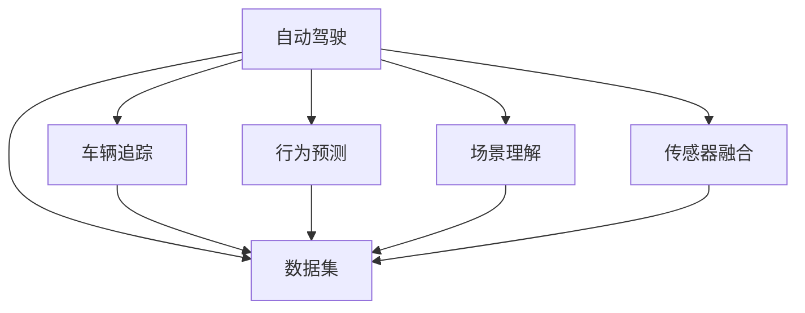

                 

# Waymo自动驾驶数据集的特色、规模与使用价值解读

## 1. 背景介绍

### 1.1 问题由来
随着自动驾驶技术的迅速发展，高质量的数据集成为了各大自动驾驶公司及研究机构至关重要的资源。Waymo，作为自动驾驶领域的领军企业，其数据集因其规模、多样性和实时性而备受业界瞩目。本文将对Waymo自动驾驶数据集的各个方面进行深入解读，包括数据集的构建、特色、规模及实际应用价值。

### 1.2 问题核心关键点
Waymo自动驾驶数据集具有以下特点：
1. 大规模：包含数十万帧高分辨率图像，总里程数超过数十万英里。
2. 实时性：数据集为实时采集，无需对原始数据进行后期处理，确保时间一致性。
3. 多样性：覆盖多种天气、光照和交通条件，涵盖各类场景和行为。
4. 标注精细：包含详细的车辆、行人、交通标志等标注信息。

这些特点使得Waymo自动驾驶数据集在自动驾驶技术研究与落地中具有无可替代的价值。

### 1.3 问题研究意义
深入解读Waymo自动驾驶数据集，对于自动驾驶技术的发展具有重要意义：

1. 为研究机构、企业提供真实场景数据，推动技术进步。
2. 验证和优化深度学习模型，提升自动驾驶系统的可靠性和安全性。
3. 推动数据驱动的自动驾驶系统工程化进程。
4. 增强行业协作，促进自动驾驶技术的产业化应用。

## 2. 核心概念与联系

### 2.1 核心概念概述

为更好地理解Waymo自动驾驶数据集，我们先介绍一些核心概念：

- **自动驾驶**：指通过计算机视觉、传感器融合、控制策略等技术，使汽车在无人类干预的情况下能够自主导航至目的地。
- **数据集**：自动驾驶数据集包含大量现实世界的视频、图像、激光雷达点云等数据，为模型训练和评估提供基础。
- **车辆追踪**：指通过对车辆在时间序列中的轨迹进行跟踪，实现对车辆运动的精确估计。
- **行为预测**：基于历史数据，预测未来车辆、行人的运动轨迹和行为。
- **场景理解**：通过多模态数据融合，理解复杂的交通场景，识别交通标志、道路边界等。
- **传感器融合**：将来自不同传感器（如摄像头、雷达、激光雷达）的数据进行综合分析，提高感知能力。

这些核心概念共同构成了自动驾驶技术的核心。通过深入理解这些概念，我们可以更好地掌握自动驾驶数据集的构建与使用。

### 2.2 核心概念原理和架构的 Mermaid 流程图



这个流程图展示了自动驾驶系统的核心组件及其与数据集的关系。

## 3. 核心算法原理 & 具体操作步骤
### 3.1 算法原理概述

Waymo自动驾驶数据集使用深度学习模型进行多任务学习，涵盖车辆追踪、行为预测、场景理解等多个方面。数据集的构建涉及传感器数据采集、数据预处理、标注、存储和分发等环节。

### 3.2 算法步骤详解

Waymo自动驾驶数据集的构建流程如下：

1. **传感器数据采集**：使用高分辨率摄像头、激光雷达和毫米波雷达采集实车行驶数据。
2. **数据预处理**：包括数据清洗、噪声滤波、坐标系转换等。
3. **标注与验证**：由人工进行标注，包括车辆位置、速度、姿态、类型等，通过多标注员交叉验证确保准确性。
4. **数据存储**：使用高效的存储格式，如TFRecords，进行存储和管理。
5. **数据分发**：通过安全的网络协议进行分发，确保数据的安全性和隐私保护。

### 3.3 算法优缺点

Waymo自动驾驶数据集的优点：
1. **数据量庞大**：包含数十万帧高分辨率图像，覆盖各种驾驶场景。
2. **实时采集**：数据采集时间与车辆行驶时间一致，避免时间偏移。
3. **标注精细**：详尽的标注信息便于模型训练和验证。
4. **多样性**：覆盖多种天气、光照和交通条件，提高模型的泛化能力。

缺点：
1. **成本高**：高分辨率传感器和人工标注的成本较高。
2. **数据量大**：存储和处理大容量数据需要高性能计算资源。
3. **隐私保护**：大量车辆位置数据可能涉及隐私问题。

### 3.4 算法应用领域

Waymo自动驾驶数据集在自动驾驶技术研究与落地中有广泛应用：

1. **模型训练**：用于训练深度学习模型，如目标检测、行为预测、场景理解等。
2. **性能评估**：用于验证和评估自动驾驶系统的各项性能指标，如准确率、召回率、鲁棒性等。
3. **跨公司研究合作**：数据集的共享和开放促进了自动驾驶行业的协同创新。
4. **教育和培训**：为学生、研究人员提供高质量的训练数据，推动学术研究与行业应用相结合。

## 4. 数学模型和公式 & 详细讲解 & 举例说明

### 4.1 数学模型构建

Waymo自动驾驶数据集涉及的数学模型包括：
- 车辆追踪模型：如卡尔曼滤波、粒子滤波等，用于预测车辆位置和速度。
- 行为预测模型：基于历史数据，使用LSTM、RNN等模型预测车辆、行人的运动轨迹。
- 场景理解模型：如卷积神经网络(CNN)、循环神经网络(RNN)、Transformer等，用于理解复杂的交通场景。

### 4.2 公式推导过程

以车辆追踪为例，卡尔曼滤波的公式如下：

$$
\mathbf{x}_{k|k} = \mathbf{x}_{k|k-1} + \mathbf{K}_k(\mathbf{z}_k - \mathbf{H}\mathbf{x}_{k|k-1})
$$

$$
\mathbf{P}_{k|k} = (\mathbf{I} - \mathbf{K}_k\mathbf{H})\mathbf{P}_{k|k-1}
$$

其中，$\mathbf{x}_{k|k}$ 为状态预测值，$\mathbf{z}_k$ 为测量值，$\mathbf{H}$ 为测量矩阵，$\mathbf{K}_k$ 为卡尔曼增益，$\mathbf{P}_{k|k}$ 为预测误差协方差矩阵。

### 4.3 案例分析与讲解

以Waymo自动驾驶数据集中的行人行为预测为例，使用LSTM模型进行预测。数据集包含行人位置、速度、行为等，LSTM模型通过对历史数据的训练，能够预测行人未来的位置和行为。

## 5. 项目实践：代码实例和详细解释说明

### 5.1 开发环境搭建

为了使用Waymo自动驾驶数据集进行项目开发，需要安装以下工具和环境：

1. **Python**：确保Python 3.6或以上版本。
2. **TensorFlow**：下载并安装TensorFlow 2.0或以上版本。
3. **PyTorch**：下载并安装PyTorch 1.0或以上版本。
4. **OpenCV**：用于图像处理和实时显示。
5. **Waymo dataset**：从Waymo官网下载和解压数据集。

### 5.2 源代码详细实现

以下是一个使用TensorFlow进行行人行为预测的代码示例：

```python
import tensorflow as tf
import numpy as np
import cv2

# 读取数据集
data_path = "path/to/waymo_dataset/"
train_data = tf.data.TFRecordDataset(data_path + "train.record")
test_data = tf.data.TFRecordDataset(data_path + "test.record")

# 定义模型
model = tf.keras.models.Sequential([
    tf.keras.layers.Conv2D(32, (3,3), activation='relu', input_shape=(64,64,3)),
    tf.keras.layers.MaxPooling2D((2,2)),
    tf.keras.layers.Conv2D(64, (3,3), activation='relu'),
    tf.keras.layers.MaxPooling2D((2,2)),
    tf.keras.layers.Flatten(),
    tf.keras.layers.Dense(128, activation='relu'),
    tf.keras.layers.Dense(6, activation='softmax')
])

# 编译模型
model.compile(optimizer='adam', loss='categorical_crossentropy', metrics=['accuracy'])

# 训练模型
model.fit(train_data, epochs=10, validation_data=test_data)

# 预测数据
test_images = []
test_labels = []
for img_path in test_data_paths:
    img = cv2.imread(img_path)
    test_images.append(img)
    label = get_label(img_path)
    test_labels.append(label)

test_images = np.array(test_images)
test_labels = np.array(test_labels)
predictions = model.predict(test_images)
```

### 5.3 代码解读与分析

代码中使用了TensorFlow进行模型的定义、编译和训练。首先通过`tf.data.TFRecordDataset`读取Waymo数据集的TFRecord文件，并加载模型结构。然后定义了多层卷积神经网络，并使用`model.compile`方法进行编译，设置优化器、损失函数和评估指标。最后通过`model.fit`方法进行训练，并使用`model.predict`方法进行预测。

## 6. 实际应用场景

### 6.1 智能交通管理

Waymo自动驾驶数据集可以用于智能交通管理系统的开发。通过分析大量实时交通数据，系统能够准确预测车辆和行人的行为，优化交通信号灯的分配，减少交通拥堵，提升交通效率。

### 6.2 自动驾驶测试

Waymo自动驾驶数据集可用于自动驾驶车辆的测试和优化。通过模拟复杂交通场景，测试模型的反应速度和决策能力，发现模型的不足并进行改进。

### 6.3 无人驾驶出租车

Waymo自动驾驶数据集可用于无人驾驶出租车的开发和测试。通过在实际道路上进行测试，优化车辆的行驶策略和行为预测模型，提升无人驾驶出租车的安全性和舒适度。

### 6.4 未来应用展望

未来，Waymo自动驾驶数据集将进一步拓展其应用领域，包括但不限于：
1. 自动驾驶汽车的量产和应用推广。
2. 智能交通基础设施的建设与优化。
3. 无人驾驶物流与配送。
4. 智能城市和智慧城市的发展。

## 7. 工具和资源推荐

### 7.1 学习资源推荐

1. **《自动驾驶技术》**：一本系统介绍自动驾驶技术的书籍，包括数据集构建、模型训练与优化等内容。
2. **《Waymo自动驾驶技术》**：Waymo官方技术博客，提供最新的技术动态和应用案例。
3. **Udacity自动驾驶课程**：提供关于自动驾驶数据集和算法的系统学习。
4. **ArXiv论文**：Waymo发表的多篇论文，涵盖数据集构建和自动驾驶技术。

### 7.2 开发工具推荐

1. **TensorFlow**：深度学习框架，支持自动驾驶数据集的构建和模型训练。
2. **PyTorch**：深度学习框架，适合自动驾驶数据集的构建和模型训练。
3. **OpenCV**：计算机视觉库，支持图像处理和实时显示。
4. **GitHub**：代码托管平台，提供数据集和代码的共享与协作。

### 7.3 相关论文推荐

1. **《Waymo自动驾驶数据集》**：Waymo官方发布的论文，详细介绍了数据集的构建方法和应用。
2. **《自动驾驶数据集在交通场景理解中的应用》**：介绍自动驾驶数据集在交通场景理解中的作用。
3. **《基于深度学习的自动驾驶行为预测》**：探讨深度学习在自动驾驶行为预测中的应用。

## 8. 总结：未来发展趋势与挑战

### 8.1 研究成果总结

Waymo自动驾驶数据集在自动驾驶技术研究与落地中发挥了重要作用，推动了深度学习模型在自动驾驶中的应用。未来，Waymo自动驾驶数据集将继续扩展其应用领域，推动自动驾驶技术的快速发展。

### 8.2 未来发展趋势

Waymo自动驾驶数据集的未来发展趋势包括：
1. **数据规模**：随着数据采集技术的进步，数据集规模将进一步扩大。
2. **多模态融合**：引入摄像头、雷达、激光雷达等多模态数据，提升感知能力。
3. **实时性提升**：通过优化数据采集和处理流程，提高数据集的实时性。
4. **数据标注**：使用半监督学习和迁移学习等技术，减少人工标注的复杂度。

### 8.3 面临的挑战

Waymo自动驾驶数据集在应用过程中仍面临以下挑战：
1. **数据隐私**：大量车辆位置数据可能涉及隐私问题，需要采取措施保护。
2. **数据更新**：数据集的持续更新和维护需要大量人力和资源。
3. **模型泛化**：在复杂交通场景下，模型的泛化能力有待提升。

### 8.4 研究展望

未来，Waymo自动驾驶数据集的研究方向包括：
1. **多模态融合**：结合摄像头、雷达、激光雷达等多模态数据，提升感知能力。
2. **实时性提升**：优化数据采集和处理流程，提高数据集的实时性。
3. **模型优化**：使用更先进的深度学习模型和算法，提升模型的准确性和鲁棒性。
4. **隐私保护**：采用数据脱敏和匿名化等技术，保护数据隐私。

## 9. 附录：常见问题与解答

**Q1: 如何使用Waymo自动驾驶数据集进行模型训练？**

A: 首先需要将数据集下载到本地，并解压TFRecord文件。然后，使用TensorFlow或PyTorch等深度学习框架，定义模型结构，编译模型，并通过`model.fit`方法进行训练。

**Q2: Waymo自动驾驶数据集是否包含天气变化情况？**

A: Waymo自动驾驶数据集覆盖了多种天气条件，包括晴天、阴天、雨雪等，有助于训练鲁棒性强的模型。

**Q3: Waymo自动驾驶数据集的存储格式是什么？**

A: Waymo自动驾驶数据集使用TFRecord格式进行存储，通过`tf.data.TFRecordDataset`可以直接读取。

**Q4: Waymo自动驾驶数据集的来源是什么？**

A: Waymo自动驾驶数据集是由Waymo公司收集和制作的，主要用于自动驾驶技术的研究和开发。

**Q5: Waymo自动驾驶数据集是否支持跨平台使用？**

A: Waymo自动驾驶数据集是支持跨平台使用的，开发者可以使用Python、TensorFlow、PyTorch等平台进行开发和测试。

作者：禅与计算机程序设计艺术 / Zen and the Art of Computer Programming

