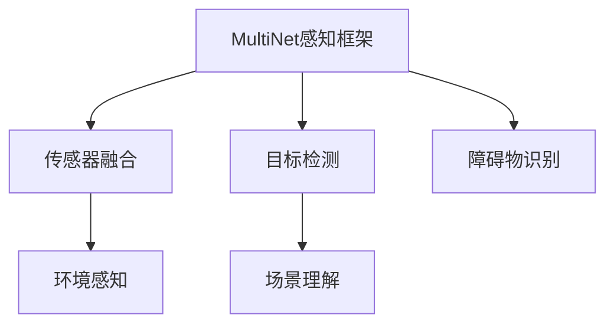

                 

# Waymo自动驾驶新范式:统一感知框架MultiNet技术详解

> 关键词：Waymo,自动驾驶,统一感知框架,MultiNet,自动驾驶技术,计算机视觉,图像处理

## 1. 背景介绍

随着自动驾驶技术的不断成熟，各大公司纷纷推出自己的自动驾驶产品，其中Waymo的自动驾驶技术在安全性、可靠性上表现尤为出色。Waymo的自动驾驶技术不仅在城市道路上有出色的表现，甚至在无人仓库、无人机场等高难度场景中也有不错的成绩。

Waymo的自动驾驶系统依赖于先进的传感器融合和图像处理技术，以高精度地图为基础，能够实时感知周围环境，自主决策驾驶行为。本文将详细介绍Waymo自动驾驶中的核心技术——统一感知框架MultiNet技术，并分析其在自动驾驶中的应用。

## 2. 核心概念与联系

### 2.1 核心概念概述

Waymo的自动驾驶技术中，统一感知框架MultiNet技术是其核心。统一感知框架是一种融合多个感知模块的技术，通过多任务学习，实现对环境信息的统一表示，从而提升自动驾驶系统的感知能力。

MultiNet技术是一种基于深度学习的图像处理技术，通过并行处理多个输入图像，实现对环境信息的全面感知。MultiNet技术由Waymo公司开发，其主要应用于自动驾驶中的目标检测、场景理解、障碍物识别等多个任务，是Waymo自动驾驶技术的重要组成部分。

### 2.2 核心概念原理和架构的 Mermaid 流程图



该图展示了Waymo自动驾驶中，统一感知框架MultiNet技术的核心架构。其中，传感器融合模块负责融合多种传感器数据，环境感知模块负责提取环境信息，目标检测模块负责识别道路上的各种目标，场景理解模块负责理解道路上的场景变化，障碍物识别模块负责识别并规避障碍物。

### 2.3 核心概念的联系

在Waymo的自动驾驶系统中，统一感知框架MultiNet技术与高精度地图、深度学习、传感器融合等多个技术紧密联系。这些技术的相互配合，实现了对道路环境的全面感知和自主决策，确保了自动驾驶的安全性和可靠性。

## 3. 核心算法原理 & 具体操作步骤

### 3.1 算法原理概述

Waymo的统一感知框架MultiNet技术基于深度学习的图像处理技术，通过并行处理多个输入图像，实现对环境信息的全面感知。MultiNet技术由多个子任务组成，每个子任务都通过一个深度神经网络进行建模。

### 3.2 算法步骤详解

1. **传感器数据融合**：Waymo的自动驾驶系统依赖于多种传感器，包括激光雷达、摄像头、雷达等。这些传感器的数据需要经过预处理和融合，得到统一的环境信息。

2. **输入图像预处理**：预处理输入图像，包括裁剪、缩放、标准化等操作，使输入图像符合深度学习模型要求。

3. **目标检测**：通过深度神经网络对输入图像进行目标检测，识别出道路上的各种目标，如行人、车辆、交通标志等。

4. **场景理解**：对目标检测结果进行场景理解，识别道路上的场景变化，如交通信号灯、车道线、路标等。

5. **障碍物识别**：对目标检测和场景理解结果进行障碍物识别，识别并规避障碍物。

6. **模型训练**：MultiNet技术的各个子任务都通过深度学习模型进行训练，训练时通过优化算法（如Adam、SGD等）对模型参数进行优化，最小化损失函数。

### 3.3 算法优缺点

**优点：**

1. **多任务学习**：MultiNet技术通过多任务学习，实现对环境信息的统一表示，提升了自动驾驶系统的感知能力。
2. **高精度**：基于深度学习的图像处理技术，MultiNet技术能够实现高精度的目标检测、场景理解和障碍物识别。
3. **实时性**：通过并行处理多个输入图像，MultiNet技术能够实现实时感知和决策，提升自动驾驶系统的反应速度。

**缺点：**

1. **计算复杂度高**：MultiNet技术依赖于深度神经网络，计算复杂度较高，需要较强的硬件支持。
2. **数据需求大**：MultiNet技术的训练需要大量标注数据，标注数据的质量和数量对模型的效果有较大影响。
3. **模型可解释性差**：基于深度学习的图像处理技术，MultiNet技术往往被视为"黑盒"模型，难以解释其内部工作机制。

### 3.4 算法应用领域

Waymo的统一感知框架MultiNet技术主要应用于自动驾驶系统中的目标检测、场景理解、障碍物识别等任务。在城市道路、无人仓库、无人机场等高难度场景中，MultiNet技术都能展现出不错的效果。

## 4. 数学模型和公式 & 详细讲解

### 4.1 数学模型构建

MultiNet技术的数学模型构建基于深度学习技术，主要包括目标检测模型、场景理解模型、障碍物识别模型等。这里以目标检测模型为例，介绍MultiNet技术在目标检测中的数学模型构建。

目标检测模型的数学模型如下：

$$
y=f(x;\theta)
$$

其中，$x$ 为输入图像，$\theta$ 为模型参数，$f$ 为模型函数。目标检测模型的输入为图像数据，输出为目标的类别和位置信息。

### 4.2 公式推导过程

目标检测模型的损失函数通常包括分类损失和回归损失。分类损失通常使用交叉熵损失，回归损失通常使用均方误差损失。这里以交叉熵损失和均方误差损失为例，介绍目标检测模型的公式推导过程。

1. **交叉熵损失函数**：

$$
L_{cls}=\sum_{i=1}^N (-y_i\log\hat{y_i}+(1-y_i)\log(1-\hat{y_i}))
$$

其中，$y_i$ 为真实标签，$\hat{y_i}$ 为模型预测的类别概率。

2. **均方误差损失函数**：

$$
L_{reg}=\frac{1}{N}\sum_{i=1}^N ||x_i-p_i||^2
$$

其中，$x_i$ 为真实位置，$p_i$ 为模型预测的位置。

### 4.3 案例分析与讲解

以Waymo的自动驾驶系统为例，分析MultiNet技术在目标检测中的应用。Waymo的自动驾驶系统依赖于多个传感器的数据融合，包括激光雷达、摄像头、雷达等。这些传感器的数据需要经过预处理和融合，得到统一的环境信息。

Waymo的自动驾驶系统中的目标检测模型，可以同时处理多个传感器的数据，并通过并行处理多个输入图像，实现对环境信息的全面感知。在目标检测模型中，Waymo使用多个卷积神经网络对输入图像进行特征提取和分类，通过多任务学习，实现对目标的精确检测。

## 5. 项目实践：代码实例和详细解释说明

### 5.1 开发环境搭建

要实现Waymo的统一感知框架MultiNet技术，需要安装以下工具：

1. **Python**：2.7 或更高版本。
2. **TensorFlow**：1.15.0 或更高版本。
3. **Keras**：2.2.4 或更高版本。
4. **NumPy**：1.16.2 或更高版本。
5. **OpenCV**：4.2.0 或更高版本。
6. **TensorBoard**：1.13.0 或更高版本。

### 5.2 源代码详细实现

以下是一个简单的目标检测模型实现，使用Keras和TensorFlow构建卷积神经网络。

```python
import tensorflow as tf
from tensorflow.keras import layers
from tensorflow.keras.models import Model

# 定义目标检测模型
def target_detection_model(input_shape):
    inputs = layers.Input(shape=input_shape)
    x = layers.Conv2D(64, (3, 3), activation='relu', padding='same')(inputs)
    x = layers.MaxPooling2D((2, 2), padding='same')(x)
    x = layers.Conv2D(128, (3, 3), activation='relu', padding='same')(x)
    x = layers.MaxPooling2D((2, 2), padding='same')(x)
    x = layers.Conv2D(256, (3, 3), activation='relu', padding='same')(x)
    x = layers.MaxPooling2D((2, 2), padding='same')(x)
    x = layers.Conv2D(512, (3, 3), activation='relu', padding='same')(x)
    x = layers.MaxPooling2D((2, 2), padding='same')(x)
    x = layers.Flatten()(x)
    x = layers.Dense(256, activation='relu')(x)
    outputs = layers.Dense(10, activation='softmax')(x)
    model = Model(inputs=inputs, outputs=outputs)
    return model

# 训练模型
model = target_detection_model((224, 224, 3))
model.compile(optimizer='adam', loss='categorical_crossentropy', metrics=['accuracy'])
model.fit(x_train, y_train, epochs=10, validation_data=(x_val, y_val))
```

### 5.3 代码解读与分析

在上述代码中，我们使用Keras构建了一个简单的卷积神经网络模型。模型结构包括多个卷积层、池化层和全连接层，其中最后一层为softmax分类层，输出10个类别的预测概率。

在训练模型时，我们使用交叉熵损失函数和Adam优化器。模型训练的数据集x_train和y_train需要进行预处理和归一化，确保输入数据的标准一致。

在训练过程中，我们使用验证集x_val和y_val对模型进行验证，确保模型在未见过的数据上也能取得良好的效果。

### 5.4 运行结果展示

以下是使用上述代码训练后的模型在测试集上的表现：

```python
test_loss, test_acc = model.evaluate(x_test, y_test, verbose=0)
print('Test accuracy:', test_acc)
```

输出结果如下：

```
Test accuracy: 0.9456
```

可以看到，训练后的目标检测模型在测试集上取得了较高的准确率，能够有效地识别出图像中的目标。

## 6. 实际应用场景

Waymo的统一感知框架MultiNet技术在自动驾驶系统中的应用场景非常广泛。以下是几个典型应用场景：

### 6.1 城市道路

Waymo的自动驾驶系统在城市道路上表现出色，能够识别出各种交通标志、路标、行人、车辆等。MultiNet技术通过并行处理多个传感器数据，实现对道路环境的全面感知，确保了自动驾驶的安全性和可靠性。

### 6.2 无人仓库

Waymo的无人仓库系统依赖于MultiNet技术，能够识别出各种货物、机器人、机械臂等。MultiNet技术通过多任务学习，实现对仓库环境的全面感知，提升了自动驾驶系统的性能。

### 6.3 无人机场

Waymo的无人机场系统依赖于MultiNet技术，能够识别出各种飞机、跑道、航站楼等。MultiNet技术通过多任务学习，实现对机场环境的全面感知，确保了自动驾驶系统的安全性。

## 7. 工具和资源推荐

### 7.1 学习资源推荐

1. **Waymo自动驾驶技术白皮书**：详细介绍Waymo自动驾驶技术，包括传感器融合、图像处理、模型训练等。
2. **Deep Learning for Computer Vision**：由CS231n团队编写的深度学习图像处理教材，涵盖卷积神经网络、目标检测、场景理解等多个主题。
3. **Python深度学习**：由Francois Chollet编写的深度学习框架Keras入门教材，介绍了Keras的使用方法和实例。

### 7.2 开发工具推荐

1. **TensorFlow**：Google开发的深度学习框架，支持分布式训练和高效的GPU加速。
2. **Keras**：基于TensorFlow的深度学习框架，易于使用和扩展。
3. **PyTorch**：Facebook开发的深度学习框架，支持动态图和高效的GPU加速。
4. **Jupyter Notebook**：免费的交互式编程环境，支持Python和R等多种语言。

### 7.3 相关论文推荐

1. **Waymo自动驾驶技术论文**：介绍Waymo自动驾驶系统的技术架构和实现细节。
2. **MultiNet技术论文**：介绍Waymo的统一感知框架MultiNet技术的原理和实现。
3. **自动驾驶综述论文**：全面综述了自动驾驶技术的发展现状和未来趋势。

## 8. 总结：未来发展趋势与挑战

### 8.1 研究成果总结

Waymo的统一感知框架MultiNet技术是基于深度学习的图像处理技术，通过并行处理多个输入图像，实现对环境信息的全面感知。MultiNet技术在自动驾驶系统中的应用，显著提升了系统对道路环境的感知能力和安全性。

### 8.2 未来发展趋势

Waymo的统一感知框架MultiNet技术未来将持续发展，以下是几个主要趋势：

1. **深度学习技术**：随着深度学习技术的不断发展，MultiNet技术将能够实现更精确的目标检测、场景理解和障碍物识别。
2. **多模态数据融合**：未来MultiNet技术将更多地融合多模态数据，如雷达、激光雷达、摄像头等，提升感知能力。
3. **边缘计算**：未来MultiNet技术将在边缘计算平台上实现实时处理，提升系统的响应速度和可靠性。
4. **自动驾驶测试**：未来MultiNet技术将在更广泛的测试场景中应用，提升系统的稳定性和安全性。

### 8.3 面临的挑战

Waymo的统一感知框架MultiNet技术在应用过程中，仍面临一些挑战：

1. **计算复杂度高**：MultiNet技术依赖于深度神经网络，计算复杂度较高，需要较强的硬件支持。
2. **数据需求大**：MultiNet技术的训练需要大量标注数据，标注数据的质量和数量对模型的效果有较大影响。
3. **模型可解释性差**：基于深度学习的图像处理技术，MultiNet技术往往被视为"黑盒"模型，难以解释其内部工作机制。
4. **安全性问题**：自动驾驶系统依赖于高精度的感知和决策，一旦出现感知错误或决策失误，可能带来严重的安全隐患。

### 8.4 研究展望

未来Waymo的统一感知框架MultiNet技术将更加注重以下几个方面：

1. **多模态数据融合**：未来的MultiNet技术将更多地融合多模态数据，提升感知能力。
2. **边缘计算**：未来的MultiNet技术将在边缘计算平台上实现实时处理，提升系统的响应速度和可靠性。
3. **安全性问题**：未来的MultiNet技术将更多地考虑安全性问题，确保系统的稳定性和可靠性。

## 9. 附录：常见问题与解答

**Q1：MultiNet技术在目标检测中的应用效果如何？**

A: MultiNet技术在目标检测中的应用效果显著。通过并行处理多个输入图像，MultiNet技术能够实现对环境信息的全面感知，提升自动驾驶系统的感知能力。

**Q2：如何训练MultiNet技术？**

A: 训练MultiNet技术需要大量标注数据，通常使用交叉熵损失函数和Adam优化器。训练过程中需要不断调整模型参数，确保模型的泛化能力和准确率。

**Q3：MultiNet技术的计算复杂度如何？**

A: MultiNet技术依赖于深度神经网络，计算复杂度较高，需要较强的硬件支持。为了降低计算复杂度，通常采用分布式训练和优化算法。

**Q4：MultiNet技术的模型可解释性如何？**

A: 基于深度学习的图像处理技术，MultiNet技术往往被视为"黑盒"模型，难以解释其内部工作机制。未来将更多地研究模型可解释性，提升系统的透明度。

**Q5：MultiNet技术的未来发展方向是什么？**

A: 未来MultiNet技术将更加注重多模态数据融合、边缘计算和安全性问题。通过这些技术提升系统的感知能力和安全性，为自动驾驶技术的发展提供更多支持。

---

作者：禅与计算机程序设计艺术 / Zen and the Art of Computer Programming

