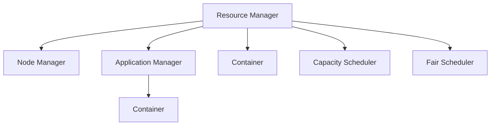

                 

# Yarn原理与代码实例讲解

> 关键词：Yarn, MapReduce, 分布式计算, Hadoop, 容器调度, 集群管理, 生产环境

## 1. 背景介绍

### 1.1 问题由来
随着数据量的爆炸性增长，单台机器处理能力已无法满足大数据分析的需求。为了应对这一挑战，分布式计算框架应运而生。其中，Apache Hadoop 是一个广泛使用的开源分布式计算框架，通过 MapReduce 模型实现了分布式数据处理。但随着集群规模的扩大，Hadoop 的资源管理效率和集群调度能力显得力不从心。在此背景下，Yarn（Yet Another Resource Negotiator）应运而生，它不仅继承了 Hadoop 的分布式计算能力，还提供了更强大的集群资源管理和调度功能，进一步推动了大数据技术的普及应用。

## 2. 核心概念与联系

### 2.1 核心概念概述
为更好地理解 Yarn 的工作原理和核心概念，本节将介绍几个密切相关的核心概念：

- **MapReduce**：一种基于模型编程的分布式计算框架，通过 Map（映射）和 Reduce（归约）两个步骤实现数据的分布式处理。在 Hadoop 中，MapReduce 用于分发计算任务和聚合计算结果。
- **Yarn**：一种分布式计算资源管理系统，用于调度和分配 Hadoop 集群中的计算和存储资源，支持多类型的计算框架，包括 MapReduce、Spark、Storm 等。
- **资源管理器（Resource Manager）**：Yarn 中的核心组件，负责集群资源的分配和管理，以及应用程序的调度。
- **节点管理器（Node Manager）**：管理本地集群的计算和存储资源，接收资源管理器的调度命令，执行任务。
- **应用程序管理器（Application Manager）**：负责调度应用程序的启动和结束，与资源管理器协同工作，优化资源分配。
- **容器（Container）**：Yarn 中的资源分配单位，每个容器包含 CPU、内存、网络资源等，应用程序以容器的形式在集群上运行。
- **优先级调度（Capacity Scheduler）**：Yarn 中默认的资源调度算法，基于优先级和时间片轮转的方式公平地分配资源，支持按优先级、队列等调度策略。
- **公平调度（Fair Scheduler）**：Yarn 中的另一种资源调度算法，通过设定应用优先级、队列限制等，确保集群资源被公平分配。

这些核心概念之间的逻辑关系可以通过以下 Mermaid 流程图来展示：



这个流程图展示了大数据处理中 Yarn 框架的核心组件及其之间的关系：

1. 资源管理器负责集群资源的分配和管理。
2. 节点管理器管理本地集群的资源，接收资源管理器的调度命令。
3. 应用程序管理器调度应用程序的启动和结束，与资源管理器协同工作。
4. 容器是 Yarn 中的资源分配单位，应用程序以容器的形式在集群上运行。
5. 优先级调度和公平调度是 Yarn 中两种主要的资源调度算法，用于优化资源分配。

## 3. 核心算法原理 & 具体操作步骤

### 3.1 算法原理概述

Yarn 框架的核心是资源管理器和应用程序管理器，其核心思想是通过资源管理器和应用程序管理器协同工作，实现集群资源的公平分配和高效调度。具体来说，资源管理器负责监控集群资源状态，并将资源分配给应用程序管理器；应用程序管理器则负责调度应用程序，并将任务分配给节点管理器执行。在任务执行过程中，容器作为资源分配单位，确保任务能够在集群中平稳运行。

Yarn 框架的工作流程如下：

1. 资源管理器接收应用程序提交的作业请求。
2. 资源管理器根据作业需求分配资源，并将容器分配给应用程序管理器。
3. 应用程序管理器将任务分配给节点管理器执行。
4. 节点管理器根据任务需求在本地集群上执行任务。
5. 任务执行结束后，节点管理器向应用程序管理器报告结果，应用程序管理器向资源管理器报告结果。

通过这种协同工作的机制，Yarn 框架能够高效地管理集群资源，并支持多种计算框架的运行，为大规模数据处理提供了强大的支持。

### 3.2 算法步骤详解

Yarn 框架的核心算法步骤如下：

1. 集群初始化：在 Yarn 集群初始化时，资源管理器负责分配集群的计算和存储资源，并将资源以容器的形式分配给应用程序管理器。

2. 作业调度：应用程序管理器根据作业需求向资源管理器提交请求，资源管理器根据集群资源情况，将容器分配给应用程序管理器。

3. 任务执行：应用程序管理器将任务分配给节点管理器执行，节点管理器根据任务需求在本地集群上执行任务。

4. 状态监控：节点管理器向应用程序管理器报告任务执行状态，应用程序管理器向资源管理器报告任务执行结果。

5. 资源释放：任务执行完成后，节点管理器向应用程序管理器报告任务结束，应用程序管理器向资源管理器报告任务结果，资源管理器将容器返回给集群。

这些步骤展示了 Yarn 框架的资源管理与任务调度的流程，确保了集群资源的公平分配和高效利用。

### 3.3 算法优缺点

Yarn 框架的优点包括：

- **高效资源管理**：Yarn 框架通过优先级调度算法和公平调度算法，能够高效地管理集群资源，确保每个作业都能公平获得所需资源。
- **支持多种计算框架**：Yarn 框架支持多种计算框架，包括 MapReduce、Spark、Storm 等，适用于多种数据处理场景。
- **灵活的资源分配**：Yarn 框架通过容器作为资源分配单位，灵活管理集群资源，适应不同的计算需求。

Yarn 框架的缺点包括：

- **配置复杂**：Yarn 框架需要配置较多的参数，如资源池、优先级、队列等，配置不当可能导致资源分配不合理。
- **性能开销**：Yarn 框架在资源分配和管理过程中，增加了额外的性能开销，可能导致集群响应速度变慢。
- **容错性不足**：Yarn 框架对节点故障的容忍度较低，当节点故障时，可能导致整个任务失败。

尽管存在这些局限性，但 Yarn 框架在大数据处理中仍然具有广泛的应用，为大规模数据处理提供了可靠的支持。

### 3.4 算法应用领域

Yarn 框架在多种领域得到了广泛应用，包括但不限于：

- **大数据处理**：Yarn 框架支持多种计算框架，广泛应用于大数据处理领域，如数据清洗、数据分析、数据挖掘等。
- **机器学习**：Yarn 框架支持多种机器学习算法，适用于大规模机器学习任务，如图像识别、自然语言处理等。
- **高可用性应用**：Yarn 框架的高效资源管理和故障容忍度，使其适用于高可用性应用场景，如金融、电商、社交网络等。
- **云计算平台**：Yarn 框架适用于云计算平台，能够灵活管理集群资源，支持弹性伸缩和负载均衡。

## 4. 数学模型和公式 & 详细讲解 & 举例说明（备注：数学公式请使用latex格式，latex嵌入文中独立段落使用 $$，段落内使用 $)
### 4.1 数学模型构建

Yarn 框架的核心算法模型主要涉及资源分配、任务调度和状态监控。以下是 Yarn 框架的数学模型构建：

- **资源分配模型**：假设集群中有 $N$ 个计算节点和 $M$ 个存储节点，每个节点资源大小为 $R$。资源管理器根据作业需求，将资源以容器的形式分配给应用程序管理器。

- **任务调度模型**：应用程序管理器将任务分配给节点管理器执行，每个任务需要 $T$ 的 CPU 时间和 $S$ 的内存空间。

- **状态监控模型**：节点管理器向应用程序管理器报告任务执行状态，应用程序管理器向资源管理器报告任务执行结果。

通过上述数学模型，Yarn 框架能够高效地管理集群资源，并支持多种计算框架的运行。

### 4.2 公式推导过程

以下是 Yarn 框架的数学公式推导过程：

1. **资源分配公式**：假设资源管理器将 $C$ 个容器分配给应用程序管理器，每个容器大小为 $r$，则：

$$
C = \frac{M \times R}{r}
$$

2. **任务调度公式**：假设每个任务需要 $t$ 的 CPU 时间和 $s$ 的内存空间，则：

$$
T = \sum_{i=1}^{C} t_i
$$
$$
S = \sum_{i=1}^{C} s_i
$$

3. **状态监控公式**：节点管理器向应用程序管理器报告任务执行状态，应用程序管理器向资源管理器报告任务执行结果，则：

$$
\text{Status} = \text{State}_0 \times \text{State}_1 \times ... \times \text{State}_N
$$

通过上述数学公式，Yarn 框架能够高效地管理集群资源，并支持多种计算框架的运行。

### 4.3 案例分析与讲解

以 MapReduce 为例，分析 Yarn 框架的应用场景。假设集群中有 10 个计算节点和 20 个存储节点，每个节点的计算能力为 2 CPU，内存为 4GB。某个 MapReduce 作业需要 10 个 CPU 和 10GB 内存，将其分配到集群中进行计算。根据资源分配模型，资源管理器将 10 个容器分配给应用程序管理器，每个容器大小为 1 CPU 和 1GB 内存。根据任务调度模型，应用程序管理器将 10 个任务分配给节点管理器执行，每个任务需要 0.5 CPU 和 1GB 内存。在任务执行过程中，节点管理器向应用程序管理器报告任务执行状态，应用程序管理器向资源管理器报告任务执行结果。

## 5. 项目实践：代码实例和详细解释说明

### 5.1 开发环境搭建

在进行 Yarn 实践前，我们需要准备好开发环境。以下是使用 Linux 搭建 Yarn 环境的流程：

1. 安装 Java：从官网下载并安装 Java，版本需不低于 1.8。

2. 安装 Hadoop：从官网下载并安装 Hadoop，可以参考 Hadoop 官方文档进行安装。

3. 安装 Yarn：在 Hadoop 安装目录下找到 yarn-site.xml 文件，并修改其中的参数。

4. 启动 Yarn：启动 Hadoop，在 Hadoop 命令提示符下执行以下命令：

```
hadoop namenode -start
hadoop datanode -start
hadoop resourcemanager -start
yarn -rm -start
```

5. 验证 Yarn 状态：使用 jps 命令验证 Yarn 的各个组件是否启动成功。

### 5.2 源代码详细实现

以下是一个简单的 Yarn 作业实现示例：

```java
import org.apache.hadoop.io.IntWritable;
import org.apache.hadoop.io.Text;
import org.apache.hadoop.mapreduce.Job;
import org.apache.hadoop.mapreduce.Mapper;
import org.apache.hadoop.mapreduce.Reducer;
import org.apache.hadoop.mapreduce.lib.input.FileInputFormat;
import org.apache.hadoop.mapreduce.lib.output.FileOutputFormat;

import java.io.IOException;

public class WordCount {

    public static class TokenizerMapper
        extends Mapper<Object, Text, Text, IntWritable> {

        private final static IntWritable one = new IntWritable(1);
        private Text word = new Text();

        public void map(Object key, Text value, Context context
                        ) throws IOException, InterruptedException {
            StringTokenizer itr = new StringTokenizer(value.toString());
            while (itr.hasMoreTokens()) {
                word.set(itr.nextToken());
                context.write(word, one);
            }
        }
    }

    public static class IntSumReducer
        extends Reducer<Text,IntWritable,Text,IntWritable> {
        private IntWritable result = new IntWritable();

        public void reduce(Text key, Iterable<IntWritable> values,
                          Context context
                        ) throws IOException, InterruptedException {
            int sum = 0;
            for (IntWritable val : values) {
                sum += val.get();
            }
            result.set(sum);
            context.write(key, result);
        }
    }

    public static void main(String[] args) throws Exception {
        Configuration conf = new Configuration();
        Job job = Job.getInstance(conf, "word count");
        job.setJarByClass(WordCount.class);
        job.setMapperClass(TokenizerMapper.class);
        job.setCombinerClass(IntSumReducer.class);
        job.setReducerClass(IntSumReducer.class);
        job.setOutputKeyClass(Text.class);
        job.setOutputValueClass(IntWritable.class);
        FileInputFormat.addInputPath(job, new Path(args[0]));
        FileOutputFormat.setOutputPath(job, new Path(args[1]));
        System.exit(job.waitForCompletion(true) ? 0 : 1);
    }
}
```

### 5.3 代码解读与分析

让我们再详细解读一下关键代码的实现细节：

**WordCount 类**：
- `main`方法：设置作业信息、输入输出路径，并调用 `waitForCompletion` 方法等待作业完成。

**Mapper 和 Reducer 类**：
- `map`方法：将输入数据按照空格分割，将单词和数字 1 输出到上下文中。
- `reduce`方法：对同一个键值进行聚合，计算单词出现的次数，并将结果输出。

**环境配置和运行流程**：
- 配置文件 `yarn-site.xml`：设置 Yarn 相关的配置信息，如资源管理器地址、存储类型等。
- 运行流程：启动 Hadoop 和 Yarn，并通过 `hadoop jar` 命令提交 MapReduce 作业。

## 6. 实际应用场景

### 6.1 分布式数据处理

Yarn 框架在分布式数据处理中得到了广泛应用。传统单机数据处理方式无法满足大规模数据处理的需求，而 Yarn 框架通过将任务分布到集群中的各个节点上，实现了高效的并行处理。例如，在金融领域，Yarn 框架可以用于处理海量交易数据，实现实时的金融分析和大数据处理。

### 6.2 高可用性应用

Yarn 框架的高可用性设计，使其适用于高可用性应用场景。例如，在电商领域，Yarn 框架可以用于构建高可用性的订单处理系统，确保订单处理系统的稳定性和可靠性。

### 6.3 云计算平台

Yarn 框架适用于云计算平台，支持弹性伸缩和负载均衡。例如，在云存储服务中，Yarn 框架可以用于管理存储资源，实现数据的分布式存储和处理。

### 6.4 未来应用展望

随着 Yarn 框架的不断发展，其未来应用前景值得期待：

1. **支持更多计算框架**：Yarn 框架可以支持更多计算框架，如 Spark、Storm 等，满足不同场景下的数据处理需求。

2. **提升性能和可伸缩性**：Yarn 框架通过优化资源分配和调度算法，提升任务执行的性能和集群的可伸缩性。

3. **增强容错性和稳定性**：Yarn 框架通过优化故障恢复机制，提升系统的容错性和稳定性。

4. **支持多种数据类型**：Yarn 框架可以支持多种数据类型，包括结构化数据、半结构化数据、非结构化数据等，实现多种数据类型的处理和分析。

5. **引入机器学习算法**：Yarn 框架可以引入机器学习算法，实现复杂的数据分析和智能决策。

## 7. 工具和资源推荐

### 7.1 学习资源推荐

为了帮助开发者系统掌握 Yarn 的核心概念和实践技巧，这里推荐一些优质的学习资源：

1. **《Yarn: The Real Story Behind Hadoop 2.x》**：由 Hadoop 创始人编写，详细介绍了 Yarn 的实现原理和应用场景。

2. **《Hadoop: The Definitive Guide》**：Hadoop 官方文档，提供了 Yarn 的详细使用指南和最佳实践。

3. **《Yarn: The Road Ahead》**：由 Yarn 项目负责人编写，深入浅出地介绍了 Yarn 的设计理念和未来发展方向。

4. **《Yarn: An Introduction to Large Scale Data Processing》**：Apache 官方博客，介绍了 Yarn 的实现原理和应用场景。

5. **《Big Data with Yarn》**：在线课程，由 Hortonworks 提供，详细介绍了 Yarn 的实现原理和最佳实践。

通过对这些资源的学习实践，相信你一定能够快速掌握 Yarn 的核心概念，并用于解决实际的分布式计算问题。

### 7.2 开发工具推荐

Yarn 的开发和运维离不开优秀的工具支持。以下是几款用于 Yarn 开发和运维的常用工具：

1. **Hadoop 命令行工具**：用于管理 Hadoop 和 Yarn 集群，提供丰富的命令行操作。

2. **Yarn 监控工具**：如 Yarn UI、Cloudera Manager 等，用于监控 Yarn 集群的运行状态，确保集群稳定运行。

3. **资源管理工具**：如 Hadoop Admin Tools、Cloudera Navigator 等，用于管理集群资源，优化资源分配。

4. **代码管理工具**：如 Git、SVN 等，用于管理 Yarn 项目的代码和版本。

5. **版本控制工具**：如 Jenkins、Travis CI 等，用于自动化测试和持续集成。

合理利用这些工具，可以显著提升 Yarn 的开发效率和运维质量，加速创新迭代的步伐。

### 7.3 相关论文推荐

Yarn 框架的发展离不开学界的持续研究。以下是几篇奠基性的相关论文，推荐阅读：

1. **《MapReduce: Simplified Data Processing on Large Clusters》**：Google 的 MapReduce 论文，介绍了 MapReduce 的实现原理和应用场景。

2. **《YARN: Yet Another Resource Negotiator》**：Yarn 的介绍论文，详细介绍了 Yarn 的设计理念和实现原理。

3. **《The Hadoop Distributed File System》**：Hadoop 的介绍论文，介绍了 Hadoop 的设计理念和实现原理。

4. **《Yarn: A Scalable Resource Management System for Apache Hadoop》**：Yarn 的设计论文，详细介绍了 Yarn 的设计理念和实现原理。

5. **《A Framework for Distributed Asynchronous Machine Learning》**：机器学习在 Yarn 上的应用论文，介绍了机器学习在 Yarn 上的应用场景和实现方式。

这些论文代表了大数据处理中 Yarn 框架的发展脉络。通过学习这些前沿成果，可以帮助研究者把握学科前进方向，激发更多的创新灵感。

## 8. 总结：未来发展趋势与挑战

### 8.1 总结

本文对 Yarn 框架的工作原理和核心概念进行了全面系统的介绍。首先阐述了 Yarn 框架的背景和应用场景，明确了 Yarn 在大数据处理中的重要地位。其次，从原理到实践，详细讲解了 Yarn 框架的核心算法模型和关键步骤，给出了 Yarn 框架的代码实例。同时，本文还广泛探讨了 Yarn 框架在分布式数据处理、高可用性应用、云计算平台等多个领域的应用前景，展示了 Yarn 框架的强大潜力。

通过本文的系统梳理，可以看到，Yarn 框架已经成为大数据处理中的重要组成部分，为大规模数据处理提供了强大的支持。未来，伴随 Yarn 框架的持续演进，相信 Yarn 框架将进一步提升大数据处理的效率和可靠性，为各行业带来更多的应用价值。

### 8.2 未来发展趋势

展望未来，Yarn 框架将呈现以下几个发展趋势：

1. **支持更多计算框架**：Yarn 框架可以支持更多计算框架，如 Spark、Storm 等，满足不同场景下的数据处理需求。

2. **提升性能和可伸缩性**：Yarn 框架通过优化资源分配和调度算法，提升任务执行的性能和集群的可伸缩性。

3. **增强容错性和稳定性**：Yarn 框架通过优化故障恢复机制，提升系统的容错性和稳定性。

4. **支持多种数据类型**：Yarn 框架可以支持多种数据类型，包括结构化数据、半结构化数据、非结构化数据等，实现多种数据类型的处理和分析。

5. **引入机器学习算法**：Yarn 框架可以引入机器学习算法，实现复杂的数据分析和智能决策。

### 8.3 面临的挑战

尽管 Yarn 框架已经取得了瞩目成就，但在迈向更加智能化、普适化应用的过程中，它仍面临着诸多挑战：

1. **配置复杂**：Yarn 框架需要配置较多的参数，如资源池、优先级、队列等，配置不当可能导致资源分配不合理。

2. **性能开销**：Yarn 框架在资源分配和管理过程中，增加了额外的性能开销，可能导致集群响应速度变慢。

3. **容错性不足**：Yarn 框架对节点故障的容忍度较低，当节点故障时，可能导致整个任务失败。

4. **安全性不足**：Yarn 框架在资源分配和调度过程中，可能面临安全性问题，如资源泄露、权限滥用等。

5. **可扩展性不足**：Yarn 框架在大规模集群中的扩展性不足，可能导致资源分配和调度效率下降。

尽管存在这些局限性，但 Yarn 框架在大数据处理中仍然具有广泛的应用，为大规模数据处理提供了可靠的支持。

### 8.4 未来突破

面对 Yarn 框架所面临的挑战，未来的研究需要在以下几个方面寻求新的突破：

1. **优化资源分配和调度算法**：开发更加高效的资源分配和调度算法，提升 Yarn 框架的性能和可伸缩性。

2. **引入更多的计算框架**：支持更多计算框架，如 Spark、Storm 等，满足不同场景下的数据处理需求。

3. **增强容错性和稳定性**：优化故障恢复机制，提升系统的容错性和稳定性。

4. **引入更多的数据类型和机器学习算法**：支持更多的数据类型和机器学习算法，实现复杂的数据分析和智能决策。

5. **优化配置和管理工具**：开发更加易用的配置和管理工具，提高 Yarn 框架的使用便捷性。

这些研究方向的探索，必将引领 Yarn 框架走向更高的台阶，为大规模数据处理提供更加可靠和高效的支持。面向未来，Yarn 框架还需要与其他大数据技术进行更深入的融合，如数据湖、流式计算等，多路径协同发力，共同推动大数据技术的进步。总之，Yarn 框架需要在资源管理、任务调度、集群运维等多个维度进行全面优化，才能真正实现其在大数据处理中的价值。

## 9. 附录：常见问题与解答

**Q1：Yarn 框架和 MapReduce 框架的区别是什么？**

A: Yarn 框架和 MapReduce 框架都是 Hadoop 的组成部分，但 Yarn 框架是对 MapReduce 框架的扩展和改进。MapReduce 框架只能支持单个计算框架，而 Yarn 框架可以支持多种计算框架，如 MapReduce、Spark、Storm 等。此外，Yarn 框架还提供了更强大的集群资源管理和调度功能，能够更高效地管理集群资源。

**Q2：Yarn 框架的资源管理器和节点管理器的作用是什么？**

A: 资源管理器是 Yarn 框架的核心组件，负责集群资源的分配和管理，以及应用程序的调度。节点管理器管理本地集群的计算和存储资源，接收资源管理器的调度命令，执行任务。通过这两个组件的协同工作，Yarn 框架能够高效地管理集群资源，并支持多种计算框架的运行。

**Q3：Yarn 框架的优先级调度和公平调度有什么区别？**

A: 优先级调度和公平调度是 Yarn 框架中两种主要的资源调度算法。优先级调度算法通过设定应用程序的优先级，确保高优先级的作业先被执行。公平调度算法通过设定队列限制，确保每个作业都能够获得公平的资源分配。

**Q4：Yarn 框架在实际应用中需要注意哪些问题？**

A: Yarn 框架在实际应用中需要注意以下问题：

1. 配置复杂：Yarn 框架需要配置较多的参数，如资源池、优先级、队列等，配置不当可能导致资源分配不合理。

2. 性能开销：Yarn 框架在资源分配和管理过程中，增加了额外的性能开销，可能导致集群响应速度变慢。

3. 容错性不足：Yarn 框架对节点故障的容忍度较低，当节点故障时，可能导致整个任务失败。

4. 安全性不足：Yarn 框架在资源分配和调度过程中，可能面临安全性问题，如资源泄露、权限滥用等。

5. 可扩展性不足：Yarn 框架在大规模集群中的扩展性不足，可能导致资源分配和调度效率下降。

通过对这些问题进行分析和优化，可以进一步提升 Yarn 框架的性能和可靠性，确保其在实际应用中的稳定性和高效性。

**Q5：如何优化 Yarn 框架的性能和可伸缩性？**

A: 优化 Yarn 框架的性能和可伸缩性，可以采取以下措施：

1. 优化资源分配和调度算法，提升 Yarn 框架的性能和可伸缩性。

2. 引入更多的计算框架，支持多种数据处理场景。

3. 优化故障恢复机制，提升系统的容错性和稳定性。

4. 优化配置和管理工具，提高 Yarn 框架的使用便捷性。

5. 引入更多的数据类型和机器学习算法，实现复杂的数据分析和智能决策。

通过对这些问题进行分析和优化，可以进一步提升 Yarn 框架的性能和可靠性，确保其在实际应用中的稳定性和高效性。

---

作者：禅与计算机程序设计艺术 / Zen and the Art of Computer Programming

