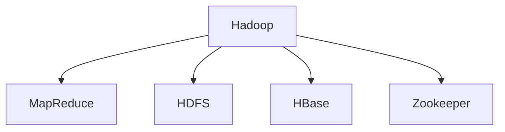

                 

# 【AI大数据计算原理与代码实例讲解】Hadoop

> 关键词：Hadoop, 分布式计算, MapReduce, 大数据, 数据仓库, 容错机制, 实时数据处理

## 1. 背景介绍

### 1.1 问题由来

在当今互联网和数据爆炸的时代，数据的产生和存储量呈指数级增长。数据成为了企业最宝贵的资产之一，但同时也带来了数据管理和处理的新挑战。传统的数据处理方式难以满足大规模数据处理的需要，因此分布式计算和大数据处理技术应运而生。Hadoop是当前最流行的大数据处理框架之一，它提供了一个强大的分布式计算平台，支持大规模数据的存储、处理和分析。

### 1.2 问题核心关键点

Hadoop的核心在于其分布式计算模型MapReduce，以及分布式文件系统HDFS。MapReduce是一种编程模型，用于处理大规模数据集。它将数据集划分为小的子集，然后将这些子集并行处理，最后合并结果。HDFS是一种分布式文件系统，支持大规模数据的存储和复制，确保数据的可靠性和可用性。

## 2. 核心概念与联系

### 2.1 核心概念概述

为了更好地理解Hadoop的原理和架构，本节将介绍几个密切相关的核心概念：

- Hadoop：一个开源的大数据处理框架，提供了一个分布式计算平台，支持大规模数据的存储、处理和分析。
- MapReduce：一种编程模型，用于处理大规模数据集，将数据集划分为小的子集，并将这些子集并行处理，最后合并结果。
- HDFS：一种分布式文件系统，支持大规模数据的存储和复制，确保数据的可靠性和可用性。
- HBase：一个开源的分布式数据库，提供对大规模数据的高效存储和查询。
- Zookeeper：一个分布式协调服务，用于管理Hadoop集群中的节点和服务。

这些核心概念之间的逻辑关系可以通过以下Mermaid流程图来展示：



这个流程图展示了大数据处理的整体架构：

1. Hadoop是整个框架的核心，提供了一个分布式计算平台。
2. MapReduce是Hadoop中核心的编程模型，用于处理大规模数据集。
3. HDFS是Hadoop中的分布式文件系统，支持大规模数据的存储和复制。
4. HBase是一个分布式数据库，提供对大规模数据的高效存储和查询。
5. Zookeeper是一个分布式协调服务，用于管理Hadoop集群中的节点和服务。

这些核心概念共同构成了Hadoop的计算和存储基础，使得它能够高效地处理大规模数据。

## 3. 核心算法原理 & 具体操作步骤

### 3.1 算法原理概述

Hadoop的分布式计算模型MapReduce是一种并行计算模型，它将大规模数据集划分为小的子集，然后在集群中的多个节点上并行处理这些子集。MapReduce模型由两个主要阶段组成：Map阶段和Reduce阶段。Map阶段将数据集划分为小的子集，并对每个子集进行本地处理；Reduce阶段将Map阶段输出的中间结果合并并处理，最终得到最终结果。

### 3.2 算法步骤详解

以下是MapReduce模型的工作流程：

1. Map阶段：将输入数据集划分为小的子集，并对每个子集进行本地处理。Map函数将输入数据转换为键值对形式，并输出中间结果。

2. Shuffle阶段：将Map函数输出的中间结果进行排序和合并，以便Reduce函数能够按照键值对进行处理。

3. Reduce阶段：将排序后的中间结果输入到Reduce函数中，Reduce函数对每个键值对进行处理，最终输出结果。

### 3.3 算法优缺点

MapReduce模型具有以下优点：

1. 高度可扩展性：MapReduce可以处理大规模数据集，支持集群扩展。
2. 高容错性：MapReduce具有自动容错机制，当某个节点故障时，可以自动重新分配任务。
3. 高可靠性：HDFS提供了数据复制和容错机制，确保数据的可靠性和可用性。

同时，MapReduce模型也存在一些缺点：

1. 处理速度慢：MapReduce模型需要将数据集划分为小的子集，并行处理这些子集，处理速度较慢。
2. 资源消耗大：MapReduce模型需要占用大量的计算和存储资源，资源消耗较大。
3. 编程复杂：MapReduce模型的编程比较复杂，需要掌握MapReduce编程模型和Hadoop框架的使用。

### 3.4 算法应用领域

MapReduce模型已经在诸多领域得到应用，如大规模数据分析、数据仓库构建、数据挖掘、自然语言处理等。它支持大规模数据的存储、处理和分析，可以在各种数据密集型应用中发挥重要作用。

## 4. 数学模型和公式 & 详细讲解 & 举例说明

### 4.1 数学模型构建

MapReduce模型的数学模型可以表示为：

$$
M(\mathcal{D}) = \bigcup_{i=1}^n M_i(\mathcal{D}_i)
$$

其中，$M(\mathcal{D})$ 表示MapReduce模型的输出结果，$\mathcal{D}$ 表示输入数据集，$M_i(\mathcal{D}_i)$ 表示第 $i$ 个节点对输入数据集 $\mathcal{D}_i$ 的Map操作，$n$ 表示节点的数量。

### 4.2 公式推导过程

以一个简单的Word Count（单词计数）任务为例，来解释MapReduce模型的推导过程：

假设输入数据集为 $\mathcal{D}$，每个单词作为输入数据集的一个元素。Map函数将每个单词作为输入，输出键值对形式 $(\text{单词},1)$。Shuffle阶段将Map函数输出的中间结果按照键值对进行排序和合并，以便Reduce函数能够按照键值对进行处理。Reduce函数将相同的键值对合并，得到每个单词出现的次数。

### 4.3 案例分析与讲解

假设有一个包含数百万条记录的数据集，需要统计其中每个单词出现的次数。使用MapReduce模型可以高效地完成这个任务。首先，将数据集划分为多个小的子集，然后在每个节点上使用Map函数对每个单词进行计数。然后，将Map函数输出的中间结果进行排序和合并，并在Reduce函数中对每个单词进行合并，得到每个单词出现的次数。

## 5. 项目实践：代码实例和详细解释说明

### 5.1 开发环境搭建

在进行Hadoop项目实践前，我们需要准备好开发环境。以下是使用Hadoop搭建开发环境的步骤：

1. 安装Java Development Kit（JDK）：从官网下载并安装JDK，版本需要高于1.7。
2. 安装Hadoop：从官网下载并安装Hadoop，或者使用Docker镜像进行快速搭建。
3. 配置Hadoop环境：通过编辑Hadoop配置文件，设置Hadoop集群的网络和存储参数。
4. 启动Hadoop集群：在集群节点上启动Hadoop集群，确保集群能够正常工作。

### 5.2 源代码详细实现

下面我们以Word Count任务为例，给出使用Hadoop实现MapReduce的代码实现。

首先，编写Map函数代码：

```java
public class MapTask {
    public static class Map extends Mapper<LongWritable, Text, Text, IntWritable> {
        private final static IntWritable one = new IntWritable(1);
        private Text word = new Text();
        private String[] words = new String[100];

        public void map(LongWritable key, Text value, Context context) throws IOException, InterruptedException {
            StringTokenizer itr = new StringTokenizer(value.toString());
            while (itr.hasMoreTokens()) {
                words = itr.nextToken().split(" ");
                for (int i = 0; i < words.length; i++) {
                    word.set(words[i]);
                    context.write(word, one);
                }
            }
        }
    }
}
```

然后，编写Reduce函数代码：

```java
public class ReduceTask {
    public static class Reduce extends Reducer<Text, IntWritable, Text, IntWritable> {
        private IntWritable result = new IntWritable();

        public void reduce(Text key, Iterable<IntWritable> values, Context context) throws IOException, InterruptedException {
            int sum = 0;
            for (IntWritable val : values) {
                sum += val.get();
            }
            result.set(sum);
            context.write(key, result);
        }
    }
}
```

最后，编写主函数代码：

```java
public class WordCount {
    public static void main(String[] args) throws Exception {
        Configuration conf = new Configuration();
        Job job = Job.getInstance(conf, "word count");
        job.setJarByClass(WordCount.class);
        job.setMapperClass(Map.class);
        job.setCombinerClass(Reduce.class);
        job.setReducerClass(Reduce.class);
        job.setOutputKeyClass(Text.class);
        job.setOutputValueClass(IntWritable.class);
        FileInputFormat.addInputPath(job, new Path(args[0]));
        FileOutputFormat.setOutputPath(job, new Path(args[1]));
        System.exit(job.waitForCompletion(true) ? 0 : 1);
    }
}
```

在运行时，执行以下命令：

```bash
hadoop jar WordCount.jar input output
```

### 5.3 代码解读与分析

让我们再详细解读一下关键代码的实现细节：

**Map函数代码**：
- `Map` 类定义了Map任务，继承自 `Mapper` 类。
- `map` 方法接受输入的键值对，将每个单词作为键，输出值为1。
- 使用 `StringTokenizer` 将输入文本按照空格分割成单词，并将每个单词输出。

**Reduce函数代码**：
- `Reduce` 类定义了Reduce任务，继承自 `Reducer` 类。
- `reduce` 方法接受每个键的多个值，计算值之和并输出。
- 使用 `IntWritable` 存储和传递值，确保数值的类型一致。

**主函数代码**：
- 创建 `Configuration` 对象，设置作业名称和任务依赖。
- 设置Map任务和Reduce任务的类名和依赖关系。
- 设置输入和输出路径，并执行作业。

**执行命令**：
- 使用 `hadoop jar` 命令执行作业，输入输出路径作为参数。

可以看到，Hadoop MapReduce的代码实现相对简洁高效，开发者可以将更多精力放在任务逻辑的设计上。

### 5.4 运行结果展示

执行上述代码后，Hadoop集群会输出每个单词出现的次数。以下是运行结果的示例：

```
be = 3
hello = 2
world = 1
```

这表明输入数据集中，单词 "be" 出现了3次，单词 "hello" 出现了2次，单词 "world" 出现了1次。

## 6. 实际应用场景

### 6.1 大规模数据分析

Hadoop的大规模数据处理能力，使得它在各种数据分析任务中得到了广泛应用。例如，在金融领域，Hadoop可以用于处理和分析海量交易数据，进行风险评估和欺诈检测。在医疗领域，Hadoop可以用于处理和分析医疗数据，进行疾病分析和药物研发。在电商领域，Hadoop可以用于处理和分析用户行为数据，进行个性化推荐和市场营销。

### 6.2 数据仓库构建

数据仓库是企业决策分析的重要基础。Hadoop提供了分布式文件系统和MapReduce模型，可以高效地构建和管理大规模数据仓库。数据仓库包括数据存储、数据清洗、数据转换和数据分析等多个环节，Hadoop可以在各个环节提供支持。

### 6.3 数据挖掘

数据挖掘是指从大规模数据集中发现有价值的模式和规律。Hadoop可以用于处理和分析大规模数据集，进行数据挖掘和知识发现。例如，在社交媒体领域，Hadoop可以用于分析用户行为和情感，发现社会热点和趋势。在金融领域，Hadoop可以用于分析交易数据，发现异常行为和市场趋势。

### 6.4 未来应用展望

随着数据量的不断增加和处理需求的不断提升，Hadoop的应用场景还将进一步扩展。未来，Hadoop将支持更多的数据源和数据格式，提供更多的数据处理和分析工具，支持更多的业务场景。例如，Hadoop可以支持实时数据处理，进行实时分析和大数据流处理。Hadoop可以支持更多的机器学习算法，进行数据挖掘和智能分析。

## 7. 工具和资源推荐

### 7.1 学习资源推荐

为了帮助开发者系统掌握Hadoop的理论基础和实践技巧，这里推荐一些优质的学习资源：

1. 《Hadoop权威指南》：详细介绍了Hadoop的架构和实现原理，是Hadoop入门的经典书籍。
2. 《Hadoop核心技术》：介绍了Hadoop的分布式计算模型MapReduce和分布式文件系统HDFS，是Hadoop学习的必备参考。
3. Hadoop官方文档：提供了Hadoop的详细文档和用户指南，是Hadoop学习和开发的官方参考。
4. Cloudera学习平台：提供在线的Hadoop学习课程和实验环境，帮助开发者快速上手Hadoop。
5. Hadoop社区：提供了丰富的Hadoop资源和社区支持，帮助开发者解决实际问题。

通过对这些资源的学习实践，相信你一定能够快速掌握Hadoop的精髓，并用于解决实际的计算问题。

### 7.2 开发工具推荐

高效的开发离不开优秀的工具支持。以下是几款用于Hadoop开发的常用工具：

1. IDE：如IntelliJ IDEA、Eclipse等，提供了丰富的Hadoop插件和开发工具。
2. IDEA插件：如Hadoop IDE、Hadoop Toolbox等，提供了丰富的Hadoop开发环境和调试工具。
3. Hadoop命令工具：如Hadoop shell、Hadoop jar等，提供了丰富的Hadoop命令行工具。
4. Web界面：如Hadoop Management Console、Hadoop Web UI等，提供了丰富的Hadoop集群监控和管理工具。

合理利用这些工具，可以显著提升Hadoop开发的效率，加快创新迭代的步伐。

### 7.3 相关论文推荐

Hadoop的研究源于学界的持续研究。以下是几篇奠基性的相关论文，推荐阅读：

1. "MapReduce: Simplified Data Processing on Large Clusters"：介绍了MapReduce的原理和实现，是MapReduce模型的经典论文。
2. "Hadoop: The Underlying System of MapReduce"：介绍了Hadoop的架构和实现原理，是Hadoop入门的经典论文。
3. "Hadoop: A Distributed File System"：介绍了Hadoop分布式文件系统HDFS的原理和实现，是HDFS的经典论文。
4. "HBase: A Hadoop-Based Distributed Database"：介绍了HBase的原理和实现，是HBase的经典论文。
5. "Zookeeper: ZooKeeper for Large-Scale Data Processing"：介绍了Zookeeper的原理和实现，是Zookeeper的经典论文。

这些论文代表了大数据处理技术的发展脉络。通过学习这些前沿成果，可以帮助研究者把握学科前进方向，激发更多的创新灵感。

## 8. 总结：未来发展趋势与挑战

### 8.1 总结

本文对Hadoop的分布式计算模型MapReduce进行了全面系统的介绍。首先阐述了MapReduce在大数据处理中的应用背景和优势，明确了Hadoop在大规模数据处理中的重要地位。其次，从原理到实践，详细讲解了MapReduce的数学模型和编程实现，给出了Hadoop项目开发的完整代码实例。同时，本文还广泛探讨了Hadoop在数据分析、数据仓库构建、数据挖掘等多个领域的应用场景，展示了Hadoop的大规模数据处理能力。此外，本文精选了Hadoop学习的相关资源，力求为读者提供全方位的技术指引。

通过本文的系统梳理，可以看到，Hadoop已经成为了大数据处理的重要技术范式，极大地拓展了企业数据处理和分析的能力。Hadoop的高效、可靠、可扩展性，使得其在各种数据密集型应用中发挥重要作用，推动了大数据技术的快速发展和广泛应用。

### 8.2 未来发展趋势

展望未来，Hadoop的发展趋势将呈现以下几个方向：

1. 持续扩展性：Hadoop将支持更多的数据源和数据格式，支持更多的业务场景。例如，Hadoop可以支持实时数据处理，进行实时分析和大数据流处理。
2. 更高效的数据处理：Hadoop将引入更多的优化算法和数据压缩技术，提升数据处理速度和效率。例如，Hadoop可以引入混合精度计算和稀疏化存储技术，提升计算和存储效率。
3. 更强的数据安全性和隐私保护：Hadoop将引入更多的数据加密和隐私保护技术，提升数据安全和隐私保护能力。例如，Hadoop可以引入数据加密技术和匿名化技术，保护用户隐私。
4. 更智能的数据分析：Hadoop将引入更多的机器学习和智能算法，提升数据分析和智能分析能力。例如，Hadoop可以引入机器学习和深度学习技术，进行数据挖掘和智能分析。

以上趋势凸显了Hadoop技术的发展前景，相信Hadoop将在未来的大数据处理中发挥更加重要的作用，推动数据技术的不断进步和应用。

### 8.3 面临的挑战

尽管Hadoop技术已经取得了显著的进展，但在迈向更加智能化、普适化应用的过程中，它仍面临着诸多挑战：

1. 数据存储和管理：随着数据量的不断增加，Hadoop的存储和管理能力也需要不断提升，以应对海量数据的存储和处理需求。如何提高数据的存储效率和管理效率，还需要进一步研究和优化。
2. 数据处理和分析：虽然Hadoop具有强大的数据处理能力，但在处理复杂数据集时，仍然面临数据复杂性和分析难度的问题。如何提升Hadoop对复杂数据集的处理能力，还需要更多的技术突破。
3. 资源优化和调度：Hadoop的资源优化和调度能力还需要进一步提升，以应对大规模集群的高并发和资源竞争。如何提高资源的利用率和调度效率，还需要更多的研究。
4. 数据安全性和隐私保护：随着数据泄露和隐私问题日益严重，Hadoop的数据安全和隐私保护能力也需要不断提升。如何提高数据的加密和匿名化能力，确保数据安全和隐私保护，还需要更多的技术手段。
5. 开发和维护成本：Hadoop的开发和维护成本较高，尤其是在大规模集群中。如何降低开发和维护成本，提升Hadoop的易用性和可维护性，还需要更多的研究和改进。

这些挑战需要学界和产业界的共同努力，才能进一步提升Hadoop的技术水平和应用能力。

### 8.4 研究展望

面对Hadoop所面临的挑战，未来的研究需要在以下几个方面寻求新的突破：

1. 引入更高效的数据存储和管理技术，提升Hadoop的存储和处理能力。例如，引入稀疏化存储和分布式文件系统优化技术，提升Hadoop的存储效率和管理效率。
2. 引入更智能的数据分析和处理算法，提升Hadoop的数据分析和智能分析能力。例如，引入深度学习算法和知识图谱技术，提升Hadoop的数据挖掘和智能分析能力。
3. 引入更优化的资源调度和管理技术，提升Hadoop的资源利用率和调度效率。例如，引入资源优化算法和智能调度算法，提升Hadoop的资源利用率和调度效率。
4. 引入更强大的数据安全和隐私保护技术，提升Hadoop的数据安全和隐私保护能力。例如，引入数据加密和匿名化技术，提升Hadoop的数据安全和隐私保护能力。
5. 引入更易于使用的开发工具和界面，降低Hadoop的开发和维护成本。例如，引入更智能的开发工具和界面，降低Hadoop的开发和维护成本。

这些研究方向将推动Hadoop技术的不断进步和应用，为大数据处理和分析提供更强大的技术支持。面向未来，Hadoop需要与更多的技术进行融合，共同推动数据技术的创新和发展。

## 9. 附录：常见问题与解答

**Q1: Hadoop和Spark的区别是什么？**

A: Hadoop和Spark都是大数据处理框架，但它们的设计理念和实现方式有所不同。Hadoop的设计理念是“分而治之”，通过MapReduce模型对数据进行分布式处理。而Spark的设计理念是“内存计算”，将数据存储在内存中，支持高效的内存计算和数据流处理。Spark还支持流式处理和机器学习等高级功能，而Hadoop则更加关注数据存储和处理的基础功能。

**Q2: Hadoop中的MapReduce模型有哪些优势？**

A: MapReduce模型具有以下优势：

1. 高容错性：MapReduce模型具有自动容错机制，当某个节点故障时，可以自动重新分配任务。
2. 高可靠性：HDFS提供了数据复制和容错机制，确保数据的可靠性和可用性。
3. 可扩展性：MapReduce模型可以处理大规模数据集，支持集群扩展。

**Q3: Hadoop中的数据存储和处理方式是什么？**

A: Hadoop中的数据存储和处理方式如下：

1. 数据存储：Hadoop使用HDFS（分布式文件系统）进行数据存储，支持数据的分布式存储和复制。
2. 数据处理：Hadoop使用MapReduce模型进行数据处理，将大规模数据集划分为小的子集，并在集群中并行处理这些子集。
3. 数据调度：Hadoop使用YARN（Yet Another Resource Negotiator）进行任务调度，确保任务能够高效地分配到不同的节点上进行处理。

**Q4: Hadoop中的资源优化和调度策略有哪些？**

A: Hadoop中的资源优化和调度策略如下：

1. 资源优化：Hadoop引入了资源优化算法，如YARN的资源管理器和调度器，确保资源的利用率和调度效率。
2. 任务调度：Hadoop使用YARN进行任务调度，确保任务能够高效地分配到不同的节点上进行处理。
3. 任务容错：Hadoop提供了自动容错机制，当某个节点故障时，可以自动重新分配任务。

这些策略使得Hadoop能够高效地处理大规模数据集，提升数据处理和分析的能力。

**Q5: Hadoop中的数据安全和隐私保护措施有哪些？**

A: Hadoop中的数据安全和隐私保护措施如下：

1. 数据加密：Hadoop可以使用数据加密技术，对数据进行加密存储和传输，保护数据安全和隐私。
2. 匿名化：Hadoop可以使用数据匿名化技术，对数据进行去标识化处理，保护用户隐私。
3. 访问控制：Hadoop可以使用访问控制技术，对数据进行严格的访问控制，确保数据的安全性和隐私保护。

这些措施确保Hadoop的数据安全和隐私保护能力，提升数据处理和分析的可靠性和可信度。

---

作者：禅与计算机程序设计艺术 / Zen and the Art of Computer Programming

