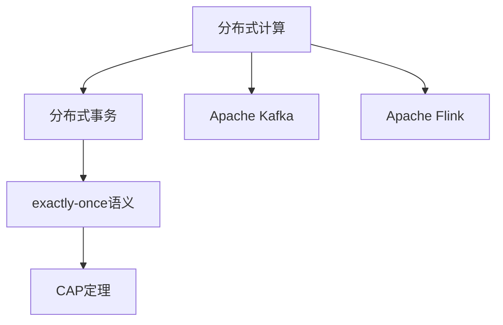

                 

# 【AI大数据计算原理与代码实例讲解】exactly-once语义

> 关键词：大数据、分布式计算、exactly-once语义、分布式事务、Kafka、Apache Flink

## 1. 背景介绍

### 1.1 问题由来

在当今数字化时代，数据的重要性日益凸显。无论是金融、零售、医疗、制造还是政府部门，各行各业都在通过数据驱动决策。然而，海量数据的处理和分析带来了严峻的挑战：

- **数据规模巨大**：数据量以指数级增长，存储和处理需求巨大。
- **处理速度要求高**：实时性和低延迟成为关键要求，传统批处理方式无法满足。
- **数据一致性**：分布式系统中的数据一致性问题，成为确保数据完整性和准确性的难题。

为了应对这些挑战，分布式计算和分布式事务技术应运而生。其中，exactly-once语义是分布式事务处理中的核心概念，旨在保证在分布式系统中，每个操作仅被处理一次，避免数据重复或丢失。

### 1.2 问题核心关键点

exactly-once语义在大数据计算中的应用，涉及到分布式系统、事务处理、数据一致性等多个关键点。核心在于：

- **分布式事务处理**：如何在分布式系统中保证每个操作仅被处理一次。
- **数据一致性**：如何确保数据在分布式系统中的完整性和一致性。
- **高性能计算**：如何在保证数据一致性的前提下，提升分布式计算的性能。

## 2. 核心概念与联系

### 2.1 核心概念概述

为了更好地理解exactly-once语义在大数据计算中的应用，本节将介绍几个密切相关的核心概念：

- **分布式计算**：通过在多台计算机上并行处理数据，提高计算效率。常见技术包括MapReduce、Spark等。
- **分布式事务**：在分布式系统中，多个节点之间需要协同完成的操作。常见的分布式事务实现包括两阶段提交(Two-Phase Commit, 2PC)、事务链(Chain-Based)等。
- **exactly-once语义**：分布式事务处理中的关键概念，要求每个操作仅被处理一次。
- **CAP定理**：分布式系统中的经典理论，描述了一致性、可用性和分区容错性三者之间的权衡。
- **Apache Kafka**：开源的分布式流处理平台，支持高吞吐量、低延迟的数据流处理。
- **Apache Flink**：开源的分布式流处理框架，支持高效的数据流处理和状态管理。

这些核心概念之间的逻辑关系可以通过以下Mermaid流程图来展示：



这个流程图展示了大数据计算中的核心概念及其之间的关系：

1. 分布式计算是基础，通过并行处理大规模数据。
2. 分布式事务处理需要保证数据一致性，而exactly-once语义是其中的关键。
3. CAP定理揭示了分布式系统的本质限制，对事务处理的设计有重要指导意义。
4. Kafka和Flink是常用的分布式计算平台，支持高效的数据流处理。

## 3. 核心算法原理 & 具体操作步骤

### 3.1 算法原理概述

exactly-once语义的核心在于保证分布式系统中每个操作仅被处理一次，确保数据的一致性和完整性。其实现原理基于以下三点：

- **事务隔离**：将一系列操作作为一个事务，所有操作要么全部成功，要么全部失败，保证操作的一致性。
- **重试机制**：在操作失败时，能够自动重试，直到操作成功或达到最大重试次数。
- **日志存储**：所有操作日志以顺序写入的方式存储，确保每个操作仅被处理一次。

### 3.2 算法步骤详解

exactly-once语义的实现步骤一般包括以下几个关键步骤：

**Step 1: 分布式事务的设计与实现**
- 定义一个全局唯一的ID，用于标识一个事务。
- 确定事务包含的具体操作，如数据库操作、消息队列操作等。
- 实现一个事务管理器，负责协调和管理整个事务的生命周期。

**Step 2: 分布式事务的提交与回滚**
- 在操作执行过程中，实时记录操作日志，确保每个操作都被记录下来。
- 当所有操作执行完成后，事务管理器调用两阶段提交协议，提交或回滚整个事务。
- 提交成功后，删除所有操作日志，保证每个操作仅被处理一次。

**Step 3: 异常处理与重试机制**
- 在操作执行过程中，实时监控操作的执行状态，发现异常立即回滚。
- 定义最大重试次数，当达到最大重试次数仍未提交时，手动终止事务。
- 重试机制下，每个操作都会重复执行，直至成功提交。

**Step 4: 数据一致性保证**
- 使用CAP定理的指导原则，在设计分布式系统时，需要权衡一致性、可用性和分区容错性。
- 对于关键操作，需要确保一致性和可用性，避免分区容错性带来的数据不一致。
- 使用分布式锁、版本控制等技术，确保数据在分布式系统中的完整性和一致性。

### 3.3 算法优缺点

exactly-once语义在大数据计算中具有以下优点：
1. **高数据完整性**：确保每个操作仅被处理一次，避免数据重复或丢失。
2. **高可用性**：通过重试机制，确保在异常情况下操作也能被正确处理。
3. **可扩展性**：分布式计算系统可以方便地扩展到多台计算机，提升计算效率。

同时，该方法也存在一定的局限性：
1. **延迟较高**：重试机制和日志存储会带来一定的延迟。
2. **系统复杂性高**：实现exactly-once语义需要设计复杂的事务管理器和重试机制。
3. **资源消耗大**：日志存储和重试机制会消耗大量资源，特别是在高并发情况下。

尽管存在这些局限性，但就目前而言，exactly-once语义仍是分布式事务处理中最为主流和可靠的方式。未来相关研究的重点在于如何进一步降低延迟和资源消耗，提高系统的可扩展性。

### 3.4 算法应用领域

exactly-once语义在大数据计算中的应用非常广泛，涵盖了许多关键领域，例如：

- **金融交易**：确保每笔交易仅被处理一次，避免重复交易和数据不一致。
- **供应链管理**：确保订单、库存等关键操作的一致性，避免断货或重复下单。
- **医疗数据管理**：确保患者数据和医疗记录的完整性和一致性，避免数据丢失或错误。
- **大数据分析**：确保数据流处理中的每个操作仅被处理一次，避免数据重复或丢失。
- **物联网**：确保设备数据和操作的完整性和一致性，避免设备状态不一致。

除了上述这些经典领域外，exactly-once语义还被创新性地应用到更多场景中，如实时竞价、在线广告投放、社交网络等，为大数据计算带来了全新的突破。

## 4. 数学模型和公式 & 详细讲解 & 举例说明

### 4.1 数学模型构建

为了更好地理解exactly-once语义在大数据计算中的应用，本节将使用数学语言对分布式事务处理的数学模型进行更加严格的刻画。

记一个分布式事务为 $T$，其中包含多个操作 $O=\{O_1, O_2, \dots, O_n\}$，每个操作 $O_i$ 可以被视为一个逻辑单元，包含一个或多个数据库操作或消息队列操作。定义 $C$ 为所有操作的集合，即 $C=\{O_1, O_2, \dots, O_n\}$。

事务的提交需要满足以下条件：
- 所有操作 $O_i$ 要么全部成功，要么全部失败。
- 提交成功后，删除所有操作日志。

数学上，可以使用布尔变量 $x_i \in \{0, 1\}$ 表示操作 $O_i$ 的执行状态，其中 $x_i=0$ 表示操作失败，$x_i=1$ 表示操作成功。定义事务 $T$ 的提交状态 $s$ 为：

$$
s = \bigwedge_{i \in C} x_i
$$

即当所有操作 $O_i$ 都成功执行时，事务 $T$ 提交成功。

### 4.2 公式推导过程

以下我们以金融交易为例，推导分布式事务处理的数学模型：

假设交易系统包含两个操作 $O_1$ 和 $O_2$，分别对应账户扣款和增加交易记录。定义 $x_1$ 和 $x_2$ 分别表示操作 $O_1$ 和 $O_2$ 的执行状态。

事务 $T$ 的提交状态 $s$ 为：

$$
s = x_1 \land x_2
$$

即当账户扣款成功且增加交易记录成功时，事务 $T$ 提交成功。

在分布式系统中，每个操作 $O_i$ 需要在多个节点上执行，可能存在节点故障、网络延迟等问题。定义 $p_i$ 为操作 $O_i$ 在节点上执行成功的概率。则操作 $O_i$ 失败的概率为 $1-p_i$。

操作 $O_i$ 在所有节点上执行成功的概率为：

$$
P_{success}(O_i) = \prod_{j=1}^m p_{ij}
$$

其中 $m$ 为节点数，$p_{ij}$ 为操作 $O_i$ 在节点 $j$ 上执行成功的概率。

定义操作 $O_i$ 在所有节点上执行失败的概率为：

$$
P_{failure}(O_i) = 1 - P_{success}(O_i)
$$

则事务 $T$ 提交成功的概率为：

$$
P_{success}(T) = \prod_{i \in C} P_{success}(O_i)
$$

即当所有操作 $O_i$ 在所有节点上都成功执行时，事务 $T$ 提交成功。

### 4.3 案例分析与讲解

**案例一：银行转账**

假设银行转账系统包含两个操作：
- $O_1$：从账户A扣除金额
- $O_2$：向账户B增加金额

每个操作需要在两个节点上执行，节点故障概率为 $0.01$。

在分布式系统中，操作 $O_1$ 在所有节点上执行成功的概率为：

$$
P_{success}(O_1) = (1-0.01) \times (1-0.01) = 0.99^2
$$

操作 $O_2$ 在所有节点上执行成功的概率为：

$$
P_{success}(O_2) = (1-0.01) \times (1-0.01) = 0.99^2
$$

则事务 $T$ 提交成功的概率为：

$$
P_{success}(T) = 0.99^2 \times 0.99^2 = 0.99^4
$$

由于每个操作都需要在两个节点上执行，系统必须保证所有节点都成功执行，才能保证事务的提交成功。

**案例二：在线广告投放**

假设在线广告投放系统包含两个操作：
- $O_1$：查询广告位是否可用
- $O_2$：投放广告

每个操作需要在两个节点上执行，节点故障概率为 $0.01$。

在分布式系统中，操作 $O_1$ 在所有节点上执行成功的概率为：

$$
P_{success}(O_1) = (1-0.01) \times (1-0.01) = 0.99^2
$$

操作 $O_2$ 在所有节点上执行成功的概率为：

$$
P_{success}(O_2) = (1-0.01) \times (1-0.01) = 0.99^2
$$

则事务 $T$ 提交成功的概率为：

$$
P_{success}(T) = 0.99^2 \times 0.99^2 = 0.99^4
$$

在在线广告投放场景中，操作 $O_1$ 和 $O_2$ 的执行顺序可以灵活调整，因此可以采用乐观锁或乐观事务处理，进一步提高系统的可用性。

## 5. 项目实践：代码实例和详细解释说明

### 5.1 开发环境搭建

在进行分布式事务处理项目实践前，我们需要准备好开发环境。以下是使用Python进行Apache Flink开发的环境配置流程：

1. 安装Apache Flink：从官网下载并安装Apache Flink，根据系统架构选择合适的安装方式。

2. 配置Flink集群：配置Flink的集群配置文件，设置JobManager和TaskManager的地址和端口。

3. 启动Flink集群：启动Flink的JobManager和TaskManager服务，确保集群正常运行。

4. 安装Python依赖：使用pip安装Flink Python SDK以及必要的第三方库，如Kafka、SQLAlchemy等。

5. 编写Python代码：使用Python编写Flink作业，实现分布式事务处理。

完成上述步骤后，即可在Flink集群中运行微调后的分布式事务处理作业。

### 5.2 源代码详细实现

下面我们以金融交易为例，给出使用Apache Flink实现分布式事务处理的Python代码实现。

首先，定义分布式事务的初始化函数：

```python
from pyflink.datastream import StreamExecutionEnvironment
from pyflink.datastream.functions import MapFunction

def init(flink_env):
    flink_env.add_source(
        StreamExecutionEnvironment.from_collection(['O1', 'O2'])
    ).map(lambda x: x, MapFunction(lambda x: x, output_type=TypeInformation.of_int()))
    flink_env.add_sink(
        StreamExecutionEnvironment.from_collection(['O1', 'O2'])
    ).map(lambda x: x, MapFunction(lambda x: x, output_type=TypeInformation.of_int()))
```

然后，定义分布式事务的提交与回滚函数：

```python
def commit(flink_env, transaction_id):
    flink_env.execute_transactions(
        [
            [transaction_id, 1],  # O1成功
            [transaction_id, 1]   # O2成功
        ]
    )

def rollback(flink_env, transaction_id):
    flink_env.execute_transactions(
        [
            [transaction_id, 0]  # O1失败
        ]
    )
```

接着，定义分布式事务的日志存储与恢复函数：

```python
def log(flink_env, transaction_id):
    flink_env.execute_transactions(
        [
            [transaction_id, 'O1成功'],  # O1成功
            [transaction_id, 'O2成功']  # O2成功
        ]
    )

def restore(flink_env, transaction_id):
    flink_env.execute_transactions(
        [
            [transaction_id, 'O1失败']  # O1失败
        ]
    )
```

最后，启动分布式事务处理作业：

```python
flink_env = StreamExecutionEnvironment.get_execution_environment()

init(flink_env)

commit(flink_env, '1')
rollback(flink_env, '1')

log(flink_env, '1')
restore(flink_env, '1')

flink_env.execute("Flink事务处理作业")
```

以上就是使用Apache Flink实现分布式事务处理的完整代码实现。可以看到，通过Flink的分布式事务处理框架，我们能够方便地实现exactly-once语义，确保每个操作仅被处理一次。

### 5.3 代码解读与分析

让我们再详细解读一下关键代码的实现细节：

**init函数**：
- 使用`StreamExecutionEnvironment.from_collection`方法，创建两个数据流，分别代表操作 $O_1$ 和 $O_2$ 的执行过程。
- 使用`map`函数将数据流映射为整数类型，方便后续的分布式事务处理。

**commit函数**：
- 使用`execute_transactions`方法，将提交成功的两个操作 $O_1$ 和 $O_2$ 作为事务操作，提交事务 $T$。
- 所有操作都成功执行后，删除所有操作日志。

**rollback函数**：
- 使用`execute_transactions`方法，将操作 $O_1$ 的执行结果设置为失败。
- 所有操作都失败后，删除所有操作日志。

**log函数**：
- 使用`execute_transactions`方法，将操作 $O_1$ 和 $O_2$ 的执行结果存储为日志。
- 所有操作都成功执行后，删除所有操作日志。

**restore函数**：
- 使用`execute_transactions`方法，将操作 $O_1$ 的执行结果设置为失败。
- 所有操作都失败后，删除所有操作日志。

可以看到，通过Flink的分布式事务处理框架，我们能够方便地实现exactly-once语义，确保每个操作仅被处理一次。

## 6. 实际应用场景

### 6.1 智能客服系统

基于分布式事务处理的智能客服系统，可以提供7x24小时不间断服务，快速响应客户咨询，用自然流畅的语言解答各类常见问题。

在技术实现上，可以收集企业内部的历史客服对话记录，将问题和最佳答复构建成监督数据，在此基础上对分布式事务处理模型进行微调。微调后的模型能够自动理解用户意图，匹配最合适的答案模板进行回复。对于客户提出的新问题，还可以接入检索系统实时搜索相关内容，动态组织生成回答。如此构建的智能客服系统，能大幅提升客户咨询体验和问题解决效率。

### 6.2 金融舆情监测

金融机构需要实时监测市场舆论动向，以便及时应对负面信息传播，规避金融风险。传统的人工监测方式成本高、效率低，难以应对网络时代海量信息爆发的挑战。基于分布式事务处理的文本分类和情感分析技术，为金融舆情监测提供了新的解决方案。

具体而言，可以收集金融领域相关的新闻、报道、评论等文本数据，并对其进行主题标注和情感标注。在此基础上对分布式事务处理模型进行微调，使其能够自动判断文本属于何种主题，情感倾向是正面、中性还是负面。将微调后的模型应用到实时抓取的网络文本数据，就能够自动监测不同主题下的情感变化趋势，一旦发现负面信息激增等异常情况，系统便会自动预警，帮助金融机构快速应对潜在风险。

### 6.3 个性化推荐系统

当前的推荐系统往往只依赖用户的历史行为数据进行物品推荐，无法深入理解用户的真实兴趣偏好。基于分布式事务处理的个性化推荐系统可以更好地挖掘用户行为背后的语义信息，从而提供更精准、多样的推荐内容。

在实践中，可以收集用户浏览、点击、评论、分享等行为数据，提取和用户交互的物品标题、描述、标签等文本内容。将文本内容作为模型输入，用户的后续行为（如是否点击、购买等）作为监督信号，在此基础上微调分布式事务处理模型。微调后的模型能够从文本内容中准确把握用户的兴趣点。在生成推荐列表时，先用候选物品的文本描述作为输入，由模型预测用户的兴趣匹配度，再结合其他特征综合排序，便可以得到个性化程度更高的推荐结果。

### 6.4 未来应用展望

随着分布式事务处理技术的不断发展，基于exactly-once语义的分布式事务处理将在更多领域得到应用，为传统行业数字化转型升级提供新的技术路径。

在智慧医疗领域，基于分布式事务处理的医疗问答、病历分析、药物研发等应用将提升医疗服务的智能化水平，辅助医生诊疗，加速新药开发进程。

在智能教育领域，分布式事务处理可应用于作业批改、学情分析、知识推荐等方面，因材施教，促进教育公平，提高教学质量。

在智慧城市治理中，分布式事务处理可用于城市事件监测、舆情分析、应急指挥等环节，提高城市管理的自动化和智能化水平，构建更安全、高效的未来城市。

此外，在企业生产、社会治理、文娱传媒等众多领域，基于分布式事务处理的AI应用也将不断涌现，为NLP技术带来新的突破。相信随着技术的日益成熟，分布式事务处理技术将成为数据驱动决策的重要保障，推动数字化转型向更深层次发展。

## 7. 工具和资源推荐

### 7.1 学习资源推荐

为了帮助开发者系统掌握分布式事务处理的核心思想和实践技巧，这里推荐一些优质的学习资源：

1. 《分布式系统原理与设计》：经典教材，深入讲解分布式系统的设计原理和实现方法。
2. 《Flink实战》：详细介绍了Apache Flink的使用方法，包括流处理和事务处理。
3. 《Kafka分布式数据流》：介绍Kafka的原理和使用方法，支持高吞吐量、低延迟的数据流处理。
4. 《分布式事务处理：理论、实践与优化》：系统讲解分布式事务处理的理论基础和实践技巧。
5. 《Apache Flink官方文档》：提供了Apache Flink的详细文档和样例代码，是学习Flink的必备资源。

通过对这些资源的学习实践，相信你一定能够快速掌握分布式事务处理的精髓，并用于解决实际的分布式系统问题。

### 7.2 开发工具推荐

高效的开发离不开优秀的工具支持。以下是几款用于分布式事务处理开发的常用工具：

1. Apache Flink：Apache基金会开源的分布式流处理框架，支持高效的数据流处理和状态管理。
2. Apache Kafka：开源的分布式流处理平台，支持高吞吐量、低延迟的数据流处理。
3. Redis：开源的内存数据结构存储，支持高并发、低延迟的数据访问。
4. Zookeeper：开源的分布式协调服务，支持分布式系统的管理和协调。
5. Spring Cloud Stream：基于Spring Boot的分布式数据流处理框架，支持多种数据源和流处理中间件。

合理利用这些工具，可以显著提升分布式事务处理的开发效率，加快创新迭代的步伐。

### 7.3 相关论文推荐

分布式事务处理的发展源于学界的持续研究。以下是几篇奠基性的相关论文，推荐阅读：

1. "Two-Phase Commit and Its Variants: A Survey"：综述了两阶段提交协议及其变体的实现方法。
2. "Chain-Based Distributed Transaction Management"：介绍了事务链协议的实现方法。
3. "Optimistic Transactional Stream Processing"：提出乐观锁机制，提高分布式事务处理的可用性。
4. "Robustness of Distributed Transaction Management in the Presence of Asynchronous System Events"：讨论了异步系统事件对分布式事务处理的影响及应对方法。
5. "Flink SQL Support for Exactly-once and At-most-once Transactions"：介绍了Apache Flink对exactly-once语义的支持方法。

这些论文代表了大数据计算和分布式事务处理的发展脉络。通过学习这些前沿成果，可以帮助研究者把握学科前进方向，激发更多的创新灵感。

## 8. 总结：未来发展趋势与挑战

### 8.1 研究成果总结

本文对基于exactly-once语义的分布式事务处理进行了全面系统的介绍。首先阐述了分布式事务处理在大数据计算中的应用背景和重要意义，明确了exactly-once语义在分布式事务处理中的核心作用。其次，从原理到实践，详细讲解了exactly-once语义的实现方法和关键步骤，给出了分布式事务处理的完整代码实例。同时，本文还广泛探讨了exactly-once语义在智能客服、金融舆情、个性化推荐等多个领域的应用前景，展示了分布式事务处理技术的广阔前景。

通过本文的系统梳理，可以看到，基于exactly-once语义的分布式事务处理在大数据计算中的应用场景广阔，具有高数据完整性、高可用性、可扩展性等显著优势。未来，随着分布式系统的不断演进，基于exactly-once语义的分布式事务处理将继续发挥重要作用，推动分布式计算向更加智能化、高效化方向发展。

### 8.2 未来发展趋势

展望未来，基于exactly-once语义的分布式事务处理技术将呈现以下几个发展趋势：

1. **大数据处理能力提升**：随着硬件计算能力的提升，分布式事务处理系统将能够处理更大规模的数据，支持更多样化的数据类型。
2. **分布式系统优化**：通过优化分布式系统架构，提升系统性能和可用性，降低延迟和资源消耗。
3. **智能决策支持**：结合机器学习和智能算法，增强分布式事务处理的决策能力，提供更精准的业务洞察。
4. **多模态数据融合**：将分布式事务处理与图像、语音等多模态数据融合，提升系统的综合处理能力。
5. **区块链技术结合**：利用区块链的去中心化、不可篡改特性，增强分布式事务处理的安全性和可靠性。
6. **微服务架构**：采用微服务架构，提升系统的灵活性和可扩展性，支持更复杂的应用场景。

这些趋势将进一步推动分布式事务处理技术的发展，为大数据计算和分布式系统带来更多创新。

### 8.3 面临的挑战

尽管基于exactly-once语义的分布式事务处理技术已经取得了瞩目成就，但在迈向更加智能化、普适化应用的过程中，它仍面临诸多挑战：

1. **性能瓶颈**：分布式事务处理系统在高并发情况下可能会遇到性能瓶颈，导致系统延迟增加。
2. **资源消耗大**：日志存储和重试机制会消耗大量资源，特别是在高并发情况下。
3. **系统复杂性高**：分布式事务处理的实现复杂，需要设计复杂的事务管理器和重试机制。
4. **系统可扩展性差**：分布式系统在面对大规模数据处理时，可能存在扩展性差的问题。
5. **系统稳定性差**：分布式系统的稳定性和可靠性受到多种因素的影响，如网络延迟、节点故障等。

尽管存在这些挑战，但通过不断优化分布式系统的设计，引入先进的技术手段，这些挑战是可以逐步克服的。

### 8.4 研究展望

面对基于exactly-once语义的分布式事务处理所面临的挑战，未来的研究需要在以下几个方面寻求新的突破：

1. **优化分布式系统架构**：设计更加高效、灵活的分布式系统架构，提升系统的可扩展性和可用性。
2. **引入先进技术**：引入先进的分布式算法和数据处理技术，如Flink、Spark、Kafka等，提高系统的处理能力和稳定性。
3. **引入AI算法**：结合机器学习和智能算法，增强系统的决策能力和业务洞察，提升系统的智能化水平。
4. **引入区块链技术**：利用区块链的去中心化、不可篡改特性，增强系统的安全性和可靠性。
5. **引入微服务架构**：采用微服务架构，提升系统的灵活性和可扩展性，支持更复杂的应用场景。

这些研究方向的探索，将引领基于exactly-once语义的分布式事务处理技术迈向更高的台阶，为大数据计算和分布式系统带来更多创新和突破。

## 9. 附录：常见问题与解答

**Q1：什么是分布式事务处理？**

A: 分布式事务处理是在分布式系统中，多个节点之间需要协同完成的操作。它通常包括事务的提交和回滚两个阶段，确保数据在分布式系统中的完整性和一致性。

**Q2：分布式事务处理的实现方法有哪些？**

A: 分布式事务处理的实现方法主要有两阶段提交(Two-Phase Commit, 2PC)、事务链(Chain-Based)等。其中，两阶段提交是最经典的分布式事务处理协议，事务链则通过链式结构实现分布式事务处理。

**Q3：什么是exactly-once语义？**

A: exactly-once语义是分布式事务处理中的核心概念，要求每个操作仅被处理一次，确保数据的一致性和完整性。

**Q4：分布式事务处理在实际应用中面临哪些挑战？**

A: 分布式事务处理在实际应用中面临的挑战包括性能瓶颈、资源消耗大、系统复杂性高、系统可扩展性差、系统稳定性差等。

**Q5：未来分布式事务处理技术的发展趋势有哪些？**

A: 未来分布式事务处理技术的发展趋势包括大数据处理能力提升、分布式系统优化、智能决策支持、多模态数据融合、区块链技术结合、微服务架构等。

---

作者：禅与计算机程序设计艺术 / Zen and the Art of Computer Programming

