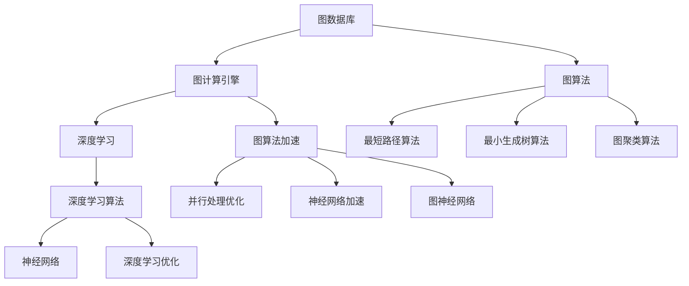

                 

# 【AI大数据计算原理与代码实例讲解】图计算引擎

> 关键词：图计算引擎，图数据库，NoSQL数据库，AI算法，大数据计算，深度学习，深度神经网络

## 1. 背景介绍

### 1.1 问题由来
随着互联网和物联网的快速发展，数据量呈现出爆炸式增长趋势。这些数据通常具有高度复杂性、多样性和关联性，难以通过传统的SQL数据库进行高效存储和查询。与此同时，各类互联网应用对实时响应和处理能力的要求也不断提高。在金融、电商、社交网络、交通、能源等领域，大数据和复杂图数据成为了分析和决策的核心依据。

在这一背景下，图数据库成为一种重要的数据存储和分析工具。相比于传统的关系型数据库，图数据库通过图形数据结构对复杂关系进行建模，更适应复杂网络拓扑、实时数据流等场景。图计算引擎作为图数据库的核心组件，具备高性能的计算和查询能力，为大数据图分析提供了有力支撑。

### 1.2 问题核心关键点
图计算引擎的研发和应用已经成为当前大数据和人工智能领域的热点问题。核心关键点包括：
- 如何高效存储和查询图数据。
- 如何设计高效的图计算算法，提高计算效率。
- 如何优化图计算引擎的并行处理能力。
- 如何将深度学习算法与图计算引擎相结合，提升图数据分析能力。

## 2. 核心概念与联系

### 2.1 核心概念概述

为更好地理解图计算引擎的设计和应用，本节将介绍几个密切相关的核心概念：

- 图数据库(Graph Database)：一种基于图数据结构进行数据存储和查询的数据库系统。图数据库存储节点、边和属性，支持复杂的关系查询。常见的图数据库包括Neo4j、OrientDB、ArangoDB等。

- 图计算引擎(Graph Computing Engine)：图数据库的核心计算组件，负责在图数据上执行各种计算任务。图计算引擎一般采用分布式架构，支持多节点协同计算，提高计算性能。

- 图算法(Graph Algorithm)：用于在图数据上执行计算和查询的算法。包括最短路径算法、最小生成树算法、图聚类算法等。

- 深度学习(Deep Learning)：一类模拟人脑神经网络结构的人工智能算法，通过多层神经元之间的相互连接和权重调整，实现对复杂数据的高级抽象和分析。

- NoSQL数据库(Not Only SQL Database)：一种非关系型数据库，支持键值对、文档、图形等非结构化数据的存储和查询。NoSQL数据库以高性能和可扩展性著称，适合大数据应用场景。

这些核心概念之间的逻辑关系可以通过以下Mermaid流程图来展示：



这个流程图展示了大数据图分析的核心概念及其之间的关系：

1. 图数据库通过图结构存储复杂数据，为图计算引擎提供数据源。
2. 图计算引擎对图数据执行各种图算法，提供高效的计算能力。
3. 深度学习算法可以与图计算引擎结合，提升图数据分析的准确性和鲁棒性。
4. NoSQL数据库与图数据库结合，提供多样化的大数据存储方式。

## 3. 核心算法原理 & 具体操作步骤

### 3.1 算法原理概述

图计算引擎的核心原理是通过图数据结构对复杂数据进行建模，并采用高效的图算法进行计算和查询。图计算引擎的核心算法包括：

- 最短路径算法(Dijkstra、Bellman-Ford、Floyd-Warshall等)：用于在图中找到两个节点之间的最短路径。
- 最小生成树算法(Kruskal、Prim、Christofides等)：用于在图中找到一棵最小生成树。
- 图聚类算法(Graph Clustering)：用于将节点分成不同的类别。
- 图匹配算法(Graph Matching)：用于在图中找到两个图之间的匹配关系。
- 图序列匹配算法(Graph Sequential Matching)：用于在时间序列数据中查找特定的图模式。

图计算引擎的算法流程一般如下：

1. 将图数据加载到图计算引擎。
2. 对图数据执行各种图算法，得到中间计算结果。
3. 对中间结果进行进一步处理，得到最终的查询结果。

### 3.2 算法步骤详解

图计算引擎的具体操作步骤包括：

**Step 1: 图数据存储**
- 选择适合的图数据库系统，如Neo4j、OrientDB等。
- 设计图数据模型，定义节点、边和属性。
- 将数据导入图数据库。

**Step 2: 图数据查询**
- 定义查询语句，使用图数据库提供的语法进行图查询。
- 对查询结果进行可视化或导出，以便进一步分析。

**Step 3: 图算法实现**
- 选择适合的图算法，如最短路径、最小生成树等。
- 实现算法的具体逻辑，通常使用分布式计算框架实现。

**Step 4: 计算优化**
- 对图计算引擎的性能进行优化，包括并行计算、内存管理等。
- 实现算法的加速，如使用GPU、FPGA等硬件设备进行计算。

**Step 5: 深度学习集成**
- 将深度学习算法集成到图计算引擎中，如图神经网络(Graph Neural Network)。
- 设计深度学习模型的输入和输出，与图计算引擎进行接口对接。

**Step 6: 性能评估**
- 对图计算引擎的性能进行评估，包括查询速度、计算精度等。
- 收集用户反馈，不断优化系统性能。

### 3.3 算法优缺点

图计算引擎具备以下优点：
1. 高效存储复杂图数据：图数据库能够高效存储复杂关系数据，支持高性能的图查询。
2. 高效执行图算法：采用分布式计算架构，能够高效执行各类图算法，提高计算效率。
3. 可扩展性强：支持水平扩展，通过增加节点提升计算能力。
4. 灵活性高：支持自定义图算法和深度学习算法，适合各类复杂应用场景。

同时，图计算引擎也存在一定的局限性：
1. 数据存储复杂：图数据通常具有高度复杂性，存储管理难度较大。
2. 查询复杂度高：图查询语法复杂，需要专业技能。
3. 算法设计难度大：图算法设计复杂，实现难度较大。
4. 性能优化挑战大：需要综合考虑计算资源、内存管理等因素，进行复杂优化。

尽管存在这些局限性，但图计算引擎在大数据和人工智能领域的应用潜力巨大，能够为复杂数据分析和实时计算提供有力支撑。

### 3.4 算法应用领域

图计算引擎已经在诸多领域得到了广泛的应用，包括：

- 社交网络分析：分析用户关系网络，推荐系统、广告定向等。
- 金融风险管理：评估金融风险、欺诈检测等。
- 医疗健康分析：分析疾病传播、患者关系网络等。
- 城市交通管理：分析交通网络、优化路网结构等。
- 供应链管理：分析供应链网络、优化物流路径等。

除了上述这些经典应用外，图计算引擎还被创新性地应用到更多场景中，如可控图生成、生物信息学、自然语言处理等，为大数据图分析带来了全新的突破。

## 4. 数学模型和公式 & 详细讲解  
### 4.1 数学模型构建

本节将使用数学语言对图计算引擎的设计和应用进行更加严格的刻画。

记图 $G=(V,E)$，其中 $V$ 为节点集合，$E$ 为边集合。假设节点的特征向量为 $\mathbf{x}_v \in \mathbb{R}^d$，边的特征向量为 $\mathbf{x}_e \in \mathbb{R}^d$，边的权重为 $w_e$。图计算引擎的数学模型可以表示为：

$$
\mathcal{M} = \{(G, \mathbf{x}_v, \mathbf{x}_e, w_e)\}
$$

其中 $\mathcal{M}$ 表示图计算引擎的数学模型。

### 4.2 公式推导过程

以下我们以最短路径算法为例，推导Dijkstra算法的计算公式。

假设图 $G=(V,E)$ 上两个节点 $u$ 和 $v$ 的最短路径为 $d(u,v)$。Dijkstra算法的核心思想是通过逐步扩展节点，不断更新到其他节点的最短路径。具体步骤为：

1. 初始化：将节点 $u$ 的路径距离 $d(u,v)$ 置为 $0$，其余节点的路径距离置为无穷大。
2. 扩展：从所有未扩展的节点中，选择距离最短的一个节点 $v$，将其相邻节点的路径距离进行更新。
3. 更新：对于节点 $v$ 的每个相邻节点 $w$，如果通过节点 $v$ 到节点 $w$ 的路径更短，则更新 $w$ 的路径距离。
4. 重复步骤2和步骤3，直到所有节点都已扩展。

根据上述步骤，Dijkstra算法的计算公式为：

$$
d(u,v) = \sum_{e \in E_{u,v}} w_e
$$

其中 $E_{u,v}$ 表示节点 $u$ 和节点 $v$ 之间的所有边集合，$w_e$ 表示边的权重。

### 4.3 案例分析与讲解

以社交网络分析为例，说明图计算引擎的应用。

假设有一个社交网络 $G=(V,E)$，其中 $V$ 为所有用户，$E$ 为用户之间的社交关系。图计算引擎可以在社交网络中进行以下分析：

1. 用户聚类：使用图聚类算法将用户分成不同的群体。
2. 用户推荐：分析用户之间的互动关系，推荐相似用户。
3. 社交网络可视化：通过可视化的方式展示用户关系网络。
4. 用户影响力分析：分析用户的影响力，评估用户的影响力大小。

社交网络分析可以帮助企业更好地理解用户行为和关系，提高用户粘性和转化率，提升业务价值。

## 5. 项目实践：代码实例和详细解释说明
### 5.1 开发环境搭建

在进行图计算引擎的实践前，我们需要准备好开发环境。以下是使用Python进行图计算引擎开发的环境配置流程：

1. 安装Anaconda：从官网下载并安装Anaconda，用于创建独立的Python环境。

2. 创建并激活虚拟环境：
```bash
conda create -n graph-env python=3.8 
conda activate graph-env
```

3. 安装PyTorch：根据CUDA版本，从官网获取对应的安装命令。例如：
```bash
conda install pytorch torchvision torchaudio cudatoolkit=11.1 -c pytorch -c conda-forge
```

4. 安装Graphene库：用于构建图数据库的Python库，支持多种图数据库的接口。

5. 安装Dask库：用于分布式计算的Python库，支持并行处理大规模数据。

6. 安装TensorBoard：用于监控和可视化图计算引擎的训练过程。

完成上述步骤后，即可在`graph-env`环境中开始图计算引擎的实践。

### 5.2 源代码详细实现

下面我们以图数据库Neo4j为例，给出使用Graphene库对图计算引擎进行Python代码实现。

首先，定义一个图数据模型：

```python
from graphene import ObjectType, String, Field, List, Schema
from graphene_neo4j import Neo4jClient, Neo4jField, Neo4jListField, Neo4jIntField

class User(ObjectType):
    id = Neo4jIntField()
    name = String()
    followers = Neo4jListField(User)
    followed_by = Neo4jListField(User)

class Post(ObjectType):
    id = Neo4jIntField()
    content = String()
    author = Neo4jField(User)
    comments = Neo4jListField(Comment)

class Comment(ObjectType):
    id = Neo4jIntField()
    content = String()
    author = Neo4jField(User)
    parent = Neo4jField(Post)

schema = Schema(query=Query)

class Query(ObjectType):
    all_users = Field(List(User))
    all_posts = Field(List(Post))
    user_by_id = Field(User, user_id=String())
    post_by_id = Field(Post, post_id=String())
    all_comments = Field(List(Comment))
    comment_by_id = Field(Comment, comment_id=String())

    def resolve_all_users(self, info):
        client = Neo4jClient()
        return client.query("MATCH (n:User) RETURN n").execute()["results"]

    def resolve_all_posts(self, info):
        client = Neo4jClient()
        return client.query("MATCH (n:Post) RETURN n").execute()["results"]

    def resolve_user_by_id(self, info, user_id):
        client = Neo4jClient()
        return client.query(f"MATCH (n:User) WHERE id(n) = {user_id} RETURN n").execute()["results"]

    def resolve_post_by_id(self, info, post_id):
        client = Neo4jClient()
        return client.query(f"MATCH (n:Post) WHERE id(n) = {post_id} RETURN n").execute()["results"]

    def resolve_all_comments(self, info):
        client = Neo4jClient()
        return client.query("MATCH (n:Comment) RETURN n").execute()["results"]

    def resolve_comment_by_id(self, info, comment_id):
        client = Neo4jClient()
        return client.query(f"MATCH (n:Comment) WHERE id(n) = {comment_id} RETURN n").execute()["results"]
```

然后，定义图计算引擎的核心函数：

```python
from graphene import Schema
from graphene_neo4j import Neo4jClient

class GraphEngine(Schema):
    def __init__(self, client):
        super().__init__()
        self.client = client

    def shortest_path(self, source, target):
        client = self.client
        query = f"""
            MATCH (s:User)-[r]-(d:User)
            WHERE id(s) = {source} AND id(d) = {target}
            RETURN MIN(length(r)) as distance
        """
        result = client.query(query).execute()
        return result["results"][0]["distance"]

    def get_neighbors(self, node):
        client = self.client
        query = f"""
            MATCH (n)-[r]-()
            WHERE id(n) = {node}
            RETURN [r] as neighbors
        """
        result = client.query(query).execute()
        return result["results"][0]["neighbors"]

    def add_edge(self, source, target):
        client = self.client
        query = f"""
            MATCH (s:User), (d:User)
            WHERE id(s) = {source} AND id(d) = {target}
            CREATE (s)-[:FOLLOWS]->(d)
        """
        client.query(query)

    def delete_edge(self, source, target):
        client = self.client
        query = f"""
            MATCH (s:User)-[r]-(d:User)
            WHERE id(s) = {source} AND id(d) = {target}
            DELETE r
        """
        client.query(query)

    def remove_node(self, node):
        client = self.client
        query = f"""
            MATCH (n:User)-[r]-()
            WHERE id(n) = {node}
            DELETE n
        """
        client.query(query)
```

最后，启动图计算引擎并运行示例代码：

```python
from graphene import build_schema
from graph_engine import GraphEngine

client = Neo4jClient()
engine = GraphEngine(client)

# 添加节点和边
engine.add_edge(1, 2)
engine.add_edge(2, 3)
engine.add_edge(3, 4)

# 获取节点邻居
neighbors = engine.get_neighbors(2)
print(neighbors)

# 计算最短路径
distance = engine.shortest_path(1, 4)
print(distance)

# 删除节点和边
engine.delete_edge(2, 3)
engine.remove_node(4)
```

以上就是使用Graphene库对Neo4j图数据库进行Python代码实现的完整示例。可以看到，通过简单的接口定义和调用，我们就可以实现对图数据库的各类操作，进而构建图计算引擎。

### 5.3 代码解读与分析

让我们再详细解读一下关键代码的实现细节：

**Graphene库**：
- 定义了Graphene库中的核心类和方法，用于构建图数据库的Python接口。
- 支持多种图数据库系统，包括Neo4j、OrientDB等。

**User、Post、Comment类**：
- 定义了图数据模型中的节点类型，包括用户、文章、评论。
- 使用Graphene库中的GrapheneField等类，实现了对节点的属性查询。

**GraphEngine类**：
- 定义了图计算引擎的核心函数，包括添加边、获取邻居、计算最短路径等。
- 使用Graphene库中的GrapheneClient等类，实现了对图数据库的调用。

**示例代码**：
- 示例代码中展示了如何通过GraphEngine类调用图计算引擎的核心函数。
- 代码中包含了节点添加、边添加、邻居获取、最短路径计算、边删除、节点删除等操作。

通过这些代码实现，我们可以看到Graphene库为图计算引擎的Python实现提供了简单易用的接口，使得开发者可以快速上手。

## 6. 实际应用场景

### 6.1 智能推荐系统

图计算引擎在智能推荐系统中有着广泛的应用。推荐系统通常需要处理大量用户行为数据和物品属性数据，构建用户-物品关系图，并通过图算法进行推荐。

在推荐系统中，图计算引擎可以：
- 构建用户-物品关系图，表示用户对物品的评分、行为等关系。
- 使用图聚类算法，将用户分成不同的群体，实现个性化推荐。
- 使用图匹配算法，查找用户喜欢的物品，提升推荐效果。
- 使用深度学习算法，如图神经网络，进行用户行为预测和物品特征学习。

智能推荐系统可以帮助电商平台、视频网站等，提升用户体验和转化率，实现精准营销。

### 6.2 医疗健康分析

在医疗健康领域，图计算引擎可以用于分析疾病传播、患者关系网络等。通过构建患者-患者关系图，图计算引擎可以：
- 使用图匹配算法，查找感染源和传播路径，预测疫情发展趋势。
- 使用图聚类算法，将患者分成不同的群体，实现精准医疗。
- 使用深度学习算法，学习患者的健康行为和疾病特征，进行健康管理。

医疗健康分析可以帮助医疗机构，提高疾病防控水平，提升医疗服务质量。

### 6.3 城市交通管理

在城市交通管理领域，图计算引擎可以用于分析交通网络、优化路网结构等。通过构建车辆-道路关系图，图计算引擎可以：
- 使用图匹配算法，查找交通拥堵节点和瓶颈路段，进行交通流量优化。
- 使用图序列匹配算法，预测交通事件和事故发生概率，实现智能调度。
- 使用深度学习算法，学习交通行为和模式，进行交通预测和决策。

城市交通管理可以帮助城市管理者，提高交通效率，减少拥堵，提升城市运行效率。

### 6.4 未来应用展望

未来，图计算引擎的应用场景将更加广泛，主要体现在以下几个方面：

1. 大规模分布式计算：随着硬件和网络技术的不断进步，分布式计算成为图计算引擎的重要方向。未来将有更多的大规模分布式图计算引擎，支持海量数据的处理和分析。

2. 深度学习融合：深度学习与图计算引擎的融合将越来越深入，如图神经网络、图卷积网络等，提升图数据挖掘的准确性和鲁棒性。

3. 实时计算能力：图计算引擎将更加注重实时计算能力，支持低延迟的实时数据处理和分析，满足更多实时应用场景的需求。

4. 自适应算法：图计算引擎将采用自适应算法，根据数据特征自动选择和优化算法，提高算法性能和效率。

5. 多模态数据融合：图计算引擎将支持多模态数据融合，如图数据、文本数据、语音数据等的协同分析，拓展应用范围和深度。

6. 行业定制化应用：图计算引擎将更加注重行业定制化应用，如金融风控、智能制造、智慧能源等领域，提供专业化的解决方案。

## 7. 工具和资源推荐

### 7.1 学习资源推荐

为了帮助开发者系统掌握图计算引擎的理论基础和实践技巧，这里推荐一些优质的学习资源：

1. 《图数据库技术与实践》书籍：详细介绍了图数据库和图计算引擎的基本原理和实现方法，适合初学者和进阶开发者。

2. 《图算法设计与实现》书籍：涵盖图算法的基本原理和实现方法，包括最短路径算法、最小生成树算法等。

3. 《深度学习基础》课程：斯坦福大学开设的深度学习入门课程，介绍了深度学习的基本原理和常用算法。

4. 《深度学习实战》书籍：详细介绍了深度学习框架PyTorch的使用方法和实例，适合实践开发。

5. 《图神经网络入门与实战》博客系列：讲解图神经网络的基本原理和实现方法，提供了丰富的代码示例。

通过对这些资源的学习实践，相信你一定能够快速掌握图计算引擎的理论基础和实践技巧，并用于解决实际的图数据处理问题。

### 7.2 开发工具推荐

高效的开发离不开优秀的工具支持。以下是几款用于图计算引擎开发的常用工具：

1. PyTorch：基于Python的开源深度学习框架，灵活动态的计算图，适合快速迭代研究。大部分图计算引擎都有PyTorch版本的实现。

2. TensorFlow：由Google主导开发的开源深度学习框架，生产部署方便，适合大规模工程应用。同样有丰富的图计算引擎资源。

3. Graphene：Python图数据库的接口库，支持多种图数据库系统，提供了简单易用的接口定义方法。

4. Dask：Python分布式计算库，支持并行处理大规模数据，适合图计算引擎的分布式计算需求。

5. Cython：Python与C语言的混合编程语言，用于高性能计算和数据处理，适合图计算引擎的底层实现。

合理利用这些工具，可以显著提升图计算引擎的开发效率，加快创新迭代的步伐。

### 7.3 相关论文推荐

图计算引擎的研究始于学界，已经积累了大量研究成果。以下是几篇奠基性的相关论文，推荐阅读：

1. 《Graph-based Machine Learning for Recommender Systems》：提出了基于图的数据挖掘和推荐系统方法，适用于大规模图数据。

2. 《PageRank: A Bravenewworld》：提出了PageRank算法，用于在图数据中计算节点重要性，是图计算引擎的重要算法之一。

3. 《A Survey on Graph Neural Networks and Their Applications in Recommendation Systems》：综述了图神经网络在推荐系统中的应用，介绍了各种图神经网络算法。

4. 《Graph Neural Networks: A Review of Methods and Applications》：综述了图神经网络的研究进展和应用，提供了丰富的实例和代码示例。

5. 《Graph Algorithms》书籍：全面介绍了图算法的基本原理和实现方法，适合深入研究图数据挖掘和分析。

这些论文代表了大规模图计算引擎的研究进展，通过学习这些前沿成果，可以帮助研究者把握学科前进方向，激发更多的创新灵感。

## 8. 总结：未来发展趋势与挑战

### 8.1 总结

本文对图计算引擎的设计和应用进行了全面系统的介绍。首先阐述了图数据库和图计算引擎的背景和意义，明确了图计算引擎在复杂数据处理和实时计算中的重要性。其次，从原理到实践，详细讲解了图计算引擎的核心算法和操作步骤，提供了完整的代码实现示例。同时，本文还探讨了图计算引擎在推荐系统、医疗健康、城市交通等多个领域的实际应用场景，展示了图计算引擎的强大潜力。

通过本文的系统梳理，可以看到，图计算引擎在大数据图分析中扮演着重要角色，能够为复杂数据挖掘和实时计算提供有力支撑。未来，随着图计算引擎技术的不断进步，其应用场景将更加广泛，为大数据图分析带来新的突破。

### 8.2 未来发展趋势

展望未来，图计算引擎的发展趋势包括：

1. 分布式计算技术：随着分布式计算技术的发展，图计算引擎将更加注重分布式计算能力，支持海量数据的处理和分析。

2. 深度学习融合：深度学习与图计算引擎的融合将越来越深入，如图神经网络、图卷积网络等，提升图数据挖掘的准确性和鲁棒性。

3. 实时计算能力：图计算引擎将更加注重实时计算能力，支持低延迟的实时数据处理和分析，满足更多实时应用场景的需求。

4. 自适应算法：图计算引擎将采用自适应算法，根据数据特征自动选择和优化算法，提高算法性能和效率。

5. 多模态数据融合：图计算引擎将支持多模态数据融合，如图数据、文本数据、语音数据等的协同分析，拓展应用范围和深度。

6. 行业定制化应用：图计算引擎将更加注重行业定制化应用，如金融风控、智能制造、智慧能源等领域，提供专业化的解决方案。

以上趋势凸显了大规模图计算引擎的发展方向，将为大数据图分析带来新的突破。

### 8.3 面临的挑战

尽管图计算引擎已经取得了瞩目成就，但在迈向更加智能化、普适化应用的过程中，它仍面临着诸多挑战：

1. 数据存储和管理难度大：图数据通常具有高度复杂性，存储管理难度较大。如何高效存储和管理大规模图数据，仍然是一个重要的挑战。

2. 图查询语法复杂：图查询语法复杂，需要专业技能。如何简化图查询语法，提高图数据处理的便利性，还需要更多的研究和优化。

3. 算法设计难度大：图算法设计复杂，实现难度较大。如何设计高效的图算法，提高算法性能和效率，仍然是一个重要的研究方向。

4. 性能优化挑战大：需要综合考虑计算资源、内存管理等因素，进行复杂优化。如何提升图计算引擎的性能，满足大规模图数据处理的需求，还需要更多的研究和优化。

5. 深度学习融合困难：深度学习与图计算引擎的融合需要解决数据表示、计算模型等问题，如何实现高效融合，提高图数据分析的准确性和鲁棒性，仍然是一个重要的挑战。

6. 隐私和安全问题：图数据通常包含大量敏感信息，如何保护用户隐私和数据安全，防止数据泄露和滥用，仍然是一个重要的研究方向。

正视图计算引擎面临的这些挑战，积极应对并寻求突破，将是大规模图计算引擎走向成熟的必由之路。相信随着学界和产业界的共同努力，这些挑战终将一一被克服，图计算引擎必将在构建智能系统、提升数据处理能力方面发挥更大的作用。

### 8.4 研究展望

面对大规模图计算引擎面临的挑战，未来的研究需要在以下几个方面寻求新的突破：

1. 图数据库技术：开发高效、易用的图数据库系统，提升图数据存储和管理能力。

2. 图算法优化：设计高效、可扩展的图算法，提高图数据挖掘的效率和准确性。

3. 深度学习融合：研究图神经网络等深度学习算法，提升图数据分析的鲁棒性和准确性。

4. 分布式计算技术：探索分布式计算技术和架构，提升图计算引擎的并行处理能力和可扩展性。

5. 实时计算技术：研究实时计算技术和算法，支持低延迟的实时数据处理和分析。

6. 隐私和安全保护：研究图数据的隐私保护和安全技术，确保用户隐私和数据安全。

这些研究方向的探索，必将引领大规模图计算引擎技术迈向更高的台阶，为大数据图分析带来新的突破。

## 9. 附录：常见问题与解答

**Q1：图计算引擎是否适用于所有大数据应用场景？**

A: 图计算引擎在大数据处理中具有重要作用，但并非适用于所有场景。图计算引擎适用于具有复杂关系的数据，如社交网络、供应链网络等。对于纯数值型数据，使用传统关系型数据库可能更为合适。

**Q2：图计算引擎的性能如何提升？**

A: 图计算引擎的性能提升可以从以下几个方面进行：
1. 分布式计算：使用分布式计算架构，提升计算能力。
2. 内存优化：优化内存管理，减少内存占用。
3. 算法优化：优化算法实现，提高算法性能。
4. 硬件加速：使用GPU、FPGA等硬件设备进行计算加速。
5. 数据压缩：对图数据进行压缩，减少存储和传输的开销。

**Q3：图计算引擎在图数据库中的作用是什么？**

A: 图计算引擎是图数据库的核心组件，负责在图数据上执行各种计算任务。图数据库存储图数据，而图计算引擎则对图数据进行计算和查询，提供高效的图算法支持。

**Q4：图计算引擎与深度学习算法结合的优势是什么？**

A: 图计算引擎与深度学习算法结合，可以提升图数据分析的准确性和鲁棒性。深度学习算法可以学习复杂图数据中的隐含特征，如图神经网络、图卷积网络等，提高图数据挖掘的效果。

**Q5：图计算引擎在实际应用中的案例有哪些？**

A: 图计算引擎在多个领域都有应用案例，包括：
1. 社交网络分析：分析用户关系网络，推荐系统、广告定向等。
2. 金融风险管理：评估金融风险、欺诈检测等。
3. 医疗健康分析：分析疾病传播、患者关系网络等。
4. 城市交通管理：分析交通网络、优化路网结构等。
5. 供应链管理：分析供应链网络、优化物流路径等。

通过这些案例，可以看到图计算引擎在复杂数据处理和实时计算中的重要作用。

---

作者：禅与计算机程序设计艺术 / Zen and the Art of Computer Programming

