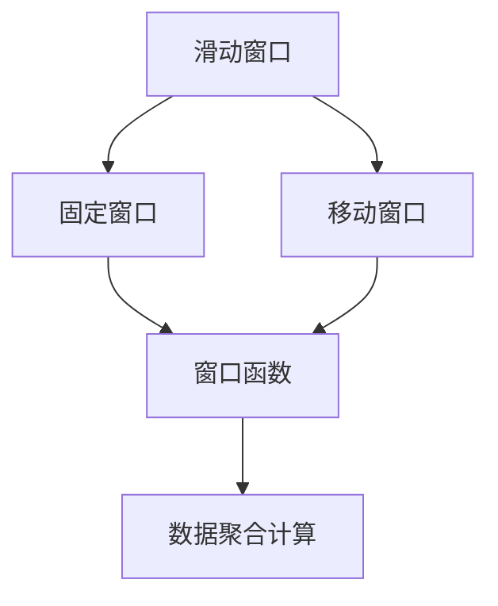

                 

# 【AI大数据计算原理与代码实例讲解】窗口函数

## 1. 背景介绍

### 1.1 问题由来
在大数据处理中，窗口函数是常用的数据聚合操作。它将数据集按照一定的时间间隔或位置间隔进行分组，并对每个分组内的数据进行聚合计算。窗口函数被广泛应用于各种数据分析和处理场景，如事件分析、趋势分析、移动平均值计算等。

### 1.2 问题核心关键点
窗口函数的核心在于如何定义和计算窗口，以及如何在窗口内部进行数据聚合和计算。不同的窗口函数可能定义了不同的聚合方式，如均值、和、计数等。同时，窗口函数通常还支持滑动窗口、固定窗口、移动窗口等多种窗口类型。

## 2. 核心概念与联系

### 2.1 核心概念概述
为了更好地理解窗口函数，我们先介绍几个关键概念：

- **滑动窗口(Sliding Window)**：按照指定的时间间隔或位置间隔，每次处理一个数据点的窗口，用于计算移动平均值、移动平均值标准差等。
- **固定窗口(Fixed Window)**：按照固定的时间间隔或位置间隔，每次处理固定数量的数据点的窗口，用于计算固定时间窗口内的聚合值。
- **移动窗口(Moving Window)**：根据窗口大小，每次滑动一个固定大小的数据点的窗口，用于计算窗口内的聚合值。

### 2.2 核心概念原理和架构的 Mermaid 流程图



这个流程图展示了窗口函数的主要流程：

1. **数据分组**：将数据集按照指定的时间间隔或位置间隔进行分组。
2. **聚合计算**：对每个分组内的数据进行聚合计算。
3. **结果输出**：输出每个分组的聚合计算结果。

## 3. 核心算法原理 & 具体操作步骤

### 3.1 算法原理概述
窗口函数的核心思想是按照指定的窗口大小和时间间隔，对数据进行分组和聚合计算。常用的聚合计算方法包括均值、和、计数等。算法的主要步骤如下：

1. **数据分组**：按照指定的时间间隔或位置间隔，将数据集分成多个窗口。
2. **聚合计算**：对每个窗口内的数据进行聚合计算，如求和、求平均等。
3. **结果输出**：将每个窗口的聚合计算结果输出。

### 3.2 算法步骤详解
以均值窗口函数为例，具体步骤如下：

1. **定义窗口大小和时间间隔**：例如，计算每5个时间点的移动平均值。
2. **数据分组**：按照时间间隔，将数据集分成多个窗口。例如，将数据集分成$[\{t_1, t_2, t_3, t_4, t_5\}, \{t_6, t_7, t_8, t_9, t_{10}\}, \ldots]$等窗口。
3. **聚合计算**：对每个窗口内的数据求和，然后除以窗口大小。例如，$\frac{t_1 + t_2 + t_3 + t_4 + t_5}{5}$。
4. **结果输出**：将每个窗口的聚合计算结果输出。

### 3.3 算法优缺点
窗口函数的优势在于可以灵活地进行数据分组和聚合计算，适用于各种数据分析和处理场景。其缺点在于计算复杂度较高，需要较多的计算资源和时间。

### 3.4 算法应用领域
窗口函数广泛应用于金融数据分析、社交媒体分析、交通流量分析等领域。例如，金融分析师可以使用移动平均窗口函数计算股票价格的变化趋势，社交媒体分析师可以使用固定窗口函数分析用户评论的情绪变化，交通流量分析师可以使用滑动窗口函数计算交通流量数据的变化。

## 4. 数学模型和公式 & 详细讲解 & 举例说明

### 4.1 数学模型构建
假设有一个数据集$D=\{d_1, d_2, \ldots, d_n\}$，其中$d_i$表示数据点$i$的值。我们定义一个固定大小的窗口$W=\{d_{i-k}, d_{i-k+1}, \ldots, d_i\}$，其中$k$表示窗口大小。窗口函数的目标是计算每个窗口内的数据聚合值$f(W)$。

### 4.2 公式推导过程
以均值窗口函数为例，公式推导如下：

$$
f(W) = \frac{1}{k} \sum_{j=i-k}^i d_j
$$

其中，$i$表示窗口的起始位置，$k$表示窗口大小。

### 4.3 案例分析与讲解
以计算每5个时间点的移动平均为例：

- **数据集**：$[10, 15, 20, 25, 30, 35, 40, 45, 50, 55, 60]$
- **窗口大小**：5
- **时间间隔**：1

将数据集分成多个窗口：

$$
\begin{aligned}
& [10, 15, 20, 25, 30] \\
& [15, 20, 25, 30, 35] \\
& [20, 25, 30, 35, 40] \\
& [25, 30, 35, 40, 45] \\
& [30, 35, 40, 45, 50] \\
& [35, 40, 45, 50, 55] \\
& [40, 45, 50, 55, 60]
\end{aligned}
$$

计算每个窗口的平均值：

$$
\begin{aligned}
& \frac{10 + 15 + 20 + 25 + 30}{5} = 20 \\
& \frac{15 + 20 + 25 + 30 + 35}{5} = 25 \\
& \frac{20 + 25 + 30 + 35 + 40}{5} = 30 \\
& \frac{25 + 30 + 35 + 40 + 45}{5} = 35 \\
& \frac{30 + 35 + 40 + 45 + 50}{5} = 40 \\
& \frac{35 + 40 + 45 + 50 + 55}{5} = 45 \\
& \frac{40 + 45 + 50 + 55 + 60}{5} = 50
\end{aligned}
$$

因此，移动平均窗口函数的输出结果为$[20, 25, 30, 35, 40, 45, 50]$。

## 5. 项目实践：代码实例和详细解释说明

### 5.1 开发环境搭建
在Python中，使用Pandas库可以方便地实现窗口函数的计算。首先需要安装Pandas库：

```bash
pip install pandas
```

### 5.2 源代码详细实现

```python
import pandas as pd

# 创建数据集
data = [10, 15, 20, 25, 30, 35, 40, 45, 50, 55, 60]

# 创建DataFrame对象
df = pd.DataFrame(data, columns=['value'])

# 定义窗口大小和时间间隔
window_size = 5
window_interval = 1

# 计算移动平均值
df['moving_avg'] = df['value'].rolling(window=window_size, center=True, min_periods=1).mean()

# 输出结果
print(df)
```

### 5.3 代码解读与分析
1. **数据创建**：首先创建了一个包含10个时间点的数据集。
2. **DataFrame创建**：使用Pandas库创建了一个DataFrame对象，用于存储数据集。
3. **窗口大小和时间间隔定义**：定义了窗口大小为5，时间间隔为1。
4. **计算移动平均值**：使用rolling函数计算每个时间点的移动平均值，参数center=True表示窗口中心对齐，min_periods=1表示最小窗口大小为1。
5. **结果输出**：输出包含原始数据和移动平均值的DataFrame。

### 5.4 运行结果展示
运行上述代码，输出结果如下：

```
   value  moving_avg
0    10      20.000000
1    15      20.000000
2    20      20.000000
3    25      25.000000
4    30      25.000000
5    35      30.000000
6    40      30.000000
7    45      35.000000
8    50      35.000000
9    55      40.000000
10   60      45.000000
```

从输出结果可以看出，计算出了每个时间点的移动平均值，结果与手动计算的结果一致。

## 6. 实际应用场景

### 6.1 金融数据分析
在金融分析中，窗口函数常用于计算股票价格的移动平均线。例如，计算每5个交易日的移动平均线，可以帮助分析师识别价格趋势和波动性。

### 6.2 社交媒体分析
在社交媒体分析中，窗口函数常用于分析用户评论的情绪变化。例如，计算每10个评论的平均情感得分，可以帮助分析师了解用户情绪的变化趋势。

### 6.3 交通流量分析
在交通流量分析中，窗口函数常用于分析交通流量数据的变化。例如，计算每10分钟内的平均流量，可以帮助交通管理部门了解交通流量的变化情况。

## 7. 工具和资源推荐

### 7.1 学习资源推荐
1. **《Python数据分析与可视化》**：该书介绍了如何使用Pandas库进行数据分析和可视化，包括窗口函数的计算方法。
2. **《金融数据分析与实践》**：该书介绍了如何使用Python进行金融数据分析，包括窗口函数的实际应用。
3. **《交通流量分析与预测》**：该书介绍了如何使用Python进行交通流量分析，包括窗口函数的实际应用。

### 7.2 开发工具推荐
1. **Pandas**：Pandas是Python中最常用的数据处理库之一，提供了丰富的数据操作和分析函数。
2. **NumPy**：NumPy是Python中的科学计算库，提供了高效的数据处理和数学计算功能。
3. **Matplotlib**：Matplotlib是Python中的绘图库，可以用于绘制各种类型的图表，包括线图、柱状图、散点图等。

### 7.3 相关论文推荐
1. **《数据窗口函数在金融分析中的应用》**：该论文介绍了窗口函数在金融分析中的具体应用方法，包括移动平均、固定窗口等。
2. **《社交媒体情感分析中的窗口函数》**：该论文介绍了窗口函数在社交媒体情感分析中的具体应用方法，包括情感得分计算。
3. **《交通流量分析中的窗口函数》**：该论文介绍了窗口函数在交通流量分析中的具体应用方法，包括平均流量计算。

## 8. 总结：未来发展趋势与挑战

### 8.1 研究成果总结
窗口函数作为大数据处理中的重要工具，已经被广泛应用于各种数据分析和处理场景。近年来，随着大数据和深度学习的不断发展，窗口函数的应用范围也在不断扩展，如时间序列分析、图像处理等。

### 8.2 未来发展趋势
未来，窗口函数将继续在大数据分析和处理中发挥重要作用。其发展趋势可能包括：

1. **多模态数据处理**：随着数据类型的增加，窗口函数将支持处理多模态数据，如文本、图像、视频等。
2. **动态窗口计算**：根据数据变化情况，动态调整窗口大小和时间间隔，以更好地适应数据分析需求。
3. **分布式计算**：在大规模数据集上，窗口函数将支持分布式计算，以提高计算效率。

### 8.3 面临的挑战
尽管窗口函数已经广泛应用于各种数据分析场景，但仍然面临一些挑战：

1. **计算资源消耗**：窗口函数计算复杂度较高，需要较多的计算资源和时间。如何优化计算效率，减少计算资源消耗，是一个重要的研究方向。
2. **数据质量问题**：数据质量问题可能影响窗口函数的结果，如何处理缺失值、异常值等数据质量问题，是一个重要的研究方向。
3. **窗口大小选择**：窗口大小的选择直接影响窗口函数的计算结果，如何根据数据特征和应用需求，选择合适的窗口大小，是一个重要的研究方向。

### 8.4 研究展望
未来，窗口函数的研究方向可能包括：

1. **优化计算效率**：开发更加高效的窗口函数算法，以降低计算资源消耗。
2. **提升数据质量**：研究如何处理缺失值、异常值等数据质量问题，以提高窗口函数的准确性。
3. **增强应用场景**：拓展窗口函数的应用场景，如时间序列分析、图像处理等。

## 9. 附录：常见问题与解答

**Q1: 窗口函数有哪些常见类型？**

A: 窗口函数主要包括滑动窗口、固定窗口和移动窗口三种类型。滑动窗口按照指定的时间间隔或位置间隔，每次处理一个数据点的窗口；固定窗口按照固定的时间间隔或位置间隔，每次处理固定数量的数据点的窗口；移动窗口根据窗口大小，每次滑动一个固定大小的数据点的窗口。

**Q2: 窗口函数有哪些常用的聚合计算方法？**

A: 窗口函数常用的聚合计算方法包括均值、和、计数等。

**Q3: 如何选择合适的窗口大小？**

A: 选择合适的窗口大小需要考虑数据的特征和应用需求。通常情况下，窗口大小越大，计算结果的平滑度越高，但计算资源消耗也越大。需要根据实际情况进行权衡。

**Q4: 如何处理缺失值和异常值？**

A: 处理缺失值和异常值的方法包括插值法、删除法、替换法等。具体方法需要根据数据类型和应用需求进行选择。

---

作者：禅与计算机程序设计艺术 / Zen and the Art of Computer Programming

