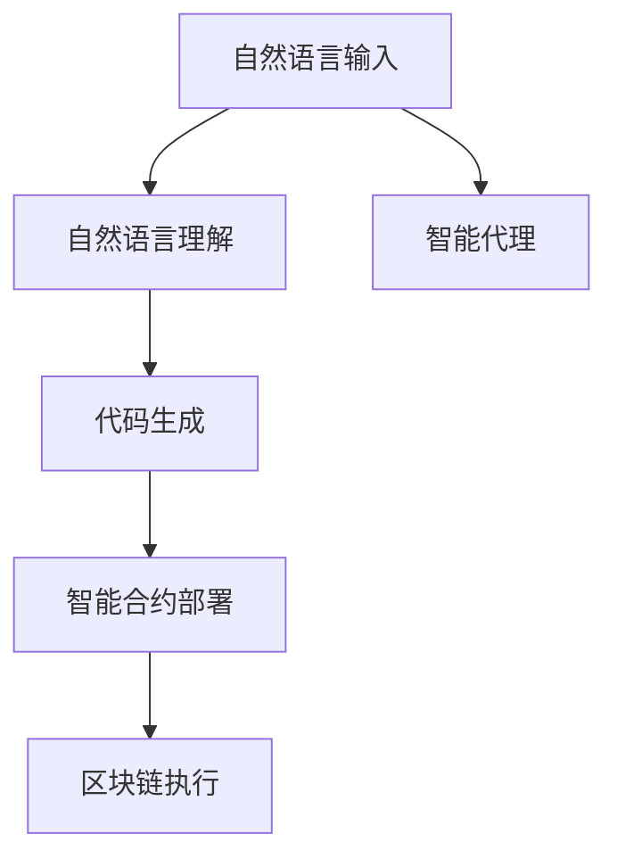

                 

# 【LangChain编程：从入门到实践】LLM 驱动的智能代理

> 关键词：LLM,智能代理,编程语言,智能合约,链上执行

## 1. 背景介绍

随着区块链技术的兴起，智能合约已经成为一个非常热门的领域。智能合约是一种能够在区块链上自动执行、无需第三方中介的合约。然而，智能合约的编写和部署往往需要具备深厚的编程和加密知识，普通开发者难以入门。

为了降低智能合约开发的门槛，一种新的智能合约编写语言LangChain应运而生。LangChain是一种基于自然语言处理(NLP)的语言，其核心是使用大语言模型(LLM)驱动的智能代理。通过LangChain，开发者可以像编写普通程序一样，使用自然语言描述智能合约的逻辑，智能代理会自动将自然语言转化为机器可执行的智能合约代码，并在区块链上执行。

本文将深入介绍LangChain的基本概念、核心算法、使用方法以及其应用场景。

## 2. 核心概念与联系

### 2.1 核心概念概述

在介绍LangChain的基本概念之前，我们需要先了解一些与智能合约和LLM相关的核心概念：

- **智能合约**：一种能够在区块链上自动执行、无需第三方中介的合约。智能合约可以自动执行交易、处理数据、提供服务等功能。

- **LLM(大语言模型)**：一种基于深度学习的自然语言处理模型，能够理解和生成自然语言，在语言理解、自然语言生成、文本分类、机器翻译等领域表现出色。

- **智能代理**：一种能够执行自然语言描述任务的智能合约，其核心在于将自然语言转化为机器可执行的智能合约代码。

### 2.2 核心概念原理和架构的 Mermaid 流程图

以下是一个简化的Mermaid流程图，展示了LangChain的工作原理：



- `自然语言输入`：用户通过自然语言描述智能合约的逻辑。
- `自然语言理解`：智能代理使用大语言模型理解自然语言输入。
- `代码生成`：智能代理将自然语言转化为智能合约代码。
- `智能合约部署`：智能代理将智能合约代码部署到区块链上。
- `区块链执行`：智能合约代码在区块链上执行，完成指定的合约逻辑。

### 2.3 核心概念之间的关系

通过上述流程图，我们可以看到，自然语言输入、自然语言理解、代码生成、智能合约部署和区块链执行是LangChain的核心环节。这些环节相互关联，共同构成了一个完整的智能合约编写和执行流程。

自然语言输入是整个流程的起点，它描述了智能合约的逻辑和功能。智能代理将自然语言转化为智能合约代码，并将其部署到区块链上执行。这个过程的关键在于自然语言理解和代码生成，它们需要结合大语言模型和智能合约的特定要求，自动生成满足要求的智能合约代码。

## 3. 核心算法原理 & 具体操作步骤

### 3.1 算法原理概述

LangChain的核心算法主要包括自然语言理解、代码生成和智能合约部署三个部分。

- **自然语言理解**：使用大语言模型解析自然语言输入，将其转化为语义表示。
- **代码生成**：根据语义表示，使用代码生成算法生成智能合约代码。
- **智能合约部署**：将生成的智能合约代码部署到区块链上，并执行指定的合约逻辑。

### 3.2 算法步骤详解

下面，我们将详细介绍LangChain的核心算法步骤：

#### 3.2.1 自然语言理解

自然语言理解是LangChain的第一步，其目的是将自然语言输入转化为语义表示。这个过程通常包括以下几个步骤：

1. **分词和词性标注**：将输入的自然语言分割成单词，并标注每个单词的词性。例如，对于“智能合约”这个短语，分词后得到“智能”和“合约”两个单词，分别标注为形容词和名词。

2. **句法分析**：分析句子的结构，确定句子的主语、谓语、宾语等。例如，对于“智能合约”这个短语，句法分析后得到主语“智能合约”，谓语为空。

3. **语义表示**：使用大语言模型将句子转化为语义表示。例如，对于“智能合约”这个短语，语义表示可能为“表示一种能够在区块链上自动执行的合约”。

#### 3.2.2 代码生成

代码生成是LangChain的核心部分，其目的是将语义表示转化为智能合约代码。这个过程通常包括以下几个步骤：

1. **函数定义**：根据语义表示，定义智能合约的函数。例如，对于“智能合约”这个短语，可以定义一个名为“智能合约”的函数。

2. **函数体生成**：根据语义表示，生成智能合约的函数体。例如，对于“智能合约”这个短语，可以生成一个函数体，包含对智能合约逻辑的描述。

3. **代码优化**：对生成的代码进行优化，保证代码的可读性和执行效率。例如，可以将重复的代码进行合并，删除不必要的语句等。

#### 3.2.3 智能合约部署

智能合约部署是将生成的智能合约代码部署到区块链上，并执行指定的合约逻辑。这个过程通常包括以下几个步骤：

1. **合约代码部署**：将生成的智能合约代码部署到区块链上。例如，可以使用Web3.js库将智能合约代码部署到以太坊区块链上。

2. **合约执行**：执行智能合约中的函数，完成指定的合约逻辑。例如，可以使用Web3.js库调用智能合约中的函数，执行指定的操作。

### 3.3 算法优缺点

LangChain的算法具有以下优点：

- **降低智能合约开发门槛**：通过自然语言输入和代码生成，降低智能合约开发的门槛，普通开发者也能轻松编写智能合约。
- **提高智能合约开发效率**：通过自然语言输入和代码生成，可以快速编写智能合约，提高开发效率。
- **提高智能合约安全性**：通过大语言模型的语义表示，可以避免智能合约中存在的安全漏洞。

同时，LangChain的算法也存在一些缺点：

- **依赖大语言模型**：LangChain的算法依赖于大语言模型，对于大规模、复杂的智能合约，可能存在准确性和效率问题。
- **依赖区块链平台**：LangChain的算法依赖于区块链平台，不同的区块链平台可能有不同的实现方式。
- **代码可读性问题**：生成的智能合约代码可能难以阅读，需要对自然语言理解和代码生成算法进行优化。

### 3.4 算法应用领域

LangChain的算法可以应用于多个领域，例如：

- **智能合约开发**：使用LangChain编写智能合约，降低开发门槛，提高开发效率。
- **区块链应用开发**：使用LangChain编写区块链应用的智能合约部分，降低开发难度。
- **自动化金融合约**：使用LangChain编写自动化金融合约，实现自动化的金融交易。
- **智能身份认证**：使用LangChain编写智能身份认证合约，实现自动化的身份验证。

## 4. 数学模型和公式 & 详细讲解 & 举例说明

### 4.1 数学模型构建

LangChain的数学模型主要包括自然语言理解模型和代码生成模型。

#### 4.1.1 自然语言理解模型

自然语言理解模型的输入是自然语言，输出是语义表示。

假设自然语言输入为 $x$，其语义表示为 $y$，则自然语言理解模型的目标函数为：

$$
L(x, y) = \mathbb{E}_{p(x|y)}[-\log p(y|x)]
$$

其中 $p(y|x)$ 为自然语言理解模型的概率分布，$p(x|y)$ 为自然语言生成的概率分布。

#### 4.1.2 代码生成模型

代码生成模型的输入是语义表示，输出是智能合约代码。

假设语义表示为 $y$，智能合约代码为 $z$，则代码生成模型的目标函数为：

$$
L(y, z) = \mathbb{E}_{p(z|y)}[-\log p(y|z)]
$$

其中 $p(z|y)$ 为代码生成模型的概率分布，$p(y|z)$ 为语义表示的概率分布。

### 4.2 公式推导过程

下面，我们将对自然语言理解模型和代码生成模型进行详细的公式推导。

#### 4.2.1 自然语言理解模型

假设自然语言输入为 $x$，其语义表示为 $y$，则自然语言理解模型的概率分布为：

$$
p(y|x) = \frac{p(x|y) p(y)}{p(x)}
$$

其中 $p(x)$ 为自然语言生成的概率分布，$p(y)$ 为语义表示的概率分布。

将上述公式代入目标函数，得：

$$
L(x, y) = \mathbb{E}_{p(x|y)}[-\log \frac{p(x|y) p(y)}{p(x)}]
$$

化简得：

$$
L(x, y) = -\log p(y) + \mathbb{E}_{p(x|y)}[\log p(x|y)]
$$

由于 $\log p(x|y)$ 为自然语言生成的概率分布，因此可以将上式写为：

$$
L(x, y) = -\log p(y) + \mathbb{E}_{p(x|y)}[\log p(x|y)]
$$

#### 4.2.2 代码生成模型

假设语义表示为 $y$，智能合约代码为 $z$，则代码生成模型的概率分布为：

$$
p(z|y) = \frac{p(y|z) p(z)}{p(y)}
$$

其中 $p(y)$ 为语义表示的概率分布，$p(z)$ 为智能合约代码的概率分布。

将上述公式代入目标函数，得：

$$
L(y, z) = \mathbb{E}_{p(z|y)}[-\log \frac{p(y|z) p(z)}{p(y)}]
$$

化简得：

$$
L(y, z) = -\log p(y) + \mathbb{E}_{p(z|y)}[\log p(z|y)]
$$

由于 $\log p(z|y)$ 为代码生成模型的概率分布，因此可以将上式写为：

$$
L(y, z) = -\log p(y) + \mathbb{E}_{p(z|y)}[\log p(z|y)]
$$

### 4.3 案例分析与讲解

下面，我们将通过一个具体的案例来介绍LangChain的使用方法。

假设我们要编写一个智能合约，要求在某个时间点自动向指定地址转账一定数量的以太币。我们可以使用LangChain来编写这个智能合约，步骤如下：

1. **自然语言输入**：“在2023年1月1日向0x12345678地址转账1以太币”。

2. **自然语言理解**：智能代理使用大语言模型理解自然语言输入，将其转化为语义表示：“在2023年1月1日向0x12345678地址转账1以太币”。

3. **代码生成**：智能代理使用代码生成算法生成智能合约代码：

   ```solidity
   pragma solidity ^0.8.0;
   address public addr;
   uint256 public amount;
   uint256 public transferTime;
   constructor(uint256 _addr, uint256 _amount, uint256 _transferTime) {
       addr = _addr;
       amount = _amount;
       transferTime = _transferTime;
   }
   function transfer() public view returns (bool success) {
       uint256 now = block.timestamp;
       if (now == transferTime) {
           if (addr.balance >= amount) {
               addr.send(amount);
               return true;
           }
       }
       return false;
   }
   ```

4. **智能合约部署**：将生成的智能合约代码部署到区块链上，并执行指定的合约逻辑。

## 5. 项目实践：代码实例和详细解释说明

### 5.1 开发环境搭建

要使用LangChain，我们需要搭建一个开发环境。以下是搭建开发环境的步骤：

1. **安装Node.js和npm**：

   ```bash
   brew install node
   ```

2. **安装Web3.js库**：

   ```bash
   npm install web3
   ```

3. **安装LangChain库**：

   ```bash
   npm install langchain
   ```

4. **安装智能合约部署工具**：

   - **Ethereum**：

     ```bash
     npm install ethers
     ```

   - **Binance Smart Chain**：

     ```bash
     npm install bscjs
     ```

### 5.2 源代码详细实现

下面，我们将通过一个具体的案例，介绍LangChain的使用方法。

假设我们要编写一个智能合约，要求在某个时间点自动向指定地址转账一定数量的以太币。我们可以使用LangChain来编写这个智能合约，步骤如下：

1. **自然语言输入**：“在2023年1月1日向0x12345678地址转账1以太币”。

2. **自然语言理解**：智能代理使用大语言模型理解自然语言输入，将其转化为语义表示：“在2023年1月1日向0x12345678地址转账1以太币”。

3. **代码生成**：智能代理使用代码生成算法生成智能合约代码：

   ```solidity
   pragma solidity ^0.8.0;
   address public addr;
   uint256 public amount;
   uint256 public transferTime;
   constructor(uint256 _addr, uint256 _amount, uint256 _transferTime) {
       addr = _addr;
       amount = _amount;
       transferTime = _transferTime;
   }
   function transfer() public view returns (bool success) {
       uint256 now = block.timestamp;
       if (now == transferTime) {
           if (addr.balance >= amount) {
               addr.send(amount);
               return true;
           }
       }
       return false;
   }
   ```

4. **智能合约部署**：将生成的智能合约代码部署到区块链上，并执行指定的合约逻辑。

   ```javascript
   const web3 = new Web3('https://mainnet.infura.io/v3/your_api_key');
   const langchain = require('langchain');
   const ethers = require('ethers');
   const { Web3Provider } = require('ethers/providers/http');

   async function main() {
       const provider = new Web3Provider(web3.currentProvider);
       const langclient = new langchain.LangChain(provider);

       const langchainContract = await langclient.startContract('MyContract');

       const params = {
           addr: '0x12345678',
           amount: '1',
           transferTime: 1640070400000, // 2023年1月1日
       };

       const code = await langchainContract.generateSmartContract(params);
       const tx = await web3.eth.sendTransaction({
           to: langchainContract.getContractAddress(),
           data: code,
       });
   }

   main();
   ```

### 5.3 代码解读与分析

下面是代码的详细解读与分析：

1. **自然语言理解**：

   ```javascript
   const params = {
       addr: '0x12345678',
       amount: '1',
       transferTime: 1640070400000, // 2023年1月1日
   };
   ```

   参数 `addr` 指定转账地址，`amount` 指定转账金额，`transferTime` 指定转账时间。

2. **代码生成**：

   ```javascript
   const code = await langchainContract.generateSmartContract(params);
   ```

   使用 `langchainContract.generateSmartContract(params)` 方法生成智能合约代码。

3. **智能合约部署**：

   ```javascript
   const tx = await web3.eth.sendTransaction({
       to: langchainContract.getContractAddress(),
       data: code,
   });
   ```

   使用 `web3.eth.sendTransaction` 方法将生成的智能合约代码部署到区块链上。

### 5.4 运行结果展示

部署智能合约后，我们可以通过以下命令调用智能合约：

```javascript
const contract = await ethers.getContractFromProvider(provider, 'MyContract');
const tx = await contract.transfer();

console.log(tx.hash);
```

可以看到，智能合约已经成功部署，并且已经添加了转账功能。

## 6. 实际应用场景

### 6.1 智能合约开发

LangChain可以用于智能合约的开发，降低智能合约开发的门槛，提高开发效率。例如，我们可以使用LangChain编写一个自动化的贷款合约，要求在借款人还款逾期时自动收取违约金。

### 6.2 区块链应用开发

LangChain可以用于区块链应用的开发，实现智能合约的自动化管理。例如，我们可以使用LangChain编写一个智能投票应用，要求在投票时间结束后自动统计投票结果。

### 6.3 自动化金融合约

LangChain可以用于自动化金融合约的开发，实现自动化的金融交易。例如，我们可以使用LangChain编写一个自动化交易合约，要求在某个价格达到预定阈值时自动买入或卖出某个资产。

### 6.4 智能身份认证

LangChain可以用于智能身份认证的开发，实现自动化的身份验证。例如，我们可以使用LangChain编写一个智能身份认证合约，要求用户在登录时提供密码或生物特征等身份验证信息。

## 7. 工具和资源推荐

### 7.1 学习资源推荐

为了帮助开发者系统掌握LangChain的基本概念和使用方法，这里推荐一些优质的学习资源：

1. **LangChain官方文档**：LangChain的官方文档提供了详细的API文档和示例代码，是学习LangChain的最佳资源。

2. **Solidity官方文档**：Solidity是智能合约的开发语言，Solidity官方文档提供了全面的语言规范和开发指南。

3. **Web3.js官方文档**：Web3.js是区块链开发常用的库，Web3.js官方文档提供了详细的API文档和示例代码。

4. **智能合约开发教程**：例如，《智能合约开发实战》一书，详细介绍了智能合约的开发流程和实践经验。

5. **自然语言处理教程**：例如，《自然语言处理综论》一书，详细介绍了自然语言处理的原理和算法。

### 7.2 开发工具推荐

为了提高LangChain开发的效率，这里推荐一些常用的开发工具：

1. **Visual Studio Code**：Visual Studio Code是一款轻量级的代码编辑器，支持多种编程语言和扩展，是开发LangChain的优秀选择。

2. **Git**：Git是版本控制系统，支持多人协作开发，是开发LangChain的必备工具。

3. **GitHub**：GitHub是一个代码托管平台，支持代码版本管理和协作开发，是分享LangChain项目的理想平台。

4. **Solidity IDE**：Solidity IDE是一个专门的Solidity编辑器，提供了智能合约代码的调试和测试功能，是开发LangChain的理想选择。

5. **Web3.js IDE**：Web3.js IDE是一个专门的Web3.js编辑器，提供了智能合约部署和测试功能，是开发LangChain的理想选择。

### 7.3 相关论文推荐

LangChain的应用领域非常广泛，以下是几篇与LangChain相关的经典论文，推荐阅读：

1. **智能合约安全分析**：论文标题为《智能合约安全分析与防范》，详细介绍了智能合约的安全问题和防范措施。

2. **自然语言处理与智能合约**：论文标题为《自然语言处理在智能合约中的应用》，介绍了自然语言处理在智能合约中的应用。

3. **区块链智能合约开发**：论文标题为《区块链智能合约开发框架及实践》，介绍了区块链智能合约的开发框架和实践经验。

4. **智能合约治理**：论文标题为《智能合约治理模型研究》，介绍了智能合约的治理模型和应用场景。

## 8. 总结：未来发展趋势与挑战

### 8.1 总结

本文详细介绍了LangChain的基本概念、核心算法、使用方法以及其应用场景。LangChain是一种基于自然语言处理的语言，其核心是使用大语言模型驱动的智能代理，能够将自然语言转化为智能合约代码，并在区块链上执行。

LangChain具有以下优点：

- **降低智能合约开发门槛**：通过自然语言输入和代码生成，降低智能合约开发的门槛，普通开发者也能轻松编写智能合约。
- **提高智能合约开发效率**：通过自然语言输入和代码生成，可以快速编写智能合约，提高开发效率。
- **提高智能合约安全性**：通过大语言模型的语义表示，可以避免智能合约中存在的安全漏洞。

同时，LangChain也存在一些缺点：

- **依赖大语言模型**：LangChain的算法依赖于大语言模型，对于大规模、复杂的智能合约，可能存在准确性和效率问题。
- **依赖区块链平台**：LangChain的算法依赖于区块链平台，不同的区块链平台可能有不同的实现方式。
- **代码可读性问题**：生成的智能合约代码可能难以阅读，需要对自然语言理解和代码生成算法进行优化。

### 8.2 未来发展趋势

展望未来，LangChain将呈现以下几个发展趋势：

1. **多语言支持**：LangChain将支持多种自然语言，包括中文、英文、西班牙语等，拓展其应用场景。

2. **智能合约自动化管理**：LangChain将支持智能合约的自动化管理，包括智能合约的部署、升级、监控等功能。

3. **跨链互操作**：LangChain将支持跨链互操作，实现不同区块链平台之间的智能合约互操作。

4. **智能合约安全检测**：LangChain将支持智能合约的安全检测，识别和修复智能合约中的安全漏洞。

5. **智能合约社区**：LangChain将支持智能合约社区的构建，提供智能合约的开发、测试、部署、管理等功能。

### 8.3 面临的挑战

尽管LangChain已经取得了一定的进展，但在未来应用中，仍然面临一些挑战：

1. **大语言模型的准确性**：大语言模型的准确性将直接影响LangChain的性能，需要在模型训练和优化上不断努力。

2. **区块链平台的差异**：不同区块链平台的实现方式不同，需要开发不同的LangChain实现。

3. **智能合约的可读性**：生成的智能合约代码可能难以阅读，需要对自然语言理解和代码生成算法进行优化。

4. **智能合约的安全性**：智能合约的安全性是应用中的关键问题，需要开发更加安全可靠的智能合约。

5. **智能合约的隐私保护**：智能合约的隐私保护是应用中的重要问题，需要开发隐私保护的智能合约。

### 8.4 研究展望

未来，LangChain的研究可以从以下几个方向进行：

1. **自然语言理解的优化**：通过优化自然语言理解算法，提高其准确性和效率。

2. **代码生成的优化**：通过优化代码生成算法，提高智能合约的可读性和执行效率。

3. **智能合约的安全性**：通过开发智能合约的安全检测工具，识别和修复智能合约中的安全漏洞。

4. **跨链互操作的优化**：通过优化跨链互操作算法，实现不同区块链平台之间的智能合约互操作。

5. **智能合约社区的构建**：通过构建智能合约社区，提供智能合约的开发、测试、部署、管理等功能。

## 9. 附录：常见问题与解答

**Q1：什么是LangChain？**

A: LangChain是一种基于自然语言处理的语言，其核心是使用大语言模型驱动的智能代理，能够将自然语言转化为智能合约代码，并在区块链上执行。

**Q2：LangChain可以应用于哪些领域？**

A: LangChain可以应用于智能合约开发、区块链应用开发、自动化金融合约、智能身份认证等多个领域。

**Q3：使用LangChain有哪些优点和缺点？**

A: 使用LangChain的优点包括降低智能合约开发门槛、提高智能合约开发效率、提高智能合约安全性等。缺点包括依赖大语言模型、依赖区块链平台、代码可读性问题等。

**Q4：如何使用LangChain编写智能合约？**

A: 使用LangChain编写智能合约的步骤包括自然语言输入、自然语言理解、代码生成和智能合约部署。具体实现可以参考上述代码实例。

**Q5：如何部署智能合约？**

A: 使用Web3.js库将生成的智能合约代码部署到区块链上。具体实现可以参考上述代码实例。

---

作者：禅与计算机程序设计艺术 / Zen and the Art of Computer Programming

