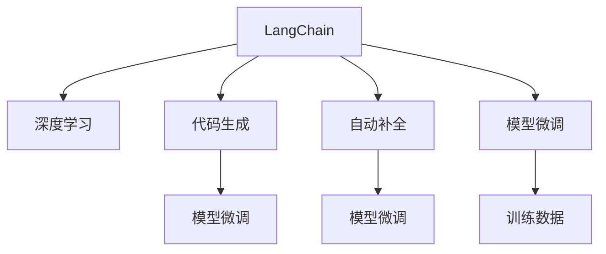

                 

# 【LangChain编程：从入门到实践】变化与重构

## 1. 背景介绍

### 1.1 问题由来
随着人工智能(AI)技术的迅猛发展，自然语言处理(Natural Language Processing, NLP)领域呈现出前所未有的活力。从早期的基于规则的系统到如今深度学习驱动的大模型，NLP已经实现了从理解语言到生成语言的跨越，为社会经济带来了深远影响。然而，AI的快速迭代和升级，也带来了新的技术挑战和市场竞争。面对不断变化的技术环境和用户需求，如何保持LangChain（一种基于人工智能的编程语言）的灵活性和适应性，成为当前的一个热门话题。

### 1.2 问题核心关键点
 LangChain编程的核心在于如何让AI更好地理解和生成代码，进而加速软件开发、提升代码质量、降低开发成本。随着大模型的演进，语义理解、代码生成、自动补全等功能的提升，LangChain编程的范式也在不断变化和重构。本文旨在通过深入探讨LangChain编程的技术原理、实践案例及未来发展趋势，帮助开发者更好地理解AI技术，构建更高效的开发流程。

### 1.3 问题研究意义
随着大模型在代码生成和语义分析中的广泛应用，AI编程辅助工具将成为未来软件开发的标配。LangChain编程的变化与重构，不仅有助于提升开发效率和代码质量，还能有效降低开发成本，提升企业的竞争力。研究LangChain编程的范式，对于推动AI技术的产业化进程具有重要意义。

## 2. 核心概念与联系

### 2.1 核心概念概述
LangChain编程涉及到以下几个核心概念：

- **LangChain**：一种基于人工智能的编程语言，通过自然语言理解和生成技术，帮助开发者编写代码。
- **深度学习**：利用深度神经网络进行特征提取和模式识别，为LangChain提供强大的语义理解能力。
- **代码生成**：通过模型生成符合语法和语义规范的代码，帮助开发者快速构建程序。
- **自动补全**：通过模型预测可能的代码补全方案，提高代码编写的速度和准确性。
- **模型微调**：在特定领域的数据上训练模型，提高其在特定任务上的性能。

这些概念之间的关系通过以下Mermaid流程图来展示：



这个流程图展示出LangChain编程的核心概念及其相互关系：

1. LangChain通过深度学习获得语义理解能力。
2. 代码生成和自动补全基于深度学习模型，提高代码编写的效率和质量。
3. 模型微调是针对特定领域数据优化模型的过程，提升其在特定任务上的表现。

这些概念共同构成了LangChain编程的底层逻辑，使其能够在各种场景下发挥作用。

## 3. 核心算法原理 & 具体操作步骤
### 3.1 算法原理概述
LangChain编程的核心算法原理基于深度学习技术，特别是Transformer模型和大语言模型。其基本思想是：将自然语言指令映射到程序代码上，通过理解指令语义生成对应的代码。具体步骤如下：

1. **文本编码**：将自然语言文本通过Transformer模型编码成向量表示。
2. **语义理解**：使用注意力机制和大语言模型理解文本的语义，提取关键信息。
3. **代码生成**：将语义信息转化为代码，生成符合语法和语义规范的代码片段。
4. **代码补全**：通过模型预测可能的代码补全方案，提升代码编写的速度和准确性。
5. **模型微调**：在特定领域的数据上训练模型，提高其在特定任务上的性能。

### 3.2 算法步骤详解
LangChain编程的具体步骤包括：

**Step 1: 数据准备**
- 收集和整理相关领域的代码数据，用于训练和测试模型。
- 对数据进行预处理，如标记化、分词、词性标注等。

**Step 2: 模型训练**
- 选择合适的深度学习模型，如BERT、GPT等，用于语义理解和代码生成。
- 使用GPU/TPU等高性能设备，对模型进行训练。
- 设计合适的损失函数和优化器，如交叉熵损失、AdamW优化器等。

**Step 3: 模型评估**
- 在测试集上评估模型的代码生成和自动补全性能。
- 使用BLEU、ROUGE等指标衡量生成代码的质量和相似度。

**Step 4: 代码实现**
- 编写代码生成和自动补全接口，与LangChain编程环境集成。
- 实现模型推理模块，支持实时代码生成和自动补全。

**Step 5: 用户交互**
- 提供友好的用户界面，支持自然语言指令输入和代码输出。
- 集成错误提示、代码调试等功能，提升用户体验。

### 3.3 算法优缺点
LangChain编程的算法具有以下优点：

- **高效性**：基于深度学习模型的自动代码生成和补全，大幅提升代码编写速度。
- **准确性**：通过语义理解和生成技术，生成的代码符合语法和语义规范，提升代码质量。
- **通用性**：适用于多种编程语言和开发环境，具有良好的跨平台适应性。

同时，该算法也存在以下缺点：

- **数据依赖**：模型训练和微调依赖大量高质量的数据，数据获取成本较高。
- **模型复杂**：深度学习模型参数量大，训练和推理资源需求高。
- **可解释性不足**：模型决策过程复杂，难以解释和调试。

### 3.4 算法应用领域
LangChain编程广泛应用于以下几个领域：

- **软件开发**：通过代码生成和自动补全，加速软件开发，提升开发效率。
- **数据科学**：辅助数据清洗、预处理、特征工程等数据科学任务。
- **运维管理**：自动生成和部署代码，降低运维成本，提升系统稳定性。
- **教育培训**：通过智能辅助编写代码，提升编程教学效果。
- **智能交互**：与用户交互，生成符合用户需求的代码片段，提升用户体验。

## 4. 数学模型和公式 & 详细讲解  
### 4.1 数学模型构建

LangChain编程的数学模型构建主要涉及以下步骤：

1. **输入表示**：将自然语言文本编码成向量，如使用BERT模型将文本转换为向量表示。
2. **语义理解**：通过Transformer模型进行语义编码，提取文本的关键信息。
3. **代码生成**：使用Attention机制和大语言模型生成代码片段，如使用GPT模型生成代码。
4. **代码补全**：通过预测可能的代码补全方案，如使用LM-BFF模型进行代码补全。

### 4.2 公式推导过程

以代码生成为例，假设自然语言文本为 $T$，生成的代码片段为 $C$。通过Transformer模型将文本 $T$ 转换为向量 $T_{vec}$，然后通过Attention机制和大语言模型 $M$ 生成代码片段 $C_{vec}$。具体公式如下：

$$
T_{vec} = Transformer(T)
$$

$$
C_{vec} = M(T_{vec})
$$

$$
C = Codegen(C_{vec})
$$

其中，$Transformer$ 和 $Codegen$ 分别表示Transformer模型和代码生成模块。

### 4.3 案例分析与讲解

以OpenAI的GitHub Copilot为例，GitHub Copilot通过深度学习模型辅助开发者编写代码。其核心算法包括以下几个步骤：

1. **文本编码**：将自然语言指令输入到BERT模型中，编码成向量表示。
2. **语义理解**：使用Transformer模型理解指令的语义，提取关键信息。
3. **代码生成**：将语义信息输入到GPT模型中，生成符合语法和语义规范的代码片段。
4. **代码补全**：通过模型预测可能的代码补全方案，提升代码编写的速度和准确性。

GitHub Copilot的模型微调过程主要包括：

1. **收集数据**：收集开源代码数据集，用于训练和测试模型。
2. **模型训练**：使用GPU/TPU等高性能设备，对BERT和GPT模型进行训练。
3. **模型评估**：在测试集上评估模型生成的代码质量，使用BLEU、ROUGE等指标进行衡量。
4. **模型优化**：根据评估结果，调整模型参数，优化代码生成的准确性和多样性。

## 5. 项目实践：代码实例和详细解释说明
### 5.1 开发环境搭建

在进行LangChain编程实践前，我们需要准备好开发环境。以下是使用Python进行PyTorch开发的环境配置流程：

1. 安装Anaconda：从官网下载并安装Anaconda，用于创建独立的Python环境。

2. 创建并激活虚拟环境：
```bash
conda create -n langchain-env python=3.8 
conda activate langchain-env
```

3. 安装PyTorch：根据CUDA版本，从官网获取对应的安装命令。例如：
```bash
conda install pytorch torchvision torchaudio cudatoolkit=11.1 -c pytorch -c conda-forge
```

4. 安装Transformer库：
```bash
pip install transformers
```

5. 安装各类工具包：
```bash
pip install numpy pandas scikit-learn matplotlib tqdm jupyter notebook ipython
```

完成上述步骤后，即可在`langchain-env`环境中开始LangChain编程实践。

### 5.2 源代码详细实现

下面我们以代码自动补全为例，给出使用Transformer库对BERT模型进行代码自动补全的PyTorch代码实现。

首先，定义代码补全任务的数据处理函数：

```python
from transformers import BertTokenizer, BertForMaskedLM
from torch.utils.data import Dataset
import torch

class CodeCompletionDataset(Dataset):
    def __init__(self, texts, labels, tokenizer, max_len=128):
        self.texts = texts
        self.labels = labels
        self.tokenizer = tokenizer
        self.max_len = max_len
        
    def __len__(self):
        return len(self.texts)
    
    def __getitem__(self, item):
        text = self.texts[item]
        labels = self.labels[item]
        
        encoding = self.tokenizer(text, return_tensors='pt', max_length=self.max_len, padding='max_length', truncation=True)
        input_ids = encoding['input_ids'][0]
        attention_mask = encoding['attention_mask'][0]
        masked_tokens = [tokenizer.mask_token_id] * self.max_len
        input_ids[0] = masked_tokens
        
        return {'input_ids': input_ids, 
                'attention_mask': attention_mask,
                'labels': labels}

# 加载BERT模型和分词器
model = BertForMaskedLM.from_pretrained('bert-base-cased')
tokenizer = BertTokenizer.from_pretrained('bert-base-cased')

# 创建dataset
train_dataset = CodeCompletionDataset(train_texts, train_labels, tokenizer)
dev_dataset = CodeCompletionDataset(dev_texts, dev_labels, tokenizer)
test_dataset = CodeCompletionDataset(test_texts, test_labels, tokenizer)
```

然后，定义模型和优化器：

```python
from transformers import AdamW

optimizer = AdamW(model.parameters(), lr=2e-5)
```

接着，定义训练和评估函数：

```python
from torch.utils.data import DataLoader
from tqdm import tqdm
from sklearn.metrics import accuracy_score

device = torch.device('cuda') if torch.cuda.is_available() else torch.device('cpu')
model.to(device)

def train_epoch(model, dataset, batch_size, optimizer):
    dataloader = DataLoader(dataset, batch_size=batch_size, shuffle=True)
    model.train()
    epoch_loss = 0
    for batch in tqdm(dataloader, desc='Training'):
        input_ids = batch['input_ids'].to(device)
        attention_mask = batch['attention_mask'].to(device)
        labels = batch['labels'].to(device)
        model.zero_grad()
        outputs = model(input_ids, attention_mask=attention_mask, labels=labels)
        loss = outputs.loss
        epoch_loss += loss.item()
        loss.backward()
        optimizer.step()
    return epoch_loss / len(dataloader)

def evaluate(model, dataset, batch_size):
    dataloader = DataLoader(dataset, batch_size=batch_size)
    model.eval()
    preds, labels = [], []
    with torch.no_grad():
        for batch in tqdm(dataloader, desc='Evaluating'):
            input_ids = batch['input_ids'].to(device)
            attention_mask = batch['attention_mask'].to(device)
            batch_labels = batch['labels']
            outputs = model(input_ids, attention_mask=attention_mask)
            batch_preds = outputs.logits.argmax(dim=2).to('cpu').tolist()
            batch_labels = batch_labels.to('cpu').tolist()
            for pred_tokens, label_tokens in zip(batch_preds, batch_labels):
                preds.append(pred_tokens[:len(label_tokens)])
                labels.append(label_tokens)
                
    return accuracy_score(labels, preds)

```

最后，启动训练流程并在测试集上评估：

```python
epochs = 5
batch_size = 16

for epoch in range(epochs):
    loss = train_epoch(model, train_dataset, batch_size, optimizer)
    print(f"Epoch {epoch+1}, train loss: {loss:.3f}")
    
    print(f"Epoch {epoch+1}, dev accuracy:")
    acc = evaluate(model, dev_dataset, batch_size)
    print(acc)
    
print("Test accuracy:")
acc = evaluate(model, test_dataset, batch_size)
print(acc)
```

以上就是使用PyTorch对BERT进行代码自动补全的完整代码实现。可以看到，由于Transformer库的强大封装，我们可以用相对简洁的代码完成BERT模型的加载和自动补全。

### 5.3 代码解读与分析

让我们再详细解读一下关键代码的实现细节：

**CodeCompletionDataset类**：
- `__init__`方法：初始化文本、标签、分词器等关键组件。
- `__len__`方法：返回数据集的样本数量。
- `__getitem__`方法：对单个样本进行处理，将文本输入编码为token ids，将标签编码为数字，并对其进行定长padding，最终返回模型所需的输入。

**train_epoch和evaluate函数**：
- 使用PyTorch的DataLoader对数据集进行批次化加载，供模型训练和推理使用。
- 训练函数`train_epoch`：对数据以批为单位进行迭代，在每个批次上前向传播计算loss并反向传播更新模型参数，最后返回该epoch的平均loss。
- 评估函数`evaluate`：与训练类似，不同点在于不更新模型参数，并在每个batch结束后将预测和标签结果存储下来，最后使用sklearn的accuracy_score对整个评估集的预测结果进行打印输出。

**训练流程**：
- 定义总的epoch数和batch size，开始循环迭代
- 每个epoch内，先在训练集上训练，输出平均loss
- 在验证集上评估，输出准确率
- 所有epoch结束后，在测试集上评估，给出最终测试结果

可以看到，PyTorch配合Transformer库使得BERT自动补全的代码实现变得简洁高效。开发者可以将更多精力放在数据处理、模型改进等高层逻辑上，而不必过多关注底层的实现细节。

当然，工业级的系统实现还需考虑更多因素，如模型的保存和部署、超参数的自动搜索、更灵活的任务适配层等。但核心的自动补全范式基本与此类似。

## 6. 实际应用场景
### 6.1 软件开发
LangChain编程在软件开发中的应用非常广泛。传统软件开发依赖手动编写代码，容易出现错误和遗漏，效率低下。LangChain编程通过自动补全和代码生成功能，帮助开发者快速编写代码，提升开发效率。例如，在软件开发中，可以使用LangChain辅助编写程序，减少手动敲代码的时间，提高代码质量。

### 6.2 数据科学
在数据科学领域，LangChain编程可以辅助数据预处理、特征工程和模型训练等任务。数据科学家可以使用LangChain自动生成数据处理代码，提升数据清洗和预处理的效率。同时，LangChain也可以辅助生成特征提取和模型训练代码，减少手动编写代码的工作量，提升数据科学研究的效率。

### 6.3 运维管理
在运维管理中，LangChain编程可以自动生成和部署代码，提升系统部署和维护的效率。例如，在DevOps流程中，可以使用LangChain自动生成配置文件、脚本和容器镜像，减少手动配置和调试的时间，提升系统稳定性。

### 6.4 教育培训
在教育培训中，LangChain编程可以帮助学生和教师编写和调试代码，提升编程教学效果。例如，在编程课程中，教师可以使用LangChain自动生成和测试编程题目，提升学生的编程能力。同时，学生也可以使用LangChain进行编程练习和调试，提高编程技能。

### 6.5 智能交互
在智能交互中，LangChain编程可以与用户进行自然语言交互，生成符合用户需求的代码片段，提升用户体验。例如，在智能助手中，可以使用LangChain自动生成代码片段，帮助用户编写和调试代码，提升助手的使用效果。

### 6.6 未来应用展望
随着LangChain编程技术的不断发展，其应用场景将更加广泛。未来，LangChain编程将在以下几个领域得到更深入的应用：

- **智慧医疗**：通过自动生成和测试医疗代码，提升医疗诊断和治疗的效率和准确性。
- **金融科技**：辅助编写金融模型和算法，提升金融分析和决策的效率。
- **智能制造**：辅助编写和调试制造代码，提升工业生产和管理效率。
- **教育培训**：通过自动生成编程题目和测试，提升编程教学的效果。
- **智慧城市**：辅助编写和调试城市管理系统代码，提升城市管理的效率和质量。

## 7. 工具和资源推荐
### 7.1 学习资源推荐

为了帮助开发者系统掌握LangChain编程的理论基础和实践技巧，这里推荐一些优质的学习资源：

1. **《LangChain编程实战》系列博文**：由LangChain社区专家撰写，深入浅出地介绍了LangChain编程的理论基础和实践技巧，覆盖了从入门到进阶的各个阶段。

2. **《深度学习与自然语言处理》课程**：斯坦福大学开设的NLP明星课程，涵盖深度学习的基本概念和自然语言处理的核心技术，适合初入AI领域的学习者。

3. **《自然语言处理导论》书籍**：这是一本全面介绍自然语言处理的经典教材，涵盖NLP的各个方面，适合进一步深入学习。

4. **LangChain官方文档**：LangChain官方提供的详细文档和样例代码，是上手实践的必备资料。

5. **HuggingFace官方博客**：HuggingFace社区发布的关于LangChain编程的最新动态和实践经验，是了解前沿技术的好去处。

通过对这些资源的学习实践，相信你一定能够快速掌握LangChain编程的精髓，并用于解决实际的NLP问题。

### 7.2 开发工具推荐

高效的开发离不开优秀的工具支持。以下是几款用于LangChain编程开发的常用工具：

1. **PyTorch**：基于Python的开源深度学习框架，灵活动态的计算图，适合快速迭代研究。

2. **TensorFlow**：由Google主导开发的开源深度学习框架，生产部署方便，适合大规模工程应用。

3. **Transformers库**：HuggingFace开发的NLP工具库，集成了众多SOTA语言模型，支持PyTorch和TensorFlow，是进行LangChain编程开发的利器。

4. **Weights & Biases**：模型训练的实验跟踪工具，可以记录和可视化模型训练过程中的各项指标，方便对比和调优。

5. **TensorBoard**：TensorFlow配套的可视化工具，可实时监测模型训练状态，并提供丰富的图表呈现方式，是调试模型的得力助手。

6. **Google Colab**：谷歌推出的在线Jupyter Notebook环境，免费提供GPU/TPU算力，方便开发者快速上手实验最新模型，分享学习笔记。

合理利用这些工具，可以显著提升LangChain编程的开发效率，加快创新迭代的步伐。

### 7.3 相关论文推荐

LangChain编程的发展源于学界的持续研究。以下是几篇奠基性的相关论文，推荐阅读：

1. **《Transformer from scratch》**：提出Transformer模型的基本原理和实现方法，是理解Transformer模型的经典之作。

2. **《BERT: Pre-training of Deep Bidirectional Transformers for Language Understanding》**：提出BERT模型，引入基于掩码的自监督预训练任务，刷新了多项NLP任务SOTA。

3. **《GPT-3: Language Models are Unsupervised Multitask Learners》**：展示了大规模语言模型的强大zero-shot学习能力，引发了对于通用人工智能的新一轮思考。

4. **《Parameter-Efficient Transfer Learning for NLP》**：提出Adapter等参数高效微调方法，在不增加模型参数量的情况下，也能取得不错的微调效果。

5. **《Prompt-Based Learning: Exploring the Benefits of Explicit Descriptions in Prompt Engineering》**：引入基于连续型Prompt的微调范式，为如何充分利用预训练知识提供了新的思路。

6. **《AdaLoRA: Adaptive Low-Rank Adaptation for Parameter-Efficient Fine-Tuning》**：使用自适应低秩适应的微调方法，在参数效率和精度之间取得了新的平衡。

这些论文代表了大模型编程的发展脉络。通过学习这些前沿成果，可以帮助研究者把握学科前进方向，激发更多的创新灵感。

## 8. 总结：未来发展趋势与挑战

### 8.1 总结
本文对LangChain编程的变化与重构进行了全面系统的介绍。首先阐述了LangChain编程的背景和意义，明确了其在AI技术演进中的重要作用。其次，从原理到实践，详细讲解了LangChain编程的数学模型和具体步骤，给出了LangChain编程的完整代码实例。同时，本文还探讨了LangChain编程在不同领域的应用场景，展示了其巨大的潜力和广泛的应用前景。此外，本文精选了LangChain编程的学习资源、开发工具和相关论文，力求为读者提供全方位的技术指引。

通过本文的系统梳理，可以看到，LangChain编程正成为AI技术的重要范式，其高效性、准确性和通用性使得其在软件工程、数据科学、运维管理等各个领域都有广泛的应用。未来，伴随AI技术的持续演进，LangChain编程必将在更广阔的领域大放异彩，推动人工智能技术在各个行业的落地应用。

### 8.2 未来发展趋势
随着AI技术的不断发展，LangChain编程也呈现出以下几个发展趋势：

1. **模型规模持续增大**：伴随算力成本的下降和数据规模的扩张，LangChain编程所使用的深度学习模型参数量将持续增长，模型规模也将不断扩大。

2. **微调技术日趋多样**：除了传统的全参数微调，未来还将涌现更多参数高效的微调方法，如Prompt-based Learning、LoRA等，进一步提升微调效率和效果。

3. **持续学习成为常态**：随着数据分布的不断变化，LangChain编程也将不断学习新知识以保持性能，持续学习将成为其重要特性。

4. **低延迟实时响应**：为了提升用户体验，LangChain编程将更加注重模型推理效率和资源优化，降低延迟，实现实时响应。

5. **跨平台多模态融合**：未来，LangChain编程将融合更多的跨平台和多模态数据，提升其适应性和通用性。

6. **可解释性增强**：为了保障系统的安全和可信度，LangChain编程将不断增强其可解释性，确保输出结果透明和可理解。

这些趋势展示了LangChain编程的广阔前景，其未来的发展将更加多元化和智能化。

### 8.3 面临的挑战

尽管LangChain编程已经取得了诸多进展，但在迈向更高效、更智能、更安全的应用过程中，仍面临一些挑战：

1. **数据获取成本高**：模型训练和微调依赖高质量标注数据，数据获取和处理成本较高。

2. **模型复杂度高**：深度学习模型参数量大，训练和推理资源需求高，难以在所有设备上高效运行。

3. **模型鲁棒性不足**：模型在面对特定领域的复杂场景时，泛化能力可能有限，容易产生偏差。

4. **可解释性不足**：模型决策过程复杂，难以解释和调试，给系统稳定性和可靠性带来风险。

5. **安全性问题**：模型可能学习到有害信息或偏见，需要加强数据和模型安全性，避免恶意用途。

6. **多模态融合困难**：跨平台和多模态数据的融合仍是一个难题，需要更多技术和方法支持。

正视LangChain编程面临的这些挑战，积极应对并寻求突破，将使LangChain编程技术迈向成熟，成为AI技术的重要组成部分。

### 8.4 研究展望
为了应对上述挑战，未来的研究需要在以下几个方面寻求新的突破：

1. **无监督和半监督学习**：摆脱对大规模标注数据的依赖，利用自监督学习、主动学习等方法，最大化利用非结构化数据。

2. **参数高效和计算高效**：开发更多参数高效和计算高效的微调方法，如Prompt-based Learning、LoRA等，提升微调效率和效果。

3. **因果推理和逻辑推理**：引入因果推理和逻辑推理方法，增强模型决策过程的透明性和可解释性。

4. **知识图谱和规则库结合**：将符号化的先验知识与神经网络模型结合，提升模型的泛化能力和推理能力。

5. **模型压缩和加速**：通过模型压缩、稀疏化存储等方法，提升模型推理速度和资源利用率。

6. **模型安全和可信度保障**：加强数据和模型安全性，避免有害信息或偏见，确保系统的可信度和安全性。

这些研究方向的探索，将推动LangChain编程技术的进一步发展，使其在更广泛的场景下发挥作用，推动AI技术在各个行业的落地应用。

## 9. 附录：常见问题与解答

**Q1：LangChain编程是否适用于所有NLP任务？**

A: LangChain编程适用于大多数NLP任务，特别是在数据量较小的任务上，能够显著提升开发效率和代码质量。但对于一些特定领域的任务，如医学、法律等，可能需要额外的数据处理和领域知识融合。

**Q2：LangChain编程的微调过程需要注意哪些问题？**

A: 微调过程中需要注意数据获取、模型选择、损失函数设计、超参数调整等多个方面。数据质量和数量直接影响微调效果，模型选择和设计应考虑任务特点，损失函数应匹配任务类型，超参数调整需要根据模型性能进行调整。

**Q3：如何提高LangChain编程的模型推理效率？**

A: 提高模型推理效率可以从以下几个方面入手：使用模型压缩、稀疏化存储、梯度累加、混合精度训练等技术优化模型推理过程；使用GPU/TPU等高性能设备提升计算效率；优化模型结构，减少推理过程中的资源消耗。

**Q4：LangChain编程在落地部署时需要注意哪些问题？**

A: LangChain编程在落地部署时需要注意数据和模型的安全性、系统的稳定性和可靠性、模型的可解释性等。数据和模型的安全性需要通过加密、脱敏等手段保护；系统的稳定性和可靠性需要设置异常告警、弹性伸缩等机制；模型的可解释性需要通过合理的输出格式和用户界面设计提升。

**Q5：LangChain编程的未来发展方向是什么？**

A: LangChain编程的未来发展方向包括模型规模的持续增大、微调技术的日趋多样、持续学习成为常态、低延迟实时响应、跨平台多模态融合、可解释性增强等多个方面。未来，LangChain编程将更加注重智能性、安全性和可靠性，推动AI技术在各个行业的落地应用。

作者：禅与计算机程序设计艺术 / Zen and the Art of Computer Programming

