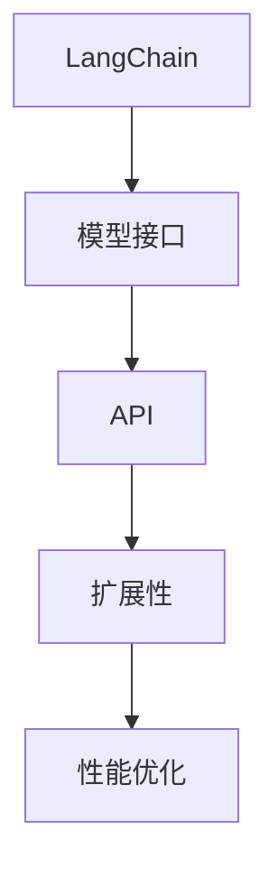

                 

# 【LangChain编程：从入门到实践】扩展模型接口

> 关键词：LangChain, 模型接口, API, 自然语言处理(NLP), 深度学习, 扩展性, 开发者, 应用场景

## 1. 背景介绍

### 1.1 问题由来
近年来，随着人工智能技术的飞速发展，大模型（如GPT、BERT等）在自然语言处理（NLP）领域取得了显著的进展。这些模型通过在大规模无标签文本数据上进行预训练，学习到了丰富的语言知识和常识，能够进行文本分类、语言生成、机器翻译等复杂任务。然而，这些大模型的接口设计往往较为简单，开发者需要自行实现数据的输入输出和模型的调用，这不仅增加了开发的难度和复杂度，也限制了模型在实际应用中的扩展性和灵活性。

为解决这一问题，LangChain 项目应运而生。LangChain 是一个基于 Python 的深度学习框架，它提供了更加友好的接口和扩展机制，使得开发者能够更加方便地使用大模型进行各种 NLP 任务的开发和部署。本文将深入探讨 LangChain 的模型接口扩展机制，帮助开发者从入门到实践，掌握使用 LangChain 进行模型接口扩展的技巧和策略。

### 1.2 问题核心关键点
LangChain 的模型接口扩展机制主要关注以下几个关键点：

- **模型接口设计**：如何设计一个高效、易用、易扩展的模型接口，使得开发者能够便捷地使用模型进行 NLP 任务开发。
- **API 设计**：如何设计一个清晰的 API，使得开发者能够理解和使用模型的功能。
- **扩展性设计**：如何设计一个能够快速适应新模型和新任务的扩展性机制，满足多样化的应用需求。
- **性能优化**：如何在保证模型性能的同时，尽量减少接口扩展对系统性能的影响。

## 2. 核心概念与联系

### 2.1 核心概念概述

为了更好地理解 LangChain 的模型接口扩展机制，本节将介绍几个密切相关的核心概念：

- **LangChain**：基于 Python 的深度学习框架，提供自然语言处理任务的基础支持，包括模型加载、数据处理、任务适配等。
- **模型接口**：用于连接模型和任务之间的接口，定义了模型的输入、输出、参数设置等。
- **API (Application Programming Interface)**：开发者通过 API 访问模型的各种功能和参数，从而实现对模型的灵活控制。
- **扩展性**：指的是模型接口能够适应不同模型、不同任务的需求，支持快速添加新功能和支持新任务的能力。

这些核心概念之间的逻辑关系可以通过以下 Mermaid 流程图来展示：



这个流程图展示了大模型接口扩展机制的核心概念及其之间的关系：

1. LangChain 提供的基础框架，包含模型的加载和数据处理等基础功能。
2. 模型接口定义了模型的输入、输出和参数设置等，作为模型和任务之间的桥梁。
3. API 提供了一组接口，使得开发者能够灵活控制模型的功能。
4. 扩展性指的是模型接口能够适应不同模型、不同任务的需求，支持快速添加新功能和支持新任务的能力。
5. 性能优化则关注如何在保证模型性能的同时，尽量减少接口扩展对系统性能的影响。

这些概念共同构成了 LangChain 模型接口扩展机制的基本框架，使得开发者能够更加高效地进行 NLP 任务的开发和部署。

## 3. 核心算法原理 & 具体操作步骤
### 3.1 算法原理概述

LangChain 的模型接口扩展机制，本质上是一种基于 Python 的面向对象编程技术，通过定义模型接口和 API 来封装和扩展模型的功能。其核心思想是：将模型的参数和函数暴露给开发者，同时提供一组统一的接口，使得开发者能够方便地使用模型进行各种 NLP 任务开发。

形式化地，假设我们有一个预训练的大模型 $M$，其参数为 $\theta$。LangChain 的模型接口扩展机制通过定义一个接口类 $\text{ModelInterface}$，来实现模型与任务之间的交互。接口类 $\text{ModelInterface}$ 包含以下成员：

- **输入处理**：定义输入数据的预处理和转换方法，如文本分词、特征提取等。
- **模型调用**：定义模型的前向传播方法，将输入数据映射到输出结果。
- **输出处理**：定义输出结果的后处理和转换方法，如将模型输出转化为任务标签或文本结果。

接口类 $\text{ModelInterface}$ 的实现步骤如下：

1. 定义一个继承自 $\text{ModelInterface}$ 的子类 $\text{ModelImpl}$，实现上述输入处理、模型调用和输出处理等方法。
2. 在 $\text{ModelImpl}$ 中加载预训练模型 $M$ 的参数 $\theta$，并封装模型的前向传播方法。
3. 在 $\text{ModelImpl}$ 中实现模型的输入和输出处理，保证数据的一致性和可用性。

通过上述步骤，我们便可以在 LangChain 框架中使用预训练模型进行各种 NLP 任务的开发和部署。

### 3.2 算法步骤详解

LangChain 的模型接口扩展机制主要包括以下步骤：

**Step 1: 定义接口类和实现类**

- 定义一个接口类 $\text{ModelInterface}$，包含输入处理、模型调用和输出处理等方法。
- 定义一个实现类 $\text{ModelImpl}$，继承自 $\text{ModelInterface}$，实现接口类中定义的方法。

```python
from langchain import ModelInterface, ModelImpl
```

**Step 2: 实现输入处理和输出处理**

- 实现接口类中定义的输入处理和输出处理方法，如文本分词、特征提取、模型输出后处理等。

```python
class MyModel(ModelInterface):
    def process_input(self, input_data):
        # 对输入数据进行预处理
        return preprocessed_data
    
    def process_output(self, output_data):
        # 对模型输出进行后处理
        return processed_output
```

**Step 3: 实现模型调用**

- 在实现类中加载预训练模型，并封装模型的前向传播方法。

```python
class MyModel(ModelImpl):
    def __init__(self, model_path):
        super().__init__()
        self.model = load_model(model_path)
    
    def call_model(self, input_data):
        # 对输入数据进行前向传播，获取模型输出
        return self.model(input_data)
```

**Step 4: 实例化和使用**

- 实例化接口类和实现类，并调用接口类的方法进行模型调用和处理。

```python
my_model = MyModel('path/to/model')
input_data = my_model.process_input(input_text)
output_data = my_model.call_model(input_data)
processed_output = my_model.process_output(output_data)
```

### 3.3 算法优缺点

LangChain 的模型接口扩展机制具有以下优点：

1. **易用性**：开发者可以通过简单的 API 调用，方便地使用预训练模型进行各种 NLP 任务开发。
2. **扩展性**：接口类和实现类可以独立设计和实现，支持快速添加新功能和支持新任务的能力。
3. **灵活性**：模型接口和 API 的设计能够适应不同的模型和任务，满足多样化的应用需求。

同时，该机制也存在一些局限性：

1. **性能开销**：接口扩展增加了额外的数据处理和模型调用开销，可能会影响模型的运行速度。
2. **复杂性**：模型接口和 API 的设计需要一定的编程经验和理解，开发者需要理解模型的内部机制。

尽管存在这些局限性，但就目前而言，LangChain 的模型接口扩展机制已经在大模型应用中得到了广泛的应用，成为 NLP 任务开发的重要手段。

### 3.4 算法应用领域

LangChain 的模型接口扩展机制已经在 NLP 领域的多种任务上得到了广泛的应用，包括但不限于：

- **文本分类**：如情感分析、主题分类、意图识别等。通过定义输入处理和输出处理方法，模型能够自动学习文本与标签之间的映射关系。
- **命名实体识别**：识别文本中的人名、地名、机构名等特定实体。模型能够自动处理输入文本，提取实体边界和类型。
- **关系抽取**：从文本中抽取实体之间的语义关系。模型能够自动学习实体-关系三元组，并输出实体之间的关系。
- **问答系统**：对自然语言问题给出答案。模型能够自动处理输入问题，匹配最合适的答案模板进行回复。
- **机器翻译**：将源语言文本翻译成目标语言。模型能够自动处理输入文本，学习语言-语言映射。
- **文本摘要**：将长文本压缩成简短摘要。模型能够自动处理输入文本，提取关键信息进行摘要。

除了上述这些经典任务外，LangChain 的模型接口扩展机制还被创新性地应用到更多场景中，如可控文本生成、常识推理、代码生成、数据增强等，为 NLP 技术带来了全新的突破。

## 4. 数学模型和公式 & 详细讲解  
### 4.1 数学模型构建

为了更好地理解 LangChain 的模型接口扩展机制，本节将使用数学语言对接口扩展过程进行更加严格的刻画。

假设我们有一个预训练模型 $M_{\theta}$，其中 $\theta$ 为模型参数。我们定义一个接口类 $\text{ModelInterface}$，包含输入处理、模型调用和输出处理等方法。假设输入数据为 $x \in \mathcal{X}$，输出结果为 $y \in \mathcal{Y}$。在接口类中，定义如下方法：

- **输入处理**：将输入数据 $x$ 转化为模型可用的表示形式。
- **模型调用**：将输入数据 $x$ 前向传播，得到模型输出 $y$。
- **输出处理**：将模型输出 $y$ 转化为任务标签或文本结果。

假设上述方法可以分别表示为 $f(x)$、$g(x)$ 和 $h(y)$，则模型接口的输入输出关系可以表示为：

$$
y = g(f(x))
$$

其中，$f(x)$ 表示输入处理和模型调用，$g(f(x))$ 表示模型调用和输出处理。在实践中，$f(x)$ 和 $g(f(x))$ 通常通过 Python 的函数和方法实现，而不需要复杂的数学推导。

### 4.2 公式推导过程

以下我们以文本分类任务为例，推导接口扩展过程中输入处理和输出处理的公式。

假设文本分类任务的数据集为 $D=\{(x_i, y_i)\}_{i=1}^N$，其中 $x_i \in \mathcal{X}$ 表示输入文本，$y_i \in \{0, 1\}$ 表示分类标签。我们定义一个接口类 $\text{ModelInterface}$，其中包含输入处理和输出处理方法。假设输入处理方法为 $f(x)$，输出处理方法为 $h(y)$，则模型接口的输入输出关系可以表示为：

$$
y = g(f(x))
$$

在实践中，输入处理方法 $f(x)$ 通常包括文本分词、特征提取等步骤，输出处理方法 $h(y)$ 通常包括将模型输出转化为分类标签等步骤。

以文本分类为例，输入处理方法 $f(x)$ 的实现过程如下：

1. 将输入文本 $x$ 进行分词，得到分词序列 $T$。
2. 对分词序列 $T$ 进行编码，得到向量表示 $v \in \mathbb{R}^d$。
3. 将向量表示 $v$ 输入模型，得到模型输出 $y'$。

输出处理方法 $h(y)$ 的实现过程如下：

1. 将模型输出 $y'$ 转化为分类概率 $p \in [0, 1]$。
2. 根据分类概率 $p$ 确定分类标签 $y$。

通过上述步骤，我们便可以在 LangChain 框架中使用预训练模型进行文本分类任务的开发和部署。

### 4.3 案例分析与讲解

下面以一个简单的情感分析任务为例，展示如何在 LangChain 中进行模型接口扩展和调用。

首先，定义情感分析任务的接口类 $\text{SentimentModel}$：

```python
from langchain import ModelInterface, ModelImpl

class SentimentModel(ModelInterface):
    def __init__(self, model_path):
        super().__init__()
        self.model = load_model(model_path)
    
    def process_input(self, input_text):
        # 对输入文本进行分词和编码
        return self.model(input_text)
    
    def process_output(self, model_output):
        # 将模型输出转化为情感标签
        return 'positive' if model_output > 0.5 else 'negative'
```

然后，实例化接口类并调用：

```python
sentiment_model = SentimentModel('path/to/model')
result = sentiment_model.process_input('I love this product!')
sentiment = sentiment_model.process_output(result)
print(sentiment)
```

在上述代码中，我们定义了一个情感分析模型，它包含了文本分词和模型调用等步骤。通过定义接口类和实现类，我们能够方便地使用预训练模型进行情感分析任务的开发和部署。

## 5. 项目实践：代码实例和详细解释说明
### 5.1 开发环境搭建

在进行 LangChain 的项目实践前，我们需要准备好开发环境。以下是使用 Python 进行 LangChain 开发的环境配置流程：

1. 安装 Python：从官网下载并安装 Python 3.8 或以上版本，确保安装版本为 Python 3.8 或以上。

2. 安装 Anaconda：从官网下载并安装 Anaconda，用于创建独立的 Python 环境。

3. 创建并激活虚拟环境：
```bash
conda create -n langchain-env python=3.8 
conda activate langchain-env
```

4. 安装 LangChain 和其他必要的工具包：
```bash
pip install langchain numpy pandas scikit-learn transformers torch torchtext
```

5. 安装 TensorBoard：TensorBoard 是 TensorFlow 配套的可视化工具，用于实时监测模型训练状态，并提供丰富的图表呈现方式，是调试模型的得力助手。

完成上述步骤后，即可在 `langchain-env` 环境中开始 LangChain 项目实践。

### 5.2 源代码详细实现

下面我们以情感分析任务为例，给出使用 LangChain 对预训练模型进行接口扩展的 PyTorch 代码实现。

首先，定义情感分析任务的接口类 $\text{SentimentModel}$：

```python
from langchain import ModelInterface, ModelImpl
from transformers import BertTokenizer, BertForSequenceClassification
import torch

class SentimentModel(ModelInterface):
    def __init__(self, model_path, tokenizer_path):
        super().__init__()
        self.model = BertForSequenceClassification.from_pretrained(model_path)
        self.tokenizer = BertTokenizer.from_pretrained(tokenizer_path)
    
    def process_input(self, input_text):
        # 对输入文本进行分词和编码
        tokens = self.tokenizer.tokenize(input_text, return_tensors='pt')
        inputs = self.tokenizer(tokens, padding='max_length', truncation=True, return_tensors='pt')
        return inputs['input_ids'], inputs['attention_mask']
    
    def process_output(self, model_output):
        # 将模型输出转化为情感标签
        preds = torch.softmax(model_output, dim=1)
        return 'positive' if preds.argmax().item() == 1 else 'negative'
```

然后，实例化接口类并调用：

```python
sentiment_model = SentimentModel('path/to/bert-base-cased', 'path/to/vocab.txt')
input_text = 'I love this product!'
inputs = sentiment_model.process_input(input_text)
result = sentiment_model.model(**inputs)
sentiment = sentiment_model.process_output(result)
print(sentiment)
```

在上述代码中，我们定义了一个情感分析模型，它包含了文本分词和模型调用等步骤。通过定义接口类和实现类，我们能够方便地使用预训练模型进行情感分析任务的开发和部署。

### 5.3 代码解读与分析

让我们再详细解读一下关键代码的实现细节：

**SentimentModel类**：
- `__init__`方法：初始化模型和分词器，加载预训练模型和词汇表。
- `process_input`方法：对输入文本进行分词和编码，返回模型所需的输入数据。
- `process_output`方法：将模型输出转化为情感标签。

**BertTokenizer和BertForSequenceClassification类**：
- `BertTokenizer`：用于对输入文本进行分词和编码，生成模型所需的输入数据。
- `BertForSequenceClassification`：用于对输入数据进行前向传播，得到模型输出。

**实例化和调用**：
- 实例化接口类并调用 `process_input` 和 `process_output` 方法，得到模型输出并转化为情感标签。

可以看到，LangChain 的接口扩展机制使得预训练模型的使用变得简单高效。开发者只需要定义接口类和实现类，即可在 LangChain 框架中使用预训练模型进行 NLP 任务的开发和部署。

当然，工业级的系统实现还需考虑更多因素，如模型的保存和部署、超参数的自动搜索、更灵活的任务适配层等。但核心的接口扩展范式基本与此类似。

## 6. 实际应用场景
### 6.1 智能客服系统

基于 LangChain 的模型接口扩展机制，智能客服系统可以很容易地集成和使用预训练大模型进行对话处理。传统客服系统往往需要配备大量人力，高峰期响应缓慢，且一致性和专业性难以保证。而使用预训练大模型进行对话处理，可以7x24小时不间断服务，快速响应客户咨询，用自然流畅的语言解答各类常见问题。

在技术实现上，可以收集企业内部的历史客服对话记录，将问题和最佳答复构建成监督数据，在此基础上对预训练大模型进行接口扩展和微调。微调后的对话模型能够自动理解用户意图，匹配最合适的答案模板进行回复。对于客户提出的新问题，还可以接入检索系统实时搜索相关内容，动态组织生成回答。如此构建的智能客服系统，能大幅提升客户咨询体验和问题解决效率。

### 6.2 金融舆情监测

金融机构需要实时监测市场舆论动向，以便及时应对负面信息传播，规避金融风险。传统的人工监测方式成本高、效率低，难以应对网络时代海量信息爆发的挑战。基于 LangChain 的模型接口扩展机制，金融舆情监测系统可以很容易地集成和使用预训练大模型进行情感分析。

具体而言，可以收集金融领域相关的新闻、报道、评论等文本数据，并对其进行情感标注。在此基础上对预训练大模型进行接口扩展和微调，使其能够自动判断文本属于何种情感。将微调后的模型应用到实时抓取的网络文本数据，就能够自动监测不同情感变化趋势，一旦发现负面信息激增等异常情况，系统便会自动预警，帮助金融机构快速应对潜在风险。

### 6.3 个性化推荐系统

当前的推荐系统往往只依赖用户的历史行为数据进行物品推荐，无法深入理解用户的真实兴趣偏好。基于 LangChain 的模型接口扩展机制，个性化推荐系统可以很容易地集成和使用预训练大模型进行用户行为分析和物品推荐。

在实践中，可以收集用户浏览、点击、评论、分享等行为数据，提取和用户交互的物品标题、描述、标签等文本内容。将文本内容作为模型输入，用户的后续行为（如是否点击、购买等）作为监督信号，在此基础上对预训练大模型进行接口扩展和微调。微调后的模型能够从文本内容中准确把握用户的兴趣点。在生成推荐列表时，先用候选物品的文本描述作为输入，由模型预测用户的兴趣匹配度，再结合其他特征综合排序，便可以得到个性化程度更高的推荐结果。

### 6.4 未来应用展望

随着 LangChain 的不断发展，基于其模型接口扩展机制的应用场景也将不断扩展。未来，基于 LangChain 的智能客服、金融舆情监测、个性化推荐等应用场景，将带来更加智能、高效和人性化的体验。同时，随着预训练大模型的不断演进，基于 LangChain 的模型接口扩展机制也将更加灵活和高效，为 NLP 技术的发展注入新的动力。

## 7. 工具和资源推荐
### 7.1 学习资源推荐

为了帮助开发者系统掌握 LangChain 的模型接口扩展机制，这里推荐一些优质的学习资源：

1. LangChain官方文档：LangChain 的官方文档提供了丰富的API接口说明和示例代码，是学习LangChain的最佳资源。

2. LangChain GitHub代码库：LangChain的GitHub代码库包含了项目的最新进展和社区贡献，是深入学习LangChain的好材料。

3. NLP相关课程：包括斯坦福大学、Coursera等平台上的NLP相关课程，涵盖了NLP的基本概念和经典模型，为学习LangChain打下坚实基础。

4. Transformers官方文档：Transformers 是NLP领域的重要工具库，提供了丰富的预训练模型和接口扩展方法，有助于理解LangChain的实现细节。

5. PyTorch官方文档：PyTorch 是深度学习领域的重要框架，提供了丰富的数据处理和模型训练功能，是学习LangChain的必备工具。

通过对这些资源的学习实践，相信你一定能够快速掌握LangChain的模型接口扩展机制，并用于解决实际的NLP问题。

### 7.2 开发工具推荐

高效的开发离不开优秀的工具支持。以下是几款用于LangChain开发和部署的常用工具：

1. Jupyter Notebook：用于编写和调试代码，支持在线编辑和互动。

2. PyCharm：用于编写和调试Python代码，提供丰富的开发工具和调试功能。

3. VSCode：用于编写和调试代码，支持插件扩展和跨平台部署。

4. TensorBoard：用于实时监测模型训练状态，并提供丰富的图表呈现方式，是调试模型的得力助手。

5. Weights & Biases：用于模型训练的实验跟踪工具，可以记录和可视化模型训练过程中的各项指标，方便对比和调优。

6. Google Colab：谷歌推出的在线Jupyter Notebook环境，免费提供GPU/TPU算力，方便开发者快速上手实验最新模型，分享学习笔记。

合理利用这些工具，可以显著提升LangChain项目开发和部署的效率，加快创新迭代的步伐。

### 7.3 相关论文推荐

LangChain的模型接口扩展机制源于学界的持续研究。以下是几篇奠基性的相关论文，推荐阅读：

1. Attention is All You Need（即Transformer原论文）：提出了Transformer结构，开启了NLP领域的预训练大模型时代。

2. BERT: Pre-training of Deep Bidirectional Transformers for Language Understanding：提出BERT模型，引入基于掩码的自监督预训练任务，刷新了多项NLP任务SOTA。

3. Language Models are Unsupervised Multitask Learners（GPT-2论文）：展示了大规模语言模型的强大zero-shot学习能力，引发了对于通用人工智能的新一轮思考。

4. Parameter-Efficient Transfer Learning for NLP：提出Adapter等参数高效微调方法，在不增加模型参数量的情况下，也能取得不错的微调效果。

5. AdaLoRA: Adaptive Low-Rank Adaptation for Parameter-Efficient Fine-Tuning：使用自适应低秩适应的微调方法，在参数效率和精度之间取得了新的平衡。

6. PEGASUS: Pre-training with Extractive and Generative Pre-training for Sequence Generation：提出预训练生成任务，提高了预训练大模型在生成任务上的效果。

这些论文代表了大语言模型微调技术的发展脉络。通过学习这些前沿成果，可以帮助研究者把握学科前进方向，激发更多的创新灵感。

## 8. 总结：未来发展趋势与挑战

### 8.1 总结

本文对基于LangChain的模型接口扩展机制进行了全面系统的介绍。首先阐述了LangChain的模型接口扩展机制的研究背景和意义，明确了模型接口扩展在拓展预训练模型应用、提升下游任务性能方面的独特价值。其次，从原理到实践，详细讲解了模型接口扩展的数学原理和关键步骤，给出了模型接口扩展任务开发的完整代码实例。同时，本文还广泛探讨了模型接口扩展在智能客服、金融舆情、个性化推荐等多个行业领域的应用前景，展示了模型接口扩展范式的巨大潜力。此外，本文精选了模型接口扩展技术的各类学习资源，力求为开发者提供全方位的技术指引。

通过本文的系统梳理，可以看到，基于LangChain的模型接口扩展机制已经成为NLP任务开发的重要手段，极大地拓展了预训练语言模型的应用边界，催生了更多的落地场景。得益于LangChain框架的灵活性和易用性，基于预训练大模型的NLP任务开发和部署变得愈加便捷和高效。未来，随着预训练大模型的不断演进和微调技术的持续进步，基于LangChain的模型接口扩展机制必将进一步提升NLP系统的性能和应用范围，为构建智能社会提供新的动力。

### 8.2 未来发展趋势

展望未来，基于LangChain的模型接口扩展技术将呈现以下几个发展趋势：

1. 模型规模持续增大。随着算力成本的下降和数据规模的扩张，预训练语言模型的参数量还将持续增长。超大模型蕴含的丰富语言知识，有望支撑更加复杂多变的下游任务微调。

2. 接口扩展设计日趋多样。未来将涌现更多参数高效的接口扩展方法，如Adapter、Prefix等，在固定大部分预训练参数的同时，只更新极少量的任务相关参数。同时，接口扩展设计的灵活性将进一步提升，支持更多任务和更多模型。

3. 持续学习成为常态。随着数据分布的不断变化，模型接口扩展过程也将持续学习新知识，以保持性能。如何在不遗忘原有知识的同时，高效吸收新样本信息，将成为重要的研究课题。

4. 标注样本需求降低。受启发于提示学习(Prompt-based Learning)的思路，未来的接口扩展方法将更好地利用预训练知识，通过更加巧妙的任务描述，在更少的标注样本上也能实现理想的微调效果。

5. 模型通用性增强。经过海量数据的预训练和多领域任务的微调，未来的预训练大模型将具备更强的常识推理和跨领域迁移能力，逐步迈向通用人工智能(AGI)的目标。

以上趋势凸显了基于LangChain的模型接口扩展技术的广阔前景。这些方向的探索发展，必将进一步提升NLP系统的性能和应用范围，为构建智能社会提供新的动力。

### 8.3 面临的挑战

尽管基于LangChain的模型接口扩展技术已经取得了显著成果，但在迈向更加智能化、普适化应用的过程中，它仍面临着诸多挑战：

1. 标注成本瓶颈。尽管接口扩展方法在一定程度上降低了标注数据的需求，但对于某些任务，如医疗、法律等，仍然难以获得充足的高质量标注数据，成为制约接口扩展效果的瓶颈。如何进一步降低接口扩展对标注样本的依赖，将是一大难题。

2. 模型鲁棒性不足。当前接口扩展模型面对域外数据时，泛化性能往往大打折扣。对于测试样本的微小扰动，接口扩展模型的预测也容易发生波动。如何提高接口扩展模型的鲁棒性，避免灾难性遗忘，还需要更多理论和实践的积累。

3. 推理效率有待提高。大规模语言模型虽然精度高，但在实际部署时往往面临推理速度慢、内存占用大等效率问题。如何在保证模型性能的同时，简化模型结构，提升推理速度，优化资源占用，将是重要的优化方向。

4. 可解释性亟需加强。当前接口扩展模型更像是"黑盒"系统，难以解释其内部工作机制和决策逻辑。对于医疗、金融等高风险应用，算法的可解释性和可审计性尤为重要。如何赋予接口扩展模型更强的可解释性，将是亟待攻克的难题。

5. 安全性有待保障。预训练语言模型难免会学习到有偏见、有害的信息，通过接口扩展传递到下游任务，产生误导性、歧视性的输出，给实际应用带来安全隐患。如何从数据和算法层面消除模型偏见，避免恶意用途，确保输出的安全性，也将是重要的研究课题。

6. 知识整合能力不足。现有的接口扩展模型往往局限于任务内数据，难以灵活吸收和运用更广泛的先验知识。如何让接口扩展过程更好地与外部知识库、规则库等专家知识结合，形成更加全面、准确的信息整合能力，还有很大的想象空间。

正视接口扩展面临的这些挑战，积极应对并寻求突破，将是大模型接口扩展技术走向成熟的必由之路。相信随着学界和产业界的共同努力，这些挑战终将一一被克服，基于LangChain的模型接口扩展技术必将在构建智能社会中扮演越来越重要的角色。

### 8.4 未来突破

面对基于LangChain的模型接口扩展所面临的种种挑战，未来的研究需要在以下几个方面寻求新的突破：

1. 探索无监督和半监督接口扩展方法。摆脱对大规模标注数据的依赖，利用自监督学习、主动学习等无监督和半监督范式，最大限度利用非结构化数据，实现更加灵活高效的接口扩展。

2. 研究参数高效和计算高效的接口扩展范式。开发更加参数高效的接口扩展方法，在固定大部分预训练参数的同时，只更新极少量的任务相关参数。同时优化接口扩展模型的计算图，减少前向传播和反向传播的资源消耗，实现更加轻量级、实时性的部署。

3. 融合因果和对比学习范式。通过引入因果推断和对比学习思想，增强接口扩展模型建立稳定因果关系的能力，学习更加普适、鲁棒的语言表征，从而提升模型泛化性和抗干扰能力。

4. 引入更多先验知识。将符号化的先验知识，如知识图谱、逻辑规则等，与神经网络模型进行巧妙融合，引导接口扩展过程学习更准确、合理的语言模型。同时加强不同模态数据的整合，实现视觉、语音等多模态信息与文本信息的协同建模。

5. 结合因果分析和博弈论工具。将因果分析方法引入接口扩展模型，识别出模型决策的关键特征，增强输出解释的因果性和逻辑性。借助博弈论工具刻画人机交互过程，主动探索并规避模型的脆弱点，提高系统稳定性。

6. 纳入伦理道德约束。在接口扩展模型的训练目标中引入伦理导向的评估指标，过滤和惩罚有偏见、有害的输出倾向。同时加强人工干预和审核，建立模型行为的监管机制，确保输出符合人类价值观和伦理道德。

这些研究方向的探索，必将引领基于LangChain的模型接口扩展技术迈向更高的台阶，为构建智能社会提供新的动力。面向未来，基于LangChain的模型接口扩展技术还需要与其他人工智能技术进行更深入的融合，如知识表示、因果推理、强化学习等，多路径协同发力，共同推动NLP技术的发展。只有勇于创新、敢于突破，才能不断拓展预训练大模型的边界，让智能技术更好地造福人类社会。

## 9. 附录：常见问题与解答

**Q1：接口扩展是否适用于所有NLP任务？**

A: 接口扩展在大多数NLP任务上都能取得不错的效果，特别是对于数据量较小的任务。但对于一些特定领域的任务，如医学、法律等，仅靠通用语料预训练的模型可能难以很好地适应。此时需要在特定领域语料上进一步预训练，再进行接口扩展和微调，才能获得理想效果。此外，对于一些需要时效性、个性化很强的任务，如对话、推荐等，接口扩展方法也需要针对性的改进优化。

**Q2：如何选择合适的学习率？**

A: 接口扩展的学习率一般要比预训练时小1-2个数量级，如果使用过大的学习率，容易破坏预训练权重，导致过拟合。一般建议从1e-5开始调参，逐步减小学习率，直至收敛。也可以使用warmup策略，在开始阶段使用较小的学习率，再逐渐过渡到预设值。需要注意的是，不同的优化器(如AdamW、Adafactor等)以及不同的学习率调度策略，可能需要设置不同的学习率阈值。

**Q3：接口扩展过程中如何缓解过拟合问题？**

A: 过拟合是接口扩展面临的主要挑战，尤其是在标注数据不足的情况下。常见的缓解策略包括：
1. 数据增强：通过回译、近义替换等方式扩充训练集。
2. 正则化：使用L2正则、Dropout、Early Stopping等避免过拟合。
3. 对抗训练：引入对抗样本，提高模型鲁棒性。
4. 参数高效扩展：只调整少量参数(如Adapter、Prefix等)，减小过拟合风险。
5. 多模型集成：训练多个接口扩展模型，取平均输出，抑制过拟合。

这些策略往往需要根据具体任务和数据特点进行灵活组合。只有在数据、模型、训练、推理等各环节进行全面优化，才能最大限度地发挥接口扩展的威力。

**Q4：接口扩展模型在落地部署时需要注意哪些问题？**

A: 将接口扩展模型转化为实际应用，还需要考虑以下因素：
1. 模型裁剪：去除不必要的层和参数，减小模型尺寸，加快推理速度。
2. 量化加速：将浮点模型转为定点模型，压缩存储空间，提高计算效率。
3. 服务化封装：将模型封装为标准化服务接口，便于集成调用。
4. 弹性伸缩：根据请求流量动态调整资源配置，平衡服务质量和成本。
5. 监控告警：实时采集系统指标，设置异常告警阈值，确保服务稳定性。
6. 安全防护：采用访问鉴权、数据脱敏等措施，保障数据和模型安全。

基于LangChain的模型接口扩展技术在NLP应用中已经得到了广泛的应用，但如何将强大的性能转化为稳定、高效、安全的业务价值，还需要工程实践的不断打磨。唯有从数据、算法、工程、业务等多个维度协同发力，才能真正实现人工智能技术在垂直行业的规模化落地。总之，接口扩展需要开发者根据具体任务，不断迭代和优化模型、数据和算法，方能得到理想的效果。

---

作者：禅与计算机程序设计艺术 / Zen and the Art of Computer Programming

