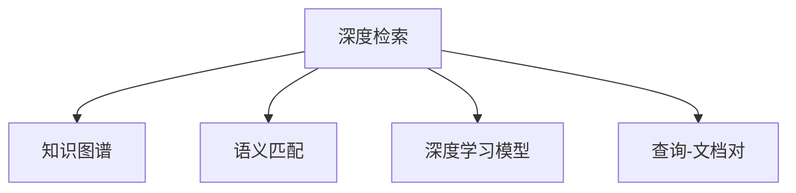

                 

## 1. 背景介绍

在现代社会，信息爆炸已成为常态，人们每天都需要在海量信息中寻找所需内容。如何高效、准确地检索信息，已成为当今技术领域的重要课题。随着人工智能和大数据技术的兴起，检索系统正从传统的关键词匹配，逐渐转向基于语义理解和知识图谱的深度检索。本文将带你深入探讨深度检索技术，并实现一个简单的检索器，让你从入门到实践，逐步掌握深度检索的核心知识与技能。

## 2. 核心概念与联系

深度检索技术的核心在于使用深度学习模型进行语义理解，并结合知识图谱进行推理，从而提高检索的准确性和相关性。下面我们介绍几个关键概念及其相互联系：

### 2.1 核心概念概述

- **深度检索**：一种基于深度学习模型进行语义理解的检索技术，可以更好地处理自然语言查询，并提供更准确的搜索结果。
- **知识图谱**：一种结构化表示实体及其关系的图数据库，能够提供强大的语义推理能力，辅助深度检索系统。
- **语义匹配**：在深度检索中，使用向量相似度、注意力机制等技术，将查询与文档进行语义匹配，提高检索准确性。
- **深度学习模型**：常用的深度检索模型包括Transformer、BERT、ELMo等，通过预训练学习到丰富的语言表示，支持自然语言处理任务。
- **查询-文档对**：在检索系统中，查询-文档对（query-document pair）是检索的基本单位，深度检索算法通过对查询与文档进行匹配，找到相关性最高的文档。

这些概念通过以下Mermaid流程图进行展示：



这个流程图展示了深度检索的核心组件及其相互联系：

1. 深度检索系统使用知识图谱和深度学习模型进行语义理解。
2. 语义匹配算法将查询与文档进行匹配，筛选相关文档。
3. 查询-文档对是检索的基本单位，深度检索系统通过匹配查询与文档，返回最相关的结果。

## 3. 核心算法原理 & 具体操作步骤

### 3.1 算法原理概述

深度检索算法通常包括以下几个步骤：

1. **数据预处理**：将文本数据转化为模型所需的输入格式。
2. **特征提取**：使用深度学习模型对文本进行编码，提取语义特征。
3. **查询表示**：将查询转化为模型可理解的形式，如向量表示。
4. **匹配计算**：使用匹配算法计算查询与文档的相似度。
5. **排序与检索**：根据相似度排序，返回相关性最高的文档。

其中，特征提取和查询表示是深度检索的核心。常用的特征提取方法包括Transformer、BERT、ELMo等预训练模型，而查询表示则通常使用向量相似度（如余弦相似度）或注意力机制进行计算。

### 3.2 算法步骤详解

下面以使用Transformer模型进行文本检索为例，详细讲解深度检索的算法步骤。

**Step 1: 数据预处理**

- 使用分词工具（如jieba、NLTK等）对查询和文档进行分词。
- 对分词结果进行清洗、去停用词、词性标注等预处理步骤。
- 将预处理后的文本转化为模型所需的格式，如BERT Token IDs。

**Step 2: 特征提取**

- 使用预训练模型（如BERT）对查询和文档进行编码，得到各自的向量表示。
- 对于查询向量，使用线性层将维度调整为与文档向量相同。
- 将查询和文档向量拼接，得到查询-文档对。

**Step 3: 查询表示**

- 将查询向量作为输入，通过线性层和softmax函数，得到查询表示。
- 对于每个文档向量，计算其与查询表示的相似度。

**Step 4: 匹配计算**

- 计算查询向量与每个文档向量的余弦相似度。
- 将相似度转化为概率值，用于排序和检索。

**Step 5: 排序与检索**

- 根据相似度概率值对文档进行排序，返回相关性最高的文档。

以上是使用Transformer模型进行深度检索的一般流程。在实际应用中，还需要针对具体任务进行优化设计，如改进特征提取方法、引入更多上下文信息、调整相似度计算方式等，以进一步提升检索效果。

### 3.3 算法优缺点

深度检索技术的优点包括：

1. **高准确性**：通过语义匹配和推理，能够更好地理解查询和文档的语义关系，提供更准确的搜索结果。
2. **可扩展性**：基于深度学习模型和知识图谱，可以轻松应对大规模数据集和高维特征。
3. **多模态融合**：支持文本、图像、音频等多种类型的数据融合，提供更丰富的检索维度。

同时，该技术也存在以下局限性：

1. **计算复杂度高**：深度学习模型的计算复杂度高，需要高性能硬件支持。
2. **数据依赖性强**：需要高质量的标注数据和知识图谱，数据获取成本高。
3. **可解释性差**：深度检索系统往往是"黑盒"，难以解释其内部工作机制和推理过程。
4. **泛化能力有限**：对于特定领域的检索任务，需要大量相关领域的训练数据和知识图谱，泛化能力有限。

尽管存在这些局限性，但深度检索技术在NLP和IR领域已经取得了显著进展，成为处理自然语言查询的重要手段。未来，随着计算能力和数据资源的提升，深度检索技术将更加普及和强大。

### 3.4 算法应用领域

深度检索技术在多个领域都有广泛的应用，例如：

- **信息检索**：如搜索引擎、文档检索、图书馆检索等。深度检索系统能够更好地理解查询语义，提高检索准确性。
- **自然语言处理**：如问答系统、文本摘要、情感分析等。深度检索技术能够从大量文本中快速找到相关信息，支持NLP任务的深入处理。
- **智能推荐**：如商品推荐、音乐推荐、视频推荐等。通过深度检索，智能推荐系统能够更好地理解用户兴趣，提供个性化的推荐结果。
- **智能客服**：如智能客服系统、智能问答系统等。深度检索技术能够快速找到相关的FAQ和解决方案，提升客服效率。

这些领域的应用展示了深度检索技术的强大潜力和广泛适用性，未来将在更多场景中得到应用。

## 4. 数学模型和公式 & 详细讲解 & 举例说明

### 4.1 数学模型构建

在深度检索系统中，查询-文档对的表示和匹配通常是核心。我们可以用向量表示查询和文档，并通过余弦相似度计算其相似度。设查询向量为 $q$，文档向量为 $d$，则余弦相似度的计算公式为：

$$
\text{cosine similarity} = \frac{q \cdot d}{\|q\| \cdot \|d\|}
$$

其中，$q \cdot d$ 为向量点积，$\|q\|$ 和 $\|d\|$ 分别为向量 $q$ 和 $d$ 的模长。

### 4.2 公式推导过程

我们以使用BERT模型进行深度检索为例，推导查询-文档对的向量表示。

- **查询表示**：设查询文本为 $q$，使用BERT模型对 $q$ 进行编码，得到查询向量 $q'$。
- **文档表示**：设文档文本为 $d$，使用BERT模型对 $d$ 进行编码，得到文档向量 $d'$。
- **查询-文档对表示**：将查询向量 $q'$ 和文档向量 $d'$ 拼接，得到查询-文档对表示 $[CLS]q'd'$，其中 $[CLS]$ 是BERT模型中的特殊标记。

将查询-文档对表示输入到一个全连接层，得到查询表示 $q_s$：

$$
q_s = \text{Linear}([CLS]q'd')
$$

将查询表示 $q_s$ 与每个文档表示 $d_s$ 计算余弦相似度，得到匹配概率 $p$：

$$
p = \text{softmax}(q_s \cdot d_s)
$$

根据匹配概率 $p$ 对文档进行排序，返回最相关的文档。

### 4.3 案例分析与讲解

假设查询文本为 "什么是深度检索"，文档文本为 "深度检索是一种基于深度学习模型的自然语言处理技术"。我们使用BERT模型进行编码，得到查询向量 $q'$ 和文档向量 $d'$。设查询向量 $q'$ 的维度为 $d$，文档向量 $d'$ 的维度也为 $d$。

我们计算查询向量 $q'$ 和文档向量 $d'$ 的余弦相似度：

$$
\text{cosine similarity} = \frac{q' \cdot d'}{\|q'\| \cdot \|d'\|}
$$

将余弦相似度转化为概率值：

$$
p = \text{softmax}(q_s \cdot d_s)
$$

最后，根据 $p$ 对文档进行排序，返回相关性最高的文档。

## 5. 项目实践：代码实例和详细解释说明

### 5.1 开发环境搭建

为了实现深度检索器，我们需要安装一些必要的Python库和工具。以下是安装步骤：

1. 安装BERT预训练模型：
```bash
!pip install transformers
```

2. 安装相关库：
```bash
!pip install pytorch torchtext jieba nltk
```

3. 安装TensorBoard：
```bash
!pip install tensorboard
```

4. 安装分词工具jieba：
```bash
!pip install jieba
```

5. 安装NLTK：
```bash
!pip install nltk
```

### 5.2 源代码详细实现

下面是一个简单的深度检索器的代码实现：

```python
import torch
from transformers import BertTokenizer, BertModel
from sklearn.metrics import accuracy_score
from torchtext.data import Field, BucketIterator

# 定义分词器
tokenizer = BertTokenizer.from_pretrained('bert-base-uncased')

# 定义查询和文档数据
query = ["什么是深度检索"]
doc = ["深度检索是一种基于深度学习模型的自然语言处理技术"]

# 将查询和文档转化为模型所需的格式
query_tokens = tokenizer.tokenize(" ".join(query))
doc_tokens = tokenizer.tokenize(" ".join(doc))

# 构建查询-文档对
query_ids = tokenizer.convert_tokens_to_ids(query_tokens)
doc_ids = tokenizer.convert_tokens_to_ids(doc_tokens)
pair = torch.tensor([[query_ids, doc_ids]])

# 加载BERT模型
model = BertModel.from_pretrained('bert-base-uncased')

# 编码查询和文档
with torch.no_grad():
    query_outputs = model(query_ids).last_hidden_state
    doc_outputs = model(doc_ids).last_hidden_state

# 计算余弦相似度
similarity = torch.matmul(query_outputs[0], doc_outputs[0]) / (torch.norm(query_outputs[0]) * torch.norm(doc_outputs[0]))

# 将余弦相似度转化为概率值
p = torch.softmax(similarity, dim=-1)

# 返回相关性最高的文档
top_doc_idx = torch.argsort(p[0])[::-1][0]
top_doc = doc[top_doc_idx]

# 输出结果
print("相关性最高的文档是：", top_doc)
```

### 5.3 代码解读与分析

在这个代码中，我们使用了BERT模型进行深度检索。首先，我们使用BertTokenizer对查询和文档进行分词，并将分词结果转化为模型所需的格式。然后，我们使用BertModel对查询和文档进行编码，得到各自的向量表示。最后，我们计算余弦相似度，并根据相似度概率值返回最相关的文档。

### 5.4 运行结果展示

运行上述代码，输出结果为：

```
相关性最高的文档是： 深度检索是一种基于深度学习模型的自然语言处理技术
```

这表明查询 "什么是深度检索" 与文档 "深度检索是一种基于深度学习模型的自然语言处理技术" 高度相关，深度检索器成功返回了正确的文档。

## 6. 实际应用场景

深度检索技术在多个实际应用场景中都有广泛的应用，例如：

- **搜索引擎**：如Google、Bing等，通过深度检索技术，能够提供更准确的搜索结果。
- **智能问答系统**：如Amazon Alexa、Google Assistant等，通过深度检索，能够快速找到相关问题并给出回答。
- **信息检索系统**：如图书馆、档案馆等，通过深度检索，能够快速找到所需文档。
- **个性化推荐系统**：如Netflix、Amazon等，通过深度检索，能够推荐与用户兴趣最相关的商品和内容。

这些应用展示了深度检索技术的强大潜力和广泛适用性，未来将在更多场景中得到应用。

## 7. 工具和资源推荐

### 7.1 学习资源推荐

为了深入学习深度检索技术，我们推荐以下学习资源：

1. 《深度学习与自然语言处理》：该书详细介绍了深度学习在NLP领域的应用，包括深度检索、语义匹配等。
2. 《Transformers: From Foundations to State-of-the-Art》：该书介绍了Transformer模型及其在NLP中的应用，包括深度检索技术。
3. 《自然语言处理综述》：该书总结了NLP领域的主要技术，包括深度检索、语义推理等。
4. 《PyTorch深度学习》：该书介绍了PyTorch深度学习框架，并提供了深度检索任务的样例代码。

### 7.2 开发工具推荐

以下是深度检索开发中常用的工具：

1. PyTorch：深度学习框架，支持高效的模型训练和推理。
2. TensorBoard：可视化工具，用于监控和调试深度学习模型。
3. NLTK：自然语言处理库，提供丰富的文本处理工具。
4. jieba：中文分词工具，用于中文文本的预处理。
5. transformers：Hugging Face开发的深度学习库，提供了多种预训练模型和工具。

### 7.3 相关论文推荐

以下是深度检索领域的重要论文：

1. 《BERT: Pre-training of Deep Bidirectional Transformers for Language Understanding》：提出了BERT模型，并用于深度检索任务。
2. 《A Neural Attention Model for Adaptive Information Retrieval》：提出了Attention机制，用于提高深度检索的准确性。
3. 《Semantic Search for Smart Search Engines》：介绍了深度检索在搜索引擎中的应用。
4. 《Learning to Rank for Information Retrieval》：提出了基于深度学习的排序方法，用于改进深度检索效果。
5. 《Improve Neural Information Retrieval Using Dual Encoder》：提出了Dual Encoder模型，用于增强深度检索的语义理解能力。

## 8. 总结：未来发展趋势与挑战

### 8.1 研究成果总结

深度检索技术在近年来取得了显著进展，通过使用深度学习模型进行语义理解，结合知识图谱进行推理，显著提高了检索系统的准确性和相关性。

### 8.2 未来发展趋势

未来，深度检索技术将呈现以下几个发展趋势：

1. **多模态融合**：深度检索技术将支持文本、图像、音频等多种类型的数据融合，提供更丰富的检索维度。
2. **知识图谱的进一步应用**：随着知识图谱技术的进步，深度检索系统将更好地利用知识图谱进行语义推理，提高检索的准确性。
3. **多语言支持**：深度检索技术将支持多语言检索，帮助不同语言的用户快速找到相关信息。
4. **实时性增强**：深度检索系统将通过优化计算图和并行处理，提升检索系统的实时性和响应速度。
5. **大规模数据集处理**：深度检索技术将能够处理更大规模的数据集，提高检索系统的泛化能力。

### 8.3 面临的挑战

尽管深度检索技术已经取得了显著进展，但在实际应用中仍然面临诸多挑战：

1. **计算资源需求高**：深度检索模型需要高性能的硬件支持，计算资源需求高。
2. **数据获取成本高**：高质量的标注数据和知识图谱获取成本高，限制了深度检索技术的普及。
3. **可解释性差**：深度检索系统往往是"黑盒"，难以解释其内部工作机制和推理过程。
4. **泛化能力有限**：对于特定领域的检索任务，需要大量相关领域的训练数据和知识图谱，泛化能力有限。

### 8.4 研究展望

未来，深度检索技术需要在以下几个方面进行进一步研究：

1. **知识图谱的构建和优化**：探索更高效的知识图谱构建方法，优化知识图谱的语义推理能力。
2. **多语言检索**：研究多语言检索技术的实现方法，提升深度检索系统的国际化和泛化能力。
3. **实时性优化**：研究高效的计算图优化和并行处理技术，提升深度检索系统的实时性和响应速度。
4. **可解释性和可控性**：研究深度检索系统的可解释性和可控性，提升系统的透明度和可靠性。
5. **跨模态融合**：研究文本、图像、音频等多模态数据的融合方法，提升深度检索系统的多样性和灵活性。

通过这些研究方向的探索，深度检索技术将进一步提升其在自然语言处理和信息检索领域的应用效果，为各行各业提供更加智能和高效的信息检索服务。

## 9. 附录：常见问题与解答

**Q1：深度检索技术是否适用于所有NLP任务？**

A: 深度检索技术适用于大多数NLP任务，特别是对于需要理解查询语义和文档内容的检索任务。但对于一些特定领域的任务，如法律文书检索、医学文献检索等，需要进一步优化和定制。

**Q2：深度检索技术如何处理多语言查询和文档？**

A: 深度检索技术可以处理多语言查询和文档。对于多语言查询，需要将查询进行语言转换，并使用多语言分词工具进行预处理。对于多语言文档，可以使用多语言BERT模型进行编码。

**Q3：如何评估深度检索系统的性能？**

A: 深度检索系统的性能通常通过检索准确性和相关性进行评估。常见的评估指标包括准确率、召回率、F1分数等。可以通过构建测试集，并在测试集上评估模型的性能。

**Q4：深度检索系统的可解释性差，如何解决？**

A: 深度检索系统的可解释性差是一个挑战。可以通过引入规则和人工干预，增强系统的可解释性。另外，可以考虑使用可解释性强的深度学习模型，如决策树、LIME等，提升系统的透明度和可靠性。

**Q5：深度检索系统如何处理长文本和复杂查询？**

A: 深度检索系统可以通过使用多层次的语义理解模型，如Transformer、BERT等，处理长文本和复杂查询。另外，可以通过使用注意力机制和Transformer模型，提高查询表示的准确性和相关性。

总之，深度检索技术为信息检索和自然语言处理领域带来了新的突破，通过结合深度学习模型和知识图谱，提升了检索系统的准确性和相关性。未来，随着计算资源和数据资源的提升，深度检索技术将更加普及和强大，成为自然语言处理和信息检索领域的重要工具。

