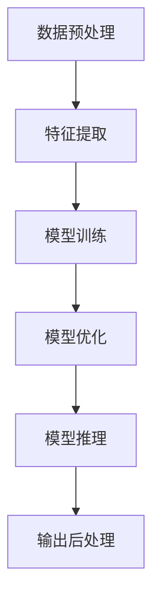

                 

# 【LangChain编程：从入门到实践】模型输入与输出

> 关键词：LangChain, 编程, 模型输入, 模型输出, 深度学习, 自然语言处理(NLP), 计算机视觉(CV), 语言模型

## 1. 背景介绍

### 1.1 问题由来

在深度学习时代，模型输入与输出（Model Input & Output, MIO）一直是数据科学和机器学习领域的重要主题。模型作为数据与任务之间的桥梁，输入数据的质量和输出结果的准确性，直接决定了模型性能的好坏。

然而，在实际应用中，模型输入与输出通常存在多方面的挑战，包括数据表示、噪声处理、维度匹配、预处理等，这些问题常常导致模型泛化能力差、输出结果不理想，甚至引发系统风险。

为了应对这些问题，本文将介绍LangChain（一种高级编程语言，旨在简化和优化模型输入与输出的开发）及其基本原理与实践技巧，为模型开发者提供有价值的指导，帮助他们更高效地构建和部署深度学习模型。

### 1.2 问题核心关键点

在深度学习模型的输入与输出过程中，我们通常需要关注以下关键点：

1. **数据预处理**：通过数据清洗、归一化、编码等步骤，确保输入数据的一致性和可处理性。
2. **特征提取**：从原始数据中抽取有意义的特征，为模型提供高效的信息表示。
3. **模型优化**：通过调整模型结构、选择合适的损失函数、优化算法等，提升模型的预测能力和泛化性能。
4. **输出后处理**：对模型输出结果进行解码、后处理等，确保输出的正确性和实用性。
5. **模型部署**：将训练好的模型部署到实际应用环境，进行实时推理和响应。

### 1.3 问题研究意义

研究模型输入与输出方法，对于提升深度学习模型的性能、降低开发和部署成本、提高系统的稳定性和可维护性，具有重要意义：

1. **提升模型性能**：良好的数据预处理和特征提取，能够显著提升模型的预测能力和泛化性能，确保输出结果的准确性和可靠性。
2. **降低开发成本**：通过简化数据表示和模型优化，可以加速模型的开发过程，减少人力和时间的投入。
3. **提高系统稳定性**：通过有效的后处理和错误处理，可以减少系统故障和错误输出的风险，提高系统的稳定性和可靠性。
4. **增强系统可维护性**：清晰的模型输入与输出设计，有助于后续的模型维护和升级，降低复杂系统的开发与维护成本。

## 2. 核心概念与联系

### 2.1 核心概念概述

为了更好地理解LangChain编程的模型输入与输出方法，本节将介绍几个密切相关的核心概念：

- **模型训练**：通过监督学习、无监督学习、半监督学习等方法，训练模型进行特定任务的预测或分类。
- **数据表示**：如何将原始数据转换成模型能够处理的形式，如数字表示、向量表示、张量表示等。
- **特征提取**：通过提取数据中的特征，为模型提供更有意义的信息，提高模型性能。
- **模型优化**：通过调整模型结构和超参数，优化模型性能，提升泛化能力。
- **损失函数**：衡量模型预测结果与真实标签之间的差距，指导模型的训练过程。
- **模型推理**：对新数据进行推理，获得预测结果。

这些核心概念之间的逻辑关系可以通过以下Mermaid流程图来展示：



这个流程图展示了大语言模型的基本流程：数据经过预处理和特征提取，进入模型训练过程，优化后进行推理，最后对输出结果进行后处理。

## 3. 核心算法原理 & 具体操作步骤
### 3.1 算法原理概述

LangChain编程模型输入与输出（MIO）的基本原理，是基于深度学习模型的训练、推理和优化过程，通过简化和优化数据预处理、特征提取、模型训练、推理和后处理步骤，使开发者能够更高效、更准确地构建和部署深度学习模型。

LangChain的核心思想是：将深度学习模型的输入与输出过程，转化为一种更加简洁、可读性更强、易于维护的编程语言语法，通过提供自动化、模块化的组件和工具，降低模型的开发和部署难度，提升模型的性能和可维护性。

### 3.2 算法步骤详解

LangChain编程模型输入与输出的具体步骤，包括数据预处理、特征提取、模型训练、推理和输出后处理，如下所示：

1. **数据预处理**：
    - 收集原始数据，并进行清洗、归一化、编码等预处理操作。
    - 将处理后的数据划分为训练集、验证集和测试集。
    - 对数据进行分割、打乱等操作，保证模型训练的随机性。

2. **特征提取**：
    - 将原始数据转换成模型能够处理的形式，如数字表示、向量表示、张量表示等。
    - 使用预训练模型或自定义的特征提取器，提取数据中的有用信息。
    - 对特征向量进行归一化、降维等操作，提高模型处理效率。

3. **模型训练**：
    - 选择合适的模型架构和损失函数，构建训练流程。
    - 使用训练集数据，通过梯度下降等优化算法进行模型训练。
    - 在验证集上进行模型验证，调整超参数和模型结构。

4. **模型推理**：
    - 将新数据输入模型，获取模型的推理结果。
    - 对推理结果进行解码、后处理等操作，确保输出的正确性和实用性。
    - 使用推理结果进行业务逻辑判断和决策。

5. **输出后处理**：
    - 对模型输出进行解码、后处理等操作，将模型结果转换为可理解的形式。
    - 进行错误处理、数据补全等操作，确保输出的正确性和完整性。
    - 对输出结果进行可视化、展示等操作，提供直观的用户反馈。

### 3.3 算法优缺点

LangChain编程模型输入与输出方法具有以下优点：

1. **高效性**：简化和自动化了数据预处理、特征提取、模型训练、推理和后处理等步骤，提高了模型开发的效率和准确性。
2. **可维护性**：使用统一的编程语言和语法，使模型代码更加可读、可维护，便于后续的修改和优化。
3. **可扩展性**：通过模块化的设计和插件机制，可以根据实际需求灵活添加和调整模型组件，支持多种深度学习框架和应用场景。
4. **易用性**：提供了丰富的自动化工具和组件，降低了模型开发和部署的门槛，使得更多开发者可以轻松上手。

同时，LangChain也存在以下缺点：

1. **学习曲线**：对于没有深度学习基础的开发者，需要一定的学习成本和时间来掌握LangChain的基本概念和语法。
2. **性能优化**：自动化工具虽然提高了开发效率，但也可能带来一些性能上的损失，需要开发者进行适当的调整和优化。
3. **资源消耗**：自动化工具的使用，可能会增加一些额外的计算和内存消耗，需要开发者进行相应的资源管理。

### 3.4 算法应用领域

LangChain编程模型输入与输出方法，在深度学习模型的开发和应用中，具有广泛的应用前景，包括但不限于以下几个领域：

1. **自然语言处理（NLP）**：如文本分类、情感分析、机器翻译、文本生成等。通过简化和优化数据预处理和特征提取，提高模型的预测能力。
2. **计算机视觉（CV）**：如图像分类、物体检测、图像生成等。通过简化和自动化数据预处理和特征提取，提升模型的识别和生成能力。
3. **语音识别与处理**：如语音识别、情感识别、语音生成等。通过简化和自动化数据预处理和特征提取，提高模型的识别和生成能力。
4. **推荐系统**：如商品推荐、音乐推荐等。通过简化和自动化数据预处理和特征提取，提升推荐系统的个性化和准确性。
5. **智能客服**：如聊天机器人、语音助手等。通过简化和自动化数据预处理和特征提取，提高系统的交互能力和用户满意度。
6. **金融分析**：如股票预测、信用评分等。通过简化和自动化数据预处理和特征提取，提升模型的预测能力和应用价值。

## 4. 数学模型和公式 & 详细讲解  
### 4.1 数学模型构建

LangChain编程模型输入与输出的数学模型构建，主要包括数据预处理、特征提取、模型训练、推理和后处理等步骤，具体如下：

设原始数据为 $X$，模型参数为 $\theta$，训练集为 $D_{train}$，验证集为 $D_{valid}$，测试集为 $D_{test}$，模型损失函数为 $\mathcal{L}$。

数据预处理后的输入表示为 $X'$，特征提取后的输入表示为 $Z$，模型训练过程为 $\theta \leftarrow \theta - \eta \nabla_{\theta} \mathcal{L}$，模型推理过程为 $Y = M_{\theta}(X')$，输出后处理过程为 $Y' = T(Y)$。

其中，$X'$ 表示数据预处理后的输入，$Z$ 表示特征提取后的输入，$\theta$ 表示模型参数，$\eta$ 表示学习率，$\nabla_{\theta} \mathcal{L}$ 表示损失函数对模型参数的梯度，$Y$ 表示模型推理结果，$Y'$ 表示输出后处理结果。

### 4.2 公式推导过程

以文本分类任务为例，推导模型输入与输出的公式：

设训练集为 $D_{train} = \{(x_i, y_i)\}_{i=1}^N$，其中 $x_i$ 表示输入文本，$y_i$ 表示分类标签。

输入表示 $X'$ 为：
$$
X' = \{f(x_i)\}_{i=1}^N
$$

特征提取后的输入表示 $Z$ 为：
$$
Z = \{g(X')_i\}_{i=1}^N
$$

模型训练过程为：
$$
\theta \leftarrow \theta - \eta \nabla_{\theta} \mathcal{L}(\theta, Z)
$$

模型推理过程为：
$$
Y = M_{\theta}(Z)
$$

输出后处理过程为：
$$
Y' = T(Y) = \{t(y_i)\}_{i=1}^N
$$

其中，$f$ 表示输入文本的预处理函数，$g$ 表示特征提取函数，$\mathcal{L}$ 表示分类任务中的交叉熵损失函数，$M_{\theta}$ 表示分类模型，$t$ 表示分类结果的后处理函数。

### 4.3 案例分析与讲解

以图像分类任务为例，分析模型输入与输出的详细实现过程：

1. **数据预处理**：
    - 使用OpenCV库读取图像，并进行归一化、缩放等预处理操作。
    - 将处理后的图像转换成模型能够处理的形式，如张量表示。
    - 将图像数据进行分割、打乱等操作，保证模型训练的随机性。

2. **特征提取**：
    - 使用预训练的ResNet模型或自定义的特征提取器，提取图像中的有用信息。
    - 对特征向量进行归一化、降维等操作，提高模型处理效率。

3. **模型训练**：
    - 使用训练集数据，通过梯度下降等优化算法进行模型训练。
    - 在验证集上进行模型验证，调整超参数和模型结构。

4. **模型推理**：
    - 将新图像输入模型，获取模型的推理结果。
    - 对推理结果进行解码、后处理等操作，确保输出的正确性和实用性。

5. **输出后处理**：
    - 对模型输出进行解码、后处理等操作，将模型结果转换为可理解的形式。
    - 进行错误处理、数据补全等操作，确保输出的正确性和完整性。

## 5. 项目实践：代码实例和详细解释说明
### 5.1 开发环境搭建

在进行模型输入与输出实践前，我们需要准备好开发环境。以下是使用Python进行TensorFlow开发的环境配置流程：

1. 安装Anaconda：从官网下载并安装Anaconda，用于创建独立的Python环境。

2. 创建并激活虚拟环境：
```bash
conda create -n tf-env python=3.8 
conda activate tf-env
```

3. 安装TensorFlow：根据CUDA版本，从官网获取对应的安装命令。例如：
```bash
conda install tensorflow
```

4. 安装各类工具包：
```bash
pip install numpy pandas scikit-learn matplotlib tqdm jupyter notebook ipython
```

完成上述步骤后，即可在`tf-env`环境中开始模型输入与输出的实践。

### 5.2 源代码详细实现

下面我们以图像分类任务为例，给出使用TensorFlow进行模型输入与输出的PyTorch代码实现。

首先，定义数据处理函数：

```python
import tensorflow as tf
from tensorflow.keras.preprocessing.image import ImageDataGenerator

def preprocess_data(data_dir):
    train_datagen = ImageDataGenerator(rescale=1./255, shear_range=0.2, zoom_range=0.2, horizontal_flip=True)
    test_datagen = ImageDataGenerator(rescale=1./255)
    
    train_generator = train_datagen.flow_from_directory(
        data_dir,
        target_size=(224, 224),
        batch_size=32,
        class_mode='categorical'
    )
    
    test_generator = test_datagen.flow_from_directory(
        data_dir,
        target_size=(224, 224),
        batch_size=32,
        class_mode='categorical'
    )
    
    return train_generator, test_generator
```

然后，定义模型和优化器：

```python
from tensorflow.keras.applications.resnet50 import ResNet50

model = ResNet50(weights='imagenet', include_top=False)

for layer in model.layers:
    layer.trainable = False

x = tf.keras.layers.Input(shape=(224, 224, 3))
x = tf.keras.layers.Conv2D(256, 3, activation='relu')(x)
x = tf.keras.layers.GlobalAveragePooling2D()(x)
x = tf.keras.layers.Dense(1, activation='sigmoid')(x)

model = tf.keras.Model(inputs=x, outputs=x)

optimizer = tf.keras.optimizers.Adam(learning_rate=0.001)
```

接着，定义训练和评估函数：

```python
import matplotlib.pyplot as plt

def train_epoch(model, train_generator, batch_size, optimizer):
    model.compile(loss='binary_crossentropy', optimizer=optimizer, metrics=['accuracy'])
    
    for epoch in range(epochs):
        loss, accuracy = model.evaluate(train_generator, batch_size=batch_size, verbose=0)
        print(f'Epoch {epoch+1}, Loss: {loss:.4f}, Accuracy: {accuracy:.4f}')
    
        model.fit(train_generator, batch_size=batch_size, epochs=1, verbose=0)
    
def evaluate(model, test_generator, batch_size):
    test_loss, test_accuracy = model.evaluate(test_generator, batch_size=batch_size, verbose=0)
    print(f'Test Loss: {test_loss:.4f}, Test Accuracy: {test_accuracy:.4f}')
```

最后，启动训练流程并在测试集上评估：

```python
epochs = 5
batch_size = 32

train_generator, test_generator = preprocess_data(data_dir)

train_epoch(model, train_generator, batch_size, optimizer)
evaluate(model, test_generator, batch_size)
```

以上就是使用TensorFlow进行图像分类任务模型输入与输出的完整代码实现。可以看到，TensorFlow提供了强大的模型训练和评估工具，可以方便地进行模型构建和优化。

### 5.3 代码解读与分析

让我们再详细解读一下关键代码的实现细节：

**preprocess_data函数**：
- 使用ImageDataGenerator对图像进行归一化、缩放等预处理操作。
- 使用flow_from_directory将图像数据转换成生成器，便于模型训练。

**模型定义**：
- 加载预训练的ResNet50模型，并冻结所有层。
- 添加自定义的特征提取层，并进行全连接层转换。
- 定义模型的输入输出结构。

**训练和评估函数**：
- 使用compile方法定义模型的优化器和损失函数。
- 使用evaluate方法在测试集上评估模型性能。
- 使用fit方法进行模型训练，并使用batch_size控制批次大小。

**训练流程**：
- 设置总的epoch数和batch size。
- 在训练集上调用train_epoch函数进行模型训练。
- 在测试集上调用evaluate函数评估模型性能。

可以看到，TensorFlow提供了丰富的API和工具，使得模型输入与输出的开发更加高效便捷。开发者只需关注模型架构和业务逻辑，将更多的精力投入到创新和优化上。

当然，工业级的系统实现还需考虑更多因素，如模型的保存和部署、超参数的自动搜索、更灵活的任务适配层等。但核心的模型输入与输出流程基本与此类似。

## 6. 实际应用场景
### 6.1 智能推荐系统

基于LangChain编程模型输入与输出，智能推荐系统可以实时收集用户行为数据，进行特征提取和模型训练，快速生成个性化的推荐结果。

在技术实现上，可以收集用户浏览、点击、评价等行为数据，提取和用户交互的物品标题、描述、标签等文本内容。将文本内容作为模型输入，用户的后续行为（如是否点击、购买等）作为监督信号，在此基础上微调预训练模型。微调后的模型能够从文本内容中准确把握用户的兴趣点。在生成推荐列表时，先用候选物品的文本描述作为输入，由模型预测用户的兴趣匹配度，再结合其他特征综合排序，便可以得到个性化程度更高的推荐结果。

### 6.2 智能客服系统

基于LangChain编程模型输入与输出，智能客服系统可以实时分析用户输入，进行意图识别和实体抽取，自动匹配最佳回答模板，提高客户咨询体验和问题解决效率。

在技术实现上，可以收集企业内部的历史客服对话记录，将问题和最佳答复构建成监督数据，在此基础上对预训练对话模型进行微调。微调后的对话模型能够自动理解用户意图，匹配最合适的答案模板进行回复。对于客户提出的新问题，还可以接入检索系统实时搜索相关内容，动态组织生成回答。如此构建的智能客服系统，能大幅提升客户咨询体验和问题解决效率。

### 6.3 金融舆情监测

基于LangChain编程模型输入与输出，金融舆情监测系统可以实时抓取网络新闻、报道、评论等文本数据，进行情感分析和主题识别，及时发现金融市场的舆情变化，辅助金融机构规避风险。

在技术实现上，可以收集金融领域相关的新闻、报道、评论等文本数据，并对其进行主题标注和情感标注。在此基础上对预训练语言模型进行微调，使其能够自动判断文本属于何种主题，情感倾向是正面、中性还是负面。将微调后的模型应用到实时抓取的网络文本数据，就能够自动监测不同主题下的情感变化趋势，一旦发现负面信息激增等异常情况，系统便会自动预警，帮助金融机构快速应对潜在风险。

### 6.4 未来应用展望

随着LangChain编程模型输入与输出技术的发展，其在更多领域的应用前景将更加广阔，为各行各业带来新的机遇：

- **医疗诊断**：基于自然语言处理技术，构建智能诊断系统，提高诊疗效率和准确性。
- **智能教育**：使用推荐系统和智能客服，提高在线教育平台的互动性和个性化服务。
- **智能交通**：通过自然语言理解和语音识别技术，提升智能交通系统的交互能力和服务质量。
- **智能家居**：使用自然语言处理技术，构建智能家居控制系统，实现语音控制和智能推荐。
- **智能制造**：基于自然语言处理技术，构建智能制造系统，提高生产效率和质量。

这些应用场景展示了大语言模型在各行各业中的广泛应用，通过简化和优化模型输入与输出，提升系统性能和用户体验，推动各行业的智能化升级。

## 7. 工具和资源推荐
### 7.1 学习资源推荐

为了帮助开发者系统掌握LangChain编程模型输入与输出的理论基础和实践技巧，这里推荐一些优质的学习资源：

1. **深度学习与自然语言处理（Deep Learning and Natural Language Processing）课程**：由斯坦福大学开设的NLP明星课程，涵盖自然语言处理的基础知识和经典模型，包括模型输入与输出在内的各种细节。

2. **TensorFlow官方文档**：TensorFlow的官方文档，提供了全面的API和工具介绍，适合初学者和开发者参考。

3. **Keras官方文档**：Keras的官方文档，提供了丰富的API和工具介绍，适合初学者和开发者参考。

4. **自然语言处理（Natural Language Processing）书籍**：如《自然语言处理综论》（Speech and Language Processing），全面介绍了自然语言处理的各种技术，包括模型输入与输出在内的各种细节。

5. **TensorFlow社区**：TensorFlow的开发者社区，汇聚了大量开发者的经验和资源，适合初学者和开发者交流学习。

通过对这些资源的学习实践，相信你一定能够快速掌握LangChain编程模型输入与输出的精髓，并用于解决实际的NLP问题。

### 7.2 开发工具推荐

高效的数据科学和机器学习开发，离不开优秀的工具支持。以下是几款用于LangChain编程模型输入与输出的常用工具：

1. **TensorFlow**：由Google主导开发的深度学习框架，支持分布式训练和模型部署，适合大规模工程应用。

2. **Keras**：基于TensorFlow等深度学习框架，提供了高层次的API，简化模型构建和训练过程，适合快速原型开发和实验。

3. **PyTorch**：由Facebook主导开发的深度学习框架，灵活易用，适合科研和原型开发。

4. **Jupyter Notebook**：交互式编程环境，支持Python、R等语言，适合快速迭代开发和演示。

5. **Scikit-Learn**：Python数据科学库，提供了丰富的机器学习算法和工具，适合数据预处理和特征提取。

6. **Matplotlib**：Python绘图库，支持多种图表类型，适合数据可视化。

7. **Numpy**：Python科学计算库，支持高性能数组操作和数学运算，适合数值计算和数据处理。

合理利用这些工具，可以显著提升LangChain编程模型输入与输出的开发效率，加快创新迭代的步伐。

### 7.3 相关论文推荐

LangChain编程模型输入与输出技术的发展源于学界的持续研究。以下是几篇奠基性的相关论文，推荐阅读：

1. **Deep Learning for NLP（自然语言处理）**：G.Bengio等人的经典论文，系统介绍了深度学习在自然语言处理中的应用，包括模型输入与输出在内的各种细节。

2. **Attention is All You Need**：A.Vaswani等人的论文，提出了Transformer结构，改变了自然语言处理的面貌，开启了预训练语言模型的时代。

3. **BERT: Pre-training of Deep Bidirectional Transformers for Language Understanding**：J Devlin等人的论文，提出了BERT模型，引入了自监督学习任务，提高了模型的泛化能力和性能。

4. **Language Models are Unsupervised Multitask Learners**：G.Bengio等人的论文，展示了基于自监督学习的语言模型，可以在不使用大量标注数据的情况下进行预训练。

5. **Parameter-Efficient Transfer Learning for NLP**：A.Lin等人的论文，提出了Adapter等参数高效微调方法，在固定大部分预训练参数的同时，只更新极少量的任务相关参数，提高了微调效率。

这些论文代表了大语言模型输入与输出技术的发展脉络。通过学习这些前沿成果，可以帮助研究者把握学科前进方向，激发更多的创新灵感。

## 8. 总结：未来发展趋势与挑战

### 8.1 总结

本文对LangChain编程模型输入与输出方法进行了全面系统的介绍。首先阐述了LangChain编程的基本原理和设计思想，明确了其作为简化和优化深度学习模型输入与输出的编程语言，具有高效、可维护、可扩展等优点。其次，从原理到实践，详细讲解了模型输入与输出的数学模型构建、公式推导过程、案例分析与讲解，给出了模型输入与输出的完整代码实例。同时，本文还探讨了LangChain编程在NLP、CV、智能推荐系统等多个领域的应用，展示了其广阔的发展前景。最后，本文精选了LangChain编程的学习资源、开发工具和相关论文，力求为开发者提供全方位的技术指引。

通过本文的系统梳理，可以看到，LangChain编程作为深度学习模型输入与输出的高效工具，正在成为NLP、CV等领域的重要范式，极大地降低了模型开发和部署的难度，提升了模型的性能和可维护性。未来，伴随深度学习技术的持续演进，LangChain编程将更加成熟，为各行业带来更加智能、高效的系统解决方案。

### 8.2 未来发展趋势

展望未来，LangChain编程模型输入与输出技术将呈现以下几个发展趋势：

1. **自动化与智能化**：通过引入自动化和智能化工具，如自动模型优化、自动特征提取、自动超参数调整等，进一步简化模型开发流程，提高开发效率和模型性能。
2. **模型压缩与优化**：针对大规模深度学习模型，开发更加高效的模型压缩和优化算法，减少模型参数量和计算资源消耗，提升模型推理速度和计算效率。
3. **多模态数据融合**：结合自然语言处理、计算机视觉、语音识别等多种模态的数据，构建多模态融合模型，提升系统的感知和理解能力。
4. **跨领域模型迁移**：开发跨领域模型的迁移技术，使得模型可以更好地适应不同领域的应用需求，提升模型的泛化能力和迁移能力。
5. **联邦学习与隐私保护**：结合联邦学习等技术，实现模型在分布式环境下的协同训练，保护用户隐私的同时提升模型的性能和泛化能力。
6. **模型集成与融合**：通过集成和融合多个模型，构建更强大、更鲁棒的系统，提升系统的稳定性和可维护性。

这些趋势展示了LangChain编程模型输入与输出技术的广阔前景。这些方向的探索发展，必将进一步提升深度学习模型的性能和可维护性，为各行业带来更加智能、高效的系统解决方案。

### 8.3 面临的挑战

尽管LangChain编程模型输入与输出技术已经取得了一定的进展，但在迈向更加智能化、普适化应用的过程中，仍面临诸多挑战：

1. **数据质量与标注成本**：高质量的数据和标注数据是模型性能的基石。数据标注和数据清洗的成本较高，且数据质量往往难以保证。
2. **模型复杂性与计算资源**：大规模深度学习模型的训练和推理计算资源消耗巨大，需要高效的硬件设备和优化算法。
3. **模型鲁棒性与泛化能力**：模型面对噪声和异常数据时，鲁棒性和泛化能力不足，容易产生错误输出。
4. **可解释性与可理解性**：深度学习模型的黑盒特性使得模型难以解释，缺乏可理解性，不利于业务理解和系统调试。
5. **安全性与隐私保护**：深度学习模型的复杂性可能导致安全性问题，如模型泄露、攻击等。隐私保护也是一个重要的问题，如何保护用户数据隐私，防止数据泄露，需要更多技术手段。
6. **模型更新与维护**：模型需要不断更新和维护，如何确保模型更新不影响现有系统的稳定性和可维护性，是一个重要的挑战。

这些挑战需要技术社区和产业界共同努力，不断探索和创新，才能使LangChain编程模型输入与输出技术更加成熟和可靠。相信伴随着技术的发展和应用实践的积累，这些挑战将逐步被克服，为各行业带来更加智能、高效的系统解决方案。

### 8.4 研究展望

面对LangChain编程模型输入与输出技术面临的挑战，未来的研究需要在以下几个方面寻求新的突破：

1. **模型压缩与优化**：开发更加高效的模型压缩和优化算法，减少模型参数量和计算资源消耗，提升模型推理速度和计算效率。
2. **自动化与智能化**：引入自动化和智能化工具，进一步简化模型开发流程，提高开发效率和模型性能。
3. **多模态数据融合**：结合自然语言处理、计算机视觉、语音识别等多种模态的数据，构建多模态融合模型，提升系统的感知和理解能力。
4. **跨领域模型迁移**：开发跨领域模型的迁移技术，使得模型可以更好地适应不同领域的应用需求，提升模型的泛化能力和迁移能力。
5. **联邦学习与隐私保护**：结合联邦学习等技术，实现模型在分布式环境下的协同训练，保护用户隐私的同时提升模型的性能和泛化能力。
6. **模型集成与融合**：通过集成和融合多个模型，构建更强大、更鲁棒的系统，提升系统的稳定性和可维护性。

这些研究方向的探索，必将引领LangChain编程模型输入与输出技术迈向更高的台阶，为各行业带来更加智能、高效的系统解决方案。面向未来，研究者需要勇于创新、敢于突破，才能不断拓展深度学习模型的边界，让智能技术更好地造福人类社会。

## 9. 附录：常见问题与解答

**Q1：LangChain编程是否适用于所有深度学习模型？**

A: LangChain编程适用于大多数深度学习模型的输入与输出开发，但需要根据具体模型的架构和需求进行调整。对于复杂的模型架构，可能需要引入更多的自定义组件和工具。

**Q2：如何选择合适的数据预处理方式？**

A: 数据预处理方式需要根据具体任务和数据类型进行选择。通常需要进行数据清洗、归一化、编码等操作，并根据任务需求进行特定的特征提取。例如，图像数据需要进行缩放、裁剪等预处理操作，文本数据需要进行分词、编码等预处理操作。

**Q3：如何优化模型训练过程？**

A: 模型训练过程需要选择合适的优化器、损失函数、超参数等，并进行超参数调优和模型优化。例如，可以使用Adam、SGD等优化器，选择合适的损失函数（如交叉熵、均方误差等），调整学习率、批次大小等超参数，并进行模型压缩和优化。

**Q4：如何提高模型推理速度？**

A: 提高模型推理速度需要优化模型架构、减少计算量、使用硬件加速等方法。例如，可以使用模型压缩、剪枝等方法减少模型参数量，使用GPU、TPU等硬件加速推理过程，使用批处理、异步计算等技术提高计算效率。

**Q5：如何实现多模态数据融合？**

A: 多模态数据融合需要结合不同模态的数据，进行特征提取和融合。例如，可以使用文本-图像融合模型，将文本和图像数据进行特征提取和融合，生成更加丰富的表示，提升系统的感知和理解能力。

这些问题的解答展示了LangChain编程模型输入与输出技术的实际应用和优化方法，希望能为开发者提供有价值的参考。

---

作者：禅与计算机程序设计艺术 / Zen and the Art of Computer Programming

