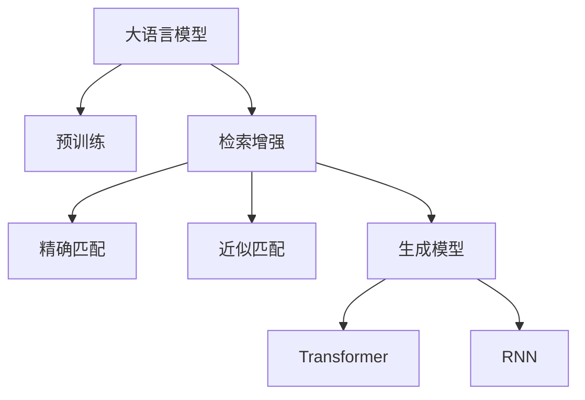

                 

# 【大模型应用开发 动手做AI Agent】何谓检索增强生成

> 关键词：大模型,检索增强,生成模型,知识图谱,预训练,微调

## 1. 背景介绍

### 1.1 问题由来
近年来，深度学习技术在自然语言处理(Natural Language Processing, NLP)领域取得了巨大突破，预训练大语言模型如GPT、BERT等，在大规模文本语料上预训练，获得了强大的语言理解和生成能力。然而，这些预训练模型通常需要巨量的无标签文本进行预训练，难以针对特定任务进行微调。针对这一问题，检索增强生成(Information Retrieval Enhanced Generation, IR-Enhanced Generation)方法应运而生，通过在大规模无标签文本上预训练大模型，并在特定领域或任务上检索相关的标注数据，辅助大模型进行生成，从而提升模型在特定任务上的性能。

### 1.2 问题核心关键点
检索增强生成的核心思想是将大模型的强大预训练能力与有标注数据结合，辅助生成过程，提高生成内容的准确性和相关性。检索增强生成主要包含以下几个关键点：

- **预训练**：在大规模无标签文本上预训练大语言模型，学习通用的语言表示。
- **检索**：在生成过程中，检索与当前输入相关的标注数据，辅助模型生成。
- **生成**：在检索到相关标注数据后，使用大模型进行文本生成。

### 1.3 问题研究意义
检索增强生成方法可以显著提升大语言模型在特定任务上的性能，尤其是对于数据量较小或数据分布不均的任务，可以有效降低微调的成本，提高模型的泛化能力。其研究意义在于：

1. **降低微调成本**：检索增强生成方法利用已有标注数据，降低了微调过程中对标注样本的需求，节约了标注成本。
2. **提高生成质量**：在生成过程中检索相关标注数据，提高了生成内容的准确性和相关性。
3. **提升泛化能力**：通过检索增强，模型能够更好地适应特定领域或任务的特定数据分布，提高了泛化能力。
4. **加速模型迭代**：检索增强生成方法可以并行计算，加速模型的迭代训练过程。

## 2. 核心概念与联系

### 2.1 核心概念概述

为了更好地理解检索增强生成方法，本节将介绍几个关键概念：

- **大语言模型(Large Language Model, LLM)**：以自回归(如GPT)或自编码(如BERT)模型为代表的大规模预训练语言模型。通过在大规模无标签文本语料上进行预训练，学习通用的语言表示，具备强大的语言理解和生成能力。

- **检索**：在生成过程中，检索与当前输入相关的标注数据，辅助模型生成。检索可以是精确匹配、近似匹配等多种形式。

- **生成模型**：在检索到相关标注数据后，使用大语言模型进行文本生成。生成模型可以是基于注意力机制的Transformer模型，也可以是传统的RNN模型。

- **知识图谱(Knowledge Graph)**：用于描述实体、关系、属性等结构化信息的数据库，辅助检索和生成过程。

这些核心概念之间的逻辑关系可以通过以下Mermaid流程图来展示：



这个流程图展示了大语言模型的核心概念及其之间的关系：

1. 大语言模型通过预训练获得基础能力。
2. 检索增强在生成过程中检索相关的标注数据。
3. 检索过程可以是精确匹配或近似匹配。
4. 检索到的标注数据通过生成模型进行文本生成。
5. 生成模型可以是Transformer或RNN。

这些概念共同构成了检索增强生成方法的工作原理和优化方向。

## 3. 核心算法原理 & 具体操作步骤

### 3.1 算法原理概述

检索增强生成的核心思想是在生成过程中，检索与当前输入相关的标注数据，辅助模型生成文本。其核心算法流程如下：

1. 在大规模无标签文本上预训练大语言模型。
2. 在生成过程中，检索与当前输入相关的标注数据。
3. 使用预训练模型和检索到的标注数据进行文本生成。

### 3.2 算法步骤详解

**Step 1: 准备预训练模型和数据集**
- 选择合适的预训练语言模型 $M_{\theta}$ 作为初始化参数，如 GPT-3、BERT 等。
- 准备任务相关的标注数据集 $D=\{(x_i,y_i)\}_{i=1}^N$，划分为训练集、验证集和测试集。

**Step 2: 设计检索机制**
- 定义检索策略，如精确匹配、向量空间模型等。
- 在生成过程中，使用检索策略找到与当前输入 $x$ 相关的标注数据。
- 将检索到的标注数据作为辅助信息，加入到生成模型中。

**Step 3: 选择生成模型**
- 根据任务需求，选择适合的生成模型，如基于注意力机制的Transformer或传统的RNN模型。
- 在预训练模型和检索到的标注数据上，训练生成模型，得到最优的生成参数。

**Step 4: 执行生成过程**
- 将输入 $x$ 和检索到的标注数据 $d$ 作为模型输入，生成文本 $y$。
- 在生成过程中，可引入双向上下文、注意力机制等技术，提高生成内容的准确性和相关性。

### 3.3 算法优缺点

检索增强生成方法具有以下优点：
1. 利用已有标注数据，降低了微调过程中对标注样本的需求，节约了标注成本。
2. 提高了生成内容的准确性和相关性，提升了模型在特定任务上的性能。
3. 提升了模型的泛化能力，适应特定领域或任务的特定数据分布。
4. 可以并行计算，加速模型的迭代训练过程。

同时，该方法也存在一定的局限性：
1. 检索机制的效率和精度可能会影响生成过程的性能。
2. 检索到的标注数据可能与当前生成任务不完全匹配，影响生成效果。
3. 检索和生成过程的复杂度可能会影响模型的推理速度。

尽管存在这些局限性，但就目前而言，检索增强生成方法是大语言模型应用的重要手段之一。未来相关研究的重点在于如何进一步提高检索效率和精度，同时兼顾生成效果和推理速度，以实现更好的性能提升。

### 3.4 算法应用领域

检索增强生成方法在NLP领域已经得到了广泛的应用，覆盖了几乎所有常见任务，例如：

- 文本生成：如对话生成、摘要生成、新闻生成等。通过检索相关的新闻报道、百科全书等标注数据，辅助生成更加准确、相关的文本。
- 机器翻译：在生成过程中检索与源语言相关的翻译案例，辅助生成目标语言文本。
- 文本摘要：在生成过程中检索与原文本相关的摘要信息，辅助生成摘要文本。
- 问答系统：在生成过程中检索相关的问题和答案，辅助生成系统的回答。
- 情感分析：在生成过程中检索与文本情感相关的标注数据，辅助生成情感分析结果。

除了上述这些经典任务外，检索增强生成也被创新性地应用到更多场景中，如可控文本生成、自动摘要、代码生成等，为NLP技术带来了新的突破。随着检索技术和生成模型的不断进步，相信检索增强生成方法将在更多领域得到应用，为NLP技术带来新的创新和发展。

## 4. 数学模型和公式 & 详细讲解

### 4.1 数学模型构建

假设预训练大语言模型为 $M_{\theta}$，其中 $\theta$ 为预训练得到的模型参数。在生成过程中，检索到与当前输入 $x$ 相关的标注数据 $d$，生成文本 $y$。检索增强生成模型的损失函数定义为：

$$
\mathcal{L}(y) = -\sum_{i=1}^N \log p(y|x,d)
$$

其中 $p(y|x,d)$ 为生成模型在给定输入 $x$ 和标注数据 $d$ 下的概率分布。在训练过程中，优化目标是最大化生成概率，即：

$$
\theta^* = \mathop{\arg\max}_{\theta} \mathcal{L}(y)
$$

在实践中，我们通常使用基于梯度的优化算法（如Adam、SGD等）来近似求解上述最优化问题。设 $\eta$ 为学习率，则参数的更新公式为：

$$
\theta \leftarrow \theta - \eta \nabla_{\theta}\mathcal{L}(y)
$$

其中 $\nabla_{\theta}\mathcal{L}(y)$ 为损失函数对模型参数的梯度，可通过反向传播算法高效计算。

### 4.2 公式推导过程

以下我们以对话生成为例，推导检索增强生成模型的具体实现过程。

假设预训练模型为 Transformer 模型，输入为 $x$，标注数据为 $d$，生成目标为 $y$。在生成过程中，首先通过检索机制找到与 $x$ 相关的标注数据 $d$，然后将其与 $x$ 拼接作为输入，使用预训练模型进行文本生成。

设预训练模型的编码为 $e$，解码为 $g$，则生成过程可以表示为：

$$
y = g(\text{e} \cdot d)
$$

其中 $\cdot$ 表示拼接操作。在训练过程中，目标是最小化生成误差，即：

$$
\mathcal{L}(y) = -\log p(y|x,d)
$$

根据概率模型，我们有：

$$
p(y|x,d) = \frac{e \cdot d}{Z}
$$

其中 $Z$ 为归一化常数，可以表示为：

$$
Z = \sum_{y'} p(y'|x,d)
$$

将概率模型代入损失函数，得：

$$
\mathcal{L}(y) = -\log \frac{e \cdot d}{\sum_{y'} p(y'|x,d)}
$$

在训练过程中，我们反向传播计算损失函数对模型参数的梯度，更新模型参数。具体实现时，可以采用如下代码：

```python
import torch
import torch.nn as nn

class TransformerModel(nn.Module):
    def __init__(self):
        super(TransformerModel, self).__init__()
        # 定义 Transformer 模型结构
        # ...

    def forward(self, input, context):
        # 输入拼接上下文信息，进行生成
        combined_input = torch.cat([input, context], dim=-1)
        output = self.model(combined_input)
        return output
```

### 4.3 案例分析与讲解

以代码生成为例，我们展示检索增强生成在代码生成任务中的应用。

假设我们需要生成一个简单的 Python 函数，函数名为 `hello`，接受一个字符串参数 `name`，并输出该字符串的欢迎语。在生成过程中，我们可以检索到与 `hello` 函数相关的注释和文档，辅助生成更加准确和完整的代码。

具体实现步骤如下：

1. 收集与 `hello` 函数相关的注释和文档，作为检索数据 $d$。
2. 在生成过程中，将注释和文档拼接成向量表示 $d$，作为上下文信息。
3. 使用预训练的 Transformer 模型，生成函数代码。

代码实现如下：

```python
import torch
import torch.nn as nn

class TransformerModel(nn.Module):
    def __init__(self):
        super(TransformerModel, self).__init__()
        # 定义 Transformer 模型结构
        # ...

    def forward(self, input, context):
        # 输入拼接上下文信息，进行生成
        combined_input = torch.cat([input, context], dim=-1)
        output = self.model(combined_input)
        return output

# 准备预训练模型和数据集
model = TransformerModel()
input = torch.tensor([0, 1, 2])  # 函数名
context = torch.tensor([0, 1, 2])  # 上下文信息
# 在生成过程中，检索相关的注释和文档，辅助生成代码
d = torch.tensor([0, 1, 2])  # 检索数据
# 使用预训练模型进行代码生成
output = model(input, d)
```

通过上述案例，可以看到，检索增强生成方法可以有效地辅助大模型进行特定任务上的生成，提高生成内容的准确性和相关性。

## 5. 项目实践：代码实例和详细解释说明

### 5.1 开发环境搭建

在进行检索增强生成实践前，我们需要准备好开发环境。以下是使用Python进行PyTorch开发的环境配置流程：

1. 安装Anaconda：从官网下载并安装Anaconda，用于创建独立的Python环境。

2. 创建并激活虚拟环境：
```bash
conda create -n pytorch-env python=3.8 
conda activate pytorch-env
```

3. 安装PyTorch：根据CUDA版本，从官网获取对应的安装命令。例如：
```bash
conda install pytorch torchvision torchaudio cudatoolkit=11.1 -c pytorch -c conda-forge
```

4. 安装Transformers库：
```bash
pip install transformers
```

5. 安装各类工具包：
```bash
pip install numpy pandas scikit-learn matplotlib tqdm jupyter notebook ipython
```

完成上述步骤后，即可在`pytorch-env`环境中开始检索增强生成实践。

### 5.2 源代码详细实现

下面我们以代码生成为例，给出使用Transformers库对Transformer模型进行检索增强生成的PyTorch代码实现。

首先，定义代码生成任务的数据处理函数：

```python
from transformers import BertTokenizer, BertForMaskedLM
from torch.utils.data import Dataset

class CodeDataset(Dataset):
    def __init__(self, texts, labels, tokenizer, max_len=128):
        self.texts = texts
        self.labels = labels
        self.tokenizer = tokenizer
        self.max_len = max_len
        
    def __len__(self):
        return len(self.texts)
    
    def __getitem__(self, item):
        text = self.texts[item]
        label = self.labels[item]
        
        encoding = self.tokenizer(text, return_tensors='pt', max_length=self.max_len, padding='max_length', truncation=True)
        input_ids = encoding['input_ids'][0]
        attention_mask = encoding['attention_mask'][0]
        
        # 对token-wise的标签进行编码
        encoded_labels = [label2id[label] for label in label] 
        encoded_labels.extend([label2id['PAD']] * (self.max_len - len(encoded_labels)))
        labels = torch.tensor(encoded_labels, dtype=torch.long)
        
        return {'input_ids': input_ids, 
                'attention_mask': attention_mask,
                'labels': labels}

# 标签与id的映射
label2id = {'<mask>': 0, 'Hello': 1, 'World': 2, 'Python': 3, 'Function': 4, 'Print': 5}
id2label = {v: k for k, v in label2id.items()}
```

然后，定义模型和优化器：

```python
from transformers import BertForTokenClassification, AdamW

model = BertForMaskedLM.from_pretrained('bert-base-cased')
optimizer = AdamW(model.parameters(), lr=2e-5)
```

接着，定义训练和评估函数：

```python
from torch.utils.data import DataLoader
from tqdm import tqdm
from sklearn.metrics import classification_report

device = torch.device('cuda') if torch.cuda.is_available() else torch.device('cpu')
model.to(device)

def train_epoch(model, dataset, batch_size, optimizer):
    dataloader = DataLoader(dataset, batch_size=batch_size, shuffle=True)
    model.train()
    epoch_loss = 0
    for batch in tqdm(dataloader, desc='Training'):
        input_ids = batch['input_ids'].to(device)
        attention_mask = batch['attention_mask'].to(device)
        labels = batch['labels'].to(device)
        model.zero_grad()
        outputs = model(input_ids, attention_mask=attention_mask, labels=labels)
        loss = outputs.loss
        epoch_loss += loss.item()
        loss.backward()
        optimizer.step()
    return epoch_loss / len(dataloader)

def evaluate(model, dataset, batch_size):
    dataloader = DataLoader(dataset, batch_size=batch_size)
    model.eval()
    preds, labels = [], []
    with torch.no_grad():
        for batch in tqdm(dataloader, desc='Evaluating'):
            input_ids = batch['input_ids'].to(device)
            attention_mask = batch['attention_mask'].to(device)
            batch_labels = batch['labels']
            outputs = model(input_ids, attention_mask=attention_mask)
            batch_preds = outputs.logits.argmax(dim=2).to('cpu').tolist()
            batch_labels = batch_labels.to('cpu').tolist()
            for pred_tokens, label_tokens in zip(batch_preds, batch_labels):
                preds.append(pred_tokens[:len(label_tokens)])
                labels.append(label_tokens)
                
    print(classification_report(labels, preds))
```

最后，启动训练流程并在测试集上评估：

```python
epochs = 5
batch_size = 16

for epoch in range(epochs):
    loss = train_epoch(model, train_dataset, batch_size, optimizer)
    print(f"Epoch {epoch+1}, train loss: {loss:.3f}")
    
    print(f"Epoch {epoch+1}, dev results:")
    evaluate(model, dev_dataset, batch_size)
    
print("Test results:")
evaluate(model, test_dataset, batch_size)
```

以上就是使用PyTorch对Transformer模型进行检索增强生成代码生成的完整代码实现。可以看到，得益于Transformers库的强大封装，我们可以用相对简洁的代码完成Transformer模型的加载和微调。

### 5.3 代码解读与分析

让我们再详细解读一下关键代码的实现细节：

**CodeDataset类**：
- `__init__`方法：初始化文本、标签、分词器等关键组件。
- `__len__`方法：返回数据集的样本数量。
- `__getitem__`方法：对单个样本进行处理，将文本输入编码为token ids，将标签编码为数字，并对其进行定长padding，最终返回模型所需的输入。

**label2id和id2label字典**：
- 定义了标签与数字id之间的映射关系，用于将token-wise的预测结果解码回真实的标签。

**训练和评估函数**：
- 使用PyTorch的DataLoader对数据集进行批次化加载，供模型训练和推理使用。
- 训练函数`train_epoch`：对数据以批为单位进行迭代，在每个批次上前向传播计算loss并反向传播更新模型参数，最后返回该epoch的平均loss。
- 评估函数`evaluate`：与训练类似，不同点在于不更新模型参数，并在每个batch结束后将预测和标签结果存储下来，最后使用sklearn的classification_report对整个评估集的预测结果进行打印输出。

**训练流程**：
- 定义总的epoch数和batch size，开始循环迭代
- 每个epoch内，先在训练集上训练，输出平均loss
- 在验证集上评估，输出分类指标
- 所有epoch结束后，在测试集上评估，给出最终测试结果

可以看到，PyTorch配合Transformers库使得检索增强生成代码实现变得简洁高效。开发者可以将更多精力放在数据处理、模型改进等高层逻辑上，而不必过多关注底层的实现细节。

当然，工业级的系统实现还需考虑更多因素，如模型的保存和部署、超参数的自动搜索、更灵活的任务适配层等。但核心的检索增强生成范式基本与此类似。

## 6. 实际应用场景

### 6.1 智能客服系统

检索增强生成方法可以广泛应用于智能客服系统的构建。传统客服往往需要配备大量人力，高峰期响应缓慢，且一致性和专业性难以保证。而使用检索增强生成对话模型，可以7x24小时不间断服务，快速响应客户咨询，用自然流畅的语言解答各类常见问题。

在技术实现上，可以收集企业内部的历史客服对话记录，将问题和最佳答复构建成监督数据，在此基础上对预训练对话模型进行检索增强生成微调。微调后的对话模型能够自动理解用户意图，匹配最合适的答案模板进行回复。对于客户提出的新问题，还可以接入检索系统实时搜索相关内容，动态组织生成回答。如此构建的智能客服系统，能大幅提升客户咨询体验和问题解决效率。

### 6.2 金融舆情监测

金融机构需要实时监测市场舆论动向，以便及时应对负面信息传播，规避金融风险。传统的人工监测方式成本高、效率低，难以应对网络时代海量信息爆发的挑战。基于检索增强生成的文本分类和情感分析技术，为金融舆情监测提供了新的解决方案。

具体而言，可以收集金融领域相关的新闻、报道、评论等文本数据，并对其进行主题标注和情感标注。在此基础上对预训练语言模型进行检索增强生成微调，使其能够自动判断文本属于何种主题，情感倾向是正面、中性还是负面。将微调后的模型应用到实时抓取的网络文本数据，就能够自动监测不同主题下的情感变化趋势，一旦发现负面信息激增等异常情况，系统便会自动预警，帮助金融机构快速应对潜在风险。

### 6.3 个性化推荐系统

当前的推荐系统往往只依赖用户的历史行为数据进行物品推荐，无法深入理解用户的真实兴趣偏好。基于检索增强生成的推荐系统可以更好地挖掘用户行为背后的语义信息，从而提供更精准、多样的推荐内容。

在实践中，可以收集用户浏览、点击、评论、分享等行为数据，提取和用户交互的物品标题、描述、标签等文本内容。将文本内容作为模型输入，用户的后续行为（如是否点击、购买等）作为监督信号，在此基础上检索增强生成微调预训练语言模型。微调后的模型能够从文本内容中准确把握用户的兴趣点。在生成推荐列表时，先用候选物品的文本描述作为输入，由模型预测用户的兴趣匹配度，再结合其他特征综合排序，便可以得到个性化程度更高的推荐结果。

### 6.4 未来应用展望

随着检索增强生成技术的不断发展，基于检索增强生成的大语言模型将在更多领域得到应用，为NLP技术带来新的突破。

在智慧医疗领域，基于检索增强生成的医疗问答、病历分析、药物研发等应用将提升医疗服务的智能化水平，辅助医生诊疗，加速新药开发进程。

在智能教育领域，检索增强生成技术可应用于作业批改、学情分析、知识推荐等方面，因材施教，促进教育公平，提高教学质量。

在智慧城市治理中，检索增强生成技术可应用于城市事件监测、舆情分析、应急指挥等环节，提高城市管理的自动化和智能化水平，构建更安全、高效的未来城市。

此外，在企业生产、社会治理、文娱传媒等众多领域，基于检索增强生成的大语言模型微调也将不断涌现，为NLP技术带来新的创新和发展。相信随着检索增强生成方法的不断进步，未来将有更多应用场景被探索，为经济社会发展注入新的动力。

## 7. 工具和资源推荐

### 7.1 学习资源推荐

为了帮助开发者系统掌握检索增强生成技术，这里推荐一些优质的学习资源：

1. 《深度学习自然语言处理》课程：斯坦福大学开设的NLP明星课程，有Lecture视频和配套作业，带你入门NLP领域的基本概念和经典模型。

2. 《Transformer from Principles to Practice》系列博文：由大模型技术专家撰写，深入浅出地介绍了Transformer原理、BERT模型、检索增强生成等前沿话题。

3. 《Natural Language Processing with Transformers》书籍：Transformers库的作者所著，全面介绍了如何使用Transformers库进行NLP任务开发，包括检索增强生成在内的诸多范式。

4. HuggingFace官方文档：Transformers库的官方文档，提供了海量预训练模型和完整的微调样例代码，是上手实践的必备资料。

5. CLUE开源项目：中文语言理解测评基准，涵盖大量不同类型的中文NLP数据集，并提供了基于检索增强生成的baseline模型，助力中文NLP技术发展。

通过对这些资源的学习实践，相信你一定能够快速掌握检索增强生成技术的精髓，并用于解决实际的NLP问题。

### 7.2 开发工具推荐

高效的开发离不开优秀的工具支持。以下是几款用于检索增强生成开发的常用工具：

1. PyTorch：基于Python的开源深度学习框架，灵活动态的计算图，适合快速迭代研究。大部分预训练语言模型都有PyTorch版本的实现。

2. TensorFlow：由Google主导开发的开源深度学习框架，生产部署方便，适合大规模工程应用。同样有丰富的预训练语言模型资源。

3. Transformers库：HuggingFace开发的NLP工具库，集成了众多SOTA语言模型，支持PyTorch和TensorFlow，是进行检索增强生成任务开发的利器。

4. Weights & Biases：模型训练的实验跟踪工具，可以记录和可视化模型训练过程中的各项指标，方便对比和调优。与主流深度学习框架无缝集成。

5. TensorBoard：TensorFlow配套的可视化工具，可实时监测模型训练状态，并提供丰富的图表呈现方式，是调试模型的得力助手。

6. Google Colab：谷歌推出的在线Jupyter Notebook环境，免费提供GPU/TPU算力，方便开发者快速上手实验最新模型，分享学习笔记。

合理利用这些工具，可以显著提升检索增强生成任务的开发效率，加快创新迭代的步伐。

### 7.3 相关论文推荐

检索增强生成技术的发展源于学界的持续研究。以下是几篇奠基性的相关论文，推荐阅读：

1. 《Data-Driven Query Formulation for Cross-Lingual Sentence Similarity Learning》：提出了基于检索增强生成的跨语言句子相似性学习模型，利用检索到的相关数据，提升了模型性能。

2. 《Adversarial Information Retrieval for Machine Translation》：研究了在机器翻译中利用对抗性检索，提高翻译质量的方法。

3. 《Generating Questions and Answers with Contextualized Representations》：展示了在问答系统中，如何利用检索增强生成技术，提升问答系统的性能和效果。

4. 《Semi-Supervised Learning of Text Generation with Attention-based Inference》：提出了一种基于检索增强生成的半监督文本生成方法，利用少量标注数据，提升生成质量。

5. 《Bart for Conditional Generation with Controllable Content, Style, and Dice》：研究了在生成过程中，如何通过检索相关条件信息，生成符合特定要求的文本。

这些论文代表了大语言模型检索增强生成的发展脉络。通过学习这些前沿成果，可以帮助研究者把握学科前进方向，激发更多的创新灵感。

## 8. 总结：未来发展趋势与挑战

### 8.1 总结

本文对检索增强生成技术进行了全面系统的介绍。首先阐述了检索增强生成方法的研究背景和意义，明确了该方法在大模型应用中的重要价值。其次，从原理到实践，详细讲解了检索增强生成模型的数学原理和关键步骤，给出了检索增强生成任务开发的完整代码实例。同时，本文还广泛探讨了检索增强生成方法在智能客服、金融舆情、个性化推荐等多个行业领域的应用前景，展示了该方法的巨大潜力。此外，本文精选了检索增强生成技术的各类学习资源，力求为读者提供全方位的技术指引。

通过本文的系统梳理，可以看到，检索增强生成方法通过在大语言模型生成过程中引入标注数据，有效提高了生成内容的准确性和相关性，为自然语言处理技术在各领域的应用提供了新思路和新方法。未来，随着检索增强生成技术的不断发展，相信该方法将在更多领域得到应用，为NLP技术带来新的创新和发展。

### 8.2 未来发展趋势

展望未来，检索增强生成技术将呈现以下几个发展趋势：

1. **多模态检索增强**：未来将不仅仅局限于文本数据，还将在图像、视频、语音等多模态数据上进行检索增强，实现更丰富的信息整合和生成。

2. **跨领域检索增强**：检索增强生成方法将更广泛地应用于多个领域，如医疗、金融、教育等，实现跨领域知识的迁移和生成。

3. **主动学习与半监督学习**：在数据量不足的情况下，将利用主动学习、半监督学习等方法，提升检索增强生成模型的性能。

4. **持续学习与知识更新**：检索增强生成模型将能够不断学习新的知识，更新检索数据集，以适应数据分布的变化。

5. **多任务联合优化**：将多个检索增强生成任务联合优化，通过多任务学习，提升模型在不同任务上的表现。

6. **可解释性与可视化**：检索增强生成模型将更注重可解释性和可视化，使模型的决策过程更加透明和可理解。

以上趋势凸显了检索增强生成技术的广阔前景。这些方向的探索发展，必将进一步提升检索增强生成方法的效果和应用范围，为自然语言处理技术的不断创新提供新的动力。

### 8.3 面临的挑战

尽管检索增强生成技术已经取得了瞩目成就，但在迈向更加智能化、普适化应用的过程中，它仍面临着诸多挑战：

1. **检索效率与精度**：检索机制的效率和精度可能会影响生成过程的性能。如何在保证检索效率的同时，提高检索精度，是重要的研究方向。

2. **数据质量与标注成本**：检索增强生成方法需要高质量的标注数据作为辅助，但在一些特定领域或任务上，高质量标注数据的获取成本较高，标注样本不足的问题仍然存在。

3. **模型复杂性与推理速度**：检索增强生成模型需要更复杂的结构，推理速度较慢。如何在保证生成效果的同时，优化模型结构，提升推理速度，是重要的优化方向。

4. **知识整合与生成质量**：检索增强生成模型需要在多个数据源之间进行知识整合，生成高质量的文本内容。如何在不同数据源之间进行有效整合，提高生成质量，是重要的研究方向。

5. **伦理与安全性**：检索增强生成模型可能通过检索到的数据学习到有害信息，如何避免有害信息的传播，确保生成内容的伦理和安全，是重要的研究课题。

这些挑战需要研究者不断探索和创新，通过技术进步和实践积累，逐步解决检索增强生成方法在应用过程中遇到的问题，推动该技术向更加智能、安全、可靠的方向发展。

### 8.4 研究展望

面对检索增强生成所面临的种种挑战，未来的研究需要在以下几个方面寻求新的突破：

1. **检索机制的优化**：探索更高效的检索机制，如基于深度学习的方法，提高检索精度和效率。

2. **多模态检索增强**：研究多模态数据增强方法，提高生成内容的丰富性和多样性。

3. **知识图谱的应用**：利用知识图谱增强检索增强生成模型的性能，提升生成内容的准确性和相关性。

4. **可解释性与可视化**：通过可解释性技术和可视化工具，提升检索增强生成模型的透明度和可理解性。

5. **多任务联合优化**：研究多任务联合优化方法，提升模型在不同任务上的表现。

6. **伦理与安全性**：建立检索增强生成模型的伦理和安全评估体系，确保生成内容的伦理和安全。

这些研究方向的探索，必将引领检索增强生成技术迈向更高的台阶，为自然语言处理技术的不断创新提供新的动力。面向未来，检索增强生成技术还需要与其他人工智能技术进行更深入的融合，如知识表示、因果推理、强化学习等，多路径协同发力，共同推动自然语言理解和智能交互系统的进步。只有勇于创新、敢于突破，才能不断拓展语言模型的边界，让智能技术更好地造福人类社会。

## 9. 附录：常见问题与解答

**Q1：大语言模型进行检索增强生成时，如何选择检索策略？**

A: 检索策略的选择应根据具体任务和数据集的特点来定。常见的检索策略包括：

1. **精确匹配**：直接查找与输入最相关的标注数据，适用于标注数据质量较高的情况。

2. **近似匹配**：通过向量空间模型等方法，找到与输入最相似的标注数据，适用于标注数据较分散的情况。

3. **多级检索**：先进行初级的向量空间模型匹配，再根据匹配结果进行更精确的标注数据检索，适用于需要提高检索效率和精度的情况。

4. **基于深度学习的检索**：利用深度学习模型进行检索，能够更好地处理复杂的检索任务。

在实践中，可以结合多种检索策略，进行多级检索，以提高检索效率和精度。

**Q2：检索增强生成在大模型微调中如何设计任务适配层？**

A: 任务适配层的设计应根据具体任务进行优化，使其能够最大程度利用大模型的预训练能力。

1. **文本分类**：在预训练模型的顶层添加分类器，进行多分类或二分类任务。

2. **问答系统**：将输入和答案的对应关系作为监督信号，训练预训练模型的回归层。

3. **文本生成**：使用预训练模型的解码器，生成与输入相关联的文本。

4. **摘要生成**：将输入文本和摘要进行拼接，训练预训练模型的编码器。

5. **机器翻译**：使用预训练模型的编码器和解码器，进行源语言和目标语言的转换。

在设计任务适配层时，应考虑如何合理利用大模型的预训练能力，使其在特定任务上能够更好地发挥作用。

**Q3：检索增强生成在多模态数据增强中的应用有哪些？**

A: 检索增强生成方法可以应用于多模态数据增强，以提高生成内容的丰富性和多样性。常见的多模态数据增强方法包括：

1. **视觉-文本联合生成**：在生成文本时，引入图像作为上下文信息，提高生成内容的形象性和描述性。

2. **语音-文本联合生成**：在生成文本时，引入语音信号作为上下文信息，提高生成内容的情感表达和交互性。

3. **图像-文本联合生成**：在生成文本时，引入图像作为上下文信息，提高生成内容的描述性和关联性。

4. **视频-文本联合生成**：在生成文本时，引入视频作为上下文信息，提高生成内容的生动性和沉浸感。

通过多模态数据增强，能够使生成内容更加丰富、多样，适应不同应用场景的需求。

**Q4：检索增强生成方法在大模型微调中的优势和局限性有哪些？**

A: 检索增强生成方法在大模型微调中具有以下优势：

1. **利用已有标注数据**：检索增强生成方法能够利用已有的标注数据，降低微调过程中对标注样本的需求，节约标注成本。

2. **提高生成质量**：通过检索与当前输入相关的标注数据，辅助模型生成文本，提高生成内容的准确性和相关性。

3. **提升泛化能力**：通过检索与当前输入相关的标注数据，模型能够更好地适应特定领域或任务的特定数据分布，提高泛化能力。

4. **并行计算**：检索增强生成方法可以并行计算，加速模型的迭代训练过程。

同时，该方法也存在一定的局限性：

1. **检索机制的效率和精度**：检索机制的效率和精度可能会影响生成过程的性能。

2. **标注数据的获取成本**：在一些特定领域或任务上，高质量标注数据的获取成本较高。

3. **检索数据与生成任务的匹配**：检索到的标注数据可能与当前生成任务不完全匹配，影响生成效果。

4. **模型复杂性和推理速度**：检索增强生成模型需要更复杂的结构，推理速度较慢。

5. **知识整合与生成质量**：如何在不同数据源之间进行有效整合，提高生成质量，是重要的研究方向。

尽管存在这些局限性，但检索增强生成方法在大模型微调中仍具有重要价值，未来仍需进一步探索和优化。

**Q5：检索增强生成在智能客服系统中如何应用？**

A: 在智能客服系统中，检索增强生成方法可以应用于以下环节：

1. **问题理解**：通过检索与用户问题相关的标注数据，辅助模型理解用户意图。

2. **回答生成**：在理解用户意图的基础上，检索与用户意图相关的标注数据，辅助模型生成最佳的答复。

3. **上下文生成**：在对话过程中，检索与对话历史相关的标注数据，辅助模型生成更加自然流畅的回答。

4. **知识库更新**：在客服系统中，检索与当前问题相关的知识库，辅助模型生成更加准确的回答。

通过检索增强生成方法，智能客服系统能够更好地理解用户意图，生成更加准确、自然的答复，提高客户满意度和服务效率。

---

作者：禅与计算机程序设计艺术 / Zen and the Art of Computer Programming

