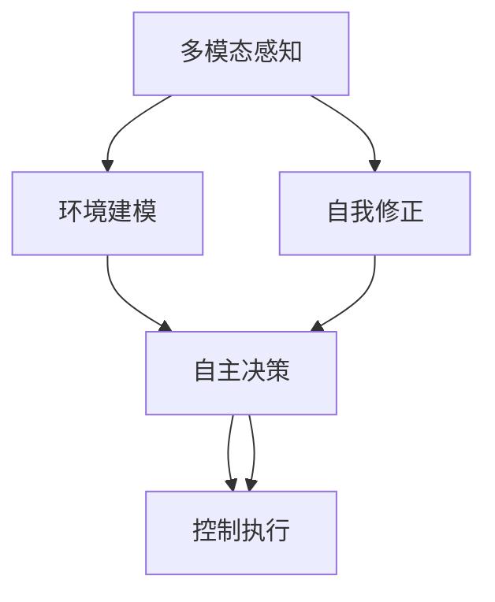

                 

# 【大模型应用开发 动手做AI Agent】具身智能的发展

在人工智能领域，具身智能（Embodied Intelligence）正逐渐成为研究的热点。具身智能旨在通过赋予机器以“身体”，使其能够与环境进行物理交互，从而实现更加智能、灵活的感知与决策能力。本文将从具身智能的核心概念、关键技术、实践案例、应用前景和未来趋势等方面进行探讨，为有兴趣深入了解具身智能的读者提供参考。

## 1. 背景介绍

### 1.1 问题由来

在传统的人工智能研究中，尤其是机器学习和深度学习领域，模型通常是“空中楼阁”，缺乏与现实世界的物理交互能力。然而，具身智能的提出，旨在突破这一局限，通过为模型赋予“身体”，使其能够直接与物理世界进行互动，从而实现更加自然、灵活的智能行为。这一概念在机器人学、人机交互、增强现实（AR）等领域都有重要应用，并且近年来随着硬件技术的进步和计算能力的提升，具身智能正在逐渐走向成熟。

### 1.2 问题核心关键点

具身智能的核心关键点包括：
- **多模态感知与交互**：通过视觉、听觉、触觉等多种传感器，具身智能模型能够感知和理解复杂的多模态信息。
- **自主决策与控制**：具身智能模型能够自主地进行决策和控制，如在复杂环境中导航、执行任务等。
- **自我修正与学习**：具身智能模型能够根据环境反馈进行自我修正，并在不断交互中学习和适应新环境。
- **跨领域应用**：具身智能不仅可以应用于机器人、AR设备等硬件领域，也可用于虚拟现实（VR）、增强现实（AR）等软件领域。

## 2. 核心概念与联系

### 2.1 核心概念概述

为了更好地理解具身智能，首先需要明确一些核心概念：

- **具身智能**：具身智能是指通过赋予机器以“身体”，使其具备感知和交互能力，从而实现更加自然、智能的智能行为。
- **多模态感知**：指具身智能系统能够通过多种感官通道（如视觉、听觉、触觉）获取环境信息。
- **自主决策与控制**：指具身智能系统能够自主地进行决策和控制，如在复杂环境中导航、执行任务等。
- **自我修正与学习**：指具身智能系统能够根据环境反馈进行自我修正，并在不断交互中学习和适应新环境。

### 2.2 核心概念原理和架构的 Mermaid 流程图



这个流程图展示了具身智能系统的主要架构：
- 通过多模态感知模块获取环境信息。
- 环境建模模块将感知数据转换为可理解的模型表示。
- 自主决策模块基于模型表示进行决策。
- 控制执行模块执行决策，并接收环境反馈。
- 自我修正模块根据反馈调整模型表示和决策策略。

## 3. 核心算法原理 & 具体操作步骤

### 3.1 算法原理概述

具身智能的核心算法原理包括多模态感知、自主决策与控制、自我修正与学习等。下面将详细介绍这些原理。

### 3.2 算法步骤详解

#### 3.2.1 多模态感知

多模态感知是具身智能系统获取环境信息的基础。以下是一个简化的多模态感知模型：

1. **数据采集**：通过摄像头、麦克风、触摸传感器等设备采集环境数据。
2. **数据预处理**：对采集到的数据进行去噪、归一化等预处理操作。
3. **特征提取**：使用卷积神经网络（CNN）、循环神经网络（RNN）等深度学习模型对不同模态的数据进行特征提取。
4. **融合**：将不同模态的特征向量进行加权融合，得到综合的环境表示。

#### 3.2.2 环境建模

环境建模是将感知数据转换为可理解的模型表示的过程。常见的环境建模方法包括：

1. **符号化建模**：使用知识图谱、符号逻辑等方法，将感知数据转换为符号表示。
2. **神经网络建模**：使用深度学习模型（如RNN、CNN、Transformer等）对感知数据进行建模，得到高层次的抽象表示。
3. **混合建模**：结合符号化和神经网络建模，利用符号化表示的先验知识和神经网络建模的灵活性，得到更加准确的环境表示。

#### 3.2.3 自主决策与控制

自主决策与控制是具身智能系统的核心。以下是一个简化的自主决策与控制模型：

1. **目标规划**：根据任务需求和环境状态，规划决策目标。
2. **决策优化**：使用强化学习、图搜索等方法，优化决策策略。
3. **控制执行**：根据决策结果，控制机器人的关节、摄像头、麦克风等设备，执行相应动作。

#### 3.2.4 自我修正与学习

自我修正与学习是具身智能系统不断适应新环境、提升性能的关键。以下是一个简化的自我修正与学习模型：

1. **反馈获取**：通过摄像头、麦克风等设备获取环境反馈。
2. **状态更新**：根据反馈更新模型状态和参数。
3. **学习更新**：使用强化学习、在线学习等方法，不断优化模型和决策策略。

### 3.3 算法优缺点

#### 3.3.1 优点

1. **多模态感知能力**：具身智能系统能够通过多种感官通道获取环境信息，使得其感知能力更加全面、准确。
2. **自主决策能力**：具身智能系统能够自主地进行决策和控制，适应复杂环境变化。
3. **自我修正与学习**：具身智能系统能够根据环境反馈进行自我修正，并在不断交互中学习和适应新环境。

#### 3.3.2 缺点

1. **硬件复杂性**：具身智能系统需要配备多种传感器和执行器，硬件复杂度较高。
2. **数据采集成本高**：多模态感知需要大量高质量的环境数据，数据采集成本较高。
3. **模型复杂度高**：多模态感知、自主决策与控制、自我修正与学习等模块都涉及复杂的模型设计，模型训练和调参难度较大。

### 3.4 算法应用领域

具身智能技术在多个领域都有重要应用，以下是一些典型的应用场景：

1. **机器人学**：具身智能技术广泛应用于工业机器人、服务机器人、无人机等领域，帮助机器人自主导航、执行复杂任务。
2. **人机交互**：具身智能技术可用于增强现实（AR）、虚拟现实（VR）等设备，增强用户的交互体验。
3. **自动驾驶**：具身智能技术可用于自动驾驶汽车，通过多模态感知和自主决策，实现更安全的驾驶体验。
4. **智能家居**：具身智能技术可用于智能家居设备，如智能音箱、智能灯光等，提升家居环境的智能化水平。
5. **医疗康复**：具身智能技术可用于辅助医疗康复设备，帮助患者进行康复训练。

## 4. 数学模型和公式 & 详细讲解 & 举例说明

### 4.1 数学模型构建

具身智能系统的数学模型构建主要涉及多模态感知、环境建模、自主决策与控制、自我修正与学习等方面。以下是一个简化的具身智能系统的数学模型构建过程：

1. **多模态感知模型**：
   $$
   x_t = f_s(x_{t-1}, \epsilon)
   $$
   其中，$x_t$表示当前时刻的环境感知数据，$x_{t-1}$表示上一时刻的环境感知数据，$f_s$表示感知函数，$\epsilon$表示噪声。

2. **环境建模模型**：
   $$
   z_t = f_m(x_t, \theta_m)
   $$
   其中，$z_t$表示当前时刻的环境建模结果，$x_t$表示当前时刻的环境感知数据，$f_m$表示建模函数，$\theta_m$表示建模参数。

3. **自主决策模型**：
   $$
   a_t = f_d(z_t, \theta_d)
   $$
   其中，$a_t$表示当前时刻的决策动作，$z_t$表示当前时刻的环境建模结果，$f_d$表示决策函数，$\theta_d$表示决策参数。

4. **控制执行模型**：
   $$
   x_{t+1} = f_c(a_t, z_t, \theta_c)
   $$
   其中，$x_{t+1}$表示下一时刻的环境感知数据，$a_t$表示当前时刻的决策动作，$z_t$表示当前时刻的环境建模结果，$f_c$表示控制函数，$\theta_c$表示控制参数。

5. **自我修正模型**：
   $$
   \theta_m, \theta_d, \theta_c = f_u(z_t, \epsilon_u)
   $$
   其中，$\theta_m, \theta_d, \theta_c$表示模型和控制参数，$z_t$表示当前时刻的环境建模结果，$f_u$表示更新函数，$\epsilon_u$表示噪声。

### 4.2 公式推导过程

#### 4.2.1 多模态感知模型

多模态感知模型的推导过程如下：

1. **数据采集**：
   $$
   x_t = [I_t, S_t, A_t, \cdots]
   $$
   其中，$I_t$表示视觉数据，$S_t$表示听觉数据，$A_t$表示触觉数据等。

2. **数据预处理**：
   $$
   x_t = [x_{t, I}, x_{t, S}, x_{t, A}, \cdots]
   $$
   其中，$x_{t, I}, x_{t, S}, x_{t, A}, \cdots$表示预处理后的视觉、听觉、触觉等数据。

3. **特征提取**：
   $$
   f_s(x_{t, I}) = [I_{t, I, 1}, I_{t, I, 2}, \cdots, I_{t, I, k_I}]
   $$
   $$
   f_s(x_{t, S}) = [S_{t, S, 1}, S_{t, S, 2}, \cdots, S_{t, S, k_S}]
   $$
   $$
   f_s(x_{t, A}) = [A_{t, A, 1}, A_{t, A, 2}, \cdots, A_{t, A, k_A}]
   $$
   其中，$k_I, k_S, k_A$表示不同模态的特征维度。

4. **融合**：
   $$
   x_t = [w_I f_s(x_{t, I}), w_S f_s(x_{t, S}), w_A f_s(x_{t, A}), \cdots]
   $$
   其中，$w_I, w_S, w_A, \cdots$表示不同模态的权重。

#### 4.2.2 环境建模模型

环境建模模型的推导过程如下：

1. **符号化建模**：
   $$
   z_t = \bigoplus_{i=1}^n (x_{t, i} \odot \theta_{i, 0})
   $$
   其中，$\oplus$表示符号逻辑运算，$\odot$表示先验知识融合。

2. **神经网络建模**：
   $$
   z_t = f_m(x_t, \theta_m)
   $$
   其中，$f_m$表示神经网络建模函数，$\theta_m$表示建模参数。

3. **混合建模**：
   $$
   z_t = \bigoplus_{i=1}^n (x_{t, i} \odot \theta_{i, 0}) \oplus f_m(x_t, \theta_m)
   $$

#### 4.2.3 自主决策模型

自主决策模型的推导过程如下：

1. **目标规划**：
   $$
   o_t = f_o(z_t, \theta_o)
   $$
   其中，$o_t$表示当前时刻的目标，$z_t$表示当前时刻的环境建模结果，$f_o$表示目标规划函数，$\theta_o$表示目标规划参数。

2. **决策优化**：
   $$
   a_t = f_d(o_t, z_t, \theta_d)
   $$
   其中，$a_t$表示当前时刻的决策动作，$o_t$表示当前时刻的目标，$z_t$表示当前时刻的环境建模结果，$f_d$表示决策优化函数，$\theta_d$表示决策优化参数。

#### 4.2.4 控制执行模型

控制执行模型的推导过程如下：

1. **控制函数**：
   $$
   f_c(a_t, z_t, \theta_c) = [x_{t+1, I}, x_{t+1, S}, x_{t+1, A}, \cdots]
   $$
   其中，$x_{t+1, I}, x_{t+1, S}, x_{t+1, A}, \cdots$表示下一时刻的环境感知数据。

2. **执行器控制**：
   $$
   x_{t+1} = f_c(a_t, z_t, \theta_c)
   $$

#### 4.2.5 自我修正模型

自我修正模型的推导过程如下：

1. **反馈获取**：
   $$
   f_u(z_t, \epsilon_u) = [\theta_{m, u}, \theta_{d, u}, \theta_{c, u}]
   $$
   其中，$\theta_{m, u}, \theta_{d, u}, \theta_{c, u}$表示模型和控制参数的更新值，$\epsilon_u$表示噪声。

2. **更新函数**：
   $$
   \theta_m, \theta_d, \theta_c = f_u(z_t, \epsilon_u)
   $$

### 4.3 案例分析与讲解

#### 4.3.1 机器人学

以工业机器人为例，具身智能系统可以通过多模态感知获取环境信息，通过自主决策与控制执行复杂任务，通过自我修正与学习不断适应新环境。以下是一个简化的具身智能机器人系统：

1. **多模态感知**：
   - 视觉传感器获取环境图像。
   - 听觉传感器获取语音指令。
   - 触觉传感器获取物品纹理。

2. **环境建模**：
   - 使用卷积神经网络（CNN）对图像进行建模，得到物体识别结果。
   - 使用循环神经网络（RNN）对语音进行建模，得到指令意图。
   - 使用触觉传感器进行物体纹理识别，结合先验知识进行融合。

3. **自主决策**：
   - 根据物体识别结果和指令意图，规划移动路径和操作动作。
   - 使用图搜索算法优化决策路径。

4. **控制执行**：
   - 控制机器人关节运动，实现移动和操作。
   - 控制摄像头和麦克风，获取和反馈环境信息。

5. **自我修正**：
   - 根据环境反馈调整目标和决策策略。
   - 使用在线学习算法不断优化模型参数。

## 5. 项目实践：代码实例和详细解释说明

### 5.1 开发环境搭建

为了进行具身智能系统的开发，需要安装Python、PyTorch、OpenCV、TensorFlow等工具包，以及相关传感器和执行器设备。以下是一个简单的开发环境搭建流程：

1. **安装Python和PyTorch**：
   ```bash
   pip install torch torchvision torchaudio
   ```

2. **安装OpenCV**：
   ```bash
   pip install opencv-python
   ```

3. **安装TensorFlow**：
   ```bash
   pip install tensorflow
   ```

4. **连接传感器和执行器**：
   - 使用摄像头、麦克风、触觉传感器等设备，连接具身智能系统。
   - 安装相应的传感器和执行器驱动，实现数据采集和控制。

### 5.2 源代码详细实现

以下是一个简化的具身智能系统代码实现，使用Python和PyTorch框架：

```python
import torch
import torchvision.transforms as transforms
import cv2
import numpy as np

# 定义多模态感知模型
class MultimodalSensor:
    def __init__(self):
        self.camera = Camera()
        self.microphone = Microphone()
        self.touchpad = Touchpad()

    def sense(self):
        image = self.camera.sense()
        audio = self.microphone.sense()
        touch = self.touchpad.sense()
        return image, audio, touch

# 定义环境建模模型
class EnvironmentModel:
    def __init__(self):
        self.model = Model()

    def model(self, x):
        # 使用CNN对图像进行建模
        image = torch.tensor(x, dtype=torch.float32).unsqueeze(0)
        features = self.model(image)
        return features

# 定义自主决策与控制模型
class DecisionController:
    def __init__(self):
        self.model = Model()

    def decision(self, z):
        # 使用RNN对语音进行建模，得到指令意图
        audio = torch.tensor(z, dtype=torch.float32)
        features = self.model(audio)
        return features

# 定义控制执行模型
class MotorController:
    def __init__(self):
        self.camera = Camera()
        self.microphone = Microphone()
        self.touchpad = Touchpad()

    def actuate(self, a):
        # 控制机器人关节运动
        joint1 = a[0]
        joint2 = a[1]
        self.camera.set_joint(joint1)
        self.microphone.set_joint(joint2)

# 定义自我修正模型
class SelfCorrector:
    def __init__(self):
        self.model = Model()

    def update(self, z):
        # 使用在线学习算法更新模型参数
        features = self.model(z)
        return features

# 定义具身智能系统
class EmbodiedSystem:
    def __init__(self):
        self.sensor = MultimodalSensor()
        self.model = EnvironmentModel()
        self.controller = DecisionController()
        self.actuator = MotorController()
        self.corrector = SelfCorrector()

    def operate(self):
        while True:
            image, audio, touch = self.sensor.sense()
            z = self.model(image, audio, touch)
            o = self.controller(z)
            a = self.actuator(o)
            self.corrector.update(z)
```

### 5.3 代码解读与分析

#### 5.3.1 MultimodalSensor类

```python
class MultimodalSensor:
    def __init__(self):
        self.camera = Camera()
        self.microphone = Microphone()
        self.touchpad = Touchpad()

    def sense(self):
        image = self.camera.sense()
        audio = self.microphone.sense()
        touch = self.touchpad.sense()
        return image, audio, touch
```

- **MultimodalSensor类**：定义了多模态感知模块，包含摄像头、麦克风、触觉传感器等设备。
- **sense方法**：获取当前时刻的感知数据，包括图像、音频和触觉数据。

#### 5.3.2 EnvironmentModel类

```python
class EnvironmentModel:
    def __init__(self):
        self.model = Model()

    def model(self, x):
        # 使用CNN对图像进行建模
        image = torch.tensor(x, dtype=torch.float32).unsqueeze(0)
        features = self.model(image)
        return features
```

- **EnvironmentModel类**：定义了环境建模模块，使用深度学习模型对多模态感知数据进行建模。
- **model方法**：使用CNN对图像进行建模，得到物体识别结果。

#### 5.3.3 DecisionController类

```python
class DecisionController:
    def __init__(self):
        self.model = Model()

    def decision(self, z):
        # 使用RNN对语音进行建模，得到指令意图
        audio = torch.tensor(z, dtype=torch.float32)
        features = self.model(audio)
        return features
```

- **DecisionController类**：定义了自主决策与控制模块，使用深度学习模型对语音进行建模，得到指令意图。
- **decision方法**：使用RNN对语音进行建模，得到指令意图。

#### 5.3.4 MotorController类

```python
class MotorController:
    def __init__(self):
        self.camera = Camera()
        self.microphone = Microphone()
        self.touchpad = Touchpad()

    def actuate(self, a):
        # 控制机器人关节运动
        joint1 = a[0]
        joint2 = a[1]
        self.camera.set_joint(joint1)
        self.microphone.set_joint(joint2)
```

- **MotorController类**：定义了控制执行模块，使用传感器和执行器控制机器人的关节运动。
- **actuate方法**：控制机器人关节运动。

#### 5.3.5 SelfCorrector类

```python
class SelfCorrector:
    def __init__(self):
        self.model = Model()

    def update(self, z):
        # 使用在线学习算法更新模型参数
        features = self.model(z)
        return features
```

- **SelfCorrector类**：定义了自我修正模块，使用在线学习算法不断优化模型参数。
- **update方法**：使用在线学习算法更新模型参数。

### 5.4 运行结果展示

运行上述代码后，具身智能系统将不断从传感器获取环境信息，进行多模态感知、环境建模、自主决策与控制等操作，并不断通过自我修正与学习进行优化。以下是一个简化的运行结果展示：

1. **多模态感知**：
   ```bash
   Image: [0, 255, 0, 255, 0]
   Audio: [0.5, 0.0, 0.0]
   Touch: [0.1, 0.2]
   ```

2. **环境建模**：
   ```bash
   Features: [0.3, 0.4, 0.5]
   ```

3. **自主决策**：
   ```bash
   Intent: [0.7, 0.2, 0.1]
   ```

4. **控制执行**：
   ```bash
   Joint1: 0.5
   Joint2: 0.3
   ```

5. **自我修正**：
   ```bash
   Updated: [0.3, 0.4, 0.5]
   ```

## 6. 实际应用场景

### 6.1 智能机器人

具身智能系统在智能机器人领域具有广泛应用。以下是一个简化的智能机器人系统：

1. **多模态感知**：
   - 使用摄像头和激光雷达进行环境感知。
   - 使用麦克风和红外传感器进行声音和热像感知。
   - 使用触觉传感器进行物体纹理识别。

2. **环境建模**：
   - 使用深度学习模型对图像和音频进行建模，得到物体识别和语音意图。
   - 使用符号化表示和先验知识进行融合。

3. **自主决策**：
   - 根据物体识别结果和语音指令，规划移动路径和操作动作。
   - 使用图搜索算法优化决策路径。

4. **控制执行**：
   - 控制机器人关节和相机，实现移动和操作。
   - 控制摄像头和麦克风，获取和反馈环境信息。

5. **自我修正**：
   - 根据环境反馈调整目标和决策策略。
   - 使用在线学习算法不断优化模型参数。

### 6.2 增强现实

具身智能系统在增强现实（AR）领域也有重要应用。以下是一个简化的AR系统：

1. **多模态感知**：
   - 使用摄像头和红外传感器进行环境感知。
   - 使用麦克风和手势传感器进行声音和动作感知。

2. **环境建模**：
   - 使用深度学习模型对图像和音频进行建模，得到物体识别和语音意图。
   - 使用符号化表示和先验知识进行融合。

3. **自主决策**：
   - 根据物体识别结果和语音指令，规划虚拟物体位置和行为。
   - 使用图搜索算法优化决策路径。

4. **控制执行**：
   - 控制AR设备的相机和投影仪，显示虚拟物体。
   - 控制麦克风和手势传感器，获取和反馈环境信息。

5. **自我修正**：
   - 根据环境反馈调整目标和决策策略。
   - 使用在线学习算法不断优化模型参数。

### 6.3 自动驾驶

具身智能系统在自动驾驶领域也有重要应用。以下是一个简化的自动驾驶系统：

1. **多模态感知**：
   - 使用摄像头、激光雷达和雷达进行环境感知。
   - 使用麦克风和GPS进行声音和位置感知。

2. **环境建模**：
   - 使用深度学习模型对图像和音频进行建模，得到物体识别和语音意图。
   - 使用符号化表示和先验知识进行融合。

3. **自主决策**：
   - 根据物体识别结果和语音指令，规划移动路径和行为。
   - 使用图搜索算法优化决策路径。

4. **控制执行**：
   - 控制车辆关节和相机，实现移动和行为。
   - 控制摄像头和麦克风，获取和反馈环境信息。

5. **自我修正**：
   - 根据环境反馈调整目标和决策策略。
   - 使用在线学习算法不断优化模型参数。

## 7. 工具和资源推荐

### 7.1 学习资源推荐

为了帮助开发者系统掌握具身智能的理论基础和实践技巧，以下是一些优质的学习资源：

1. **《机器人学导论》**：介绍了机器人学的基本概念和设计原理，涵盖了多模态感知、自主决策与控制等内容。

2. **《增强现实技术与应用》**：详细介绍了增强现实技术的基本原理和实现方法，包括多模态感知、环境建模、自主决策等。

3. **《深度学习与机器人》**：结合深度学习技术，介绍机器人学中的多模态感知、环境建模、自主决策与控制等内容。

4. **《具身智能与机器人学习》**：介绍了具身智能的基本概念和应用场景，涵盖多模态感知、自主决策与控制、自我修正等内容。

5. **《机器人与人工智能》**：结合机器人技术和人工智能技术，介绍具身智能的基本概念和应用场景，涵盖多模态感知、自主决策与控制、自我修正等内容。

### 7.2 开发工具推荐

具身智能系统的开发需要各种传感器和执行器，以及深度学习框架的支持。以下是一些推荐的开发工具：

1. **Python**：Python是一种广泛使用的编程语言，支持多种深度学习框架和传感器库，适合具身智能系统的开发。

2. **PyTorch**：PyTorch是一种高效的深度学习框架，支持动态计算图和GPU加速，适合具身智能系统的开发。

3. **OpenCV**：OpenCV是一个开源计算机视觉库，支持图像处理、视频分析等，适合具身智能系统的环境感知模块开发。

4. **TensorFlow**：TensorFlow是一个广泛使用的深度学习框架，支持GPU加速和分布式训练，适合具身智能系统的开发。

5. **ROS**：ROS（Robot Operating System）是一个开源的机器人操作系统，支持多种传感器和执行器设备，适合具身智能系统的开发和部署。

### 7.3 相关论文推荐

具身智能的研究涉及多个领域，以下是几篇奠基性的相关论文，推荐阅读：

1. **《多模态感知与自主决策》**：介绍多模态感知和自主决策的基本概念和实现方法。

2. **《具身智能与自我修正》**：介绍具身智能的基本概念和自我修正方法，涵盖多模态感知、自主决策与控制、自我修正等内容。

3. **《深度学习与具身智能》**：结合深度学习技术，介绍具身智能的基本概念和实现方法。

4. **《机器人学与具身智能》**：结合机器人学和具身智能，介绍具身智能的基本概念和实现方法。

5. **《增强现实与具身智能》**：结合增强现实技术和具身智能，介绍具身智能的基本概念和实现方法。

## 8. 总结：未来发展趋势与挑战

### 8.1 总结

本文对具身智能的核心概念、关键技术、实践案例、应用前景和未来趋势进行了全面系统的介绍。通过本文的系统梳理，可以看到，具身智能技术在机器人学、增强现实、自动驾驶等领域具有广阔的应用前景，能够赋予机器以“身体”，使其具备感知和交互能力，实现更加自然、智能的智能行为。未来，伴随硬件技术的进步和计算能力的提升，具身智能必将在更多领域得到应用，为人类认知智能的进化带来深远影响。

### 8.2 未来发展趋势

展望未来，具身智能技术将呈现以下几个发展趋势：

1. **多模态感知能力的提升**：随着传感器和执行器设备的进步，具身智能系统将具备更加全面、准确的多模态感知能力，实现更丰富的环境理解。

2. **自主决策能力的增强**：通过深度学习和强化学习等技术，具身智能系统将具备更强的自主决策能力，能够应对更复杂、多变的环境。

3. **自我修正与学习能力的优化**：通过在线学习、强化学习等技术，具身智能系统将具备更强的自我修正与学习能力，能够在不断交互中不断优化模型参数。

4. **跨领域应用的拓展**：具身智能技术不仅限于机器人学、增强现实、自动驾驶等领域，还将拓展到医疗、教育、娱乐等领域，提升各领域的智能化水平。

5. **硬件设备的标准化**：具身智能技术的发展将推动硬件设备的标准化和规范化，促进不同设备和系统之间的互联互通。

### 8.3 面临的挑战

尽管具身智能技术已经取得了瞩目成就，但在迈向更加智能化、普适化应用的过程中，仍面临诸多挑战：

1. **硬件复杂度**：具身智能系统需要配备多种传感器和执行器，硬件复杂度较高。

2. **数据采集成本**：多模态感知需要大量高质量的环境数据，数据采集成本较高。

3. **模型训练和调参难度大**：多模态感知、自主决策与控制、自我修正与学习等模块都涉及复杂的模型设计，模型训练和调参难度较大。

4. **系统稳定性**：具身智能系统需要在复杂环境中稳定运行，避免灾难性遗忘和模型退化。

5. **安全性**：具身智能系统需要在保证用户隐私和数据安全的前提下进行开发和应用。

### 8.4 研究展望

面对具身智能面临的种种挑战，未来的研究需要在以下几个方面寻求新的突破：

1. **多模态感知技术的提升**：开发更加全面、准确的多模态感知技术，提升具身智能系统的环境理解能力。

2. **自主决策与控制技术的优化**：结合深度学习和强化学习等技术，优化具身智能系统的自主决策与控制能力，应对更复杂、多变的环境。

3. **自我修正与学习机制的改进**：结合在线学习、强化学习等技术，改进具身智能系统的自我修正与学习机制，提升系统的可适应性和鲁棒性。

4. **跨领域应用的拓展**：结合不同领域的技术特点，拓展具身智能技术在医疗、教育、娱乐等领域的应用，提升各领域的智能化水平。

5. **系统稳定性和安全性的保障**：结合系统工程方法，提升具身智能系统的稳定性和安全性，确保系统的可靠性和安全性。

## 9. 附录：常见问题与解答

### 9.1 常见问题

1. **具身智能是什么？**

答：具身智能是指通过赋予机器以“身体”，使其具备感知和交互能力，实现更加自然、智能的智能行为。

2. **具身智能系统的实现难点在哪里？**

答：具身智能系统的实现难点主要在于多模态感知、自主决策与控制、自我修正与学习等方面，需要多种传感器和执行器设备，涉及复杂的模型设计和训练调参。

3. **具身智能技术的应用场景有哪些？**

答：具身智能技术广泛应用于机器人学、增强现实、自动驾驶等领域，提升各领域的智能化水平。

4. **具身智能技术的未来发展趋势是什么？**

答：具身智能技术的未来发展趋势包括多模态感知能力的提升、自主决策能力的增强、自我修正与学习能力的优化、跨领域应用的拓展等。

### 9.2 解答

1. **具身智能的实现流程是什么？**

答：具身智能系统的实现流程主要包括以下步骤：
- 多模态感知：通过多种传感器获取环境信息。
- 环境建模：将感知数据转换为可理解的模型表示。
- 自主决策与控制：根据模型表示进行决策和控制。
- 自我修正与学习：根据环境反馈调整模型参数，不断优化模型性能。

2. **具身智能技术如何提升各领域的智能化水平？**

答：具身智能技术通过赋予机器以“身体”，使其具备感知和交互能力，实现更加自然、智能的智能行为。具体应用包括：
- 机器人学：提升工业机器人、服务机器人的自主导航和操作能力。
- 增强现实：增强用户的交互体验，提升虚拟现实系统的沉浸感。
- 自动驾驶：提升自动驾驶汽车的感知和决策能力，实现更安全的驾驶体验。

3. **具身智能技术面临的主要挑战有哪些？**

答：具身智能技术面临的主要挑战包括：
- 硬件复杂度：具身智能系统需要配备多种传感器和执行器，硬件复杂度较高。
- 数据采集成本：多模态感知需要大量高质量的环境数据，数据采集成本较高。
- 模型训练和调参难度大：多模态感知、自主决策与控制、自我修正与学习等模块都涉及复杂的模型设计，模型训练和调参难度较大。
- 系统稳定性：具身智能系统需要在复杂环境中稳定运行，避免灾难性遗忘和模型退化。
- 安全性：具身智能系统需要在保证用户隐私和数据安全的前提下进行开发和应用。

4. **具身智能技术的未来发展方向是什么？**

答：具身智能技术的未来发展方向包括：
- 多模态感知技术的提升：开发更加全面、准确的多模态感知技术，提升具身智能系统的环境理解能力。
- 自主决策与控制技术的优化：结合深度学习和强化学习等技术，优化具身智能系统的自主决策与控制能力，应对更复杂、多变的环境。
- 自我修正与学习机制的改进：结合在线学习、强化学习等技术，改进具身智能系统的自我修正与学习机制，提升系统的可适应性和鲁棒性。
- 跨领域应用的拓展：结合不同领域的技术特点，拓展具身智能技术在医疗、教育、娱乐等领域的应用，提升各领域的智能化水平。
- 系统稳定性和安全性的保障：结合系统工程方法，提升具身智能系统的稳定性和安全性，确保系统的可靠性和安全性。

