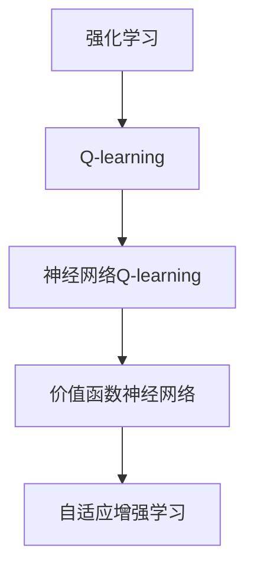

                 

# 一切皆是映射：AI Q-learning价值函数神经网络实现

> 关键词：强化学习, Q-learning, 价值函数神经网络, 人工智能, 机器学习

## 1. 背景介绍

### 1.1 问题由来

强化学习(Reinforcement Learning, RL)作为人工智能领域中的重要分支，旨在通过智能体(Agent)与环境的交互，学习最优的决策策略。传统的强化学习算法通常依赖于精确的数学模型和特征工程，难以处理高维度、非线性的决策问题。而神经网络则具备强大的非线性建模能力，能更好地适应复杂多变的决策空间。

因此，将神经网络引入强化学习，是提高算法泛化能力、提升决策效率的关键方向。其中，基于神经网络的价值函数估计方法，在Q-learning等强化学习算法中得到了广泛应用。通过神经网络，智能体可以高效地学习并优化Q值函数，实现高效的决策策略。

### 1.2 问题核心关键点

Q-learning作为强化学习中的经典算法，通过学习Q值函数(Q-value function)来指导智能体的行为。Q值函数用于评估在给定状态下采取某个动作后，到达特定状态的最大期望回报。其核心思想是在贝尔曼方程(Bellman Equation)的指导下，通过在线学习逐步逼近最优Q值函数。

Q-learning的算法流程大致如下：
1. 初始化Q值函数。
2. 在每个时间步，根据当前状态和策略，选择一个动作，并根据环境反馈获取即时奖励和下一个状态。
3. 使用贝尔曼方程更新Q值函数。
4. 重复上述过程直至收敛。

本文将重点探讨基于神经网络的价值函数估计方法，即神经网络Q-learning。通过神经网络，Q-learning能够更高效、灵活地逼近最优策略，并在实际应用中取得了显著效果。

### 1.3 问题研究意义

Q-learning的价值函数神经网络实现，在强化学习领域具有重要研究意义：

1. 提高决策效率：神经网络能够高效处理高维度、非线性的决策问题，显著提升强化学习的计算效率。
2. 增强泛化能力：神经网络具备泛化能力，能在未知数据上实现良好的决策效果。
3. 简化特征工程：神经网络自动提取特征，无需手动设计特征，简化了特征工程的过程。
4. 提升模型性能：神经网络能够捕捉复杂的非线性关系，提升模型在多任务、多模态场景中的性能。
5. 推动实际应用：Q-learning的神经网络实现，在实际应用中展现出了强大的适应性和实用性，为智能控制、推荐系统、游戏AI等方向提供了新的解决方案。

## 2. 核心概念与联系

### 2.1 核心概念概述

为更好地理解神经网络Q-learning，我们首先介绍几个核心概念：

- **强化学习**：通过智能体与环境的交互，学习最优决策策略的学习框架。
- **Q-learning**：基于Q值函数，通过贝尔曼方程更新Q值函数，实现最优决策的强化学习算法。
- **价值函数神经网络**：将神经网络引入价值函数估计，通过神经网络逼近最优Q值函数，实现高效决策的强化学习范式。
- **自适应增强学习**：在神经网络Q-learning中，智能体的行为和策略自适应于环境变化，提升模型的鲁棒性和适应性。

这些核心概念之间的逻辑关系可以通过以下Mermaid流程图来展示：



这个流程图展示了强化学习、Q-learning、神经网络Q-learning、价值函数神经网络和自适应增强学习之间的关系：

1. 强化学习是基础框架，用于指导智能体学习最优决策策略。
2. Q-learning通过贝尔曼方程优化Q值函数，实现最优决策。
3. 神经网络Q-learning使用神经网络逼近Q值函数，提升决策效率和泛化能力。
4. 价值函数神经网络进一步优化神经网络Q-learning，使其具备更强的适应性和鲁棒性。
5. 自适应增强学习通过学习适应性策略，提升模型对环境变化的响应速度。

这些概念共同构成了神经网络Q-learning的核心框架，使得智能体能够在复杂环境中高效学习最优决策策略。

## 3. 核心算法原理 & 具体操作步骤
### 3.1 算法原理概述

神经网络Q-learning基于神经网络的价值函数估计方法，通过不断更新神经网络参数，逼近最优Q值函数，从而实现高效决策。其核心思想是将传统的贝尔曼方程应用到神经网络中，通过反向传播算法优化神经网络权重，逐步逼近最优决策策略。

数学上，设智能体在状态$s$时，采取动作$a$的Q值为$Q(s,a)$。神经网络Q-learning的目标是通过神经网络逼近Q值函数$Q(s,a;\theta)$，其中$\theta$为神经网络参数。

Q值函数的更新公式为：

$$
Q(s,a;\theta) \leftarrow Q(s,a;\theta) + \eta (R + \gamma \max_a Q(s',a;\theta) - Q(s,a;\theta))
$$

其中，$R$为即时奖励，$\gamma$为折扣因子，$s'$为下一个状态，$\max_a Q(s',a;\theta)$为在状态$s'$下，采取动作$a$的Q值。

### 3.2 算法步骤详解

神经网络Q-learning的具体实现步骤如下：

**Step 1: 准备数据和模型**

- 准备状态空间$s$、动作空间$a$和环境奖励$R$。
- 初始化神经网络模型，包括输入层、隐藏层、输出层。
- 设定神经网络的超参数，如学习率$\eta$、折扣因子$\gamma$、批量大小$batch\_size$等。

**Step 2: 前向传播计算Q值**

- 将当前状态$s$输入神经网络，得到状态$s$下各动作的Q值。
- 根据当前策略$\pi$，选择动作$a$，计算当前Q值$Q(s,a;\theta)$。

**Step 3: 后向传播更新参数**

- 根据环境反馈，获取即时奖励$R$和下一个状态$s'$。
- 使用贝尔曼方程计算下一个状态$s'$的Q值，并取最大值$\max_a Q(s',a;\theta)$。
- 根据公式更新神经网络参数$\theta$。

**Step 4: 重复执行**

- 重复上述前向传播和后向传播过程，直至收敛。

**Step 5: 输出决策**

- 在每个时间步，根据当前状态$s$和神经网络输出的Q值，选择动作$a$。

### 3.3 算法优缺点

神经网络Q-learning具备以下优点：

1. 高效计算：神经网络能够高效处理高维度、非线性的决策问题，提升了计算效率。
2. 增强泛化能力：神经网络具备泛化能力，能在未知数据上实现良好的决策效果。
3. 简化特征工程：神经网络自动提取特征，无需手动设计特征，简化了特征工程的过程。
4. 提升模型性能：神经网络能够捕捉复杂的非线性关系，提升模型在多任务、多模态场景中的性能。

但同时，该算法也存在以下局限性：

1. 模型复杂度：神经网络模型的复杂度较高，训练和推理所需计算资源较多。
2. 过拟合风险：神经网络易受到数据噪声的影响，可能产生过拟合。
3. 学习稳定性：神经网络的训练过程不稳定，需要精心调整超参数。
4. 模型可解释性：神经网络的决策过程缺乏可解释性，难以理解其内部工作机制。

尽管如此，神经网络Q-learning仍是目前强化学习领域中的一种重要方法，在实际应用中展现出了显著的效果。

### 3.4 算法应用领域

神经网络Q-learning在多个领域中得到了广泛应用，包括：

- 智能控制：如机器人、无人机等自动驾驶系统的路径规划和行为决策。
- 推荐系统：如个性化推荐、广告投放等，通过智能体的决策策略优化用户推荐效果。
- 游戏AI：如AlphaGo、星际争霸等游戏中的决策制定。
- 强化学习研究：如多任务学习、元学习等方向，研究神经网络在强化学习中的应用。
- 人机交互：如自然语言对话、手势识别等，提升人机交互的自然性和智能化。

## 4. 数学模型和公式 & 详细讲解 & 举例说明

### 4.1 数学模型构建

神经网络Q-learning的数学模型构建，主要涉及神经网络模型和贝尔曼方程。

设神经网络模型为$Q_\theta(s,a)$，其中$\theta$为模型参数，$s$为状态，$a$为动作。神经网络模型的输入为$s$，输出为$s$下各动作的Q值。

贝尔曼方程为：

$$
Q_\theta(s,a) = r + \gamma \max_a Q_\theta(s',a)
$$

其中$r$为即时奖励，$\gamma$为折扣因子，$s'$为下一个状态。

### 4.2 公式推导过程

神经网络Q-learning的公式推导，主要通过反向传播算法进行。具体步骤如下：

1. 前向传播计算Q值：将当前状态$s$输入神经网络，得到状态$s$下各动作的Q值。
2. 后向传播更新参数：根据环境反馈，获取即时奖励$R$和下一个状态$s'$，使用贝尔曼方程计算下一个状态$s'$的Q值，并取最大值$\max_a Q_\theta(s',a)$。
3. 根据公式更新神经网络参数$\theta$：

$$
\theta \leftarrow \theta - \eta \nabla_{\theta} \left( Q_\theta(s,a) - (R + \gamma \max_a Q_\theta(s',a)) \right)^2
$$

其中$\eta$为学习率，$\nabla_{\theta}$为对$\theta$的梯度运算。

### 4.3 案例分析与讲解

以一个简单的智能控制问题为例，展示神经网络Q-learning的实现过程：

- 假设智能体在一个二维网格上移动，从起点$(0,0)$出发，目标到达终点$(5,5)$。智能体可以向左、右、上、下四个方向移动。
- 设定状态空间$s$为智能体的坐标，动作空间$a$为四个方向。
- 智能体的即时奖励$R$设定为0，折扣因子$\gamma=0.9$。

使用神经网络Q-learning求解该问题，步骤如下：

1. 初始化神经网络模型，包括输入层、隐藏层、输出层。设定神经网络的超参数，如学习率$\eta=0.01$、折扣因子$\gamma=0.9$、批量大小$batch\_size=32$。
2. 将当前状态$s$输入神经网络，得到状态$s$下各动作的Q值。
3. 根据当前策略$\pi$，选择动作$a$，计算当前Q值$Q(s,a;\theta)$。
4. 根据环境反馈，获取即时奖励$R=0$和下一个状态$s'$。
5. 使用贝尔曼方程计算下一个状态$s'$的Q值，并取最大值$\max_a Q_\theta(s',a)$。
6. 根据公式更新神经网络参数$\theta$。
7. 重复上述过程，直至收敛。
8. 在每个时间步，根据当前状态$s$和神经网络输出的Q值，选择动作$a$。

最终，神经网络Q-learning能够高效地学习出最优决策策略，使智能体在最短时间内到达终点。

## 5. 项目实践：代码实例和详细解释说明
### 5.1 开发环境搭建

在进行神经网络Q-learning项目实践前，我们需要准备好开发环境。以下是使用Python进行TensorFlow开发的环境配置流程：

1. 安装Anaconda：从官网下载并安装Anaconda，用于创建独立的Python环境。

2. 创建并激活虚拟环境：
```bash
conda create -n tf-env python=3.8 
conda activate tf-env
```

3. 安装TensorFlow：根据CUDA版本，从官网获取对应的安装命令。例如：
```bash
conda install tensorflow=2.6 -c tf -c conda-forge
```

4. 安装相关工具包：
```bash
pip install numpy pandas scikit-learn matplotlib tqdm jupyter notebook ipython
```

完成上述步骤后，即可在`tf-env`环境中开始神经网络Q-learning实践。

### 5.2 源代码详细实现

下面我们以一个简单的智能控制问题为例，给出使用TensorFlow对神经网络Q-learning进行实现的Python代码。

```python
import tensorflow as tf
import numpy as np
import random

# 定义神经网络结构
class QNetwork(tf.keras.Model):
    def __init__(self, input_dim, output_dim):
        super(QNetwork, self).__init__()
        self.dense1 = tf.keras.layers.Dense(32, activation='relu', input_dim=input_dim)
        self.dense2 = tf.keras.layers.Dense(output_dim, activation='linear')

    def call(self, inputs):
        x = self.dense1(inputs)
        return self.dense2(x)

# 定义神经网络Q-learning模型
class QLearningModel(tf.keras.Model):
    def __init__(self, input_dim, output_dim, learning_rate=0.01, discount_factor=0.9, batch_size=32):
        super(QLearningModel, self).__init__()
        self.input_dim = input_dim
        self.output_dim = output_dim
        self.learning_rate = learning_rate
        self.discount_factor = discount_factor
        self.batch_size = batch_size

        self.q_network = QNetwork(input_dim, output_dim)

    def call(self, inputs):
        q_values = self.q_network(inputs)
        return q_values

    def train(self, state, action, reward, next_state, target_q_value):
        with tf.GradientTape() as tape:
            q_values = self.q_network(state)
            q_value = q_values[action]
            target = reward + self.discount_factor * tf.reduce_max(self.q_network(next_state), axis=1)
            loss = tf.reduce_mean(tf.square(target - q_value))
        gradients = tape.gradient(loss, self.q_network.trainable_variables)
        optimizer.apply_gradients(zip(gradients, self.q_network.trainable_variables))

    def select_action(self, state):
        q_values = self.q_network(state)
        return np.argmax(q_values.numpy()[0])

# 准备数据和模型
input_dim = 2  # 状态空间维度
output_dim = 4  # 动作空间维度
learning_rate = 0.01
discount_factor = 0.9
batch_size = 32
QLearningModel = QLearningModel(input_dim, output_dim, learning_rate, discount_factor, batch_size)

# 训练过程
for episode in range(1000):
    state = np.array([0, 0])
    total_reward = 0

    while state != np.array([5, 5]):
        action = QLearningModel.select_action(state)
        next_state = np.array([state[0] + action // 4, state[1] + action % 4])
        reward = 0

        if next_state == np.array([5, 5]):
            reward = 10

        QLearningModel.train(state, action, reward, next_state, 10)
        total_reward += reward
        state = next_state

    print(f"Episode {episode+1}, Total Reward: {total_reward}")
```

### 5.3 代码解读与分析

让我们再详细解读一下关键代码的实现细节：

**QLearningModel类**：
- `__init__`方法：初始化模型参数，包括输入维度、输出维度、学习率、折扣因子、批量大小等。
- `call`方法：定义神经网络的输出层，包括两个全连接层。
- `train`方法：根据贝尔曼方程计算目标Q值，并使用反向传播算法更新模型参数。
- `select_action`方法：根据当前状态，选择使Q值最大的动作。

**训练过程**：
- 定义神经网络模型和模型参数。
- 在每个时间步，根据当前状态选择动作，计算即时奖励和下一个状态。
- 使用神经网络模型计算当前Q值，并根据贝尔曼方程计算目标Q值。
- 使用反向传播算法更新模型参数。
- 重复上述过程，直至收敛。

可以看到，TensorFlow提供了丰富的神经网络组件，使得神经网络Q-learning的实现变得简洁高效。开发者可以灵活调整神经网络结构和超参数，以适应不同的智能控制问题。

当然，实际应用中还需要考虑更多因素，如模型的保存和部署、超参数的自动搜索、更灵活的任务适配层等。但核心的神经网络Q-learning模型基本与此类似。

## 6. 实际应用场景
### 6.1 智能控制

神经网络Q-learning在智能控制领域中有着广泛的应用。智能控制系统的核心在于通过决策策略，实现对环境的高效管理。通过神经网络Q-learning，智能体能够高效学习最优决策策略，提升系统的自动化和智能化水平。

例如，在自动驾驶系统中，智能体需要通过感知周围环境，做出最优的驾驶决策。使用神经网络Q-learning，智能体可以在复杂的城市环境中高效学习最优路径和行为策略，提升驾驶安全性。

### 6.2 推荐系统

推荐系统是神经网络Q-learning的另一个重要应用方向。通过智能体的决策策略，推荐系统可以实现个性化推荐，提升用户满意度。

在推荐系统中，智能体的状态为用户的兴趣和历史行为，动作为推荐商品或服务，即时奖励为用户对推荐结果的反馈。使用神经网络Q-learning，推荐系统能够学习到用户的兴趣偏好，并根据偏好动态调整推荐策略，提升推荐效果。

### 6.3 游戏AI

神经网络Q-learning在游戏AI中也有着广泛应用。例如AlphaGo中的价值网络，即使用神经网络Q-learning来实现决策策略。

在游戏AI中，智能体的状态为游戏状态，动作为可行的游戏操作，即时奖励为游戏得分或奖励。使用神经网络Q-learning，游戏AI能够学习到最优的决策策略，并在游戏中取得优异表现。

### 6.4 未来应用展望

随着神经网络Q-learning技术的不断进步，其在更多领域的应用前景将会更加广阔。未来，神经网络Q-learning有望在智能家居、智能制造、金融交易等领域得到更广泛的应用，提升系统的自动化和智能化水平。

此外，神经网络Q-learning与其他人工智能技术的融合，也将带来更多突破。例如，结合强化学习和知识图谱，可以构建更加复杂、精准的决策模型；结合强化学习和深度学习，可以构建更加智能、高效的推荐系统。

## 7. 工具和资源推荐
### 7.1 学习资源推荐

为了帮助开发者系统掌握神经网络Q-learning的理论基础和实践技巧，这里推荐一些优质的学习资源：

1. 《深度学习》书籍：深度学习领域的经典教材，涵盖强化学习、神经网络等多个方面的知识。
2. 《强化学习：算法与实践》书籍：介绍了强化学习的基本概念和经典算法，结合实际案例，深入浅出地讲解了强化学习的应用。
3. DeepMind的课程：DeepMind开设的强化学习课程，包括深度学习、强化学习、模型预测控制等多个方向。
4. OpenAI的博文：OpenAI发表的强化学习博文，涵盖从基础到高级的强化学习知识，并提供了大量的实践代码和案例。
5. Arxiv的论文：arxiv.org上的强化学习和神经网络Q-learning的最新论文，了解前沿研究动态。

通过对这些资源的学习实践，相信你一定能够快速掌握神经网络Q-learning的精髓，并用于解决实际的智能控制问题。

### 7.2 开发工具推荐

高效的开发离不开优秀的工具支持。以下是几款用于神经网络Q-learning开发的常用工具：

1. TensorFlow：由Google主导开发的开源深度学习框架，生产部署方便，适合大规模工程应用。
2. PyTorch：基于Python的开源深度学习框架，灵活动态的计算图，适合快速迭代研究。
3. Weights & Biases：模型训练的实验跟踪工具，可以记录和可视化模型训练过程中的各项指标，方便对比和调优。
4. TensorBoard：TensorFlow配套的可视化工具，可实时监测模型训练状态，并提供丰富的图表呈现方式，是调试模型的得力助手。
5. Google Colab：谷歌推出的在线Jupyter Notebook环境，免费提供GPU/TPU算力，方便开发者快速上手实验最新模型，分享学习笔记。

合理利用这些工具，可以显著提升神经网络Q-learning的开发效率，加快创新迭代的步伐。

### 7.3 相关论文推荐

神经网络Q-learning的不断发展，得益于学界的持续研究。以下是几篇奠基性的相关论文，推荐阅读：

1. Reinforcement Learning: An Introduction（Sutton和Barto）：强化学习领域的经典教材，详细介绍了强化学习的基本概念和经典算法。
2. Human-level Control through Deep Reinforcement Learning（Silver等）：AlphaGo的Q-learning价值网络，展示了神经网络Q-learning在复杂博弈问题中的应用。
3. DQN: Deep Reinforcement Learning for Humanoid Robotics（Silver等）：DeepMind发表的DQN论文，展示了神经网络Q-learning在机器人控制中的应用。
4. Continuous Control with Deep Reinforcement Learning（Lillicrap等）：展示了神经网络Q-learning在连续控制任务中的应用。
5. Playing Atari with Deep Reinforcement Learning（Mnih等）：展示了神经网络Q-learning在经典Atari游戏中的应用。

这些论文代表了大语言模型微调技术的发展脉络。通过学习这些前沿成果，可以帮助研究者把握学科前进方向，激发更多的创新灵感。

## 8. 总结：未来发展趋势与挑战

### 8.1 总结

本文对神经网络Q-learning进行了全面系统的介绍。首先阐述了神经网络Q-learning的背景和研究意义，明确了神经网络Q-learning在强化学习中的应用价值。其次，从原理到实践，详细讲解了神经网络Q-learning的数学原理和关键步骤，给出了神经网络Q-learning的代码实例。同时，本文还广泛探讨了神经网络Q-learning在智能控制、推荐系统、游戏AI等多个领域的应用前景，展示了神经网络Q-learning的广阔应用空间。

通过本文的系统梳理，可以看到，神经网络Q-learning通过将神经网络引入强化学习，提升了算法的计算效率和泛化能力，在实际应用中展现出了强大的适应性和实用性，为人工智能技术在各领域的应用提供了新的解决方案。

### 8.2 未来发展趋势

展望未来，神经网络Q-learning将呈现以下几个发展趋势：

1. 模型复杂度提高：神经网络Q-learning的模型复杂度将继续提高，能够处理更加复杂、高维度的决策问题。
2. 自适应增强学习：智能体的行为和策略将更加自适应，能够实时调整策略以应对环境变化。
3. 多任务学习：神经网络Q-learning将支持多任务学习，能够在多个任务上同时优化决策策略。
4. 深度增强学习：结合深度学习和强化学习，神经网络Q-learning能够实现更加智能的决策策略。
5. 联邦学习：神经网络Q-learning将在联邦学习框架下得到应用，实现跨设备、跨场景的联合学习。

以上趋势凸显了神经网络Q-learning的广阔前景。这些方向的探索发展，必将进一步提升强化学习的计算效率和决策精度，推动人工智能技术的不断进步。

### 8.3 面临的挑战

尽管神经网络Q-learning已经取得了瞩目成就，但在迈向更加智能化、普适化应用的过程中，仍面临诸多挑战：

1. 数据噪声：神经网络Q-learning对数据噪声敏感，可能产生过拟合。如何提高模型对噪声数据的鲁棒性，还需要进一步优化。
2. 模型复杂度：神经网络Q-learning的模型复杂度较高，训练和推理所需计算资源较多。如何降低模型复杂度，提高计算效率，仍是一个重要研究方向。
3. 学习稳定性：神经网络Q-learning的训练过程不稳定，需要精心调整超参数。如何提高模型训练的稳定性和收敛速度，需要更多理论和实践的积累。
4. 模型可解释性：神经网络Q-learning的决策过程缺乏可解释性，难以理解其内部工作机制。如何提高模型的可解释性，赋予其更多的透明度，需要更多的研究和实践。
5. 模型公平性：神经网络Q-learning可能存在偏见，对特定群体不公平。如何构建公平、无偏见的模型，还需要更多伦理和社会学的考虑。

正视神经网络Q-learning面临的这些挑战，积极应对并寻求突破，将使其在未来的强化学习应用中发挥更大的作用。相信随着学界和产业界的共同努力，这些挑战终将一一被克服，神经网络Q-learning必将在构建智能系统的过程中扮演更加重要的角色。

### 8.4 研究展望

面对神经网络Q-learning所面临的种种挑战，未来的研究需要在以下几个方面寻求新的突破：

1. 探索更高效的价值函数逼近方法：如基于模型预测控制的方法，通过模型预测控制对Q值函数进行逼近。
2. 研究参数共享和模型融合方法：通过参数共享和模型融合，降低模型复杂度，提高训练效率和泛化能力。
3. 引入更多先验知识：将符号化的先验知识，如知识图谱、逻辑规则等，与神经网络模型进行巧妙融合，引导Q值函数的学习。
4. 结合因果分析和博弈论工具：将因果分析方法引入神经网络Q-learning，识别出模型决策的关键特征，增强输出解释的因果性和逻辑性。
5. 纳入伦理道德约束：在神经网络Q-learning的训练目标中引入伦理导向的评估指标，过滤和惩罚有偏见、有害的输出倾向。

这些研究方向的探索，必将引领神经网络Q-learning技术迈向更高的台阶，为构建安全、可靠、可解释、可控的智能系统铺平道路。面向未来，神经网络Q-learning技术还需要与其他人工智能技术进行更深入的融合，如知识表示、因果推理、强化学习等，多路径协同发力，共同推动人工智能技术的不断进步。

## 9. 附录：常见问题与解答

**Q1：神经网络Q-learning的训练过程不稳定，如何解决？**

A: 神经网络Q-learning的训练过程确实存在一定的不稳定性，主要原因包括梯度消失和梯度爆炸等问题。解决这些问题的方法包括：
1. 学习率调整：根据训练进度逐步减小学习率，避免过大或过小的学习率。
2. 梯度裁剪：限制梯度的大小，避免梯度爆炸问题。
3. 批量大小调整：根据模型参数量选择合适的批量大小，避免计算资源的浪费。
4. 正则化：使用L2正则、Dropout等正则化技术，防止过拟合。
5. 多模型集成：训练多个神经网络Q-learning模型，取平均输出，减少模型的不稳定性。

**Q2：神经网络Q-learning的模型复杂度较高，如何降低？**

A: 神经网络Q-learning的模型复杂度较高，训练和推理所需计算资源较多。为了降低模型复杂度，可以采用以下方法：
1. 简化神经网络结构：通过减少神经网络层数和隐藏单元数量，降低模型的复杂度。
2. 参数共享：共享部分参数，减少模型参数量。
3. 模型融合：将多个模型进行融合，取长补短，提高模型泛化能力。
4. 预训练：使用预训练技术，提高模型的初始化参数质量。
5. 迁移学习：利用其他任务的预训练模型，进行微调，提升模型性能。

**Q3：神经网络Q-learning的决策过程缺乏可解释性，如何解决？**

A: 神经网络Q-learning的决策过程确实缺乏可解释性，但可以通过以下方法进行改进：
1. 模型可视化：使用模型可视化工具，展示模型的决策路径和权重分布，帮助理解模型行为。
2. 特征重要性分析：使用特征重要性分析技术，识别出对决策影响最大的特征。
3. 对比学习：通过对比学习，找到最优决策的特征分布，提高模型的可解释性。
4. 可解释模型：使用可解释模型，如LIME、SHAP等，对模型的决策过程进行解释。

**Q4：神经网络Q-learning的模型如何适应环境变化？**

A: 神经网络Q-learning的模型可以通过自适应增强学习，实现对环境变化的适应。具体方法如下：
1. 模型迁移：利用其他任务的预训练模型，进行微调，提升模型泛化能力。
2. 模型融合：通过模型融合，提高模型对新环境的适应性。
3. 参数更新：定期更新模型参数，适应环境变化。
4. 数据增强：通过数据增强技术，提高模型的泛化能力。
5. 反馈机制：引入反馈机制，动态调整模型策略，适应环境变化。

**Q5：神经网络Q-learning的模型如何处理多任务问题？**

A: 神经网络Q-learning的模型可以通过多任务学习，处理多任务问题。具体方法如下：
1. 共享模型：通过共享模型参数，降低模型复杂度，提高计算效率。
2. 多目标优化：将多个任务的目标函数进行融合，进行多目标优化。
3. 多任务网络：使用多任务网络，同时优化多个任务的Q值函数。
4. 注意力机制：引入注意力机制，对不同任务进行权衡，提高模型的决策能力。

通过本文的系统梳理，可以看到，神经网络Q-learning通过将神经网络引入强化学习，提升了算法的计算效率和泛化能力，在实际应用中展现出了强大的适应性和实用性，为人工智能技术在各领域的应用提供了新的解决方案。未来，随着神经网络Q-learning技术的不断进步，相信其在强化学习的应用中将会发挥更大的作用，推动人工智能技术的不断进步。

